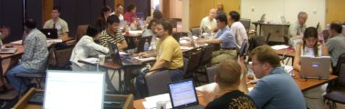
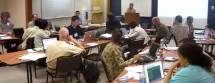
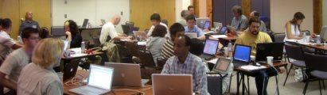
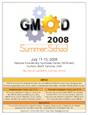
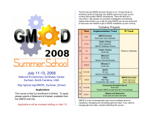

# 2008 GMOD Summer School

From GMOD

Jump to: [navigation](#mw-navigation), [search](#p-search)

<table
style="font-size: 180%; vertical-align: middle; border: 2px solid #A6A6BC; line-height: 120%"
data-cellpadding="10">
<colgroup>
<col style="width: 50%" />
<col style="width: 50%" />
</colgroup>
<tbody>
<tr class="odd">
<td>

</td>
<td data-valign="center"><strong>2008 GMOD Summer School</strong> 
 
July 11-13, 2008 
<a href="http://nescent.org" class="external text"
rel="nofollow">National Evolutionary Synthesis 
  Center (NESCent)</a> 
Durham, North Carolina, USA</td>
</tr>
<tr class="even">
<td colspan="2">

</td>
</tr>
</tbody>
</table>

  
The first annual <a href="GMOD_Summer_School" class="mw-redirect"
title="GMOD Summer School">GMOD Summer School</a> was a 2 1/2 day
hands-on workshop aimed at teaching new GMOD users how to get up and
running with popular GMOD components such as
[Apollo](Apollo.1 "Apollo"),
<a href="Chado" class="mw-redirect" title="Chado">Chado</a>,
[CMap](CMap.1 "CMap"), and [GBrowse](GBrowse.1 "GBrowse"). Participants
included 25 students and 4 instructors, from 19 states and 4 countries.
It was held at the <a href="http://nescent.org" class="external text"
rel="nofollow">National Evolutionary Synthesis Center (NESCent)</a> in
Durham, North Carolina, USA, July 11-13, 2008.

## Contents

- [1
  Program](#Program)
  - [1.1
    Instructors](#Instructors)
- [2 Who
  Attended?](#Who_Attended.3F)
- [3
  Prerequisites](#Prerequisites)
  - [3.1 System
    Requirements](#System_Requirements)
- [4 Cost and
  Registration](#Cost_and_Registration)
- [5
  Transportation, Lodging, and
  Meals](#Transportation.2C_Lodging.2C_and_Meals)
- [6 Posters and
  Fliers](#Posters_and_Fliers)
- [7
  Acknowledgments and
  Feedback](#Acknowledgments_and_Feedback)

# Program

|  |  |
|----|----|
| The program featured two and half days of hands on training starting with an overview of GMOD and then covering installation and configuration of popular GMOD tools, include <a href="Chado" class="mw-redirect" title="Chado">Chado</a>, [GBrowse](GBrowse.1 "GBrowse"), [CMap](CMap.1 "CMap"), [Apollo](Apollo.1 "Apollo"), and the [Community Annotation System](Community_Annotation_System "Community Annotation System"). |  |

<table class="wikitable" data-border="1" data-cellpadding="5"
data-cellspacing="0">
<colgroup>
<col style="width: 50%" />
<col style="width: 50%" />
</colgroup>
<thead>
<tr class="header">
<th width="15%" style="background-color: #FFBBAA">Time</th>
<th style="background-color: #d6eee4">Session</th>
</tr>
</thead>
<tbody>
<tr class="odd">
<th colspan="2" style="background-color: #FFDDCC">Friday July 11</th>
</tr>
&#10;<tr class="odd">
<td style="background-color: #FFCCBB">9am - 10:30am</td>
<td style="text-align: center; background-color: #d6fff5;"><strong>GMOD
Overview</strong> 
<a href="User:Scott" title="User:Scott">Scott Cain</a> and <a
href="User:Clements" title="User:Clements">Dave Clements</a> 
Participant and instructor introductions, how the GMOD project works,
what software tools are available in GMOD, how they interoperate, what
resources are needed to get a GMOD installation up and running, course
overview, and installing VMware appliances on student computers.</td>
</tr>
<tr class="even">
<td style="background-color: #FFCCBB">10:30am - Noon</td>
<td style="text-align: center; background-color: #d6fff5;"><strong><a
href="Chado" class="mw-redirect" title="Chado">Chado</a>:
Theory</strong> 
<a href="User:Clements" title="User:Clements">Dave Clements</a> 
Architecture and logical design of the Chado database <a
href="Glossary#Schema" title="Glossary">schema</a>: Chado's modules and
extensibility, how IDs and database cross references are handled, the
central role of <a href="Category:Ontologies"
title="Category:Ontologies">ontologies/controlled vocabularies</a>, and
an overview of how sequence data is handled.</td>
</tr>
<tr class="odd">
<td style="background-color: #FFCCBB">Noon - 1pm</td>
<td style="text-align: center; background-color: #d6fff5;"><strong>Lunch
Break</strong> 
<a href="http://www.ninthst.com/eat.html" class="external text"
rel="nofollow">Places to eat</a> 
<a href="http://nescent.org" class="external text"
rel="nofollow">NESCent</a> is adjacent to <a
href="http://www.ninthst.com/" class="external text"
rel="nofollow">Durham's 9th Street District</a>.</td>
</tr>
<tr class="even">
<td style="background-color: #FFCCBB">1pm - 3pm</td>
<td style="text-align: center; background-color: #d6fff5;"><strong><a
href="Chado" class="mw-redirect" title="Chado">Chado</a>:
Practice</strong> 
<a href="User:Scott" title="User:Scott">Scott Cain</a> 
Using Chado: Installation, importing and exporting data, and a complete
worked example of loading example sequence data.</td>
</tr>
<tr class="odd">
<td style="background-color: #FFCCBB">3pm - 5pm</td>
<td style="text-align: center; background-color: #d6fff5;"><strong><a
href="GBrowse.1" title="GBrowse">GBrowse</a> 1</strong> 
<a href="User:Scott" title="User:Scott">Scott Cain</a> 
Overview, GBrowse installation and using <a href="GBrowse_adaptors"
class="mw-redirect" title="GBrowse adaptors">GBrowse adaptors</a></td>
</tr>
<tr class="even">
<td style="background-color: #FFCCBB">5pm - 6pm</td>
<td
style="text-align: center; background-color: #d6fff5;"><strong>Social
Hour</strong> 
Get to know your fellow GMOD Summer School participants, the
instructors, and <a href="http://www.nescent.org/dir/"
class="external text" rel="nofollow">NESCent researchers</a>.</td>
</tr>
<tr class="odd">
<td style="background-color: #FFCCBB">6pm - 7:30pm</td>
<td
style="text-align: center; background-color: #d6fff5;"><strong>Dinner
Break</strong> 
<a href="http://www.ninthst.com/eat.html" class="external text"
rel="nofollow">Places to eat</a></td>
</tr>
<tr class="even">
<td style="background-color: #FFCCBB">7:30pm - 9:30pm</td>
<td style="text-align: center; background-color: #d6fff5;"><strong>Open
Discussion</strong> 
<a href="User:Scott" title="User:Scott">Scott</a>, <a
href="User:Clements" title="User:Clements">Dave</a>, <a href="User:Faga"
title="User:Faga">Ben</a>, Ed, and <em><strong>You!</strong></em> 
This <em>optional</em> session is open to any and all questions you have
on the GMOD Project, GMOD components, and GMOD users. The instructors
will come with their knowledge of GMOD and their opinions on the
project's strengths, weaknesses, and future directions. We expect this
to be lively.</td>
</tr>
<tr class="odd">
<td colspan="2" style="background-color: #FFF6CC">Saturday July 12</td>
</tr>
<tr class="even">
<td style="background-color: #FFE5BB">9am - 11:30pm</td>
<td style="text-align: center; background-color: #d6fff5;"><strong><a
href="GBrowse.1" title="GBrowse">GBrowse</a> 2</strong> 
<a href="User:Scott" title="User:Scott">Scott Cain</a> 
GBrowse Configuration: Changing defaults and displays, adding tracks,
and performance tuning</td>
</tr>
<tr class="odd">
<td style="background-color: #FFE5BB">11:30pm - 12:30pm</td>
<td style="text-align: center; background-color: #d6fff5;"><strong>Lunch
Break</strong> 
<a href="http://www.ninthst.com/eat.html" class="external text"
rel="nofollow">Places to eat</a></td>
</tr>
<tr class="even">
<td style="background-color: #FFE5BB">12:30pm - 4pm</td>
<td style="text-align: center; background-color: #d6fff5;"><strong><a
href="Apollo.1" title="Apollo">Apollo</a></strong> 
Ed Lee 
Overview, installation, configuration, reading/writing data, setting up
a Java WebStart instance.</td>
</tr>
<tr class="odd">
<td style="background-color: #FFE5BB">4pm - 5pm</td>
<td style="text-align: center; background-color: #d6fff5;"><strong><a
href="CMap.1" title="CMap">CMap</a> 1</strong> 
<a href="User:Faga" title="User:Faga">Ben Faga</a> 
Overview, installation, configuration and data importation.</td>
</tr>
<tr class="even">
<td style="background-color: #FFE5BB">5pm - 6:30pm</td>
<td
style="text-align: center; background-color: #d6fff5;"><strong>Dinner
Break</strong> 
<a href="http://www.ninthst.com/eat.html" class="external text"
rel="nofollow">Places to eat</a></td>
</tr>
<tr class="odd">
<td style="background-color: #FFE5BB">6:30pm - 9pm</td>
<td style="text-align: center; background-color: #d6fff5;"><strong><a
href="CMap.1" title="CMap">CMap</a> 2</strong> 
<a href="User:Faga" title="User:Faga">Ben Faga</a> 
Overview, installation, configuration and data importation.</td>
</tr>
<tr class="even">
<td colspan="2" style="background-color: #FFF6DD">Sunday July 13</td>
</tr>
<tr class="odd">
<td style="background-color: #FFE5CC">9am - 12:30pm</td>
<td style="text-align: center; background-color: #d6fff5;"><strong><a
href="Community_Annotation_System"
title="Community Annotation System">Community Annotation
System</a></strong> 
<a href="User:Scott" title="User:Scott">Scott Cain</a> 
How to install and configure the GMOD Community Annotation System, an
integrated package of GMOD components (including all the ones covered in
this course) that reduces much of the installation, integration, and
configuration work of doing each component individually.</td>
</tr>
<tr class="even">
<td style="background-color: #FFE5CC">12:30 - 1pm</td>
<td
style="text-align: center; background-color: #d6fff5;"><strong>Wrapup
and Resources</strong> 
<a href="User:Scott" title="User:Scott">Scott Cain</a> and <a
href="User:Clements" title="User:Clements">Dave Clements</a> 
Describe the resources available to GMOD users and attempt to bring the
course to a coherent close.</td>
</tr>
</tbody>
</table>

## Instructors

Sessions were taught by experienced GMOD personnel, including:

- [Scott Cain](User:Scott "User:Scott") - GMOD Project Coordinator
- [Dave Clements](User:Clements "User:Clements") - [GMOD Help
  Desk](GMOD_Help_Desk "GMOD Help Desk")
- [Ben Faga](User:Faga "User:Faga") - [CMap](CMap.1 "CMap") and
  [GBrowse](GBrowse.1 "GBrowse") developer
- Ed Lee - [Apollo](Apollo.1 "Apollo") developer

# Who Attended?

The GMOD Summer School was attended by people implementing GMOD at their
organizations, and by Principal Investigators whose organizations have
adopted GMOD. The course went into detail about how to install and
configure GMOD components. It was aimed primarily at [GMOD System
Administrators](Computing_Requirements "Computing Requirements"), the
people who actually implement and manage a GMOD installation on a day to
day basis. This course was for organizations either planning to use GMOD
components, or in the early phases of implementing GMOD.

| Participant | Affiliation |
|----|----|
| Feseha Abebe-Akele | University of New Hampshire |
| Parker Antin | University of Arizona |
| Burcu Bakir-Gungor | Medical College of Wisconsin, RGD |
| [Scott Cain](User:Scott "User:Scott") | CSHL |
| [Dave Clements](User:Clements "User:Clements") | NESCent |
| Matthew Conte | Howard Hughes Medical Institute |
| Sean Davey | University of Arizona, BirdBase |
| Victor de Jager | Radboud University Nijmegen Medical Centre |
| Jason Dzurisin | University of Notre Dame |
| [Ben Faga](User:Faga "User:Faga") | CSHL |
| Bob Freeman | Harvard University Medical School |
| Jean-Pierre Gauthier | INRA |
| Glenn Harris | Virgina State University |
| Erik Hom | Harvard University |
| Zhiliang Hu | Iowa State University |
| Li Jin | University of Delaware |
| Ed Johnson | University of Georgia |
| Ed Lee | BBOP |
| Fabrice Legeai | INRA |
| Xianhua Liu | NESCent |
| Prashanti Manda | Mississippi State University |
| Tom McNeill | Syngenta Biotechnology |
| Christos Noutsos | University of Chicago |
| Jason Phillips | University of North Carolina |
| Joan Pontius | National Cancer Institute |
| Sarah Richardson | Johns Hopkins University |
| Stéphanie Sidibe-Bocs | CIRAD |
| Brett Whitty | Michigan State University |
| Andy Wu | Washington State University |

# Prerequisites

*The course requires a minimal level of Linux systems administration
knowledge* (see [Computing
Requirements](Computing_Requirements "Computing Requirements")). By "a
minimal level of Linux systems administration knowledge" we mean that
participants should be comfortable installing packages under Linux. *A
good benchmark for this level of knowledge is that you should be able to
get a basic [GBrowse
installation](GBrowse_Install_HOWTO "GBrowse Install HOWTO") (that is,
GBrowse without [MySQL](MySQL "MySQL")) up and running with the example
GBrowse data.* This also requires installing Apache, and
[BioPerl](BioPerl "BioPerl") and all its dependencies.

## System Requirements

VMware on Windows and Linux

A free VMware player is available for [Microsoft
Windows](Category:Windows "Category:Windows") and
[Linux](Category:Linux "Category:Linux") [operating
systems](Glossary#Operating_System "Glossary") from
<a href="http://vmware.com/products/player/" class="external text"
rel="nofollow">VMware</a>. You will need to register to download it.

  

VMware on Mac OS X

Participants can also bring *newer Macs with Intel processors*. The
Intel processor is a requirement for all the packages discussed below.

There is no free VMware player that runs *directly* under [Mac OS
X](Category:Mac_OS_X "Category:Mac OS X"). However, there are several
other options, *all of which require an Intel Mac*:

  

VMware Fusion

<a href="http://www.vmware.com/products/fusion/" class="external text"
rel="nofollow">VMware Fusion</a> ({{{1}}}) allows you to run VMware
images, Windows and Linux under Mac OS. **We recommend this option for
Mac users. There is a fully functional, 30 day free trial version of
VMware Fusion available for download.**

  

Mac OS 10.5 (Leopard) and Boot Camp

The <a href="http://www.apple.com/macosx/" class="external text"
rel="nofollow">Leopard release of Mac OS (10.5)</a> includes
<a href="http://www.apple.com/macosx/features/bootcamp.html"
class="external text" rel="nofollow">Boot Camp</a>, a feature that
allows you to boot your Mac into another operating system, including
Windows or Linux. From there you can install the VMware player for your
OS.\*

**\*** *Apple tells you that you can partition your disk drive at any
time using Boot Camp. In practice, this appears to only work easily when
you first get your system.*

# Cost and Registration

There was no tuition cost for the GMOD Summer School. Participants were
responsible for their own travel, lodging and meal expenses.

The course was full with a waiting list. Due to last minute
cancellations and the flexibility of applicants we were able to get
everyone who applied into the course (and we still had a full course).

# Transportation, Lodging, and Meals

Participants were responsible for their own transportation, lodging and
meals. Everyone who flew, came in through
<a href="http://www.rdu.com/" class="external text"
rel="nofollow">Raleigh-Durham International Airport (RDU)</a>, a 30
minute drive from NESCent. Most participants stayed at
<a href="http://www.millenniumhotels.com/millenniumdurham/index.html"
class="external text" rel="nofollow">Millennium Hotel Durham</a>, which
provided a free shuttle to and from NESCent.

NESCent is adjacent to
<a href="http://www.ninthst.com/" class="external text"
rel="nofollow">Durham's 9th Street District</a> where
participants ate most of their meals.

# Posters and Fliers

**Note:** Both of these posters are now out of date. The PI Track has
now been combined with the Implementation track, and the schedule
details shown on the second one have now changed.

<table class="wikitable" width="60%">
<colgroup>
<col style="width: 50%" />
<col style="width: 50%" />
</colgroup>
<tbody>
<tr class="odd">
<td style="text-align: center;" data-valign="top"> 
<a href="../mediawiki/images/7/75/SummerSchoolPoster2008.pdf"
class="internal" title="SummerSchoolPoster2008.pdf">Download</a> 
A poster (US Letter size) announcing the 2008 GMOD Summer School.</td>
<td style="text-align: center;" data-valign="top"> 
<a href="../mediawiki/images/3/30/GMODSummerSchoolFlier2008.pdf"
class="internal"
title="GMODSummerSchoolFlier2008.pdf">Download</a> 
A flier with the schedule on it also available.</td>
</tr>
</tbody>
</table>

# Acknowledgments and Feedback

The 2008 GMOD Summer School was funded by <a
href="http://crisp.cit.nih.gov/crisp/CRISP_LIB.getdoc?textkey=7234938&amp;p_grant_num=1R01HG004483-01&amp;p_query=&amp;ticket=&amp;p_audit_session_id=&amp;p_keywords="
class="external text" rel="nofollow">NIH grant 1R01HG004483-01</a> under
<a href="http://biowiki.org/IanHolmes" class="external text"
rel="nofollow">Ian Holmes</a>.

*Comments on the **2008 GMOD Summer School***

<table data-cellspacing="2"
style="border: 2px solid #A6A6BC; margin: 1em; padding: 1em">
<colgroup>
<col style="width: 50%" />
<col style="width: 50%" />
</colgroup>
<tbody>
<tr class="odd">
<td style="text-align: center;"><em>“This was a very smooth course. All
of the programs were focused, and well prepared. The instructions on the
wiki were clear and the support from the instructors was very
lively.”</em></td>
<td>“Great job everybody!” 
 
<em>“Overall an exceptional
experience!”</em></td>
</tr>
<tr class="even">
<td style="text-align: center;">“Well
done!” 
 
&#10;
<em><strong>“Great job all
around.”</strong></em>
</td>
<td style="text-align: center;">“I was very impressed by everyone
involved in putting on the school. It was very apparent that they had
gone the extra mile and really cared about the quality of the
classes.” 
 </td>
</tr>
<tr class="odd">
<td style="text-align: center; font-size: 130%;">“Thank you very much
for this first GMOD Summer School.”</td>
<td style="text-align: center;">“The
course was what I was expecting and more.”</td>
</tr>
</tbody>
</table>

Retrieved from
"<http://gmod.org/mediawiki/index.php?title=2008_GMOD_Summer_School&oldid=25680>"

[Categories](Special:Categories "Special:Categories"):

- [GMOD Community](Category:GMOD_Community "Category:GMOD Community")
- [Help](Category:Help "Category:Help")
- [Education and
  Outreach](Category:Education_and_Outreach "Category:Education and Outreach")
- [Events](Category:Events "Category:Events")
- [GMOD Schools](Category:GMOD_Schools "Category:GMOD Schools")

## Navigation menu

### Namespaces

- <a href="2008_GMOD_Summer_School" accesskey="c"
  title="View the content page [c]">Page</a>
- <a
  href="http://gmod.org/mediawiki/index.php?title=Talk:2008_GMOD_Summer_School&amp;action=edit&amp;redlink=1"
  accesskey="t"
  title="Discussion about the content page [t]">Discussion</a>

### 

### Variants

### Navigation

- [GMOD Home](Main_Page)
- [Software](GMOD_Components)
- [Categories /
  Tags](Categories)
- [View all pages](Special:AllPages)

### Documentation

- [Overview](Overview)
- [FAQs](Category:FAQ)
- [HOWTOs](Category:HOWTO)
- [Glossary](Glossary)

### Community

- [GMOD News](GMOD_News)
- [Training /
  Outreach](Training_and_Outreach)
- [Support](Support)
- [GMOD Promotion](GMOD_Promotion)
- [Meetings](Meetings)
- [Calendar](Calendar)

### Tools

- <a href="Special:Browse/2008_GMOD_Summer_School" rel="smw-browse">Browse
  properties</a>
- [Print as
  PDF](http://gmod.org/mediawiki/index.php?title=Special:PdfPrint&page=2008_GMOD_Summer_School)

- Last updated at 22:11 on 16 April
  2014.
<!-- - 314,604 page views. -->
- Content is available under
  <a href="http://www.gnu.org/licenses/fdl-1.3.html" class="external"
  rel="nofollow">a GNU Free Documentation License</a> unless otherwise
  noted.

<!-- -->

- [About
  GMOD](GMOD:About "GMOD:About")

<!-- -->

- 
- 
  

