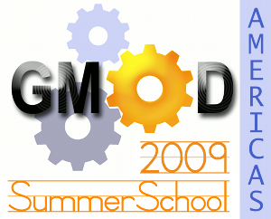

# 2009 GMOD Summer School - Americas

From GMOD

Jump to: [navigation](#mw-navigation), [search](#p-search)

<table style="vertical-align: middle; border: 2px solid #A6A6BC"
data-cellpadding="10">
<colgroup>
<col style="width: 50%" />
<col style="width: 50%" />
</colgroup>
<tbody>
<tr class="odd">
<td>

</td>
<td><strong>2009 GMOD
Summer School - Americas</strong> 
16-19 July, 2009 
<a href="http://www.nescent.org/" class="external text"
rel="nofollow">NESCent</a> 
Durham, NC, USA</td>
</tr>
</tbody>
</table>

The ***2009 GMOD Summer School - Americas*** was held 16-19 July at the
<a href="http://www.nescent.org/" class="external text"
rel="nofollow">National Evolutionary Synthesis Center (NESCent)</a> in
Durham, North Carolina. Like the [2008 GMOD Summer
School](2008_GMOD_Summer_School "2008 GMOD Summer School"), this course
focused on installing, configuring and integrating popular [GMOD
Components](GMOD_Components "GMOD Components").

The course wiki is
<a href="https://www.nescent.org/courses/2009/gmod/Americas"
class="external text" rel="nofollow">here</a> (login required).

Another <a href="GMOD_Summer_School" class="mw-redirect"
title="GMOD Summer School">GMOD Summer School</a> was offered in
[Oxford, UK in August,
2009](2009_GMOD_Summer_School_-_Europe "2009 GMOD Summer School - Europe"),
as part of [GMOD Europe 2009](GMOD_Europe_2009 "GMOD Europe 2009").

## Contents

- [1
  Program](#Program)
- [2
  Instructors](#Instructors)
- [3
  Prerequisites](#Prerequisites)
  - [3.1 System
    Requirements](#System_Requirements)
- [4
  Cost](#Cost)
- [5
  Feedback](#Feedback)

## Program

The program featured 4 full days of hands-on training starting with an
overview of GMOD, and then covering the installation, configuration, and
administration of several popular [GMOD
Components](GMOD_Components "GMOD Components").

The summer school GMOD component sessions are available as [online
tutorials](Training_and_Outreach#Online_Tutorials "Training and Outreach").
To access the tutorials, follow the links for
<a href="MAKER_Tutorial" class="mw-redirect"
title="MAKER Tutorial">MAKER</a>,
<a href="JBrowse_Tutorial" class="mw-redirect"
title="JBrowse Tutorial">JBrowse</a>,
<a href="Chado_Tutorial" class="mw-redirect"
title="Chado Tutorial">Chado</a>,
<a href="Apollo_Tutorial" class="mw-redirect"
title="Apollo Tutorial">Apollo</a>,
[GBrowse](GBrowse_Tutorial "GBrowse Tutorial"),
[BioMart](BioMart_Tutorial "BioMart Tutorial"),
<a href="GBrowse_syn_Tutorial" class="mw-redirect"
title="GBrowse syn Tutorial">GBrowse_syn</a>, and
<a href="Tripal_Tutorial" class="mw-redirect"
title="Tripal Tutorial">Tripal</a>

<table class="wikitable" data-border="1" data-cellpadding="5"
data-cellspacing="0">
<colgroup>
<col style="width: 50%" />
<col style="width: 50%" />
</colgroup>
<thead>
<tr class="header">
<th width="7%" style="background-color: #99ccff">Time</th>
<th width="93%" style="background-color: #99ccff">Session</th>
</tr>
</thead>
<tbody>
<tr class="odd">
<td colspan="2"></td>
</tr>
<tr class="even">
<td colspan="2" style="background-color: #bbffff">Thursday 
July 16</td>
</tr>
<tr class="odd">
<td style="background-color: #ccffff">8:45am</td>
<td
style="text-align: center; background-color: #ddffff;"><strong>Introduction
and Overview</strong> 
<a href="User%3AScott" title="User%3AScott">Scott Cain</a> and <a
href="User%3AClements" title="User%3AClements">Dave Clements</a> 
Participant and instructor introductions, how the GMOD project works,
what software tools are available in GMOD, how they interoperate, what
resources are needed to get a GMOD installation up and running, and
course overview</td>
</tr>
<tr class="even">
<td style="background-color: #ccffff">10:25am</td>
<td style="text-align: center; background-color: #ddffff;"><strong><a
href="http://gmod.org/mediawiki/index.php?title=VMware&amp;action=edit&amp;redlink=1"
class="new" title="VMware (page does not exist)">VMware</a> and <a
href="BioPerl" title="BioPerl">BioPerl</a> Setup</strong> 
<strong>Everyone</strong> 
Get the GMOD Summer School <a href="#System_Requirements">VMware</a>
image up and running on your laptop, and then finish installation of <a
href="BioPerl" title="BioPerl">BioPerl</a>.</td>
</tr>
<tr class="odd">
<td style="background-color: #ccffff">12:15pm</td>
<td
style="text-align: center; background-color: #ddffff;"><strong>Lunch</strong> 
<a href="http://www.ninthst.com/" class="external text"
rel="nofollow">on your own</a></td>
</tr>
<tr class="even">
<td style="background-color: #ccffff">1:15pm</td>
<td style="text-align: center; background-color: #ddffff;"><strong><a
href="MAKER_Tutorial" class="mw-redirect" title="MAKER Tutorial">MAKER
I</a></strong> 
<a href="User%3ACarsonholt" title="User%3ACarsonholt">Carson Holt</a> 
<a href="MAKER.1" title="MAKER">MAKER</a> overview, installation, and
basic configuration for annotating genomic sequence</td>
</tr>
<tr class="odd">
<td style="background-color: #ccffff">4:30pm</td>
<td
style="text-align: center; background-color: #ddffff;"><strong>Social
Hour w/ <a href="http://www.nescent.org/dir/" class="external text"
rel="nofollow">NESCent Staff</a></strong> 
and then <strong>Dinner</strong> <a href="http://www.ninthst.com/"
class="external text" rel="nofollow">on your own</a></td>
</tr>
<tr class="even">
<td style="background-color: #ccffff">6:30pm</td>
<td style="text-align: center; background-color: #ddffff;"><strong><a
href="MAKER_Tutorial" class="mw-redirect" title="MAKER Tutorial">MAKER
II</a></strong> 
<a href="User%3ACarsonholt" title="User%3ACarsonholt">Carson Holt</a> 
Advanced <a href="MAKER.1" title="MAKER">MAKER</a> configuration,
re-annotation options, and improving annotation quality</td>
</tr>
<tr class="odd">
<td style="background-color: #ccffff">7:30pm</td>
<td style="text-align: center; background-color: #ddffff;"><strong><a
href="JBrowse_Tutorial" class="mw-redirect"
title="JBrowse Tutorial">JBrowse</a></strong> 
<a href="User%3AMitchSkinner" title="User%3AMitchSkinner">Mitch
Skinner</a> 
<a href="JBrowse.1" title="JBrowse">JBrowse</a> installation,
configuration and administration; converting <a href="GFF3"
title="GFF3">GFF3</a> to <a href="Glossary#JSON"
title="Glossary">JSON</a> and loading it into JBrowse.</td>
</tr>
<tr class="even">
<td style="background-color: #ccffff">9:00pm</td>
<td style="text-align: center; background-color: #ddffff;">Day ends</td>
</tr>
<tr class="odd">
<td colspan="2"></td>
</tr>
<tr class="even">
<td colspan="2" style="background-color: #bbffcc">Friday 
July 17</td>
</tr>
<tr class="odd">
<td style="background-color: #ccffdd">8:45am</td>
<td style="text-align: center; background-color: #ddffdd;"><strong><a
href="Chado_Tutorial" class="mw-redirect" title="Chado Tutorial">Chado
I</a></strong> 
<a href="User%3AScott" title="User%3AScott">Scott Cain</a>, <a
href="User%3AJorvis" title="User%3AJorvis">Joshua Orvis</a>, and <a
href="User%3AClements" title="User%3AClements">Dave Clements</a></td>
</tr>
<tr class="even">
<td style="background-color: #ccffdd">12:30pm</td>
<td
style="text-align: center; background-color: #ddffdd;"><strong>Lunch</strong> 
<a href="http://www.ninthst.com/" class="external text"
rel="nofollow">on your own</a></td>
</tr>
<tr class="odd">
<td style="background-color: #ccffdd">1:30pm</td>
<td style="text-align: center; background-color: #ddffdd;"><strong><a
href="Chado_Tutorial" class="mw-redirect" title="Chado Tutorial">Chado
II</a></strong> 
<a href="User%3AScott" title="User%3AScott">Scott Cain</a>, <a
href="User%3AJorvis" title="User%3AJorvis">Joshua Orvis</a>, and <a
href="User%3AClements" title="User%3AClements">Dave Clements</a></td>
</tr>
<tr class="even">
<td style="background-color: #ccffdd">3:00pm</td>
<td style="text-align: center; background-color: #ddffdd;"><strong><a
href="Apollo_Tutorial" class="mw-redirect"
title="Apollo Tutorial">Apollo I</a></strong> 
<a href="User%3AElee" title="User%3AElee">Ed Lee</a> 
Overview, basic installation, basic configuration, reading/writing data,
and remote analyses.</td>
</tr>
<tr class="odd">
<td style="background-color: #ccffdd">5:30pm</td>
<td
style="text-align: center; background-color: #ddffdd;"><strong>Dinner</strong> 
<a href="http://www.ninthst.com/" class="external text"
rel="nofollow">on your own</a></td>
</tr>
<tr class="even">
<td style="background-color: #ccffdd">7:00pm</td>
<td style="text-align: center; background-color: #ddffdd;"><strong><a
href="Apollo_Tutorial" class="mw-redirect"
title="Apollo Tutorial">Apollo II</a></strong> 
<a href="User%3AElee" title="User%3AElee">Ed Lee</a> 
Custom installation (building Apollo from source), advanced
configuration, and setting up customized Java Web Start instance.</td>
</tr>
<tr class="odd">
<td style="background-color: #ccffdd">9:00pm</td>
<td style="text-align: center; background-color: #ddffdd;">Day ends</td>
</tr>
<tr class="even">
<td colspan="2"></td>
</tr>
<tr class="odd">
<td colspan="2" style="background-color: #ffffaa">Saturday 
July 18</td>
</tr>
<tr class="even">
<td style="background-color: #ffffbb">8:45am</td>
<td style="text-align: center; background-color: #ffffcc;"><strong><a
href="GBrowse_Tutorial" title="GBrowse Tutorial">GBrowse
I</a></strong> 
<a href="User%3AScott" title="User%3AScott">Scott Cain</a> and <a
href="User%3AMckays" title="User%3AMckays">Sheldon McKay</a> 
</td>
</tr>
<tr class="odd">
<td style="background-color: #ffffbb">12:30pm</td>
<td
style="text-align: center; background-color: #ffffcc;"><strong>Lunch</strong> 
<a href="http://www.ninthst.com/" class="external text"
rel="nofollow">on your own</a></td>
</tr>
<tr class="even">
<td style="background-color: #ffffbb">1:30pm</td>
<td style="text-align: center; background-color: #ffffcc;"><strong><a
href="GBrowse_Tutorial" title="GBrowse Tutorial">GBrowse
II</a></strong> 
<a href="User%3AScott" title="User%3AScott">Scott Cain</a> and <a
href="User%3AMckays" title="User%3AMckays">Sheldon McKay</a></td>
</tr>
<tr class="odd">
<td style="background-color: #ffffbb">2:30pm</td>
<td style="text-align: center; background-color: #ffffcc;"><strong><a
href="BioMart_Tutorial"
title="BioMart Tutorial">BioMart</a></strong> 
<a href="User%3AJunjun" title="User%3AJunjun">Junjun Zhang</a> 
Introduction; exploring over 20 public databases through <a
href="BioMart" title="BioMart">BioMart</a> central portal; system
installation; accessing BioMart server via API, webservice and <a
href="DAS" class="mw-redirect" title="DAS">DAS</a>; configuration of
BioMart server including federation; demonstration of creating data
mart.</td>
</tr>
<tr class="even">
<td style="background-color: #ffffbb">6:00pm</td>
<td
style="text-align: center; background-color: #ffffcc;"><strong>Dinner</strong> 
<a href="http://www.ninthst.com/" class="external text"
rel="nofollow">on your own</a></td>
</tr>
<tr class="odd">
<td style="background-color: #ffffbb">7:30pm</td>
<td style="text-align: center; background-color: #ffffcc;"><strong>Open
Discussion</strong> and <strong>User Presentations</strong> 
Everyone 
This <em>optional</em> session is open to any and all questions you have
on the <a href="Main_Page" title="Main Page">GMOD Project</a>, <a
href="GMOD_Components" title="GMOD Components">GMOD Components</a>, and
GMOD users. The instructors will come with their knowledge of GMOD and
their opinions on the project's strengths, weaknesses, and future
directions. Students will also have the opportunity to share work from
their projects with the rest of the group.

We expect this session to be <em>lively</em>.
</td>
</tr>
<tr class="even">
<td style="background-color: #ffffbb">9:00pm</td>
<td style="text-align: center; background-color: #ffffcc;">Day ends</td>
</tr>
<tr class="odd">
<td></td>
<td></td>
</tr>
<tr class="even">
<td colspan="2" style="background-color: #ffccaa">Sunday 
July 19</td>
</tr>
<tr class="odd">
<td style="background-color: #ffddcc">8:45am</td>
<td style="text-align: center; background-color: #ffeedd;"><strong><a
href="GBrowse_syn_Tutorial" class="mw-redirect"
title="GBrowse syn Tutorial">GBrowse_syn</a></strong> 
<a href="User%3AMckays" title="User%3AMckays">Sheldon McKay</a></td>
</tr>
<tr class="even">
<td style="background-color: #ffddcc">12:30pm</td>
<td
style="text-align: center; background-color: #ffeedd;"><strong>Lunch</strong> 
<a href="http://www.ninthst.com/" class="external text"
rel="nofollow">on your own</a></td>
</tr>
<tr class="odd">
<td style="background-color: #ffddcc">1:30pm</td>
<td style="text-align: center; background-color: #ffeedd;"><strong><a
href="Tripal_Tutorial" class="mw-redirect"
title="Tripal Tutorial">Tripal</a></strong> 
<a href="User%3ASficklin" title="User%3ASficklin">Stephen Ficklin</a> 
<a href="Tripal.1" title="Tripal">Tripal</a> is a web front end to <a
href="Chado" class="mw-redirect" title="Chado">Chado</a> databases built
on <a href="http://www.drupal.org/" class="external text"
rel="nofollow">Drupal</a>. This class will introduce Drupal and Tripal
architecture, and then cover Tripal installation, configuration and
administration.</td>
</tr>
<tr class="even">
<td style="background-color: #ffddcc">6:00pm</td>
<td
style="text-align: center; background-color: #ffeedd;"><strong>Wrapup
and Resources</strong> 
<a href="User%3AClements" title="User%3AClements">Dave Clements</a> and <a
href="User%3AScott" title="User%3AScott">Scott Cain</a></td>
</tr>
<tr class="odd">
<td style="background-color: #ffddcc">6:30pm</td>
<td style="text-align: center; background-color: #ffeedd;">Summer School
Ends</td>
</tr>
</tbody>
</table>

## Instructors

| Instructor | GMOD Affiliation | Affiliation |
|----|----|----|
| [Scott Cain](User%3AScott "User%3AScott") | GMOD Project Coordinator; <a href="Chado" class="mw-redirect" title="Chado">Chado</a> develoepr | <a href="http://www.oicr.on.ca/" class="external text"
rel="nofollow">Ontario Institute for Cancer Research</a> |
| [Dave Clements](User%3AClements "User%3AClements") | [GMOD Help Desk](GMOD_Help_Desk "GMOD Help Desk") | <a href="http://nescent.org/" class="external text"
rel="nofollow">National Evolutionary Synthesis Center (NESCent)</a> |
| [Stephen Ficklin](User%3ASficklin "User%3ASficklin") | [Tripal](Tripal.1 "Tripal") developer | <a href="http://www.genome.clemson.edu/" class="external text"
rel="nofollow">Clemson University Genomics Institute</a> |
| [Carson Holt](User%3ACarsonholt "User%3ACarsonholt") | [MAKER](MAKER.1 "MAKER") developer | <a href="http://www.utah.edu" class="external text"
rel="nofollow">University of Utah</a> |
| [Ed Lee](User%3AElee "User%3AElee") | [Apollo](Apollo.1 "Apollo") developer | <a href="http://www.berkeleybop.org/" class="external text"
rel="nofollow">Berkeley Bioinformatics Open-source Projects (BBOP)</a> |
| [Sheldon McKay](User%3AMckays "User%3AMckays") | [GBrowse_syn](GBrowse_syn.1 "GBrowse syn") developer, [GBrowse](GBrowse.1 "GBrowse") developer | <a href="http://cshl.edu" class="external text" rel="nofollow">Cold
Spring Harbor Laboratory</a> |
| [Joshua Orvis](User%3AJorvis "User%3AJorvis") | <a href="Ergatis" class="mw-redirect" title="Ergatis">Ergatis</a> developer and power <a href="Chado" class="mw-redirect" title="Chado">Chado</a> user | <a href="http://www.igs.umaryland.edu/" class="external text"
rel="nofollow">Institute for Genome Sciences</a> |
| [Mitch Skinner](User%3AMitchSkinner "User%3AMitchSkinner") | [JBrowse](JBrowse.1 "JBrowse") developer | <a href="http://berkeley.edu" class="external text"
rel="nofollow">University of California, Berkeley</a> |
| [Junjun Zhang](User%3AJunjun "User%3AJunjun") | [BioMart](BioMart "BioMart") developer | <a href="http://www.oicr.on.ca/" class="external text"
rel="nofollow">Ontario Institute for Cancer Research</a> |

## Prerequisites

*The course requires a minimal level of Linux systems administration
knowledge* (see [Computing
Requirements](Computing_Requirements "Computing Requirements")). By "a
minimal level of Linux systems administration knowledge" we mean that
participants should be comfortable installing packages under Linux. *A
good benchmark for this level of knowledge is that you should be able to
get a basic [GBrowse
installation](GBrowse_Install_HOWTO "GBrowse Install HOWTO") (that is,
GBrowse without [MySQL](MySQL "MySQL")) up and running with the example
GBrowse data.* This also requires installing Apache, and
[BioPerl](BioPerl "BioPerl") and all its dependencies.

**Getting a basic GBrowse up and running on your system will be assigned
as homework to be done prior to the course's start.**

### System Requirements

|  |  |
|----|----|
|  | *Participants are required to bring their own laptops, already capable of running a <a
href="http://gmod.org/mediawiki/index.php?title=VMware&amp;action=edit&amp;redlink=1"
class="new" title="VMware (page does not exist)">VMware</a> system image.* |

The course started with getting a <a
href="ftp://ftp.gmod.org/pub/gmod/Courses/2009/SummerSchoolAmericas/GmodSumSch2009Amer1.zip"
class="external text" rel="nofollow">VMware image built specifically for
the course</a> up and running on your machine. We then built upon that
image in each succeeding session.

VMware on Windows and Linux

A free VMware player is available for [Microsoft
Windows](Category%3AWindows "Category%3AWindows") and
[Linux](Category%3ALinux "Category%3ALinux") [operating
systems](Glossary#Operating_System "Glossary") from
<a href="http://vmware.com/products/player/" class="external text"
rel="nofollow">VMware</a>. You will need to register to download it.

  

VMware on Mac OS X

Participants can also bring *newer Macs with Intel processors*. The
Intel processor is a requirement for all the packages discussed below.

There is no free VMware player that runs *directly* under [Mac OS
X](Category%3AMac_OS_X "Category%3AMac OS X"). However, there are several
other options, *all of which require an Intel Mac*:

  

VMware Fusion

<a href="http://www.vmware.com/products/fusion/" class="external text"
rel="nofollow">VMware Fusion</a> (\$80) allows you to run VMware images,
Windows and Linux under Mac OS. **We recommend this option for Mac
users. There is a fully functional, 30 day free trial version of VMware
Fusion available for download.**

  

Mac OS 10.5 (Leopard) and Boot Camp

The <a href="http://www.apple.com/macosx/" class="external text"
rel="nofollow">Leopard release of Mac OS (10.5)</a> includes
<a href="http://www.apple.com/macosx/features/bootcamp.html"
class="external text" rel="nofollow">Boot Camp</a>, a feature that
allows you to boot your Mac into another operating system, including
Windows or Linux. From there you can install the VMware player for your
OS.\*

**\*** *Apple tells you that you can partition your disk drive at any
time using Boot Camp. In practice, this appears to only work easily when
you first get your system.*

## Cost

This course was *free* thanks to <a
href="http://crisp.cit.nih.gov/crisp/CRISP_LIB.getdoc?textkey=7234938&amp;p_grant_num=1R01HG004483-01&amp;p_query=&amp;ticket=&amp;p_audit_session_id=&amp;p_keywords="
class="external text" rel="nofollow">NIH grant 1R01HG004483-01</a> under
<a href="http://biowiki.org/IanHolmes" class="external text"
rel="nofollow">Ian Holmes</a>, and to the grants of the individual
instructors.

## Feedback

17 of 25 students provided feedback on the course.

  
**Q: Would you recommend
<a href="GMOD_Summer_School" class="mw-redirect"
title="GMOD Summer School">GMOD Summer School</a> to others?**

| No  | Yes, with reservations | Yes | No opinion |
|-----|------------------------|-----|------------|
| 0%  | 12%                    | 88% | 0%         |

  
**Q: Please rate the quality of the sessions overall, from 1 (very poor)
to 3 (average) to 5 (very good), or N.A. if you have no opinion.**

<table class="wikitable" style="width:100%;">
<colgroup>
<col style="width: 16%" />
<col style="width: 16%" />
<col style="width: 16%" />
<col style="width: 16%" />
<col style="width: 16%" />
<col style="width: 16%" />
</colgroup>
<thead>
<tr class="header">
<th>Very Poor 
1</th>
<th>(Poor) 
2</th>
<th>Average 
3</th>
<th>(Good) 
4</th>
<th>Very Good 
5</th>
<th>N.A.</th>
</tr>
</thead>
<tbody>
<tr class="odd">
<td>0%</td>
<td>0%</td>
<td>12%</td>
<td>59%</td>
<td>23%</td>
<td>6%</td>
</tr>
</tbody>
</table>

Retrieved from
"<http://gmod.org/mediawiki/index.php?title=2009_GMOD_Summer_School_-_Americas&oldid=25681>"

[Categories](Special%3ACategories "Special%3ACategories"):

- [Tutorials](Category%3ATutorials "Category%3ATutorials")
- [Education and
  Outreach](Category%3AEducation_and_Outreach "Category%3AEducation and Outreach")
- [Events](Category%3AEvents "Category%3AEvents")
- [GMOD Schools](Category%3AGMOD_Schools "Category%3AGMOD Schools")

## Navigation menu

### Namespaces

- <a
  href="http://gmod.org/mediawiki/index.php?title=Talk:2009_GMOD_Summer_School_-_Americas&amp;action=edit&amp;redlink=1"
  accesskey="t"
  title="Discussion about the content page [t]">Discussion</a>

### 

### Variants

### Navigation

- [GMOD Home](Main_Page)
- [Software](GMOD_Components)
- [Categories /
  Tags](Categories)

### Documentation

- [Overview](Overview)
- [FAQs](Category%3AFAQ)
- [HOWTOs](Category%3AHOWTO)
- [Glossary](Glossary)

### Community

- [GMOD News](GMOD_News)
- [Training /
  Outreach](Training_and_Outreach)
- [Support](Support)
- [GMOD Promotion](GMOD_Promotion)
- [Meetings](Meetings)
- [Calendar](Calendar)

### Tools

- <a href="Special%3ABrowse/2009_GMOD_Summer_School_-2D_Americas"
  rel="smw-browse">Browse properties</a>

- Last updated at 22:13 on 16 April
  2014.
<!-- - 313,585 page views. -->
- Content is available under
  <a href="http://www.gnu.org/licenses/fdl-1.3.html" class="external"
  rel="nofollow">a GNU Free Documentation License</a> unless otherwise
  noted.

<!-- -->

- [About
  GMOD](GMOD%3AAbout "GMOD%3AAbout")

<!-- -->

