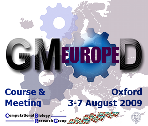

# 2009 GMOD Summer School - Europe

From GMOD

Jump to: [navigation](#mw-navigation), [search](#p-search)

<table style="vertical-align: middle; border: 2px solid #A6A6BC"
data-cellpadding="10">
<colgroup>
<col style="width: 50%" />
<col style="width: 50%" />
</colgroup>
<tbody>
<tr class="odd">
<td></td>
<td><strong>2009 GMOD
Summer School - Europe</strong> 
3-6 August, 2009 
Oxford UK

 
Part of <a
href="GMOD_Europe_2009" title="GMOD Europe 2009">GMOD Europe 2009</a>,
five days of GMOD including a <a href="August_2009_GMOD_Meeting"
title="August 2009 GMOD Meeting">Community Meeting</a>
</td>
</tr>
</tbody>
</table>

  
The ***2009 GMOD Summer School - Europe*** was held 3-6 August in
Oxford, UK. Like the [2008 GMOD Summer
School](2008_GMOD_Summer_School "2008 GMOD Summer School"), this course
focused on installing, configuring and integrating popular [GMOD
Components](GMOD_Components "GMOD Components").

The summer school was a part of ***[GMOD Europe
2009](GMOD_Europe_2009 "GMOD Europe 2009")*** a week long event that
also included the [August 2009 GMOD
Meeting](August_2009_GMOD_Meeting "August 2009 GMOD Meeting"). Another
<a href="GMOD_Summer_School" class="mw-redirect"
title="GMOD Summer School">GMOD Summer School</a> was offered in
[Durham, North Carolina in July
2009](2009_GMOD_Summer_School_-_Americas "2009 GMOD Summer School - Americas").

## Contents

- [1
  Program](#Program)
- [2
  Instructors](#Instructors)
- [3
  Prerequisites](#Prerequisites)
  - [3.1 System
    Requirements](#System_Requirements)
- [4
  Cost](#Cost)
- [5
  Location](#Location)
- [6
  Transportation, Lodging,
  Meals](#Transportation.2C_Lodging.2C_Meals)
- [7
  Sponsors](#Sponsors)
- [8
  Feedback](#Feedback)

## Program

The program featured 3 ½ days of hands-on training starting with an
overview of GMOD, and then covering the installation, configuration, and
administration of several popular [GMOD
Components](GMOD_Components "GMOD Components").

The summer school GMOD component sessions are available as [online
tutorials](Training_and_Outreach#Online_Tutorials "Training and Outreach").
To access the tutorials, follow the links for
<a href="Chado_Tutorial" class="mw-redirect"
title="Chado Tutorial">Chado</a>,
[GBrowse](GBrowse_Tutorial "GBrowse Tutorial"),
<a href="GBrowse_syn_Tutorial" class="mw-redirect"
title="GBrowse syn Tutorial">GBrowse_syn</a>,
[BioMart](BioMart_Tutorial "BioMart Tutorial"),
<a href="Apollo_Tutorial" class="mw-redirect"
title="Apollo Tutorial">Apollo</a>, [Artemis-Chado
Integration](Artemis-Chado_Integration_Tutorial "Artemis-Chado Integration Tutorial"),
and <a href="JBrowse_Tutorial" class="mw-redirect"
title="JBrowse Tutorial">JBrowse</a>.

<table class="wikitable" data-border="1" data-cellpadding="5"
data-cellspacing="0">
<colgroup>
<col style="width: 33%" />
<col style="width: 33%" />
<col style="width: 33%" />
</colgroup>
<thead>
<tr class="header">
<th width="8%" style="background-color: #99ccff">Time</th>
<th width="75%" style="background-color: #99ccff">Session</th>
<th></th>
</tr>
</thead>
<tbody>
<tr class="odd">
<td colspan="3"></td>
</tr>
<tr class="even">
<td colspan="2" style="background-color: #bbffff">Monday 3 August</td>
<td></td>
</tr>
<tr class="odd">
<td style="background-color: #ccffff">8:30</td>
<td
style="text-align: center; background-color: #ddffff;"><strong>Introduction
and Overview</strong> 
<a href="User:Scott" title="User:Scott">Scott Cain</a> and <a
href="User:Clements" title="User:Clements">Dave Clements</a> 
Participant and instructor introductions, how the GMOD project works,
what software tools are available in GMOD, how they interoperate, what
resources are needed to get a GMOD installation up and running, and
course overview.</td>
<td></td>
</tr>
<tr class="even">
<td style="background-color: #ccffff">10:10</td>
<td
style="text-align: center; background-color: #ddffff;"><strong>VMware
and BioPerl Setup</strong> 
<strong>Everyone</strong> 
Get the GMOD Summer School <a href="#System_Requirements">VMware</a>
image up and running on your laptop, and then finish installation of <a
href="BioPerl" title="BioPerl">BioPerl</a>.</td>
<td></td>
</tr>
<tr class="odd">
<td style="background-color: #ccffff">12:00</td>
<td
style="text-align: center; background-color: #ddffff;"><strong>Catered
Lunch</strong></td>
<td></td>
</tr>
<tr class="even">
<td style="background-color: #ccffff">13:00</td>
<td style="text-align: center; background-color: #ddffff;"><strong><a
href="Chado_Tutorial" class="mw-redirect"
title="Chado Tutorial">Chado</a></strong> 
<a href="User:Scott" title="User:Scott">Scott Cain</a> and <a
href="User:Clements" title="User:Clements">Dave Clements</a></td>
<td></td>
</tr>
<tr class="odd">
<td style="background-color: #ccffff">18:00</td>
<td style="text-align: center; background-color: #ddffff;">Day ends</td>
<td></td>
</tr>
<tr class="even">
<td colspan="2"></td>
<td></td>
</tr>
<tr class="odd">
<td colspan="2" style="background-color: #bbffcc">Tuesday 4 August</td>
<td></td>
</tr>
<tr class="even">
<td style="background-color: #ccffdd">8:30</td>
<td style="text-align: center; background-color: #ddffdd;"><strong><a
href="GBrowse_Tutorial"
title="GBrowse Tutorial">GBrowse</a></strong> 
<a href="User:Scott" title="User:Scott">Scott Cain</a> and <a
href="User:Mckays" title="User:Mckays">Sheldon McKay</a></td>
<td></td>
</tr>
<tr class="odd">
<td style="background-color: #ccffdd">12:30</td>
<td
style="text-align: center; background-color: #ddffdd;"><strong>Catered
Lunch</strong></td>
<td></td>
</tr>
<tr class="even">
<td style="background-color: #ccffdd">13:30</td>
<td style="text-align: center; background-color: #ddffdd;"><strong><a
href="GBrowse_syn_Tutorial" class="mw-redirect"
title="GBrowse syn Tutorial">GBrowse_syn</a></strong> 
<a href="User:Mckays" title="User:Mckays">Sheldon McKay</a></td>
<td></td>
</tr>
<tr class="odd">
<td style="background-color: #ccffdd">18:00</td>
<td style="text-align: center; background-color: #ddffdd;">Day ends</td>
<td></td>
</tr>
<tr class="even">
<td colspan="2"></td>
<td></td>
</tr>
<tr class="odd">
<td colspan="2" style="background-color: #ffffaa">Wednesday 5
August</td>
<td></td>
</tr>
<tr class="even">
<td style="background-color: #ffffbb">8:30</td>
<td style="text-align: center; background-color: #ffffcc;"><strong><a
href="BioMart_Tutorial"
title="BioMart Tutorial">BioMart</a></strong> 
<a href="User:Junjun" title="User:Junjun">Junjun Zhang</a> and <a
href="User:SyedHaider" title="User:SyedHaider">Syed Haider</a> 
Introduction; exploring over 20 public databases through <a
href="BioMart" title="BioMart">BioMart</a> central portal; system
installation; accessing BioMart server via API, webservice and <a
href="DAS" class="mw-redirect" title="DAS">DAS</a>; configuration of
BioMart server including federation; demonstration of creating data
mart.</td>
<td></td>
</tr>
<tr class="odd">
<td style="background-color: #ffffbb">12:30</td>
<td style="text-align: center; background-color: #ffffcc;"><strong>Lunch
on your own</strong></td>
<td></td>
</tr>
<tr class="even">
<td style="background-color: #ffffbb">13:45</td>
<td style="text-align: center; background-color: #ffffcc;"><strong><a
href="Apollo_Tutorial" class="mw-redirect"
title="Apollo Tutorial">Apollo</a></strong> 
<a href="User:Elee" title="User:Elee">Ed Lee</a> 
Overview, installation (from installers and from source), configuration,
reading/writing data, remote analyses, and setting up a customized Java
Web Start instance.</td>
<td></td>
</tr>
<tr class="odd">
<td style="background-color: #ffffbb">18:00</td>
<td style="text-align: center; background-color: #ffffcc;">Day ends</td>
<td></td>
</tr>
<tr class="even">
<td colspan="2"></td>
<td></td>
</tr>
<tr class="odd">
<td colspan="2" style="background-color: #ffccaa">Thursday 6 August</td>
<td></td>
</tr>
<tr class="even">
<td style="background-color: #ffddcc">8:30</td>
<td style="text-align: center; background-color: #ffeedd;"><strong><a
href="Artemis-Chado_Integration_Tutorial"
title="Artemis-Chado Integration Tutorial">Artemis-Chado
Integration</a></strong> 
<a href="User:RobinHouston" title="User:RobinHouston">Robin Houston</a>,
<a href="User:TimCarver" title="User:TimCarver">Tim Carver</a> and <a
href="User:Buggy" title="User:Buggy">Giles Velarde</a> 
<a href="Artemis" title="Artemis">Artemis</a> and ACT: Overview,
installation, configuration, reading &amp; writing data to <a
href="Chado" class="mw-redirect" title="Chado">Chado</a>.</td>
<td></td>
</tr>
<tr class="odd">
<td style="background-color: #ffddcc">10:10</td>
<td style="text-align: center; background-color: #ffeedd;"><strong><a
href="JBrowse_Tutorial" class="mw-redirect"
title="JBrowse Tutorial">JBrowse</a></strong> 
Ian Holmes</td>
<td></td>
</tr>
<tr class="even">
<td style="background-color: #ffddcc">11:30</td>
<td
style="text-align: center; background-color: #ffeedd;"><strong>Wrapup
and Resources</strong> 
<a href="User:Clements" title="User:Clements">Dave Clements</a> and <a
href="User:Scott" title="User:Scott">Scott Cain</a></td>
<td></td>
</tr>
<tr class="odd">
<td style="background-color: #ffddcc">12:00</td>
<td style="text-align: center; background-color: #ffeedd;">Summer School
Ends</td>
<td></td>
</tr>
<tr class="even">
<td colspan="2"></td>
<td></td>
</tr>
<tr class="odd">
<td style="color: #aaaaaa">13:30- 
18:00</td>
<td colspan="2" style="text-align: center; color: #aaaaaa;"><a
href="August_2009_GMOD_Meeting" title="August 2009 GMOD Meeting">August 2009 GMOD Meeting</a></td>
</tr>
<tr class="even">
<td colspan="2"></td>
<td></td>
</tr>
<tr class="odd">
<td colspan="2" style="color: #aaaaaa">Friday 7 August</td>
<td></td>
</tr>
<tr class="even">
<td style="color: #aaaaaa">8:30- 
18:00</td>
<td colspan="2" style="text-align: center; color: #aaaaaa;"><a
href="August_2009_GMOD_Meeting" title="August 2009 GMOD Meeting">August 2009 GMOD Meeting</a></td>
</tr>
</tbody>
</table>

## Instructors

| Instructor | GMOD Contribution | Affiliation |
|----|----|----|
| [Scott Cain](User:Scott "User:Scott") | GMOD Project Coordinator | <a href="http://www.oicr.on.ca/" class="external text"
rel="nofollow">Ontario Institute for Cancer Research (OICR)</a> |
| [Tim Carver](User:TimCarver "User:TimCarver") | [Artemis](Artemis "Artemis") lead developer | <a href="http://www.sanger.ac.uk/" class="external text"
rel="nofollow">Wellcome Trust Sanger Institute</a> |
| [Dave Clements](User:Clements "User:Clements") | [GMOD Help Desk](GMOD_Help_Desk "GMOD Help Desk") | <a href="http://nescent.org/" class="external text"
rel="nofollow">National Evolutionary Synthesis Center (NESCent)</a> |
| [Syed Haider](User:SyedHaider "User:SyedHaider") | [BioMart](BioMart "BioMart") developer | <a href="http://www.ebi.ac.uk/" class="external text"
rel="nofollow">European Bioinformatics Institute</a> |
| Ian Holmes | [JBrowse](JBrowse.1 "JBrowse") PI | <a href="http://berkeley.edu" class="external text"
rel="nofollow">University of California, Berkeley</a> |
| [Robin Houston](User:RobinHouston "User:RobinHouston") | [Artemis](Artemis "Artemis") manager | <a href="http://www.sanger.ac.uk/" class="external text"
rel="nofollow">Wellcome Trust Sanger Institute</a> |
| [Ed Lee](User:Elee "User:Elee") | Lead [Apollo](Apollo.1 "Apollo") developer | <a href="http://www.berkeleybop.org/" class="external text"
rel="nofollow">Berkeley Bioinformatics Open-source Projects (BBOP)</a> |
| [Sheldon McKay](User:Mckays "User:Mckays") | Lead [GBrowse_syn](GBrowse_syn.1 "GBrowse syn") developer, [GBrowse](GBrowse.1 "GBrowse") developer | <a href="http://cshl.edu" class="external text" rel="nofollow">Cold
Spring Harbor Laboratory</a> |
| [Giles Velarde](User:Buggy "User:Buggy") | Developer | <a href="http://www.sanger.ac.uk/" class="external text"
rel="nofollow">Wellcome Trust Sanger Institute</a> |
| [Junjun Zhang](User:Junjun "User:Junjun") | [BioMart](BioMart "BioMart") developer | <a href="http://www.oicr.on.ca/" class="external text"
rel="nofollow">OICR</a> |

## Prerequisites

*The course requires a minimal level of Linux systems administration
knowledge* (see [Computing
Requirements](Computing_Requirements "Computing Requirements")). By "a
minimal level of Linux systems administration knowledge" we mean that
participants should be comfortable installing packages under Linux. *A
good benchmark for this level of knowledge is that you should be able to
get a basic [GBrowse
installation](GBrowse_Install_HOWTO "GBrowse Install HOWTO") (that is,
GBrowse without [MySQL](MySQL "MySQL")) up and running with the example
GBrowse data.* This also requires installing Apache, and
[BioPerl](BioPerl "BioPerl") and all its dependencies.

**Getting a basic GBrowse up and running on your system will be assigned
as homework to be done prior to the course's start.**

### System Requirements

 *Participants are required to bring
their own laptops, already capable of running a
<a href="http://www.vmware.com" class="external text"
rel="nofollow">VMware</a> system image.*

The course started with getting a VMware image built specifically for
the course up and running on your machine. We then built upon that image
in each succeeding session.

VMware on Windows and Linux

A free VMware player is available for [Microsoft
Windows](Category:Windows "Category:Windows") and
[Linux](Category:Linux "Category:Linux") [operating
systems](Glossary#Operating_System "Glossary") from
<a href="http://vmware.com/products/player/" class="external text"
rel="nofollow">VMware</a>. You will need to register to download it.

  

VMware on Mac OS X

Participants can also bring *newer Macs with Intel processors*. The
Intel processor is a requirement for all the packages discussed below.

There is no free VMware player that runs *directly* under [Mac OS
X](Category:Mac_OS_X "Category:Mac OS X"). However, there are several
other options, *all of which require an Intel Mac*:

  

VMware Fusion

<a href="http://www.vmware.com/products/fusion/" class="external text"
rel="nofollow">VMware Fusion</a> (~ £62 / €67) allows you to run VMware
images, Windows and Linux under Mac OS. **We recommend this option for
Mac users. There is a fully functional, 30 day free trial version of
VMware Fusion available for download.**

  

Mac OS 10.5 (Leopard) and Boot Camp

The <a href="http://www.apple.com/macosx/" class="external text"
rel="nofollow">Leopard release of Mac OS (10.5)</a> includes
<a href="http://www.apple.com/macosx/features/bootcamp.html"
class="external text" rel="nofollow">Boot Camp</a>, a feature that
allows you to boot your Mac into another operating system, including
Windows or Linux. From there you can install the VMware player for your
OS.\*

**\*** *Apple tells you that you can partition your disk drive at any
time using Boot Camp. In practice, this appears to only work easily when
you first get your system.*

## Cost

Tuition for the course was £95. Participants were responsible for their
own travel and living expenses.

Tuition for this course did not include registration for the [August
2009 GMOD Meeting](August_2009_GMOD_Meeting "August 2009 GMOD Meeting").
The meeting had a separate registration cost from the summer school.

## Location

The course was held at the
<a href="http://www.mstc.ox.ac.uk/" class="external text"
rel="nofollow">Medical Science Teaching Centre (MSTC)</a> at the
<a href="http://www.ox.ac.uk/" class="external text"
rel="nofollow">University of Oxford</a>, in
<a href="http://www.oxfordcity.co.uk/" class="external text"
rel="nofollow">Oxford, United Kingdom</a>.

## Transportation, Lodging, Meals

See the
[Transportation](GMOD_Europe_2009#Transportation "GMOD Europe 2009") and
[Lodging](GMOD_Europe_2009#Lodging "GMOD Europe 2009") sections of the
[GMOD Europe 2009](GMOD_Europe_2009 "GMOD Europe 2009") page for
information on transport and lodging for both the summer school and
[August 2009 GMOD
Meeting](August_2009_GMOD_Meeting "August 2009 GMOD Meeting").

## Sponsors

We would like to thank the
<a href="http://www.molbiol.ox.ac.uk/" class="external text"
rel="nofollow">Computational Biology Research Group (CBRG)</a> at the
University of Oxford for hosting and financially supporting the week's
events.

  

## Feedback

19 of 25 students provided feedback on the course.

  
**Q: Would you recommend
<a href="GMOD_Summer_School" class="mw-redirect"
title="GMOD Summer School">GMOD Summer School</a> to others?**

| No  | Yes, with reservations | Yes | No opinion |
|-----|------------------------|-----|------------|
| 0%  | 16%                    | 84% | 0%         |

  
**Q: Please rate the quality of the sessions overall, from 1 (very poor)
to 3 (average) to 5 (very good), or N.A. if you have no opinion.**

<table class="wikitable" style="width:100%;">
<colgroup>
<col style="width: 16%" />
<col style="width: 16%" />
<col style="width: 16%" />
<col style="width: 16%" />
<col style="width: 16%" />
<col style="width: 16%" />
</colgroup>
<thead>
<tr class="header">
<th>Very Poor 
1</th>
<th>(Poor) 
2</th>
<th>Average 
3</th>
<th>(Good) 
4</th>
<th>Very Good 
5</th>
<th>N.A.</th>
</tr>
</thead>
<tbody>
<tr class="odd">
<td>0%</td>
<td>0%</td>
<td>21%</td>
<td>47%</td>
<td>32%</td>
<td>0%</td>
</tr>
</tbody>
</table>

Retrieved from
"<http://gmod.org/mediawiki/index.php?title=2009_GMOD_Summer_School_-_Europe&oldid=25682>"

[Categories](Special:Categories "Special:Categories"):

- [Education and
  Outreach](Category:Education_and_Outreach "Category:Education and Outreach")
- [Tutorials](Category:Tutorials "Category:Tutorials")
- [Events](Category:Events "Category:Events")
- [GMOD Schools](Category:GMOD_Schools "Category:GMOD Schools")

## Navigation menu

### Namespaces

- <a href="2009_GMOD_Summer_School_-_Europe" accesskey="c"
  title="View the content page [c]">Page</a>
- <a
  href="http://gmod.org/mediawiki/index.php?title=Talk:2009_GMOD_Summer_School_-_Europe&amp;action=edit&amp;redlink=1"
  accesskey="t"
  title="Discussion about the content page [t]">Discussion</a>

### 

### Variants

### Navigation

- [GMOD Home](Main_Page)
- [Software](GMOD_Components)
- [Categories /
  Tags](Categories)
- [View all pages](Special:AllPages)

### Documentation

- [Overview](Overview)
- [FAQs](Category:FAQ)
- [HOWTOs](Category:HOWTO)
- [Glossary](Glossary)

### Community

- [GMOD News](GMOD_News)
- [Training /
  Outreach](Training_and_Outreach)
- [Support](Support)
- [GMOD Promotion](GMOD_Promotion)
- [Meetings](Meetings)
- [Calendar](Calendar)

### Tools

- <a href="Special:Browse/2009_GMOD_Summer_School_-2D_Europe"
  rel="smw-browse">Browse properties</a>

- Last updated at 22:13 on 16 April
  2014.
<!-- - 303,624 page views. -->
- Content is available under
  <a href="http://www.gnu.org/licenses/fdl-1.3.html" class="external"
  rel="nofollow">a GNU Free Documentation License</a> unless otherwise
  noted.

<!-- -->

- [About
  GMOD](GMOD:About "GMOD:About")

<!-- -->

