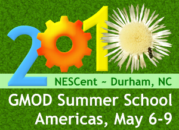
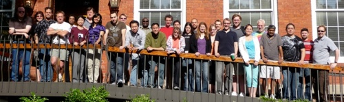
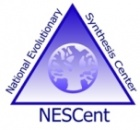

# 2010 GMOD Summer School - Americas

From GMOD

Jump to: [navigation](#mw-navigation), [search](#p-search)

<table style="vertical-align: middle; border: 2px solid #A6A6BC"
data-cellpadding="10">
<colgroup>
<col style="width: 50%" />
<col style="width: 50%" />
</colgroup>
<tbody>
<tr class="odd">
<td>

</td>
<td><strong>2010 GMOD
Summer School - Americas</strong> 
6-9 May, 2010 
<a href="http://www.nescent.org/" class="external text"
rel="nofollow">NESCent</a> 
Durham, NC, USA 
</td>
</tr>
</tbody>
</table>

  

  
The ***2010 GMOD Summer School - Americas*** was held 6-9 May at the
<a href="http://www.nescent.org/" class="external text"
rel="nofollow">National Evolutionary Synthesis Center (NESCent)</a> in
Durham, North Carolina. Like previous
<a href="GMOD_Summer_School" class="mw-redirect"
title="GMOD Summer School">GMOD Summer Schools</a>, this course focused
on installing, configuring and integrating popular [GMOD
Components](GMOD_Components "GMOD Components"). Sessions were taught by
GMOD Component developers and GMOD staff. There was space in the course
for 25 participants, and admission was competitive.

**All of the sessions from this school have now been moved to this
website, where they are available as [Online
Tutorials](Training_and_Outreach#Online_Tutorials "Training and Outreach").**

  

## Contents

- [1
  Applications](#Applications)
- [2
  Program](#Program)
- [3
  Instructors](#Instructors)
- [4
  Prerequisites](#Prerequisites)
- [5 System
  Requirements](#System_Requirements)
  - [5.1 VMware on
    Windows and Linux](#VMware_on_Windows_and_Linux)
  - [5.2 VMware on
    Mac OS X](#VMware_on_Mac_OS_X)
- [6
  Costs](#Costs)
- [7
  Sponsor](#Sponsor)
- [8 Travel,
  Lodging and Food](#Travel.2C_Lodging_and_Food)
- [9
  Feedback](#Feedback)

## Applications

**The deadline for applying to the summer school has now passed.**

## Program

The program featured 4 full days of hands-on training starting with an
overview of GMOD, and then covering the installation, configuration, and
administration of several popular [GMOD
Components](GMOD_Components "GMOD Components").

<table class="wikitable" data-border="1" data-cellpadding="5"
data-cellspacing="0">
<colgroup>
<col style="width: 50%" />
<col style="width: 50%" />
</colgroup>
<thead>
<tr class="header">
<th width="7%" style="background-color: #99ccff">Time</th>
<th width="93%" style="background-color: #99ccff">Session</th>
</tr>
</thead>
<tbody>
<tr class="odd">
<td colspan="2"></td>
</tr>
<tr class="even">
<td colspan="2" style="background-color: #bbffff">Thursday May 6</td>
</tr>
<tr class="odd">
<td style="background-color: #ccffff">8:45am</td>
<td
style="text-align: center; background-color: #ddffff;"><strong>Introduction
and Overview</strong> 
<a href="User:Scott" title="User:Scott">Scott Cain</a> and <a
href="User:Clements" title="User:Clements">Dave Clements</a> 
Participant and instructor introductions, how the GMOD project works,
what software tools are available in GMOD, how they interoperate, what
resources are needed to get a GMOD installation up and running, and
course overview</td>
</tr>
<tr class="even">
<td style="background-color: #ccffff">10:25am</td>
<td style="text-align: center; background-color: #ddffff;"><strong><a
href="http://gmod.org/mediawiki/index.php?title=VMware&amp;action=edit&amp;redlink=1"
class="new" title="VMware (page does not exist)">VMware</a> and <a
href="BioPerl" title="BioPerl">BioPerl</a> Setup</strong> 
<strong>Everyone</strong> 
Get the GMOD Summer School <a href="#System_Requirements">VMware</a>
image up and running on your laptop, and then finish installation of <a
href="BioPerl" title="BioPerl">BioPerl</a>.</td>
</tr>
<tr class="odd">
<td style="background-color: #ccffff">12:15pm</td>
<td
style="text-align: center; background-color: #ddffff;"><strong>Lunch</strong> 
<a href="http://www.ninthst.com/" class="external text"
rel="nofollow">on your own</a></td>
</tr>
<tr class="even">
<td style="background-color: #ccffff">1:15pm</td>
<td style="text-align: center; background-color: #ddffff;"><strong><a
href="MAKER_Tutorial" class="mw-redirect" title="MAKER Tutorial">MAKER
I</a></strong> 
<a href="User:Carsonholt" title="User:Carsonholt">Carson Holt</a> 
<a href="MAKER.1" title="MAKER">MAKER</a> overview, installation, basic
configuration for annotating genomic sequence, re-annotation options,
and improving annotation quality</td>
</tr>
<tr class="odd">
<td style="background-color: #ccffff">4:30pm</td>
<td
style="text-align: center; background-color: #ddffff;"><strong>Social
Hour w/ <a href="http://www.nescent.org/dir/" class="external text"
rel="nofollow">NESCent Staff</a></strong> 
and then <strong>Dinner</strong> <a href="http://www.ninthst.com/"
class="external text" rel="nofollow">on your own</a></td>
</tr>
<tr class="even">
<td style="background-color: #ccffff">6:30pm</td>
<td style="text-align: center; background-color: #ddffff;"><strong><a
href="MAKER_Tutorial" class="mw-redirect" title="MAKER Tutorial">MAKER
II</a></strong> 
<a href="User:Carsonholt" title="User:Carsonholt">Carson Holt</a> 
Advanced <a href="MAKER.1" title="MAKER">MAKER</a> configuration,
re-annotation options, and improving annotation quality</td>
</tr>
<tr class="odd">
<td style="background-color: #ccffff">7:30pm</td>
<td style="text-align: center; background-color: #ddffff;"><strong>Open
Discussion</strong> and <strong>User Presentations</strong> 
Everyone 
This session is open to any and all questions you have on the <a
href="Main_Page" title="Main Page">GMOD Project</a>, <a
href="GMOD_Components" title="GMOD Components">GMOD Components</a>, and
GMOD users. The instructors will come with their knowledge of GMOD and
their opinions on the project's strengths, weaknesses, and future
directions. Students will also have the opportunity to share work from
their projects with the rest of the group.

We expect this session to be <em>lively</em>.
</td>
</tr>
<tr class="even">
<td style="background-color: #ccffff">8:30pm</td>
<td style="text-align: center; background-color: #ddffff;">Day ends</td>
</tr>
<tr class="odd">
<td colspan="2"></td>
</tr>
<tr class="even">
<td colspan="2" style="background-color: #bbffcc">Friday May 7</td>
</tr>
<tr class="odd">
<td style="background-color: #ccffdd">8:45am</td>
<td style="text-align: center; background-color: #ddffdd;"><strong><a
href="GBrowse_Tutorial"
title="GBrowse Tutorial">GBrowse</a></strong> 
<a href="User:Scott" title="User:Scott">Scott Cain</a> 
</td>
</tr>
<tr class="even">
<td style="background-color: #ccffdd">1:00pm</td>
<td
style="text-align: center; background-color: #ddffdd;"><strong>Lunch</strong> 
<a href="http://www.ninthst.com/" class="external text"
rel="nofollow">on your own</a></td>
</tr>
<tr class="odd">
<td style="background-color: #ccffdd">2:00pm</td>
<td style="text-align: center; background-color: #ddffdd;"><strong><a
href="Galaxy_Tutorial" class="mw-redirect"
title="Galaxy Tutorial">Galaxy</a></strong> 
<a href="User:JamesTaylor" title="User:JamesTaylor">James
Taylor</a> 
Introduction; Installation and configuration of Galaxy; Defining your
own tools; ...</td>
</tr>
<tr class="even">
<td style="background-color: #ccffdd">6:00pm</td>
<td style="text-align: center; background-color: #ddffdd;"><strong><a
href="JBrowse_Tutorial" class="mw-redirect"
title="JBrowse Tutorial">JBrowse</a></strong> 
<a href="User:MitchSkinner" title="User:MitchSkinner">Mitch
Skinner</a> 
<a href="JBrowse.1" title="JBrowse">JBrowse</a> installation,
configuration and administration; converting <a href="GFF3"
title="GFF3">GFF3</a> to <a href="Glossary#JSON"
title="Glossary">JSON</a> and loading it into JBrowse.</td>
</tr>
<tr class="odd">
<td style="background-color: #ccffdd">8:00pm</td>
<td style="text-align: center; background-color: #ddffdd;">Day ends</td>
</tr>
<tr class="even">
<td colspan="2"></td>
</tr>
<tr class="odd">
<td colspan="2" style="background-color: #ffffaa">Saturday May 8</td>
</tr>
<tr class="even">
<td style="background-color: #ffffbb">8:45am</td>
<td style="text-align: center; background-color: #ffffcc;"><strong><a
href="Chado_Tutorial" class="mw-redirect" title="Chado Tutorial">Chado
I</a></strong> 
<a href="User:Scott" title="User:Scott">Scott Cain</a> and <a
href="User:Clements" title="User:Clements">Dave Clements</a></td>
</tr>
<tr class="odd">
<td style="background-color: #ffffbb">1:00pm</td>
<td
style="text-align: center; background-color: #ffffcc;"><strong>Lunch</strong> 
<a href="http://www.ninthst.com/" class="external text"
rel="nofollow">on your own</a></td>
</tr>
<tr class="even">
<td style="background-color: #ffffbb">2:00pm</td>
<td style="text-align: center; background-color: #ffffcc;"><strong><a
href="Chado_Tutorial" class="mw-redirect" title="Chado Tutorial">Chado
II</a></strong> 
<a href="User:Scott" title="User:Scott">Scott Cain</a> and <a
href="User:Clements" title="User:Clements">Dave Clements</a></td>
</tr>
<tr class="odd">
<td style="background-color: #ffffbb">3:00pm</td>
<td style="text-align: center; background-color: #ffffcc;"><strong><a
href="Apollo_Tutorial" class="mw-redirect"
title="Apollo Tutorial">Apollo</a></strong> 
<a href="User:Elee" title="User:Elee">Ed Lee</a> 
Overview, basic installation, basic configuration, reading/writing data,
and remote analyses. Custom installation (building Apollo from source),
advanced configuration, and setting up customized Java Web Start
instance.</td>
</tr>
<tr class="even">
<td style="background-color: #ffffbb">7:30pm</td>
<td style="text-align: center; background-color: #ffffcc;">Day ends</td>
</tr>
<tr class="odd">
<td colspan="2"></td>
</tr>
<tr class="even">
<td colspan="2" style="background-color: #ffccaa">Sunday May 9</td>
</tr>
<tr class="odd">
<td style="background-color: #ffddcc">8:45am</td>
<td style="text-align: center; background-color: #ffeedd;"><strong><a
href="GBrowse_syn_Tutorial" class="mw-redirect"
title="GBrowse syn Tutorial">GBrowse_syn</a></strong> 
<a href="User:Mckays" title="User:Mckays">Sheldon McKay</a></td>
</tr>
<tr class="even">
<td style="background-color: #ffddcc">12:30pm</td>
<td
style="text-align: center; background-color: #ffeedd;"><strong>Lunch</strong> 
<a href="http://www.ninthst.com/" class="external text"
rel="nofollow">on your own</a></td>
</tr>
<tr class="odd">
<td style="background-color: #ffddcc">1:30pm</td>
<td style="text-align: center; background-color: #ffeedd;"><strong><a
href="Tripal_Tutorial" class="mw-redirect"
title="Tripal Tutorial">Tripal</a></strong> 
<a href="User:Sficklin" title="User:Sficklin">Stephen Ficklin</a> 
<a href="Tripal.1" title="Tripal">Tripal</a> is a web front end to <a
href="Chado" class="mw-redirect" title="Chado">Chado</a> databases built
on <a href="http://www.drupal.org/" class="external text"
rel="nofollow">Drupal</a>. This class will introduce Drupal and Tripal
architecture, and then cover Tripal installation, configuration and
administration.</td>
</tr>
<tr class="even">
<td style="background-color: #ffddcc">6:00pm</td>
<td
style="text-align: center; background-color: #ffeedd;"><strong>Wrapup
and Resources</strong> 
<a href="User:Clements" title="User:Clements">Dave Clements</a> and <a
href="User:Scott" title="User:Scott">Scott Cain</a></td>
</tr>
<tr class="odd">
<td style="background-color: #ffddcc">6:30pm</td>
<td style="text-align: center; background-color: #ffeedd;">Summer School
Ends</td>
</tr>
</tbody>
</table>

## Instructors

| Instructor | GMOD Affiliation | Affiliation |
|----|----|----|
| [Scott Cain](User:Scott "User:Scott") | GMOD Project Coordinator; <a href="Chado" class="mw-redirect" title="Chado">Chado</a>, [GBrowse](GBrowse.1 "GBrowse") | <a href="http://www.oicr.on.ca/" class="external text"
rel="nofollow">Ontario Institute for Cancer Research</a> |
| [Dave Clements](User:Clements "User:Clements") | [GMOD Help Desk](GMOD_Help_Desk "GMOD Help Desk") | <a href="http://nescent.org/" class="external text"
rel="nofollow">National Evolutionary Synthesis Center (NESCent)</a> |
| [Stephen Ficklin](User:Sficklin "User:Sficklin") | [Tripal](Tripal.1 "Tripal") | <a href="http://www.genome.clemson.edu/" class="external text"
rel="nofollow">Clemson University Genomics Institute</a> |
| [Carson Holt](User:Carsonholt "User:Carsonholt") | [MAKER](MAKER.1 "MAKER") | <a href="http://www.utah.edu" class="external text"
rel="nofollow">University of Utah</a> |
| [Ed Lee](User:Elee "User:Elee") | [Apollo](Apollo.1 "Apollo") | <a href="http://www.berkeleybop.org/" class="external text"
rel="nofollow">Berkeley Bioinformatics Open-source Projects (BBOP)</a> |
| [Sheldon McKay](User:Mckays "User:Mckays") | [GBrowse_syn](GBrowse_syn.1 "GBrowse syn"), [GBrowse](GBrowse.1 "GBrowse") | <a href="http://cshl.edu" class="external text" rel="nofollow">Cold
Spring Harbor Laboratory</a> |
| [Mitch Skinner](User:MitchSkinner "User:MitchSkinner") | [JBrowse](JBrowse.1 "JBrowse") | <a href="http://berkeley.edu" class="external text"
rel="nofollow">University of California, Berkeley</a> |
| [James Taylor](User:JamesTaylor "User:JamesTaylor") | [Galaxy](Galaxy.1 "Galaxy") | <a href="http://www.emory.edu" class="external text"
rel="nofollow">Emory University</a> |

## Prerequisites

*The course requires a minimal level of Linux systems administration
knowledge* (see [Computing
Requirements](Computing_Requirements "Computing Requirements")). By "a
minimal level of Linux systems administration knowledge" we mean that
participants should be

1.  Comfortable with the Linux command line interface, and
2.  Comfortable installing packages under Linux.

*A good benchmark for this level of knowledge is that you should be able
to get a basic [GBrowse
installation](GBrowse_Install_HOWTO "GBrowse Install HOWTO") (that is,
GBrowse without [MySQL](MySQL "MySQL")) up and running with the example
GBrowse data.* This also requires installing Apache, and
[BioPerl](BioPerl "BioPerl") and all its dependencies.

## System Requirements

**Participants are required to bring their
own laptops, already capable of running a <a
href="http://gmod.org/mediawiki/index.php?title=VMware&amp;action=edit&amp;redlink=1"
class="new" title="VMware (page does not exist)">VMware</a> system
image.**

The course starts with getting a VMware image (built specifically for
the course) up and running on your machine. We then build upon that
image in each succeeding session.

### VMware on Windows and Linux

A free VMware player is available for [Microsoft
Windows](Category:Windows "Category:Windows") and
[Linux](Category:Linux "Category:Linux") [operating
systems](Glossary#Operating_System "Glossary") from
<a href="http://vmware.com/products/player/" class="external text"
rel="nofollow">VMware</a>. You will need to register to download it.
There are multiple versions. Be sure to download a version that can run
on your laptop.

  

### VMware on Mac OS X

Participants can also bring *newer Macs with Intel processors*. The
Intel processor is a requirement for all the packages discussed below.
There is no free VMware player that runs *directly* under [Mac OS
X](Category:Mac_OS_X "Category:Mac OS X"). However, there are several
other options, **all of which require an Intel Mac**:

VMware Fusion

<a href="http://www.vmware.com/products/fusion/" class="external text"
rel="nofollow">VMware Fusion</a>
(<a href="http://www.vmware.com/a/buylink/10" class="external text"
rel="nofollow">$80/corporate</a>,
<a href="http://www.vmware.com/vmwarestore/academicstore.html"
class="external text" rel="nofollow">$40/Academic</a>) allows you to run
VMware images (as well as Windows and Linux) under Mac OS. **We
recommend this option for Mac users. There is a fully functional, 30 day
free trial version of VMware Fusion available for download.**

VirtualBox

<a href="http://www.virtualbox.org/wiki/Downloads" class="external text"
rel="nofollow">VirtualBox</a> is free and open source, and runs on Intel
Macs (and Windows, Linux and Solaris too). It claims to be capable of
running VMware images, *but we have not tested this with our images.*

## Costs

This course is *free* thanks to

- <a
  href="http://crisp.cit.nih.gov/crisp/CRISP_LIB.getdoc?textkey=7234938&amp;p_grant_num=1R01HG004483-01&amp;p_query=&amp;ticket=&amp;p_audit_session_id=&amp;p_keywords="
  class="external text" rel="nofollow">NIH grant 1R01HG004483-01</a>
  under <a href="http://biowiki.org/IanHolmes" class="external text"
  rel="nofollow">Ian Holmes</a>
- Financial support from
  <a href="http://nescent.org" class="external text"
  rel="nofollow">NESCent</a>
- The grants of the individual instructors

## Sponsor

We would like to thank the
<a href="http://nescent.org" class="external text"
rel="nofollow">National Evolutionary Synthesis Center (NESCent)</a> for
hosting and financially supporting this course. Travel awards are
entirely funded by NESCent, as part of its
<a href="http://www.nescent.org/eog/" class="external text"
rel="nofollow">Education and Outreach</a> effort. NESCent's
<a href="http://www.nescent.org/eog/" class="external text"
rel="nofollow">Education and Outreach Group</a> is committed to sharing
the exciting evolutionary biology research occurring at NESCent and
elsewhere. In addition, NESCent is interested in outreach to groups who
are underrepresented in evolutionary biology and improving evolution
education, and offers resources for scientists, educators, and the
general public that meet these goals.

## Travel, Lodging and Food

The course was held at the
<a href="http://www.nescent.org/" class="external text"
rel="nofollow">National Evolutionary Synthesis Center (NESCent)</a> in
Durham, North Carolina, United States. The closest airport is
<a href="http://www.rdu.com/" class="external text"
rel="nofollow">Raleigh-Durham International Airport (RDU)</a>, a 30
minute drive from NESCent.

Participants are responsible for their own travel, lodging and some meal
costs.

## Feedback

22 of 25 participants filled out the post-course feedback form.

<table>
<colgroup>
<col style="width: 33%" />
<col style="width: 33%" />
<col style="width: 33%" />
</colgroup>
<tbody>
<tr class="odd">
<td data-valign="top" width="45%"><strong>Would you recommend GMOD
Summer School to others?</strong></td>
<td></td>
<td data-valign="top"><strong>Please rate the quality of the course
overall.</strong></td>
</tr>
<tr class="even">
<td data-valign="top"><table class="wikitable">
<colgroup>
<col style="width: 33%" />
<col style="width: 33%" />
<col style="width: 33%" />
</colgroup>
<thead>
<tr class="header">
<th></th>
<th colspan="2" style="text-align: right;"> %</th>
</tr>
</thead>
<tbody>
<tr class="odd">
<td>Yes</td>
<td style="text-align: right;"> 96% </td>
<td>

&#10;

</td>
</tr>
<tr class="even">
<td>Yes, with reservations</td>
<td style="text-align: right;"> 4% </td>
<td>

&#10;

</td>
</tr>
<tr class="odd">
<td>No</td>
<td style="text-align: right;"> 0% </td>
<td>

&#10;

</td>
</tr>
</tbody>
</table></td>
<td>  </td>
<td><table class="wikitable">
<colgroup>
<col style="width: 33%" />
<col style="width: 33%" />
<col style="width: 33%" />
</colgroup>
<thead>
<tr class="header">
<th></th>
<th colspan="2" style="text-align: right;"> %</th>
</tr>
</thead>
<tbody>
<tr class="odd">
<td>5 (very good)</td>
<td style="text-align: right;"> 86% </td>
<td>

&#10;

</td>
</tr>
<tr class="even">
<td>4</td>
<td style="text-align: right;"> 14% </td>
<td>

&#10;

</td>
</tr>
<tr class="odd">
<td>3 (average)</td>
<td style="text-align: right;"> 0% </td>
<td>

&#10;

</td>
</tr>
<tr class="even">
<td>2</td>
<td style="text-align: right;"> 0% </td>
<td>

&#10;

</td>
</tr>
<tr class="odd">
<td>1 (very poor)</td>
<td style="text-align: right;"> 0% </td>
<td>

&#10;

</td>
</tr>
</tbody>
</table></td>
</tr>
</tbody>
</table>

*Comments on the 2010 GMOD Summer School - Americas*

<table data-cellspacing="2"
style="text-align: center; line-height: 130%">
<colgroup>
<col style="width: 33%" />
<col style="width: 33%" />
<col style="width: 33%" />
</colgroup>
<tbody>
<tr class="odd">
<td width="50%">

<em>“I would whole-heartedly recommend this course to others! It was
extremely informative.”</em>

<em>“Overall it was exceptional.”</em>

“Great job!”

<em>“Overall this course was essential for me to be able to go forward
and implement the GMOD tools.”</em>

“Instructors and participants were all bright, articulate, and
interesting. The days were long but the pace was reasonable. Overall,
this was one of the best ongoing education experiences I have ever had.”

“The speakers were really good.”

</td>
<td>  </td>
<td>

<em><strong>“It was an amazing course.”</strong></em>

“The amount of information presented was terrific and the online course
material was very well done. I learned a lot!”

<em>“It was definitely a very informative course.”</em>

<strong>“This class held me riveted for 4 days straight.”</strong>

“Really good organization and atmosphere. I loved the use of the wiki
and the idea of building up a community. You are doing a great job!”

“Having the wiki ROCKS.”

</td>
</tr>
</tbody>
</table>

Retrieved from
"<http://gmod.org/mediawiki/index.php?title=2010_GMOD_Summer_School_-_Americas&oldid=25683>"

[Categories](Special:Categories "Special:Categories"):

- [Education and
  Outreach](Category:Education_and_Outreach "Category:Education and Outreach")
- [Events](Category:Events "Category:Events")
- [GMOD Schools](Category:GMOD_Schools "Category:GMOD Schools")

## Navigation menu

### Namespaces

- <a href="2010_GMOD_Summer_School_-_Americas" accesskey="c"
  title="View the content page [c]">Page</a>
- <a
  href="http://gmod.org/mediawiki/index.php?title=Talk:2010_GMOD_Summer_School_-_Americas&amp;action=edit&amp;redlink=1"
  accesskey="t"
  title="Discussion about the content page [t]">Discussion</a>

### 

### Variants

### Navigation

- [GMOD Home](Main_Page)
- [Software](GMOD_Components)
- [Categories /
  Tags](Categories)
- [View all pages](Special:AllPages)

### Documentation

- [Overview](Overview)
- [FAQs](Category:FAQ)
- [HOWTOs](Category:HOWTO)
- [Glossary](Glossary)

### Community

- [GMOD News](GMOD_News)
- [Training /
  Outreach](Training_and_Outreach)
- [Support](Support)
- [GMOD Promotion](GMOD_Promotion)
- [Meetings](Meetings)
- [Calendar](Calendar)

### Tools

- <a href="Special:Browse/2010_GMOD_Summer_School_-2D_Americas"
  rel="smw-browse">Browse properties</a>

- Last updated at 22:14 on 16 April
  2014.
<!-- - 304,908 page views. -->
- Content is available under
  <a href="http://www.gnu.org/licenses/fdl-1.3.html" class="external"
  rel="nofollow">a GNU Free Documentation License</a> unless otherwise
  noted.

<!-- -->

- [About
  GMOD](GMOD:About "GMOD:About")

<!-- -->

