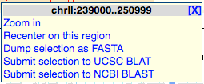
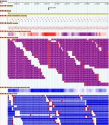

# ABRF2010 Workshop

From GMOD

Jump to: [navigation](#mw-navigation), [search](#p-search)

<table style="vertical-align: middle; border: 2px solid #A6A6BC"
data-cellpadding="10">
<colgroup>
<col style="width: 100%" />
</colgroup>
<tbody>
<tr class="odd">
<td>

</td>
</tr>
<tr class="even">
<td>

<strong>GMOD Browser Tools and Exercises Workshop</strong> 
Part of the <a
href="http://www.abrf2010.org/index.cfm/page/workshop_and_tours.htm#NextGen#NextGen"
class="external text" rel="nofollow">Next Generation DNA Sequencing
Analysis Satellite Meeting</a> 
<a href="http://www.abrf2010.org" class="external text"
rel="nofollow">ABRF 2010</a> 
3-4:30pm, 20 March 2010 
Sacramento, CA, USA

</td>
</tr>
</tbody>
</table>

  

## Contents

- [1
  Workshop](#Workshop)
  - [1.1 From the
    morning session](#From_the_morning_session)
  - [1.2 GMOD
    Genome Browser Tools](#GMOD_Genome_Browser_Tools)
  - [1.3
    GBrowse](#GBrowse)
    - [1.3.1
      About](#About)
    - [1.3.2
      Navigation and
      Searching](#Navigation_and_Searching)
    - [1.3.3
      Uploading user
      data](#Uploading_user_data)
      - [1.3.3.1 A
        few comments about the GFF produced this
        morning](#A_few_comments_about_the_GFF_produced_this_morning)
    - [1.3.4
      Sharing tracks with other users
      (customers)](#Sharing_tracks_with_other_users_.28customers.29)
      - [1.3.4.1
        Sharing](#Sharing)
      - [1.3.4.2
        Exporting](#Exporting)
    - [1.3.5
      Securing GBrowse and its
      data](#Securing_GBrowse_and_its_data)
      - [1.3.5.1
        Keep it on the
        intranet](#Keep_it_on_the_intranet)
      - [1.3.5.2
        Use Apache
        security](#Use_Apache_security)
      - [1.3.5.3
        Use Apache-style security on a per track
        basis](#Use_Apache-style_security_on_a_per_track_basis)
      - [1.3.5.4
        Use GBrowse user
        accounts](#Use_GBrowse_user_accounts)
    - [1.3.6
      Advanced topics](#Advanced_topics)
      - [1.3.6.1
        Installing and configuring
        GBrowse](#Installing_and_configuring_GBrowse)
  - [1.4
    JBrowse](#JBrowse)
    - [1.4.1
      Differences](#Differences)
    - [1.4.2
      Similarities](#Similarities)
- [2 Conference
  Talk](#Conference_Talk)

## Workshop

### From the morning session

A Note about the GFF from the morning session:

The first column of the GFF indicates the reference sequence for the
features in the GFF, and it has to match up with the reference sequences
that the browser knows about. Make sure that the first column of your
GFF file says NC_003070.9

### GMOD Genome Browser Tools

### GBrowse

#### About

[GBrowse](GBrowse.1 "GBrowse") is the most widely implemented genome
browser in use today, with several hundred servers around the world. For
this tutorial, we created a server at
<a href="http://gbrowse.gmod.org/gbrowse2" class="external free"
rel="nofollow">http://gbrowse.gmod.org/gbrowse2</a>, and specifically, a
GBrowse instance of *A. thaliana*
<a href="http://gbrowse.gmod.org/fgb2/gbrowse/arabidopsis"
class="external text" rel="nofollow">Chromosome 1</a>. You might want to
open that in another tab now to follow along and try things out during
this section. This is another link to a similar site on the same server
if the above one is giving you problems:
<a href="http://gbrowse.gmod.org/gb2/gbrowse/arabidopsis"
class="external text" rel="nofollow">Slower Chromosome 1</a>.

#### Navigation and Searching

The primary way people “get into” GBrowse is by searching for a gene or
other keyword. To search, the user just enters the text (gene name or
other identifier, or something in the description) into the “Landmark or
Region” box at the top of the display. Since we have arabidopsis data,
we could try things like “AT1G01930” or “Chr1:100000..200000”. We can
also do wild card searches, like “AT1G019\*”, which will give a list of
matches that we can choose from.

Once looking at the GBrowse display, there are typically two or three
graphical sections: the overview, region and details panel. The region
panel is optional (and can be configured to be on or off by the
administrator) and shows a “neighborhood” overview that doesn't cover as
much area as the overview (which is always the full length of the
chromosome or contig being looked at). While GBrowse has left and right
pan buttons on the side of the details panel, and similar buttons along
with a zoom menu above the overview panel, most people navigate GBrowse
by click and drag selection on one of the scale bars for the chromosome
at the top of each of panels. By pressing down on the left mouse button
and moving the mouse over the region to be navigated to, GBrowse will
either automatically go to the region selected, or depending on how
GBrowse is configured, will pop up a menu to let the user choose what
action to take. For example, in a sample yeast data set that comes with
GBrowse, this is the menu that is give when the user selects a region in
the details panel:

When GBrowse navigates to a new location, it uses AJAX (Asynchonous
Javascript and XML) to reload all of the tracks, so a complete page
reload is not necessary, making the browsing experience more
“continuous,” (though admittedly not as continuous as the JBrowse
experience). This same technology enables a few other niceties of
GBrowse:

- When new tracks are selected from the ones available in the list below
  the details panel, the new track is added without having to reload the
  page
- Since the tracks are drawn separately, the can also come from
  different servers, giving GBrowse the ability to work with multiple
  rendering and database servers to make it faster than it would
  otherwise be with just one server.
- The tracks can also be moved up or down relative to other tracks just
  by clicking on the name of the track and dragging it up or down.

#### Uploading user data

Several file formats are supported for upload to GBrowse:

- <a href="http://genome.ucsc.edu/FAQ/FAQformat#format1#format1"
  class="external text" rel="nofollow">BED</a>
- <a href="http://genome.ucsc.edu/FAQ/FAQformat#format3#format3"
  class="external text" rel="nofollow">GFF</a>
- <a href="http://www.sequenceontology.org/gff3.shtml"
  class="external text" rel="nofollow">GFF3</a>
- <a href="http://genome.ucsc.edu/goldenPath/help/wiggle.html"
  class="external text" rel="nofollow">Wiggle (WIG)</a> (for dense
  quantitative data)
- <a href="http://samtools.sourceforge.net/" class="external text"
  rel="nofollow">BAM or SAM</a> (for sequence alignment data)

Files that are uploaded in this way are secure, in that they can only be
seen by the person who uploaded them (or more specifically, on the
computer where they were uploaded), and with people that they have been
explicitly shared (see the section below for more on that).

In the morning section of the tutorial, we created GFF (not GFF3), so
we'll use that as an example of how to upload data. (This marks the
first time the server we are using is being used by a classroom—so let's
hope there are no fireworks!)

To make this work, you need to have the GFF file you created in the
morning session on your computer.

<a href="http://abrf.cgrb.oregonstate.edu/" class="external text"
rel="nofollow">Go Here and find your profile</a>, then find the GFF file
from this morning and save it on your computer.

Once you done that, go to
<a href="http://gbrowse.gmod.org/fgb2/gbrowse/arabidopsis"
class="external free"
rel="nofollow">http://gbrowse.gmod.org/fgb2/gbrowse/arabidopsis</a>.
Near the top of the page, there is a link for a tab called "Upload and
Share Tracks." Click on that and there is a simple interface for
uploading supported files. Clicking on "From a file" will give a normal
"browse" button to find the file on your computer. When you select the
file and click the upload button it will, it will show a spinner while
it uploads, and then give you a status report (the size of the file
uploaded, and links to edit the uploaded file and the created
configuration). It will also automatically load the track into GBrowse,
and clicking on the Browser link will take you back to the browser
display. If you see the track, but no features in it, be sure to
navigate to where in the genome the features are. Try this link if you
don't know where to look:

     http://gbrowse.gmod.org/fgb2/gbrowse/arabidopsis/?start=950000;stop=1050000;ref=NC_003070.9

Going back to the upload tab, you can click the "edit" link for the
configuration and see some of the adjustable parameters to make it look
different, by changing things like the fill color (bgcolor) or the
picture used for the features (glyph). For a list of commonly used
parameters, take a look at:

     http://gbrowse.gmod.org/gbrowse2/annotation_help.html#customize

If you run into problems and want to start over, you can use this link:

     http://gbrowse.gmod.org/fgb2/gbrowse/arabidopsis/?reset=1

which will throw away the uploaded file and restore the default
settings.

##### A few comments about the GFF produced this morning

The GFF produced this morning looks like this:

    NC_003070.9  cashx_gff    ABRF_Test    1455221 1455257 .    -    .    ABRF_Test;Note Mismatch=0
    NC_003070.9  cashx_gff    ABRF_Test    1200379 1200415 .    -    .    ABRF_Test;Note Mismatch=0
    NC_003070.9  cashx_gff    ABRF_Test    1170111 1170147 .    -    .    ABRF_Test;Note Mismatch=0
    NC_003070.9  cashx_gff    ABRF_Test    1017175 1017211 .    -    .    ABRF_Test;Note Mismatch=0

This is a "flavor" of GFF2 that GBrowse will accept, but doesn't really
care for (yes, you may have hurt it's feelings :-)

The problem is that the first entry in the ninth column is identical
("ABRF_Test") and this tells GBrowse that these things should all be
grouped together (in fact, that is called the group column in GFF
versions before GFF3). As a result, GBrowse draws lines connecting all
of these features as though they were all HSPs and part of one big hit
in a BLAST result, and this is probably not what is intended. Two ways
to improve upon this is to produce slightly different GFF2 or produce
GFF3 (which has a better, more
<a href="http://sequenceontology.org/gff3.shtml" class="external text"
rel="nofollow">clearly defined specification</a>).

GFF2:

    NC_003070.9  cashx_gff    ABRF_Test    1455221 1455257 .    -    .    ABRF_Test read1;Note Mismatch=0
    NC_003070.9  cashx_gff    ABRF_Test    1200379 1200415 .    -    .    ABRF_Test read2;Note Mismatch=0
    NC_003070.9  cashx_gff    ABRF_Test    1170111 1170147 .    -    .    ABRF_Test read3;Note Mismatch=0
    NC_003070.9  cashx_gff    ABRF_Test    1017175 1017211 .    -    .    ABRF_Test read4;Note Mismatch=0

Changes:

- Added an unique identifier after the "class" (the first word in column
  nine).

GFF3:

    NC_003070.9  cashx_gff    match    1455221 1455257 .    -    .    ID=read1;Note=Mismatch%3D0
    NC_003070.9  cashx_gff    match    1200379 1200415 .    -    .    ID=read2;Note=Mismatch%3D0
    NC_003070.9  cashx_gff    match    1170111 1170147 .    -    .    ID=read3;Note=Mismatch%3D0
    NC_003070.9  cashx_gff    match    1017175 1017211 .    -    .    ID=read4;Note=Mismatch%3D0

Changes:

- Third column (type) changed to match, which is a
  <a href="http://sequenceontology.org" class="external text"
  rel="nofollow">Sequence Ontology</a> term.
- Ninth column reformated to fit GFF3 specification, including:
  - URL escaping the equals sign in the Note ("%3D" is the code for
    equals sign).
  - Used unique IDs for each of the reads.

Two BAM files displayed in GBrowse

Finally, the best way to represent this data would be to create a BAM
file, which would result in faster rendering, and the ability to show
mismatches, like in this screen shot from an *E. coli* resequencing
project. BAM is a binary file format for storing alignment data in a
very compact, fast to read way, as part of the
<a href="http://samtools.sourceforge.net/" class="external text"
rel="nofollow">SAMtools</a> project.

In addition to showing the individual reads with mismatches highlighted,
it will also show coverage plots as density plots (shown in this screen
shot) or as xy plots, and will show read pairs, highlighting unpaired
reads.

#### Sharing tracks with other users (customers)

Any track (one that is "part of" the server or uploaded by a user) can
be shared with other users, in two different ways. One is to get a URL
that can be mailed to a user to click on it and be taken to the same
view that the sharer sees, and the other is to "export" the track so
that it can be viewed in a GBrowse instance on another server.

##### Sharing

To share a track, you can click on the concentric circle icon in the
track name (it looks like an RSS feed icon). This will pop up a window
that offers two URLs. The first one is the one we are currently
interested in. If you copy that url, it can be sent in an email to
someone else, can click on it and see the same track you are looking at.
The url will look something like this:

     http://gbrowse.gmod.org/fgb2/gbrowse/arabidopsis/?eurl=http://gbrowse.gmod.org/fgb2/gbrowse/arabidopsis/?gbgff=1%1Dq=$segment%1Dt=abrf_test_cashx_gff_ada658_ABRF_Test.gff_1%1Ds=1%1Duuid=ada658bfdafea163504bcea3cf562942

This can also be done in a secure way (password protected), but the
gbrowse.gmod.org server isn't set up for that. See the section below for
a description of that.

##### Exporting

This is a little more sophisticated, and we can't see an example of it
in this course, but had the GFF that was created in the morning session
used "Chr1" instead of the NCBI id, we could have exported our track and
viewed it in <a href="http://www.arabidopsis.org/" class="external text"
rel="nofollow">TAIR's</a> GBrowse instance. What this does is to harness
the remote server (in this example, the one at TAIR) to display any of
the annotations they have with our features included in the same
context. This can be a powerful "mash up" used for discovery of new
features.

#### Securing GBrowse and its data

If you have data that you would like to make permanently available on
your GBrowse instance, but don't want the whole world to see it, there
are several approaches that used in combination, give considerable
flexibility for securing GBrowse. Some of these set ups are moderately
complicated, though a senior in computer science should be able to do it
with little or no guidance.

##### Keep it on the intranet

If you institution has an intranet, GBrowse can be kept on the intranet
so that outsiders can't see it. This is a fairly simple solution if
"outsiders" are the problem.

##### Use Apache security

The Apache web server can be configured to prompt a visitor to your site
for a user name and a password, which you would only give to trusted
users. This sort of security can also be configured to only allow
connections from specific computers, or computers from a specific site
or range of IP addresses.

##### Use Apache-style security on a per track basis

GBrowse also supports Apache style authentication on a per track basis,
so you can specify the same sorts of restrictions mentioned above for
individual tracks. Say for example you had a NGS run and the results
could only be viewed by one lab. You could specify that only the
computer in that lab would be allowed to see the results. You can do
this for as many tracks as you like, so you could have multiple labs
looking at the same GBrowse instance, but only seeing the tracks they
are allowed to see.

##### Use GBrowse user accounts

GBrowse now also supports user accounts; you could have your users
create accounts on your GBrowse instance, and let you know what the
usernames are, then you can put data in their user account which would
let them see their data as well. This is functionally equivalent to the
Apache-style per track security, but perhaps a little easier on the
GBrowse administrator by pushing some of the work off to the users.

#### Advanced topics

##### Installing and configuring GBrowse

Installing GBrowse is relatively simple on Linux or Mac OS X servers. It
is a little more challenging on Windows servers, but it can still be
done. Typically, a computer science undergrad can do it in half a day,
or a computer savvy biology graduate student can do it in a little
longer, perhaps a day. There are a few hang ups that people run into
typically relating to getting a few of the prerequisites installed.

Getting it completely configured can be quick or take a long time
depending on the level of complexity desired. Typically, people take an
iterative approach, getting simple things done quickly and then working
on more complex things as time allows. There are a few good resources
for people new to installing and configuring GBrowse:

- The
  <a href="http://gmod.org" class="external text" rel="nofollow">GMOD
  wiki</a>
- The
  <a href="https://lists.sourceforge.net/lists/listinfo/gmod-gbrowse"
  class="external text" rel="nofollow">GBrowse mailing list</a>
- A few courses where GBrowse is covered:
  - The <a href="http://meetings.cshl.edu/courses/c-info10.shtml"
    class="external text" rel="nofollow">Programming for Biology</a>
    course at Cold Spring Harbor Laboratory
  - Courses put on by NESCent (previously referred to as summer schools,
    but since this year, one is in May, and another will probably be in
    the fall, we have to come up with a new name). The next course,
    <a href="GMOD_News#GMOD_Summer_School_-_Americas" class="external text"
    rel="nofollow">this May</a>, is already sold out. There will likely
    be one next October in Japan in conjunction with the
    <a href="http://www.biocurator.org/home.shtml" class="external text"
    rel="nofollow">International Society of Biocuration</a> meeting.

  

### JBrowse

<a
href="http://jbrowse.org/test/ngs-dmel-demo/?loc=2R:9424506..9427136&amp;tracks=mRNA,BAM_test,chromosome_band,EST"
class="external text" rel="nofollow">Demo with next-gen reads</a>

<a href="http://jbrowse.org/genomes/dmel/" class="external text"
rel="nofollow">main fly demo</a>

<a
href="http://jbrowse.org/ucsc/hg19/?loc=chr2:69620249..69646549&amp;tracks=DNA,ChromosomeBand,RefSeqGenes,GenomeVariants-CEU-daught-2878,GenomeVariants-CEU-father-2891,SplicedESTs"
class="external text" rel="nofollow">HG19 (subset) demo</a>

#### Differences

| GBrowse             | JBrowse                   |
|---------------------|---------------------------|
| Older               | Newer                     |
| More functionality  | Faster, smoother UI       |
| Does work on server | Moves work to web browser |

  

#### Similarities

|                                |
|--------------------------------|
| Same underlying Perl machinery |
| Same data sources              |

  

The moving parts in JBrowse:

  
You have your own JBrowse instance on the server:

  
<a href="http://abrf2010.jbrowse.org/~profilename/"
class="external free"
rel="nofollow">http://abrf2010.jbrowse.org/~profilename/</a>

  
SSH into the ABRF jbrowse machine:
abrf2010.jbrowse.org

User: your profile name from the morning session

Password: abrf_HTS

    ssh profilename@abrf2010.jbrowse.org

  
Copy your GFF file from this morning to this machine:

    wget --http-user=abrf_workshop --http-password=abrf_HTS http://abrf.cgrb.oregonstate.edu/UserData/mitch/finaloutput-cashx_18887.dir/finaloutput-cashx.gff

OR

    cp ~mitch/finaloutput-cashx.gff ~/

Go into your JBrowse installation:

    cd public_html

  
Add the GFF file to your JBrowse instance:

    bin/flatfile-to-json.pl --gff2 ~mitch/finaloutput-cashx.gff --tracklabel "ABRF_Test" --key "ABRF Test" --cssclass feature3

## Conference Talk

**Seeing the Forest and the Trees: Visualizing Next Generation Sequence
Data**, by [Mitch Skinner](User:MitchSkinner "User:MitchSkinner")

Part of the Session *Tools to Facilitate Management, Analysis and
Visualization of 2nd Generation Sequencing Data*

3:45pm - 5:00pm, Monday, March 22

Retrieved from
"<http://gmod.org/mediawiki/index.php?title=ABRF2010_Workshop&oldid=21958>"

[Categories](Special:Categories "Special:Categories"):

- [GBrowse](Category:GBrowse "Category:GBrowse")
- [GBrowse 2](Category:GBrowse_2 "Category:GBrowse 2")
- [Tutorials](Category:Tutorials "Category:Tutorials")
- [Education and
  Outreach](Category:Education_and_Outreach "Category:Education and Outreach")
- [JBrowse](Category:JBrowse "Category:JBrowse")

## Navigation menu

### Namespaces

- <a href="ABRF2010_Workshop" accesskey="c"
  title="View the content page [c]">Page</a>
- <a
  href="http://gmod.org/mediawiki/index.php?title=Talk:ABRF2010_Workshop&amp;action=edit&amp;redlink=1"
  accesskey="t"
  title="Discussion about the content page [t]">Discussion</a>

### 

### Variants

### Views

- [Read](ABRF2010_Workshop)
- <a
  href="http://gmod.org/mediawiki/index.php?title=ABRF2010_Workshop&amp;action=edit"
  accesskey="e" title="This page is protected.
  You can view its source [e]">View source</a>
- <a
  href="http://gmod.org/mediawiki/index.php?title=ABRF2010_Workshop&amp;action=history"
  accesskey="h" title="Past revisions of this page [h]">View history</a>

### Actions

### Search

### Navigation

- [GMOD Home](Main_Page)
- [Software](GMOD_Components)
- [Categories /
  Tags](Categories)
- [View all pages](Special:AllPages)

### Documentation

- [Overview](Overview)
- [FAQs](Category:FAQ)
- [HOWTOs](Category:HOWTO)
- [Glossary](Glossary)

### Community

- [GMOD News](GMOD_News)
- [Training /
  Outreach](Training_and_Outreach)
- [Support](Support)
- [GMOD Promotion](GMOD_Promotion)
- [Meetings](Meetings)
- [Calendar](Calendar)

### Tools

- <a href="Special:WhatLinksHere/ABRF2010_Workshop" accesskey="j"
  title="A list of all wiki pages that link here [j]">What links here</a>
- <a href="Special:RecentChangesLinked/ABRF2010_Workshop" accesskey="k"
  title="Recent changes in pages linked from this page [k]">Related
  changes</a>
- <a href="Special:SpecialPages" accesskey="q"
  title="A list of all special pages [q]">Special pages</a>
- <a
  href="http://gmod.org/mediawiki/index.php?title=ABRF2010_Workshop&amp;printable=yes"
  rel="alternate" accesskey="p"
  title="Printable version of this page [p]">Printable version</a>
- [Permanent
  link](http://gmod.org/mediawiki/index.php?title=ABRF2010_Workshop&oldid=21958 "Permanent link to this revision of the page")
- [Page
  information](http://gmod.org/mediawiki/index.php?title=ABRF2010_Workshop&action=info)
- <a href="Special:Browse/ABRF2010_Workshop" rel="smw-browse">Browse
  properties</a>
- [Print as
  PDF](http://gmod.org/mediawiki/index.php?title=Special:PdfPrint&page=ABRF2010_Workshop)

- Last updated at 18:52 on 8 October
  2012.
- 223,725 page views.
- Content is available under
  <a href="http://www.gnu.org/licenses/fdl-1.3.html" class="external"
  rel="nofollow">a GNU Free Documentation License</a> unless otherwise
  noted.

<!-- -->

- [About
  GMOD](GMOD:About "GMOD:About")

<!-- -->

- 
- 
  

