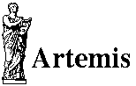

<div id="mw-page-base" class="noprint">

</div>

<div id="mw-head-base" class="noprint">

</div>

<div id="content" class="mw-body" role="main">

<span id="top"></span>

<div id="mw-js-message" style="display:none;">

</div>


# <span dir="auto">Artemis-Chado Integration Tutorial</span>

<div id="bodyContent">

<div id="siteSub">

From GMOD

</div>

<div id="contentSub">

</div>

<div id="jump-to-nav" class="mw-jump">

Jump to: [navigation](#mw-navigation), [search](#p-search)

</div>

<div id="mw-content-text" class="mw-content-ltr" lang="en" dir="ltr">

  

<div class="center">

<div class="floatnone">

<a href="File:Artemis_logo.gif" class="image" title="Artemis"></a>

</div>

</div>

This [Artemis-Chado Integration](Artemis "Artemis") tutorial was
presented by [Robin Houston](User:RobinHouston "User:RobinHouston"),
[Tim Carver](User:TimCarver "User:TimCarver") and [Giles
Velarde](User:Buggy "User:Buggy") at the 2009 GMOD Summer School -
Europe, August 2009. The most recent Artemis tutorial can be found at
the <a href="Artemis_Tutorial" class="mw-redirect"
title="Artemis Tutorial">Artemis Tutorial</a> page.

This [tutorial](Category:Tutorials "Category:Tutorials") walks you
through how to use the Artemis annotation editor with a
<a href="Chado" class="mw-redirect" title="Chado">Chado</a> database.

## <span id="VMware" class="mw-headline">VMware</span>

- <a
  href="ftp://ftp.gmod.org/pub/gmod/Courses/2009/SummerSchoolEurope/GmodSumSch2009EU4.tar.gz"
  class="external text" rel="nofollow">Starting Image</a>
- <a
  href="ftp://ftp.gmod.org/pub/gmod/Courses/2009/SummerSchoolEurope/GmodSumSch2009EU5.tar.gz"
  class="external text" rel="nofollow">Ending Image</a>

<!-- -->

- Username: gmod
- Password: gmod

## <span id="Caveats" class="mw-headline">Caveats</span>

<div class="emphasisbox">

**Important Note**

This [tutorial](Category:Tutorials "Category:Tutorials") describes the
world as it existed on the day the tutorial was given. Please be aware
that things like CPAN modules, Java libraries, and Linux packages change
over time, and that the instructions in the tutorial will slowly drift
over time. Newer versions of tutorials will be posted as they become
available.

</div>

<div id="toc" class="toc">

<div id="toctitle">

## Contents

</div>

- [<span class="tocnumber">1</span>
  <span class="toctext">VMware</span>](#VMware)
- [<span class="tocnumber">2</span>
  <span class="toctext">Caveats</span>](#Caveats)
- [<span class="tocnumber">3</span>
  <span class="toctext">Overview</span>](#Overview)
- [<span class="tocnumber">4</span> <span class="toctext">Download and
  Install Postgres</span>](#Download_and_Install_Postgres)
- [<span class="tocnumber">5</span> <span class="toctext">Download and
  Install Chado</span>](#Download_and_Install_Chado)
- [<span class="tocnumber">6</span> <span class="toctext">Examples of
  Loading Sequences into the
  Database</span>](#Examples_of_Loading_Sequences_into_the_Database)
- [<span class="tocnumber">7</span> <span class="toctext">Download
  Artemis and ACT</span>](#Download_Artemis_and_ACT)
- [<span class="tocnumber">8</span> <span class="toctext">Running
  Artemis</span>](#Running_Artemis)
- [<span class="tocnumber">9</span> <span class="toctext">Configuration
  Options</span>](#Configuration_Options)
- [<span class="tocnumber">10</span> <span class="toctext">Artemis
  Database Manager</span>](#Artemis_Database_Manager)
- [<span class="tocnumber">11</span> <span class="toctext">Adding
  Controlled Vocabulary Qualifiers in the Artemis Gene
  Builder</span>](#Adding_Controlled_Vocabulary_Qualifiers_in_the_Artemis_Gene_Builder)
- [<span class="tocnumber">12</span> <span class="toctext">Transfer
  Annotation Tool (TAT)</span>](#Transfer_Annotation_Tool_.28TAT.29)
- [<span class="tocnumber">13</span> <span class="toctext">Logging
  Information</span>](#Logging_Information)
- [<span class="tocnumber">14</span> <span class="toctext">Running
  ACT</span>](#Running_ACT)
- [<span class="tocnumber">15</span> <span class="toctext">Writing Out
  Sequence Files</span>](#Writing_Out_Sequence_Files)
- [<span class="tocnumber">16</span> <span class="toctext">Mailing
  List</span>](#Mailing_List)
- [<span class="tocnumber">17</span>
  <span class="toctext">References</span>](#References)

</div>

## <span id="Overview" class="mw-headline">Overview</span>

In this [tutorial](Category:Tutorials "Category:Tutorials") we present
how to install and configure
<a href="http://www.sanger.ac.uk/Software/Artemis/"
class="external text" rel="nofollow">Artemis</a> and
<a href="http://www.sanger.ac.uk/Software/ACT/" class="external text"
rel="nofollow">ACT</a> to use with a
<a href="Chado" class="mw-redirect" title="Chado">Chado</a> database.
The first two sections relate to installing
<a href="Postgres" class="mw-redirect" title="Postgres">Postgres</a> and
Chado, this is included for completeness only and you should refer to
the <a href="Chado_Tutorial" class="mw-redirect"
title="Chado Tutorial">Chado session</a> for more details on this.

Artemis is a DNA sequence browser which works with flat files (*e.g.*
EMBL, GenBank, [GFF](GFF "GFF")) and more recently with Chado databases.
ACT (Artemis Comparison Tool) is based on Artemis. ACT uses BLAST
comparison files to highlight regions of interest between pairs of
sequences. Artemis and ACT in database mode are increasingly being used
in the Pathogen Genomics Group at the Sanger Institute.

## <span id="Download_and_Install_Postgres" class="mw-headline">Download and Install <a href="Postgres" class="mw-redirect" title="Postgres">Postgres</a></span>

    ./configure --prefix=/home/gmod/gmod_test/pgsl --with-pgport=5432 --with-includes=/Developer
    make
    make install

    cd /home/gmod/gmod_test/pgsl
    bin/initdb -D data/

Added the line to `data/postgresql.conf`:

    listen_addresses = 'localhost'

Create the database:

    postmaster -D data &
    createuser --createdb username
    createlang plpgsql template1
    createdb --port=5432 chado_pathogen

## <span id="Download_and_Install_Chado" class="mw-headline">Download and Install Chado</span>

- Download stable release (gmod-1.0.tar.gz)
- Install [BioPerl](BioPerl "BioPerl")
  (<a href="http://www.bioperl.org/wiki/Installing_Bioperl_for_Unix"
  class="external free"
  rel="nofollow">http://www.bioperl.org/wiki/Installing_Bioperl_for_Unix</a>)
- Install go-perl <a href="http://search.cpan.org/~cmungall/go-perl/"
  class="external free"
  rel="nofollow">http://search.cpan.org/~cmungall/go-perl/</a>
- Install Bundle::GMOD from cpan

<!-- -->

    export GMOD_ROOT=/usr/local/gmod CHADO_DB_NAME=chado_pathogen CHADO_DB_USERNAME=username CHADO_DB_PORT=5432

Now compile Chado and install the standard components (schema and
ontologies):

    perl Makefile.PL
    make
    sudo make install
    make load_schema
    make prepdb
    make ontologies

## <span id="Examples_of_Loading_Sequences_into_the_Database" class="mw-headline">Examples of Loading Sequences into the Database</span>

In this section we detail how to load 3 *Plasmodium* sequences into
<a href="Chado" class="mw-redirect" title="Chado">Chado</a> for viewing
in Artemis and ACT. Alternatively you can use your own sequences of
interest.

The GenBank files are available from Entrez with the links below. Make
sure you download it with the sequence by clicking on the option 'Show
sequence' and 'Update View'. Then go to the Download menu and select
GenBank(Full):

- <a
  href="http://www.ncbi.nlm.nih.gov/sites/entrez?db=nucleotide&amp;cmd=search&amp;term=NC_004314"
  class="external text" rel="nofollow">NC_004314</a> (*Plasmodium
  falciparum* 3D7 chromosome 10)
- <a
  href="http://www.ncbi.nlm.nih.gov/sites/entrez?db=nucleotide&amp;cmd=search&amp;term=NC_011907"
  class="external text" rel="nofollow">NC_011907</a> (*Plasmodium
  knowlesi* chromosome 6) and
- <a
  href="http://www.ncbi.nlm.nih.gov/sites/entrez?db=nucleotide&amp;cmd=search&amp;term=NC_011909"
  class="external text" rel="nofollow">NC_011909</a> (*Plasmodium
  knowlesi* chromosome 8).

These are usually downloaded to the `Desktop` directory (depending on
the browser). They are saved as something like `sequences.gbwithparts`.
Re-name them as `NC_004314.gbk`, `NC_011907.gbk` and `NC_011909.gbk`.
*Pfalciparum* and *Pknowlesi* will need to be added to your organism
table in Chado.

     psql chado_pathogen

<div class="mw-geshi mw-code mw-content-ltr" dir="ltr">

<div class="sql source-sql">

``` de1
   INSERT INTO organism
     ( abbreviation, genus, species, common_name )
   VALUES
     ( 'Pfalciparum', 'Plasmodium', 'falciparum', 'Pfalciparum'),
     ( 'Pknowlesi', 'Plasmodium', 'knowlesi', 'Pknowlesi');
```

</div>

</div>

Using the perl script `bp_genbank2gff3.pl` to convert the GenBank files
to [GFF3](GFF3 "GFF3") format:

    bp_genbank2gff3.pl -noCDS *.gbk

You need to modify the GFF files so that the correct SO term is used:

    perl -pi~ -e s'|processed_transcript|mature_transcript|' *.gff

Then load the GFF3 files that have been created:

    gmod_bulk_load_gff3.pl -organism Pfalciparum -dbname chado_pathogen \
        -dbuser gmod -dbport 5432 -dbpass dd -recreate_cache < NC_004314.gbk.gff

    gmod_bulk_load_gff3.pl -organism Pknowlesi -dbname chado_pathogen \
        -dbuser gmod -dbport 5432 -dbpass dd -recreate_cache < NC_011907.gbk.gff

    gmod_bulk_load_gff3.pl -organism Pknowlesi -dbname chado_pathogen \
        -dbuser gmod -dbport 5432 -dbpass dd -recreate_cache < NC_011909.gbk.gff

## <span id="Download_Artemis_and_ACT" class="mw-headline">Download Artemis and ACT</span>

You can download <a href="http://www.sanger.ac.uk/Software/Artemis/"
class="external text" rel="nofollow">Artemis</a> and
<a href="http://www.sanger.ac.uk/Software/ACT/" class="external text"
rel="nofollow">ACT</a> from their home pages at the Sanger Institute.
For the most up-to-date developments download the software from the
[CVS](Glossary#CVS "Glossary") server:

    cvs -d :pserver:cvsuser@cvs.sanger.ac.uk:/cvsroot/pathsoft co artemis

Now compile the software:

    cd artemis
    make

Or download the development version from the <a
href="http://www.sanger.ac.uk/Software/Artemis/#development#development"
class="external text" rel="nofollow">Development section</a> on the
Artemis home page. Note that on the Artemis web site there is also a
<a href="http://www.sanger.ac.uk/Software/Artemis/stable/"
class="external text" rel="nofollow">stable</a> release available.

## <span id="Running_Artemis" class="mw-headline">Running Artemis</span>

Try running the `art` script in the download:

    ./art -Dchado="localhost:5432/chado_pathogen?gmod" -Dibatis

This opens the login window:

  
<a href="File:ArtemisLogin.gif" class="image"></a>

  
The Artemis Database Manager and File Manager will open once your login
has been authenticated. The top part of this relates to the
<a href="Chado" class="mw-redirect" title="Chado">Chado</a> database and
the bottom comprises the file management:

  
<a href="File:DatabaseManager.gif" class="image"></a>

  
Select the sequence NC_004314 and double click on it to open it up in
Artemis.

  
<a href="File:Artemis.gif" class="image"></a>

  
There are 3 main components to the Artemis window. The two top Feature
Displays show the sequence at different levels of granularity and below
these is a feature list:

1.  the **top Feature Display** is a zoomed out view of the sequence.
    The 3 forward and 3 reverse frames of translation are show with stop
    codons marked as black vertical lines.
2.  the **second Feature Display** shows the sequence at the nucleotide
    level. The amino acid translations are seen in this view.
3.  the **Feature List** shows the feature types and location. Options
    for displaying user defined qualifiers (e.g. Dbxref) can be accessed
    by right clicking on this list and selecting "Show Selected
    Qualifiers".

These three components are connected, so that if you select a feature in
one then that feature becomes selected in the others. Double clicking on
the feature centers the feature in both feature displays. The scroll
bars on the right hand side of the feature displays allow you to zoom in
and out.

The alternative way to open your sequence is to provide the entry (e.g.
Pfalciparum:NC_004314) you want to open as a command line argument:

     ./art -Dchado="localhost:5432/chado_pathogen?gmod" -Dibatis \
            Pfalciparum:NC_004314

For any of the gene features in Artemis you can select them and press
the short cut key 'E' (Edit → Selected Features in Editor). This opens
up the Gene Builder. Within this the Gene Model can be edited and
annotation added.

  
<a href="File:GeneBuilder.gif" class="image" title="GeneBuilder"></a>

  
It is also possible to launch the Artemis Gene Builder in a standalone
mode for a particular gene:

    etc/gene_builder -Dchado="localhost:5432/chado_pathogen?gmod" -Dibatis -Dshow_log PF10_0003

or in read-only mode you can open a gene in GeneDB (at the Sanger
Institute):

    etc/gene_builder -Dchado="db.genedb.org:5432/snapshot?genedb_ro" -Dibatis  -Dshow_log -Dread_only PFA0010c

Note using the JVM option 'show_log' will open the log window.

## <span id="Configuration_Options" class="mw-headline">Configuration Options</span>

Edit `etc/options` (to change settings globally) or create a file
`~/.artemis_options` in your home directory (for your own settings).
There are various flags that can be used to configure Artemis and ACT
with <a href="Chado" class="mw-redirect" title="Chado">Chado</a>.

**chado_servers** This allows you to provide a list of available servers
for the user to select:

    chado_servers = \
      Plasmodium localhost:5432/chado_pathogen?username \
      GeneDB db.genedb.org:5432/snapshot?genedb_ro

**product_cv** In the Pathogen Genomics Group the product qualifiers are
stored as an ontology (as a cv in feature_cvterm). This can be changed
so that they are stored as featureprop's by setting the product_cv
option:

    product_cv=no

This will mean that the product will be shown in the "Core" section of
the Artemis Gene Builder rather than the "Controlled Vocabulary"
section.

**synonym_cvname** If synonym types are loaded into a CV, Artemis checks
this ontology.

**set_obsolete_on_delete** This will set the default behaviour of
Artemis when features are deleted. If set to:

    set_obsolete_on_delete=yes

the features will be made obsolete. The user is still prompted with the
option to permanently delete the feature. If this line is not in the
option file the default is to permanently delete features.

**Selecting an alternative gene model** Artemis supports 2 types of gene
model representations:

A\) Pathogen Genomics Gene Model - implicit CDS + explicit UTRs

      gene
      |
      |- part_of mRNA
         |
         |---- part_of exon
         |
         |---- derives_from polypeptide
         |
         |---- part_of five_prime_UTR
         |
         |---- part_of three_prime_UTR

B\) implicit CDS + UTRs

      gene
      |
      |- part_of mRNA
         |
         |---- part_of exon
         |
         |---- derives_from polypeptide

The Artemis default is model A. To use model B then set:

    chado_infer_CDS_UTR=yes

**sequence_update_features** This lists the features that Artemis will
maintain the feature.residue column for. This is generally useful for
polypeptide and transcript features.

## <span id="Artemis_Database_Manager" class="mw-headline">Artemis Database Manager</span>

The database manager provides the list of organisms that have features
with residues (currently Artemis searches for these on features of type:
'\*chromosome\*', '\*sequence\*', 'supercontig', 'ultra_scaffold',
'golden_path_region', 'contig'). The database manager is cached between
sessions (this is on by default and can be switched off with
`-Ddatabase_manager_cache_off`). There is an option under the File menu
to clear this cache.

## <span id="Adding_Controlled_Vocabulary_Qualifiers_in_the_Artemis_Gene_Builder" class="mw-headline">Adding Controlled Vocabulary Qualifiers in the Artemis Gene Builder</span>

These use evidence codes which are stored as a feature_cvtermprop's with
a type_id which corresponds to a cvterm.name = 'evidence'. There is a
useful [SQL](Glossary#SQL "Glossary") script (`etc/chado_extra.sql`) in
the Artemis distribution for creating this term in
<a href="Chado" class="mw-redirect" title="Chado">Chado</a>. Run this on
the chado_pathogen instance of the database:

    psql -d chado_pathogen -f etc/chado_extra.sql

(This will also create other terms that are used to store literature
(PMID's) qualifiers.)

GO terms can now be selected in the Controlled Vocabulary (CV) section
of the Gene Builder and added to features. Additional custom CV's can
also be used. For Artemis to recognise it and display it the name of the
CV needs to be prefixed by 'CC\_'. These then appear in a drop down list
when adding CV terms to a feature. Try adding a new CV:

     psql chado_pathogen

<div class="mw-geshi mw-code mw-content-ltr" dir="ltr">

<div class="sql source-sql">

``` de1
   INSERT INTO cv ( name, definition ) VALUES ( 'CC_test', 'test' );
```

</div>

</div>

and create a CvTerm in this CV:

<div class="mw-geshi mw-code mw-content-ltr" dir="ltr">

<div class="sql source-sql">

``` de1
   INSERT INTO dbxref
     ( db_id, accession )
   VALUES
     ( (SELECT db_id FROM db WHERE name = 'CCGEN'), 'test1' );
 
   INSERT INTO cvterm
     ( cv_id,  name, dbxref_id )
   VALUES
     ( (SELECT cv_id FROM cv WHERE name ='CC_test'), 'test1',
       (SELECT dbxref_id FROM dbxref WHERE accession='test1') );
```

</div>

</div>

Now re-launch Artemis and open the Gene Builder at any feature and go to
the 'Controlled Vocabulary' section and click the 'ADD' button. This CV
(CC_test) will appear in the drop down menu:

  
<a href="File:AddCV.gif" class="image"></a>

  
Click on CC_test and hit the 'Next' button. This opens a keyword
selection box. If you leave this blank all the terms are retrieved and
displayed. If you keep clicking 'Next' this term is then added to the
'Controlled Vocabulary' section.

  

## <span id="Transfer_Annotation_Tool_.28TAT.29" class="mw-headline">Transfer Annotation Tool (TAT)</span>

This tool can be accessed from the Gene Builder - look for the TAT
button. It allows you to transfer annotation between sequences. In
database mode Artemis provides an editable list of genes constructed
from ortholog/parlog links. These links can be added in the Gene Builder
in the Match section (for example you can try creating the ortholog link
between PF10_0165 in *Pfalciparum* and PKH_060110 in *Pknowlesi*).

## <span id="Logging_Information" class="mw-headline">Logging Information</span>

Note that you can easily access the logging information Artemis
produces. In the Artemis launch window under the 'Options' menu select
the 'Show Log Window', this provides the logs. This is controlled by
`etc/log4j.properties`. The logs can be useful for debugging and for
monitoring activity if appended to a central file. See the
<a href="http://logging.apache.org/log4j/" class="external text"
rel="nofollow">log4j</a> documentation for more information.

## <span id="Running_ACT" class="mw-headline">Running ACT</span>

ACT can read sequences in from the database as well. However, it
currently does not read the BLAST comparisons from
<a href="Chado" class="mw-redirect" title="Chado">Chado</a> but reads
this data from files. These comparisons are displayed as the matches
between the sequences. To distinguish forward and reverse matches the
forward matches are red and reverse matches are blue.

For convenience the comparison files have been pre-generated for this
exercise and can be downloaded from:

    wget ftp://ftp.sanger.ac.uk/pub/pathogens/workshops/GMOD2009/NC_004314_v_NC_011907_tblastx.gz
    wget ftp://ftp.sanger.ac.uk/pub/pathogens/workshops/GMOD2009/NC_004314_v_NC_011909_tblastx.gz

Note that both Artemis and ACT automatically open gzipped files. For
details on generating these files go to <a
href="http://gmod.org/mediawiki/index.php?title=ACT_Comparison_Files&amp;action=edit&amp;redlink=1"
class="new" title="ACT Comparison Files (page does not exist)">ACT
Comparison Files</a>.

To run ACT use the `act` script:

    ./act -Dchado="localhost:5432/chado_pathogen?gmod" -Dibatis

From the 'File' menu select the option 'Open Database and SSH File
Manager' and login. Drag and drop the *Plasmodium* entries from the
Database Manager into the ACT selection window. Also, drag and drop the
comparison files into this window, so it looks something like this (note
the featureId numbers may well be different as these are the Chado
feature_id):

  
<a href="File:ActSelection2seqs.gif" class="image"></a>

  
Click on Apply to read these entries and open up ACT. You can use the
right hand scroll bar to zoom in and out. If you zoom out you can
indentify the regions that match between these sequences.

  
<a href="File:Pf10_Pk6.gif" class="image"></a>

  
ACT can display multiple pairwise comparison. So the two `P.knowlesi`
sequences can be compared to the `P.falciparum sequence`. From the ACT
launch window go to the File menu and select 'Open Database and SSH File
Manager'. Drag in the sequences and comparison files (clicking on 'more
files' to add the additional sequence and comparison).

  
<a href="File:ActSelection.gif" class="image"></a>

  
Zooming out you will see that *Pfalciparum* chromosome 10 matches to
regions in *Pknowlesi* chromosome 7 and 9.

  
<a href="File:Pk6_Pf10_Pk8.gif" class="image"></a>

  

## <span id="Writing_Out_Sequence_Files" class="mw-headline">Writing Out Sequence Files</span>

Artemis can write out EMBL and [GFF](GFF "GFF") files for an entry
opened from the database. You can optionally flatten the gene model
(i.e. gene, transcript, exon) to just a CDS feature. Also an option is
given to ignore any obsolete features. For EMBL it uses mappings for
conversion of the keys and qualifiers. These mappings are stored in the
`etc/key_mapping` and `etc/qualifier_mapping` files.

A utility script (`etc/write_db_entry`) is also provided as a means of
writing out multiple sequences from the database. The script takes the
following options:

    -h      show help
    -f      [y|n] flatten the gene model, default is y
    -i      [y|n] ignore obsolete features, default is y
    -s      space separated list of sequences to read and write out
    -o      [EMBL|GFF] output format, default is EMBL
    -a      [y|n] for EMBL submission format change to n, default is y

Try running:

    etc/writedb_entry -Dchado="localhost:5432/chado_pathogen?gmod" NC_004314

## <span id="Mailing_List" class="mw-headline">Mailing List</span>

There is an Artemis mailing list:
<a href="http://lists.sanger.ac.uk/mailman/listinfo/artemis-users"
class="external text" rel="nofollow">artemis-user</a>.

## <span id="References" class="mw-headline">References</span>

- <a href="http://www.sanger.ac.uk/Software/Artemis/"
  class="external text" rel="nofollow">Artemis home page</a>
- <a href="http://www.sanger.ac.uk/Software/ACT/" class="external text"
  rel="nofollow">ACT home page</a>
- <a href="http://www.sanger.ac.uk/Software/Artemis/v11/chado/"
  class="external text" rel="nofollow">Artemis Connecting to Chado
  Databases</a>
- <a
  href="http://www.sanger.ac.uk/Software/Artemis/v11/database/chado.practical.guide.pdf"
  class="external text" rel="nofollow">User Practical Guide</a>

</div>

<div class="printfooter">

Retrieved from
"<http://gmod.org/mediawiki/index.php?title=Artemis-Chado_Integration_Tutorial&oldid=22154>"

</div>

<div id="catlinks" class="catlinks">

<div id="mw-normal-catlinks" class="mw-normal-catlinks">

[Categories](Special:Categories "Special:Categories"):

- [Tutorials](Category:Tutorials "Category:Tutorials")
- [Annotation](Category:Annotation "Category:Annotation")

</div>

</div>

<div id="mw-data-after-content">

<div class="smwfact">

<span class="smwfactboxhead">Facts about
"<span class="swmfactboxheadbrowse">[Artemis-Chado Integration
Tutorial](Special:Browse/Artemis-2DChado-20Integration-20Tutorial "Special:Browse/Artemis-2DChado-20Integration-20Tutorial")</span>"</span><span class="smwrdflink"><span class="rdflink">[RDF
feed](http://gmod.org/wiki/Special:ExportRDF/Artemis-Chado_Integration_Tutorial "Special:ExportRDF/Artemis-Chado Integration Tutorial")</span></span>

|  |  |
|----|----|
| [Has topic](Property:Has_topic "Property:Has topic") | [Artemis](Artemis "Artemis") <span class="smwsearch">[+](Special:SearchByProperty/Has-20topic/Artemis "Special:SearchByProperty/Has-20topic/Artemis")</span> |

</div>

</div>

<div class="visualClear">

</div>

</div>

</div>

<div id="mw-navigation">

## Navigation menu

<div id="mw-head">


<div id="left-navigation">

<div id="p-namespaces" class="vectorTabs" role="navigation"
aria-labelledby="p-namespaces-label">

### Namespaces

- <span id="ca-nstab-main"><a href="Artemis-Chado_Integration_Tutorial" accesskey="c"
  title="View the content page [c]">Page</a></span>
- <span id="ca-talk"><a
  href="http://gmod.org/mediawiki/index.php?title=Talk:Artemis-Chado_Integration_Tutorial&amp;action=edit&amp;redlink=1"
  accesskey="t"
  title="Discussion about the content page [t]">Discussion</a></span>

</div>

<div id="p-variants" class="vectorMenu emptyPortlet" role="navigation"
aria-labelledby="p-variants-label">

### 

### Variants[](#)

<div class="menu">

</div>

</div>

</div>

<div id="right-navigation">


</div>


</div>

</div>

</div>

<div id="mw-panel">

<div id="p-logo" role="banner">

<a href="Main_Page"
style="background-image: url(../images/GMOD-cogs.png);"
title="Visit the main page"></a>

</div>

<div id="p-Navigation" class="portal" role="navigation"
aria-labelledby="p-Navigation-label">

### Navigation

<div class="body">

- <span id="n-GMOD-Home">[GMOD Home](Main_Page)</span>
- <span id="n-Software">[Software](GMOD_Components)</span>
- <span id="n-Categories-.2F-Tags">[Categories /
  Tags](Categories)</span>
- <span id="n-View-all-pages">[View all pages](Special:AllPages)</span>

</div>

</div>

<div id="p-Documentation" class="portal" role="navigation"
aria-labelledby="p-Documentation-label">

### Documentation

<div class="body">

- <span id="n-Overview">[Overview](Overview)</span>
- <span id="n-FAQs">[FAQs](Category:FAQ)</span>
- <span id="n-HOWTOs">[HOWTOs](Category:HOWTO)</span>
- <span id="n-Glossary">[Glossary](Glossary)</span>

</div>

</div>

<div id="p-Community" class="portal" role="navigation"
aria-labelledby="p-Community-label">

### Community

<div class="body">

- <span id="n-GMOD-News">[GMOD News](GMOD_News)</span>
- <span id="n-Training-.2F-Outreach">[Training /
  Outreach](Training_and_Outreach)</span>
- <span id="n-Support">[Support](Support)</span>
- <span id="n-GMOD-Promotion">[GMOD Promotion](GMOD_Promotion)</span>
- <span id="n-Meetings">[Meetings](Meetings)</span>
- <span id="n-Calendar">[Calendar](Calendar)</span>

</div>

</div>

<div id="p-tb" class="portal" role="navigation"
aria-labelledby="p-tb-label">

### Tools

<div class="body">


- <span id="t-smwbrowselink"><a href="Special:Browse/Artemis-2DChado_Integration_Tutorial"
  rel="smw-browse">Browse properties</a></span>


</div>

</div>

</div>

</div>

<div id="footer" role="contentinfo">

- <span id="footer-info-lastmod">Last updated at 23:33 on 8 October
  2012.</span>
<!-- - <span id="footer-info-viewcount">54,132 page views.</span> -->
- <span id="footer-info-copyright">Content is available under
  <a href="http://www.gnu.org/licenses/fdl-1.3.html" class="external"
  rel="nofollow">a GNU Free Documentation License</a> unless otherwise
  noted.</span>

<!-- -->

- <span id="footer-places-about">[About
  GMOD](GMOD:About "GMOD:About")</span>

<!-- -->

- <span id="footer-copyrightico">[](http://www.gnu.org/licenses/fdl-1.3.html)</span>


</div>
