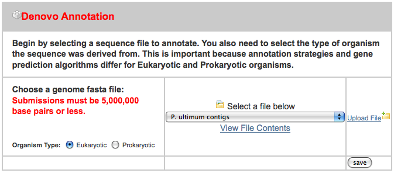
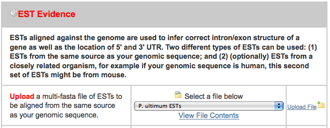
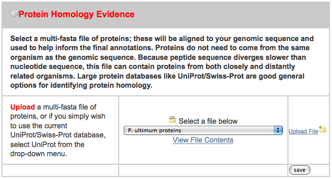
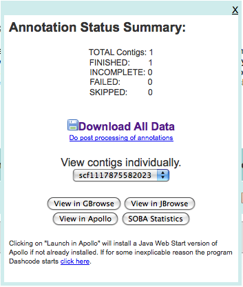

<div id="mw-page-base" class="noprint">

</div>

<div id="mw-head-base" class="noprint">

</div>

<div id="content" class="mw-body" role="main">

<span id="top"></span>

<div id="mw-js-message" style="display:none;">

</div>


# <span dir="auto">Arthropod Genomics 2011/Genome Project 101 Workshop</span>

<div id="bodyContent">

<div id="siteSub">

From GMOD

</div>

<div id="contentSub">

</div>

<div id="jump-to-nav" class="mw-jump">

Jump to: [navigation](#mw-navigation), [search](#p-search)

</div>

<div id="mw-content-text" class="mw-content-ltr" lang="en" dir="ltr">

<table style="font-size: 180%">
<colgroup>
<col style="width: 33%" />
<col style="width: 33%" />
<col style="width: 33%" />
</colgroup>
<tbody>
<tr class="odd">
<td><a href="../File:AGSBug170.png" class="image"
title="Arthropod Genomics Symposium Arthropod Genomics 2011"></a></td>
<td> </td>
<td>Genome Project 101 Workshop<br />
&#10;<p><a href="../Arthropod_Genomics_2011"
title="Arthropod Genomics 2011">Arthropod Genomics Symposium
2011</a><br />
Kansas City, Missouri, United States<br />
June 9-12</p></td>
</tr>
</tbody>
</table>

  
This is the wiki page for the *Genome Project 101 Workshop* presented at
[Arthropod Genomics
2011](../Arthropod_Genomics_2011 "Arthropod Genomics 2011").

This page serves as the slides for the workshop. It will be tidied up
within a week of the end of the workshop.

  

<div id="toc" class="toc">

<div id="toctitle">

## Contents

</div>

- [<span class="tocnumber">1</span> <span class="toctext">The One True
  URL</span>](#The_One_True_URL)
- [<span class="tocnumber">2</span> <span class="toctext">VMware
  Image</span>](#VMware_Image)
- [<span class="tocnumber">3</span> <span class="toctext">Worked
  Examples</span>](#Worked_Examples)
  - [<span class="tocnumber">3.1</span> <span class="toctext">MAKER Web
    Annotation Service</span>](#MAKER_Web_Annotation_Service)
  - [<span class="tocnumber">3.2</span> <span class="toctext">Galaxy
    Example</span>](#Galaxy_Example)
    - [<span class="tocnumber">3.2.1</span> <span class="toctext">1. Get
      to Galaxy</span>](#1._Get_to_Galaxy)
    - [<span class="tocnumber">3.2.2</span> <span class="toctext">2.
      What have we got?</span>](#2._What_have_we_got.3F)
    - [<span class="tocnumber">3.2.3</span> <span class="toctext">3. Get
      just the Exons and CDSs</span>](#3._Get_just_the_Exons_and_CDSs)
    - [<span class="tocnumber">3.2.4</span> <span class="toctext">4. See
      what is in the exon set that is not in the CDS
      set</span>](#4._See_what_is_in_the_exon_set_that_is_not_in_the_CDS_set)
    - [<span class="tocnumber">3.2.5</span> <span class="toctext">5.
      Investigate</span>](#5._Investigate)
    - [<span class="tocnumber">3.2.6</span> <span class="toctext">For
      the long term</span>](#For_the_long_term)
  - [<span class="tocnumber">3.3</span>
    <span class="toctext">Chado</span>](#Chado)
  - [<span class="tocnumber">3.4</span>
    <span class="toctext">GBrowse</span>](#GBrowse)
  - [<span class="tocnumber">3.5</span>
    <span class="toctext">JBrowse</span>](#JBrowse)
- [<span class="tocnumber">4</span> <span class="toctext">VMware
  Image</span>](#VMware_Image_2)
  - [<span class="tocnumber">4.1</span> <span class="toctext">System
    Configuration</span>](#System_Configuration)
  - [<span class="tocnumber">4.2</span> <span class="toctext">Installed
    Prerequisite Software</span>](#Installed_Prerequisite_Software)
    - [<span class="tocnumber">4.2.1</span>
      <span class="toctext">PostgreSQL
      Configuration</span>](#PostgreSQL_Configuration)
      - [<span class="tocnumber">4.2.1.1</span>
        <span class="toctext">Edit config
        file</span>](#Edit_config_file)
      - [<span class="tocnumber">4.2.1.2</span>
        <span class="toctext">Install
        DBIx::DBStag</span>](#Install_DBIx::DBStag)
  - [<span class="tocnumber">4.3</span> <span class="toctext">GMOD
    Components</span>](#GMOD_Components)
    - [<span class="tocnumber">4.3.1</span> <span class="toctext">Chado
      Install and Load</span>](#Chado_Install_and_Load)
      - [<span class="tocnumber">4.3.1.1</span>
        <span class="toctext">Loading Data</span>](#Loading_Data)
    - [<span class="tocnumber">4.3.2</span>
      <span class="toctext">GBrowse
      Installation</span>](#GBrowse_Installation)
    - [<span class="tocnumber">4.3.3</span>
      <span class="toctext">JBrowse
      Installation</span>](#JBrowse_Installation)
    - [<span class="tocnumber">4.3.4</span>
      <span class="toctext">Installing
      Galaxy</span>](#Installing_Galaxy)
- [<span class="tocnumber">5</span> <span class="toctext">If time
  permits ...</span>](#If_time_permits_...)
  - [<span class="tocnumber">5.1</span>
    <span class="toctext">Community!</span>](#Community.21)
- [<span class="tocnumber">6</span> <span class="toctext">Remember
  ...</span>](#Remember_...)

</div>

  

# <span id="The_One_True_URL" class="mw-headline">The One True URL</span>

Everything you need to know from this workshop can be found on this
page. The short URL is:

<div class="emphasisbox" style="font-size:200%">

<a href="../AGS2011" class="mw-redirect"
title="AGS2011">GMOD.org/wiki/AGS2011</a>

</div>

# <span id="VMware_Image" class="mw-headline">VMware Image</span>

A <a
href="http://gmod.org/mediawiki/index.php?title=VMware&amp;action=edit&amp;redlink=1"
class="new" title="VMware (page does not exist)">VMware</a> image was
used during this workshop. That image can be <a
href="ftp://ftp.gmod.org/pub/gmod/Meetings/2011/AGS/GMODAGS2011.tar.gz"
class="external text" rel="nofollow">downloaded</a>, installed, and run
locally on your system. See <a
href="http://gmod.org/mediawiki/index.php?title=VMware&amp;action=edit&amp;redlink=1"
class="new" title="VMware (page does not exist)">VMware</a> for details.

# <span id="Worked_Examples" class="mw-headline">Worked Examples</span>

## <span id="MAKER_Web_Annotation_Service" class="mw-headline">MAKER Web Annotation Service</span>

While we could install MAKER locally on this machine, it is nice to be
able to make use of the web service provided by
<a href="http://www.yandell-lab.org/" class="external text"
rel="nofollow">Mark Yandell's</a> group at University of Utah. To use
it, go to

     http://derringer.genetics.utah.edu/cgi-bin/MWAS/maker.cgi

and create a free account (I created one for this tutorial with a user
name of gmodags). After that is created, we can upload some sample data.
I put the sample data that I used on ~/Downloads/MAKER_input, where
there are three files:

- pyu-contig.fasta - a FASTA file containing a 1.7 MB contig
- pyu-est.fasta - A set of assembled 454 read ESTs from P. ultimum and a
  related organism
- pyu-protein.fasta - a set of protein sequence from a related organism

After clicking on the "New Job" tab, I uploaded all three files in the
appropriate spot, ignoring the others:

<a href="../File:MAKER_contig.png" class="image"></a>

<a href="../File:MAkER_est.png" class="image"></a>

<a href="../File:MAKER_protien.png" class="image"></a>

After uploading these, I pressed "Add to Job Queue" to get it started
running. The job waited under an hour before starting, and then finished
in under three hours.

Upon finishing, I was presented with multiple ways of looking at the
data:

<a href="../File:MAKER_download.png" class="image"></a>

and after taking a quick look at both GBrowse and JBrowse, downloaded
the data to the machine (in ~/Downloads/3263.maker.output). The GFF file
in this directory will be loaded into Chado.

## <span id="Galaxy_Example" class="mw-headline">[Galaxy](../Galaxy.1 "Galaxy") Example</span>

We have our annotation, let's do some further analysis and exploration.

To further analyze your data you need tools like
[Galaxy](../Galaxy.1 "Galaxy"), [BioMart](../BioMart "BioMart") and
[InterMine](../InterMine "InterMine"). Since I work for Galaxy, we'll
spend some time working on a simple example in that. We'll touch on
BioMart or InterMine as time allows.

### <span id="1._Get_to_Galaxy" class="mw-headline">1. Get to Galaxy</span>

We could run this analysis on the free public Galaxy server
(<a href="http://usegalaxy.org" class="external free"
rel="nofollow">http://usegalaxy.org</a>), or on the Galaxy that has been
installed on our VMware image. Let's run it on our local install.

*Note: Please don't run on the local install with me. The public server
might be able to support 120 people doing this simultaneously. The local
install won't.*
<a href="http://gmodags.bx.psu.edu:8080/" class="external text"
rel="nofollow">Galaxy</a>

### <span id="2._What_have_we_got.3F" class="mw-headline">2. What have we got?</span>

First load the GFF that MAKER produced into Galaxy

**Get Data → Upload File → <a
href="ftp://ftp.gmod.org/pub/gmod/Meetings/2011/AGS/3263.maker.output/3263.all.gff"
class="external free"
rel="nofollow">ftp://ftp.gmod.org/pub/gmod/Meetings/2011/AGS/3263.maker.output/3263.all.gff</a>
→ Execute**

This uploads the GFF file into Galaxy. It recognizes it as a GFF3 file.

Now, because of a bug in Galaxy (don't tell anyone), we need to convert
it to BED to run a subsequent step.

**Convert Formats → GFF-to-BED → Execute**

Now lets see what is in the annotation. Lets count the number of
different feature types in the file.

**Join, Subtract and Group → Group → Group by Column: c4**

This tells Galaxy please group the lines by the value in column 4, which
is the SO type of the feature

**Add new operation → Type: Count → Execute**

Now count the number of lines that have each type.

Anything interesting? Hmmm. We've got one more exon than CDS. I wonder
where that is?

### <span id="3._Get_just_the_Exons_and_CDSs" class="mw-headline">3. Get just the Exons and CDSs</span>

Just get the exons:

**Filter and Sort → Filter → Filter: GFF-to-Bed on data**

The SO type is in column 4 in BED.

**With following condition: c4=='exon' → Execute**

Repeat with CDS.

  

### <span id="4._See_what_is_in_the_exon_set_that_is_not_in_the_CDS_set" class="mw-headline">4. See what is in the exon set that is not in the CDS set</span>

**Operate on Genomic Intervals → Subtract**

**Subtract CDSs from Exons → Execute**

### <span id="5._Investigate" class="mw-headline">5. Investigate</span>

We have one exon left. Go visualize it in GBrowse or JBrowse.

### <span id="For_the_long_term" class="mw-headline">For the long term</span>

This history has been run and saved on the
<a href="http://usegalaxy.org" class="external text"
rel="nofollow">public Galaxy instance</a>. Go to **Shared Data →
Published Histories → AGS2011**. It has also been saved on the Galaxy
instance on the VMware image under user gmodags (password same as user).

## <span id="Chado" class="mw-headline">Chado</span>

## <span id="GBrowse" class="mw-headline">GBrowse</span>

We can go to <a href="http://localhost/cgi-bin/gb2/gbrowse/pythium"
class="external free"
rel="nofollow">http://localhost/cgi-bin/gb2/gbrowse/pythium</a> (or
<a href="http://gmodags.bx.psu.edu/cgi-bin/gb2/gbrowse/pythium"
class="external free"
rel="nofollow">http://gmodags.bx.psu.edu/cgi-bin/gb2/gbrowse/pythium</a>
during the workshop).

## <span id="JBrowse" class="mw-headline">[JBrowse](../JBrowse.1 "JBrowse")</span>

Go to <a href="http://localhost/jbrowse" class="external free"
rel="nofollow">http://localhost/jbrowse</a> (or
<a href="http://gmodags.bx.psu.edu/jbrowse" class="external free"
rel="nofollow">http://gmodags.bx.psu.edu/jbrowse</a> during the
workshop).

# <span id="VMware_Image_2" class="mw-headline">VMware Image</span>

A <a
href="http://gmod.org/mediawiki/index.php?title=VMware&amp;action=edit&amp;redlink=1"
class="new" title="VMware (page does not exist)">VMware</a> image will
be made available to participants of the workshop. We will use this
image during the workshop

## <span id="System_Configuration" class="mw-headline">System Configuration</span>

This section attempts to track what we did to create the VMware image

|  |  |
|----|----|
| Operating System | Ubuntu 11.04, 64 bit client. This is a popular Linux distribution |
| Memory | 2 GB. If you run this on a system that has 2 gigabytes or less of memory, please decrease this number |
| Disk | 80 GB. This is allocated 2 GB at a time, as needed, but VMware. |
| Networking | NAT |
| Username | gmod |
| Password |  |

## <span id="Installed_Prerequisite_Software" class="mw-headline">Installed Prerequisite Software</span>

GMOD components have a variety of prerequisite software that needs to be
installed. Here is a list of what was installed so we could install and
run GMOD software.

| Software | How | Comments |
|----|----|----|
| Mercurial | `sudo apt-get install mercurial` | Revision control system used by [Galaxy](../Galaxy.1 "Galaxy") |
| Microsoft TrueType core fonts | `sudo apt-get install ttf-mscorefonts-installer` | Used by [Galaxy](../Galaxy.1 "Galaxy"). |
| python-dev | `sudo apt-get install python-dev ` | Used in [Galaxy](../Galaxy.1 "Galaxy"). |
| python-setuptools | `sudo apt-get install python-setuptools` | Used in [Galaxy](../Galaxy.1 "Galaxy"). |
| python-pip | `sudo apt-get install python-pip` | Used in [Galaxy](../Galaxy.1 "Galaxy"). |
| bx-python scripts | `sudo pip install bx-python` | Scripts used by Galaxy |
| Python 2.6 | `sudo apt-get install python2.6` | Ubuntu 11.04 comes with Python 2.7, which Galaxy, does not like. This installs 2.6 in parallel. |
| Python R package interface | `sudo apt-get install python-rpy` | Used in basic Galaxy operations. |
| Graphics libraries | `sudo apt-get install libgd2-xpm-dev libgd-gd2-perl libgd-tools libgd-svg-perl` | Used by [GBrowse](../GBrowse.1 "GBrowse") |
| System utilities and web server | `sudo apt-get install autoconf apache2` | Used by [GBrowse](../GBrowse.1 "GBrowse") and <a href="../Chado" class="mw-redirect" title="Chado">Chado</a> |
| Database server | `sudo apt-get install postgresql postgresql-client` | Used by <a href="../Chado" class="mw-redirect" title="Chado">Chado</a> and [GBrowse](../GBrowse.1 "GBrowse") |
| Variety of perl modules | `sudo apt-get install libcgi-session-perl libdbd-pg-perl libdigest-md5-file-perl libclass-base-perl libmodule-build-perl libstatistics-descriptive-perl libtemplate-perl libxml-simple-perl liblog-log4perl-perl libparse-recdescent-perl libsql-translator-perl perl-doc` | Used by <a href="../Chado" class="mw-redirect" title="Chado">Chado</a> and [GBrowse](../GBrowse.1 "GBrowse") |
| Perl modules | `sudo apt-get install libjson-xs-perl libdevel-size-perl` | Used by [JBrowse](../JBrowse.1 "JBrowse") |
| Perl graphics library | `cpan> install GD` | Used by [JBrowse](../JBrowse.1 "JBrowse") and [GBrowse](../GBrowse.1 "GBrowse") |
| BioPerl libraries | `cpan> install Bio::Perl Bio::Graphics JSON` | Used by [JBrowse](../JBrowse.1 "JBrowse"), [GBrowse](../GBrowse.1 "GBrowse") and <a href="../Chado" class="mw-redirect" title="Chado">Chado</a> |
| GBrowse Chado adaptor | `cpan> install Bio::DB::Das::Chado` | Used by [JBrowse](../JBrowse.1 "JBrowse"), [GBrowse](../GBrowse.1 "GBrowse") and <a href="../Chado" class="mw-redirect" title="Chado">Chado</a> |
| More perl libraries | `cpan> install GO::Parser Module::Load DBIx::DBSchema XML::Parser::PerlSAX` | Used by <a href="../Chado" class="mw-redirect" title="Chado">Chado</a> |
| Even more perl libraries | `cpan> install Heap::Simple Heap::Simple::Perl Heap::Simple::XS PerlIO::gzip` | Used by [JBrowse](../JBrowse.1 "JBrowse") |

### <span id="PostgreSQL_Configuration" class="mw-headline">PostgreSQL Configuration</span>

The postgresql server will be set up with fairly unrestricted access to
make life easier during the tutorial. If used "in real life", the
configuration should be tightened down quite a bit.

#### <span id="Edit_config_file" class="mw-headline">Edit config file</span>

     sudo su -
     vi /etc/postgresql/8.4/main/pg_hba.conf

Change the bottom lines to look like this:

     # "local" is for Unix domain socket connections only
     local   all         all                               trust
     # IPv4 local connections:
     host    all         all         127.0.0.1/32          trust
     # IPv6 local connections:
     host    all         all         ::1/128               trust

by replacing the text in the last column to "trust" as it is here
(**that's the insecure part!**). Then restart the postgresql server:

     /etc/init.d/postgresql restart

Then, switch users to the "postgres" user and create a new user called
"gmod":

     su - postgres
     createuser gmod
       Shall the new role be a superuser? (y/n) y
     exit  # to leave postgres user shell
     exit  # to leave root shell

#### <span id="Install_DBIx::DBStag" class="mw-headline">Install DBIx::DBStag</span>

This is a perl module that can only be installed after PostgreSQL is
configured, so it is installed now. First, create a database called
"test":

     createdb test

Then install via the cpan shell:

     cpan
     cpan> install DBIx::DBStag

Note that installing via the cpan shell is difficult if you typically
use cpan as root, like "sudo cpan". If instead you use cpan as a regular
user but have it configured to do "sudo make install" and "sudo ./Build
install" it is easy and works correctly.

## <span id="GMOD_Components" class="mw-headline">GMOD Components</span>

### <span id="Chado_Install_and_Load" class="mw-headline">Chado Install and Load</span>

Get Chado from SourceForge; point a browser at

     http://sourceforge.net/projects/gmod/files/gmod/chado-1.11/chado-1.11.tar.gz/download

and extract the files:

     cd ~/Downloads
     tar zxvf chado-1.11.tar.gz
     cd chado-1.11

Set up some environment variables:

     vi ~/.bashrc

and add these lines to the bottom:

     export GMOD_ROOT=/usr/local/gmod
     export CHADO_DB_NAME=chado
     export CHADO_DB_USERNAME=gmod

save .bashrc and source it so that the values are available in the
shell:

     source ~/.bashrc

Now to install Chado:

     perl Makefile.PL

Accept all of the defaults except for the "default organism" question.
Put "pythium" here.

     make
     sudo make install
     make load_schema   #ignore the error about a chado database not existing
     make prepdb
     make ontologies
       answer with 1,2,4

Add our organism to the database:

     psql chado
     psql> INSERT INTO organism ( abbreviation, genus, species, common_name)
           VALUES ('P.ultimum','Pythium','ultimum','pythium');

Make a database dump that saves progress to this point:

     pg_dump chado | bzip2 -c > ontologies_only_dbdump.bz2

#### <span id="Loading_Data" class="mw-headline">Loading Data</span>

Note that if MAKER is installed locally, it provides a tool to
automatically load data from it straight into Chado. Since we don't have
that, we'll load "by hand".

Go to where the data is:

     cd ~/Downloads/3263.maker.output/

There are several files here, but the one we are interested in at the
moment is 3263.all.gff, which has all of the "raw material" annotations
made by MAKER as well as the final gene calls. We'll load these into
Chado using a tool that came with Chado:

     gmod_bulk_load_gff3.pl -a --noexon -g 3263.all.gff

where the -a tells the loader that these are computational results (as
opposed to human-curated annotations), and the --noexon tells the loader
not to create exon features that correspond to the CDS features, because
the exon features are already present in the GFF. This load takes a few
minutes.

### <span id="GBrowse_Installation" class="mw-headline">GBrowse Installation</span>

GBrowse can be installed directly from the cpan shell like several of
the GBrowse prerequisites were installed:

     cpan
     cpan> install Bio::Graphics::Browser2

Accept all of the defaults when asked questions.

Get a config file

Install Samtools

     cd ~/Downloads
     wget -O samtools.0.16.tar.bz2 http://sourceforge.net/projects/samtools/files/samtools/0.1.16/samtools-0.1.16.tar.bz2/download
     tar jxvf samtools.0.16.tar.bz2
     cd samtools-0.1.16
     sudo apt-get install ncurses-dev
     make #after adding fPIC to Makefile

Install Bio::DB::Sam

     cpan
     cpan> install Bio::DB::Sam
        answer "/home/gmod/Downloads/samtools-0.1.16" for the location of bam.h

BAM and FASTA files placed in /var/www/gbrowse2/databases/pythium/

With all of the pieces in place, now we can go to
<a href="http://localhost/cgi-bin/gb2/gbrowse/pythium"
class="external free"
rel="nofollow">http://localhost/cgi-bin/gb2/gbrowse/pythium</a> (or
<a href="http://gmodags.bx.psu.edu/cgi-bin/gb2/gbrowse/pythium"
class="external free"
rel="nofollow">http://gmodags.bx.psu.edu/cgi-bin/gb2/gbrowse/pythium</a>
during the workshop).

### <span id="JBrowse_Installation" class="mw-headline">JBrowse Installation</span>

Get JBrowse and unpack:

     wget http://jbrowse.org/releases/jbrowse-1.2.1.zip
     unzip jbrowse-1.2.1.zip
     sudo cp -r jbrowse-1.2.1/ /var/www/jbrowse/

Get a conf file:

     cd ~/Downloads/
     wget https://gist.github.com/raw/1014946/65ab0c150984d7bed47150d82da5026d960406f3/pythium.conf

Setting up data:

     cd /var/www/
     sudo chown -R gmod:gmod jbrowse
     cd jbrowse
     bin/prepare-refseqs.pl --conf ~/Downloads/pythium.conf --refs scf1117875582023

This gets the "reference sequence", that is, the contig we're working
on. At this point, visiting the jbrowse url
(<a href="http://gmodags.bx.psu.edu/jbrowse" class="external free"
rel="nofollow">http://gmodags.bx.psu.edu/jbrowse</a>) would show an
empty jbrowse user interface, though if you zoom all the way in, you'd
see DNA residues.

Now, get more data:

     bin/biodb-to-json.pl --conf ~/Downloads/pythium.conf

This talks to the Chado database and extracts all of the evidence and
predictions that were used and created in the MAKER analysis.

Now that JBrowse has extracted all of the data, we can go to
<a href="http://localhost/jbrowse" class="external free"
rel="nofollow">http://localhost/jbrowse</a> (or
<a href="http://gmodags.bx.psu.edu/jbrowse" class="external free"
rel="nofollow">http://gmodags.bx.psu.edu/jbrowse</a> during the
workshop).

### <span id="Installing_Galaxy" class="mw-headline">Installing Galaxy</span>

The default python on Ubuntu 11.04 is 2.7. We need 2.6 to run Galaxy.
Using the instructions from the
<a href="https://bitbucket.org/galaxy/galaxy-central/wiki/GetGalaxy"
class="external text" rel="nofollow">GetGalaxy wiki page</a>, Python 2.6
was downloaded and added at the front of the path.

``` enter
mkdir ~/galaxy-python
ln -s /path/to/python2.5 ~/galaxy-python/python
```

`~/.bashrc` was edited and these lines were added to the end.

``` enter
# Use Python 2.6 for Galaxy
export PATH=~/galaxy-python:$PATH
```

Galaxy was then downloaded:

``` enter
cd ~/Documents
mkdir work
cd work
hg clone http://bitbucket.org/galaxy/galaxy-dist
```

And we then customized the landing image for this conference. (Details
are not important.)

And now we can start it:

``` enter
cd galaxy-dist
sh run.sh
```

And Galaxy is now installed and running. Goto
<a href="http://localhost:8080" class="external free"
rel="nofollow">http://localhost:8080</a>.

# <span id="If_time_permits_..." class="mw-headline">If time permits ...</span>

## <span id="Community.21" class="mw-headline">Community!</span>

- [Wiki](../Main_Page "Main Page")
- <a href="../Mailing_Lists" class="mw-redirect"
  title="Mailing Lists">Mailing Lists</a>
- [Meetings](../Meetings "Meetings") and other
  [Events](../Calendar "Calendar") - Next meeting is [October 2011 GMOD
  Meeting](../October_2011_GMOD_Meeting "October 2011 GMOD Meeting")
- [Training and
  Outreach](../Training_and_Outreach "Training and Outreach")
- ...

# <span id="Remember_..." class="mw-headline">Remember ...</span>

The *one true url:*

<div class="emphasisbox" style="font-size:200%">

<a href="../AGS2011" class="mw-redirect"
title="AGS2011">GMOD.org/wiki/AGS2011</a>

</div>

</div>

<div class="printfooter">

Retrieved from
"<http://gmod.org/mediawiki/index.php?title=Arthropod_Genomics_2011/Genome_Project_101_Workshop&oldid=21962>"

</div>

<div id="catlinks" class="catlinks catlinks-allhidden">

</div>

<div class="visualClear">

</div>

</div>

</div>

<div id="mw-navigation">

## Navigation menu

<div id="mw-head">

<div id="p-personal" role="navigation"
aria-labelledby="p-personal-label">

### Personal tools

- <span id="pt-login"><a
  href="http://gmod.org/mediawiki/index.php?title=Special:UserLogin&amp;returnto=Arthropod+Genomics+2011%2FGenome+Project+101+Workshop"
  accesskey="o"
  title="You are encouraged to log in; however, it is not mandatory [o]">Log
  in / create account</a></span>

</div>

<div id="left-navigation">

<div id="p-namespaces" class="vectorTabs" role="navigation"
aria-labelledby="p-namespaces-label">

### Namespaces

- <span id="ca-nstab-main"><a href="Genome_Project_101_Workshop" accesskey="c"
  title="View the content page [c]">Page</a></span>
- <span id="ca-talk"><a
  href="http://gmod.org/mediawiki/index.php?title=Talk:Arthropod_Genomics_2011/Genome_Project_101_Workshop&amp;action=edit&amp;redlink=1"
  accesskey="t"
  title="Discussion about the content page [t]">Discussion</a></span>

</div>

<div id="p-variants" class="vectorMenu emptyPortlet" role="navigation"
aria-labelledby="p-variants-label">

### 

### Variants[](#)

<div class="menu">

</div>

</div>

</div>

<div id="right-navigation">

<div id="p-views" class="vectorTabs" role="navigation"
aria-labelledby="p-views-label">

### Views

- <span id="ca-view">[Read](Genome_Project_101_Workshop)</span>
- <span id="ca-viewsource"><a
  href="http://gmod.org/mediawiki/index.php?title=Arthropod_Genomics_2011/Genome_Project_101_Workshop&amp;action=edit"
  accesskey="e" title="This page is protected.
  You can view its source [e]">View source</a></span>
- <span id="ca-history"><a
  href="http://gmod.org/mediawiki/index.php?title=Arthropod_Genomics_2011/Genome_Project_101_Workshop&amp;action=history"
  accesskey="h" title="Past revisions of this page [h]">View history</a></span>

</div>

<div id="p-cactions" class="vectorMenu emptyPortlet" role="navigation"
aria-labelledby="p-cactions-label">

### Actions[](#)

<div class="menu">

</div>

</div>

<div id="p-search" role="search">

### Search

<div id="simpleSearch">

</div>

</div>

</div>

</div>

<div id="mw-panel">

<div id="p-logo" role="banner">

<a href="../Main_Page"
style="background-image: url(../../images/GMOD-cogs.png);"
title="Visit the main page"></a>

</div>

<div id="p-Navigation" class="portal" role="navigation"
aria-labelledby="p-Navigation-label">

### Navigation

<div class="body">

- <span id="n-GMOD-Home">[GMOD Home](../Main_Page)</span>
- <span id="n-Software">[Software](../GMOD_Components)</span>
- <span id="n-Categories-.2F-Tags">[Categories /
  Tags](../Categories)</span>
- <span id="n-View-all-pages">[View all
  pages](../Special:AllPages)</span>

</div>

</div>

<div id="p-Documentation" class="portal" role="navigation"
aria-labelledby="p-Documentation-label">

### Documentation

<div class="body">

- <span id="n-Overview">[Overview](../Overview)</span>
- <span id="n-FAQs">[FAQs](../Category:FAQ)</span>
- <span id="n-HOWTOs">[HOWTOs](../Category:HOWTO)</span>
- <span id="n-Glossary">[Glossary](../Glossary)</span>

</div>

</div>

<div id="p-Community" class="portal" role="navigation"
aria-labelledby="p-Community-label">

### Community

<div class="body">

- <span id="n-GMOD-News">[GMOD News](../GMOD_News)</span>
- <span id="n-Training-.2F-Outreach">[Training /
  Outreach](../Training_and_Outreach)</span>
- <span id="n-Support">[Support](../Support)</span>
- <span id="n-GMOD-Promotion">[GMOD Promotion](../GMOD_Promotion)</span>
- <span id="n-Meetings">[Meetings](../Meetings)</span>
- <span id="n-Calendar">[Calendar](../Calendar)</span>

</div>

</div>

<div id="p-tb" class="portal" role="navigation"
aria-labelledby="p-tb-label">

### Tools

<div class="body">

- <span id="t-whatlinkshere"><a
  href="../Special:WhatLinksHere/Arthropod_Genomics_2011/Genome_Project_101_Workshop"
  accesskey="j" title="A list of all wiki pages that link here [j]">What
  links here</a></span>
- <span id="t-recentchangeslinked"><a
  href="../Special:RecentChangesLinked/Arthropod_Genomics_2011/Genome_Project_101_Workshop"
  accesskey="k"
  title="Recent changes in pages linked from this page [k]">Related
  changes</a></span>
- <span id="t-specialpages"><a href="../Special:SpecialPages" accesskey="q"
  title="A list of all special pages [q]">Special pages</a></span>
- <span id="t-print"><a
  href="http://gmod.org/mediawiki/index.php?title=Arthropod_Genomics_2011/Genome_Project_101_Workshop&amp;printable=yes"
  rel="alternate" accesskey="p"
  title="Printable version of this page [p]">Printable version</a></span>
- <span id="t-permalink">[Permanent
  link](http://gmod.org/mediawiki/index.php?title=Arthropod_Genomics_2011/Genome_Project_101_Workshop&oldid=21962 "Permanent link to this revision of the page")</span>
- <span id="t-info">[Page
  information](http://gmod.org/mediawiki/index.php?title=Arthropod_Genomics_2011/Genome_Project_101_Workshop&action=info)</span>
- <span id="t-smwbrowselink"><a
  href="../Special:Browse/Arthropod_Genomics_2011-2FGenome_Project_101_Workshop"
  rel="smw-browse">Browse properties</a></span>
- <span id="t-pdf">[Print as
  PDF](http://gmod.org/mediawiki/index.php?title=Special:PdfPrint&page=Arthropod_Genomics_2011/Genome_Project_101_Workshop)</span>

</div>

</div>

</div>

</div>

<div id="footer" role="contentinfo">

- <span id="footer-info-lastmod">Last updated at 18:52 on 8 October
  2012.</span>
- <span id="footer-info-viewcount">154,269 page views.</span>
- <span id="footer-info-copyright">Content is available under
  <a href="http://www.gnu.org/licenses/fdl-1.3.html" class="external"
  rel="nofollow">a GNU Free Documentation License</a> unless otherwise
  noted.</span>

<!-- -->

- <span id="footer-places-about">[About
  GMOD](../GMOD:About "GMOD:About")</span>

<!-- -->

- <span id="footer-copyrightico">[](http://www.gnu.org/licenses/fdl-1.3.html)</span>
- <span id="footer-poweredbyico">[](http://www.mediawiki.org/)
  [](https://www.semantic-mediawiki.org/wiki/Semantic_MediaWiki)</span>

<div style="clear:both">

</div>

</div>
