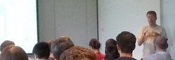
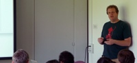
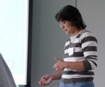

<div id="mw-page-base" class="noprint">

</div>

<div id="mw-head-base" class="noprint">

</div>

<div id="content" class="mw-body" role="main">

<span id="top"></span>

<div id="mw-js-message" style="display:none;">

</div>


# <span dir="auto">August 2009 GMOD Meeting</span>

<div id="bodyContent">

<div id="siteSub">

From GMOD

</div>

<div id="contentSub">

</div>

<div id="jump-to-nav" class="mw-jump">

Jump to: [navigation](#mw-navigation), [search](#p-search)

</div>

<div id="mw-content-text" class="mw-content-ltr" lang="en" dir="ltr">

<table
style="vertical-align: middle; border: 2px solid #A6A6BC; text-align: center"
data-cellpadding="10">
<colgroup>
<col style="width: 50%" />
<col style="width: 50%" />
</colgroup>
<tbody>
<tr class="odd">
<td><span style="font-size: 200%; line-height: 120%"><strong>August 2009
GMOD Meeting</strong><br />
6-7 August, 2009<br />
Oxford UK</span><br />
<span style="font-size: 160%; line-height: 120%">Part of <a
href="GMOD_Europe_2009" title="GMOD Europe 2009">GMOD Europe 2009</a>,
five days of GMOD including a <a href="2009_GMOD_Summer_School_-_Europe"
title="2009 GMOD Summer School - Europe">GMOD Summer School</a></span>
<p><br />
<a href="File:Aug2009MeetingPhoto.JPG" class="image"
title="August 2009 GMOD Meeting"></a></p></td>
<td><a href="GMOD_Europe_2009" title="GMOD Europe 2009"></a></td>
</tr>
</tbody>
</table>

  
This [GMOD Community Meeting](Meetings "Meetings") was held 6-7 August,
2009, in Oxford UK. The meeting was a part of ***[GMOD Europe
2009](GMOD_Europe_2009 "GMOD Europe 2009")***, a week long event that
also included a [GMOD Summer
School](2009_GMOD_Summer_School_-_Europe "2009 GMOD Summer School - Europe").
This is the first time a GMOD meeting has been held in Europe.

As with previous [GMOD meetings](Meetings "Meetings"), this meeting had
a mixture of project talks, component talks, and user talks. The agenda
was driven by [attendee suggestions](#Agenda_Suggestions). The two
previous [meetings](Meetings "Meetings") were the [January
2009](January_2009_GMOD_Meeting "January 2009 GMOD Meeting") and [July
2008](July_2008_GMOD_Meeting "July 2008 GMOD Meeting") meetings. GMOD
meetings are an excellent way to meet GMOD developers and users, and to
learn (and affect) what's coming in the project.

  

<div id="toc" class="toc">

<div id="toctitle">

## Contents

</div>

- [<span class="tocnumber">1</span>
  <span class="toctext">Schedule</span>](#Schedule)
- [<span class="tocnumber">2</span>
  <span class="toctext">Presentations</span>](#Presentations)
  - [<span class="tocnumber">2.1</span> <span class="toctext">GMOD
    Project Talks</span>](#GMOD_Project_Talks)
    - [<span class="tocnumber">2.1.1</span> <span class="toctext">HHMI
      Science Education
      Alliance</span>](#HHMI_Science_Education_Alliance)
    - [<span class="tocnumber">2.1.2</span> <span class="toctext">What's
      new</span>](#What.27s_new)
    - [<span class="tocnumber">2.1.3</span> <span class="toctext">GMOD
      Summer School</span>](#GMOD_Summer_School)
    - [<span class="tocnumber">2.1.4</span>
      <span class="toctext">Outreach</span>](#Outreach)
    - [<span class="tocnumber">2.1.5</span> <span class="toctext">GMOD
      Community Surveys</span>](#GMOD_Community_Surveys)
    - [<span class="tocnumber">2.1.6</span>
      <span class="toctext">Upcoming GMOD
      Hackathon ?</span>](#Upcoming_GMOD_Hackathon_.3F)
  - [<span class="tocnumber">2.2</span> <span class="toctext">Linked
    Data for GMOD Databases</span>](#Linked_Data_for_GMOD_Databases)
    - [<span class="tocnumber">2.2.1</span>
      <span class="toctext">OpenFlyData</span>](#OpenFlyData)
    - [<span class="tocnumber">2.2.2</span>
      <span class="toctext">Open-BioMed</span>](#Open-BioMed)
    - [<span class="tocnumber">2.2.3</span> <span class="toctext">RDF &
      SPARQL: Benefits &
      Risks</span>](#RDF_.26_SPARQL:_Benefits_.26_Risks)
  - [<span class="tocnumber">2.3</span> <span class="toctext">GMOD in
    the Trenches</span>](#GMOD_in_the_Trenches)
    - [<span class="tocnumber">2.3.1</span>
      <span class="toctext">GBrowse at CBRG</span>](#GBrowse_at_CBRG)
    - [<span class="tocnumber">2.3.2</span>
      <span class="toctext">Extending
      GBrowse</span>](#Extending_GBrowse)
    - [<span class="tocnumber">2.3.3</span> <span class="toctext">Make
      Existing GBrowse More Useful to External
      Developers</span>](#Make_Existing_GBrowse_More_Useful_to_External_Developers)
  - [<span class="tocnumber">2.4</span> <span class="toctext">A DBIx
    Class layer for Chado</span>](#A_DBIx_Class_layer_for_Chado)
  - [<span class="tocnumber">2.5</span> <span class="toctext">GMOD
    Biological Object Layer</span>](#GMOD_Biological_Object_Layer)
    - [<span class="tocnumber">2.5.1</span> <span class="toctext">GBOL
      Architecture</span>](#GBOL_Architecture)
    - [<span class="tocnumber">2.5.2</span>
      <span class="toctext">Biological Layer
      Configuration</span>](#Biological_Layer_Configuration)
    - [<span class="tocnumber">2.5.3</span> <span class="toctext">Future
      Developments</span>](#Future_Developments)
  - [<span class="tocnumber">2.6</span> <span class="toctext">A Restful
    interface for MODs</span>](#A_Restful_interface_for_MODs)
  - [<span class="tocnumber">2.7</span> <span class="toctext">Quest for
    Standard: Sequence alignment/map format (SAM) and
    SAMtools</span>](#Quest_for_Standard:_Sequence_alignment.2Fmap_format_.28SAM.29_and_SAMtools)
    - [<span class="tocnumber">2.7.1</span> <span class="toctext">Quest
      for Standards</span>](#Quest_for_Standards)
    - [<span class="tocnumber">2.7.2</span> <span class="toctext">SAM
      Format</span>](#SAM_Format)
    - [<span class="tocnumber">2.7.3</span> <span class="toctext">BAM
      Format</span>](#BAM_Format)
    - [<span class="tocnumber">2.7.4</span> <span class="toctext">APIs,
      Implementations and Supported
      Platforms</span>](#APIs.2C_Implementations_and_Supported_Platforms)
    - [<span class="tocnumber">2.7.5</span>
      <span class="toctext">Displaying
      Alignments</span>](#Displaying_Alignments)
  - [<span class="tocnumber">2.8</span>
    <span class="toctext">Visualising NGS Data in GBrowse
    2</span>](#Visualising_NGS_Data_in_GBrowse_2)
  - [<span class="tocnumber">2.9</span> <span class="toctext">GBrowse:
    Lessons Learned and Statement of
    Interest</span>](#GBrowse:_Lessons_Learned_and_Statement_of_Interest)
    - [<span class="tocnumber">2.9.1</span>
      <span class="toctext">History and Current GBrowse
      Infrastructure</span>](#History_and_Current_GBrowse_Infrastructure)
    - [<span class="tocnumber">2.9.2</span>
      <span class="toctext">Statement of Interest: Requirements and
      Needs</span>](#Statement_of_Interest:_Requirements_and_Needs)
      - [<span class="tocnumber">2.9.2.1</span>
        <span class="toctext">GBrowse Database
        Adaptors</span>](#GBrowse_Database_Adaptors)
      - [<span class="tocnumber">2.9.2.2</span>
        <span class="toctext">GBrowse User
        Interaction</span>](#GBrowse_User_Interaction)
      - [<span class="tocnumber">2.9.2.3</span>
        <span class="toctext">GBrowse Configuration
        Files</span>](#GBrowse_Configuration_Files)
      - [<span class="tocnumber">2.9.2.4</span>
        <span class="toctext">Metadata Web
        Services</span>](#Metadata_Web_Services)
    - [<span class="tocnumber">2.9.3</span>
      <span class="toctext">Conclusion /
      Discussion</span>](#Conclusion_.2F_Discussion)
  - [<span class="tocnumber">2.10</span>
    <span class="toctext">JBrowse</span>](#JBrowse)
  - [<span class="tocnumber">2.11</span>
    <span class="toctext">GBrowse_syn</span>](#GBrowse_syn)
    - [<span class="tocnumber">2.11.1</span> <span class="toctext">Other
      GMOD Synteny Viewers</span>](#Other_GMOD_Synteny_Viewers)
    - [<span class="tocnumber">2.11.2</span>
      <span class="toctext">GBrowse_syn</span>](#GBrowse_syn_2)
    - [<span class="tocnumber">2.11.3</span> <span class="toctext">Where
      do I get data for
      GBrowse_syn?</span>](#Where_do_I_get_data_for_GBrowse_syn.3F)
    - [<span class="tocnumber">2.11.4</span> <span class="toctext">Using
      GBrowse_syn</span>](#Using_GBrowse_syn)
    - [<span class="tocnumber">2.11.5</span>
      <span class="toctext">Future
      Developments</span>](#Future_Developments_2)
  - [<span class="tocnumber">2.12</span>
    <span class="toctext">GBrowse.org</span>](#GBrowse.org)
  - [<span class="tocnumber">2.13</span> <span class="toctext">DAS
    update</span>](#DAS_update)
    - [<span class="tocnumber">2.13.1</span> <span class="toctext">DAS
      1.6E</span>](#DAS_1.6E)
    - [<span class="tocnumber">2.13.2</span> <span class="toctext">DAS
      Registry</span>](#DAS_Registry)
    - [<span class="tocnumber">2.13.3</span>
      <span class="toctext">Current and Future
      Work</span>](#Current_and_Future_Work)
    - [<span class="tocnumber">2.13.4</span>
      <span class="toctext">*Some*
      Implementations</span>](#Some_Implementations)
  - [<span class="tocnumber">2.14</span> <span class="toctext">InterMine
    update</span>](#InterMine_update)
    - [<span class="tocnumber">2.14.1</span>
      <span class="toctext">Mines4Mods</span>](#Mines4Mods)
  - [<span class="tocnumber">2.15</span> <span class="toctext">Show and
    Tell, Discussion</span>](#Show_and_Tell.2C_Discussion)
- [<span class="tocnumber">3</span> <span class="toctext">Agenda
  Suggestions</span>](#Agenda_Suggestions)
- [<span class="tocnumber">4</span>
  <span class="toctext">Location</span>](#Location)
- [<span class="tocnumber">5</span>
  <span class="toctext">Lodging</span>](#Lodging)
- [<span class="tocnumber">6</span> <span class="toctext">Cost and
  Registration</span>](#Cost_and_Registration)
- [<span class="tocnumber">7</span> <span class="toctext">Mailing
  List</span>](#Mailing_List)
- [<span class="tocnumber">8</span>
  <span class="toctext">Sponsor</span>](#Sponsor)
- [<span class="tocnumber">9</span>
  <span class="toctext">Attendees</span>](#Attendees)
- [<span class="tocnumber">10</span>
  <span class="toctext">Feedback</span>](#Feedback)
- [<span class="tocnumber">11</span> <span class="toctext">Next Meeting:
  January 2010 in San Diego
  California</span>](#Next_Meeting:_January_2010_in_San_Diego_California)

</div>

# <span id="Schedule" class="mw-headline">Schedule</span>

<div class="emphasisbox">

<div style="text-align: center; font-size: 150%; padding-bottom: 0.3em">

Heng Li

</div>

<div style="text-align: center; font-size: 120%">

<a href="http://www.sanger.ac.uk" class="external text"
rel="nofollow">Wellcome Trust Sanger Institute</a>

</div>

  

<a href="http://www.sanger.ac.uk/Users/lh3/" class="external text"
rel="nofollow">Dr Heng Li</a> of the Sanger Institute was the special
guest speaker. Heng
[discussed](#Quest_for_Standard:_Sequence_alignment.2Fmap_format_.28SAM.29_and_SAMtools)
his recent work on
<a href="http://samtools.sourceforge.net" class="external text"
rel="nofollow">SAMtools</a>, a set of file formats and scripts for
efficiently storing and accessing next generation sequence data. Heng is
a developer on several projects focused on next generation sequencing,
including
<a href="http://samtools.sourceforge.net" class="external text"
rel="nofollow">SAMtools</a>, BWA, and
<a href="http://maq.sourceforge.net" class="external text"
rel="nofollow">MAQ</a>.

</div>

<table class="wikitable" data-border="1" data-cellpadding="5"
data-cellspacing="0">
<colgroup>
<col style="width: 25%" />
<col style="width: 25%" />
<col style="width: 25%" />
<col style="width: 25%" />
</colgroup>
<thead>
<tr class="header">
<th width="12%">Date</th>
<th width="8%">Time</th>
<th width="70%">Session</th>
<th width="10%">Link(s)</th>
</tr>
</thead>
<tbody>
<tr class="odd">
<td colspan="4"></td>
</tr>
<tr class="even">
<td rowspan="11">Thursday<br />
6 August</td>
<td style="background-color: #fefefe; color: #aaaaaa">8:30-12:00</td>
<td
style="text-align: center; background-color: #fefefe; color: #aaaaaa;">Last
half day of <a href="2009_GMOD_Summer_School_-_Europe"
title="2009 GMOD Summer School - Europe"><span
style="color: #aaaaff">2009 GMOD Summer School - Europe</span></a></td>
<td></td>
</tr>
<tr class="odd">
<td colspan="3"></td>
</tr>
<tr class="even">
<td>13:30-14:30</td>
<td style="text-align: center;"><a href="User:Scott"
title="User:Scott">Scott Cain</a> - Introductions and the State of
GMOD</td>
<td><a href="http://prezi.com/143773/" class="external text"
rel="nofollow">Prezi</a>, <a
href="../mediawiki/images/1/15/Aug2009StateOfGMOD.ppt" class="internal"
title="Aug2009StateOfGMOD.ppt">PPT</a>, <a
href="../mediawiki/images/f/fb/Aug2009StateOfGMOD.pdf" class="internal"
title="Aug2009StateOfGMOD.pdf">PDF</a>, <a
href="#GMOD_Project_Talks">Summary</a></td>
</tr>
<tr class="odd">
<td>14:30-15:00</td>
<td style="text-align: center;"><a href="User:Clements"
title="User:Clements">Dave Clements</a> - <a href="GMOD_Help_Desk"
title="GMOD Help Desk">GMOD Help Desk</a> Stuff</td>
<td><a
href="ftp://ftp.gmod.org/pub/gmod/Meetings/2009/August/Aug2009GMODHelpDesk.ppt"
class="external text" rel="nofollow">PPT</a>, <a
href="../mediawiki/images/2/24/Aug2009HelpDesk.pdf" class="internal"
title="Aug2009HelpDesk.pdf">PDF</a>, <a
href="#GMOD_Project_Talks">Summary</a></td>
</tr>
<tr class="even">
<td>15:00-15:30</td>
<td style="text-align: center;"><a href="User:JunZhao"
title="User:JunZhao">Jun Zhao</a> - Linked Data for GMOD Databases</td>
<td><a href="../mediawiki/images/4/4c/Aug2009LinkedData.pdf"
class="internal" title="Aug2009LinkedData.pdf">PDF</a>, <a
href="#Linked_Data_for_GMOD_Databases">Summary</a></td>
</tr>
<tr class="odd">
<td>15:30-15:45</td>
<td style="text-align: center;">Coffee Break</td>
<td></td>
</tr>
<tr class="even">
<td>15:45-16:15</td>
<td style="text-align: center;">Steve Taylor - GMOD in the Trenches</td>
<td><a
href="ftp://ftp.gmod.org/pub/gmod/Meetings/2009/August/GMODInTheTrenches.pdf"
class="external text" rel="nofollow">PDF</a>, <a
href="#GMOD_in_the_Trenches">Summary</a></td>
</tr>
<tr class="odd">
<td>16:15-16:30</td>
<td style="text-align: center;"><a href="User:Scott"
title="User:Scott">Scott Cain</a> (for <a href="User:RBuels"
class="mw-redirect" title="User:RBuels">Robert Buels</a>) - A <a
href="http://search.cpan.org/~ribasushi/DBIx-Class-0.08108/"
class="external text" rel="nofollow">DBIx::Class</a> layer for <a
href="Chado" class="mw-redirect" title="Chado">Chado</a></td>
<td><a href="http://gmod.org/dbic_chado_slides/start.html"
class="external text" rel="nofollow">S5 Slides</a>, <a
href="#A_DBIx_Class_layer_for_Chado">Summary</a></td>
</tr>
<tr class="even">
<td>16:30-17:00</td>
<td style="text-align: center;"><a href="User:Elee" title="User:Elee">Ed
Lee</a> - <a href="http://code.google.com/p/gbol" class="external text"
rel="nofollow">GMOD Biological Object Layer</a></td>
<td><a href="../mediawiki/images/2/22/Aug2009Gobol.pdf" class="internal"
title="Aug2009Gobol.pdf">PDF</a>, <a
href="#GMOD_Biological_Object_Layer">Summary</a></td>
</tr>
<tr class="odd">
<td>17:00-17:30</td>
<td style="text-align: center;"><a href="User:Jogoodma"
title="User:Jogoodma">Josh Goodman</a> - A Restful interface for
MODs</td>
<td><a href="#A_Restful_interface_for_MODs">Summary</a></td>
</tr>
<tr class="even">
<td>17:30</td>
<td style="text-align: center;">Dinner (on your own)</td>
<td></td>
</tr>
<tr class="odd">
<td colspan="4"></td>
</tr>
<tr class="even">
<td rowspan="12">Friday<br />
7 August</td>
<td>8:45-9:15</td>
<td style="text-align: center;"><a
href="http://www.sanger.ac.uk/Users/lh3/" class="external text"
rel="nofollow">Heng Li</a> - Quest for Standard: Sequence alignment/map
format (SAM) and <a href="http://samtools.sourceforge.net"
class="external text" rel="nofollow">SAMtools</a></td>
<td><a href="../mediawiki/images/9/9c/Aug2009Sam.pdf" class="internal"
title="Aug2009Sam.pdf">PDF</a>, <a
href="#Quest_for_Standard:_Sequence_alignment.2Fmap_format_.28SAM.29_and_SAMtools">Summary</a></td>
</tr>
<tr class="odd">
<td>9:15-9:45</td>
<td style="text-align: center;"><a href="User:Clements"
title="User:Clements">Dave Clements</a> - Visualising NGS Data in
GBrowse 2</td>
<td><a
href="ftp://ftp.gmod.org/pub/gmod/Meetings/2009/August/Aug2009NGSinGBrowse.ppt"
class="external text" rel="nofollow">PPT</a>, <a
href="ftp://ftp.gmod.org/pub/gmod/Meetings/2009/August/Aug2009NGSinGBrowse.pdf"
class="external text" rel="nofollow">PDF</a>, <a
href="#Visualising_NGS_Data_in_GBrowse_2">Summary</a></td>
</tr>
<tr class="even">
<td>9:45-10:15</td>
<td style="text-align: center;">Erick Antezana &amp; Frederic Potier -
GBrowse: Lessons Learned and Statement of Interest</td>
<td><a href="../mediawiki/images/6/6b/Aug2009GBrowse2ImplPersp.pdf"
class="internal" title="Aug2009GBrowse2ImplPersp.pdf">PDF</a>, <a
href="#GBrowse:_Lessons_Learned_and_Statement_of_Interest">Summary</a></td>
</tr>
<tr class="odd">
<td>10:15-11:45</td>
<td style="text-align: center;">Ian Holmes - <a href="JBrowse.1"
title="JBrowse">JBrowse</a></td>
<td><a href="../mediawiki/images/5/59/Aug2009JBrowse.pdf"
class="internal" title="Aug2009JBrowse.pdf">PDF</a>, <a
href="#JBrowse">Summary</a></td>
</tr>
<tr class="even">
<td>10:45-11:00</td>
<td style="text-align: center;">Coffee Break</td>
<td></td>
</tr>
<tr class="odd">
<td>11:00-11:30</td>
<td style="text-align: center;"><a href="User:Mckays"
title="User:Mckays">Sheldon McKay</a> - <a href="GBrowse_syn.1"
title="GBrowse syn">GBrowse_syn</a></td>
<td><a href="../mediawiki/images/5/55/Aug2009GBrowse_syn.pdf"
class="internal" title="Aug2009GBrowse syn.pdf">PDF</a>, <a
href="#GBRowse_syn">Summary</a></td>
</tr>
<tr class="even">
<td>11:30-12:30</td>
<td style="text-align: center;">Discussion: <a
href="Next_Generation_Sequencing"
title="Next Generation Sequencing">NextGen</a> data and GMOD: What do we
do (and not do)?</td>
<td></td>
</tr>
<tr class="odd">
<td>12:30-13:30</td>
<td>Catered Lunch</td>
<td></td>
</tr>
<tr class="even">
<td>13:30-14:00</td>
<td style="text-align: center;">Alessandra Bilardi - <a
href="http://gbrowse.org" class="external text"
rel="nofollow">GBrowse.org</a></td>
<td><a href="../mediawiki/images/1/18/Aug2009GBrowseOrg.pdf"
class="internal" title="Aug2009GBrowseOrg.pdf">PDF</a>, <a
href="#GBrowse.org">Summary</a></td>
</tr>
<tr class="odd">
<td>14:00-14:30</td>
<td style="text-align: center;">Jonathan Warren - <a href="DAS"
class="mw-redirect" title="DAS">DAS</a> update</td>
<td><a href="../mediawiki/images/b/b6/Aug2009DASUpdate.ppt"
class="internal" title="Aug2009DASUpdate.ppt">PPT</a>, <a
href="../mediawiki/images/a/a7/Aug2009DASUpdate.pdf" class="internal"
title="Aug2009DASUpdate.pdf">PDF</a>, <a
href="#DAS_update">Summary</a></td>
</tr>
<tr class="even">
<td>14:30-15:00</td>
<td style="text-align: center;">Julie Sullivan - <a href="InterMine"
title="InterMine">InterMine</a> update</td>
<td><a href="#InterMine_update">Summary</a></td>
</tr>
<tr class="odd">
<td>15:00-18:00</td>
<td style="text-align: center;">Show and Tell, Discussion</td>
<td><a href="#Show_and_Tell.2C_Discussion">Summary</a></td>
</tr>
</tbody>
</table>

# <span id="Presentations" class="mw-headline">Presentations</span>

## <span id="GMOD_Project_Talks" class="mw-headline">GMOD Project Talks</span>

<div class="floatright">

[](User:Scott "Scott")

</div>

*[Scott Cain](User:Scott "User:Scott"), Ontario Institute for Cancer
Research, <a href="http://prezi.com/143773/" class="external text"
rel="nofollow">Intro</a>, What's New
<a href="../mediawiki/images/1/15/Aug2009StateOfGMOD.ppt"
class="internal" title="Aug2009StateOfGMOD.ppt">PPT</a>,
<a href="../mediawiki/images/f/fb/Aug2009StateOfGMOD.pdf"
class="internal" title="Aug2009StateOfGMOD.pdf">PDF</a>*  
*[Dave Clements](User:Clements "User:Clements"),
<a href="http://nescent.org" class="external text"
rel="nofollow">NESCent</a>, Help Desk Update, <a
href="ftp://ftp.gmod.org/pub/gmod/Meetings/2009/August/Aug2009GMODHelpDesk.ppt"
class="external text" rel="nofollow">PPT</a>,
<a href="../mediawiki/images/2/24/Aug2009HelpDesk.pdf" class="internal"
title="Aug2009HelpDesk.pdf">PDF</a>*

### <span id="HHMI_Science_Education_Alliance" class="mw-headline">HHMI Science Education Alliance</span>

The <a href="http://www.hhmi.org/grants/sea/" class="external text"
rel="nofollow">Howard Hughes Medical Instutute's Science Education
Alliance (SEA)</a> is using GMOD tools to teach annotation to college
freshmen. They isolate and sequence phage samples. The sequence is then
stored in <a href="Chado" class="mw-redirect" title="Chado">Chado</a>,
annotated with [Apollo](Apollo.1 "Apollo") and visualized with
[GBrowse](GBrowse.1 "GBrowse"). In production at 12 colleges across the
US.

### <span id="What.27s_new" class="mw-headline">What's new</span>

<a href="Chado" class="mw-redirect" title="Chado">Chado</a> (GMOD) 1.1
is coming

- Minor schema changes
- Minor fixes to [GFF](GFF "GFF") scripts
- Addition of Chris Mungall's script to create views based on
  [CV](Chado_CV_Module "Chado CV Module") terms.

[GBrowse](GBrowse.1 "GBrowse")

- [GBrowse 2](Category:GBrowse_2 "Category:GBrowse 2")
  - Distributed databases and render servers
  - AJAX track loading
  - Improved configuration management

  [Next Generation
  Sequencing](Next_Generation_Sequencing "Next Generation Sequencing")
  in [GBrowse](GBrowse.1 "GBrowse")
  - Support for SAM/BAM databases - see
    <a href="http://samtools.sourceforge.net/" class="external text"
    rel="nofollow">SAMtools</a>
  - Coverage XY-plot, Confidence density plot, Individual alignments,
    Paired reads
  - Currently Alpha in GBrowse 2; may work in GBrowse 1 with some
    <a href="DAS" class="mw-redirect" title="DAS">DAS</a> magic.

  Circular chromosome support
  - Can scroll through origin, and features can span origin
  - Coming in [GBrowse](GBrowse.1 "GBrowse") 1.71
  - Developed by Nathan Liles of the
    <a href="http://ecoliwiki.net" class="external text"
    rel="nofollow">EcoliWiki</a> project.

[JBrowse](JBrowse.1 "JBrowse")

- Another complete rearchitecture
- Uses AJAX for client side rendering

[GBrowse_syn](GBrowse_syn.1 "GBrowse syn")

- Distributed with GBrowse 1.70
- Makes use of data adaptors/databases that
  [GBrowse](GBrowse.1 "GBrowse") uses

[Tripal](Tripal.1 "Tripal")

- [Tripal](Tripal.1 "Tripal") is a set of modules for
  <a href="http://drupal.org" class="external text"
  rel="nofollow">Drupal</a> to interact with a
  <a href="Chado" class="mw-redirect" title="Chado">Chado</a> database.
- Drupal: Widely used CMS, very extensible
- Can integrate [GBrowse](GBrowse.1 "GBrowse")/[CMap](CMap.1 "CMap")
- Modules for [organism](Chado_Organism_Module "Chado Organism Module"),
  [library](Chado_Library_Module "Chado Library Module"),
  [sequence](Chado_Sequence_Module "Chado Sequence Module")

[DIYA](DIYA "DIYA")

[DIYA](DIYA "DIYA") is a gene prediction pipeline for prokaryotes. It
complements [MAKER](MAKER.1 "MAKER"), a pipeline for eukaryotes. DIYA is
actually a generic, lightweight pipeline framework which was initially
built to produce gene predictions. DIYA is becoming part of GMOD.

Atlases and
<a href="http://aniseed-ibdm.univ-mrs.fr/" class="external text"
rel="nofollow">Aniseed</a>

<a href="http://aniseed-ibdm.univ-mrs.fr/" class="external text"
rel="nofollow">Aniseed</a> is converting its schema to
<a href="Chado" class="mw-redirect" title="Chado">Chado</a>. One of
Aniseed's particular strengths is atlases for expression, anatomy, and
cell fate. They are extending Chado to better support atlases, and will
also make their web front end available as a part of GMOD.

### <span id="GMOD_Summer_School" class="mw-headline"><a href="GMOD_Summer_School" class="mw-redirect"
title="GMOD Summer School">GMOD Summer School</a></span>

<table class="wikitable">
<colgroup>
<col style="width: 25%" />
<col style="width: 25%" />
<col style="width: 25%" />
<col style="width: 25%" />
</colgroup>
<tbody>
<tr class="odd">
<th colspan="2">2008</th>
<td colspan="2"><p><a href="2008_GMOD_Summer_School"
title="2008 GMOD Summer School">2008 GMOD Summer School</a> - first
school ever offered</p>
<ul>
<li>2 1/2 days at <a href="http://nescent.org" class="external text"
rel="nofollow">NESCent</a></li>
<li>5 <a href="GMOD_Components" title="GMOD Components">GMOD
Components</a> covered; 4 instructors</li>
<li>~30 applicants for 25 slots</li>
</ul></td>
</tr>
<tr class="even">
<th colspan="2">2009</th>
<td><p><a href="2009_GMOD_Summer_School_-_Americas"
title="2009 GMOD Summer School - Americas">2009 GMOD Summer School -
Americas</a></p>
<ul>
<li>4 days at <a href="http://nescent.org" class="external text"
rel="nofollow">NESCent</a></li>
<li>8 GMOD Components covered; 9 instructors</li>
<li>52 applications for 25 slots</li>
</ul></td>
<td><p><a href="2009_GMOD_Summer_School_-_Europe"
title="2009 GMOD Summer School - Europe">2009 GMOD Summer School -
Europe</a></p>
<ul>
<li>3 1/2 days at University of Oxford</li>
<li>7 GMOD Components covered; 10 instructors</li>
<li>58 applications for 25 slots</li>
</ul></td>
</tr>
</tbody>
</table>

That's an over 350% increase in interest from 2008.

We'll do another summer school at
<a href="http://nescent.org/" class="external text"
rel="nofollow">NESCent</a> in 2010. We are also considering one in
Asia/Pacific in 2010.

### <span id="Outreach" class="mw-headline">Outreach</span>

- Since [January 2009 GMOD
  Meeting](January_2009_GMOD_Meeting "January 2009 GMOD Meeting") we've
  been busy - see [Training and
  Outreach](Training_and_Outreach#Conference_Workshops.2C_Presentations.2C_and_Posters "Training and Outreach").
- And in the next few months
  - Half Day GMOD Workshop, preceding
    <a href="http://www.ausbiotech2009.com.au/bia/bia-home"
    class="external text" rel="nofollow">Bioinformatics Australia</a>,
    28 October, *probably*.
  - [Comparative Genomics](Comparative_Genomics "Comparative Genomics")
    in GMOD, at
    <a href="http://colloque.inra.fr/isyip" class="external text"
    rel="nofollow">Information Systems for Insect Pests</a>, Rennes,
    France, 16-17 November

### <span id="GMOD_Community_Surveys" class="mw-headline">GMOD Community Surveys</span>

GMOD is now surveying the community every year. The [2008 GMOD Community
Survey](2008_GMOD_Community_Survey "2008 GMOD Community Survey") had 89
and is very informative about how GMOD is used. The 2009 survey will be
in October

### <span id="Upcoming_GMOD_Hackathon_.3F" class="mw-headline">Upcoming GMOD Hackathon ?</span>

There may be a GMOD hackathon this coming spring (March to May) at
<a href="http://nescent.org" class="external text" rel="nofollow">US
National Evolutionary Synthesis Center (NESCent)</a> in Durham, NC, USA.
If this happens the focus will be on extending GMOD for [evolutionary
biology](Category:Evolution "Category:Evolution"). Contact
[Dave](User:Clements "User:Clements") if you want to be on organizing
committee or participate.

## <span id="Linked_Data_for_GMOD_Databases" class="mw-headline"><a href="http://en.wikipedia.org/wiki/Linked_Data" class="external text"
rel="nofollow">Linked Data</a> for GMOD Databases</span>

<div class="floatright">

[](User:JunZhao "Jun Zhao")

</div>

*[Jun Zhao](User:JunZhao "User:JunZhao"), Department of Zoology,
University of Oxford,
<a href="../mediawiki/images/4/4c/Aug2009LinkedData.pdf"
class="internal" title="Aug2009LinkedData.pdf">PDF</a>*

Jun first introduced the
<a href="http://www.w3.org/RDF/" class="external text"
rel="nofollow">Resource Description Framework (RDF)</a> and the
<a href="http://www.w3.org/TR/rdf-sparql-query/" class="external text"
rel="nofollow">SPARQL language</a> for querying it.

### <span id="OpenFlyData" class="mw-headline">OpenFlyData</span>

Jun discussed her group's efforts to build an RDF
<a href="http://en.wikipedia.org/wiki/Triplestore" class="external text"
rel="nofollow">triple store</a> from several very different data
sources: [FlyBase](Category:FlyBase "Category:FlyBase") (a
<a href="Chado" class="mw-redirect" title="Chado">Chado</a> database),
<a href="http://www.fruitfly.org/" class="external text"
rel="nofollow">BDGP</a>,
<a href="http://www.fly-ted.org/" class="external text"
rel="nofollow">FlyTED</a>,
<a href="http://www.flyatlas.org/" class="external text"
rel="nofollow">FlyAtlas</a>, and Affymetrix data sources. The integrated
triple-store can be accessed at
<a href="http://openflydata.org" class="external text"
rel="nofollow">OpenFlyData</a>.

They used

- <a href="http://www4.wiwiss.fu-berlin.de/bizer/d2rq/"
  class="external text" rel="nofollow">D2RQ</a> mapping to load FlyBase
  and BDGP, using conservative mapping with minimum interpretation.
- <a
  href="http://zoo-garos.zoo.ox.ac.uk/ibrg/index.php/FlyTED#Tools_and_software#Tools_and_software"
  class="external text" rel="nofollow">OAI2SPARQL</a> to harvest N3 RDF
  metadata via the OAI-PMH protocol, using built-in support by Eprints,
  and further info from ESWC2008 paper.
- <a
  href="http://zoo-garos.zoo.ox.ac.uk/ibrg/index.php/FlyTED#Tools_and_software#Tools_and_software"
  class="external text" rel="nofollow">Custom Python program</a> to get
  FlyAtlas data.

Some performance numbers:

- Loading: Our datasets ~175 million triples
  - <a href="http://jena.sourceforge.net/" class="external text"
    rel="nofollow">Jena</a> /
    <a href="http://jena.hpl.hp.com/wiki/TDB" class="external text"
    rel="nofollow">TDB</a> gives much better load performance (~15-30K
    tps), on 64 bit system with
    <a href="http://aws.amazon.com/ebs/" class="external text"
    rel="nofollow">Amazon EBS storage</a> (~3hrs)‏
- Querying:
  - Good enough for real time user interaction, e.g., \<1s for single
    gene search, 1-4s for multigene search (unions)
  - No significant slowdown when scale from 10m to 175m triples
- Text matching and case insensitive search
  - Problems with using SPARQL regex filter, the only mechanism for
    case-insensitive search in SPARQL
  - Pre-generated lower-case gene names and loaded into the FlyBase RDF
    DB
  - Tried with
    <a href="http://www.openlinksw.com/virtuoso/" class="external text"
    rel="nofollow">OpenLink Virtuoso</a>, still ~10 seconds for a
    case-insensitive search

Jun used <a href="http://openflydata.org" class="external text"
rel="nofollow">OpenFlyData</a> to:

- Search by gene, gene expression mashup:
  (<a href="http://www.openflydata.org/flyui/build/apps/expressionmashup/"
  class="external text" rel="nofollow">go</a>)
- Search gene expression by gene batch (<a
  href="http://www.openflydata.org/flyui/build/apps/expressionbygenebatch/"
  class="external text" rel="nofollow">go</a>)
- Search gene expression by tissue expression profile (<a
  href="http://www.openflydata.org/flyui/build/apps/byexpressionprofile/"
  class="external text" rel="nofollow">go</a>)

### <span id="Open-BioMed" class="mw-headline">Open-BioMed</span>

Jun also described a second effort,
<a href="http://www.open-biomed.org.uk/" class="external text"
rel="nofollow">Open-BioMed</a>, that uses the same technologies to
<a href="http://esw.w3.org/topic/HCLSIG/AlternativeMedicineUseCase/"
class="external text" rel="nofollow">connect knowledge about alternative
medicine and western drugs</a>. Open-BioMed demonstrate the value of
<a href="http://linkeddata.org/" class="external text"
rel="nofollow">Linked Data</a>, and shows a novel technique for creating
interlinks between datasets on a large scale. This is a joint effort of
the <a href="http://esw.w3.org/topic/HCLSIG_BioRDF_Subgroup"
class="external text" rel="nofollow">BioRDF</a> and
<a href="http://esw.w3.org/topic/HCLSIG/LODD" class="external text"
rel="nofollow">LODD (Linked Open Drug Data</a>) task forces of the
<a href="http://esw.w3.org/topic/HCLSIG" class="external text"
rel="nofollow">World Wide Web Consortium (W3C) Health Care Life Science
Interest Group</a>. Jun used Open-BioMed to Search for herbs associated
with a particular disease.

### <span id="RDF_.26_SPARQL:_Benefits_.26_Risks" class="mw-headline">RDF & SPARQL: Benefits & Risks</span>

Some identified benefits:

- RDF provides a uniform and flexible data model
  - RDF dump is cheaper and quicker
  - Maintaining a separate SPARQL endpoint for each data source makes it
    easier than a data warehouse approach for handling data updates
- RDF facilitates data re-use and re-purposing
- SPARQL raises the point of departure for an application
  - Expressive, open-ended query protocol
  - Support for unanticipated queries

and risks:

- Mapping data to RDF requires expertise and experience
- Expressive query protocol is a double-edged sword
- Performance is good for some queries, not for others ...

## <span id="GMOD_in_the_Trenches" class="mw-headline">GMOD in the Trenches</span>

<div class="floatright">

<a href="File:Aug2009Stephen.JPG" class="image"
title="Stephen Taylor"></a>

</div>

*Stephen Taylor, <a href="http://www.molbiol.ox.ac.uk/CBRG_home.shtml"
class="external text" rel="nofollow">Computational Biology Research
Group</a>, University of Oxford, <a
href="ftp://ftp.gmod.org/pub/gmod/Meetings/2009/August/GMODInTheTrenches.pdf"
class="external text" rel="nofollow">PDF</a>*

The <a href="http://www.molbiol.ox.ac.uk/CBRG_home.shtml"
class="external text" rel="nofollow">Computational Biology Research
Group (CBRG</a> provides bioinformatics support to researchers at the
University of Oxford. They are heavy GMOD users and have used
[GBrowse](GBrowse.1 "GBrowse"), [Citrina](Citrina "Citrina"),
[BioMart](BioMart "BioMart"), and [Apollo](Apollo.1 "Apollo") (along
with [Artemis](Artemis "Artemis")).

### <span id="GBrowse_at_CBRG" class="mw-headline">GBrowse at CBRG</span>

Back in 2004, the CBRG wanted to pull data together to make a lab
resource, and the genome is a useful data organiser. The CBRG evaluated
these platforms: UCSC, Ensembl, AceDB, and GBrowse. Each had advantages
and disadvantages, but GBrowse looked like it was built to be
distributed and used elsewhere. Ease of installation and were not a
priority for the others.

The CBRG now supports over 50 different GBrowse databases. Data is
mainly
<a href="http://gbrowse.molbiol.ox.ac.uk/cgi-bin/gbrowse/HUMAN_HG18"
class="external text" rel="nofollow">human</a>,
<a href="http://gbrowse.molbiol.ox.ac.uk/cgi-bin/gbrowse/MOUSE_M37"
class="external text" rel="nofollow">mouse</a> or bacterial, and data
types include time series, arrays, and ChIP-on-Chip. They visualize a
lot of [Next Generation
Sequencing](Next_Generation_Sequencing "Next Generation Sequencing")
data, including histone modifications, ChIP-Seq, cis/trans interaction
data, PCR amplified regions, and RNA-Seq.

The CBRG actively manages data flow to its GBrowse instances. Each
production GBrowse instance has a matching development instance where
updates and changes are staged and tested before pushing them to
production. They also use *core* and *satellite* databases. Core
databases are built for human and mouse using public source data. To
meet individual groups' needs they then clone a core database, load
custom data that is specific to that group, and then run a script to
merge the core and satellite GBrowse configuration files. They use
Apache to restrict access to the satellite instances.

The CBRG strives to encourage power users. Data is available for
download, and they have regular meetings to discuss best practices.

### <span id="Extending_GBrowse" class="mw-headline">Extending GBrowse</span>

In the future they would like to use GBrowse as a workbench. To do this
they need flexible ways to import and export features. For example, you
can define a temporary track by uploading a GFF3 file, or by connecting
via DAS to an outside source, or to another GBrowse. It would be nice to
have a method to *commit* a temporary track and make it permanent. This
requires some sort of user authentication.

Steve also walked through and example of how it would be useful to
support querying and visualize data from multiple loci at the same time.

### <span id="Make_Existing_GBrowse_More_Useful_to_External_Developers" class="mw-headline">Make Existing GBrowse More Useful to External Developers</span>

Finally Steve listed these 5 ways to make GBrowse more useful to
external developers:

- Document general structure of GBrowse perl modules
- Tips on debugging
- Document / define API
- Central Glyph page
- Include a copy of BioPerl inside GBrowse

## <span id="A_DBIx_Class_layer_for_Chado" class="mw-headline">A DBIx Class layer for Chado</span>

<div class="floatright">

[](User:RobertBuels "Sol Genomics Network")

</div>

*[Scott Cain](User:Scott "User:Scott"), OICR, for [Robert
Buels](User:RobertBuels "User:RobertBuels"), [Sol Genomics Network
(SGN)](Category:SGN "Category:SGN"),
<a href="http://gmod.org/dbic_chado_slides/start.html"
class="external text" rel="nofollow">S5 Slides</a>*

<a href="Chado" class="mw-redirect" title="Chado">Chado</a> needs
[middleware](Category:Middleware "Category:Middleware"), a layer of
software between the application (*e.g.* a website) and the database.
Chado's flexible design makes for complex queries and a steep learning
curve. It is also hard to get good performance. This talk introduces a
Perl DBIx::Class layer for use with Chado, which can be used as the
basis for many applications, including the next generation of
[Modware](Modware "Modware").

<a href="http://search.cpan.org/perldoc?DBIx::Class"
class="external text" rel="nofollow">DBIx::Class</a> is an
object-relational mapping framework for Perl, and is the *de facto*. It
has powerful features for:

- query building (the magic of chainable ResultSets)
- cross-database deployment (using SQL::Translator in the backend)
- testing with Fixtures

Middleware can help by storing and/or automating complex queries,
codifying best practices with both code and unified, high-level
documentation. Some performance optimizations can be put in middleware
and it can assist in creating indexes and materialized views.

  
The <a href="http://github.com/rbuels/dbic_chado/" class="external text"
rel="nofollow">Bio-Chado-Schema</a> project has been set up by [Robert
Buels](User:RobertBuels "User:RobertBuels"), with source control at
<a href="http://github.com/rbuels/dbic_chado/" class="external text"
rel="nofollow">GitHub</a>, and releases available on
<a href="http://search.cpan.org/perldoc?Bio::Chado::Schema"
class="external text" rel="nofollow">CPAN</a>. This contains DBIx::Class
modules for every Chado table that should work with all database
platforms that are supported by Chado. The project uses automated tools
to keep the modules in sync with changes in the Chado schema. The
project is currently actively looking for development help, CPAN
releases are currently intended for developers. Future goals include API
support for common querying and loading patterns, interoperation with
[BioPerl](BioPerl "BioPerl") objects, forming the basis for a future
version of [Modware](Modware "Modware"), and more.

Rob says:

- other people should start building features onto and into it
  - and do some of the other things on the slides
- make a new version of [Modware](Modware "Modware") based on it
- do you think somebody could get funding to work on it full time?

## <span id="GMOD_Biological_Object_Layer" class="mw-headline"><a href="http://code.google.com/p/gbol" class="external text"
rel="nofollow">GMOD Biological Object Layer</a></span>

<div class="floatright">

[](User:Elee "Ed Lee")

</div>

*[Ed Lee](User:Elee "User:Elee"),
<a href="http://www.berkeleybop.org/" class="external text"
rel="nofollow">BBOP</a>,
<a href="../mediawiki/images/2/22/Aug2009Gobol.pdf" class="internal"
title="Aug2009Gobol.pdf">PDF</a>*

Ed has been working with E.O. Stinson and Robert Bruggner at BBOP, and
[Robin Houston](User:RobinHouston "User:RobinHouston") and Adrian Tivey
at Sanger to create a Java based *biological* object layer (GBOL) for
genomic features.

### <span id="GBOL_Architecture" class="mw-headline">GBOL Architecture</span>

GBOL is the top layer of a multilayer architecture:

Biological Object Layer (GBOL)

This layer defines an object at a biological level of interest, say a
*gene*. It aggregates together all of the information about that high
level concept into a single, programmatically accessible entity. It
hides all of the information about how and where the underlying data is
stored.

This layer is inspired by
<a href="Chado" class="mw-redirect" title="Chado">Chado</a>, but is not
necessarily built on top of Chado.

Biological Object/IO Layer

This layer ...

Simple Object Layer

This layer knows about basic biological concepts, but does not directly
know how or where this information is stored.

Simple ObjectI/O Layer

This is the bottom layer of the stack and it is closely tied to how and
where the data is stored. This layer knows if it is talking to a
<a href="Chado" class="mw-redirect" title="Chado">Chado</a> database, a
[GFF3](GFF3 "GFF3") file, or some other data source.

This layer can do simple aggregation such as "return all features in
this range", but does not perform aggregation based on biological
models. That type of aggregation is performed by higher levels.

### <span id="Biological_Layer_Configuration" class="mw-headline">Biological Layer Configuration</span>

<div class="mw-geshi mw-code mw-content-ltr" dir="ltr">

<div class="xml source-xml">

``` de1
<?xml version="1.0" encoding="UTF-8"?>
<gbol_mappings>
 <feature_mappings>
  <type cv="SO" term="gene" default="true">
   <read_class>Gene</read_class>
  </type>
  <type cv="SO" term="transcript" default="true">
   <read_class>Transcript</read_class>
  </type>
  <type cv="SO" term=”my_transcript”>
   <read_class>Transcript</read_class>
  </type>
  …
 </feature_mappings>
 <relationship_mappings>
  <type cv="relationship" term="part_of" default="true">
   <read_class>PartOf</read_class>
  </type>
  …
 </relationship_mappings>
</gbol_mappings>
```

</div>

</div>

### <span id="Future_Developments" class="mw-headline">Future Developments</span>

- Continued development on Biological layer
- Inference of data: infer introns from exon structure
- New format handlers: [Chado XML](Chado_XML "Chado XML"), GAME XML,
  [BioPerl](BioPerl "BioPerl") bridge
- Configuration of common relationship variations such as ESTs aligned
  to the genome directly vs having a "match" feature

  

## <span id="A_Restful_interface_for_MODs" class="mw-headline">A Restful interface for MODs</span>

*[Josh Goodman](User:Jogoodma "User:Jogoodma"),
[FlyBase](Category:FlyBase "Category:FlyBase")*

Josh talked about the progress of the
<a href="GMOD_REST_API" class="mw-redirect" title="GMOD REST API">GMOD
REST API</a> group that was started at the [January 2009 GMOD
Meeting](January_2009_GMOD_Meeting "January 2009 GMOD Meeting").

  

## <span id="Quest_for_Standard:_Sequence_alignment.2Fmap_format_.28SAM.29_and_SAMtools" class="mw-headline">Quest for Standard: Sequence alignment/map format (SAM) and SAMtools</span>

<div class="floatright">

<a href="File:Aug2009Heng.JPG" class="image" title="Heng Li"></a>

</div>

*<a href="http://www.sanger.ac.uk/Users/lh3/" class="external text"
rel="nofollow">Heng Li</a>,
<a href="http://www.sanger.ac.uk/" class="external text"
rel="nofollow">Wellcome Trust Sanger Institute</a>,
<a href="../mediawiki/images/9/9c/Aug2009Sam.pdf" class="internal"
title="Aug2009Sam.pdf">PDF</a>*

Heng spoke about
<a href="http://samtools.sourceforge.net" class="external text"
rel="nofollow">SAM/BAM and SAMtools</a>, a platform agnostic set of file
formats and programs for next generation sequence data.

SAM/BAM is a generic nucleotide alignment format that is

- is simple to understand, easy to generate and easy to parse
- is compact in file size
- is streamable
- supports fast random access

### <span id="Quest_for_Standards" class="mw-headline">Quest for Standards</span>

There had been no standardized and computationally efficient way to
store the volumes of data that next generation sequence data. Several
formats such as phrap ACE and [GFF](GFF "GFF") existed but these were
unable to scale up.

### <span id="SAM_Format" class="mw-headline">SAM Format</span>

The
<a href="http://samtools.sourceforge.net/SAM1.pdf" class="external text"
rel="nofollow">Sequence Alignment / Map (SAM) format</a> is motivated by
short read alignment but also works with long reads and *de novo*
assemblies. SAM uses a GFF3-like tab-delimited format with 11 mandatory
fields for key information, and variable optional fields and predefined
tags for non-standard information. It is designed to be simple to
generate and to parse. It uses an extended CIGAR string for various
types of alignments. The extended CIGAR string format adds support for
*clipped, spliced, multi-part*, and *padded* alignments. See the
<a href="http://samtools.sourceforge.net/SAM1.pdf" class="external text"
rel="nofollow">SAM Format Specification</a> for details.

### <span id="BAM_Format" class="mw-headline">BAM Format</span>

SAM is a text format. The Binary Alignment/Map (BAM) format is an exact
binary representation of SAM. It has Zlib/gzip compatible compression
(and can be decompressed by zlib/gzip). BAM is space efficient,
achieving 1 byte per raw base pair, including sequence, quality, read
name, position and meta info. BAM is also *streamable:* programs can
process alignments without loading the entire alignment into memory. BAM
is usually sorted by the leftmost chromosomal position. BAM is indexed,
supports random access, and can quickly retrieve sequences overlapping a
specified region.

BAM uses BGZF, a generic indexable compression format. The standard
gzip/zlib format is not block-wise. Indexing is intricate and
inefficient. BGZF is separated into multiple standalone gzip/zlib blocks
(64kB each).

BAM indexing uses binning plus linear index for alignments sorted by the
leftmost coordinates. B-trees and pure linear indexes are inefficient
for resolving ‘overlap’ queries. R-tree and pure binning indexes have
difficultly in streaming. For short read alignment, typically one seek
function call for the retrieval of reads in a region (more efficient
than R-trees). Also produces small index files (*e.g.*, ~9MB for deep
human resequencing)

### <span id="APIs.2C_Implementations_and_Supported_Platforms" class="mw-headline">APIs, Implementations and Supported Platforms</span>

Several assembly programs can now produce SAM directly, and SAMtools
comes with scripts to convert the output of several other assemblers to
SAM format.

SAM also has native HTTP/FTP support. Programs can retrieve alignments
overlapping a specified region from a remote file via http/ftp. Simply
replace the input BAM file name with a URL (http/ftp only). This partial
load approach greatly reduces data transfer for applications such as
genome browsers, that typically only need small regions of an assembly
at any time.

Several implementations using
<a href="http://samtools.sourceforge.net" class="external text"
rel="nofollow">SAMtools</a> are available. The SAMtools package itself
includes command line tools and C APIs for:

- Conversion from other formats
- SAM ⇔ BAM, indexing, sorting, merging, pileup, SNP/indel calling,
  alignment viewer ...
- Native HTTP/FTP support

There are also implementations in Java (\[http:picard.sourceforge.net
Picard\] and GATK), and Perl (Bio::DB::Sam, which is what
[GBrowse](GBrowse.1 "GBrowse") uses - see the next talk).

### <span id="Displaying_Alignments" class="mw-headline">Displaying Alignments</span>

An alignment viewer is a great help for method development:

- Visually understand the alignment: the error rate, the depth, etc.
- Validate aligner results: even read depth? right coordinates? right
  gaps?
- Validate SNP/indel calls: human eyes are always better.
- Validate structural variations: pair-end information

SAMtools comes with a
<a href="http://samtools.sourceforge.net/tview.shtml"
class="external text" rel="nofollow">Text Alignment Viewer, tview</a>
which uses the
<a href="http://www.gnu.org/software/ncurses/" class="external text"
rel="nofollow">GNU ncurses library</a>. tview retrieves alignments using
FTP/HTTP and is fairly simple. It shows alignments, but not annotation,
paired-end information, multiple tracks, ...

The Broad Institute's Java-based
<a href="http://www.broadinstitute.org/igv/" class="external text"
rel="nofollow">Integrative Genomics Viewer (IGV)</a> also works with
data in BAM format.

And you can view SAM/BAM in GBrowse using the Bio::DB::Sam Perl adaptor
(based on
<a href="http://samtools.sourceforge.net/samtools/masterTOC.shtml"
class="external text" rel="nofollow">SAMtools C APIs</a>). For SAM/BAM,
GBrowse is a lightweight and versatile shared alignment viewer
supporting mutliple tracks and gene annotations.

For GBrowse, SAM/BAM can provide an efficient way to access large-scale
new sequencing data, store various types of alignment (EST, mRNA, etc.)
as an alternative to SQL databases, and possibly *realize distributed
alignment resources*. GBrowse already pulls in data from remote sources
using DAS. It could be extended to pull in remote SAM/BAN data using
FTP/HTTP.

Are distributed alignments feasible? There is already Native HTTP/FTP
support in SAMtools. This could be added to Bio::DB::Sam as well.
Alignment files are compressed. For short reads, one seek call
(establishing network connection) is required to get alignments in a
region. This would require very little configuration at the server
hosting alignments, and compressed data transfer between file servers and
the GBrowse server.

There are some major obstacles. The index files have to sit on local
disks at the GBrowse server, and matching the reference sequences may be
an issue. Also have to address bandwidth and caching.

  

## <span id="Visualising_NGS_Data_in_GBrowse_2" class="mw-headline">Visualising NGS Data in GBrowse 2</span>

*[Dave Clements](User:Clements "User:Clements"),
<a href="http://nescent.org" class="external text"
rel="nofollow">NESCent</a>, <a
href="ftp://ftp.gmod.org/pub/gmod/Meetings/2009/August/Aug2009NGSinGBrowse.ppt"
class="external text" rel="nofollow">PPT</a>, <a
href="ftp://ftp.gmod.org/pub/gmod/Meetings/2009/August/Aug2009NGSinGBrowse.pdf"
class="external text" rel="nofollow">PDF</a>*

[Lincoln Stein](User:Lstein "User:Lstein") has written a [GBrowse
adaptor](GBrowse_Adaptors "GBrowse Adaptors"), Bio::DB::Sam, for [Next
Generation
Sequencing](Next_Generation_Sequencing "Next Generation Sequencing")
data stored in the
<a href="http://samtools.sourceforge.net" class="external text"
rel="nofollow">BAM format</a> that Heng Li [described in his
talk](#SAMtools_for_NextGen_Sequence_Data). This is currently in Alpha
release, and works only with [GBrowse
2](Category:GBrowse_2 "Category:GBrowse 2"). It is in available in the
gbrowse-adaptors project of GMOD's
<a href="CVS" class="mw-redirect" title="CVS">CVS</a> repository. Short
read, next generation sequence data can be directly represented in
[GFF3](GFF3 "GFF3"), but the amount of data makes it very slow, and
requires a very large database ti back it. Using Bio::DB::Sam on top of
BAM files makes visualizing individual reads both computationally
tractable, and manageable.

The talk used an example of 4 *E. coli* strains: an ancestral strain for
which a reference sequence is available, a manipulated strain, and then
two strains with phage resistance that evolved from the manipulated
strain. Whole genome resequencing was performed on the manipulated and
evolved lines. The resequencing was done on an Illumina GA2 and then
assembled with the
<a href="http://maq.sourceforge.org" class="external text"
rel="nofollow">MAQ aligner</a>. The MAQ alignments were then converted
to SAM using a SAMtools script, and then to BAM.

Dave then showed how to configure GBrowse to be a short read viewer
using Bio::DB::Sam, including an example callback to show alignment
quality using color. However, the utility of showing short reads quickly
declines as you zoom out past 100-200 bp. You can also use to
Bio::DB::Sam to show summary statistics such as coverage depth. Dave
will work on documenting the Bio:DB::Sam adaptor and it's interface to
SAMtools in the coming months.

The talk then showed several other visualizations that can be done with
next generation sequence data that don't display the short reads
themselves. This included a number of ways to show allele and genotype
frequencies (including showing them on a geolocation map).

Finally, if you are planning on starting to use NGS data, make sure you
have a lot of bioinformatics infrastructure in place first.

  

## <span id="GBrowse:_Lessons_Learned_and_Statement_of_Interest" class="mw-headline">GBrowse: Lessons Learned and Statement of Interest</span>

<div class="floatright">

<a href="File:Aug2009Erick.JPG" class="image" title="Erick"></a>

</div>

*Erick Antezana & Frederic Potier, Bayer CropScience,
<a href="../mediawiki/images/6/6b/Aug2009GBrowse2ImplPersp.pdf"
class="internal" title="Aug2009GBrowse2ImplPersp.pdf">PDF</a>*

### <span id="History_and_Current_GBrowse_Infrastructure" class="mw-headline">History and Current GBrowse Infrastructure</span>

Bayer CropScience uses [GBrowse](GBrowse.1 "GBrowse") 1.70 and GBrowse
2, [CMap](CMap.1 "CMap"), [Galaxy](Galaxy.1 "Galaxy"), and
<a href="Ergatis" class="mw-redirect" title="Ergatis">Ergatis</a>. They
have been a GBrowse user since 2004. They also evaluated
<a href="Chado" class="mw-redirect" title="Chado">Chado</a> and chose
not to use it because of performance issues. Currently using GBrowse 2
and mainly Bio::DB:GFF databases, focused mainly on plants. They have
both publicly available plant genomes, private genomes, and increasingly
frequent annotation updates. Their requirements include minor data
reformatting, fast data loading and querying, customizable application,
and a high level of integrity.

Bayer currently has more than 30 databases with public data, at around
30GB. Their in house data includes next generation sequence data (stored
in BAM and accessed in GBrowse 2 via Bio::DB::Sam), genome annotation
(stored in a Bio:DB:GFF database), molecular mapping visualized with
[CMap](CMap.1 "CMap"). They also considering supporting user annotation
/ manual curation with [Apollo](Apollo.1 "Apollo") and/or
[Artemis](Artemis "Artemis"). Their automated annotation workflow
produces [GFF](GFF "GFF") and generates GBrowse configurations files.

Bayer has extended GBrowse in several ways, including user
authentication, permissions, and tracking.

Also

- On the fly visualization
- Blast anchoring/Sequence homology search
  - blast homologies are uploaded as user annotations
- Plugins
  - data export
  - links to in house applications
- In house keyword search engine
  - fast search utility
  - cross databases search
- Gateway
  - centralised access point

### <span id="Statement_of_Interest:_Requirements_and_Needs" class="mw-headline">Statement of Interest: Requirements and Needs</span>

Bayer CropScience would also like to see GMOD extended in a number of
areas.

#### <span id="GBrowse_Database_Adaptors" class="mw-headline">GBrowse Database [Adaptors](GBrowse_Adaptors "GBrowse Adaptors")</span>

- **NGS adaptor** (Bio::DB::Sam) is a key priority
- **Memory adaptor** would like to be able to specify a file name or a
  complete path via a parameter so, the adaptor doesn't need to load all
  the GFF files in the directory
- **<a href="Chado" class="mw-redirect" title="Chado">Chado</a>
  adaptor** Portability to Oracle; ability to store user-specific
  annotation / manual curation; a system track versions and history of
  the annotations; and management of user access rights
- **SeqFeature::Store** Portability to Oracle (c.f. user access rights
  via VPD) and faster loading time.
- **Compatibility with other genome browsers databases** for instance
  ensembl databases?

#### <span id="GBrowse_User_Interaction" class="mw-headline">GBrowse User Interaction</span>

- Authentication
  - To track user sessions
  - To enable user access rights management
- User Annotation Management
  - To store the user annotations in a database or in a file on the
    server. Thus the users will be able to get their annotations while
    getting connected to different machines
  - To send automatically user’s annotations to GBrowse via a URL
    parameter
- Integration with [CMap](CMap.1 "CMap")

#### <span id="GBrowse_Configuration_Files" class="mw-headline">GBrowse Configuration Files</span>

Current format is error prone, difficult to debug, has a steep learning
curve, and is time consuming to maintain. Bayer (and
[CBRG](#GMOD_in_the_Trenches) and modENCODE and ...) partially works
around this by having scripts generate their configuration files.

A *better* solution would be to have a better representation of the
configuration file, [XML](Glossary#XML "Glossary") for instance.
(*[JBrowse](JBrowse.1 "JBrowse") addresses this issue by using
[JSON](Glossary#JSON "Glossary") for its configuration files -
[Dave](User:Clements "User:Clements")*)

Would also like the ability to configure the global layout to
enable/disable components such as disable the custom tracks or display
settings components.

Would also like to have a standardized way to specify metadata in the
configuration files. For example, species and assembly versions:

<div class="mw-geshi mw-code mw-content-ltr" dir="ltr">

<div class="perl source-perl">

``` de1
#################################
# database definitions
#################################
 
[TAIR_Arabidopsis_V8:database]
db_adaptor         = Bio::DB::GFF
db_args            = -adaptor DBI::mysql
                     -dsn dbi:mysql:TAIR_Arabidopsis_V8
species            = Arabidopsis thaliana
assembly.source    = TAIR
assembly.version   = 8
annotation.source  = TAIR
annotation.version = 8
```

</div>

</div>

#### <span id="Metadata_Web_Services" class="mw-headline">Metadata Web Services</span>

Web services could be used to query and report on metadata such as: list
of reference sequences, annotation version, assembly version, list of
available feature types,

Suggestion:

<div class="mw-geshi mw-code mw-content-ltr" dir="ltr">

<div class="xml source-xml">

``` de1
<browser>
  <species>Arabidopsis</species>
  <assembly>bayer</assembly>
  <annotation>1.0</annotation>
  <reference-sequence>chr1</reference-sequence>
  <reference-sequence>chr2</reference-sequence>
  <feature-type>fgenesh:mRNA</feature-type>
  <feature-type>splign:mRNA</feature-type>
</browser>
```

</div>

</div>

This information could be defined in the config file:

<div class="mw-geshi mw-code mw-content-ltr" dir="ltr">

<div class="perl source-perl">

``` de1
[TAIR_Arabidopsis_V8:database]
db_adaptor    = Bio::DB::GFF
db_args       = -adaptor DBI::mysql
                -dsn dbi:mysql:TAIR_Arabidopsis_V8
species=Arabidopsis thaliana
assembly.source=TAIR
assembly.version=8
annotation.source=TAIR
annotation.version=8
```

</div>

</div>

### <span id="Conclusion_.2F_Discussion" class="mw-headline">Conclusion / Discussion</span>

GBrowse 2 is a tool that can be used in a production environment. It is
intensively used within the Bayer Bioinformatics platform to facility a
high level data integration. It is easy to maintain.

Our priorities for further developments:

- Adaptors performance
- Need to focus on user interaction
- GBrowse.conf representation
- Native integration of other GMOD tools (e.g. [CMap](CMap.1 "CMap"))

## <span id="JBrowse" class="mw-headline">[JBrowse](JBrowse.1 "JBrowse")</span>

<div class="floatright">

<a href="File:Aug2009Ian.JPG" class="image" title="Ian Holmes"></a>

</div>

*Ian Holmes, University of California - Berkeley,
<a href="../mediawiki/images/5/59/Aug2009JBrowse.pdf" class="internal"
title="Aug2009JBrowse.pdf">PDF</a>*

Some useful links:

- The [JBrowse](JBrowse.1 "JBrowse") paper will be published in
  <a href="http://genome.cshlp.org" class="external text"
  rel="nofollow">Genome Research</a> in the September 2009 issues. An
  advanced access version is <a
  href="http://genome.cshlp.org/content/early/2009/08/03/gr.094607.109.abstract"
  class="external text" rel="nofollow">available online</a>.
- All things JBrowse are available at
  <a href="http://jbrowse.org" class="external text"
  rel="nofollow">JBrowse.org</a>

JBrowse was initially going to look and feel very much like
[GBrowse](GBrowse.1 "GBrowse"), but with pre-rendered, tiled images, a
la Google Maps. A prototype was built, but this approach did not scale:

*D. melanogaster* at pixel resolution is an order of magnitude wider
than the continental US.

Prerendering also prohibits things like user uploaded data. The original
approach was abandoned and JBrowse now uses JavaScript based client side
rendering. This approach is several orders of magnitude faster to
generate the tracks, and takes several orders of magnitude less disk
space to store them.

JBrowse uses *<a
href="http://bioinformatics.oxfordjournals.org/cgi/content/abstract/23/11/1386"
class="external text" rel="nofollow">nested containment lists
(NCList)</a>* to store features. This approach is 5-500 times faster
than competing methods such as R-trees, and B-trees with binning.

Ian demonstrated a <a href="http://twiki.org" class="external text"
rel="nofollow">TWiki</a> plugin for JBrowse that demonstrated an easy
way for users to upload their own tracks.

Some "imminent" developments for JBrowse:

- Lazily-loaded NCLists
- Text autocompletion; “proper” search
- Nextgen sequence data
  - Start with basic summarization, then custom tracks
- Community annotation
  - Persistent upload & sharing of tracks
  - Editing/curation over the web (ackles...)
- Documented image-track API
- Synteny browser (*c.f.* [GBrowse_syn](GBrowse_syn.1 "GBrowse syn"))
- Much more at jbrowse.lighthouseapp.com

Ian closed with a very strong acknowledgment of [Mitch
Skinner's](User:MitchSkinner "User:MitchSkinner") contribution to this
work.

  

## <span id="GBrowse_syn" class="mw-headline">[GBrowse_syn](GBrowse_syn.1 "GBrowse syn")</span>

<div class="floatright">

[](User:Mckays "Sheldon McKay")

</div>

*[Sheldon McKay](User:Mckays "User:Mckays"),
<a href="http://cshl.edu" class="external text" rel="nofollow">Cold
Spring Harbor Laboratory (CSHL)</a>,
<a href="../mediawiki/images/5/55/Aug2009GBrowse_syn.pdf"
class="internal" title="Aug2009GBrowse syn.pdf">PDF</a>*

A <a href="Synteny" class="mw-redirect" title="Synteny">synteny</a>
browser had display elements in common with a genome browsers. They use
sequence alignments, orthology or co-linearity data to highlight
different genomes, strains, etc., and they usually displays co-linearity
relative to a reference genome.

  

### <span id="Other_GMOD_Synteny_Viewers" class="mw-headline">Other GMOD Synteny Viewers</span>

GMOD has several supported
<a href="Synteny" class="mw-redirect" title="Synteny">synteny</a>
browsers, in addition to [GBrowse_syn](GBrowse_syn.1 "GBrowse syn"):

[SynView](SynView "SynView")

SynView is an add-on to native GBrowse package. It uses
[GFF3](GFF3 "GFF3") or
<a href="DAS" class="mw-redirect" title="DAS">DAS</a>1 compliant data
adapters. GFF requires special tags (but they are allowed by the spec).
Reference panel appears on the top.

[SynBrowse](SynBrowse "SynBrowse")

SynBrowse uses the same core libraries as
[GBrowse](GBrowse.1 "GBrowse"). Uses the Bio::DB::GFF
([GFF2](GFF2 "GFF2")) adaptor. The GFF uses standard 'Target' syntax. It
currently supports only two species.

[Sybil](Sybil "Sybil")

Sybil is not [GBrowse](GBrowse.1 "GBrowse")-based. It uses a
<a href="Chado" class="mw-redirect" title="Chado">Chado</a> database as
a backend and provides whole genome and detailed views.

[CMap](CMap.1 "CMap")

CMap is a comparative map viewer and can be used to show alignments
between markers and regions on any type of map.

[Apollo](Apollo.1 "Apollo")

Apollo (and [Artemis](Artemis "Artemis") too) provides an embedded
synteny viewer.

### <span id="GBrowse_syn_2" class="mw-headline">GBrowse_syn</span>

GBrowse_syn is different from the other browsers in a number of ways:

- Does not rely on perfect co-linearity across the entire displayed
  region (no orphan alignments)
- Offers on the fly alignment chaining
- No upward limit on the number of species
- Used grid lines to trace fine-scale sequence gain/loss
- Seamless integration with [GBrowse](GBrowse.1 "GBrowse") data sources
- Ongoing support and development
- *Some people think it looks nice*

[GBrowse_syn](GBrowse_syn.1 "GBrowse syn") is part of the
[GBrowse](GBrowse.1 "GBrowse") distribution. It uses native
(GBrowse-compliant) [GFF2](GFF2 "GFF2")/[GFF3](GFF3 "GFF3") or
<a href="Chado" class="mw-redirect" title="Chado">Chado</a> adapters for
individual species' data, and stores synteny data are stored in a
[separate joining
database](GBrowse_syn_Database "GBrowse syn Database"). The databases
form a hub and spoke (or star), with the joining database at the hub,
and the individual species databases as the spokes.

At run time, GBrowse_syn reads the species databases, the
joining/alignment database, and configuration files for each species and
an overall config file.

### <span id="Where_do_I_get_data_for_GBrowse_syn.3F" class="mw-headline">Where do I get data for GBrowse_syn?</span>

***You** have to make it.*

GBrowse_syn helps you visualize multiple sequence alignment data, but it
does not generate it for you. This is a non-trivial task and is not for
the faint of heart. Sheldon provided a high level overview of one
possible process and possible tools you could use in that process.

<div class="quotebox">

<table data-cellpadding="5" style="font-size: 140%">
<colgroup>
<col style="width: 25%" />
<col style="width: 25%" />
<col style="width: 25%" />
<col style="width: 25%" />
</colgroup>
<tbody>
<tr class="odd">
<td colspan="4">Raw genomic sequences</td>
</tr>
<tr class="even">
<td><span style="font-size: 160%">⇓</span></td>
<td>Step:
<p>ex. tools:</p></td>
<td>Mask repeats
<p>RepeatMasker, Tandem Repeats Finder, nmerge</p></td>
<td></td>
</tr>
<tr class="odd">
<td><span style="font-size: 160%">⇓</span></td>
<td>Step:
<p>ex. tools:</p></td>
<td>Identify orthologous regions
<p>ENREDO, MERCATOR, orthocluster</p></td>
<td><span style="font-size: 160%">⇒</span> <a href="GBrowse_syn.1"
title="GBrowse syn">GBrowse_syn</a></td>
</tr>
<tr class="even">
<td><span style="font-size: 160%">⇓</span></td>
<td>Step:
<p>ex. tools:</p></td>
<td>Nucleotide-level alignment
<p>PECAN, MAVID</p></td>
<td><span style="font-size: 160%">⇒</span> <a href="GBrowse_syn.1"
title="GBrowse syn">GBrowse_syn</a></td>
</tr>
<tr class="odd">
<td><span style="font-size: 160%">⇓</span></td>
<td>Step:</td>
<td>Further processing</td>
<td></td>
</tr>
<tr class="even">
<td colspan="4"><a href="GBrowse.1" title="GBrowse">GBrowse</a></td>
</tr>
</tbody>
</table>

</div>

Once you have the data, you need to get it into a format that is
supported by the GBrowse_syn load scripts.

### <span id="Using_GBrowse_syn" class="mw-headline">Using GBrowse_syn</span>

GBrowse_syn's user interface looks very much like
[GBrowse](GBrowse.1 "GBrowse")'s interface. After selecting a reference
assembly, GBrowse_syn displays each aligned sequence as a track, with
every other track being the reference assembly. Aligned regions can be
shown with and without connecting ribbons. Ribbons are *twisted* to
indicate strand reversal. Strands can also be reversed in the display to
*untwist* the ribbons. Alignment ribbons can be shown with or without
embedded grid lines. Grid lines show a finer level of alignment than
plain ribbons, allowing the user to easily identify regions with indels,
and to visualize gene structure evolution or gene loss. They also
require nucleotide level alignment.

GBrowse_syn can show the same breadth of features as GBrowse. However,
for a clearer display, users are strongly encourage to limit what they
show. As in GBrowse, arbitrary annotations can be added to any feature
and shown with popups or linked pages.

GBrowse_syn also provides direct visual feedback on the likely quality
of assemblies and can be used for guidance on refining them. For closely
related species, regions in the reference should like to only a few
regions in the other sequences. If it links to many different regions,
the assembly likely needs significant additional work.

If all you have is orthology data, GBrowse_syn can show that. However,
the utility of GBrowse_syn declines if the aligned sequences are too far
apart. It does faithfully show the results of the alignment, but the
visualization often highlights that the alignments are of poor quality.

Finally, if your alignment data has regions aligning to *multiple*
regions in other species, say because of recent duplications,
GBrowse_syn will visualize this correctly.

### <span id="Future_Developments_2" class="mw-headline">Future Developments</span>

- Integration with GBrowse 2.0
- "On the fly" sequence alignment view
- AJAX-based user interface and navigation
- High-level graphical overviews

  

## <span id="GBrowse.org" class="mw-headline"><a href="http://gbrowse.org" class="external text"
rel="nofollow">GBrowse.org</a></span>

<div class="floatright">

[](User:Bilardi "Alessandra")

</div>

*[Alessandra Bilardi](User:Bilardi "User:Bilardi"),
<a href="http://www.cribi.unipd.it/" class="external text"
rel="nofollow">CRIBI Biotech Center Padua University</a>,
<a href="../mediawiki/images/1/18/Aug2009GBrowseOrg.pdf"
class="internal" title="Aug2009GBrowseOrg.pdf">PDF</a>*

Alessandra created <a href="http://gbrowse.org" class="external text"
rel="nofollow">GBrowse.org</a> to facilitate exchange of data,
configuration files, and best practices between
[GBrowse](GBrowse.1 "GBrowse") users. The web site links to GBrowse
instances and data download pages. It is based on the
<a href="http://mediawiki.org" class="external text">MediaWiki wiki
package</a> and makes extensive use of category tags to make information
accessible in many different ways.

GBrowse.org is updated through a mixture of automated and manual
mechanisms. Entrez' EFetch utility is used to initially create pages
with their genome sequencing status. Each organism's page includes links
to browsers, downloades, and sites and pages about that organism. If
information is available on how the sequence and annotation data was
produced then that is included as well.

GBrowse.org is not limited to just [GBrowse](GBrowse.1 "GBrowse") sites.
It also links to Ensembl, UCSC, and several other browser types.

Future plans for GBrowse.org include:

- complete automations
- test and edit links
- edit sequencing and annotation methods
- generate GBrowses and pages about all genomes with sequencing
  completed
- divide GBrowses and genome pages in different sites
  (<a href="http://gbrowse.org/wiki/index.php/Survey" class="external text"
  rel="nofollow">optional</a>)

Finally, if you have a GBrowse site, you are encouraged to notify
[Alessandra](User:Bilardi "User:Bilardi") for inclusion on
<a href="http://gbrowse.org" class="external text"
rel="nofollow">GBrowse.org</a>.

  

## <span id="DAS_update" class="mw-headline"><a href="DAS" class="mw-redirect" title="DAS">DAS</a> update</span>

<div class="floatright">

<a href="File:Aug2009Jonathan.JPG" class="image"></a>

</div>

*Jonathan Warren, Sanger Institute,
<a href="../mediawiki/images/b/b6/Aug2009DASUpdate.ppt" class="internal"
title="Aug2009DASUpdate.ppt">PPT</a>,
<a href="../mediawiki/images/a/a7/Aug2009DASUpdate.pdf" class="internal"
title="Aug2009DASUpdate.pdf">PDF</a>*

Jonathan started with an introduction to
<a href="DAS" class="mw-redirect" title="DAS">DAS</a>. DAS:

- Stops us from suffering under too much data to manage.
- Allows us to download annotations for regions of interest rather than
  for whole genomes or databases,
- Allows data providers to be in control of their annotations displayed
  to the world and can keep them up to date for users.

DAS stands for **D**istributed **A**nnotation **S**ystem. It allows data
providers to provide their data over the web in a common format. It is
based on HTTP and [XML](Glossary#XML "Glossary").
[Apollo](Apollo.1 "Apollo") and [GBrowse](GBrowse.1 "GBrowse"), and many
other popular packages, can speak DAS. DAS client programs request a
list of DAS sources, and can then request regions of interest from those
sources.

### <span id="DAS_1.6E" class="mw-headline">DAS 1.6E</span>

DAS has a couple of versions. DAS was originally published in 2001. Over
the years the DAS standard bifurcated into the DAS 1.x and DAS2 lines.
DAS 1.x has proved more popular than DAS2. Current standard is 1.53E,
but a DAS1.6E standard came out of a workshop in March 2009. DAS 1.6E is
expected to provide the functionality that many DAS2 users desired. 1.6
spec has new features and is a consolidation of the way DAS is being
used. 1.6E has extensions being developed.

Some DAS 1.5/1.6 Commands: Sources, Features, Sequence, types,
Stylesheet, Structure Alignment, and Interaction.

Some extensions in DAS 1.6:

- Represent features with more than two levels
- Reliably relate feature types to a more structured ontology.
- Identify when two DAS servers are using the same coordinate system.
- A standard way to create and edit DAS features.
- Verification of DAS servers for standards compliance.

### <span id="DAS_Registry" class="mw-headline">DAS Registry</span>

The <a href="http://www.dasregistry.org" class="external text"
rel="nofollow">DAS Registry</a> is increasing validation capability of
the registry for 1.53E and upcoming 1.6E spec. A
<a href="http://www.dasregistry.org/validation/sources.rng"
class="external text" rel="nofollow">RelaxNG schema</a> has been created
to support this.

### <span id="Current_and_Future_Work" class="mw-headline">Current and Future Work</span>

- More validation (headers and feature by id).
- Capability of bulk uploading/mirroring DAS sources to Registry
  (sources cmd).
  - Adding all of ensembl genomes (bacteria and viruses) as DAS sources
    and to the registry.
- Completing the 1.6 spec - hierarchies, nextFeature.
- Updating client libraries and servers to work with both 1.53 and 1.6
  spec
- New user interface to the registry for faster searching using Lucene -
  also limited version available from Sanger and EBI sites.
- Greater support for ontologies-give me all das sources that provide
  genes?

### <span id="Some_Implementations" class="mw-headline">*Some* Implementations</span>

<table class="wikitable">
<colgroup>
<col style="width: 33%" />
<col style="width: 33%" />
<col style="width: 33%" />
</colgroup>
<thead>
<tr class="header">
<th>DAS Libraries</th>
<th>DAS Servers</th>
<th>DAS Clients</th>
</tr>
</thead>
<tbody>
<tr class="odd">
<td><ul>
<li>PERL
<ul>
<li>Proserver, LDAS - servers</li>
<li>Bio::Das::Lite - client library</li>
</ul></li>
<li>Java
<ul>
<li>Dazzle, MyDAS - servers</li>
<li>Dasobert - client library</li>
</ul></li>
</ul></td>
<td><ul>
<li>Affymetrix</li>
<li>BioSapiens servers</li>
<li>Ensembl server</li>
<li>KEGG DAS</li>
<li>Sanger DAS server</li>
<li>EBI Genomic DAS server</li>
<li>EBI Protein DAS server</li>
<li>Uniprot DAS server</li>
<li>TIGR's listing of servers</li>
<li>UCSC server</li>
</ul></td>
<td><ul>
<li>Ensembl</li>
<li>Spice</li>
<li>Dasty</li>
<li>Pfam</li>
<li>STRAP</li>
<li>DASher</li>
</ul></td>
</tr>
</tbody>
</table>

  

## <span id="InterMine_update" class="mw-headline">[InterMine](InterMine "InterMine") update</span>

<div class="floatright">

<a href="File:Aug2009Julie.JPG" class="image" title="Julie"></a>

</div>

*Julie Sullivan*

Some bullet points from Julie's talk on
[InterMine](InterMine "InterMine"):

- InterMine has RESTful web services
- Web service can return HTML.
- <a href="http://flymine.org" class="external text"
  rel="nofollow">FlyMine</a> started in 2002. 5 developers, release
  about 10 times a year.

### <span id="Mines4Mods" class="mw-headline">Mines4Mods</span>

The Mines4Mods project started May 2009. It is a 2 year grant.
[RGD](Category:RGD "Category:RGD"), [SGD](Category:SGD "Category:SGD"),
and
<a href="http://zfin.org" class="external text" rel="nofollow">ZFIN</a>
are all participating. Each has half a developer working on it. The
project is aiming for interoperability between InterMine instances. Hope
to port results from one InterMine to another, and then use it in a
query in its new location.

  

## <span id="Show_and_Tell.2C_Discussion" class="mw-headline">Show and Tell, Discussion</span>

Daniel Sobral and Baptiste Brault of INRA Versailles demonstrated the
Aniseed website, particularly the anatomy and gene expression atlas
parts of it. Aniseed is currently in the process of converting their
schema to <a href="Chado" class="mw-redirect" title="Chado">Chado</a>
and is planning on making their web interface available to the GMOD
community.

# <span id="Agenda_Suggestions" class="mw-headline">Agenda Suggestions</span>

If you have items that you would like to discuss (or be discussed) at
this meeting, please add them here.

- Project update
- <a href="GMOD_REST_API" class="mw-redirect" title="GMOD REST API">GMOD
  REST API</a> - Presentation of the current draft spec and a
  feedback/discussion period.
  --[Jogoodma](User:Jogoodma "User:Jogoodma")
- <a href="DAS" class="mw-redirect" title="DAS">DAS</a>: Current
  Situation and Developments -- JWarren
- [InterMine](InterMine "InterMine") - update and new project with
  [SGD](Category:SGD "Category:SGD"), [RGD](Category:RGD "Category:RGD")
  and
  <a href="http://zfin.org" class="external text" rel="nofollow">ZFIN</a>
  -- Julie Sullivan
- [Next Generation
  Sequencing](Next_Generation_Sequencing "Next Generation Sequencing") -
  methods for viewing NGS data in [GBrowse](GBrowse.1 "GBrowse") --
  Steve Taylor
- [GBrowse](GBrowse.1 "GBrowse") 1.70 and 2.0 releases
- [JBrowse](JBrowse.1 "JBrowse") 1.0 release
- [GBrowse_syn](GBrowse_syn.1 "GBrowse syn") update
- [Apollo](Apollo.1 "Apollo") plans for the next generation of Apollo
- <a href="Chado" class="mw-redirect" title="Chado">Chado</a> 1.1
  release
- GMOD for Metagenomics? -- [Clements](User:Clements "User:Clements")
- Assembly life cycle management for beginners
  --[DanBolser](User:DanBolser "User:DanBolser") 14:04, 20 July 2009
  (UTC)
- Linked Data for GMOD Databases - making GMOD databases
  machine-accessible to achieve better data sharing and reuse for
  bioinformaticians and application developers -- [Jun
  Zhao](User:JunZhao "User:JunZhao")
- <a href="http://code.google.com/p/gbol" class="external text"
  rel="nofollow">GMOD Biological Object Layer</a> framework

# <span id="Location" class="mw-headline">Location</span>

The meeting was held at the
<a href="http://www.mstc.ox.ac.uk/" class="external text"
rel="nofollow">Medical Science Teaching Centre (MSTC)</a> at the
<a href="http://www.ox.ac.uk/" class="external text"
rel="nofollow">University of Oxford</a>, in
<a href="http://www.oxfordcity.co.uk/" class="external text"
rel="nofollow">Oxford, United Kingdom</a>.

# <span id="Lodging" class="mw-headline">Lodging</span>

See the [Lodging section](GMOD_Europe_2009#Lodging "GMOD Europe 2009")
of the [GMOD Europe 2009](GMOD_Europe_2009 "GMOD Europe 2009") page for
information on lodging for both the [summer
school](2009_GMOD_Summer_School_-_Europe "2009 GMOD Summer School - Europe")
and this meeting.

# <span id="Cost_and_Registration" class="mw-headline">Cost and Registration</span>

The cost was £50, which included a catered lunch on Friday. Space was
limited to the first 50 people to register.

# <span id="Mailing_List" class="mw-headline">Mailing List</span>

The meeting has a mailing list that all meeting related correspondence
will be sent to:

<a href="mailto:august2009gmodmeeting@gmod.org" class="external text"
rel="nofollow">august2009gmodmeeting@gmod.org</a>

Any meeting participant can send an email to the list.

# <span id="Sponsor" class="mw-headline">Sponsor</span>

<div class="floatright">

<a href="http://www.molbiol.ox.ac.uk/" rel="nofollow" title="CBRG"></a>

</div>

We would like to thank the
<a href="http://www.molbiol.ox.ac.uk/" class="external text"
rel="nofollow">Computational Biology Research Group (CBRG)</a> of the
University of Oxford for hosting and financially supporting the week's
events.

*I would particularly like to thank Stephen Taylor, Simon McGowan and
Zong-Pei Han for their help and support during the entire week of [GMOD
Europe 2009](GMOD_Europe_2009 "GMOD Europe 2009"). We could not have
done this without you. -- [Dave C.](User:Clements "User:Clements")*

# <span id="Attendees" class="mw-headline">Attendees</span>

| First Name | Last Name | Affiliation |
|----|----|----|
| Ambrose | Andongabo | Rothamsted Research |
| ERICK | ANTEZANA | BAYER BIOSCIENCE NV |
| T. Grant | Belgard | MRC FGU |
| [Alessandra](User:Bilardi "User:Bilardi") | [Bilardi](User:Bilardi "User:Bilardi") | <a href="http://genomics.cribi.unipd.it/" class="external text"
rel="nofollow">CRIBI</a> - University of Padova |
| [Dan](User:DanBolser "User:DanBolser") | [Bolser](User:DanBolser "User:DanBolser") | Dundee University |
| Baptiste | Brault | INRA Versailles |
| Tim | Burgis | Imperial College- London |
| [Scott](User:Scott "User:Scott") | [Cain](User:Scott "User:Scott") | Ontario Institute for Cancer Research |
| Maria | Cartolano | University of Oxford |
| [Dave](User:Clements "User:Clements") | [Clements](User:Clements "User:Clements") | <a href="http://nescent.org" class="external text"
rel="nofollow">NESCent</a> |
| Ros | Cutts | Imperial College |
| Etienne P | de Villiers | ILRI |
| Phil | East | Cancer Research UK |
| Matt | Eldridge | Cancer Research UK- Cambridge Research Institute |
| Ben | Elsworth | University of Edinburgh |
| [Josh](User:Jogoodma "User:Jogoodma") | [Goodman](User:Jogoodma "User:Jogoodma") | FlyBase (Indiana University) |
| Cyprien | GUERIN | INRA |
| Zong-Pei | Han | Computational Biology Research Group, Oxford |
| Andreas | Heger | MRC FGU |
| Ian | Holmes | UC Berkeley |
| Jim | Hughes | MRC |
| Bernd | Jagla | Institut Pasteur |
| Baptiste | Laporte | IBDML |
| [Ed](User:Elee "User:Elee") | [Lee](User:Elee "User:Elee") | Lawrence Berkeley National Laboratory |
| Jacob | Lemieux | Computational Biology Research Group |
| Siu-wai | Leung | University of Macau |
| Christopher | Love | Rothamsted Research |
| Emanuele | Marchi | University of Oxford |
| Simon | McGowan | Computational Biology Research Group, Oxford |
| [Sheldon](User:Mckays "User:Mckays") | [McKay](User:Mckays "User:Mckays") | Cold Spring Harbor Laboratory |
| FREDERIC | POTIER | BAYER BIOSCIENCE NV |
| Peter | Rice | European Bioinformatics Institute |
| Kim | Rutherford | University of Cambridge |
| michelle | simon | Medical Research Council |
| Daniel | Sobral | IBDML |
| Aengus | Stewart | London Research Institute CRUK |
| Julie | Sullivan | InterMine- Dept of Genetics- Cambridge |
| Steve | Taylor | Computational Biology Research Group, Oxford |
| Adrian | Tivey | Wellcome Trust Sanger Institute |
| [Giles](User:Buggy "User:Buggy") | [Velarde](User:Buggy "User:Buggy") | Welcome Trust Sanger Institute |
| Pieter Emiel | Ver Loren van Themaat | Macx Planck Institute for Plant Breeding Research |
| Jonathan | Warren | The Sanger Institue |
| Xikun | Wu | Institute for Animal Health |
| [Jun](User:JunZhao "User:JunZhao") | [Zhao](User:JunZhao "User:JunZhao") | University of Oxford |
| Pinglei | Zhou | Harvard University/FlyBase |

# <span id="Feedback" class="mw-headline">Feedback</span>

Attendees were asked to provide feedback at the end of the meeting.

  
**Q: Would you recommend [GMOD meetings](Meetings "Meetings") to
others**

| Yes      | Maybe | No  |
|----------|-------|-----|
| **100%** | 0%    | 0%  |

  
**Q: Please rate the meeting(s) using the following scale: 1 (not at
all) to 3 (reasonably) to 5 (exceptionally).**

|                                         | 1   | 2   | 3   | 4   | 5   |
|-----------------------------------------|-----|-----|-----|-----|-----|
| How useful was the meeting?             | 0%  | 0%  | 23% | 53% | 23% |
| Was the meeting well run and organized? | 0%  | 0%  | 18% | 47% | 35% |

  
**Q: Was the meeting what you expected?**

| No. | Yes. | Yes! |
|-----|------|------|
| 0%  | 86%  | 14%  |

Longer responses:

- Yes of course! The meeting was really interesting!
- yes and it was good to for me to meet the developers
- Yes, pretty much. It was in part this time just a good way to meet up
  with particular collaborators.
- Yes, but I was hoping to learn more about Chado
- Very very useful.

  
**Q: Which [presentations and sessions](#Presentations) at this meeting
were the most useful or interesting?**

- [SAMtools](#Quest_for_Standard:_Sequence_alignment.2Fmap_format_.28SAM.29_and_SAMtools)
  and updated on GMOD tools also user presentations
- [GMOD Biological Object Layer](#GMOD_Biological_Object_Layer),
  [JBrowse](#JBrowse)
- I was really interested in the [NGS integration and display on gbrowse
  2](#Visualising_NGS_Data_in_GBrowse_2), especially the reads
  representation and population genotypes. Thanks Dave!
- NGS visualization in
  [GBrowse](#Visualising_NGS_Data_in_GBrowse_2)/[JBrowse](#JBrowse),
  [SAMtools](#Quest_for_Standard:_Sequence_alignment.2Fmap_format_.28SAM.29_and_SAMtools)
- [Linked Data for GMOD Databases](#Linked_Data_for_GMOD_Databases), [A
  DBIx Class layer for Chado](#A_DBIx_Class_layer_for_Chado), [GMOD
  Biological Object Layer](#GMOD_Biological_Object_Layer), [SAMtools for
  NextGen Sequence
  Data](#Quest_for_Standard:_Sequence_alignment.2Fmap_format_.28SAM.29_and_SAMtools),
  [GBrowse 2, NextGen, PopGen](#Visualising_NGS_Data_in_GBrowse_2)
- [JBrowse](#JBrowse), [GBrowse_syn](#GBrowse_syn)
- Interesting presentations on
  [SAMtools](#Quest_for_Standard:_Sequence_alignment.2Fmap_format_.28SAM.29_and_SAMtools),
  [JBrowse](#JBrowse) and [GBrowse_syn](#GBrowse_syn). Web services.
  discussions were also interesting
- Chado and GBrowse
- [GMOD from the Trenches](#GMOD_in_the_Trenches);
  [SAMtools](#Quest_for_Standard:_Sequence_alignment.2Fmap_format_.28SAM.29_and_SAMtools);
  [Dave's GBrowse2](#Visualising_NGS_Data_in_GBrowse_2)
- [restful services](#A_Restful_interface_for_MODs),
  [JBrowse](#JBrowse), [semantic web](#Linked_Data_for_GMOD_Databases)
- [all](#Presentations) useful and interesting
- [Heng
  Li](#Quest_for_Standard:_Sequence_alignment.2Fmap_format_.28SAM.29_and_SAMtools),
  [Ian Holmes](#JBrowse), [Jun Zhao](#Linked_Data_for_GMOD_Databases)
- GBrowse and [JBrowse](#JBrowse) updates
- The talks about GBrowse and the talks about next gen sequencing.
- GBrowse2, [JBrowse](#JBrowse),
  [SAMtools](#Quest_for_Standard:_Sequence_alignment.2Fmap_format_.28SAM.29_and_SAMtools),
  [InterMine](#InterMine_update)
- [GMOD Biological Object Layer](#GMOD_Biological_Object_Layer),
  [JBrowse](#JBrowse)

  
**Q: Do you have suggestions for improving GMOD meetings in the
future?**

- Another one in Europe please. We could host one in Hinxton but I am
  prepared to travel
- I was able to come to the meeting because it was in Europe, so more
  meetings in Europe would be very helpful
- Maybe some people can present posters during Coffee Breaks for the
  next GMOD meeting.
- more sessions
- Less instruction copying, more problem solving
- no
- I do think a informal or formal drinks or meal in the evening is a
  good idea, even if it's just - 'we are going to this pub to get a
  meal' which delegates can go to or not and then pay for themselves?
- Better time keeping
- Somewhere drier ;-) Seriously, it didn't seem to have the energy of
  some of the other 2 I've been to - maybe me or maybe people tired from
  the
  [course](2009_GMOD_Summer_School_-_Europe "2009 GMOD Summer School - Europe")
- Try encouraging outsiders to bring non-genomic information to GMOD
  E.g. people from <a href="http://www.bdgp.org/" class="external text"
  rel="nofollow">BDGP</a>,
  <a href="http://zfin.org" class="external text" rel="nofollow">ZFIN
  expression data</a>,
  <a href="http://4dx.embl.de/4DXpress/" class="external text"
  rel="nofollow">4Dxpress</a>,
  <a href="http://bgee.unil.ch/bgee/bgee" class="external text"
  rel="nofollow">BGee</a>, *etc*...

  
**Additional feedback, suggestions, criticism, and praise.**

- This is the first time ever to learn to make use of so many useful
  bioinformatics tools from the developers and experts of them.
- Thanks for the meeting.
- Thanks very much to the organisers for their hard work - I definitely
  thought it was worth it

<div class="floatright">

[](January_2010_GMOD_Meeting "January 2010 GMOD Meeting")

</div>

# <span id="Next_Meeting:_January_2010_in_San_Diego_California" class="mw-headline">Next Meeting: January 2010 in San Diego California</span>

The next [GMOD Community Meeting](Meetings "Meetings") was held [January
14-15, 2010 in San Diego, California, United
States](January_2010_GMOD_Meeting "January 2010 GMOD Meeting"),
immediately following [PAG 2010](PAG_2010 "PAG 2010").

</div>

<div class="printfooter">

Retrieved from
"<http://gmod.org/mediawiki/index.php?title=August_2009_GMOD_Meeting&oldid=24483>"

</div>

<div id="catlinks" class="catlinks">

<div id="mw-normal-catlinks" class="mw-normal-catlinks">

[Categories](Special:Categories "Special:Categories"):

- [Meetings](Category:Meetings "Category:Meetings")
- [BioPerl](Category:BioPerl "Category:BioPerl")
- [Chado](Category:Chado "Category:Chado")
- [Chado
  Presentations](Category:Chado_Presentations "Category:Chado Presentations")
- [Comparative
  Genomics](Category:Comparative_Genomics "Category:Comparative Genomics")
- [DAS](Category:DAS "Category:DAS")
- [GBrowse 2](Category:GBrowse_2 "Category:GBrowse 2")
- [GBrowse](Category:GBrowse "Category:GBrowse")
- [GBrowse syn](Category:GBrowse_syn "Category:GBrowse syn")
- [InterMine](Category:InterMine "Category:InterMine")
- [Java](Category:Java "Category:Java")
- [Middleware](Category:Middleware "Category:Middleware")
- [Presentations](Category:Presentations "Category:Presentations")
- <a
  href="http://gmod.org/mediawiki/index.php?title=Category:REST&amp;action=edit&amp;redlink=1"
  class="new" title="Category:REST (page does not exist)">REST</a>
- [Semantic web](Category:Semantic_web "Category:Semantic web")
- [JBrowse](Category:JBrowse "Category:JBrowse")

</div>

</div>

<div class="visualClear">

</div>

</div>

</div>

<div id="mw-navigation">

## Navigation menu

<div id="mw-head">


<div id="left-navigation">

<div id="p-namespaces" class="vectorTabs" role="navigation"
aria-labelledby="p-namespaces-label">

### Namespaces

- <span id="ca-nstab-main"><a href="August_2009_GMOD_Meeting" accesskey="c"
  title="View the content page [c]">Page</a></span>
- <span id="ca-talk"><a
  href="http://gmod.org/mediawiki/index.php?title=Talk:August_2009_GMOD_Meeting&amp;action=edit&amp;redlink=1"
  accesskey="t"
  title="Discussion about the content page [t]">Discussion</a></span>

</div>

<div id="p-variants" class="vectorMenu emptyPortlet" role="navigation"
aria-labelledby="p-variants-label">

### 

### Variants[](#)

<div class="menu">

</div>

</div>

</div>

<div id="right-navigation">


</div>

<div id="p-search" role="search">

### Search

<div id="simpleSearch">

</div>

</div>

</div>

</div>

<div id="mw-panel">

<div id="p-logo" role="banner">

<a href="Main_Page"
style="background-image: url(../images/GMOD-cogs.png);"
title="Visit the main page"></a>

</div>

<div id="p-Navigation" class="portal" role="navigation"
aria-labelledby="p-Navigation-label">

### Navigation

<div class="body">

- <span id="n-GMOD-Home">[GMOD Home](Main_Page)</span>
- <span id="n-Software">[Software](GMOD_Components)</span>
- <span id="n-Categories-.2F-Tags">[Categories /
  Tags](Categories)</span>
- <span id="n-View-all-pages">[View all pages](Special:AllPages)</span>

</div>

</div>

<div id="p-Documentation" class="portal" role="navigation"
aria-labelledby="p-Documentation-label">

### Documentation

<div class="body">

- <span id="n-Overview">[Overview](Overview)</span>
- <span id="n-FAQs">[FAQs](Category:FAQ)</span>
- <span id="n-HOWTOs">[HOWTOs](Category:HOWTO)</span>
- <span id="n-Glossary">[Glossary](Glossary)</span>

</div>

</div>

<div id="p-Community" class="portal" role="navigation"
aria-labelledby="p-Community-label">

### Community

<div class="body">

- <span id="n-GMOD-News">[GMOD News](GMOD_News)</span>
- <span id="n-Training-.2F-Outreach">[Training /
  Outreach](Training_and_Outreach)</span>
- <span id="n-Support">[Support](Support)</span>
- <span id="n-GMOD-Promotion">[GMOD Promotion](GMOD_Promotion)</span>
- <span id="n-Meetings">[Meetings](Meetings)</span>
- <span id="n-Calendar">[Calendar](Calendar)</span>

</div>

</div>

<div id="p-tb" class="portal" role="navigation"
aria-labelledby="p-tb-label">

### Tools

<div class="body">

- <span id="t-whatlinkshere"><a href="Special:WhatLinksHere/August_2009_GMOD_Meeting" accesskey="j"
  title="A list of all wiki pages that link here [j]">What links here</a></span>
- <span id="t-recentchangeslinked"><a href="Special:RecentChangesLinked/August_2009_GMOD_Meeting"
  accesskey="k"
  title="Recent changes in pages linked from this page [k]">Related
  changes</a></span>
- <span id="t-specialpages"><a href="Special:SpecialPages" accesskey="q"
  title="A list of all special pages [q]">Special pages</a></span>
- <span id="t-print"><a
  href="http://gmod.org/mediawiki/index.php?title=August_2009_GMOD_Meeting&amp;printable=yes"
  rel="alternate" accesskey="p"
  title="Printable version of this page [p]">Printable version</a></span>
- <span id="t-permalink">[Permanent
  link](http://gmod.org/mediawiki/index.php?title=August_2009_GMOD_Meeting&oldid=24483 "Permanent link to this revision of the page")</span>
- <span id="t-info">[Page
  information](http://gmod.org/mediawiki/index.php?title=August_2009_GMOD_Meeting&action=info)</span>
- <span id="t-smwbrowselink"><a href="Special:Browse/August_2009_GMOD_Meeting"
  rel="smw-browse">Browse properties</a></span>
- <span id="t-pdf">[Print as
  PDF](http://gmod.org/mediawiki/index.php?title=Special:PdfPrint&page=August_2009_GMOD_Meeting)</span>

</div>

</div>

</div>

</div>

<div id="footer" role="contentinfo">

- <span id="footer-info-lastmod">Last updated at 19:37 on 4 September
  2013.</span>
- <span id="footer-info-viewcount">1,004,647 page views.</span>
- <span id="footer-info-copyright">Content is available under
  <a href="http://www.gnu.org/licenses/fdl-1.3.html" class="external"
  rel="nofollow">a GNU Free Documentation License</a> unless otherwise
  noted.</span>

<!-- -->

- <span id="footer-places-about">[About
  GMOD](GMOD:About "GMOD:About")</span>

<!-- -->

- <span id="footer-copyrightico">[](http://www.gnu.org/licenses/fdl-1.3.html)</span>
- <span id="footer-poweredbyico">[](http://www.mediawiki.org/)
  [](https://www.semantic-mediawiki.org/wiki/Semantic_MediaWiki)</span>

<div style="clear:both">

</div>

</div>
