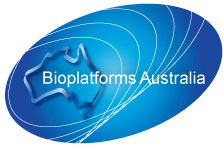
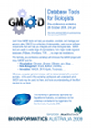

# BA2009

From GMOD

Jump to: [navigation](#mw-navigation), [search](#p-search)

<table
style="vertical-align: middle; border: 2px solid #A6A6BC; text-align: center"
data-cellpadding="10">
<colgroup>
<col style="width: 100%" />
</colgroup>
<tbody>
<tr class="odd">
<td>

<strong><a href="http://www.ausbiotech2009.com.au/bia/workshop"
class="external text" rel="nofollow">Database Tools for
Biologists</a></strong>

Pre-Conference GMOD Workshop 
28 October 2009, 2:00-6:00pm

</td>
</tr>
</tbody>
</table>

A half day, pre-conference GMOD workshop was held at
<a href="http://www.ausbiotech2009.com.au/bia/bia-home"
class="external text" rel="nofollow">Bioinformatics Australia 2009
(BA2009)</a> in Melbourne. The workshop was on Wednesday 28 October
2009, from 2-6pm.

The workshop introduced the [GMOD project](Main_Page "Main Page") and
many project [components](GMOD_Components "GMOD Components"), and was
run by [Dave Clements](User:Clements "User:Clements") of the [GMOD Help
Desk](GMOD_Help_Desk "GMOD Help Desk").

  

## Contents

- [1
  Links](#Links)
- [2
  Agenda](#Agenda)
- [3
  Sponsor](#Sponsor)
  - [3.1 About
    Bioplatforms Australia](#About_Bioplatforms_Australia)
- [4
  Flier](#Flier)

## Links

Presentation - Database Tools for Biologists (<a
href="ftp://ftp.gmod.org/pub/gmod/Meetings/2009/BA/BA2009GMODWorkshop.pdf"
class="external text" rel="nofollow">PDF</a>, <a
href="ftp://ftp.gmod.org/pub/gmod/Meetings/2009/BA/BA2009GMODWorkshop.ppt"
class="external text" rel="nofollow">PowerPoint</a>)  
The presentation slides are available in two formats. The PowerPoint
contains a few useful animations.

[GBrowse NGS Tutorial](GBrowse_NGS_Tutorial "GBrowse NGS Tutorial")  
The worked example demonstrating how to display
<a href="Next_generation_sequencing" class="mw-redirect"
title="Next generation sequencing">next generation sequencing</a> (NGS)
data in [GBrowse](GBrowse.1 "GBrowse") is now available as a GMOD
[tutorial](Category:Tutorials "Category:Tutorials"), complete with a
starting <a
href="http://gmod.org/mediawiki/index.php?title=VMware&amp;action=edit&amp;redlink=1"
class="new" title="VMware (page does not exist)">VMware</a> image.

## Agenda

<table class="wikitable" data-border="1" data-cellpadding="5"
data-cellspacing="0">
<colgroup>
<col style="width: 50%" />
<col style="width: 50%" />
</colgroup>
<thead>
<tr class="header">
<th>Time</th>
<th>Topic</th>
</tr>
</thead>
<tbody>
<tr class="odd">
<td colspan="2"></td>
</tr>
<tr class="even">
<td>2:00</td>
<td style="font-size: 120%"><strong>Introduction</strong></td>
</tr>
<tr class="odd">
<td colspan="2"></td>
</tr>
<tr class="even">
<td>2:10</td>
<td style="font-size: 120%"><strong>Software</strong></td>
</tr>
<tr class="odd">
<td>2:15</td>
<td><strong>Visualisation</strong> 
&#10;
<a href="GBrowse.1" title="GBrowse">GBrowse</a>, <a href="JBrowse.1"
title="JBrowse">JBrowse</a>, <a href="GBrowse_syn.1"
title="GBrowse syn">GBrowse_syn</a>, <a href="CMap.1"
title="CMap">CMap</a>, other <a href="Comparative_Genomics"
title="Comparative Genomics">Comparative Genomics</a> viewers 
Included a detailed GBrowse configuration example, showing some <a
href="Next_Generation_Sequencing"
title="Next Generation Sequencing">next generation sequence
data</a>.
</td>
</tr>
<tr class="even">
<td>3:55</td>
<td>Break</td>
</tr>
<tr class="odd">
<td>4:05</td>
<td><strong>Data Management</strong> 
&#10;
<a href="Chado" class="mw-redirect" title="Chado">Chado</a>, <a
href="BioMart" title="BioMart">BioMart</a>, <a href="InterMine"
title="InterMine">InterMine</a>, <a href="GFF3"
title="GFF3">GFF3</a>
</td>
</tr>
<tr class="even">
<td>4:50</td>
<td><strong>Annotation</strong> 
&#10;
<a href="MAKER.1" title="MAKER">MAKER</a>, <a href="DIYA"
title="DIYA">DIYA</a>, <a href="Apollo.1" title="Apollo">Apollo</a>, <a
href="Textpresso" title="Textpresso">Textpresso</a>, Community
Annotation, Pipelines and Workflows
</td>
</tr>
<tr class="odd">
<td colspan="2"></td>
</tr>
<tr class="even">
<td>5:35</td>
<td style="font-size: 120%"><strong>GMOD Project and
Community</strong></td>
</tr>
</tbody>
</table>

## Sponsor

This workshop was generously sponsored by
<a href="http://www.bioplatforms.com/" class="external text"
rel="nofollow">Bioplatforms Australia</a>, and admission to the workshop
was included in the registration for
<a href="http://www.ausbiotech2009.com.au/bia/bia-home"
class="external text" rel="nofollow">Bioinformatics Australia 2009</a>.

### About Bioplatforms Australia

<a href="http://www.bioplatforms.com/" class="external text"
rel="nofollow">Bioplatforms Australia</a> is a national body that
supports Australian life science research through major investments in
state-of-the-art platform technologies and by providing specialist
services in genomics, proteomics, metabolomics and bioinformatics.
Bioplatforms Australia represents an Australia-wide network of
universities and research institutions that boast the nation’s best in
biomolecular research capabilities. Its vision is to promote broad
access to its infrastructure network and cutting edge expertise as well
as enhance research efforts by offering an integrated 'omics' approach.

## Flier

If you work in Australia (or anywhere close to it!) please help spread
the word on this workshop by downloading, printing and posting the
<a href="../mediawiki/images/e/eb/BA2009AdRevised.pdf" class="internal"
title="BA2009AdRevised.pdf">workshop announcement</a> at your workplace.

Retrieved from
"<http://gmod.org/mediawiki/index.php?title=BA2009&oldid=21964>"

[Category](Special:Categories "Special:Categories"):

- [Education and
  Outreach](Category:Education_and_Outreach "Category:Education and Outreach")

## Navigation menu

### Namespaces

- <a href="BA2009" accesskey="c"
  title="View the content page [c]">Page</a>
- <a
  href="http://gmod.org/mediawiki/index.php?title=Talk:BA2009&amp;action=edit&amp;redlink=1"
  accesskey="t"
  title="Discussion about the content page [t]">Discussion</a>

### 

### Variants

### Views

- [Read](BA2009)
- <a
  href="http://gmod.org/mediawiki/index.php?title=BA2009&amp;action=edit"
  accesskey="e" title="This page is protected.
  You can view its source [e]">View source</a>
- <a
  href="http://gmod.org/mediawiki/index.php?title=BA2009&amp;action=history"
  accesskey="h" title="Past revisions of this page [h]">View history</a>

### Actions

### Search

### Navigation

- [GMOD Home](Main_Page)
- [Software](GMOD_Components)
- [Categories /
  Tags](Categories)
- [View all pages](Special:AllPages)

### Documentation

- [Overview](Overview)
- [FAQs](Category:FAQ)
- [HOWTOs](Category:HOWTO)
- [Glossary](Glossary)

### Community

- [GMOD News](GMOD_News)
- [Training /
  Outreach](Training_and_Outreach)
- [Support](Support)
- [GMOD Promotion](GMOD_Promotion)
- [Meetings](Meetings)
- [Calendar](Calendar)

### Tools

- <a href="Special:WhatLinksHere/BA2009" accesskey="j"
  title="A list of all wiki pages that link here [j]">What links here</a>
- <a href="Special:RecentChangesLinked/BA2009" accesskey="k"
  title="Recent changes in pages linked from this page [k]">Related
  changes</a>
- <a href="Special:SpecialPages" accesskey="q"
  title="A list of all special pages [q]">Special pages</a>
- <a
  href="http://gmod.org/mediawiki/index.php?title=BA2009&amp;printable=yes"
  rel="alternate" accesskey="p"
  title="Printable version of this page [p]">Printable version</a>
- [Permanent
  link](http://gmod.org/mediawiki/index.php?title=BA2009&oldid=21964 "Permanent link to this revision of the page")
- [Page
  information](http://gmod.org/mediawiki/index.php?title=BA2009&action=info)
- <a href="Special:Browse/BA2009" rel="smw-browse">Browse properties</a>
- [Print as
  PDF](http://gmod.org/mediawiki/index.php?title=Special:PdfPrint&page=BA2009)

- Last updated at 18:52 on 8 October
  2012.
- 119,347 page views.
- Content is available under
  <a href="http://www.gnu.org/licenses/fdl-1.3.html" class="external"
  rel="nofollow">a GNU Free Documentation License</a> unless otherwise
  noted.

<!-- -->

- [About
  GMOD](GMOD:About "GMOD:About")

<!-- -->

- 
- 
  

