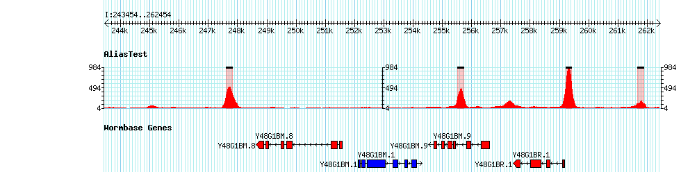

# BioGraphics:vista plot glyph

From GMOD

Jump to: [navigation](#mw-navigation), [search](#p-search)

The "vista_plot" glyph

------------------------------------------------------------------------

**NAME**

The **vista_plot** glyph.

  

------------------------------------------------------------------------

**SYNOPSIS**

This glyph draws peak calls (features with discreet boundaries, i.e.
putative transcription sites, over signal graph (wiggle_xyplot) requires
a special load gff file that uses attributes 'wigfile' and 'peak_type'
Big'***Wig support is available also, see POD documentation for more
details***

Example:

2L chip_seq vista 5407 23011573 . . . Name=Chip-Seq Experiment
1;wigfile=Some'***Wig'***File.wigdb;peak_type=transcript_region:exp1

See the Bio::Graphics::Glyph::vista_plot manual page for full details.

    $panel->add_track($features,
                      -glyph    => vista_plot,
                      -option1  => $value1,
                      -option2  => $value2...);

To experiment with this glyph's options, use the glyph_help.pl script
with either the -v or -p switch. Run "glyph_help -help" for details.

  
  

------------------------------------------------------------------------

**OPTIONS DEFINED IN THIS GLYPH**

<table class="wikitable sortable">
<caption>Glyph-specific options for the <em>vista_plot</em>
glyph:</caption>
<colgroup>
<col style="width: 33%" />
<col style="width: 33%" />
<col style="width: 33%" />
</colgroup>
<thead>
<tr class="header">
<th>Option</th>
<th>Option Type</th>
<th>Description</th>
</tr>
</thead>
<tbody>
<tr class="odd">
<th>-alpha</th>
<td>&lt;integer&gt; [default 100]</td>
<td>Alpha transparency of peak regions</td>
</tr>
<tr class="even">
<th>-end_color</th>
<td>&lt;color&gt; [default red]</td>
<td>End of the color gradient. See next section for color choices.</td>
</tr>
<tr class="odd">
<th>-glyph_subtype</th>
<td>&lt;'peaks+signal', 'peaks', 'signal', 'density'&gt; [default
vista]</td>
<td>What to show, peaks or signal, both (vista plot) or density
graph.</td>
</tr>
<tr class="even">
<th>-graph_type</th>
<td>&lt;'whiskers', 'histogram', 'boxes', 'line', 'points',
'linepoints'&gt; [default boxes]</td>
<td>Type of signal graph to show.</td>
</tr>
<tr class="odd">
<th>-max_peak</th>
<td>&lt;integer&gt; [default 255]</td>
<td>Maximum value of the peak feature's "score" attribute.</td>
</tr>
<tr class="even">
<th>-max_score</th>
<td>&lt;integer&gt; [default 'undef']</td>
<td>Maximum value of the signal graph feature's "score" attribute.</td>
</tr>
<tr class="odd">
<th>-min_peak</th>
<td>&lt;integer&gt; [default 1]</td>
<td>Minimum value of the peak feature's "score" attribute.</td>
</tr>
<tr class="even">
<th>-min_score</th>
<td>&lt;integer&gt; [default 'undef']</td>
<td>Minimum value of the signal graph feature's "score" attribute.</td>
</tr>
<tr class="odd">
<th>-peakwidth</th>
<td>&lt;integer&gt; [default 3]</td>
<td>Line width determine the thickness of the line representing a
peak.</td>
</tr>
<tr class="even">
<th>-start_color</th>
<td>&lt;color&gt; [default white]</td>
<td>Beginning of the color gradient, expressed as a named color or RGB
hex string. See next section for color choices.

 

</td>
</tr>
</tbody>
</table>

Glyph-specific options for the *vista_plot* glyph:

------------------------------------------------------------------------

**INHERITED OPTIONS**

<table class="wikitable sortable">
<caption>Options inherited from more general glyph classes:</caption>
<colgroup>
<col style="width: 33%" />
<col style="width: 33%" />
<col style="width: 33%" />
</colgroup>
<thead>
<tr class="header">
<th>Option</th>
<th>Option Type</th>
<th>Description</th>
</tr>
</thead>
<tbody>
<tr class="odd">
<th>-always_sort</th>
<td>&lt;boolean&gt; [default 'undef' (false)]</td>
<td>Sort even when bumping is off.</td>
</tr>
<tr class="even">
<th>-arrowhead</th>
<td>&lt;'regular', 'filled'&gt; [default regular]</td>
<td>Set the style of arrowhead used when drawing a stranded feature.
"regular" will generate a thin arrowhead that protrudes from the
feature. "filled" will taper the feature itself to turn it into an
arrowhead.</td>
</tr>
<tr class="odd">
<th>-autoscale</th>
<td>&lt;'local', 'chromosome', 'global', 'z_score', 'clipped_global'&gt;
[default clipped_global]</td>
<td>If set to "global" , then the minimum and maximum values of the XY
plot will be taken from the wiggle file as a whole. If set to
"chromosome", then scaling will be to minimum and maximum on the current
chromosome. "clipped_global" is similar to "global", but clips the top
and bottom values to the multiples of standard deviations indicated by
"z_score_bounds" If set to "z_score", then the whole plot will be
rescaled to z-scores in which the "0" value corresponds to the mean
across the genome, and the units correspond to standard deviations above
and below the mean. The number of SDs to show are controlled by the
"z_score_bound" option. Otherwise, the plot will be scaled to the
minimum and maximum values of the region currently on display. min_score
and max_score override autoscaling if one or both are defined</td>
</tr>
<tr class="even">
<th>-basecolor</th>
<td>&lt;color&gt; [default black]</td>
<td>The color to use for drawing DNA/protein residues at the base level
See next section for color choices.</td>
</tr>
<tr class="odd">
<th>-basedir</th>
<td>&lt;string&gt; [default 'undef']</td>
<td>If a relative path is used for "wigfile", then this option provides
the base directory on which to resolve the path.</td>
</tr>
<tr class="even">
<th>-bgcolor</th>
<td>&lt;'color', 'featureScore', 'featureRGB'&gt; [default
turquoise]</td>
<td>The background color of the glyph, used for filling its contents. A
value of "featureScore" will produce a greyscale gradient from the
feature's score value based on a range from 0 (lightest) to 1000
(darkest). A value of "featureRGB" will look for a feature tag named
"RGB" and use that for the color value. See the next section for color
choices.</td>
</tr>
<tr class="odd">
<th>-bicolor_pivot</th>
<td>&lt;'mean', 'zero', 'float', 'max', 'min', '1SD', '2SD', '3SD'&gt;
[default 'undef']</td>
<td>A value to pivot the display on. Typically this involves changing
the color of the glyph (and scale axis) depending on whether the feature
is above or below the pivot value. Provide "mean" to pivot on the mean
of the data series, "zero" to pivot on the zero value, "min" to pivot on
the min and "max" on max of data series, also it is possible to use any
arbitrary integer or floating point number to pivot at that value.</td>
</tr>
<tr class="even">
<th>-box_subparts</th>
<td>&lt;integer&gt; [default 0]</td>
<td>If this option is greater than zero, then imagemaps constructed from
this glyph will contain bounding boxes around each subpart of a feature
(e.g. each exon in a gene). The value of the option indicates the depth
of recursion.</td>
</tr>
<tr class="odd">
<th>-brightness</th>
<td>&lt;integer&gt; [default 'undef']</td>
<td>Color brilliance: an integer between 0 and 100. This will override
the value calculated from the name color.</td>
</tr>
<tr class="even">
<th>-bump</th>
<td>&lt;integer&gt; [default 1]</td>
<td>This option dictates the behavior of the glyph when two features
collide horizontally. A value of +1 will bump the colliding feature
downward using an algorithm that uses spaces efficiently. A value of -1
will bump the colliding feature upward using the same algorithm. Values
of +2 and -2 will bump using a simple algorithm that is faster but does
not use space as efficiently. A value of 3 or "fast" will turn on a
faster collision detection algorithm which is only compatible with the
default "left" sorting order. A value of 0 suppresses collision control
entirely.</td>
</tr>
<tr class="odd">
<th>-bump_limit</th>
<td>&lt;integer&gt; [default -1]</td>
<td>This option will cause bumping to stop after the indicated number of
features pile up. Subsequent collisions will not be bumped.</td>
</tr>
<tr class="even">
<th>-category</th>
<td>&lt;string&gt; [default 'undef']</td>
<td>A descriptive category that will be added to the track key.</td>
</tr>
<tr class="odd">
<th>-clip</th>
<td>&lt;boolean&gt; [default 0]</td>
<td>If min_score and/or max_score are manually specified, then setting
this to true will cause values outside the range to be clipped.</td>
</tr>
<tr class="even">
<th>-connector</th>
<td>&lt;'hat', 'solid', 'quill', 'dashed', 'crossed', 'undef'&gt;
[default 'undef']</td>
<td>Type of line to use for connecting discontinuous pieces of the
feature. Leave this undef to draw no connector at all.</td>
</tr>
<tr class="odd">
<th>-connector_color</th>
<td>&lt;color&gt; [default black]</td>
<td>Color to use for lines connecting discontinuous pieces of the
feature. See next section for color choices.</td>
</tr>
<tr class="even">
<th>-deletion_color</th>
<td>&lt;color&gt; [default red]</td>
<td>The color to use for deletions when displaying alignments; overrides
indel_color See next section for color choices.</td>
</tr>
<tr class="odd">
<th>-description</th>
<td>&lt;string&gt; [default 'undef']</td>
<td>Whether to place a description underneath the feature. A value of 1
will describe the feature using the values returned by its source_tag()
method. Any other true value will label the feature with the provided
value. Undef will suppress labeling entirely.</td>
</tr>
<tr class="even">
<th>-descriptioncolor</th>
<td>&lt;color&gt; [default black]</td>
<td>The color to use for drawing description text in this glyph (also
known as font2color. See next section for color choices.</td>
</tr>
<tr class="odd">
<th>-draw_dna</th>
<td>&lt;boolean&gt; [default 'undef' (false)]</td>
<td>If true, draw the dna residues when magnification level allows
(assumes that the feature is attached to a DNA sequence.</td>
</tr>
<tr class="even">
<th>-draw_protein_target</th>
<td>&lt;boolean&gt; [default 'undef' (false)]</td>
<td>If true, draw the protein residues of the TARGET (aligned) sequence
when the magnification level allows. See "Displaying Alignments" in
Bio::Graphics::Glyph::segments.</td>
</tr>
<tr class="odd">
<th>-draw_target</th>
<td>&lt;boolean&gt; [default 'undef' (false)]</td>
<td>If true, draw the dna residues of the TARGET (aligned) sequence when
the magnification level allows. See "Displaying Alignments" in
Bio::Graphics::Glyph::segments.</td>
</tr>
<tr class="even">
<th>-draw_translation</th>
<td>&lt;boolean&gt; [default 'undef' (false)]</td>
<td>Draw the protein translation of the feature (assumes that the
feature is attached to a DNA sequence.</td>
</tr>
<tr class="odd">
<th>-end_color</th>
<td>&lt;color&gt; [default red]</td>
<td>End of the color gradient. See next section for color choices.</td>
</tr>
<tr class="even">
<th>-feature_limit</th>
<td>&lt;integer&gt; [default 0]</td>
<td>This option will set an upper bound on the number of features to be
displayed. For this to work properly, features must be added one at a
time using add_feature().</td>
</tr>
<tr class="odd">
<th>-fgcolor</th>
<td>&lt;'color', 'featureScore', 'featureRGB'&gt; [default black]</td>
<td>The foreground color of the glyph, used for drawing outlines. A
value of "featureScore" will produce a greyscale gradient from the
feature's score value based on a range from 0 (lightest) to 1000
(darkest). A value of "featureRGB" will look for a feature tag named
"RGB" and use that for the color value. See the next section for color
choices.</td>
</tr>
<tr class="even">
<th>-fillcolor</th>
<td>&lt;color&gt; [default turquoise]</td>
<td>A synonym for -bgcolor. See next section for color choices.</td>
</tr>
<tr class="odd">
<th>-font</th>
<td>[default gdSmall'<strong><em>Font]</em></strong></td>
<td>Font for glyph label and description. Valid choices:
'gdTiny'<em><strong>Font', 'gdSmall'</strong></em>Font',
'gdMedium'<em><strong>Bold'</strong></em>Font',
'gdLarge'<em><strong>Font', 'gdGiant'</strong></em>Font'</td>
</tr>
<tr class="even">
<th>-font2color</th>
<td>&lt;color&gt; [default black]</td>
<td>The color to use for drawing description text in this glyph (also
known as descriptioncolor. See next section for color choices.</td>
</tr>
<tr class="odd">
<th>-fontcolor</th>
<td>&lt;color&gt; [default black]</td>
<td>The color to use for drawing label text in this glyph (also known as
labelcolor). See next section for color choices.</td>
</tr>
<tr class="even">
<th>-graph_type</th>
<td>&lt;'histogram', 'whiskers'&gt; [default histogram]</td>
<td>Type of graph to generate. Options are "histogram" (for a barchart),
or "whiskers" (for a whiskerplot showing mean, +/- stdev and max/min.
The deprecated "boxes" subtype is a synonym for "histogram."</td>
</tr>
<tr class="odd">
<th>-hbumppad</th>
<td>&lt;integer&gt; [default 2]</td>
<td>Ordinarily collison control prevents two features from overlapping
if they come within 2 pixels of each other. This option allows you to
change this value to give glyphs more or less breathing space on the
left and right.</td>
</tr>
<tr class="even">
<th>-height</th>
<td>&lt;integer&gt; [default 10]</td>
<td>Height of the glyph.</td>
</tr>
<tr class="odd">
<th>-hilite</th>
<td>&lt;color&gt; [default 'undef']</td>
<td>Highlight the glyph in the indicated color. Usually used as a
callback to selectively highlight glyphs that meet certain criteria. See
next section for color choices.</td>
</tr>
<tr class="even">
<th>-ignore_sub_part</th>
<td>&lt;string&gt; [default 'undef']</td>
<td>Pass a space-delimited list of primary_tag() names in order to
selectively suppress the drawing of subparts that match those primary
tags.</td>
</tr>
<tr class="odd">
<th>-indel_color</th>
<td>&lt;color&gt; [default lightgrey]</td>
<td>The color to use for indels when displaying alignments. See next
section for color choices.</td>
</tr>
<tr class="even">
<th>-insertion_color</th>
<td>&lt;color&gt; [default green]</td>
<td>The color to use for insertions when displaying alignments;
overrides indel_color See next section for color choices.</td>
</tr>
<tr class="odd">
<th>-key</th>
<td>&lt;string&gt; [default 'undef']</td>
<td>The printed label to use to describe this track.</td>
</tr>
<tr class="even">
<th>-label</th>
<td>&lt;string&gt; [default 'undef']</td>
<td>Whether to label the feature. A value of 1 will label the feature
with the value returned by its display_name() method. Any other true
value will label the feature with the provided value. Undef will
suppress labeling entirely.</td>
</tr>
<tr class="odd">
<th>-label_position</th>
<td>&lt;'top', 'left', 'alignment_left'&gt; [default top]</td>
<td>Where to place the feature label. "top" will place the label above
the glyph aligned with its left side. "left" will place the label to the
left of the glyph, vertically centered with it. "alignment_left" will
place the label to the left of the glyph in the panel pad-left positon.
The last option is used internally for drawing DNA alignments which span
the screen.</td>
</tr>
<tr class="even">
<th>-labelcolor</th>
<td>&lt;color&gt; [default black]</td>
<td>The color to use for drawing label text in this glyph (also known as
fontcolor). See next section for color choices.</td>
</tr>
<tr class="odd">
<th>-linewidth</th>
<td>&lt;integer&gt; [default 1]</td>
<td>Thickness of line used to draw the glyph's outline.</td>
</tr>
<tr class="even">
<th>-link</th>
<td>&lt;string&gt; [default 'undef']</td>
<td>When generating an imagemap, specify the pattern or callback for
formatting the link URL associated with the glyph.</td>
</tr>
<tr class="odd">
<th>-max_color</th>
<td>&lt;color&gt; [default lightgrey]</td>
<td>The color drawn from +stdev to max. See next section for color
choices.</td>
</tr>
<tr class="even">
<th>-max_score</th>
<td>&lt;integer&gt; [default 'undef']</td>
<td>Maximum value of the feature's "score" attribute.</td>
</tr>
<tr class="odd">
<th>-maxdepth</th>
<td>&lt;integer&gt; [default 'undef']</td>
<td>Specifies how many levels deep the glyph should traverse features
looking for subfeatures. A value of undef allows unlimited traversal. A
value of 0 suppresses traversal entirely for the same effect as
-no_subparts.</td>
</tr>
<tr class="even">
<th>-mean_color</th>
<td>&lt;color&gt; [default black]</td>
<td>The color drawn from the zero value to the mean value. See next
section for color choices.</td>
</tr>
<tr class="odd">
<th>-mean_color_neg</th>
<td>&lt;color&gt; [default same as mean_color]</td>
<td>The color drawn from the zero value to the mean value, for negative
values. See next section for color choices.</td>
</tr>
<tr class="even">
<th>-min_color</th>
<td>&lt;color&gt; [default same as max_color]</td>
<td>The color drawn from -stdev to min. See next section for color
choices.</td>
</tr>
<tr class="odd">
<th>-min_score</th>
<td>&lt;integer&gt; [default 'undef']</td>
<td>Minimum value of the feature's "score" attribute.</td>
</tr>
<tr class="even">
<th>-mismatch_color</th>
<td>&lt;color&gt; [default lightgrey]</td>
<td>The color to use for mismatched bases when displaying alignments.
See "Displaying Alignments" in Bio::Graphics::Glyph::segments. See next
section for color choices.</td>
</tr>
<tr class="odd">
<th>-mismatch_only</th>
<td>&lt;boolean&gt; [default 'undef' (false)]</td>
<td>If true, only print mismatched bases when displaying
alignments.</td>
</tr>
<tr class="even">
<th>-neg_color</th>
<td>&lt;color&gt; [default 'undef']</td>
<td>The color to use for values that are below the bicolor_pivot value.
See next section for color choices.</td>
</tr>
<tr class="odd">
<th>-no_subparts</th>
<td>&lt;boolean&gt; [default 'undef' (false)]</td>
<td>Set this option to a true value to suppress drawing of all its
subparts.</td>
</tr>
<tr class="even">
<th>-opacity</th>
<td>&lt;float&gt; [default 1.0]</td>
<td>Default opacity to apply to glyph background and foreground colors.
This is a value between 0.0 (completely transparent) to 1.0 (completely
opaque. If the color contains an explicit opacity (alpha) value, the
default value will be ignored</td>
</tr>
<tr class="odd">
<th>-pad_bottom</th>
<td>&lt;integer&gt; [default 0]</td>
<td>Additional whitespace (in pixels) to add to the bottom of this
glyph.</td>
</tr>
<tr class="even">
<th>-pad_left</th>
<td>&lt;integer&gt; [default 0]</td>
<td>Additional whitespace (in pixels) to add to the left of this
glyph.</td>
</tr>
<tr class="odd">
<th>-pad_right</th>
<td>&lt;integer&gt; [default 0]</td>
<td>Additional whitespace (in pixels) to add to the right of this
glyph.</td>
</tr>
<tr class="even">
<th>-pad_top</th>
<td>&lt;integer&gt; [default 0]</td>
<td>Additional whitespace (in pixels) to add to the top of this
glyph.</td>
</tr>
<tr class="odd">
<th>-part_labels</th>
<td>&lt;boolean&gt; [default 'undef' (false)]</td>
<td>If false, do not label subparts of the feature. If equal to a value
of 1, subparts are labeled with their display_name(). Any other true
value, will be used as the subpart label. A false value suppresses the
printing of subpart labels.</td>
</tr>
<tr class="even">
<th>-point_radius</th>
<td>&lt;integer&gt; [default 1]</td>
<td>When drawing data points, this specifies the radius of each
point.</td>
</tr>
<tr class="odd">
<th>-point_symbol</th>
<td>&lt;string&gt; [default none]</td>
<td>Symbol to use for each data point when drawing line graphs. Options
are "triangle", "square", "disc", "filled_triangle", "filled_square",
"filled_disc", "point" and "none"</td>
</tr>
<tr class="even">
<th>-pos_color</th>
<td>&lt;color&gt; [default 'undef']</td>
<td>The color to use for values that exceed the bicolor_pivot value. See
next section for color choices.</td>
</tr>
<tr class="odd">
<th>-pure_hue</th>
<td>&lt;boolean&gt; [default 'undef' (false)]</td>
<td>Use the pure hue (brightness and saturation both at 100) for the
named color.</td>
</tr>
<tr class="even">
<th>-ragged_extra</th>
<td>&lt;boolean&gt; [default 'undef' (false)]</td>
<td>When combined with -draw_target, draw extra bases beyond the end of
the alignment. The value is the maximum number of extra bases. See
"Displaying Alignments" in Bio::Graphics::Glyph::segments.</td>
</tr>
<tr class="odd">
<th>-realign</th>
<td>&lt;boolean&gt; [default 'undef' (false)]</td>
<td>Attempt to realign sequences at high magnification to account for
indels. See "Displaying Alignments" in
Bio::Graphics::Glyph::segments.</td>
</tr>
<tr class="even">
<th>-record_label_positions</th>
<td>&lt;integer&gt; [default 'undef']</td>
<td>If true, remember the coordinates of the glyph label and return it
by calling $panel-&gt;key_boxes. If -1, then remember coordinates, but
don't actually draw the label</td>
</tr>
<tr class="odd">
<th>-saturation</th>
<td>&lt;integer&gt; [default 'undef']</td>
<td>Color saturation: an integer between 0 and 100. This will override
the value calculated from the named color.</td>
</tr>
<tr class="even">
<th>-scale</th>
<td>&lt;string&gt; [default three]</td>
<td>Position where the Y axis scale is drawn, if any. Options are one of
"left", "right", "both", "three" or "none". "three" will cause the scale
to be drawn in the left, right and center.</td>
</tr>
<tr class="odd">
<th>-scale_color</th>
<td>&lt;color&gt; [default fgcolor]</td>
<td>Color of the X and Y scales. Defaults to the same as fgcolor. See
next section for color choices.</td>
</tr>
<tr class="even">
<th>-show_mismatch</th>
<td>&lt;integer&gt; [default 'undef']</td>
<td>When combined with -draw_target, highlights mismatched bases in the
mismatch color. A value of 0 or undef never shows mismatches. A value of
1 shows mismatches at the base pair alignment level, but not at
magnifications too low to allow the DNA to be displayed. Any other
positive integer will show mismatches when the track is showing a region
less than or equal to the specified value. See "Displaying Alignments"
in Bio::Graphics::Glyph::segments.</td>
</tr>
<tr class="odd">
<th>-smoothing</th>
<td>&lt;'none', 'mean', 'max', 'min'&gt; [default none]</td>
<td>Whether to smooth data values across a defined window. Mean
smoothing will run a rolling mean across the window. Max smoothing will
take the maximum value across the window, and min smoothing will take
the minimum value.</td>
</tr>
<tr class="even">
<th>-smoothing_window</th>
<td>&lt;integer&gt; [default 'undef']</td>
<td>Size of the smoothing window. If not specified, the window will be
taken to be 10% of the region under display.</td>
</tr>
<tr class="odd">
<th>-sort_order</th>
<td>&lt;'left', 'right', 'low_score', 'high_score', 'longest',
'shortest', 'strand', 'name'&gt; [default left]</td>
<td>Control how features are layed out so that more "important" features
sort towards the top. See the Bio::Graphics::Glyph documentation for a
description of how this works.</td>
</tr>
<tr class="even">
<th>-split_on_cigar</th>
<td>&lt;boolean&gt; [default 'undef' (false)]</td>
<td>If true, and if the feature contains a CIGAR string as the value of
the Gap tag, then split the feature into subparts based on the
CIGAR.</td>
</tr>
<tr class="odd">
<th>-start_color</th>
<td>&lt;color&gt; [default white]</td>
<td>Beginning of the color gradient, expressed as a named color or RGB
hex string. See next section for color choices.</td>
</tr>
<tr class="even">
<th>-stdev_color</th>
<td>&lt;color&gt; [default grey]</td>
<td>The color drawn from the mean value to +stdev. See next section for
color choices.</td>
</tr>
<tr class="odd">
<th>-stdev_color_neg</th>
<td>&lt;color&gt; [default same as stdev_color]</td>
<td>The color drawn from the mean value to -stdev. See next section for
color choices.</td>
</tr>
<tr class="even">
<th>-strand_arrow</th>
<td>&lt;boolean&gt; [default 'undef' (false)]</td>
<td>Whether to indicate the feature's strandedness. If equal to 'ends'
then only the right and left ends of multi-part features will show
strandedness.</td>
</tr>
<tr class="odd">
<th>-stranded</th>
<td>&lt;boolean&gt; [default 'undef' (false)]</td>
<td>Synonym for -strand_arrow. Indicates whether to indicate the
feature's strandedness. If equal to 'ends' then only the right and left
ends of multi-part features will show strandedness.</td>
</tr>
<tr class="even">
<th>-target</th>
<td>&lt;string&gt; [default 'undef']</td>
<td>When generating an imagemap, specify the pattern or callback for
formatting the link target associated with the glyph.</td>
</tr>
<tr class="odd">
<th>-title</th>
<td>&lt;string&gt; [default 'undef']</td>
<td>When generating an imagemap, specify the pattern or callback for
formatting the link title associated with the glyph.</td>
</tr>
<tr class="even">
<th>-tkcolor</th>
<td>&lt;color&gt; [default 'undef']</td>
<td>Rarely-used option to flood-fill entire glyph with a single color
prior to rendering it. See next section for color choices.</td>
</tr>
<tr class="odd">
<th>-true_target</th>
<td>&lt;boolean&gt; [default 'undef' (false)]</td>
<td>Show the target DNA in its native (plus strand) orientation, even if
the alignment is to the minus strand. See "Displaying Alignments" in
Bio::Graphics::Glyph::segments.</td>
</tr>
<tr class="even">
<th>-variance_band</th>
<td>&lt;boolean&gt; [default 0]</td>
<td>If true, draw a semi-transparent band across the image that
indicates the mean and standard deviation of the data set. Only of use
when a wig file is provided.</td>
</tr>
<tr class="odd">
<th>-vary_fg</th>
<td>&lt;boolean&gt; [default 1 (true)]</td>
<td>Vary both the foreground and background colors.</td>
</tr>
<tr class="even">
<th>-z_score_bounds</th>
<td>&lt;integer&gt; [default 4]</td>
<td>When using z_score autoscaling, this option controls how many
standard deviations above and below the mean to show.

 

</td>
</tr>
</tbody>
</table>

Options inherited from more general glyph classes:

------------------------------------------------------------------------

**COLOR OPTIONS**

See
[Glyphs_and_Glyph_Options#Colors](Glyphs_and_Glyph_Options#Colors "Glyphs and Glyph Options")

Retrieved from
"<http://gmod.org/mediawiki/index.php?title=BioGraphics:vista_plot_glyph&oldid=20560>"

## Navigation menu

### Namespaces

- <a href="BioGraphics:vista_plot_glyph" accesskey="c"
  title="View the content page [c]">Page</a>
- <a
  href="http://gmod.org/mediawiki/index.php?title=Talk:BioGraphics:vista_plot_glyph&amp;action=edit&amp;redlink=1"
  accesskey="t"
  title="Discussion about the content page [t]">Discussion</a>

### 

### Variants

### Navigation

- [GMOD Home](Main_Page)
- [Software](GMOD_Components)
- [Categories /
  Tags](Categories)
- [View all pages](Special:AllPages)

### Documentation

- [Overview](Overview)
- [FAQs](Category:FAQ)
- [HOWTOs](Category:HOWTO)
- [Glossary](Glossary)

### Community

- [GMOD News](GMOD_News)
- [Training /
  Outreach](Training_and_Outreach)
- [Support](Support)
- [GMOD Promotion](GMOD_Promotion)
- [Meetings](Meetings)
- [Calendar](Calendar)

### Tools

- <a href="Special:Browse/BioGraphics:vista_plot_glyph"
  rel="smw-browse">Browse properties</a>

- Last updated at 16:06 on 19 April
  2012.
<!-- - 3,832 page views. -->
- Content is available under
  <a href="http://www.gnu.org/licenses/fdl-1.3.html" class="external"
  rel="nofollow">a GNU Free Documentation License</a> unless otherwise
  noted.

<!-- -->

- [About
  GMOD](GMOD:About "GMOD:About")

<!-- -->

- 

