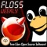

# BioPerl

From GMOD

Jump to: [navigation](#mw-navigation), [search](#p-search)

<a href="http://www.bioperl.org/" class="external text"
rel="nofollow">BioPerl</a> is a set of modules that support
bioinformatics programming in [Perl](Category%3APerl "Category%3APerl")
programs. BioPerl is used extensively by several GMOD components. You
will need to install it before you can use those components.

This is a one page summary of BioPerl that introduces several high level
concepts and some points that are specifically important for GMOD. If
you have a detailed question about BioPerl, see the
<a href="http://www.bioperl.org/" class="external text"
rel="nofollow">BioPerl web site</a> for more.

## Contents

- [1 The Most
  Frequently Given Answer in
  GMOD](#The_Most_Frequently_Given_Answer_in_GMOD)
- [2 BioPerl
  Background](#BioPerl_Background)
  - [2.1 BioPerl
    Podcast](#BioPerl_Podcast)
  - [2.2 BioPerl
    Packages and
    bioperl-live](#BioPerl_Packages_and_bioperl-live)
  - [2.3 BioPerl
    Releases](#BioPerl_Releases)
- [3 Installing
  BioPerl](#Installing_BioPerl)
  - [3.1
    Dependencies](#Dependencies)
    - [3.1.1
      Outside Perl](#Outside_Perl)
    - [3.1.2 Inside
      Perl](#Inside_Perl)
  - [3.2
    Install](#Install)
    - [3.2.1
      Answering Questions During the
      Install](#Answering_Questions_During_the_Install)
    - [3.2.2
      Errors](#Errors)

## The Most Frequently Given Answer in GMOD

By at least an order or magnitude, the most frequently given answer on
the [GMOD Mailing Lists](GMOD_Mailing_Lists "GMOD Mailing Lists") has
been:

***"You need to upgrade to the latest version of BioPerl, known as
BioPerl-live. All of the official BioPerl releases are too old for use
with GMOD Components."***

However, as of January, 2009 this may be changing. Keep reading for why
this is and for how to get it.

## BioPerl Background

### BioPerl Podcast

A <a href="http://twit.tv/floss96" class="external text"
rel="nofollow">podcast on the BioPerl project</a> is available at
<a href="http://twit.tv/FLOSS" class="external text"
rel="nofollow">FLOSS Weekly</a>. It's about an hour long and it's a good
introduction to the **BioPerl** project. The podcast is an interview
with BioPerl heavy hitters [Chris Fields](User%3ACjfields "User%3ACjfields")
and [Jason Stajich](User%3AStajich "User%3AStajich").

### BioPerl Packages and bioperl-live

BioPerl is an enormous project. To make it more manageable it has been
divided into several
<a href="http://www.bioperl.org/wiki/Getting_BioPerl" class="extiw"
title="bp:Getting BioPerl">packages</a>. The most popular package, and
the one most frequently used by GMOD components is the **Core** package.
Each GMOD component will tell you which BioPerl packages are required
for it to work.

**Bioperl-live** is the latest version of the **core** package as it
exists in Git. That is, bioperl-live contains the absolute latest and
greatest updates to BioPerl.

### BioPerl Releases

At any point in time there will be 2 or 3 BioPerl
<a href="http://www.bioperl.org/wiki/Getting_BioPerl" class="extiw"
title="bp:Getting BioPerl">releases</a>.

| Release | Description | Use in GMOD? |
|----|----|----|
| **Stable (<a href="http://search.cpan.org/~cjfields/BioPerl-1.6.1/"
class="external text" rel="nofollow">1.6.1</a>)** | *Stable* releases have gone through more testing than the other types of releases. The most recent stable release was 1.6.1 in September 2009. | Yes |
| **Developer** | There hasn't been a developer release since the 1.6.x releases started coming out. | N/A |
| **BioPerl-live** | *BioPerl-live* (and its cousins) is not a release *per se*, but is rather a copy of what is in BioPerl's Git repository for the **core** module on the day you get the files. This is the most up to date version of BioPerl you can get. You may need to use *BioPerl-live* if it has functionality you need that is not in the stable release. See BioPerl's <a href="http://www.bioperl.org/wiki/Using_Git" class="extiw"
title="bp:Using Git">Using Git</a> and <a href="http://www.bioperl.org/wiki/Getting_BioPerl" class="extiw"
title="bp:Getting BioPerl">Getting BioPerl</a> pages for how to get the latest copy of *BioPerl-live*. | Yes[\[1\]](#cite_note-1) |

1.  [↑](#cite_ref-1)
    Getting the latest code from Git may
    sound scary, but in actual practice it rarely causes problems.
    Revisions to BioPerl almost always result in a better
    package.

## Installing BioPerl

Installing BioPerl is non-trivial. It has many dependencies both within
and outside of Perl. Perl does a pretty good job of dealing with
dependencies within Perl (meaning dependencies on other Perl modules).
It does not do so well with dependencies outside of Perl. You should
address the external dependencies before attempting to install BioPerl.

### Dependencies

#### Outside Perl

You need to install external (i.e.,non-Perl) libraries *before* you
install BioPerl. If these are not installed then attempts to install
BioPerl will generate copious error messages.

If you are on Linux, then these will be available as packages and should
be installed using the appropriate package manager for your Linux
distribution. These may also already be installed on your system.

| Library(ies)      | Description                                  |
|-------------------|----------------------------------------------|
| perl-devel        | Perl development library.                    |
| perl-DB_File      | Berkeley DB support in Perl.                 |
| libgd, lbgd-devel | Libraries for creating PNG, JPG, etc images. |
| expat, libexpat   | An XML parser.                               |

#### Inside Perl

There are also a few Perl modules that you should install before
installing BioPerl. These are listed on BioPerl's
<a href="http://www.bioperl.org/wiki/Installing_BioPerl" class="extiw"
title="bp:Installing BioPerl">installation pages</a>.

### Install

BioPerl has an
<a href="http://www.bioperl.org/wiki/Installing_BioPerl" class="extiw"
title="bp:Installing BioPerl">Installing BioPerl</a> page that includes
pointers to specific platform installation pages. That page lists 4
different ways to install a BioPerl module. However, since you need to
install from Git only one of those methods applies. See BioPerl's
<a href="http://www.bioperl.org/wiki/Using_Git" class="extiw"
title="bp:Using Git">Using Git</a> page for how to get the latest
version and how to use it.

#### Answering Questions During the Install

The installation will typically ask you many questions. How should you
answer those? The basic guideline is:

When in doubt use the default answer.

The default answer is usually shown in square brackets, e.g. \[y\] for
'yes'.

#### Errors

From BioPerl:

> If you've installed everything perfectly and all the network
> connections are working then you may pass all the tests run in the
> './Build test' phase. It's also possible that you may fail some tests.
> Possible explanations: problems with local Perl installation, network
> problems, previously undetected bug in BioPerl, flawed test script,
> problems with CGI script used for sequence retrieval at public
> database, and so on. Remember that there are over 800 modules in
> Bioperl and the test suite is running more than 12000 individual
> tests, a few failed tests may not affect your usage of Bioperl.
>
> If you decide that the failed tests will not affect how you intend to
> use BioPerl and you'd like to install anyway do:
>
>     cpan>force install C/CJ/CJFIELDS/BioPerl-1.6.0.tar.gz
>
> This is what most experienced Bioperl users would do. However, if
> you're concerned about a failed test and need assistance or advice
> then contact bioperl-l@bioperl.org.

In other words, the install will not pass all its tests and it will have
to be forced. But how do you decide what level of errors are acceptable
and what are not? Here's a rough guideline:

- If you see errors related to the non-Perl prerequisites (see [Outside
  Perl](#Outside_Perl) above)
  then you should check that you have that prerequisite installed
  correctly and then try again.
  This type of error usually occurs while building the BioPerl
  installation rather than while testing it.
- If your errors occur only in the testing part of the installation, and
  there are few of them compared to the total number of tests,
  then you are probably safe to do a force install.

Retrieved from
"<http://gmod.org/mediawiki/index.php?title=BioPerl&oldid=21860>"

[Categories](Special%3ACategories "Special%3ACategories"):

- [External](Category%3AExternal "Category%3AExternal")
- [Perl](Category%3APerl "Category%3APerl")
- [BioPerl](Category%3ABioPerl "Category%3ABioPerl")

## Navigation menu

### Namespaces

- <a
  href="http://gmod.org/mediawiki/index.php?title=Talk:BioPerl&amp;action=edit&amp;redlink=1"
  accesskey="t"
  title="Discussion about the content page [t]">Discussion</a>

### 

### Variants

### Navigation

- [GMOD Home](Main_Page)
- [Software](GMOD_Components)
- [Categories /
  Tags](Categories)

### Documentation

- [Overview](Overview)
- [FAQs](Category%3AFAQ)
- [HOWTOs](Category%3AHOWTO)
- [Glossary](Glossary)

### Community

- [GMOD News](GMOD_News)
- [Training /
  Outreach](Training_and_Outreach)
- [Support](Support)
- [GMOD Promotion](GMOD_Promotion)
- [Meetings](Meetings)
- [Calendar](Calendar)

### Tools

- <a href="Special%3ABrowse/BioPerl" rel="smw-browse">Browse properties</a>

- Last updated at 17:28 on 3 October
  2012.
<!-- - 206,967 page views. -->
- Content is available under
  <a href="http://www.gnu.org/licenses/fdl-1.3.html" class="external"
  rel="nofollow">a GNU Free Documentation License</a> unless otherwise
  noted.

<!-- -->

- [About
  GMOD](GMOD:About "GMOD:About")

<!-- -->

