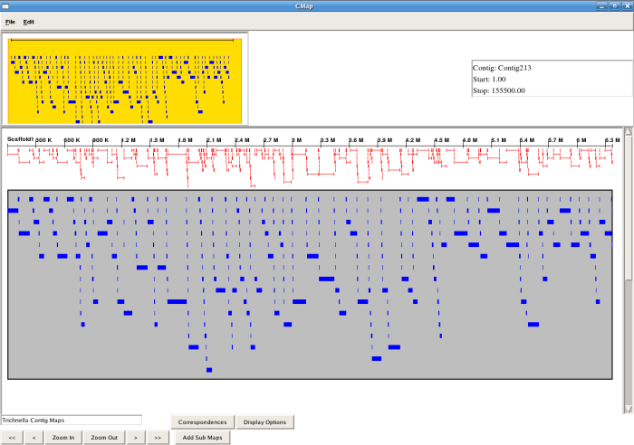
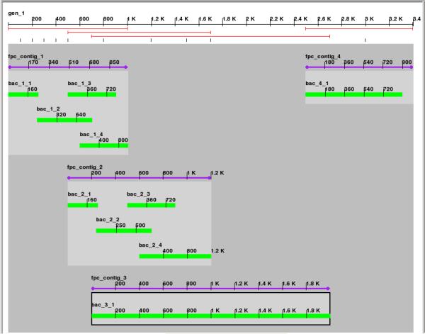

# CMAE

From GMOD

Jump to: [navigation](#mw-navigation), [search](#p-search)

> The item described in this page is not (or is no longer) supported by
> the GMOD project.  
> This page is included only for reference purposes.

Work on CMAE was started, but never completed.

The [CMap](CMap.1 "CMap") Assembly Editor (CMAE) is a desktop
application that is being developed to assist in visualizing and editing
large scale sequence assemblies for the maize sequencing project. Using
the [CMap](CMap.1 "CMap") comparative mapping database, CMAE allows
sequence assemblies to be superimposed on top of diverse other types of
mapping data, allowing the finisher to view assemblies in the context of
a cascade of mapping data at a variety of resolutions. For example, the
editor can show sequence contigs aligned to fingerprinted physical map
contigs, which are aligned in turn to genetic maps. Correspondence links
between the different objects indicate the quality of the assembly and
highlight possible mis-assemblies. The editor will then allow
mis-assembled contigs to be split, merged or moved, or the troubled
contigs can be exported to a more specialized program. (L. Stein)

## Contents

- [1
  Requirements](#Requirements)
- [2
  Documentation](#Documentation)
- [3
  Screenshots](#Screenshots)
- [4
  Code](#Code)
- [5 Mailing
  List](#Mailing_List)
- [6
  Contact](#Contact)

## Requirements

- [CMap](CMap.1 "CMap")
- <a href="http://www.perltk.org/" class="external text"
  rel="nofollow">Perl/Tk</a>
- <a href="http://www.tkzinc.org/tkzinc/index.php" class="external text"
  rel="nofollow">Tkzinc</a>

## Documentation

- [Integrating_CMAE](Integrating_CMAE "Integrating CMAE") (<a
  href="http://gmod.cvs.sourceforge.net/gmod/cmap/editor/Integrating_CMAE.pod?view=markup"
  class="external text" rel="nofollow">CVS</a>)
- [CMap_API](CMap_API "CMap API") (<a
  href="http://gmod.cvs.sourceforge.net/gmod/cmap/docs/CMAP_API.pod?view=markup"
  class="external text" rel="nofollow">CVS</a>)

## Screenshots

## Code

The CMAE code is located in the SourceForge CVS repository for CMap.

- <a href="http://gmod.cvs.sourceforge.net/gmod/cmap/"
  class="external text" rel="nofollow">CMap CVS</a>

The CMAE specific information is located in the "editor" directory.

- <a href="http://gmod.cvs.sourceforge.net/gmod/cmap/editor/"
  class="external text" rel="nofollow">CMap/editor CVS</a>

## Mailing List

- gmod-cmae@lists.sourceforge.net: Discussion of development,
  installation problems, etc.

## Contact

- [Ben Faga](User:Faga "User:Faga")

Retrieved from
"<http://gmod.org/mediawiki/index.php?title=CMAE&oldid=9323>"

[Categories](Special:Categories "Special:Categories"):

- [Unsupported](Category:Unsupported "Category:Unsupported")
- [CMap](Category:CMap "Category:CMap")

## Navigation menu

### Namespaces

- <a href="CMAE" accesskey="c" title="View the content page [c]">Page</a>
- <a
  href="http://gmod.org/mediawiki/index.php?title=Talk:CMAE&amp;action=edit&amp;redlink=1"
  accesskey="t"
  title="Discussion about the content page [t]">Discussion</a>

### 

### Variants

### Views

- [Read](CMAE)
- <a href="http://gmod.org/mediawiki/index.php?title=CMAE&amp;action=edit"
  accesskey="e" title="This page is protected.
  You can view its source [e]">View source</a>
- <a
  href="http://gmod.org/mediawiki/index.php?title=CMAE&amp;action=history"
  accesskey="h" title="Past revisions of this page [h]">View history</a>

### Actions

### Search

### Navigation

- [GMOD Home](Main_Page)
- [Software](GMOD_Components)
- [Categories /
  Tags](Categories)
- [View all pages](Special:AllPages)

### Documentation

- [Overview](Overview)
- [FAQs](Category:FAQ)
- [HOWTOs](Category:HOWTO)
- [Glossary](Glossary)

### Community

- [GMOD News](GMOD_News)
- [Training /
  Outreach](Training_and_Outreach)
- [Support](Support)
- [GMOD Promotion](GMOD_Promotion)
- [Meetings](Meetings)
- [Calendar](Calendar)

### Tools

- <a href="Special:WhatLinksHere/CMAE" accesskey="j"
  title="A list of all wiki pages that link here [j]">What links here</a>
- <a href="Special:RecentChangesLinked/CMAE" accesskey="k"
  title="Recent changes in pages linked from this page [k]">Related
  changes</a>
- <a href="Special:SpecialPages" accesskey="q"
  title="A list of all special pages [q]">Special pages</a>
- <a
  href="http://gmod.org/mediawiki/index.php?title=CMAE&amp;printable=yes"
  rel="alternate" accesskey="p"
  title="Printable version of this page [p]">Printable version</a>
- [Permanent
  link](http://gmod.org/mediawiki/index.php?title=CMAE&oldid=9323 "Permanent link to this revision of the page")
- [Page
  information](http://gmod.org/mediawiki/index.php?title=CMAE&action=info)
- <a href="Special:Browse/CMAE" rel="smw-browse">Browse properties</a>
- [Print as
  PDF](http://gmod.org/mediawiki/index.php?title=Special:PdfPrint&page=CMAE)

- Last updated at 20:47 on 15 September
  2009.
- 51,596 page views.
- Content is available under
  <a href="http://www.gnu.org/licenses/fdl-1.3.html" class="external"
  rel="nofollow">a GNU Free Documentation License</a> unless otherwise
  noted.

<!-- -->

- [About
  GMOD](GMOD:About "GMOD:About")

<!-- -->

- 
- 
  

