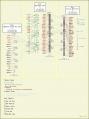
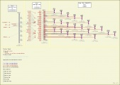

# CMap/tool data

From GMOD

Jump to: [navigation](#mw-navigation), [search](#p-search)

  
This page stores the data that populates the [CMap](../CMap.1 "CMap")
wiki page.

  
{{ {{{template}}} \| name = CMap \| full_name = \| status = mature \|
dev = inactive \| support = active \| type = Genome Visualization &
Editing \| platform = web \| logo = CMapLogo-horiz.png \| home =
<a href="../CMap.1" class="external free"
rel="nofollow">http://gmod.org/wiki/CMap</a> \| about = A browser-based
tool for the visual comparison of various maps (sequence, genetic, etc.)
from any number of species. The CMap package also includes tools for
curating map data. \| screenshot = Here are some sample maps from the
<a href="http://www.gramene.org/" class="external text"
rel="nofollow">Gramene Project</a>. See also
<a href="http://www.gramene.org/cmap/entry.html" class="external text"
rel="nofollow">other Gramene views</a>.

- 

  

  

  

  

  

  

  

  

- 

  

  

  

  

  

  

  

  

- 

  

  

  

  

  

  

  

  

\| public_server =
<a href="http://www.gramene.org/cmap" class="external free"
rel="nofollow">http://www.gramene.org/cmap</a> \| dl = \| dl_url =
<a href="http://sourceforge.net/projects/gmod/files/cmap/"
class="external free"
rel="nofollow">http://sourceforge.net/projects/gmod/files/cmap/</a> \|
dl_src = \| dl_src_url =
<a href="https://gmod.svn.sourceforge.net/svnroot/gmod/cmap"
class="external free"
rel="nofollow">https://gmod.svn.sourceforge.net/svnroot/gmod/cmap</a> \|
dl_dev = \| dl_dev_url = \| getting_started_preamble = \| req =

- Perl 5.6.0 or higher
- A web server with CGI capabilites (e.g., Apache 1.x or 2.x)
- A relational database, e.g.
  <a href="http://www.mysql.com" class="external text"
  rel="nofollow">MySQL (4.0+)</a>, Sybase Adaptive Server Enterprise,
  [PostgreSQL](../PostgreSQL "PostgreSQL"), SQLite or Oracle (9.x)
- <a href="http://www.boutell.com/gd/" class="external text"
  rel="nofollow">libgd (2.0.28 or higher)</a> and
  \[<a href="http://search.cpan.org/perldoc?GD" class="external text"
  rel="nofollow">GD</a> GD.pm (2.16 or higher)\]
- Various Perl modules available on
  <a href="http://www.cpan.org/" class="external text"
  rel="nofollow">CPAN</a>

\| install = \| config = \| doc =

- <a href="http://www.gramene.org/tutorials/cmap.html"
  class="external text" rel="nofollow">Gramene CMap User Tutorial</a>,
  Available in both
  <a href="http://www.gramene.org/tutorials/cmap_tutorial.pdf"
  class="external text" rel="nofollow">PDF</a> and
  <a href="http://www.gramene.org/tutorials/cmap_tutorial.ppt"
  class="external text" rel="nofollow">PowerPoint</a> formats.
- [CMap_API](../CMap_API "CMap API") (<a
  href="http://gmod.svn.sourceforge.net/viewvc/gmod/cmap/trunk/docs/CMAP_API.pod"
  class="external text" rel="nofollow">SVN</a>)
- <a href="http://gmod.svn.sourceforge.net/viewvc/gmod/cmap/trunk/README"
  class="external text" rel="nofollow">README</a>
- <a href="http://gmod.svn.sourceforge.net/viewvc/gmod/cmap/trunk/Changes"
  class="external text" rel="nofollow">Changes</a>
- <a
  href="http://gmod.svn.sourceforge.net/viewvc/gmod/cmap/trunk/INSTALL.pod"
  class="external text" rel="nofollow">INSTALL.pod</a>
- <a
  href="http://gmod.svn.sourceforge.net/viewvc/gmod/cmap/trunk/docs/ADMINISTRATION.pod"
  class="external text" rel="nofollow">ADMINISTRATION.pod</a>
- <a
  href="http://gmod.svn.sourceforge.net/viewvc/gmod/cmap/trunk/docs/CODE_OVERVIEW.pod"
  class="external text" rel="nofollow">CODE_OVERVIEW.pod</a>
- <a href="http://gmod.svn.sourceforge.net/viewvc/gmod/cmap/trunk/TODO"
  class="external text" rel="nofollow">TODO</a>
- <a
  href="http://gmod.svn.sourceforge.net/viewvc/gmod/cmap/trunk/docs/attributes-and-xrefs.pod"
  class="external text" rel="nofollow">attributes-and-xrefs.pod</a>
- <a
  href="http://gmod.svn.sourceforge.net/viewvc/gmod/cmap/trunk/docs/cmap-schema-desc.html"
  class="external text" rel="nofollow">CMAP Schema</a>
- <a href="http://racerx00.tamu.edu/cmap/tutorial/index.html"
  class="external text" rel="nofollow">CMAP Tutorial at Texas A &amp;
  M</a>
- [CMap Version 2
  Design](../CMap_Version_2_Design "CMap Version 2 Design")

Also see the [CMap FAQ](../CMap_FAQ "CMap FAQ").

\| papers = \*CMap 1.01: a comparative mapping application for the
Internet. [\[1\]](#cite_note-1) \| presentations =

- [File:CMapGenomeInformatics2009.pdf](../File:CMapGenomeInformatics2009.pdf "File:CMapGenomeInformatics2009.pdf"),
  poster from <a href="http://meetings.cshl.edu/meetings/info09.shtml"
  class="external text" rel="nofollow">Genome Informatics 2009</a>
- [File:CMapGBrowseSMBE2009.pdf](../File:CMapGBrowseSMBE2009.pdf "File:CMapGBrowseSMBE2009.pdf")
  from the <a
  href="http://ccg.biology.uiowa.edu/smbe/symposia.php?action=view&amp;sym_ID=27"
  class="external text" rel="nofollow">GMOD Workshop at SMBE 2009</a>
- [File:2007 11 05 CMap
  GMOD.ppt](../File:2007_11_05_CMap_GMOD.ppt "File:2007 11 05 CMap GMOD.ppt")
  from [November 2007 GMOD
  Meeting](../November_2007_GMOD_Meeting "November 2007 GMOD Meeting")
- [File:BenFaga GMOD June
  2006.ppt](../File:BenFaga_GMOD_June_2006.ppt "File:BenFaga GMOD June 2006.ppt")
  from [June 2006 GMOD
  Meeting](../June_2006_GMOD_Meeting "June 2006 GMOD Meeting")
- [File:Cmap-050516.pdf](../File:Cmap-050516.pdf "File:Cmap-050516.pdf")
  from [May 2005 GMOD
  Meeting](../May_2005_GMOD_Meeting "May 2005 GMOD Meeting")
- [File:Gramene-cmap-pag-poster-2005.pdf](../File:Gramene-cmap-pag-poster-2005.pdf "File:Gramene-cmap-pag-poster-2005.pdf")
  poster form 2005 Plant and Animal Genomics meeting.
- [File:Cmap update sept
  03.ppt](../File:Cmap_update_sept_03.ppt "File:Cmap update sept 03.ppt")
  from [September 2003 GMOD
  Meeting](../September_2003_GMOD_Meeting "September 2003 GMOD Meeting").
- [File:CMap
  Overview.pdf](../File:CMap_Overview.pdf "File:CMap Overview.pdf") from
  [May 2003 GMOD
  Meeting](../May_2003_GMOD_Meeting "May 2003 GMOD Meeting").

\| tutorials =

<a href="http://www.gramene.org/tutorials/cmap.html"
class="external text" rel="nofollow">Tutorial @ Gramene</a>

\| wild_urls = The following is a partial list of groups using CMap.

- <a href="http://www.gramene.org/cmap" class="external text"
  rel="nofollow">Gramene</a>: Comparative mapping resource for grasses
  (plant)
- <a href="http://www.comparative-legumes.org/" class="external text"
  rel="nofollow">NCGR's Legume Information System</a>: A publicly
  accessible legume resource that will integrate genetic and molecular
  data from multiple legume species and enable cross-species comparisons
- <a href="http://racerx00.tamu.edu/cgi-bin/cmap/viewer"
  class="external text" rel="nofollow">BeeBase</a>: The Honey Bee genome
  database
- <a
  href="http://bioinformatics.pbcbasc.latrobe.edu.au/basc/cgi-bin/index.cgi"
  class="external text" rel="nofollow">BASC</a>: Brassica database
- <a
  href="http://rye.pw.usda.gov/cgi-bin/cmap/map_set_info?map_set_aid=Barley_consensus_2003"
  class="external text" rel="nofollow">GrainGenes</a>
- <a
  href="http://magi.plantgenomics.iastate.edu/cgi-bin/cmap/map_set_info"
  class="external text" rel="nofollow">MAGI</a>
- <a
  href="http://www.bioinfo.wsu.edu/cgi-bin/gdr/cmap/map_set_info?map_set_aid=17"
  class="external text" rel="nofollow">Genome Database for Rosaceae</a>
- <a href="http://www.cottonmarker.org/" class="external text"
  rel="nofollow">Cotton Marker Database</a>
- <a href="http://bioinf.scri.sari.ac.uk/" class="external text"
  rel="nofollow">SCRI Plant Bioinformatics Group</a>
- <a
  href="http://www.pristionchus.org/cgi-bin/cmap/viewer?ref_map_set_aid=PM;ref_map_aids=109"
  class="external text" rel="nofollow">Pristionchus pacificus Physical
  Map</a>
- <a href="http://medvet.angis.org.au/cmap/" class="external text"
  rel="nofollow">Comparitive Location Database</a>
- <a href="http://soybeanbreederstoolbox.org/index.php"
  class="external text" rel="nofollow">Soybean Breeders Toolbox</a>
- <a href="http://map.lab.nig.ac.jp:8080/cmap/" class="external text"
  rel="nofollow">Composite Wheat Map</a>
- <a href="http://peanutgenetics.tamu.edu/cmap/" class="external text"
  rel="nofollow">PeanutMap</a>
- <a href="http://www.cottondb.org/cmap/" class="external text"
  rel="nofollow">CottonDB</a>
- <a href="http://tropgenedb.cirad.fr" class="external text"
  rel="nofollow">TropGene</a>
- <a href="http://cricket.ornl.gov/cgi-bin/cmap/map_set_info"
  class="external text" rel="nofollow">Populus at Oak Ridge</a>

\| mail =

|  |  |  |  |
|----|----|----|----|
|  | Mailing List Link | Description | Archive(s) |
| [CMap](../CMap.1 "CMap") | <a href="https://lists.sourceforge.net/lists/listinfo/gmod-cmap"
class="external text" rel="nofollow">gmod-cmap</a> | Discussion of [CMap](../CMap.1 "CMap") development, installation problems, *etc.* | <a href="http://gmod.827538.n3.nabble.com/CMap-f815601.html"
class="external text" rel="nofollow">Nabble (2010/05+)</a>, <a href="https://lists.sourceforge.net/lists/listinfo/gmod-cmap"
class="external text" rel="nofollow">Sourceforge</a> |
|  | <a href="https://lists.sourceforge.net/lists/listinfo/gmod-cmap-commits"
class="external text" rel="nofollow">gmod-cmap-commits</a> | Notification of <a href="../SVN" class="mw-redirect" title="SVN">SVN</a> activity for [CMap](../CMap.1 "CMap"). | <a
href="http://sourceforge.net/mailarchive/forum.php?forum_name=gmod-cmap-commits"
class="external text" rel="nofollow">Sourceforge</a> |

\| logo_info = The CMap logo was created by Kathy Bracken, a participant
in the [Spring 2010 Logo
Program](../Spring_2010_Logo_Program "Spring 2010 Logo Program"), while
a design student at
<a href="http://www.linn-benton.edu" class="external text"
rel="nofollow">Linn-Benton Community College</a>. \| dev_ppl = Lincoln
Stein, Doreen Ware, [Ben Faga](../User:Faga "User:Faga"),
<a href="mailto:kclark@cshl.edu" class="external text"
rel="nofollow">Ken Youens-Clark</a> \| dev_status = No development in
several years. Future development at Gramene.org hopes to replace CMap
with a lighter, Javascript version. \| contact_email = Ken Youens-Clark
\<kclark@cshl.edu\> \| input = \| output = \| see_also =
[CMap3D](../CMap3D "CMap3D") \| demo_server = \| survey_link = CMap \|
release date = 2002 \| more_info = }}  
**Cite error: `<ref>` tags exist, but no `<references/>` tag was found**

Retrieved from
"<http://gmod.org/mediawiki/index.php?title=CMap/tool_data&oldid=24517>"

[Categories](../Special:Categories "Special:Categories"):

- [GMOD
  Components](../Category:GMOD_Components "Category:GMOD Components")
- [CMap](../Category:CMap "Category:CMap")
- [Tool data](../Category:Tool_data "Category:Tool data")

## Navigation menu

### Namespaces

- <a href="tool_data" accesskey="c"
  title="View the content page [c]">Page</a>
- <a
  href="http://gmod.org/mediawiki/index.php?title=Talk:CMap/tool_data&amp;action=edit&amp;redlink=1"
  accesskey="t"
  title="Discussion about the content page [t]">Discussion</a>

### 

### Variants

### Navigation

- [GMOD Home](../Main_Page)
- [Software](../GMOD_Components)
- [Categories /
  Tags](../Categories)
- [View all
  pages](../Special:AllPages)

### Documentation

- [Overview](../Overview)
- [FAQs](../Category:FAQ)
- [HOWTOs](../Category:HOWTO)
- [Glossary](../Glossary)

### Community

- [GMOD News](../GMOD_News)
- [Training /
  Outreach](../Training_and_Outreach)
- [Support](../Support)
- [GMOD Promotion](../GMOD_Promotion)
- [Meetings](../Meetings)
- [Calendar](../Calendar)

### Tools

- <a href="../Special:Browse/CMap-2Ftool_data" rel="smw-browse">Browse
  properties</a>
- [Print as
  PDF](http://gmod.org/mediawiki/index.php?title=Special:PdfPrint&page=CMap/tool_data)

- Last updated at 18:31 on 10 September
  2013.
<!-- - 54,577 page views. -->
- Content is available under
  <a href="http://www.gnu.org/licenses/fdl-1.3.html" class="external"
  rel="nofollow">a GNU Free Documentation License</a> unless otherwise
  noted.

<!-- -->

- [About
  GMOD](../GMOD:About "GMOD:About")

<!-- -->

- 
- 
  

