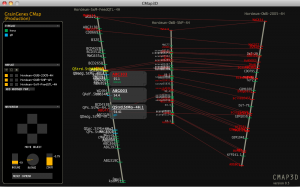

# CMap3D

From GMOD

Jump to: [navigation](#mw-navigation), [search](#p-search)

CMap3D showing GrainGenes

<a href="http://acpfg.imb.uq.edu.au/cmap3d.php" class="external text"
rel="nofollow">CMap3D</a> is a 3D
[visualisation](Visualization "Visualization") tool for
[comparative](Comparative_Genomics "Comparative Genomics") genetic maps
that runs on top of a [CMap](CMap.1 "CMap") database.
[CMap](CMap.1 "CMap"), a [GMOD
component](GMOD_Components "GMOD Components"), is a common tool for the
storage, comparison and visualisation of genetic maps. However, current
map visualisation in [CMap](CMap.1 "CMap") is limited to the comparison
of adjacent aligned maps. CMap3D overcomes this limitation. Multiple
genetic maps can now be compared in three-dimensional space. The CMap3D
visualisation tool is based on a client server model ensuring
operability with current [CMap](CMap.1 "CMap") data repositories.

CMap3D can be applied to any species where genetic map information is
available and enables rapid, direct comparison between multiple aligned
maps.

## Links

- <a href="http://acpfg.imb.uq.edu.au/cmap3d.php" class="external text"
  rel="nofollow">CMap3D page</a> at the
  <a href="http://acpfg.imb.uq.edu.au/" class="external text"
  rel="nofollow">Australian Centre for Plant Functional Genomics
  (ACPFG)</a>, where it was developed
- [Presentation by Chris
  Duran](File:PAG2010CMap3D.pdf "File:PAG2010CMap3D.pdf") at [PAG
  2010](PAG_2010 "PAG 2010") on CMap3D and other tools in *Brassica*
  research.
- <a
  href="http://bioinformatics.oxfordjournals.org/cgi/content/abstract/26/2/273"
  class="external text" rel="nofollow">CMap3D: a 3D visualization tool for
  comparative genetic maps</a>, by Chris Duran, Zoran Boskovic, Michael
  Imelfort, Jacqueline Batley, Nicholas A. Hamilton and David Edwards,
  Bioinformatics 2010 26(2):273-274; doi:10.1093/bioinformatics/btp646

Retrieved from
"<http://gmod.org/mediawiki/index.php?title=CMap3D&oldid=14275>"

[Categories](Special%3ACategories "Special%3ACategories"):

- [CMap](Category%3ACMap "Category%3ACMap")
- [External](Category%3AExternal "Category%3AExternal")

## Navigation menu

### Namespaces

- <a
  href="http://gmod.org/mediawiki/index.php?title=Talk:CMap3D&amp;action=edit&amp;redlink=1"
  accesskey="t"
  title="Discussion about the content page [t]">Discussion</a>

### 

### Variants

### Navigation

- [GMOD Home](Main_Page)
- [Software](GMOD_Components)
- [Categories /
  Tags](Categories)

### Documentation

- [Overview](Overview)
- [FAQs](Category%3AFAQ)
- [HOWTOs](Category%3AHOWTO)
- [Glossary](Glossary)

### Community

- [GMOD News](GMOD_News)
- [Training /
  Outreach](Training_and_Outreach)
- [Support](Support)
- [GMOD Promotion](GMOD_Promotion)
- [Meetings](Meetings)
- [Calendar](Calendar)

### Tools

- <a href="Special%3ABrowse/CMap3D" rel="smw-browse">Browse properties</a>

- Last updated at 22:53 on 23 August
  2010.
<!-- - 32,737 page views. -->
- Content is available under
  <a href="http://www.gnu.org/licenses/fdl-1.3.html" class="external"
  rel="nofollow">a GNU Free Documentation License</a> unless otherwise
  noted.

<!-- -->

- [About
  GMOD](GMOD%3AAbout "GMOD%3AAbout")

<!-- -->

