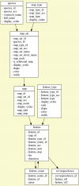
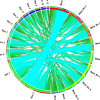

# CMap Version 2 Design

From GMOD

Jump to: [navigation](#mw-navigation), [search](#p-search)

The hopes and dreams for a new generation....

Up to [CMap](CMap.1 "CMap").

## Contents

- [1 User
  Interface](#User_Interface)
- [2
  Schema](#Schema)
- [3
  Visualizations](#Visualizations)
- [4 Data
  Loading](#Data_Loading)
- [5
  DAS](#DAS)

# User Interface

- The new interface will be all Web 2.0 goodness, using tons of
  JavaScript/AJAX/CSS (which I so studiously avoided in early versions)

# Schema

- No more "cmap\_" table prefix
- Move to support only [MySQL](MySQL "MySQL") InnoDB tables to get
  proper foreign keys, not worry about implementing common db functions
  in Perl
- New, slimmer schema
- Eschew evidence table
- In the past, there was a canonical "feature_correspondence" table and
  the "f1-\>f2" correspondence was duplicated into a
  "correspondence_lookup" table where "f1-\>f2" and "f2-\>f1" in order
  to write simple [SQL](Glossary#SQL "Glossary"). The new version will
  remove the lookup table and simply have correspondences be repeated in
  the one table (making them essentially one-way).
- Map and feature types originally existed in the database but were
  moved into configuration files in past versions. They will be restored
  to there previous tables because any mismatch in configuration files
  and incoming data can easily cause data to be quietly ignored,
  creating many headaches for the author. Back in the db, code will be
  able to instantiate the needed types, and SQL will make cleanup of
  types easy.
- Steal the binning idea from
  <a href="http://genome.cshlp.org/content/12/10/1599.full"
  class="external text" rel="nofollow">Gbrowse</a> to speed up feature
  retrieval, group features into chunks for display as
  <a href="http://en.wikipedia.org/wiki/Sparkline" class="external text"
  rel="nofollow">sparklines</a>

# Visualizations

- All output to SVG, convert to other formats as needed
- Each "slot" holding maps in a comparative view will be generated and
  cached individually on server side; they will be assembled into a
  larger SVG container with an additional SVG to show the correspondence
  lines; changes to one slot will necessitate only changes to that image
- It will be possible to pregenerate all initial map views (e.g., whole
  chromosomes) for immediate viewing; other images can be labeled and
  cached as users create views, enabling re-use of images
- <a href="http://mkweb.bcgsc.ca/circos" class="external text"
  rel="nofollow">Circos</a> to be used to generate circular views
- I've written to Dave Edwards and Chris Duran at the Univ. of
  Queensland (Australia) about including their 3-D Java desktop app as a
  server-side tool; no word back
- Investigate
  <a href="http://code.google.com/apis/o3d/" class="external text"
  rel="nofollow">Google's O3D</a>
- Also can investigate using GraphViz, gnuplot and
  <a href="http://pdl.perl.org/" class="external text"
  rel="nofollow">PDL</a> for other presentations

# Data Loading

Write loaders for:

- Tab-delimited
- [GFF](GFF "GFF")
- Ensembl
- Compara
- <a href="Chado" class="mw-redirect" title="Chado">Chado</a>

# DAS

- Will write a module to plug into
  <a href="http://www.sanger.ac.uk/Software/analysis/proserver/"
  class="external text" rel="nofollow">Proserver</a> to create
  <a href="DAS" class="mw-redirect" title="DAS">DAS</a> server to share
  directly from [CMap](CMap.1 "CMap"); docs to explain to users how to
  do this
- As a DAS client to show additional features

Retrieved from
"<http://gmod.org/mediawiki/index.php?title=CMap_Version_2_Design&oldid=8302>"

[Categories](Special:Categories "Special:Categories"):

- [DAS](Category:DAS "Category:DAS")
- [CMap](Category:CMap "Category:CMap")
- [Proposals](Category:Proposals "Category:Proposals")

## Navigation menu

### Namespaces

- <a href="CMap_Version_2_Design" accesskey="c"
  title="View the content page [c]">Page</a>
- <a
  href="http://gmod.org/mediawiki/index.php?title=Talk:CMap_Version_2_Design&amp;action=edit&amp;redlink=1"
  accesskey="t"
  title="Discussion about the content page [t]">Discussion</a>

### 

### Variants

### Navigation

- [GMOD Home](Main_Page)
- [Software](GMOD_Components)
- [Categories /
  Tags](Categories)
- [View all pages](Special:AllPages)

### Documentation

- [Overview](Overview)
- [FAQs](Category:FAQ)
- [HOWTOs](Category:HOWTO)
- [Glossary](Glossary)

### Community

- [GMOD News](GMOD_News)
- [Training /
  Outreach](Training_and_Outreach)
- [Support](Support)
- [GMOD Promotion](GMOD_Promotion)
- [Meetings](Meetings)
- [Calendar](Calendar)

### Tools

- <a href="Special:Browse/CMap_Version_2_Design" rel="smw-browse">Browse
  properties</a>
- [Print as
  PDF](http://gmod.org/mediawiki/index.php?title=Special:PdfPrint&page=CMap_Version_2_Design)

- Last updated at 20:22 on 12 May
  2009.
<!-- - 57,329 page views. -->
- Content is available under
  <a href="http://www.gnu.org/licenses/fdl-1.3.html" class="external"
  rel="nofollow">a GNU Free Documentation License</a> unless otherwise
  noted.

<!-- -->

- [About
  GMOD](GMOD:About "GMOD:About")

<!-- -->

- 

