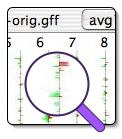

# Caryoscope

From GMOD

Jump to: [navigation](#mw-navigation), [search](#p-search)

Status

- **Mature** release
- **Inactive** development
- **Active** support

Caryoscope is a reusable Java UI component -- and a set of parsing
utilities, command line tools and an application GUI -- for viewing gene
expression data in a whole-genome context.

<a href="http://caryoscope.stanford.edu" class="external text"
rel="nofollow">Caryoscope Homepage</a>

## Contents

- [1
  Status](#Status)
- [2 Demo &
  Screenshots](#Demo_.26_Screenshots)
- [3
  Requirements](#Requirements)
- [4
  Documentation](#Documentation)
- [5
  Publications](#Publications)
- [6
  Contact](#Contact)
- [7
  Downloads](#Downloads)

## Status

Caryoscope is no longer in active development, but the developers
provide user support.

## Demo & Screenshots

<a href="http://caryoscope.stanford.edu/screenshots.html"
class="external text" rel="nofollow">Screenshots</a>

  

## Requirements

<a href="http://caryoscope.stanford.edu/dependencies.html"
class="external text" rel="nofollow">Dependencies page</a>

  

## Documentation

<a href="http://caryoscope.stanford.edu/documentation.html"
class="external text" rel="nofollow">Documentation page</a>

## Publications

<a href="http://www.biomedcentral.com/1471-2105/5/151"
class="external text" rel="nofollow">Awad IA, Rees CA,
Hernandez-Boussard T, Ball CA, Sherlock G. (2004). Caryoscope: an Open
Source Java application for viewing microarray data in a genomic
context. <em>BMC Bioinformatics</em> <strong>5</strong>:151.</a>

## Contact

<a href="mailto:sherlock@genome.stanford.edu" class="external text"
rel="nofollow">Gavin Sherlock</a>, Stanford University.

## Downloads

<a href="http://caryoscope.stanford.edu/getting.html"
class="external text" rel="nofollow">Download page</a>

Retrieved from
"<http://gmod.org/mediawiki/index.php?title=Caryoscope&oldid=21862>"

[Categories](Special:Categories "Special:Categories"):

- [Expression](Category:Expression "Category:Expression")
- [GMOD Components](Category:GMOD_Components "Category:GMOD Components")
- [Java](Category:Java "Category:Java")
- [Microarrays](Category:Microarrays "Category:Microarrays")

## Navigation menu

### Namespaces

- <a href="Caryoscope" accesskey="c"
  title="View the content page [c]">Page</a>
- <a
  href="http://gmod.org/mediawiki/index.php?title=Talk:Caryoscope&amp;action=edit&amp;redlink=1"
  accesskey="t"
  title="Discussion about the content page [t]">Discussion</a>

### 

### Variants

### Navigation

- [GMOD Home](Main_Page)
- [Software](GMOD_Components)
- [Categories /
  Tags](Categories)
- [View all pages](Special:AllPages)

### Documentation

- [Overview](Overview)
- [FAQs](Category:FAQ)
- [HOWTOs](Category:HOWTO)
- [Glossary](Glossary)

### Community

- [GMOD News](GMOD_News)
- [Training /
  Outreach](Training_and_Outreach)
- [Support](Support)
- [GMOD Promotion](GMOD_Promotion)
- [Meetings](Meetings)
- [Calendar](Calendar)

### Tools

- <a href="Special:Browse/Caryoscope" rel="smw-browse">Browse
  properties</a>

- Last updated at 17:33 on 3 October
  2012.
<!-- - 74,588 page views. -->
- Content is available under
  <a href="http://www.gnu.org/licenses/fdl-1.3.html" class="external"
  rel="nofollow">a GNU Free Documentation License</a> unless otherwise
  noted.

<!-- -->

- [About
  GMOD](GMOD:About "GMOD:About")

<!-- -->

