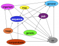
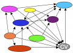

# Category%3AChado Modules

From GMOD

Jump to: [navigation](#mw-navigation), [search](#p-search)

## Pages in category "Chado Modules"

The following 30 pages are in this category, out of 30 total.

<table style="width: 100%;">
<colgroup>
<col style="width: 33%" />
<col style="width: 33%" />
<col style="width: 33%" />
</colgroup>
<tbody>
<tr class="odd" style="vertical-align: top;">
<td style="width: 33.3%"><h3 id="c">C</h3>
<ul>
<li><a href="Chado_-_Getting_Started"
title="Chado - Getting Started">Chado - Getting Started</a></li>
<li><a href="Chado_Audit_Module" title="Chado Audit Module">Chado Audit
Module</a></li>
<li><a href="Chado_Cell_Line_Module"
title="Chado Cell Line Module">Chado Cell Line Module</a></li>
<li><a href="Chado_Companalysis_Module"
title="Chado Companalysis Module">Chado Companalysis Module</a></li>
<li><a href="Chado_Contact_Module" title="Chado Contact Module">Chado
Contact Module</a></li>
<li><a href="Chado_CV_Module" title="Chado CV Module">Chado CV
Module</a></li>
<li><a href="Chado_Expression_Module"
title="Chado Expression Module">Chado Expression Module</a></li>
<li><a href="Chado_General_Module" title="Chado General Module">Chado
General Module</a></li>
<li><a href="Chado_Genetic_Module" title="Chado Genetic Module">Chado
Genetic Module</a></li>
<li><a href="Chado_Group_Module" title="Chado Group Module">Chado Group
Module</a></li>
</ul></td>
<td style="width: 33.3%"><h3 id="c-cont.">C cont.</h3>
<ul>
<li><a href="Chado_Library_Module" title="Chado Library Module">Chado
Library Module</a></li>
<li><a href="Chado_Mage_Module" title="Chado Mage Module">Chado Mage
Module</a></li>
<li><a href="Chado_Manual" title="Chado Manual">Chado Manual</a></li>
<li><a href="Chado_Map_Module" title="Chado Map Module">Chado Map
Module</a></li>
<li><a href="Chado_Modules" title="Chado Modules">Chado Modules</a></li>
<li><a href="Chado_Natural_Diversity_Module.1"
title="Chado Natural Diversity Module">Chado Natural Diversity
Module</a></li>
<li><a href="Chado_Natural_Diversity_Module_Working_Group"
title="Chado Natural Diversity Module Working Group">Chado Natural
Diversity Module Working Group</a></li>
<li><a href="Chado_Natural_Diversity_Module/natdiv_schema_changes_call"
title="Chado Natural Diversity Module/natdiv schema changes call">Chado
Natural Diversity Module/natdiv schema changes call</a></li>
<li><a href="Chado_Organism_Module" title="Chado Organism Module">Chado
Organism Module</a></li>
<li><a href="Chado_Phylogeny_Module"
title="Chado Phylogeny Module">Chado Phylogeny Module</a></li>
</ul></td>
<td style="width: 33.3%"><h3 id="c-cont.-1">C cont.</h3>
<ul>
<li><a href="Chado_Publication_Module"
title="Chado Publication Module">Chado Publication Module</a></li>
<li><a href="Chado_Schema_Documentation_HOWTO"
title="Chado Schema Documentation HOWTO">Chado Schema Documentation
HOWTO</a></li>
<li><a href="Chado_Sequence_Module" title="Chado Sequence Module">Chado
Sequence Module</a></li>
<li><a href="Chado_Stock_Module" title="Chado Stock Module">Chado Stock
Module</a></li>
<li><a href="Chado_WWW_Module" title="Chado WWW Module">Chado WWW
Module</a></li>
<li><a href="Template:ChadoModules"
title="Template:ChadoModules">Template:ChadoModules</a></li>
<li><a href="Community" title="Community">Community</a></li>
</ul>
<h3 id="i">I</h3>
<ul>
<li><a href="Introduction_to_Chado"
title="Introduction to Chado">Introduction to Chado</a></li>
</ul>
<h3 id="m">M</h3>
<ul>
<li><a href="Mage_FAQ" title="Mage FAQ">Mage FAQ</a></li>
</ul>
<h3 id="o">O</h3>
<ul>
<li><a href="Overview" title="Overview">Overview</a></li>
</ul></td>
</tr>
</tbody>
</table>

## Media in category "Chado Modules"

The following 5 files are in this category, out of 5 total.

- 

  

  

  

  

  

  

  [Chado pub.ppt](File:Chado_pub.ppt "File:Chado pub.ppt")  
  45 KB  

  

  

- 

  

  

  

  

  

  

  [ChadoModules.png](File:ChadoModules.png "File:ChadoModules.png")  
  71 KB  

  

  

- 

  

  

  

  

  

  

  [ChadoModules.ppt](File:ChadoModules.ppt "File:ChadoModules.ppt")  
  60 KB  

  

  

- 

  

  

  

  

  

  

  [ChadoModulesCV.png](File:ChadoModulesCV.png "File:ChadoModulesCV.png")  
  69 KB  

  

  

- 

  

  

  

  

  

  

  [Emmert 040526.pdf](File:Emmert_040526.pdf "File:Emmert 040526.pdf")  
  213 KB  

  

  

Retrieved from
"<http://gmod.org/mediawiki/index.php?title=Category%3AChado_Modules&oldid=4255>"

[Category](Special%3ACategories "Special%3ACategories"):

- [Chado](Category%3AChado "Category%3AChado")

## Navigation menu

### Namespaces

- <a href="Category%3AChado_Modules" accesskey="c"
  title="View the category page [c]">Category</a>
- <a
  href="http://gmod.org/mediawiki/index.php?title=Category_talk:Chado_Modules&amp;action=edit&amp;redlink=1"
  accesskey="t"
  title="Discussion about the content page [t]">Discussion</a>

### 

### Variants

### Navigation

- [GMOD Home](Main_Page)
- [Software](GMOD_Components)
- [Categories /
  Tags](Categories)

### Documentation

- [Overview](Overview)
- [FAQs](Category%3AFAQ)
- [HOWTOs](Category%3AHOWTO)
- [Glossary](Glossary)

### Community

- [GMOD News](GMOD_News)
- [Training /
  Outreach](Training_and_Outreach)
- [Support](Support)
- [GMOD Promotion](GMOD_Promotion)
- [Meetings](Meetings)
- [Calendar](Calendar)

### Tools

- <a href="Special%3ABrowse/Category%3AChado_Modules" rel="smw-browse">Browse
  properties</a>

- Last updated at 22:29 on 25 January
  2008.
<!-- - 20,877 page views. -->
- Content is available under
  <a href="http://www.gnu.org/licenses/fdl-1.3.html" class="external"
  rel="nofollow">a GNU Free Documentation License</a> unless otherwise
  noted.

<!-- -->

- [About
  GMOD](GMOD:About "GMOD:About")

<!-- -->

