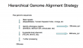

# Category%3AGBrowse syn

From GMOD

Jump to: [navigation](#mw-navigation), [search](#p-search)

## Subcategories

This category has only the following subcategory.

### T

- [Tutorials](Category%3ATutorials "Category%3ATutorials")

## Pages in category "GBrowse syn"

The following 19 pages are in this category, out of 19 total.

<table style="width: 100%;">
<colgroup>
<col style="width: 33%" />
<col style="width: 33%" />
<col style="width: 33%" />
</colgroup>
<tbody>
<tr class="odd" style="vertical-align: top;">
<td style="width: 33.3%"><h3 id="a">A</h3>
<ul>
<li><a href="August_2009_GMOD_Meeting"
title="August 2009 GMOD Meeting">August 2009 GMOD Meeting</a></li>
</ul>
<h3 id="c">C</h3>
<ul>
<li><a href="C_briggsae.syn" title="C briggsae.syn">C
briggsae.syn</a></li>
</ul>
<h3 id="g">G</h3>
<ul>
<li><a href="GBrowse_syn.1" title="GBrowse syn">GBrowse syn</a></li>
<li><a href="GBrowse_syn_AGS_Tutorial"
title="GBrowse syn AGS Tutorial">GBrowse syn AGS Tutorial</a></li>
<li><a href="GBrowse_syn_Configuration"
title="GBrowse syn Configuration">GBrowse syn Configuration</a></li>
<li><a href="GBrowse_syn_Database" title="GBrowse syn Database">GBrowse
syn Database</a></li>
<li><a href="GBrowse_syn_Help" title="GBrowse syn Help">GBrowse syn
Help</a></li>
</ul></td>
<td style="width: 33.3%"><h3 id="g-cont.">G cont.</h3>
<ul>
<li><a href="GBrowse_syn_PAG_2009_Workshop"
title="GBrowse syn PAG 2009 Workshop">GBrowse syn PAG 2009
Workshop</a></li>
<li><a href="GBrowse_syn_Scripts" title="GBrowse syn Scripts">GBrowse
syn Scripts</a></li>
<li><a href="GBrowse_syn_Tutorial"
class="mw-redirect" title="GBrowse syn Tutorial">GBrowse syn
Tutorial</a></li>
<li><a href="GBrowse_syn_Tutorial_2010"
title="GBrowse syn Tutorial 2010">GBrowse syn Tutorial 2010</a></li>
<li><a href="GBrowse_syn_Tutorial_2011"
title="GBrowse syn Tutorial 2011">GBrowse syn Tutorial 2011</a></li>
<li><a href="GBrowse_syn_Tutorial_2012"
title="GBrowse syn Tutorial 2012">GBrowse syn Tutorial 2012</a></li>
<li><a href="GBrowse_syn_Tutorial_new"
title="GBrowse syn Tutorial new">GBrowse syn Tutorial new</a></li>
</ul></td>
<td style="width: 33.3%"><h3 id="g-cont.-1">G cont.</h3>
<ul>
<li><a href="GBrowse_syn/tool_data"
title="GBrowse syn/tool data">GBrowse syn/tool data</a></li>
<li><a href="GMOD_Online_Training_2014/GBrowse_syn_Tutorial"
title="GMOD Online Training 2014/GBrowse syn Tutorial">GMOD Online
Training 2014/GBrowse syn Tutorial</a></li>
</ul>
<h3 id="n">N</h3>
<ul>
<li><a href="November_2007_GMOD_Meeting"
title="November 2007 GMOD Meeting">November 2007 GMOD Meeting</a></li>
</ul>
<h3 id="t-1">T</h3>
<ul>
<li><a href="Training_and_Outreach"
title="Training and Outreach">Training and Outreach</a></li>
<li><a href="Template:TutorialList"
title="Template:TutorialList">Template:TutorialList</a></li>
</ul></td>
</tr>
</tbody>
</table>

## Media in category "GBrowse syn"

The following 9 files are in this category, out of 9 total.

- 

  

  

  

  

  

  

  [Aug2009GBrowse
  syn.pdf](File:Aug2009GBrowse_syn.pdf "File:Aug2009GBrowse syn.pdf")  
  2.91 MB  

  

  

- 

  

  

  

  

  

  

  [Cain GI
  poster.pdf](File:Cain_GI_poster.pdf "File:Cain GI poster.pdf")  
  522 KB  

  

  

- 

  

  

  

  

  

  

  [GBrowse syn
  logo.png](File:GBrowse_syn_logo.png "File:GBrowse syn logo.png")  
  113 KB  

  

  

- 

  

  

  

  

  

  

  [Gbrowse syn.pdf](File:Gbrowse_syn.pdf "File:Gbrowse syn.pdf")  
  2.05 MB  

  

  

- 

  

  

  

  

  

  

  [GBrowse
  synSMBE2009.pdf](File:GBrowse_synSMBE2009.pdf "File:GBrowse synSMBE2009.pdf")  
  5 MB  

  

  

- 

  

  

  

  

  

  

  [GBS PAG10.pdf](File:GBS_PAG10.pdf "File:GBS PAG10.pdf")  
  5.01 MB  

  

  

- 

  

  

  

  

  

  

  [GMODToolsForComparativ...](File:GMODToolsForComparativeGenomicsIGERTPoster.pdf "File:GMODToolsForComparativeGenomicsIGERTPoster.pdf")  
  714 KB  

  

  

- 

  

  

  

  

  

  

  [WGA data.png](File:WGA_data.png "File:WGA data.png")  
  86 KB  

  

  

- 

  

  

  

  

  

  

  [ISyIPGMODforComparativ...](File:ISyIPGMODforComparativeGenomics.pdf "File:ISyIPGMODforComparativeGenomics.pdf")  
  14.44 MB  

  

  

Retrieved from
"<http://gmod.org/mediawiki/index.php?title=Category%3AGBrowse_syn&oldid=5208>"

[Categories](Special%3ACategories "Special%3ACategories"):

- [GBrowse](Category%3AGBrowse "Category%3AGBrowse")
- [Comparative
  Genomics](Category%3AComparative_Genomics "Category%3AComparative Genomics")

## Navigation menu

### Namespaces

- <a href="Category%3AGBrowse_syn" accesskey="c"
  title="View the category page [c]">Category</a>
- <a
  href="http://gmod.org/mediawiki/index.php?title=Category_talk:GBrowse_syn&amp;action=edit&amp;redlink=1"
  accesskey="t"
  title="Discussion about the content page [t]">Discussion</a>

### 

### Variants

### Navigation

- [GMOD Home](Main_Page)
- [Software](GMOD_Components)
- [Categories /
  Tags](Categories)

### Documentation

- [Overview](Overview)
- [FAQs](Category%3AFAQ)
- [HOWTOs](Category%3AHOWTO)
- [Glossary](Glossary)

### Community

- [GMOD News](GMOD_News)
- [Training /
  Outreach](Training_and_Outreach)
- [Support](Support)
- [GMOD Promotion](GMOD_Promotion)
- [Meetings](Meetings)
- [Calendar](Calendar)

### Tools

- <a href="Special%3ABrowse/Category%3AGBrowse_syn" rel="smw-browse">Browse
  properties</a>

- Last updated at 19:59 on 12 April
  2008.
<!-- - 19,011 page views. -->
- Content is available under
  <a href="http://www.gnu.org/licenses/fdl-1.3.html" class="external"
  rel="nofollow">a GNU Free Documentation License</a> unless otherwise
  noted.

<!-- -->

- [About
  GMOD](GMOD:About "GMOD:About")

<!-- -->

