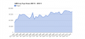

# Category%3AGMOD Project

From GMOD

Jump to: [navigation](#mw-navigation), [search](#p-search)

Pages about the GMOD project itself. These can be overviews, or about
project architecture and direction, or project status.

## Subcategories

This category has the following 5 subcategories, out of 5 total.

### G

- [GMOD Community](Category%3AGMOD_Community "Category%3AGMOD Community")
- [GMOD Developers](Category%3AGMOD_Developers "Category%3AGMOD Developers")
- [GMOD Project
  Presentations](Category%3AGMOD_Project_Presentations "Category%3AGMOD Project Presentations")
- [GMOD Web Site](Category%3AGMOD_Web_Site "Category%3AGMOD Web Site")

### M

- [Meetings](Category%3AMeetings "Category%3AMeetings")

## Pages in category "GMOD Project"

The following 8 pages are in this category, out of 8 total.

<table style="width: 100%;">
<colgroup>
<col style="width: 33%" />
<col style="width: 33%" />
<col style="width: 33%" />
</colgroup>
<tbody>
<tr class="odd" style="vertical-align: top;">
<td style="width: 33.3%"><h3 id="section">2</h3>
<ul>
<li><a href="2008_GMOD_Community_Survey"
title="2008 GMOD Community Survey">2008 GMOD Community Survey</a></li>
<li><a href="2009_GMOD_Community_Survey"
title="2009 GMOD Community Survey">2009 GMOD Community Survey</a></li>
</ul>
<h3 id="c">C</h3>
<ul>
<li><a href="Calendar" title="Calendar">Calendar</a></li>
</ul></td>
<td style="width: 33.3%"><h3 id="f">F</h3>
<ul>
<li><a href="Five_year_plan" title="Five year plan">Five year
plan</a></li>
</ul>
<h3 id="g-1">G</h3>
<ul>
<li><a href="GMOD_Promotion" title="GMOD Promotion">GMOD
Promotion</a></li>
</ul>
<h3 id="j">J</h3>
<ul>
<li><a href="January_2009_GMOD_Meeting"
title="January 2009 GMOD Meeting">January 2009 GMOD Meeting</a></li>
</ul></td>
<td style="width: 33.3%"><h3 id="p">P</h3>
<ul>
<li><a href="Powered_by_GMOD" title="Powered by GMOD">Powered by
GMOD</a></li>
<li><a href="Project_Statistics" title="Project Statistics">Project
Statistics</a></li>
</ul></td>
</tr>
</tbody>
</table>

## Media in category "GMOD Project"

The following 9 files are in this category, out of 9 total.

- 

  

  

  

  

  

  

  [Gmod
  cogTransparent.png](File:Gmod_cogTransparent.png "File:Gmod cogTransparent.png")  
  273 KB  

  

  

- 

  

  

  

  

  

  

  [GMOD.orgMonthlyHitsCha...](File:GMOD.orgMonthlyHitsChart.png "File:GMOD.orgMonthlyHitsChart.png")  
  15 KB  

  

  

- 

  

  

  

  

  

  

  [BoG2006.pdf](File:BoG2006.pdf "File:BoG2006.pdf")  
  575 KB  

  

  

- 

  

  

  

  

  

  

  [Day-050517.ppt](File:Day-050517.ppt "File:Day-050517.ppt")  
  253 KB  

  

  

- 

  

  

  

  

  

  

  [GMOD
  Architecture.ppt](File:GMOD_Architecture.ppt "File:GMOD Architecture.ppt")  
  116 KB  

  

  

- 

  

  

  

  

  

  

  [GMOD.orgMonthlyPageVie...](File:GMOD.orgMonthlyPageViewsChart.png "File:GMOD.orgMonthlyPageViewsChart.png")  
  16 KB  

  

  

- 

  

  

  

  

  

  

  [GMOD.orgMonthlyVisitor...](File:GMOD.orgMonthlyVisitorsChart.png "File:GMOD.orgMonthlyVisitorsChart.png")  
  18 KB  

  

  

- 

  

  

  

  

  

  

  [GMODTrifoldBrochure200...](File:GMODTrifoldBrochure2009.ppt "File:GMODTrifoldBrochure2009.ppt")  
  2.72 MB  

  

  

- 

  

  

  

  

  

  

  [TShirtThumb.jpg](File:TShirtThumb.jpg "File:TShirtThumb.jpg")  
  5 KB  

  

  

Retrieved from
"<http://gmod.org/mediawiki/index.php?title=Category%3AGMOD_Project&oldid=4971>"

[Category](Special:Categories "Special:Categories"):

- [Categories](Category%3ACategories "Category%3ACategories")

## Navigation menu

### Namespaces

- <a href="Category%3AGMOD_Project" accesskey="c"
  title="View the category page [c]">Category</a>
- <a
  href="http://gmod.org/mediawiki/index.php?title=Category_talk:GMOD_Project&amp;action=edit&amp;redlink=1"
  accesskey="t"
  title="Discussion about the content page [t]">Discussion</a>

### 

### Variants

### Navigation

- [GMOD Home](Main_Page)
- [Software](GMOD_Components)
- [Categories /
  Tags](Categories)

### Documentation

- [Overview](Overview)
- [FAQs](Category%3AFAQ)
- [HOWTOs](Category%3AHOWTO)
- [Glossary](Glossary)

### Community

- [GMOD News](GMOD_News)
- [Training /
  Outreach](Training_and_Outreach)
- [Support](Support)
- [GMOD Promotion](GMOD_Promotion)
- [Meetings](Meetings)
- [Calendar](Calendar)

### Tools

- <a href="Special%3ABrowse/Category%3AGMOD_Project" rel="smw-browse">Browse
  properties</a>

- Last updated at 20:51 on 11 March
  2008.
<!-- - 17,019 page views. -->
- Content is available under
  <a href="http://www.gnu.org/licenses/fdl-1.3.html" class="external"
  rel="nofollow">a GNU Free Documentation License</a> unless otherwise
  noted.

<!-- -->

- [About
  GMOD](GMOD:About "GMOD:About")

<!-- -->

