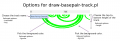
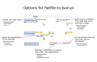
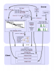
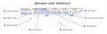

# Category:JBrowse

From GMOD

Jump to: [navigation](#mw-navigation), [search](#p-search)

## Subcategories

This category has only the following subcategory.

### T

- [Tutorials](Category:Tutorials "Category:Tutorials")

## Pages in category "JBrowse"

The following 44 pages are in this category, out of 44 total.

<table style="width: 100%;">
<colgroup>
<col style="width: 33%" />
<col style="width: 33%" />
<col style="width: 33%" />
</colgroup>
<tbody>
<tr class="odd" style="vertical-align: top;">
<td style="width: 33.3%"><h3 id="a">A</h3>
<ul>
<li><a href="ABRF2010_Workshop" title="ABRF2010 Workshop">ABRF2010
Workshop</a></li>
<li><a href="August_2009_GMOD_Meeting"
title="August 2009 GMOD Meeting">August 2009 GMOD Meeting</a></li>
</ul>
<h3 id="b">B</h3>
<ul>
<li><a
href="BrowseDev/Using_a_Database_With_JBrowse" class="mw-redirect"
title="BrowseDev/Using a Database With JBrowse">BrowseDev/Using a
Database With JBrowse</a></li>
</ul>
<h3 id="d">D</h3>
<ul>
<li><a href="Downloads" title="Downloads">Downloads</a></li>
</ul>
<h3 id="g">G</h3>
<ul>
<li><a href="GMOD_Malaysia_2014/JBrowse_Tutorial"
title="GMOD Malaysia 2014/JBrowse Tutorial">GMOD Malaysia 2014/JBrowse
Tutorial</a></li>
<li><a href="GSoC" title="GSoC">GSoC</a></li>
</ul>
<h3 id="j">J</h3>
<ul>
<li><a href="January_2009_GMOD_Meeting"
title="January 2009 GMOD Meeting">January 2009 GMOD Meeting</a></li>
<li><a href="JBrowse.1" title="JBrowse">JBrowse</a></li>
<li><a href="JBrowse_Configuration_Guide"
title="JBrowse Configuration Guide">JBrowse Configuration Guide</a></li>
<li><a href="JBrowse_PSB_2020" title="JBrowse PSB 2020">JBrowse PSB
2020</a></li>
<li><a href="JBrowse_Tutorial"
class="mw-redirect" title="JBrowse Tutorial">JBrowse
Tutorial</a></li>
<li><a href="JBrowse_Tutorial_2010"
title="JBrowse Tutorial 2010">JBrowse Tutorial 2010</a></li>
<li><a href="JBrowse_Tutorial_2011"
title="JBrowse Tutorial 2011">JBrowse Tutorial 2011</a></li>
<li><a href="JBrowse_Tutorial_2012"
class="mw-redirect" title="JBrowse Tutorial 2012">JBrowse Tutorial
2012</a></li>
<li><a href="JBrowse_Tutorial_2013"
title="JBrowse Tutorial 2013">JBrowse Tutorial 2013</a></li>
</ul></td>
<td style="width: 33.3%"><h3 id="j-cont.">J cont.</h3>
<ul>
<li><a href="JBrowse_Tutorial_PAG_2015"
title="JBrowse Tutorial PAG 2015">JBrowse Tutorial PAG 2015</a></li>
<li><a href="JBrowse_Tutorial_PAG_2018"
title="JBrowse Tutorial PAG 2018">JBrowse Tutorial PAG 2018</a></li>
<li><a href="JBrowse_Tutorial_Programming_for_Biology_2014"
title="JBrowse Tutorial Programming for Biology 2014">JBrowse Tutorial
Programming for Biology 2014</a></li>
<li><a href="JBrowse/tool_data" title="JBrowse/tool data">JBrowse/tool
data</a></li>
<li><a href="JBrowse2_Tutorial_PAG_2023"
title="JBrowse2 Tutorial PAG 2023">JBrowse2 Tutorial PAG 2023</a></li>
<li><a href="JBrowseDev/Current"
class="mw-redirect"
title="JBrowseDev/Current">JBrowseDev/Current</a></li>
<li><a href="JBrowseDev/Installation"
class="mw-redirect"
title="JBrowseDev/Installation">JBrowseDev/Installation</a></li>
<li><a href="JBrowseDev/Main"
class="mw-redirect"
title="JBrowseDev/Main">JBrowseDev/Main</a></li>
<li><a href="JBrowseDev/The_ClientConfig_Option"
title="JBrowseDev/The ClientConfig Option">JBrowseDev/The ClientConfig
Option</a></li>
<li><a href="JBrowseDev/The_CssClass_Option"
title="JBrowseDev/The CssClass Option">JBrowseDev/The CssClass
Option</a></li>
<li><a href="JBrowseDev/The_ExtraData_Option"
title="JBrowseDev/The ExtraData Option">JBrowseDev/The ExtraData
Option</a></li>
<li><a href="JBrowseDev/The_SubfeatureClasses_Option"
title="JBrowseDev/The SubfeatureClasses Option">JBrowseDev/The
SubfeatureClasses Option</a></li>
<li><a href="JBrowseDev/The_UrlTemplate_Option"
title="JBrowseDev/The UrlTemplate Option">JBrowseDev/The UrlTemplate
Option</a></li>
<li><a href="JBrowseDev/Upcoming"
class="mw-redirect"
title="JBrowseDev/Upcoming">JBrowseDev/Upcoming</a></li>
<li><a href="July_2008_GMOD_Meeting" title="July 2008 GMOD Meeting">July
2008 GMOD Meeting</a></li>
</ul></td>
<td style="width: 33.3%"><h3 id="m">M</h3>
<ul>
<li><a href="Migrating_from_GBrowse_to_JBrowse"
title="Migrating from GBrowse to JBrowse">Migrating from GBrowse to
JBrowse</a></li>
<li><a href="User:MitchSkinner"
title="User:MitchSkinner">User:MitchSkinner</a></li>
</ul>
<h3 id="n">N</h3>
<ul>
<li><a href="News/Feedback_Wanted:_JBrowse_UI_Redesign"
title="News/Feedback Wanted: JBrowse UI Redesign">News/Feedback Wanted:
JBrowse UI Redesign</a></li>
<li><a href="News/JBrowse_1.7.0_Released"
title="News/JBrowse 1.7.0 Released">News/JBrowse 1.7.0 Released</a></li>
<li><a href="November_2007_GMOD_Meeting"
title="November 2007 GMOD Meeting">November 2007 GMOD Meeting</a></li>
</ul>
<h3 id="r">R</h3>
<ul>
<li><a href="Reproducing_gbrowse_img_functinality_with_JBrowse"
title="Reproducing gbrowse img functinality with JBrowse">Reproducing
gbrowse img functinality with JBrowse</a></li>
<li><a href="User:RobertBuels"
title="User:RobertBuels">User:RobertBuels</a></li>
<li><a href="User:RSCummings"
title="User:RSCummings">User:RSCummings</a></li>
</ul>
<h3 id="s">S</h3>
<ul>
<li><a href="September_2010_GMOD_Meeting"
title="September 2010 GMOD Meeting">September 2010 GMOD Meeting</a></li>
</ul>
<h3 id="t-1">T</h3>
<ul>
<li><a href="Training_and_Outreach"
title="Training and Outreach">Training and Outreach</a></li>
<li><a href="Template:TutorialList"
title="Template:TutorialList">Template:TutorialList</a></li>
</ul>
<h3 id="u">U</h3>
<ul>
<li><a
href="Using_Existing_Databases_With_JBrowse" class="mw-redirect"
title="Using Existing Databases With JBrowse">Using Existing Databases
With JBrowse</a></li>
</ul>
<h3 id="w">W</h3>
<ul>
<li><a href="Web-apollo-meeting-2011-1-6"
title="Web-apollo-meeting-2011-1-6">Web-apollo-meeting-2011-1-6</a></li>
<li><a href="Web-apollo-meeting-2011-3-21"
title="Web-apollo-meeting-2011-3-21">Web-apollo-meeting-2011-3-21</a></li>
</ul></td>
</tr>
</tbody>
</table>

## Media in category "JBrowse"

The following 12 files are in this category, out of 12 total.

- 

  

  

  

  

  

  

  [Basepair-options.png](File:Basepair-options.png "File:Basepair-options.png")  
  32 KB  

  

  

- 

  

  

  

  

  

  

  [Flatfile-options.png](File:Flatfile-options.png "File:Flatfile-options.png")  
  60 KB  

  

  

- 

  

  

  

  

  

  

  [HelpDeskSept2010.pdf](File:HelpDeskSept2010.pdf "File:HelpDeskSept2010.pdf")  
  10.54 MB  

  

  

- 

  

  

  

  

  

  

  [Aug2009JBrowse.pdf](File:Aug2009JBrowse.pdf "File:Aug2009JBrowse.pdf")  
  823 KB  

  

  

- 

  

  

  

  

  

  

  [GBrowse3GMOD2008.pdf](File:GBrowse3GMOD2008.pdf "File:GBrowse3GMOD2008.pdf")  
  194 KB  

  

  

- 

  

  

  

  

  

  

  [GMODCourse2010-JBrowse...](File:GMODCourse2010-JBrowseIntro.pdf "File:GMODCourse2010-JBrowseIntro.pdf")  
  507 KB  

  

  

- 

  

  

  

  

  

  

  [Jan2009JBrowse.pdf](File:Jan2009JBrowse.pdf "File:Jan2009JBrowse.pdf")  
  354 KB  

  

  

- 

  

  

  

  

  

  

  [Jbrowse arch.png](File:Jbrowse_arch.png "File:Jbrowse arch.png")  
  99 KB  

  

  

- 

  

  

  

  

  

  

  [PAG2010JBrowse.pdf](File:PAG2010JBrowse.pdf "File:PAG2010JBrowse.pdf")  
  270 KB  

  

  

- 

  

  

  

  

  

  

  [JBrowse PAG
  2017.pdf](File:JBrowse_PAG_2017.pdf "File:JBrowse PAG 2017.pdf")  
  2.4 MB  

  

  

- 

  

  

  

  

  

  

  [JBrowseUI.png](File:JBrowseUI.png "File:JBrowseUI.png")  
  41 KB  

  

  

- 

  

  

  

  

  

  

  [Wiggle-options.png](File:Wiggle-options.png "File:Wiggle-options.png")  
  37 KB  

  

  

Retrieved from
"<http://gmod.org/mediawiki/index.php?title=Category:JBrowse&oldid=9206>"

[Category](Special:Categories "Special:Categories"):

- [GMOD Components](Category:GMOD_Components "Category:GMOD Components")

## Navigation menu

### Namespaces

- <a href="Category:JBrowse" accesskey="c"
  title="View the category page [c]">Category</a>
- <a
  href="http://gmod.org/mediawiki/index.php?title=Category_talk:JBrowse&amp;action=edit&amp;redlink=1"
  accesskey="t"
  title="Discussion about the content page [t]">Discussion</a>

### 

### Variants

### Navigation

- [GMOD Home](Main_Page)
- [Software](GMOD_Components)
- [Categories /
  Tags](Categories)
- [View all pages](Special:AllPages)

### Documentation

- [Overview](Overview)
- [FAQs](Category:FAQ)
- [HOWTOs](Category:HOWTO)
- [Glossary](Glossary)

### Community

- [GMOD News](GMOD_News)
- [Training /
  Outreach](Training_and_Outreach)
- [Support](Support)
- [GMOD Promotion](GMOD_Promotion)
- [Meetings](Meetings)
- [Calendar](Calendar)

### Tools

- <a href="Special:Browse/Category:JBrowse" rel="smw-browse">Browse
  properties</a>

- Last updated at 05:26 on 30 August
  2009.
<!-- - 16,447 page views. -->
- Content is available under
  <a href="http://www.gnu.org/licenses/fdl-1.3.html" class="external"
  rel="nofollow">a GNU Free Documentation License</a> unless otherwise
  noted.

<!-- -->

- [About
  GMOD](GMOD:About "GMOD:About")

<!-- -->

- 

