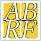
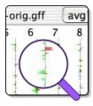
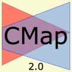
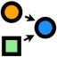
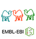
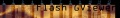

# Category:Logos and Icons

From GMOD

Jump to: [navigation](#mw-navigation), [search](#p-search)

Logos and icons for use in this web site.

## Subcategories

This category has the following 2 subcategories, out of 2 total.

### G

- [GMOD Project
  Logos](Category:GMOD_Project_Logos "Category:GMOD Project Logos")

### M

- [Member Logos](Category:Member_Logos "Category:Member Logos")

## Pages in category "Logos and Icons"

The following 3 pages are in this category, out of 3 total.

### G

- [GMOD Logo Program](GMOD_Logo_Program "GMOD Logo Program")
- [Template:GMOD logos](Template:GMOD_logos "Template:GMOD logos")

### S

- [Spring 2010 Logo
  Program](Spring_2010_Logo_Program "Spring 2010 Logo Program")

## Media in category "Logos and Icons"

The following 101 files are in this category, out of 101 total.

- 

  

  

  

  

  

  

  [GAW2014Logo.png](File:GAW2014Logo.png "File:GAW2014Logo.png")  
  167 KB  

  

  

- 

  

  

  

  

  

  

  [GCC2012Logo.png](File:GCC2012Logo.png "File:GCC2012Logo.png")  
  1.67 MB  

  

  

- 

  

  

  

  

  

  

  [GCC2012TrainingDayLogo...](File:GCC2012TrainingDayLogo.png "File:GCC2012TrainingDayLogo.png")  
  16 KB  

  

  

- 

  

  

  

  

  

  

  [GCC2013Logo.png](File:GCC2013Logo.png "File:GCC2013Logo.png")  
  207 KB  

  

  

- 

  

  

  

  

  

  

  [GCC2013TrainingDayLogo...](File:GCC2013TrainingDayLogo.png "File:GCC2013TrainingDayLogo.png")  
  142 KB  

  

  

- 

  

  

  

  

  

  

  [GCC2014Logo.png](File:GCC2014Logo.png "File:GCC2014Logo.png")  
  19 KB  

  

  

- 

  

  

  

  

  

  

  [GCC2014TDLogo.png](File:GCC2014TDLogo.png "File:GCC2014TDLogo.png")  
  47 KB  

  

  

- 

  

  

  

  

  

  

  [GCC2016Logo.png](File:GCC2016Logo.png "File:GCC2016Logo.png")  
  19 KB  

  

  

- 

  

  

  

  

  

  

  [GigaScienceLogo250.png](File:GigaScienceLogo250.png "File:GigaScienceLogo250.png")  
  9 KB  

  

  

- 

  

  

  

  

  

  

  [Gmod
  cogTransparent.png](File:Gmod_cogTransparent.png "File:Gmod cogTransparent.png")  
  273 KB  

  

  

- 

  

  

  

  

  

  

  [GMOD-three-cogs.jpg](File:GMOD-three-cogs.jpg "File:GMOD-three-cogs.jpg")  
  182 KB  

  

  

- 

  

  

  

  

  

  

  [GMOD-three-cogs.png](File:GMOD-three-cogs.png "File:GMOD-three-cogs.png")  
  304 KB  

  

  

- 

  

  

  

  

  

  

  [ABRF2011Logo.png](File:ABRF2011Logo.png "File:ABRF2011Logo.png")  
  93 KB  

  

  

- 

  

  

  

  

  

  

  [ABRFLogoSmall.jpg](File:ABRFLogoSmall.jpg "File:ABRFLogoSmall.jpg")  
  3 KB  

  

  

- 

  

  

  

  

  

  

  [Aga logo.png](File:Aga_logo.png "File:Aga logo.png")  
  2 KB  

  

  

- 

  

  

  

  

  

  

  [AGBTLogo.png](File:AGBTLogo.png "File:AGBTLogo.png")  
  5 KB  

  

  

- 

  

  

  

  

  

  

  [AGSBug170.png](File:AGSBug170.png "File:AGSBug170.png")  
  21 KB  

  

  

- 

  

  

  

  

  

  

  [ApolloLogo.png](File:ApolloLogo.png "File:ApolloLogo.png")  
  62 KB  

  

  

- 

  

  

  

  

  

  

  [AppleBootCampLogo.jpg](File:AppleBootCampLogo.jpg "File:AppleBootCampLogo.jpg")  
  1 KB  

  

  

- 

  

  

  

  

  

  

  [AppleSmall.gif](File:AppleSmall.gif "File:AppleSmall.gif")  
  2 KB  

  

  

- 

  

  

  

  

  

  

  [ARSlogo.jpg](File:ARSlogo.jpg "File:ARSlogo.jpg")  
  3 KB  

  

  

- 

  

  

  

  

  

  

  [Ashg-logo.jpg](File:Ashg-logo.jpg "File:Ashg-logo.jpg")  
  30 KB  

  

  

- 

  

  

  

  

  

  

  [Ba2009.png](File:Ba2009.png "File:Ba2009.png")  
  121 KB  

  

  

- 

  

  

  

  

  

  

  [BA2009Logo.png](File:BA2009Logo.png "File:BA2009Logo.png")  
  16 KB  

  

  

- 

  

  

  

  

  

  

  [Biocuration2010Logo.png](File:Biocuration2010Logo.png "File:Biocuration2010Logo.png")  
  61 KB  

  

  

- 

  

  

  

  

  

  

  [BioinformaticsOrganiza...](File:BioinformaticsOrganization.png "File:BioinformaticsOrganization.png")  
  7 KB  

  

  

- 

  

  

  

  

  

  

  [BioITWorldLogo.jpg](File:BioITWorldLogo.jpg "File:BioITWorldLogo.jpg")  
  4 KB  

  

  

- 

  

  

  

  

  

  

  [Biomart250.png](File:Biomart250.png "File:Biomart250.png")  
  11 KB  

  

  

- 

  

  

  

  

  

  

  [BionformaticsCover.gif](File:BionformaticsCover.gif "File:BionformaticsCover.gif")  
  15 KB  

  

  

- 

  

  

  

  

  

  

  [BioPerl logo.jpg](File:BioPerl_logo.jpg "File:BioPerl logo.jpg")  
  3 KB  

  

  

- 

  

  

  

  

  

  

  [BioplatformsAustraliaL...](File:BioplatformsAustraliaLogo.jpg "File:BioplatformsAustraliaLogo.jpg")  
  45 KB  

  

  

- 

  

  

  

  

  

  

  [BoscPear.png](File:BoscPear.png "File:BoscPear.png")  
  22 KB  

  

  

- 

  

  

  

  

  

  

  [Calendar icon.gif](File:Calendar_icon.gif "File:Calendar icon.gif")  
  1 KB  

  

  

- 

  

  

  

  

  

  

  [CaryoscopeLogo.jpg](File:CaryoscopeLogo.jpg "File:CaryoscopeLogo.jpg")  
  17 KB  

  

  

- 

  

  

  

  

  

  

  [Cmap-logo-small.png](File:Cmap-logo-small.png "File:Cmap-logo-small.png")  
  24 KB  

  

  

- 

  

  

  

  

  

  

  [CMapLogo.png](File:CMapLogo.png "File:CMapLogo.png")  
  40 KB  

  

  

- 

  

  

  

  

  

  

  [Cvs logo.gif](File:Cvs_logo.gif "File:Cvs logo.gif")  
  1 KB  

  

  

- 

  

  

  

  

  

  

  [Das logo
  64x64.jpg](File:Das_logo_64x64.jpg "File:Das logo 64x64.jpg")  
  2 KB  

  

  

- 

  

  

  

  

  

  

  [DatabaseJournal.jpg](File:DatabaseJournal.jpg "File:DatabaseJournal.jpg")  
  64 KB  

  

  

- 

  

  

  

  

  

  

  [DatabaseJournalNoSubti...](File:DatabaseJournalNoSubtitle.png "File:DatabaseJournalNoSubtitle.png")  
  26 KB  

  

  

- 

  

  

  

  

  

  

  [DIYALogo.png](File:DIYALogo.png "File:DIYALogo.png")  
  101 KB  

  

  

- 

  

  

  

  

  

  

  [Embl-ebi-perl-course.gif](File:Embl-ebi-perl-course.gif "File:Embl-ebi-perl-course.gif")  
  3 KB  

  

  

- 

  

  

  

  

  

  

  [EMBO Logo.png](File:EMBO_Logo.png "File:EMBO Logo.png")  
  42 KB  

  

  

- 

  

  

  

  

  

  

  [ESHG2011Logo162.jpg](File:ESHG2011Logo162.jpg "File:ESHG2011Logo162.jpg")  
  12 KB  

  

  

- 

  

  

  

  

  

  

  [Flash gviewer
  title.jpg](File:Flash_gviewer_title.jpg "File:Flash gviewer title.jpg")  
  20 KB  

  

  

- 

  

  

  

  

  

  

  [FLOSSWeekly.jpg](File:FLOSSWeekly.jpg "File:FLOSSWeekly.jpg")  
  47 KB  

  

  

- 

  

  

  

  

  

  

  [GalaxyLogoBigger.png](File:GalaxyLogoBigger.png "File:GalaxyLogoBigger.png")  
  56 KB  

  

  

- 

  

  

  

  

  

  

  [GalaxyLogoBoxed.png](File:GalaxyLogoBoxed.png "File:GalaxyLogoBoxed.png")  
  43 KB  

  

  

- 

  

  

  

  

  

  

  [GalaxyLogoSmall.png](File:GalaxyLogoSmall.png "File:GalaxyLogoSmall.png")  
  961 B  

  

  

- 

  

  

  

  

  

  

  [GBrowse syn
  logo.png](File:GBrowse_syn_logo.png "File:GBrowse syn logo.png")  
  113 KB  

  

  

- 

  

  

  

  

  

  

  [GBrowseLogo.png](File:GBrowseLogo.png "File:GBrowseLogo.png")  
  56 KB  

  

  

- 

  

  

  

  

  

  

  [GCC2011Logo.png](File:GCC2011Logo.png "File:GCC2011Logo.png")  
  797 KB  

  

  

- 

  

  

  

  

  

  

  [GCC2011LogoShort.png](File:GCC2011LogoShort.png "File:GCC2011LogoShort.png")  
  544 KB  

  

  

- 

  

  

  

  

  

  

  [IEvoBioLogo.png](File:IEvoBioLogo.png "File:IEvoBioLogo.png")  
  5 KB  

  

  

- 

  

  

  

  

  

  

  [InformationSystemsForI...](File:InformationSystemsForInsectPests.gif "File:InformationSystemsForInsectPests.gif")  
  14 KB  

  

  

- 

  

  

  

  

  

  

  [InterMine.png](File:InterMine.png "File:InterMine.png")  
  6 KB  

  

  

- 

  

  

  

  

  

  

  [InterMineLogo.png](File:InterMineLogo.png "File:InterMineLogo.png")  
  4 KB  

  

  

- 

  

  

  

  

  

  

  [ISB logo.gif](File:ISB_logo.gif "File:ISB logo.gif")  
  2 KB  

  

  

- 

  

  

  

  

  

  

  [ISBLogo.png](File:ISBLogo.png "File:ISBLogo.png")  
  2 KB  

  

  

- 

  

  

  

  

  

  

  [ISMB2010 logo.jpg](File:ISMB2010_logo.jpg "File:ISMB2010 logo.jpg")  
  6 KB  

  

  

- 

  

  

  

  

  

  

  [ISMB2010Sails.png](File:ISMB2010Sails.png "File:ISMB2010Sails.png")  
  23 KB  

  

  

- 

  

  

  

  

  

  

  [ISMB2011Logo.png](File:ISMB2011Logo.png "File:ISMB2011Logo.png")  
  25 KB  

  

  

- 

  

  

  

  

  

  

  [ISMBECCB2009
  logo.png](File:ISMBECCB2009_logo.png "File:ISMBECCB2009 logo.png")  
  11 KB  

  

  

- 

  

  

  

  

  

  

  [LinuxLogoSmall.jpg](File:LinuxLogoSmall.jpg "File:LinuxLogoSmall.jpg")  
  28 KB  

  

  

- 

  

  

  

  

  

  

  [MAKERLogo.png](File:MAKERLogo.png "File:MAKERLogo.png")  
  40 KB  

  

  

- 

  

  

  

  

  

  

  [ModENCODE
  logo.png](File:ModENCODE_logo.png "File:ModENCODE logo.png")  
  10 KB  

  

  

- 

  

  

  

  

  

  

  [ModwareLogo.png](File:ModwareLogo.png "File:ModwareLogo.png")  
  40 KB  

  

  

- 

  

  

  

  

  

  

  [Molgenis logo.jpg](File:Molgenis_logo.jpg "File:Molgenis logo.jpg")  
  584 KB  

  

  

- 

  

  

  

  

  

  

  [NAbbleNLogo.jpg](File:NAbbleNLogo.jpg "File:NAbbleNLogo.jpg")  
  917 B  

  

  

- 

  

  

  

  

  

  

  [New icon.gif](File:New_icon.gif "File:New icon.gif")  
  841 B  

  

  

- 

  

  

  

  

  

  

  [Nihlogo.gif](File:Nihlogo.gif "File:Nihlogo.gif")  
  1 KB  

  

  

- 

  

  

  

  

  

  

  [OBF logo.png](File:OBF_logo.png "File:OBF logo.png")  
  1 KB  

  

  

- 

  

  

  

  

  

  

  [OpenHelixLogosmaller.jpg](File:OpenHelixLogosmaller.jpg "File:OpenHelixLogosmaller.jpg")  
  19 KB  

  

  

- 

  

  

  

  

  

  

  [Paglogo.gif](File:Paglogo.gif "File:Paglogo.gif")  
  7 KB  

  

  

- 

  

  

  

  

  

  

  [Parallels-logo.jpg](File:Parallels-logo.jpg "File:Parallels-logo.jpg")  
  2 KB  

  

  

- 

  

  

  

  

  

  

  [ParallelsDesktopLogo.gif](File:ParallelsDesktopLogo.gif "File:ParallelsDesktopLogo.gif")  
  2 KB  

  

  

- 

  

  

  

  

  

  

  [PhenoteLogo
  Medium.png](File:PhenoteLogo_Medium.png "File:PhenoteLogo Medium.png")  
  19 KB  

  

  

- 

  

  

  

  

  

  

  [PoweredByGBrowseAnimal...](File:PoweredByGBrowseAnimalGenome2.jpg "File:PoweredByGBrowseAnimalGenome2.jpg")  
  15 KB  

  

  

- 

  

  

  

  

  

  

  [RSSIcon.jpg](File:RSSIcon.jpg "File:RSSIcon.jpg")  
  864 B  

  

  

- 

  

  

  

  

  

  

  [RSSIcon16x16.gif](File:RSSIcon16x16.gif "File:RSSIcon16x16.gif")  
  1 KB  

  

  

- 

  

  

  

  

  

  

  [SBForumLogo.png](File:SBForumLogo.png "File:SBForumLogo.png")  
  95 KB  

  

  

- 

  

  

  

  

  

  

  [Sel.gif](File:Sel.gif "File:Sel.gif")  
  109 B  

  

  

- 

  

  

  

  

  

  

  [SMBE2009Corn.png](File:SMBE2009Corn.png "File:SMBE2009Corn.png")  
  59 KB  

  

  

- 

  

  

  

  

  

  

  [SOBA Header.jpg](File:SOBA_Header.jpg "File:SOBA Header.jpg")  
  41 KB  

  

  

- 

  

  

  

  

  

  

  [SSB logo.png](File:SSB_logo.png "File:SSB logo.png")  
  18 KB  

  

  

- 

  

  

  

  

  

  

  [Subversion
  logo.jpg](File:Subversion_logo.jpg "File:Subversion logo.jpg")  
  2 KB  

  

  

- 

  

  

  

  

  

  

  [SynBrowse
  logo.png](File:SynBrowse_logo.png "File:SynBrowse logo.png")  
  17 KB  

  

  

- 

  

  

  

  

  

  

  [SynBrowse
  logoNoText.png](File:SynBrowse_logoNoText.png "File:SynBrowse logoNoText.png")  
  9 KB  

  

  

- 

  

  

  

  

  

  

  [SyngentaLogo.png](File:SyngentaLogo.png "File:SyngentaLogo.png")  
  4 KB  

  

  

- 

  

  

  

  

  

  

  [SynView Icon.gif](File:SynView_Icon.gif "File:SynView Icon.gif")  
  4 KB  

  

  

- 

  

  

  

  

  

  

  [TextpressoLogo.jpg](File:TextpressoLogo.jpg "File:TextpressoLogo.jpg")  
  7 KB  

  

  

- 

  

  

  

  

  

  

  [TripalLogo.jpg](File:TripalLogo.jpg "File:TripalLogo.jpg")  
  30 KB  

  

  

- 

  

  

  

  

  

  

  [TripalLogo.png](File:TripalLogo.png "File:TripalLogo.png")  
  14 KB  

  

  

- 

  

  

  

  

  

  

  [VirtualBox-logo.png](File:VirtualBox-logo.png "File:VirtualBox-logo.png")  
  5 KB  

  

  

- 

  

  

  

  

  

  

  [VMWareFusionsLogo.jpg](File:VMWareFusionsLogo.jpg "File:VMWareFusionsLogo.jpg")  
  2 KB  

  

  

- 

  

  

  

  

  

  

  [VmwareLogoSmall.jpg](File:VmwareLogoSmall.jpg "File:VmwareLogoSmall.jpg")  
  13 KB  

  

  

- 

  

  

  

  

  

  

  [WebGBrowseLogo.png](File:WebGBrowseLogo.png "File:WebGBrowseLogo.png")  
  71 KB  

  

  

- 

  

  

  

  

  

  

  [WindowsLogoSmall.jpg](File:WindowsLogoSmall.jpg "File:WindowsLogoSmall.jpg")  
  1 KB  

  

  

- 

  

  

  

  

  

  

  [WorkInProgressTools.gif](File:WorkInProgressTools.gif "File:WorkInProgressTools.gif")  
  2 KB  

  

  

- 

  

  

  

  

  

  

  [PointingFinger.png](File:PointingFinger.png "File:PointingFinger.png")  
  32 KB  

  

  

- 

  

  

  

  

  

  

  [Yapc2010Logo.png](File:Yapc2010Logo.png "File:Yapc2010Logo.png")  
  9 KB  

  

  

Retrieved from
"<http://gmod.org/mediawiki/index.php?title=Category:Logos_and_Icons&oldid=6920>"

## Navigation menu

### Namespaces

- <a href="Category:Logos_and_Icons" accesskey="c"
  title="View the category page [c]">Category</a>
- <a
  href="http://gmod.org/mediawiki/index.php?title=Category_talk:Logos_and_Icons&amp;action=edit&amp;redlink=1"
  accesskey="t"
  title="Discussion about the content page [t]">Discussion</a>

### 

### Variants

### Navigation

- [GMOD Home](Main_Page)
- [Software](GMOD_Components)
- [Categories /
  Tags](Categories)
- [View all pages](Special:AllPages)

### Documentation

- [Overview](Overview)
- [FAQs](Category:FAQ)
- [HOWTOs](Category:HOWTO)
- [Glossary](Glossary)

### Community

- [GMOD News](GMOD_News)
- [Training /
  Outreach](Training_and_Outreach)
- [Support](Support)
- [GMOD Promotion](GMOD_Promotion)
- [Meetings](Meetings)
- [Calendar](Calendar)

### Tools

- <a href="Special:Browse/Category:Logos_and_Icons"
  rel="smw-browse">Browse properties</a>
- [Print as
  PDF](http://gmod.org/mediawiki/index.php?title=Special:PdfPrint&page=Category:Logos_and_Icons)

- Last updated at 04:11 on 13 January
  2009.
<!-- - 17,094 page views. -->
- Content is available under
  <a href="http://www.gnu.org/licenses/fdl-1.3.html" class="external"
  rel="nofollow">a GNU Free Documentation License</a> unless otherwise
  noted.

<!-- -->

- [About
  GMOD](GMOD:About "GMOD:About")

<!-- -->

- 

