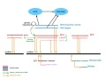
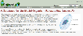

# Category:ParameciumDB

From GMOD

Jump to: [navigation](#mw-navigation), [search](#p-search)

Pages about [ParameciumDB](ParameciumDB "ParameciumDB")
(<a href="http://paramecium.cgm.cnrs-gif.fr/" class="external free"
rel="nofollow">http://paramecium.cgm.cnrs-gif.fr/</a>), a GMOD project
user and contributor.

## Pages in category "ParameciumDB"

The following 3 pages are in this category, out of 3 total.

### N

- [November 2007 GMOD
  Meeting](November_2007_GMOD_Meeting "November 2007 GMOD Meeting")

### P

- [ParameciumDB](ParameciumDB "ParameciumDB")
- [Public Chado
  Databases](Public_Chado_Databases "Public Chado Databases")

## Media in category "ParameciumDB"

The following 8 files are in this category, out of 8 total.

- 

  

  

  

  

  

  

  [Cain-050516.ppt](File:Cain-050516.ppt "File:Cain-050516.ppt")  
  818 KB  

  

  

- 

  

  

  

  

  

  

  [CommunityAnnotationNov...](File:CommunityAnnotationNov2007.pdf "File:CommunityAnnotationNov2007.pdf")  
  2.86 MB  

  

  

- 

  

  

  

  

  

  

  [Gkl777.pdf](File:Gkl777.pdf "File:Gkl777.pdf")  
  401 KB  

  

  

- 

  

  

  

  

  

  

  [ParameciumDataModel.jpg](File:ParameciumDataModel.jpg "File:ParameciumDataModel.jpg")  
  34 KB  

  

  

- 

  

  

  

  

  

  

  [ParameciumDB
  synteny.pdf](File:ParameciumDB_synteny.pdf "File:ParameciumDB synteny.pdf")  
  436 KB  

  

  

- 

  

  

  

  

  

  

  [ParameciumDBHomePage.png](File:ParameciumDBHomePage.png "File:ParameciumDBHomePage.png")  
  68 KB  

  

  

- 

  

  

  

  

  

  

  [ParameciumDBIcon133x42...](File:ParameciumDBIcon133x42.png "File:ParameciumDBIcon133x42.png")  
  25 KB  

  

  

- 

  

  

  

  

  

  

  [ParameciumDBLogo.png](File:ParameciumDBLogo.png "File:ParameciumDBLogo.png")  
  11 KB  

  

  

Retrieved from
"<http://gmod.org/mediawiki/index.php?title=Category:ParameciumDB&oldid=5031>"

[Category](Special:Categories "Special:Categories"):

- [GMOD Community](Category:GMOD_Community "Category:GMOD Community")

## Navigation menu

### Namespaces

- <a href="Category:ParameciumDB" accesskey="c"
  title="View the category page [c]">Category</a>
- <a
  href="http://gmod.org/mediawiki/index.php?title=Category_talk:ParameciumDB&amp;action=edit&amp;redlink=1"
  accesskey="t"
  title="Discussion about the content page [t]">Discussion</a>

### 

### Variants

### Navigation

- [GMOD Home](Main_Page)
- [Software](GMOD_Components)
- [Categories /
  Tags](Categories)
- [View all pages](Special:AllPages)

### Documentation

- [Overview](Overview)
- [FAQs](Category:FAQ)
- [HOWTOs](Category:HOWTO)
- [Glossary](Glossary)

### Community

- [GMOD News](GMOD_News)
- [Training /
  Outreach](Training_and_Outreach)
- [Support](Support)
- [GMOD Promotion](GMOD_Promotion)
- [Meetings](Meetings)
- [Calendar](Calendar)

### Tools

- <a href="Special:Browse/Category:ParameciumDB" rel="smw-browse">Browse
  properties</a>
- [Print as
  PDF](http://gmod.org/mediawiki/index.php?title=Special:PdfPrint&page=Category:ParameciumDB)

- Last updated at 17:33 on 14 March
  2008.
<!-- - 16,762 page views. -->
- Content is available under
  <a href="http://www.gnu.org/licenses/fdl-1.3.html" class="external"
  rel="nofollow">a GNU Free Documentation License</a> unless otherwise
  noted.

<!-- -->

- [About
  GMOD](GMOD:About "GMOD:About")

<!-- -->

- 
- 
  

