

# Category:Screenshots

From GMOD

Jump to: [navigation](#mw-navigation), [search](#p-search)

Screenshots of [GMOD Components](GMOD_Components "GMOD Components"),
GMOD user web sites, and anything else.

## Pages in category "Screenshots"

This category contains only the following page.

### A

- [AWS walkthrough](AWS_walkthrough "AWS walkthrough")

## Media in category "Screenshots"

The following 89 files are in this category, out of 89 total.

- 

  

  

  

  

  

  

  [GBrowse
  screenshot1.png](File:GBrowse_screenshot1.png "File:GBrowse screenshot1.png")  
  24 KB  

  

  

- 

  

  

  <a href="File:ActSelection.gif" class="image">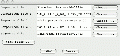</a>

  

  

  

  [ActSelection.gif](File:ActSelection.gif "File:ActSelection.gif")  
  20 KB  

  

  

- 

  

  

  <a href="File:ActSelection2seqs.gif" class="image">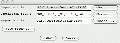</a>

  

  

  

  [ActSelection2seqs.gif](File:ActSelection2seqs.gif "File:ActSelection2seqs.gif")  
  14 KB  

  

  

- 

  

  

  <a href="File:AddCV.gif" class="image">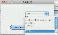</a>

  

  

  

  [AddCV.gif](File:AddCV.gif "File:AddCV.gif")  
  10 KB  

  

  

- 

  

  

  <a href="File:Alignments_table.png" class="image">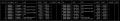</a>

  

  

  

  [Alignments
  table.png](File:Alignments_table.png "File:Alignments table.png")  
  24 KB  

  

  

- 

  

  

  <a href="File:Analysis-complete.jpg" class="image">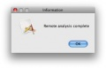</a>

  

  

  

  [Analysis-complete.jpg](File:Analysis-complete.jpg "File:Analysis-complete.jpg")  
  14 KB  

  

  

- 

  

  

  <a href="File:Analysis-expected-time.jpg" class="image">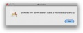</a>

  

  

  

  [Analysis-expected-time...](File:Analysis-expected-time.jpg "File:Analysis-expected-time.jpg")  
  19 KB  

  

  

- 

  

  

  <a href="File:Analyze-region-popup-menu.jpg" class="image">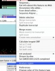</a>

  

  

  

  [Analyze-region-popup-m...](File:Analyze-region-popup-menu.jpg "File:Analyze-region-popup-menu.jpg")  
  43 KB  

  

  

- 

  

  

  <a href="File:Annotation-editor-popup-menu.jpg" class="image">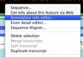</a>

  

  

  

  [Annotation-editor-popu...](File:Annotation-editor-popup-menu.jpg "File:Annotation-editor-popup-menu.jpg")  
  20 KB  

  

  

- 

  

  

  

  

  

  

  [Annotation-editor.jpg](File:Annotation-editor.jpg "File:Annotation-editor.jpg")  
  47 KB  

  

  

- 

  

  

  <a href="File:Apollo-main-window.jpg" class="image">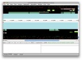</a>

  

  

  

  [Apollo-main-window.jpg](File:Apollo-main-window.jpg "File:Apollo-main-window.jpg")  
  99 KB  

  

  

- 

  

  

  <a href="File:Apollo-no-genes.jpg" class="image">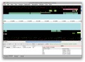</a>

  

  

  

  [Apollo-no-genes.jpg](File:Apollo-no-genes.jpg "File:Apollo-no-genes.jpg")  
  110 KB  

  

  

- 

  

  

  

  

  

  

  [Apollo-with-genes.jpg](File:Apollo-with-genes.jpg "File:Apollo-with-genes.jpg")  
  110 KB  

  

  

- 

  

  

  

  

  

  

  [Apollo-with-merged-exo...](File:Apollo-with-merged-exons.jpg "File:Apollo-with-merged-exons.jpg")  
  117 KB  

  

  

- 

  

  

  <a href="File:Apollo-with-two-genes-splice-variants.jpg"
  class="image">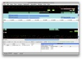</a>

  

  

  

  [Apollo-with-two-genes-...](File:Apollo-with-two-genes-splice-variants.jpg "File:Apollo-with-two-genes-splice-variants.jpg")  
  118 KB  

  

  

- 

  

  

  <a href="File:Apollo-with-two-genes.jpg" class="image">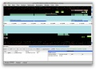</a>

  

  

  

  [Apollo-with-two-genes.jpg](File:Apollo-with-two-genes.jpg "File:Apollo-with-two-genes.jpg")  
  113 KB  

  

  

- 

  

  

  <a href="File:Artemis.gif" class="image">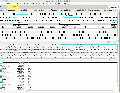</a>

  

  

  

  [Artemis.gif](File:Artemis.gif "File:Artemis.gif")  
  68 KB  

  

  

- 

  

  

  <a href="File:ArtemisLogin.gif" class="image">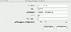</a>

  

  

  

  [ArtemisLogin.gif](File:ArtemisLogin.gif "File:ArtemisLogin.gif")  
  12 KB  

  

  

- 

  

  

  <a href="File:Balloon_generator.png" class="image">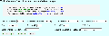</a>

  

  

  

  [Balloon
  generator.png](File:Balloon_generator.png "File:Balloon generator.png")  
  47 KB  

  

  

- 

  

  

  <a href="File:Balloon_sample.png" class="image">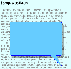</a>

  

  

  

  [Balloon
  sample.png](File:Balloon_sample.png "File:Balloon sample.png")  
  39 KB  

  

  

- 

  

  

  <a href="File:Balloon.png" class="image">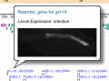</a>

  

  

  

  [Balloon.png](File:Balloon.png "File:Balloon.png")  
  27 KB  

  

  

- 

  

  

  <a href="File:BenchMark.png" class="image">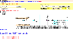</a>

  

  

  

  [BenchMark.png](File:BenchMark.png "File:BenchMark.png")  
  56 KB  

  

  

- 

  

  

  <a href="File:Blast-types.jpg" class="image">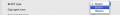</a>

  

  

  

  [Blast-types.jpg](File:Blast-types.jpg "File:Blast-types.jpg")  
  10 KB  

  

  

- 

  

  

  <a href="File:Blastn-results.jpg" class="image">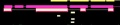</a>

  

  

  

  [Blastn-results.jpg](File:Blastn-results.jpg "File:Blastn-results.jpg")  
  11 KB  

  

  

- 

  

  

  

  

  

  

  [Blastx-results.jpg](File:Blastx-results.jpg "File:Blastx-results.jpg")  
  8 KB  

  

  

- 

  

  

  <a href="File:Chado-adapter.jpg" class="image">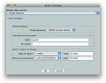</a>

  

  

  

  [Chado-adapter.jpg](File:Chado-adapter.jpg "File:Chado-adapter.jpg")  
  50 KB  

  

  

- 

  

  

  <a href="File:Chado-save-dialog.jpg" class="image">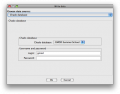</a>

  

  

  

  [Chado-save-dialog.jpg](File:Chado-save-dialog.jpg "File:Chado-save-dialog.jpg")  
  57 KB  

  

  

- 

  

  

  

  

  

  

  [Cmap sample1.jpg](File:Cmap_sample1.jpg "File:Cmap sample1.jpg")  
  71 KB  

  

  

- 

  

  

  <a href="File:Cmap_sample1t.jpg" class="image">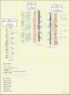</a>

  

  

  

  [Cmap sample1t.jpg](File:Cmap_sample1t.jpg "File:Cmap sample1t.jpg")  
  7 KB  

  

  

- 

  

  

  <a href="File:Cmap_sample2.jpg" class="image">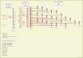</a>

  

  

  

  [Cmap sample2.jpg](File:Cmap_sample2.jpg "File:Cmap sample2.jpg")  
  91 KB  

  

  

- 

  

  

  <a href="File:Cmap_sample2t.jpg" class="image">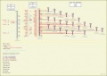</a>

  

  

  

  [Cmap sample2t.jpg](File:Cmap_sample2t.jpg "File:Cmap sample2t.jpg")  
  11 KB  

  

  

- 

  

  

  <a href="File:Cmap_sample3.jpg" class="image">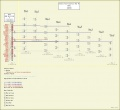</a>

  

  

  

  [Cmap sample3.jpg](File:Cmap_sample3.jpg "File:Cmap sample3.jpg")  
  65 KB  

  

  

- 

  

  

  <a href="File:Cmap_sample3t.jpg" class="image">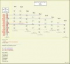</a>

  

  

  

  [Cmap sample3t.jpg](File:Cmap_sample3t.jpg "File:Cmap sample3t.jpg")  
  7 KB  

  

  

- 

  

  

  <a href="File:CreateConfigMart.png" class="image">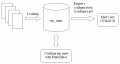</a>

  

  

  

  [CreateConfigMart.png](File:CreateConfigMart.png "File:CreateConfigMart.png")  
  19 KB  

  

  

- 

  

  

  <a href="File:Edit-preferences.jpg" class="image">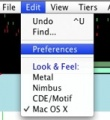</a>

  

  

  

  [Edit-preferences.jpg](File:Edit-preferences.jpg "File:Edit-preferences.jpg")  
  15 KB  

  

  

- 

  

  

  <a href="File:FlyBaseCVTermViewer.png" class="image">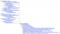</a>

  

  

  

  [FlyBaseCVTermViewer.png](File:FlyBaseCVTermViewer.png "File:FlyBaseCVTermViewer.png")  
  106 KB  

  

  

- 

  

  

  <a href="File:Galaxy_Fetch_1.png" class="image">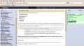</a>

  

  

  

  [Galaxy Fetch
  1.png](File:Galaxy_Fetch_1.png "File:Galaxy Fetch 1.png")  
  190 KB  

  

  

- 

  

  

  <a href="File:Galaxy_Fetch_2.png" class="image">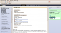</a>

  

  

  

  [Galaxy Fetch
  2.png](File:Galaxy_Fetch_2.png "File:Galaxy Fetch 2.png")  
  186 KB  

  

  

- 

  

  

  <a href="File:Galaxy_Fetch_3.png" class="image">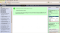</a>

  

  

  

  [Galaxy Fetch
  3.png](File:Galaxy_Fetch_3.png "File:Galaxy Fetch 3.png")  
  156 KB  

  

  

- 

  

  

  

  

  

  

  [Galaxy FirstAnalysis
  1...](File:Galaxy_FirstAnalysis_1.png "File:Galaxy FirstAnalysis 1.png")  
  158 KB  

  

  

- 

  

  

  <a href="File:Galaxy_FirstAnalysis_2.png" class="image">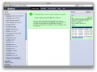</a>

  

  

  

  [Galaxy FirstAnalysis
  2...](File:Galaxy_FirstAnalysis_2.png "File:Galaxy FirstAnalysis 2.png")  
  134 KB  

  

  

- 

  

  

  <a href="File:Galaxy_FirstAnalysis_3.png" class="image">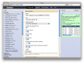</a>

  

  

  

  [Galaxy FirstAnalysis
  3...](File:Galaxy_FirstAnalysis_3.png "File:Galaxy FirstAnalysis 3.png")  
  162 KB  

  

  

- 

  

  

  <a href="File:Galaxy_FirstAnalysis_4.png" class="image">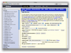</a>

  

  

  

  [Galaxy FirstAnalysis
  4...](File:Galaxy_FirstAnalysis_4.png "File:Galaxy FirstAnalysis 4.png")  
  196 KB  

  

  

- 

  

  

  <a href="File:Galaxy_FirstAnalysis_5.png" class="image">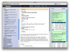</a>

  

  

  

  [Galaxy FirstAnalysis
  5...](File:Galaxy_FirstAnalysis_5.png "File:Galaxy FirstAnalysis 5.png")  
  209 KB  

  

  

- 

  

  

  <a href="File:Galaxy_FirstAnalysis_6.png" class="image">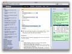</a>

  

  

  

  [Galaxy FirstAnalysis
  6...](File:Galaxy_FirstAnalysis_6.png "File:Galaxy FirstAnalysis 6.png")  
  202 KB  

  

  

- 

  

  

  <a href="File:Galaxy_Misc_1.png" class="image">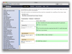</a>

  

  

  

  [Galaxy Misc 1.png](File:Galaxy_Misc_1.png "File:Galaxy Misc 1.png")  
  167 KB  

  

  

- 

  

  

  <a href="File:Galaxy_Misc_2.png" class="image">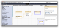</a>

  

  

  

  [Galaxy Misc 2.png](File:Galaxy_Misc_2.png "File:Galaxy Misc 2.png")  
  138 KB  

  

  

- 

  

  

  <a href="File:Galaxy_Misc_3.png" class="image">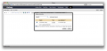</a>

  

  

  

  [Galaxy Misc 3.png](File:Galaxy_Misc_3.png "File:Galaxy Misc 3.png")  
  77 KB  

  

  

- 

  

  

  <a href="File:Galaxy_Misc_4.png" class="image">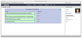</a>

  

  

  

  [Galaxy Misc 4.png](File:Galaxy_Misc_4.png "File:Galaxy Misc 4.png")  
  87 KB  

  

  

- 

  

  

  <a href="File:Galaxy_SecondAnalysis_1.png" class="image">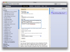</a>

  

  

  

  [Galaxy
  SecondAnalysis...](File:Galaxy_SecondAnalysis_1.png "File:Galaxy SecondAnalysis 1.png")  
  163 KB  

  

  

- 

  

  

  <a href="File:Galaxy_SecondAnalysis_2.png" class="image">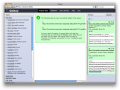</a>

  

  

  

  [Galaxy
  SecondAnalysis...](File:Galaxy_SecondAnalysis_2.png "File:Galaxy SecondAnalysis 2.png")  
  150 KB  

  

  

- 

  

  

  <a href="File:Gbrowse_syn.png" class="image">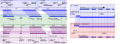</a>

  

  

  

  [Gbrowse syn.png](File:Gbrowse_syn.png "File:Gbrowse syn.png")  
  167 KB  

  

  

- 

  

  

  <a href="File:Gbrowse_synBubble1.png" class="image">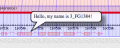</a>

  

  

  

  [Gbrowse
  synBubble1.png](File:Gbrowse_synBubble1.png "File:Gbrowse synBubble1.png")  
  23 KB  

  

  

- 

  

  

  <a href="File:Gbrowse_synEtfinit.png" class="image">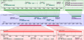</a>

  

  

  

  [Gbrowse
  synEtfinit.png](File:Gbrowse_synEtfinit.png "File:Gbrowse synEtfinit.png")  
  16 KB  

  

  

- 

  

  

  <a href="File:GBrowse_synPulldown1.png" class="image">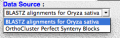</a>

  

  

  

  [GBrowse
  synPulldown1.png](File:GBrowse_synPulldown1.png "File:GBrowse synPulldown1.png")  
  24 KB  

  

  

- 

  

  

  <a href="File:GBrowse_synWe_made_it1.png" class="image">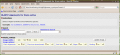</a>

  

  

  

  [GBrowse synWe made
  it1...](File:GBrowse_synWe_made_it1.png "File:GBrowse synWe made it1.png")  
  197 KB  

  

  

- 

  

  

  <a href="File:GBrowse_synWe_made_it2.png" class="image">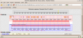</a>

  

  

  

  [GBrowse synWe made
  it2...](File:GBrowse_synWe_made_it2.png "File:GBrowse synWe made it2.png")  
  161 KB  

  

  

- 

  

  

  

  

  

  

  [GBrowse
  synWelcom.png](File:GBrowse_synWelcom.png "File:GBrowse synWelcom.png")  
  242 KB  

  

  

- 

  

  

  

  

  

  

  [GBrowse2Thumb.png](File:GBrowse2Thumb.png "File:GBrowse2Thumb.png")  
  54 KB  

  

  

- 

  

  

  

  

  

  

  [GBrowseSAMtools1.png](File:GBrowseSAMtools1.png "File:GBrowseSAMtools1.png")  
  410 KB  

  

  

- 

  

  

  

  

  

  

  [GBrowseSAMtoolsCoverag...](File:GBrowseSAMtoolsCoverageXY.png "File:GBrowseSAMtoolsCoverageXY.png")  
  464 KB  

  

  

- 

  

  

  

  

  

  

  [GBrowseSAMtoolsReads1.png](File:GBrowseSAMtoolsReads1.png "File:GBrowseSAMtoolsReads1.png")  
  613 KB  

  

  

- 

  

  

  

  

  

  

  [ISGAHomePageThumb.png](File:ISGAHomePageThumb.png "File:ISGAHomePageThumb.png")  
  36 KB  

  

  

- 

  

  

  

  

  

  

  [MAKERresults.jpg](File:MAKERresults.jpg "File:MAKERresults.jpg")  
  41 KB  

  

  

- 

  

  

  

  

  

  

  [MAKERselect
  dpp.jpg](File:MAKERselect_dpp.jpg "File:MAKERselect dpp.jpg")  
  13 KB  

  

  

- 

  

  

  

  

  

  

  [MAKERstatus.jpg](File:MAKERstatus.jpg "File:MAKERstatus.jpg")  
  29 KB  

  

  

- 

  

  

  

  

  

  

  [MartEditorContextMenu.png](File:MartEditorContextMenu.png "File:MartEditorContextMenu.png")  
  19 KB  

  

  

- 

  

  

  

  

  

  

  [MartEditorCreateImport...](File:MartEditorCreateImportable.png "File:MartEditorCreateImportable.png")  
  12 KB  

  

  

- 

  

  

  

  

  

  

  [MartEditorExportable.png](File:MartEditorExportable.png "File:MartEditorExportable.png")  
  19 KB  

  

  

- 

  

  

  

  

  

  

  [MartEditorImportable.png](File:MartEditorImportable.png "File:MartEditorImportable.png")  
  16 KB  

  

  

- 

  

  

  

  

  

  

  [MartEditorMenu.png](File:MartEditorMenu.png "File:MartEditorMenu.png")  
  7 KB  

  

  

- 

  

  

  

  

  

  

  [MartEditorPanal.png](File:MartEditorPanal.png "File:MartEditorPanal.png")  
  25 KB  

  

  

- 

  

  

  

  

  

  

  [MartModel.png](File:MartModel.png "File:MartModel.png")  
  19 KB  

  

  

- 

  

  

  

  

  

  

  [MartViewGUI.png](File:MartViewGUI.png "File:MartViewGUI.png")  
  31 KB  

  

  

- 

  

  

  

  

  

  

  [MartViewJoinQuery.png](File:MartViewJoinQuery.png "File:MartViewJoinQuery.png")  
  32 KB  

  

  

- 

  

  

  

  

  

  

  [MBuilderAddSchema.png](File:MBuilderAddSchema.png "File:MBuilderAddSchema.png")  
  19 KB  

  

  

- 

  

  

  

  

  

  

  [MBuilderDatasetView.png](File:MBuilderDatasetView.png "File:MBuilderDatasetView.png")  
  21 KB  

  

  

- 

  

  

  

  

  

  

  [MBuilderMenu.png](File:MBuilderMenu.png "File:MBuilderMenu.png")  
  8 KB  

  

  

- 

  

  

  

  

  

  

  [MBuilderRunner.png](File:MBuilderRunner.png "File:MBuilderRunner.png")  
  24 KB  

  

  

- 

  

  

  

  

  

  

  [MBuilderRunnerMonitor.png](File:MBuilderRunnerMonitor.png "File:MBuilderRunnerMonitor.png")  
  32 KB  

  

  

- 

  

  

  

  

  

  

  [MBuilderSchemaView.PNG](File:MBuilderSchemaView.PNG "File:MBuilderSchemaView.PNG")  
  30 KB  

  

  

- 

  

  

  

  

  

  

  [Merge-exons-popup-menu...](File:Merge-exons-popup-menu.jpg "File:Merge-exons-popup-menu.jpg")  
  37 KB  

  

  

- 

  

  

  

  

  

  

  [PoweredByBioMart.png](File:PoweredByBioMart.png "File:PoweredByBioMart.png")  
  10 KB  

  

  

- 

  

  

  

  

  

  

  [Run-analysis.jpg](File:Run-analysis.jpg "File:Run-analysis.jpg")  
  87 KB  

  

  

- 

  

  

  

  

  

  

  [Style-wizard.jpg](File:Style-wizard.jpg "File:Style-wizard.jpg")  
  40 KB  

  

  

- 

  

  

  

  

  

  

  [WebGBrowseAddTrack.jpg](File:WebGBrowseAddTrack.jpg "File:WebGBrowseAddTrack.jpg")  
  48 KB  

  

  

- 

  

  

  

  

  

  

  [WhatInBioMart.png](File:WhatInBioMart.png "File:WhatInBioMart.png")  
  18 KB  

  

  

- 

  

  

  

  

  

  

  [ZfinAssayTypePullDown.png](File:ZfinAssayTypePullDown.png "File:ZfinAssayTypePullDown.png")  
  28 KB  

  

  

- 

  

  

  

  

  

  

  [JBrowse-arc-screenshot...](File:JBrowse-arc-screenshot.png.png "File:JBrowse-arc-screenshot.png.png")  
  50 KB  

  

  

Retrieved from
"<http://gmod.org/mediawiki/index.php?title=Category:Screenshots&oldid=9837>"

## Navigation menu

### Namespaces

- <a href="Category:Screenshots" accesskey="c"
  title="View the category page [c]">Category</a>
- <a
  href="http://gmod.org/mediawiki/index.php?title=Category_talk:Screenshots&amp;action=edit&amp;redlink=1"
  accesskey="t"
  title="Discussion about the content page [t]">Discussion</a>

### 

### Variants

### Actions

### Search

### Navigation

- [GMOD Home](Main_Page)
- [Software](GMOD_Components)
- [Categories /
  Tags](Categories)
- [View all pages](Special:AllPages)

### Documentation

- [Overview](Overview)
- [FAQs](Category:FAQ)
- [HOWTOs](Category:HOWTO)
- [Glossary](Glossary)

### Community

- [GMOD News](GMOD_News)
- [Training /
  Outreach](Training_and_Outreach)
- [Support](Support)
- [GMOD Promotion](GMOD_Promotion)
- [Meetings](Meetings)
- [Calendar](Calendar)

### Tools

- <a href="Special:WhatLinksHere/Category:Screenshots" accesskey="j"
  title="A list of all wiki pages that link here [j]">What links here</a>
- <a href="Special:RecentChangesLinked/Category:Screenshots" accesskey="k"
  title="Recent changes in pages linked from this page [k]">Related
  changes</a>
- <a href="Special:SpecialPages" accesskey="q"
  title="A list of all special pages [q]">Special pages</a>
- <a
  href="http://gmod.org/mediawiki/index.php?title=Category:Screenshots&amp;printable=yes"
  rel="alternate" accesskey="p"
  title="Printable version of this page [p]">Printable version</a>
- [Permanent
  link](http://gmod.org/mediawiki/index.php?title=Category:Screenshots&oldid=9837 "Permanent link to this revision of the page")
- [Page
  information](http://gmod.org/mediawiki/index.php?title=Category:Screenshots&action=info)
- <a href="Special:Browse/Category:Screenshots" rel="smw-browse">Browse
  properties</a>
- [Print as
  PDF](http://gmod.org/mediawiki/index.php?title=Special:PdfPrint&page=Category:Screenshots)

- Last updated at 17:04 on 29 September
  2009.
- 10,286 page views.
- Content is available under
  <a href="http://www.gnu.org/licenses/fdl-1.3.html" class="external"
  rel="nofollow">a GNU Free Documentation License</a> unless otherwise
  noted.

<!-- -->

- [About
  GMOD](GMOD:About "GMOD:About")

<!-- -->

- 
- 
  

