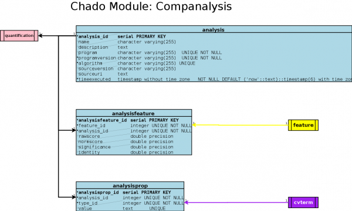

# Chado Companalysis Module

From GMOD

Jump to: [navigation](#mw-navigation), [search](#p-search)

The companalysis module is designed for the storage of computational
sequence analysis. The key concept is that the results of a
computational analysis can be interpreted or described as a sequence
feature.

## Contents

- [1 Using the
  companalysis module](#Using_the_companalysis_module)
  - [1.1 Alignment
    Results in Flybase](#Alignment_Results_in_Flybase)
    - [1.1.1
      Background](#Background)
    - [1.1.2
      General
      implementation](#General_implementation)
    - [1.1.3
      Examples](#Examples)
    - [1.1.4
      Evidence data types in
      chado](#Evidence_data_types_in_chado)
      - [1.1.4.1
        Aligned
        features](#Aligned_features)
      - [1.1.4.2
        Predicted
        features](#Predicted_features)
- [2
  Tables](#Tables)
  - [2.1 Table:
    analysis](#Table:_analysis)
  - [2.2 Table:
    analysisfeature](#Table:_analysisfeature)
  - [2.3 Table:
    analysisprop](#Table:_analysisprop)
  - [2.4 UML
    diagram](#UML_diagram)

# Using the companalysis module

The following are examples showing how to use this module to describe
the results from a given computational analysis.

## Alignment Results in Flybase

Written by Andy Schroeder, the original Wiki page is here: <a
href="http://cedar.bio.indiana.edu/mediawiki/index.php/Aligned_computational_analyses_implementation"
class="external free"
rel="nofollow">http://cedar.bio.indiana.edu/mediawiki/index.php/Aligned_computational_analyses_implementation</a>.

### Background

Alignment of nucleic acids and conceptually back translated proteins to
the genomic chromosomal arms provides much of the evidence for gene
model annotation. Several different algorithms have been employed to
produce alignments of various types of features to the chromosomal arms.
The aligned features and the corresponding alignments are implemented in
chado in a similar manner for each of the analyses.

There also exists sets of data primarily derived from gene prediction
algorithms in which non-localized alignment match features and their
associated genome localized match features (analogous to hsp matches)
are stored. These localized match features are only localized via
featureloc to the genome and not to a second type of feature.

### General implementation

**Nucleotide and protein alignments**

         ----------------------------------------------  genome
                 ^                   ^
                 |   _______A______  |          alignment feature type = match
            floc |    ^          ^   | floc (rank = 0)
                 |    | f_r  f_r |   |
                --B----        ---C---        hsp feature type = match
                      |        |
                 floc |        | floc (rank = 1)
                      V        V
                      ----D-----              aligned feature type = EST, cDNA, protein etc.

**Predicted features**

         ----------------------------------------------  genome
                 ^                   ^
                 |   _______A______  |          alignment feature type = match
            floc |    ^          ^   | floc (rank = 0)
                 |    | f_r  f_r |   |
                --B----        ---C---        hsp feature type = match

### Examples

See the diagrams above.

Feature A (uniquename = 4191059_sim4) is the alignment feature of type
*match*.

- *feature.is_analysis* = 't'
- this is an abstract feature used to group and order HSP features
- feature A is linked to the HSP features B and C via a
  *feature_relationship* with feature A as the object and features B and
  C as subjects with the *feature_relationship* rank indicating ordering
  of features
  - note that the rank has not been implemented for many of the current
    alignments (sim4 and sim4tandem)
- this feature is linked to *analysis* via *analysisfeature*

Feature B (uniquename = 10425228) and feature C (uniquename = 10425229)
are HSP features.

- *feature.is_analysis* = 't'
- the HSP features linked via *feature_relationship* as described above
  to explicitly represent ordering and grouping and are linked via a
  *partof* relationship type
- these features are located to the genome (*srcfeature.id* = arm) and
  this featureloc info has *featureloc.rank* = 0
- the HSPs are also linked to the specific analysis via
  *analysisfeature*
  - for aligned sequences these features are also located to the aligned
    feature (i.e. cDNA, EST etc.) and this featureloc info has a
    *featureloc.rank* = 1
- note that this only applies to aligned sequences and not gene
  predictions

Feature D (uniquename = CO056789) is the aligned feature i.e. cDNA, EST,
protein.

- feature.is_analysis = 't'
- the aligned HSPs are located to this feature via *featureloc* with
  featureloc.rank = 1
- *featureloc.residue_info* should contain the residues of this feature
  that correspond to the extent of the HSP
  - note that the *residue_info* is specific to the type of feature that
    is aligned (for example if a protein is aligned to the genome via
    blastx then the *featureloc.residue_info* should be aminoacid
    residues)

### Evidence data types in chado

#### Aligned features

Here is a list from 'chado_dmel_r4_3_16a_reporting' of aligned feature
types and the algorithms used to align them (not filtered by species).

    SQL query:
    SELECT DISTINCT c.name as feature_type, a.program
    FROM   feature alg, feature hsp, analysisfeature af, analysis a, cvterm c, featureloc fl
    WHERE  hsp.feature_id = af.feature_id and af.analysis_id = a.analysis_id
    and    hsp.feature_id = fl.feature_id and alg.feature_id = fl.srcfeature_id
    and    fl.rank = 1 and c.cvterm_id = alg.type_id
    ORDER BY program;

    results:
       feature_type       |           program
    ----------------------+------------------------------
     so                   | assembly
     BAC                  | bdgp_unknown_clonelocator
     EST                  | blastn
     protein              | blastx_masked
     oligonucleotide      | dmel_r3_to_dmel_r4_migration
     protein              | prosplign
     RepeatMasker:dummy   | repeatmasker
     so                   | repeatmasker
     EST                  | sim4
     alignment            | sim4
     mRNA                 | sim4
     ncRNA                | sim4
     pseudogene           | sim4
     rRNA                 | sim4
     region               | sim4
     snRNA                | sim4
     snoRNA               | sim4
     so                   | sim4
     tRNA                 | sim4
     transposable_element | sim4
     cDNA                 | sim4tandem
     so                   | sim4tandem
     cDNA                 | splign
     protein              | tblastn
     EST                  | tblastx_masked
     so                   | tblastx_masked
     DNA                  | tblastxwrap_masked
     so                   | tblastxwrap_masked
    (28 rows)

#### Predicted features

Note that this was determined by a process of elimination from the
results of the following query:

    SELECT DISTINCT c.name, a.program
      FROM feature map_feat, feature hsp, analysisfeature af,
           analysis a, cvterm c, feature_relationship fr
     WHERE hsp.feature_id = af.feature_id and af.analysis_id = a.analysis_id
       and hsp.feature_id = fr.subject_id  and map_feat.feature_id = fr.object_id
       and c.cvterm_id = map_feat.type_id ORDER BY program;

    and then removing those matches that corresponded to the alignment features for the
    part A query

          name       |           program
    -----------------+------------------------------
     match           | augustus
     match           | genewise
     match           | genie_masked
     match           | genscan
     match           | genscan_masked
     match           | promoter
     match           | repeat_runner_seg
     match           | tRNAscan-SE
     syntenic_region | tblastn
     match           | twinscan

  

# Tables

## Table: analysis

An analysis is a particular type of a computational analysis; it may be
a blast of one sequence against another, or an all by all blast, or a
different kind of analysis altogether. It is a single unit of
computation.

<table data-border="1" data-cellpadding="3">
<caption>analysis Structure</caption>
<colgroup>
<col style="width: 25%" />
<col style="width: 25%" />
<col style="width: 25%" />
<col style="width: 25%" />
</colgroup>
<thead>
<tr class="header">
<th>F-Key</th>
<th>Name</th>
<th>Type</th>
<th>Description</th>
</tr>
</thead>
<tbody>
<tr class="odd tr0">
<td></td>
<td>analysis_id</td>
<td>serial</td>
<td><em>PRIMARY KEY</em></td>
</tr>
<tr class="even tr1">
<td></td>
<td>name</td>
<td>character varying(255)</td>
<td><em></em> 
 
A way of grouping analyses. This should be a handy short identifier that
can help people find an analysis they want. For instance "tRNAscan",
"cDNA", "FlyPep", "SwissProt", and it should not be assumed to be
unique. For instance, there may be lots of separate analyses done
against a cDNA database.</td>
</tr>
<tr class="odd tr0">
<td></td>
<td>description</td>
<td>text</td>
<td><em></em></td>
</tr>
<tr class="even tr1">
<td></td>
<td>program</td>
<td>character varying(255)</td>
<td><em>UNIQUE#1 NOT NULL</em> 
 
Program name, e.g. blastx, blastp, sim4, genscan.</td>
</tr>
<tr class="odd tr0">
<td></td>
<td>programversion</td>
<td>character varying(255)</td>
<td><em>UNIQUE#1 NOT NULL</em> 
 
Version description, e.g. TBLASTX 2.0MP-WashU [09-Nov-2000].</td>
</tr>
<tr class="even tr1">
<td></td>
<td>algorithm</td>
<td>character varying(255)</td>
<td><em></em> 
 
Algorithm name, e.g. blast.</td>
</tr>
<tr class="odd tr0">
<td></td>
<td>sourcename</td>
<td>character varying(255)</td>
<td><em>UNIQUE#1</em> 
 
Source name, e.g. cDNA, SwissProt.</td>
</tr>
<tr class="even tr1">
<td></td>
<td>sourceversion</td>
<td>character varying(255)</td>
<td><em></em></td>
</tr>
<tr class="odd tr0">
<td></td>
<td>sourceuri</td>
<td>text</td>
<td><em></em> 
 
This is an optional, permanent URL or URI for the source of the
analysis. The idea is that someone could recreate the analysis directly
by going to this URI and fetching the source data (e.g. the blast
database, or the training model).</td>
</tr>
<tr class="even tr1">
<td></td>
<td>timeexecuted</td>
<td>timestamp without time zone</td>
<td><em>NOT NULL DEFAULT ('now'::text)::timestamp(6) with time
zone</em></td>
</tr>
</tbody>
</table>

analysis Structure

Tables referencing this one via Foreign Key Constraints:

- [analysisfeature](Chado_Tables#Table:_analysisfeature "Chado Tables")

<!-- -->

- [analysisprop](Chado_Tables#Table:_analysisprop "Chado Tables")

<!-- -->

- [quantification](Chado_Tables#Table:_quantification "Chado Tables")

------------------------------------------------------------------------

  

## Table: analysisfeature

Computational analyses generate features (e.g. Genscan generates
transcripts and exons; sim4 alignments generate similarity/match
features). analysisfeatures are stored using the feature table from the
sequence module. The analysisfeature table is used to decorate these
features, with analysis specific attributes. A feature is an
analysisfeature if and only if there is a corresponding entry in the
analysisfeature table. analysisfeatures will have two or more featureloc
entries, with rank indicating query/subject

<table data-border="1" data-cellpadding="3">
<caption>analysisfeature Structure</caption>
<colgroup>
<col style="width: 25%" />
<col style="width: 25%" />
<col style="width: 25%" />
<col style="width: 25%" />
</colgroup>
<thead>
<tr class="header">
<th>F-Key</th>
<th>Name</th>
<th>Type</th>
<th>Description</th>
</tr>
</thead>
<tbody>
<tr class="odd tr0">
<td></td>
<td>analysisfeature_id</td>
<td>serial</td>
<td><em>PRIMARY KEY</em></td>
</tr>
<tr class="even tr1">
<td>
<a href="Chado_Tables#Table:_feature"
title="Chado Tables">feature</a>
</td>
<td>feature_id</td>
<td>integer</td>
<td><em>UNIQUE#1 NOT NULL</em></td>
</tr>
<tr class="odd tr0">
<td>
<a href="Chado_Tables#Table:_analysis"
title="Chado Tables">analysis</a>
</td>
<td>analysis_id</td>
<td>integer</td>
<td><em>UNIQUE#1 NOT NULL</em></td>
</tr>
<tr class="even tr1">
<td></td>
<td>rawscore</td>
<td>double precision</td>
<td><em></em> 
 
This is the native score generated by the program; for example, the
bitscore generated by blast, sim4 or genscan scores. One should not
assume that high is necessarily better than low.</td>
</tr>
<tr class="odd tr0">
<td></td>
<td>normscore</td>
<td>double precision</td>
<td><em></em> 
 
This is the rawscore but semi-normalized. Complete normalization to
allow comparison of features generated by different programs would be
nice but too difficult. Instead the normalization should strive to
enforce the following semantics: * normscores are floating point numbers
&gt;= 0, * high normscores are better than low one. For most programs,
it would be sufficient to make the normscore the same as this rawscore,
providing these semantics are satisfied.</td>
</tr>
<tr class="even tr1">
<td></td>
<td>significance</td>
<td>double precision</td>
<td><em></em> 
 
This is some kind of expectation or probability metric, representing the
probability that the analysis would appear randomly given the model. As
such, any program or person querying this table can assume the following
semantics: * 0 &lt;= significance &lt;= n, where n is a positive number,
theoretically unbounded but unlikely to be more than 10 * low numbers
are better than high numbers.</td>
</tr>
<tr class="odd tr0">
<td></td>
<td>identity</td>
<td>double precision</td>
<td><em></em> 
 
Percent identity between the locations compared. Note that these 4
metrics do not cover the full range of scores possible; it would be
undesirable to list every score possible, as this should be kept
extensible. instead, for non-standard scores, use the analysisprop
table.</td>
</tr>
</tbody>
</table>

analysisfeature Structure

------------------------------------------------------------------------

  

## Table: analysisprop

| F-Key | Name | Type | Description |
|----|----|----|----|
|  | analysisprop_id | serial | *PRIMARY KEY* |
| [analysis](Chado_Tables#Table:_analysis "Chado Tables") | analysis_id | integer | *UNIQUE#1 NOT NULL* |
| [cvterm](Chado_Tables#Table:_cvterm "Chado Tables") | type_id | integer | *UNIQUE#1 NOT NULL* |
|  | value | text | *UNIQUE#1* |

analysisprop Structure

------------------------------------------------------------------------

## UML diagram

Retrieved from
"<http://gmod.org/mediawiki/index.php?title=Chado_Companalysis_Module&oldid=12735>"

[Categories](Special:Categories "Special:Categories"):

- [Analysis](Category:Analysis "Category:Analysis")
- [BLAST](Category:BLAST "Category:BLAST")
- [Chado Modules](Category:Chado_Modules "Category:Chado Modules")

## Navigation menu

### Namespaces

- <a href="Chado_Companalysis_Module" accesskey="c"
  title="View the content page [c]">Page</a>
- <a
  href="http://gmod.org/mediawiki/index.php?title=Talk:Chado_Companalysis_Module&amp;action=edit&amp;redlink=1"
  accesskey="t"
  title="Discussion about the content page [t]">Discussion</a>

### 

### Variants

### Navigation

- [GMOD Home](Main_Page)
- [Software](GMOD_Components)
- [Categories /
  Tags](Categories)
- [View all pages](Special:AllPages)

### Documentation

- [Overview](Overview)
- [FAQs](Category:FAQ)
- [HOWTOs](Category:HOWTO)
- [Glossary](Glossary)

### Community

- [GMOD News](GMOD_News)
- [Training /
  Outreach](Training_and_Outreach)
- [Support](Support)
- [GMOD Promotion](GMOD_Promotion)
- [Meetings](Meetings)
- [Calendar](Calendar)

### Tools

- <a href="Special:WhatLinksHere/Chado_Companalysis_Module" accesskey="j"
  title="A list of all wiki pages that link here [j]">What links here</a>
- <a href="Special:RecentChangesLinked/Chado_Companalysis_Module"
  accesskey="k"
  title="Recent changes in pages linked from this page [k]">Related
  changes</a>
- <a href="Special:SpecialPages" accesskey="q"
  title="A list of all special pages [q]">Special pages</a>
- <a
  href="http://gmod.org/mediawiki/index.php?title=Chado_Companalysis_Module&amp;printable=yes"
  rel="alternate" accesskey="p"
  title="Printable version of this page [p]">Printable version</a>
- [Permanent
  link](http://gmod.org/mediawiki/index.php?title=Chado_Companalysis_Module&oldid=12735 "Permanent link to this revision of the page")
- [Page
  information](http://gmod.org/mediawiki/index.php?title=Chado_Companalysis_Module&action=info)
- <a href="Special:Browse/Chado_Companalysis_Module"
  rel="smw-browse">Browse properties</a>
- [Print as
  PDF](http://gmod.org/mediawiki/index.php?title=Special:PdfPrint&page=Chado_Companalysis_Module)

- Last updated at 10:04 on 26 May
  2010.
- 92,736 page views.
- Content is available under
  <a href="http://www.gnu.org/licenses/fdl-1.3.html" class="external"
  rel="nofollow">a GNU Free Documentation License</a> unless otherwise
  noted.

<!-- -->

- [About
  GMOD](GMOD:About "GMOD:About")

<!-- -->

- 
- 
  

