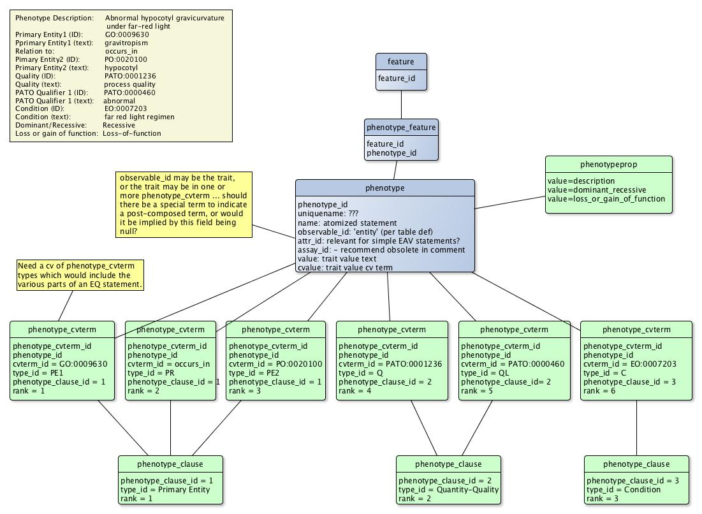

# Chado Post-Composed Phenotypes

From GMOD

Jump to: [navigation](#mw-navigation), [search](#p-search)

## Contents

- [1
  Overview](#Overview)
- [2
  Proposal](#Proposal)
- [3 New and
  Modified Tables in Phenotype
  Module](#New_and_Modified_Tables_in_Phenotype_Module)
- [4 Recommended
  Deprecated Fields](#Recommended_Deprecated_Fields)
- [5 Controlled
  Vocabularies](#Controlled_Vocabularies)
- [6 Older
  proposals](#Older_proposals)

## Overview

Increasingly phenotypes are rarely indicated with single, pre-composed
term. A particular phenotype (or phene) can be described with an EAV
statement (entity-attribute-value), or perhaps with more complex EQ
statements (Entity-Quality statements in which the Entity and Quality
parts themselves may contain several terms), and one expects even more
complex statements in the future. In addition to containing multiple
terms, these statements have a specific syntax that is critical to the
meaning of the statement.

Our goal was to make minimal changes to Chado, and some of those are in
the form of recommending deprecating some exiting table fields.

**Update, August 2015** The schema changes bellow offer the least
changes and will cover storing EAV and EQ statements, post and
pre-composed cvterms. These changes require only adding a new table,
phenotype_clause, and a number of new rows in phenotype_cvterm. We will
attempt to introduce these changes in Chado v1.3

  
**Update, Mar 2015:** After running a trial on option 2 below, we found
that the group table greatly increased the complexity of loading and
querying the data, so we decided that rather than permitting an
arbitrary level of statement structure hierarchy to force a maximum of 1
level of term grouping. This is expected to be sufficient for most if
not all statement structures currently in use.

## Proposal

  

## New and Modified Tables in Phenotype Module

     - Add phenotypeprop table.
     - Add phenotype_clause table, used for grouping phenotype_cvterm records into clauses within a statement.
     - Add type_id field to phenotype_cvterm to indicate role of term in a phenotype statement.
     - Add optional phenotype_clause_id field to phenotype_cvterm to permit grouping phenotype_cvterm records into clauses within a statement.

     CREATE TABLE phenotypeprop (
        phenotypeprop_id SERIAL PRIMARY KEY,
        phenotype_id INT NOT NULL,
           FOREIGN KEY (phenotype_id) REFERENCES phenotype (phenotype_id) ON DELETE CASCADE INITIALLY DEFERRED,
        type_id INT NOT NULL,
           FOREIGN KEY (type_id) REFERENCES cvterm (cvterm_id) ON DELETE CASCADE INITIALLY DEFERRED,
        value TEXT NULL,
        rank INT NOT NULL DEFAULT 0,

        CONSTRAINT phenotypeprop_c1 UNIQUE (phenotypeprop_id,type_id,rank)
     );
     COMMENT ON TABLE phenotypeprop IS "This table can be used to attach additional information to a phenotype or trait that is not part of the term or post-composed term. For example, heritability of a trait, dominant/recessive, et cetera.";

     CREATE TABLE phenotype_clause (
        phenotype_clause_id SERIAL PRIMARY KEY,
        uniquename TEXT NOT NULL,
        type_id INT NOT NULL,
           FOREIGN KEY (type_id) REFERENCES cvterm (cvterm_id) ON DELETE CASCADE INITIALLY DEFERRED,
        rank INT NOT NULL DEFAULT 0,
      );
     COMMENT ON TABLE phenotype_clause IS "Used to group phenotype_cvterm records into clauses, as are used in EQ statements where, for example, the primary entity may be a clause constructed with up to 3 terms";

     ALTER TABLE phenotype_cvterm 
       ADD COLUMN type_id INT NOT NULL,
          FOREIGN KEY type_id 
            REFERENCES cvterm (cvterm_id) ON DELETE CASCADE INITIALLY DEFERRED,
       ADD COLUMN phenotypeclause_id INT,
          FOREIGN KEY (grp_id) REFERENCES grp (grp_id) ON DELETE CASCADE INITIALLY DEFERRED,
     ;
     COMMENT ON COLUMN type_id IS "Name of this cvterm's role in a post-composed term";
     COMMENT ON COLUMN phenotypeclause_id IS "If this term is part of a clause within a statement, this field identifies the clause.";

  

## Recommended Deprecated Fields

     COMMENT ON TABLE phenotype IS 'Columns observable_id, assay_id 
     are deprecated to break the connection between the phenotype value and the
     trait. The phenotype table should be used to store precomposed terms and the 
     phenotype value. Use tables phenotype_cvterm to store the trait(s) associated 
     with the phenotype.';

## Controlled Vocabularies

The parts of a post-composed statement will need to be described in a
cv. This could go into a new cv for each type of statement, or go into a
general, post-composed_term cv.

**For EQ statements:**  
Primary Entity  
Primary Entity 1  
Primary Entity 1 Relationship  
Primary Entity 2  
Quality  
Qualifier  
Secondary Entity  
Secondary Entity 1  
Secondary Entity 1 Relationship  
Secondary Entity 2  
...  

  

## Older proposals

See
[Talk:Chado_Post-Composed_Phenotypes](Talk:Chado_Post-Composed_Phenotypes "Talk:Chado Post-Composed Phenotypes")
for the older versions of this schema proposal

Retrieved from
"<http://gmod.org/mediawiki/index.php?title=Chado_Post-Composed_Phenotypes&oldid=26758>"

## Navigation menu

### Namespaces

- <a href="Chado_Post-Composed_Phenotypes" accesskey="c"
  title="View the content page [c]">Page</a>
- <a href="Talk:Chado_Post-Composed_Phenotypes" accesskey="t"
  title="Discussion about the content page [t]">Discussion</a>

### 

### Variants

### Navigation

- [GMOD Home](Main_Page)
- [Software](GMOD_Components)
- [Categories /
  Tags](Categories)
- [View all pages](Special:AllPages)

### Documentation

- [Overview](Overview)
- [FAQs](Category:FAQ)
- [HOWTOs](Category:HOWTO)
- [Glossary](Glossary)

### Community

- [GMOD News](GMOD_News)
- [Training /
  Outreach](Training_and_Outreach)
- [Support](Support)
- [GMOD Promotion](GMOD_Promotion)
- [Meetings](Meetings)
- [Calendar](Calendar)

### Tools

- <a href="Special:WhatLinksHere/Chado_Post-Composed_Phenotypes"
  accesskey="j" title="A list of all wiki pages that link here [j]">What
  links here</a>
- <a href="Special:RecentChangesLinked/Chado_Post-Composed_Phenotypes"
  accesskey="k"
  title="Recent changes in pages linked from this page [k]">Related
  changes</a>
- <a href="Special:SpecialPages" accesskey="q"
  title="A list of all special pages [q]">Special pages</a>
- <a
  href="http://gmod.org/mediawiki/index.php?title=Chado_Post-Composed_Phenotypes&amp;printable=yes"
  rel="alternate" accesskey="p"
  title="Printable version of this page [p]">Printable version</a>
- [Permanent
  link](http://gmod.org/mediawiki/index.php?title=Chado_Post-Composed_Phenotypes&oldid=26758 "Permanent link to this revision of the page")
- [Page
  information](http://gmod.org/mediawiki/index.php?title=Chado_Post-Composed_Phenotypes&action=info)
- <a href="Special:Browse/Chado_Post-2DComposed_Phenotypes"
  rel="smw-browse">Browse properties</a>
- [Print as
  PDF](http://gmod.org/mediawiki/index.php?title=Special:PdfPrint&page=Chado_Post-Composed_Phenotypes)

- Last updated at 23:12 on 19 August
  2015.
- 28,975 page views.
- Content is available under
  <a href="http://www.gnu.org/licenses/fdl-1.3.html" class="external"
  rel="nofollow">a GNU Free Documentation License</a> unless otherwise
  noted.

<!-- -->

- [About
  GMOD](GMOD:About "GMOD:About")

<!-- -->

- 
- 
  

