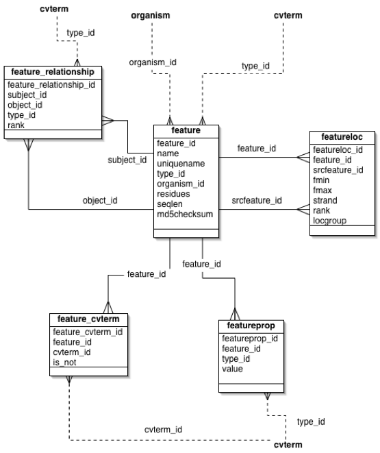
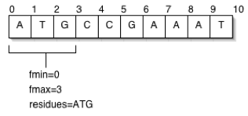

<div id="mw-page-base" class="noprint">

</div>

<div id="mw-head-base" class="noprint">

</div>

<div id="content" class="mw-body" role="main">

<span id="top"></span>

<div id="mw-js-message" style="display:none;">

</div>


# <span dir="auto">Chado Sequence Module</span>

<div id="bodyContent">

<div id="siteSub">

From GMOD

</div>

<div id="contentSub">

</div>

<div id="jump-to-nav" class="mw-jump">

Jump to: [navigation](#mw-navigation), [search](#p-search)

</div>

<div id="mw-content-text" class="mw-content-ltr" lang="en" dir="ltr">

<div id="toc" class="toc">

<div id="toctitle">

## Contents

</div>

- [<span class="tocnumber">1</span>
  <span class="toctext">Introduction</span>](#Introduction)
- [<span class="tocnumber">2</span>
  <span class="toctext">Features</span>](#Features)
  - [<span class="tocnumber">2.1</span> <span class="toctext">Names of
    Features</span>](#Names_of_Features)
  - [<span class="tocnumber">2.2</span> <span class="toctext">Feature
    Synonyms</span>](#Feature_Synonyms)
  - [<span class="tocnumber">2.3</span> <span class="toctext">Feature
    Locations</span>](#Feature_Locations)
    - [<span class="tocnumber">2.3.1</span> <span class="toctext">The
      Feature Location Graph</span>](#The_Feature_Location_Graph)
    - [<span class="tocnumber">2.3.2</span>
      <span class="toctext">Feature
      Coordinates</span>](#Feature_Coordinates)
      - [<span class="tocnumber">2.3.2.1</span>
        <span class="toctext">Multiple Locations for a
        Feature</span>](#Multiple_Locations_for_a_Feature)
    - [<span class="tocnumber">2.3.3</span>
      <span class="toctext">Difference Between the chado Location Model
      and Other
      Schemas</span>](#Difference_Between_the_chado_Location_Model_and_Other_Schemas)
  - [<span class="tocnumber">2.4</span> <span class="toctext">Feature
    Rank</span>](#Feature_Rank)
  - [<span class="tocnumber">2.5</span> <span class="toctext">Extensible
    Feature Properties</span>](#Extensible_Feature_Properties)
  - [<span class="tocnumber">2.6</span> <span class="toctext">Linking
    Features to External
    Databases</span>](#Linking_Features_to_External_Databases)
  - [<span class="tocnumber">2.7</span> <span class="toctext">Feature
    Annotations</span>](#Feature_Annotations)
  - [<span class="tocnumber">2.8</span>
    <span class="toctext">Relationships Between
    Features</span>](#Relationships_Between_Features)
  - [<span class="tocnumber">2.9</span>
    <span class="toctext">Compliance</span>](#Compliance)
    - [<span class="tocnumber">2.9.1</span> <span class="toctext">Chado
      Compliance Layers</span>](#Chado_Compliance_Layers)
      - [<span class="tocnumber">2.9.1.1</span>
        <span class="toctext">Level 0: Relational
        Schema</span>](#Level_0:_Relational_Schema)
      - [<span class="tocnumber">2.9.1.2</span>
        <span class="toctext">Layer 1:
        Ontologies</span>](#Layer_1:_Ontologies)
      - [<span class="tocnumber">2.9.1.3</span>
        <span class="toctext">Level 2: Graph</span>](#Level_2:_Graph)
    - [<span class="tocnumber">2.9.2</span>
      <span class="toctext">Examples: Current
      implementations</span>](#Examples:_Current_implementations)
      - [<span class="tocnumber">2.9.2.1</span> <span class="toctext">SO
        terms used for Standard Central-dogma Gene
        Model</span>](#SO_terms_used_for_Standard_Central-dogma_Gene_Model)
      - [<span class="tocnumber">2.9.2.2</span> <span class="toctext">SO
        terms Used for Storing
        Alignments</span>](#SO_terms_Used_for_Storing_Alignments)
      - [<span class="tocnumber">2.9.2.3</span>
        <span class="toctext">feature_relationship
        Types</span>](#feature_relationship_Types)
      - [<span class="tocnumber">2.9.2.4</span>
        <span class="toctext">featureloc
        Policy</span>](#featureloc_Policy)
      - [<span class="tocnumber">2.9.2.5</span>
        <span class="toctext">Non-central Dogma Gene
        Models</span>](#Non-central_Dogma_Gene_Models)
      - [<span class="tocnumber">2.9.2.6</span>
        <span class="toctext">Other Features</span>](#Other_Features)
      - [<span class="tocnumber">2.9.2.7</span>
        <span class="toctext">Derivable Feature
        Types</span>](#Derivable_Feature_Types)
      - [<span class="tocnumber">2.9.2.8</span>
        <span class="toctext">Sequence
        Variants</span>](#Sequence_Variants)
- [<span class="tocnumber">3</span>
  <span class="toctext">Tables</span>](#Tables)
  - [<span class="tocnumber">3.1</span> <span class="toctext">Table:
    feature</span>](#Table:_feature)
  - [<span class="tocnumber">3.2</span> <span class="toctext">Table:
    feature_cvterm</span>](#Table:_feature_cvterm)
  - [<span class="tocnumber">3.3</span> <span class="toctext">Table:
    feature_cvterm_dbxref</span>](#Table:_feature_cvterm_dbxref)
  - [<span class="tocnumber">3.4</span> <span class="toctext">Table:
    feature_cvterm_pub</span>](#Table:_feature_cvterm_pub)
  - [<span class="tocnumber">3.5</span> <span class="toctext">Table:
    feature_cvtermprop</span>](#Table:_feature_cvtermprop)
  - [<span class="tocnumber">3.6</span> <span class="toctext">Table:
    feature_dbxref</span>](#Table:_feature_dbxref)
  - [<span class="tocnumber">3.7</span> <span class="toctext">Table:
    feature_pub</span>](#Table:_feature_pub)
  - [<span class="tocnumber">3.8</span> <span class="toctext">Table:
    feature_pubprop</span>](#Table:_feature_pubprop)
  - [<span class="tocnumber">3.9</span> <span class="toctext">Table:
    feature_relationship</span>](#Table:_feature_relationship)
  - [<span class="tocnumber">3.10</span> <span class="toctext">Table:
    feature_relationship_pub</span>](#Table:_feature_relationship_pub)
  - [<span class="tocnumber">3.11</span> <span class="toctext">Table:
    feature_relationshipprop</span>](#Table:_feature_relationshipprop)
  - [<span class="tocnumber">3.12</span> <span class="toctext">Table:
    feature_relationshipprop_pub</span>](#Table:_feature_relationshipprop_pub)
  - [<span class="tocnumber">3.13</span> <span class="toctext">Table:
    feature_synonym</span>](#Table:_feature_synonym)
  - [<span class="tocnumber">3.14</span> <span class="toctext">Table:
    featureloc</span>](#Table:_featureloc)
  - [<span class="tocnumber">3.15</span> <span class="toctext">Table:
    featureloc_pub</span>](#Table:_featureloc_pub)
  - [<span class="tocnumber">3.16</span> <span class="toctext">Table:
    featureprop</span>](#Table:_featureprop)
  - [<span class="tocnumber">3.17</span> <span class="toctext">Table:
    featureprop_pub</span>](#Table:_featureprop_pub)
  - [<span class="tocnumber">3.18</span> <span class="toctext">Table:
    synonym</span>](#Table:_synonym)

</div>

# <span id="Introduction" class="mw-headline">Introduction</span>

A central module in Chado is the sequence module. The fundamental table
within this module is the feature table, for describing biological
sequence features. Chado defines a feature to be a region of a
biological polymer (typically a DNA, RNA, or a polypeptide molecule) or
an aggregate of regions on this polymer. As the term is used here,
region can be the entire extent of the molecule, or a junction between
two bases. Features can be typed according to an ontology, they can be
localized relative to other features, and they can form part-whole and
other relationships with other features.

You may find these related documents useful:

- [Chado Manual](Chado_Manual "Chado Manual")
- [Chado Best Practices](Chado_Best_Practices "Chado Best Practices") -
  many issues specific to the Sequence module are discussed
- [Chado FAQ](Chado_FAQ "Chado FAQ")
- [Introduction to Chado](Introduction_to_Chado "Introduction to Chado")
- [Chado cv module](Chado_CV_Module "Chado CV Module") - the Sequence
  module makes extensive use of controlled vocabularies

# <span id="Features" class="mw-headline">Features</span>

> **This page or section needs to be edited.**
> <span class="small">Please help by <span class="plainlinks"><a
> href="http://gmod.org/mediawiki/index.php?title=Chado_Sequence_Module&amp;action=edit"
> class="external text" rel="nofollow">editing this page</a></span> to
> add your revisions or additions.</span>

Chado does not distinguish between a sequence and a sequence feature, on
the theory that a feature is a piece of a sequence, and a piece of a
sequence is a sequence. Both are represented as a row in the
[feature](#Table:_feature) table.

There are many different types of features. Examples include gene, exon,
transcript, regulatory region, chromosome, sequence variation,
polypeptide, protein domain and cross-genome match regions. Chado does
not have a different table for each kind of feature; all features are
stored in the [feature](#Table:_feature) table.

Feature types are taken from the
<a href="http://www.sequenceontology.org/" class="external text"
rel="nofollow">Sequence Ontology</a> controlled vocabulary (see also
[Controlled Vocabulary module](Chado_CV_Module "Chado CV Module"), also
known as *cv*). Types of feature are differentiated using a *type_id*
column, which is a foreign key to the
[cvterm](Chado_Tables#Table:_cvterm "Chado Tables") table in the cv
(ontology) module, described [here](Chado_CV_Module "Chado CV Module").
This allows us to type features according to the Sequence Ontology. The
use of ontologies to type tables gives Chado a subtyping mechanism,
which is absent from the standard relational model. For example, SO
tells us that mRNA and snRNA are different kinds of transcript. This is
discussed in more in the next section. For the purposes of discussion in
this document, it can be assumed that any reference to genes, exons,
polypeptides, SNPs, chromosomes, transcripts and various kinds of RNAs
and so on refers to features of that Sequence Ontology type.

A selection of Chado-relevant types from SO are shown below:

| SO Term | SO id |
|----|----|
| <a href="http://www.sequenceontology.org/miSO/SO_CVS/exon.html"
class="external text" rel="nofollow">Exon</a> | SL:0000025 |
| <a href="http://www.sequenceontology.org/miSO/SO_CVS/intron.html"
class="external text" rel="nofollow">Intron</a> | SL:0000027 |
| <a href="http://www.sequenceontology.org/miSO/SO_CVS/mRNA.html"
class="external text" rel="nofollow">mRNA</a> | SL:0000037 |
| <a href="http://www.sequenceontology.org/miSO/SO_CVS/miRNA"
class="external text" rel="nofollow">miRNA</a> | SL:0000044 |
| <a href="http://www.sequenceontology.org/miSO/SO_CVS/regulatory_element"
class="external text" rel="nofollow">regulatory_element</a> | SL:0000052 |
| <a
href="http://www.sequenceontology.org/miSO/SO_CVS/transcription_factor_binding_site.html"
class="external text"
rel="nofollow">transcription_factor_binding_site</a> | SL:0000054 |

Sequence Ontology Examples

  
The Chado [feature](#Table:_feature) table has a text-valued column
named *residues* for storing the sequence of the feature. The value of
this column is string of
<a href="http://bioinformatics.org/sms/iupac.html" class="external text"
rel="nofollow">IUPAC symbols</a> corresponding to the sequence of
biochemical residues encoded by the feature. This column is optional,
because the sequence of the feature may not be known. Even if the
sequence of a feature is known, it may not be desirable to store it in
the [feature](#Table:_feature) table, as it may be possible to infer the
sequence from the sequence of other features in the database. For
example, exon sequences are generally not stored, as these can trivially
be inferred from the sequence of the genomic feature on which the exon
is located. In contrast, mRNA and other processed transcript sequences
are stored as it is less trivial and more computationally expensive to
dynamically splice together the mRNA sequence.

It is important to realize that the existence of a row in the
[feature](#Table:_feature) table does not necessarily imply that the
feature has been characterized as a result of genome annotation. It is
possible to have features of SO type gene for genes that have only been
characterized through genetic studies, and for which neither sequence
nor sequence location is known. This is in contrast to other feature
schemas (such as [GFF](GFF "GFF")) in which it is not possible to
represent features without representing a location in sequence
coordinates. This design decision is crucial for the use of Chado as a
database for integrating information about the same entity from multiple
perspectives.

Because the sequence is stored as a column in the
[feature](#Table:_feature) table rather than as an independent table,
sequences cannot exist in the absence of a row in the feature table;
sequences are dependent upon features. This is in contrast with almost
all other genomics schemas that allow independent treatment of sequences
and features. This design decision follows for both philosophical and
prag- matic reasons. The [feature](#Table:_feature) table also contains
columns *seqlen* and *md5checksum*, for storing the length of the
sequence and the 32-character checksum computed using the MD5 \[RL
Rivest. <a href="http://tools.ietf.org/html/rfc1321"
class="external mw-magiclink-rfc" rel="nofollow">RFC 1321</a>: The md5
message-digest algorithm. Technical report, Internet Activities Board,
April 1992.\] algorithm. The length and checksum can be stored even when
the *residues* column is null valued. The checksum is useful for
checking if two or more features share the same sequence, without
comparing the entire sequence string.

The existence of these columns means that this table is no longer in
<a href="http://en.wikipedia.org/wiki/Third_normal_form" class="extiw"
title="wp:Third normal form">third normal form (3NF)</a>, which is
usually a desirable formal property of relational database. On balance,
the utility of these columns outweighs the disadvantages of violating
<a href="http://en.wikipedia.org/wiki/Third_normal_form" class="extiw"
title="wp:Third normal form">3NF</a>. In practical terms, it means that
the values of the *residues, seqlen* and *md5checksum* columns are
interdependent and cannot be updated independently of one another.

The [feature](#Table:_feature) table has a Boolean valued column,
*is_analysis*, indicating whether this is an annotation or a computed
feature from a computational analysis. Annotations are features that are
generated or blessed by a human curator, or in some cases by an
integrated genome pipeline (for example, [MAKER](MAKER.1 "MAKER") or
[DIYA](DIYA "DIYA")) capable of synthesizing gene models and other
annotations from *in silico* analyses. They constitute the definitive
version of a particular feature, in contrast to the features generated
by gene prediction programs and sequence similarity searches such as
BLAST.

The [feature](#Table:_feature) table has a *dbxref_id* column that
refers to a global, stable public identifier for the feature. This
column is optional, because not all classes of features have such
identifiers for example, features resulting from gene predictions and
BLAST HSP features may be less stable and thus lack public identifiers.
It is recommended that most annotated features have *dbxref_id*s. The
*organism_id* column refers to a row in the
[organism](Chado_Tables#Table:_organism "Chado Tables") table (defined
in the [organism
module](Chado_Organism_Module "Chado Organism Module")). This column is
mandatory if the feature derives from a single organism.

## <span id="Names_of_Features" class="mw-headline">Names of Features</span>

The *name* and *uniquename* columns allow features to be labelled. The
*name* column is optional, but it is recommended that all annotated
features (as opposed to those that arise from purely computational
methods) have names. The name should be a simple, concise,
human-friendly display label (such as a gene or gene product symbol, as
defined by the nomenclature rules of governing the organism). User
interface software (such as [GBrowse](GBrowse.1 "GBrowse") and
[Apollo](Apollo.1 "Apollo")) can use the *name* column for labelling
feature glyphs in user displays. Uniqueness of name within any
particular organism or genome project is a desirable characteristic, but
is not enforced in the schema, since there are occasions where name
clashes are unavoidable. In contrast, the *uniquename* column is
required, and guaranteed to be unique when taken in combination with
*organism_id* and *type_id* this is enforced by a constraint in the
relational schema. The unique name may be human-friendly (for example,
it can be the same as the name); however, it is not guaranteed to be so,
and in general should not be displayed to the end user. Its use is
mainly as an alternate unique key on the table .

The unique name normally conforms to some naming rule these rules may
vary across chado instances, but they should all guarantee the
uniqueness of the *uniquename, organism id, type id* triple.

  
<a href="File:Feature-tables.png" class="image"></a>

## <span id="Feature_Synonyms" class="mw-headline">Feature Synonyms</span>

In addition to having a name or symbol, it is common for features such
as genes to have multiple synonyms or aliases. These synonyms may exist
due to different publications referring to the same gene with different
symbols, or because one gene was once believed to be two or more
separate genes. A common curation operation on genes is splitting and
merging, which results in the creation of synonyms.

This is modelled in Chado with a [synonym](#Table:_synonym) table and a
[feature_synonym](#Table:_feature_synonym) linking table; thus multiple
features can potentially share the same, and a single feature can be
have multiple synonyms. Use of a synonym in the literature is indicated
with a *pub_id* foreign key referencing the
[pub](Chado_Tables#Table:_pub "Chado Tables") table (see [the
publications
module](Chado_Publication_Module "Chado Publication Module")),
indicating historical provenance for the use of a synonym.

Feature synonyms are found by joining to
[feature_synonym](#Table:_feature_synonym) and
[synonym](Chado_Tables#Table:_synonym "Chado Tables"). For example, here
is a query to find gene by name or synonym:

<div class="mw-geshi mw-code mw-content-ltr" dir="ltr">

<div class="sql source-sql">

``` de1
SELECT feature_id FROM feature
WHERE name = 'name of interest'
UNION SELECT feature_id
FROM feature_synonym fs, synonym s
WHERE fs.synonym_id = s.synonym_id
AND s.name = 'name of interest'
AND fs.is_current;
```

</div>

</div>

  

## <span id="Feature_Locations" class="mw-headline">Feature Locations</span>

Features can potentially be localized using a sequence coordinate
system. A relative localization model is used, so all feature
localizations must be relative to another feature. Some features such as
those of type chromosome are not localized in sequence coordinates.
Locations are stored in the [featureloc](#Table:_featureloc) table, also
part of this sequence module. Other non-sequence oriented kinds of
localization (such as physical localization from *in situ* experiments,
or genetic localizations from linkage studies) are modelled outside the
sequence module (for example, in the [expression
module](Chado_Expression_Module "Chado Expression Module") or [map
module](Chado_Map_Module "Chado Map Module")).

A feature can have zero or more featurelocs, although it will typically
have either one (for localized features for which the location is known)
or zero (for unlocalized features such as chromosomes, or for features
for which the location is not yet known, such as a gene discovered using
classical genetics techniques). Features with multiple featurelocs will
be explained later.

A featureloc is an interval in interbase sequence coordinates (see
figure), bounded by the *fmin* and *fmax* columns, each representing the
lower and upper linear position of the boundary between bases or base
pairs, with directionality indicated by the *strand* column. Interbase
coordinates were chosen over the more commonly used base-oriented
coordinate system because they are more naturally amenable to the
standard arithmetic operations that are typically performed upon
sequence coordinates. This leads to cleaner and more efficient database
coding logic that is arguably less prone to errors. Of course, interbase
coordinates are typically transformed into the more common base-oriented
system used by BLAST reports and so forth prior to presentation to the
end-user.

The relational schema includes a constraint which ensures that fmin !=
fmax is always true, and any attempt to set the database in a state
which violates this will flag an error .

As mentioned previously, a featureloc must be localized relative to
another feature, indicated using the *srcfeature_id* foreign key column,
referencing the [feature](#Table:_feature) table. There is nothing in
the schema prohibiting localization chains; for example, locating an
exon relative to a contig that is itself localized relative to a
chromosome (see figure). The majority of Chado database instances will
not require this flexibility; features are typically located relative to
chromosomes or chromosomes arms. Nevertheless, the ability to store such
localization networks or location graphs can be useful for unfinished
genomes or parts of genomes such as
<a href="http://en.wikipedia.org/wiki/Heterochromatin" class="extiw"
title="wp:Heterochromatin">heterochromatin</a>, in which it is desirable
to locate features relative to stable contigs or scaffolds, which are
themselves localized in an unstable assembly to chromosomes or
chromosome arms. Localization chains do not necessarily only span
assemblies protein domains may be localized relative to polypeptide
features, themselves localized to a transcript (or to the genome, as is
more common). Chains may also span sequence alignments.

  
<a href="File:Featureloc-example.png" class="image"></a>

  

### <span id="The_Feature_Location_Graph" class="mw-headline">The Feature Location Graph</span>

We will now present a short formal treatment of the properties of these
hierarchies of localization using graph theory. This treatment can be
ignored for the purposes of understanding the basics of the Chado
schema; the end-user of the database will be entirely unaware of such
technicalities. However, for the purposes of software engineering and
ensuring interoperability between different Chado database instances and
different applications, formal treatments such as these are an essential
requirement for software specifications.

We can define a featureloc graph (LG) as being a set of vertices and
edges, with each feature constituting a vertex, and each featureloc
constituting an edge going from the parent *feature_id* vertex to the
*srcfeature_id* vertex. The node is labeled with column values from the
[feature](#Table:_feature) table, and the edge is labeled with column
values from the [featureloc](#Table:_featureloc) table. The LG is not
allowed to contain cycles, it is a [directed acyclic graph
(DAG)](Glossary#DAG "Glossary"). This includes self-cycles - no feature
may be localized relative to itself.

The roots of the LG are the features that do not have featureloc rows,
typically chromosomes or chromosome arms, although LG roots may also be
unassembled contigs, scaffolds or features for which sequence
localization is not yet known (such as genes discovered through
classical genetics techniques). The leaves of the LG are any features
that are not present as a *srcfeature_id* in any featurelocs row
typically the bulk of features, such as genes, exons, matches and so on.
The depth of a particular LG *g*, denoted *D(g)*, is the maximum number
of edges between any leaf- root pair. As has been previously noted, many
Chados will have LGs with a uniform depth of 1. Such LGs are said to be
simple and the features within them are said to be singletons. The
maximum depth of all LGs in a particular database instance i is denoted
*LGDmax(i)*.

  
<a href="File:Featureloc-graph-example.png" class="image"></a>

  
The schema does not constrain the maximum depth of the LG. This
flexibility proves useful when applying Chado to the highly variable
needs of multiple different genome projects; however, it can lead to
efficiency problems when querying the database. It can also make it more
difficult to write software to interoperate with the database, as the
software must take into account different contingencies. We can solve
this problem by collapsing the LG, in which a graph of arbitrary depth
is flattened to a depth of 1, transforming or projecting featurelocs onto
the root features (typically chromosomes or chromosome arms). The
original featurelocs are left unaltered in the database, and additional
redundant featurelocs between leaf and root features are added to the
database. These new featurelocs are known as inferred featurelocs. In
the schema inferred featurelocs are differentiated from direct
featurelocs using the locgroup column. Direct (non-inferred)
localizations are indicated by the locgroup column taking value 0, and
transitive localizations are indicated by this column having value !0.

The terminology used above can be used to define specifications for
applications intended to interoperate with the database. Certain kinds
of features have paired locations. These include hits and
high-scoring-pairs (HSPs) coming from sequence search programs such as
BLAST, and syntenic chromosomal regions. These kinds of features have
two featurelocs (in contrast to the usual 1) one on the query feature
and one on the subject (hit) feature. We differentiate the two
featurelocs with the *rank* column. A rank of 0 indicates a location
relative to the query (as is the default for most features), and a rank
of 1 indicates a location relative to the subject (hit) feature.

For multiple alignments (e.g.
<a href="http://www.bioperl.org/wiki/Clustalw" class="extiw"
title="bp:Clustalw">CLUSTALW</a> results), this scheme is extended to
unbounded ranks \[0..n\], with arbitrary ordering. Alignments are stored
in the residue info column. <a
href="http://www.ensembl.org/info/software/Pdoc/ensembl/modules/Bio/EnsEMBL/Utils/CigarString.html"
class="external text" rel="nofollow">CIGAR</a> format is used for
pairwise alignments.

Multiple featurelocs may also be required for features of type "sequence
variant" (SO:0000109), indicating points or extents which vary between
reference and non-reference sequences. From a modelling standpoint,
variants are conceptually similar to alignments; with variants we are
noting a difference as opposed to a similarity. Here a rank of zero
indicates the wild-type (or reference) feature and a rank of one or more
indicates the variant (or non-reference) feature, with the residue info
column representing the sequence on wild-type and variant. A featureloc
is uniquely identified by the *feature_id, rank, locgroup* triple. This
means that no feature can have more than one featureloc with the same
rank and locgroup. In other words, rank and locgroup uniquely identify a
featureloc for any particular feature.

### <span id="Feature_Coordinates" class="mw-headline">Feature Coordinates</span>

Features are located relative to other features using the
[featureloc](#Table:_featureloc) table rows. Features can be located on
more than one sequence. For example, a BLAST hit HSP can be a feature of
both the query and target sequences. To locate a feature, create a
[featureloc](#Table:_featureloc) record with:

- *srcfeature_id* = the id of the sequence on which the feature is being
  located
- *feature_id* = the id of the feature being located
- *strand* is 1 for the positive strand, -1 for the negative, and 0 for
  both or indifferent.
- *fmin, fmax* – the minimum and maximum coordinates of the interval
- *is_fmin_partial, is_fmax_partial* = true if needed to indicate that
  the sequence is incomplete (e.g. for ESTs or EST assemblies which are
  known to not go all the way to the 3’ or 5’ end.)
- *phase* = 0, 1, or 2 – denotes phase of first base pair in a
  nucleotide feature with respect to a source protein, or the offset of
  the first nucleotide in its codon.
- *rank, locgroup* – these are used to organize groups of feature
  locations and can be ignored in simple cases (the details are
  discussed below).

  

#### <span id="Multiple_Locations_for_a_Feature" class="mw-headline">Multiple Locations for a Feature</span>

The ability to have multiple locations for a feature has many uses. For
example one can locate a SNP, exon, or protein motif on the genome, on a
transcript, and on a protein. A region of similarity between two
sequences (HSP) can be located on both of them, so if either is viewed
the “hit” is visible.

  

### <span id="Difference_Between_the_chado_Location_Model_and_Other_Schemas" class="mw-headline">Difference Between the chado Location Model and Other Schemas</span>

There is a crucial difference between the Chado location model and the
sequence location model used in other schemas, such as [GFF](GFF "GFF"),
GenBank, <a href="http://biosql.org" class="external text"
rel="nofollow">BioSQL</a>, or
<a href="http://bioperl.org" class="external text"
rel="nofollow">BioPerl</a>.

First, Chado is the only model to use the concept of rank and locgroup.
Second, and perhaps more important, all these other models allow
discontiguous locations (also known as "split locations"). These will be
familiar to anyone who has inspected GenBank annotated DNA records for
an organism that has introns within the transcripts; the transcript
location is modelled as a sequence of non-contiguous intervals on the
genome. The interval represents the location of an exon. For example:

                /gene="Acph"
        CDS     join(914..1063, 1143..1241, 1297..1536, 1605..2054,
                     2667..2925, 3063..3172)

Although Chado allows a feature to have multiple locations, this is only
with variable *rank* and *locgroup* and this is enforced by a uniqueness
constraint in the relational schema. We made a conscious decision to
avoid discontiguous locations, because the extra degree of freedom this
affords results in either redundancies or ambiguities. Redundancies
arise when exons are stored in addition to a discontiguous transcript,
and ambiguities arise by virtue of the fact that explicit representation
of the exons may be seen as optional. Ambiguities are undesirable as it
makes it harder for databases to interoperate. The omission of
discontiguous locations does not restrict the expressive capacity of
Chado in any way, because any discontiguous location can be modelled as
a collection of features with contiguous locations. For example, a
transcript with a discontiguous location can be modelled as a collection
of exons with contiguous featurelocs, and a transcript with a single
contiguous featureloc representing the outer boundaries defined by the
outermost exons.

## <span id="Feature_Rank" class="mw-headline">Feature Rank</span>

The *rank* field is used when a feature has more than 1 location,
otherwise the default rank value of 0 is used. Some features have two
locations, for example BLAST hits and HSPs: one location on the query,
rank = 0, and one location on the subject, rank = 1.

  

## <span id="Extensible_Feature_Properties" class="mw-headline">Extensible Feature Properties</span>

The [feature](#Table:_feature) table has a fairly limited set of columns
for recording feature data. For example, there is no anticodon column
for recording the RNA triplet for the adapter in a tRNA feature (all
feature types, including tRNAs, are recorded as rows in the
[feature](#Table:_feature) table). If we were to add columns such as
anticodon then the number of columns in the table would become very
large and difficult to manage; most would end up being nullable (for
example, anticodon does not apply to non-tRNA features). This is because
different organisms, different types of feature and different projects
have differing needs regarding what extra data should be attached to any
one feature. How then are we to attach both biologically relevant and
project specific data to features?

Chado solves this by using an extensible mechanism for attaching
attribute-value pairs to features via the
[featureprop](#Table:_featureprop) table. The *featureprop.type_id*
foreign key column references a property in the
<a href="http://www.sequenceontology.org/" class="external text"
rel="nofollow">Sequence Ontology</a>. The *value* text column stores the
value filler for that property. Sets or lists of values for any property
can be stored in the [featureprop](#Table:_featureprop) table,
differentiated by the value of the *rank* column. Provenance for the
[featureprop](#Table:_featureprop) assignment is stored using the
[featureprop_pub](Chado_Tables#Table:_featureprop_pub "Chado Tables")
table in the [publications
module](Chado_Publication_Module "Chado Publication Module"), allowing
multiple publications to be associated with any one assignment.

Because [featureprop](#Table:_featureprop) values can be of an arbitrary
size, they are modelled using a SQL TEXT type. This has some
disadvantages from a query efficiency perspective.

Numeric values cannot be indexed correctly, and sorting the results of a
query can only be done via a SQL casting operation, or in software
outside of the database management system, either of which may result in
poorer performance. This is one of several areas in Chado where
performance has been traded in favour of a simpler, more abstract and
generic model.

## <span id="Linking_Features_to_External_Databases" class="mw-headline">Linking Features to External Databases</span>

Public database identifiers are stored in the
[dbxref](Chado_Tables#Table:_dbxref "Chado Tables") table, which holds
the database name, the accession number, and an optional version number.
Note that this table holds accession numbers published internally by the
Chado instance as well as by other databases. A feature can have a
primary dbxref, which is linked directly from the
[feature](#Table:_feature) table. It can also have additional secondary
dbxref's linked via *feature_dbxref*. A feature need not have a primary
dbxref; e.g. computed features may be considered “lightweight” and not
assigned accession numbers. Some groups may wish to set up a trigger to
automatically assign primary dbxrefs to features of types that are
locally accessioned; a sample trigger is provided with the schema.

  

## <span id="Feature_Annotations" class="mw-headline">Feature Annotations</span>

Detailed annotations, such as associations to
<a href="http://geneontology.org" class="external text"
rel="nofollow">Gene Ontology (GO)</a> terms or
<a href="http://obofoundry" class="external text" rel="nofollow">Cell
Ontology</a> terms, can be attached to features using the
[feature_cvterm](#Table:_feature_cvterm) linking table. This allows
multiple ontology terms to be associated with each feature.

Provenance data can be attached with the
[feature_cvtermprop](#Table:_feature_cvtermprop) and
[feature_cvterm_dbxref](#Table:_feature_cvterm_dbxref) higher-order
linking tables. It is up to the curation policy of each individual Chado
database instance to decide which kinds of features will be linked using
[feature_cvterm](#Table:_feature_cvterm). Some may link terms to gene
features, others to the distinct gene products (processed RNAs and
polypeptides) that are linked to the gene features.

Annotations for existing features can also go into the [featureprop
table](#Table:_featureprop) using the Chado feature_property ontology
(defined in `chado/load/etc/feature_property.obo`) and the comment or
description terms as appropriate. The purpose of the feature property
ontology (and the related `chado/load/etc/genbank_feature_property.obo`
file) is to capture terms that are likely to appear in [GFF](GFF "GFF")
or GenBank sequence files. In theory there is no overlap between these
ontologies and the Sequence Ontology.

## <span id="Relationships_Between_Features" class="mw-headline">Relationships Between Features</span>

Biological features are inter-related; exons are part of transcripts,
transcripts are part of genes, and polypeptides are derived from
messenger RNAs. Relationships between individual features are stored in
the [feature_relationship](#Table:_feature_relationship) table, which
connects two features via the *subject_id* and *object_id* columns
(foreign keys referring to the [feature](#Table:_feature) table) and a
*type_id* (a foreign key referring to a relationship type in an
ontology, either
<a href="http://sequenceontology.org" class="external text"
rel="nofollow">SO</a>, or the
<a href="http://obofoundry.org/ro/" class="external text"
rel="nofollow">OBO relationship ontology, OBO-REL</a>, indicating the
nature of the relationship between subject and object features.

The core relationships between features are part-whole (*part_of*) or
temporal (*derives_from*). *Subject* and *Object* describes the
linguistic role the two features play in a sentence describing the
feature relationship. In English, many sentences follow a subject,
predicate, object syntax, and word order is important. To say that
”exons are part of transcripts” is the correct way to describe a typical
biological relationship. To say ”transcripts are part of exons” is
either grammatically or biologically incorrect.

We use this same terminology (which comes from
<a href="http://www.w3.org/RDF/" class="external text"
rel="nofollow">RDF</a>) again in the [cv
module](Chado_CV_Module "Chado CV Module"). The collection of features
and feature relationships can be considered as vertices and edges in a
graph, known as the Feature Graph (FG). Example feature graphs are shown
above and in the [Introduction to
Chado](Introduction_to_Chado "Introduction to Chado").

The FG is independent of the LG and in general the FG and the LG should
have no edges in common. If there is a featureloc connecting two
features, then the addition of a feature relationship between these same
two features is redundant. The FG is required in order to query the
database for such things as alternately spliced genes, exons shared
between transcripts, etc.

Although the chado schema admits any FG, certain configurations are
biologically meaningless, and should not be used. The FG can be
constrained by the
<a href="http://sequenceontology.org" class="external text"
rel="nofollow">Sequence Ontology</a>. Standardized FG structures are
required for complex applications to be interoperable.

Unlike the LG, the FG may be cyclic, although cycles in the FG are not
common. The subset of the FG corresponding to certain kinds of
relationship may be acyclic for example, the subset of the FG connecting
parts with wholes via part of must be acyclic.

## <span id="Compliance" class="mw-headline">Compliance</span>

> **This page or section needs to be edited.**
> <span class="small">Please help by <span class="plainlinks"><a
> href="http://gmod.org/mediawiki/index.php?title=Chado_Sequence_Module&amp;action=edit"
> class="external text" rel="nofollow">editing this page</a></span> to
> add your revisions or additions.</span>

*This section is not complete, it is in progress.*

Chado uses a layered model - this is tried and tested in software
engineering. Some generic software can be targeted at the lower layers
and be guaranteed to work no matter what. Other more specific software
needs a more tightly defined rigorous model and should be targeted at
the upper layers.

We require validation software and more formal or computable
descriptions of these layers and policies - for now natural language
descriptions will have to suffice.

### <span id="Chado_Compliance_Layers" class="mw-headline">Chado Compliance Layers</span>

Proposal for levels of compliance.

#### <span id="Level_0:_Relational_Schema" class="mw-headline">Level 0: Relational Schema</span>

Level 0 conformance basically means the schema is adhered to. Obviously,
this is enforced by the DBMS.

#### <span id="Layer_1:_Ontologies" class="mw-headline">Layer 1: Ontologies</span>

Level 1 conformance is minimal conformance to
<a href="http://sequenceontology.org" class="external text"
rel="nofollow">SO</a> - all feature.types must be SO terms, and all
feature relationship.types must be SO relationship types.

#### <span id="Level_2:_Graph" class="mw-headline">Level 2: Graph</span>

Level 2 conformance is graph conformance to SO - all feature
relationships between a feature of type X and Y must correspond to
relationship of that type in SO; for example, mRNA can be part of gene,
but mRNA can not be part of golden path region. **\[more detailed/formal
explanation** to come\]. **In practice Level 2 conformance may be
undesirable, we may need to make modifications** to SO.

Orthogonal to these layers are various additional policy decisions. Some
of these are more tolerant of non-conformance than others. (there is
also some overlaps with levels 1 and 2).

  

### <span id="Examples:_Current_implementations" class="mw-headline">Examples: Current implementations</span>

This section describes details of how different sites are using Chado.
**This is likely outdated information.**

<a href="http://tigr.org" class="external text" rel="nofollow">TIGR</a>:
Currently at level 0 conformance, though most (if not all) of the terms
being used have an obvious counterpart in SO. Therefore these ”TIGR
Ontology” terms are used in the answers to the SO-related questions that
appear below. We plan on updating our terms with SO terms very soon.

#### <span id="SO_terms_used_for_Standard_Central-dogma_Gene_Model" class="mw-headline">SO terms used for Standard Central-dogma Gene Model</span>

<a href="http://flybase.org" class="external text"
rel="nofollow">FlyBase</a>: gene mRNA exon protein \[other types are
derivable\].

<a href="http://tigr.org" class="external text" rel="nofollow">TIGR</a>:
gene transcript CDS exon protein \[though the strict answer is for any
of these SO questions is ”none” since we do not yet meet level 1
conformance\].

NOTE: we should be using ’polypeptide’ instead of ’protein’. For now,
software should be tolerant of both these uses.

#### <span id="SO_terms_Used_for_Storing_Alignments" class="mw-headline">SO terms Used for Storing Alignments</span>

<a href="http://flybase.org" class="external text"
rel="nofollow">FlyBase</a>: match

<a href="http://tigr.org" class="external text" rel="nofollow">TIGR</a>:
match

NOTE: we want to use the new more specific SO types for match set, match
part, for hits and hsps respectively. For now, software should be
tolerant of either usage.

<a href="http://tigr.org" class="external text" rel="nofollow">TIGR</a>:
We’ve also extended the model for storing pairwise alignments to store
multiple alignments. Each member of the alignment is featureloced to the
’match’ feature. We’ve used this representation to store
paralogous/orthologous gene families.

#### <span id="feature_relationship_Types" class="mw-headline">feature_relationship Types</span>

<a href="http://flybase.org" class="external text"
rel="nofollow">FlyBase</a>: partof (for mRNA to gene and exon to mRNA)
producedby (for protein to mRNA)

<a href="http://tigr.org" class="external text" rel="nofollow">TIGR</a>:
part of (gene-assembly, exon-transcript, assembly-supercontig) produced
by (protein- CDS, CDS-transcript, transcript-gene)

NOTE: this should be ”part of” and ”derived from” to conform to SO. Most
read-only software should be able to safely ignore feature
relationship.type anyway. Protein should be polypeptide - see note above

NOTE: the main difference between FB and TIGR here is that TIGR
introduce an intermediate CDS feature between mRNA and protein.

#### <span id="featureloc_Policy" class="mw-headline">featureloc Policy</span>

<a href="http://flybase.org" class="external text"
rel="nofollow">FlyBase</a>: all constituent parts of a central dogma
gene model are located relative to the same srcfeature (the chromosome
arm). No redundant locations (i.e. featureloc.group ¿ 0) are used.

<a href="http://tigr.org" class="external text" rel="nofollow">TIGR</a>:
Redundant locations are used and indicated with featureloc.group ¿ 0.

NOTE: we want to allow some flexibility with this policy. We believe that
the constituent parts linked located relative to the feature should
always be followed. This can be stated more formally as:

  

     IF  X is linked to Y via feature_relationship
     AND X is located relative to Z via featureloc.srcfeature_id
     THEN Y must also be located relative to Z via featureloc.srcfeature_id

  
<a href="http://tigr.org" class="external text" rel="nofollow">TIGR</a>:
We’ve followed this policy in adding a featureloc between the protein
and genomic contig in our databases (such a featureloc does not appear
in the Chado usage documents). This additional featureloc simplifies
many queries, especially when looking at the genomic context of ’match’
features associated with proteins.

We should also expect that the fmin/fmax boundaries of a feature be
defined the the outermost boundaries of the outermost constituent part
features (this rule may require refinement when we have promoters,
enhancers and so on - but for now we don’t).

As to what the srcfeature should be, it could be a contig, and assembly
or a top-level locat- able feature such as chromosome or chromosome arm.
Software should be tolerant of different choices here. Whilst it is
generally always best to locate relative to the topmost feature (ie the
arm/chromosome), sometimes this is not possible or desirable (eg low
coverage, heterochromatin).

#### <span id="Non-central_Dogma_Gene_Models" class="mw-headline">Non-central Dogma Gene Models</span>

<a href="http://flybase.org" class="external text"
rel="nofollow">FlyBase</a>: we store a lot of non-central dogma gene
models; noncoding gene models and pseudogenes \[need to fill in more
details here\].

<a href="http://tigr.org" class="external text" rel="nofollow">TIGR</a>:
not many of these stored yet, save for a few pseudogenes and the
occasional non-coding ORF.

#### <span id="Other_Features" class="mw-headline">Other Features</span>

<a href="http://flybase.org" class="external text"
rel="nofollow">FlyBase</a>: the FlyBase implementation includes many
other feature types, including polyA site and se- quence variant \[need
to fill in details\].

<a href="http://tigr.org" class="external text" rel="nofollow">TIGR</a>:
using ’SNP’ in some databases.

#### <span id="Derivable_Feature_Types" class="mw-headline">Derivable Feature Types</span>

<a href="http://flybase.org" class="external text"
rel="nofollow">FlyBase</a>: derivable features (introns, UTRs,
intergenic region) are not included. Feature typing is always done to
the most specific, non-derivale level. For example, we never use types
”5 prime exon”, ”dicistronic gene”, ”coding exon” as these are always
inferrable. We always use type ”gene” - the specific type of gene is
inferred from the child type (mRNA, tRNA, snRNA, etc)..

<a href="http://tigr.org" class="external text" rel="nofollow">TIGR</a>:
derivable features are not included. currently not storing any tRNAs or
snRNAs.

NOTE: whilst it is perfectly permissable to include redundant derivable
features (useful for warehouse-style querying), you should not write
software that expects to find these if you want the software to work on
different chado db instances.

#### <span id="Sequence_Variants" class="mw-headline">Sequence Variants</span>

<a href="http://flybase.org" class="external text"
rel="nofollow">FlyBase</a>: these are included in chado, but they are
lacking full detail.

<a href="http://tigr.org" class="external text" rel="nofollow">TIGR</a>:
only SNPs so far. the SNPs currently being stored are computed from
pairwise alignments of sequences already loaded into Chado, so each SNP
feature is featureloc’ed to the appropriate place on each of the two
sequences (rather than having one of the featurelocs ”dangling”, as
indicated in some of the Chado usage documents.) featureloc.residue info
is used to redundantly store the base referenced in each of the two
sequences.

NOTE: variation features should specify the edit that makes one feature
(such as the reference/wild-type) from another (the
variant/mutant/non-reference). There were perhaps 2 proposals for this
\[more details required...\].

# <span id="Tables" class="mw-headline">Tables</span>

## <span id="Table:_feature" class="mw-headline">Table: feature</span>

A feature is a biological sequence or a section of a biological
sequence, or a collection of such sections. Examples include genes,
exons, transcripts, regulatory regions, polypeptides, protein domains,
chromosome sequences, sequence variations, cross-genome match regions
such as hits and HSPs and so on; see the Sequence Ontology for more.

<table data-border="1" data-cellpadding="3">
<caption>feature Structure</caption>
<colgroup>
<col style="width: 25%" />
<col style="width: 25%" />
<col style="width: 25%" />
<col style="width: 25%" />
</colgroup>
<thead>
<tr class="header">
<th>F-Key</th>
<th>Name</th>
<th>Type</th>
<th>Description</th>
</tr>
</thead>
<tbody>
<tr class="odd tr0">
<td></td>
<td>feature_id</td>
<td>serial</td>
<td><em>PRIMARY KEY</em></td>
</tr>
<tr class="even tr1">
<td><p><a href="Chado_Tables#Table:_dbxref"
title="Chado Tables">dbxref</a></p></td>
<td>dbxref_id</td>
<td>integer</td>
<td><em></em><br />
<br />
An optional primary public stable identifier for this feature. Secondary
identifiers and external dbxrefs go in the table feature_dbxref.</td>
</tr>
<tr class="odd tr0">
<td><p><a href="Chado_Tables#Table:_organism"
title="Chado Tables">organism</a></p></td>
<td>organism_id</td>
<td>integer</td>
<td><em>UNIQUE#1 NOT NULL</em><br />
<br />
The organism to which this feature belongs. This column is
mandatory.</td>
</tr>
<tr class="even tr1">
<td></td>
<td>name</td>
<td>character varying(255)</td>
<td><em></em><br />
<br />
The optional human-readable common name for a feature, for display
purposes.</td>
</tr>
<tr class="odd tr0">
<td></td>
<td>uniquename</td>
<td>text</td>
<td><em>UNIQUE#1 NOT NULL</em><br />
<br />
The unique name for a feature; may not be necessarily be particularly
human-readable, although this is preferred. This name must be unique for
this type of feature within this organism.</td>
</tr>
<tr class="even tr1">
<td></td>
<td>residues</td>
<td>text</td>
<td><em></em><br />
<br />
A sequence of alphabetic characters representing biological residues
(nucleic acids, amino acids). This column does not need to be manifested
for all features; it is optional for features such as exons where the
residues can be derived from the featureloc. It is recommended that the
value for this column be manifested for features which may may
non-contiguous sublocations (e.g. transcripts), since derivation at
query time is non-trivial. For expressed sequence, the DNA sequence
should be used rather than the RNA sequence.</td>
</tr>
<tr class="odd tr0">
<td></td>
<td>seqlen</td>
<td>integer</td>
<td><em></em><br />
<br />
The length of the residue feature. See column:residues. This column is
partially redundant with the residues column, and also with featureloc.
This column is required because the location may be unknown and the
residue sequence may not be manifested, yet it may be desirable to store
and query the length of the feature. The seqlen should always be
manifested where the length of the sequence is known.</td>
</tr>
<tr class="even tr1">
<td></td>
<td>md5checksum</td>
<td>character(32)</td>
<td><em></em><br />
<br />
The 32-character checksum of the sequence, calculated using the MD5
algorithm. This is practically guaranteed to be unique for any feature.
This column thus acts as a unique identifier on the mathematical
sequence.</td>
</tr>
<tr class="odd tr0">
<td><p><a href="Chado_Tables#Table:_cvterm"
title="Chado Tables">cvterm</a></p></td>
<td>type_id</td>
<td>integer</td>
<td><em>UNIQUE#1 NOT NULL</em><br />
<br />
A required reference to a table:cvterm giving the feature type. This
will typically be a Sequence Ontology identifier. This column is thus
used to subclass the feature table.</td>
</tr>
<tr class="even tr1">
<td></td>
<td>is_analysis</td>
<td>boolean</td>
<td><em>NOT NULL DEFAULT false</em><br />
<br />
Boolean indicating whether this feature is annotated or the result of an
automated analysis. Analysis results also use the companalysis module.
Note that the dividing line between analysis and annotation may be
fuzzy, this should be determined on a per-project basis in a consistent
manner. One requirement is that there should only be one non-analysis
version of each wild-type gene feature in a genome, whereas the same
gene feature can be predicted multiple times in different analyses.</td>
</tr>
<tr class="odd tr0">
<td></td>
<td>is_obsolete</td>
<td>boolean</td>
<td><em>NOT NULL DEFAULT false</em><br />
<br />
Boolean indicating whether this feature has been obsoleted. Some chado
instances may choose to simply remove the feature altogether, others may
choose to keep an obsolete row in the table.</td>
</tr>
<tr class="even tr1">
<td></td>
<td>timeaccessioned</td>
<td>timestamp without time zone</td>
<td><em>NOT NULL DEFAULT ('now'::text)::timestamp(6) with time
zone</em><br />
<br />
For handling object accession or modification timestamps (as opposed to
database auditing data, handled elsewhere). The expectation is that
these fields would be available to software interacting with chado.</td>
</tr>
<tr class="odd tr0">
<td></td>
<td>timelastmodified</td>
<td>timestamp without time zone</td>
<td><em>NOT NULL DEFAULT ('now'::text)::timestamp(6) with time
zone</em><br />
<br />
For handling object accession or modification timestamps (as opposed to
database auditing data, handled elsewhere). The expectation is that
these fields would be available to software interacting with chado.</td>
</tr>
</tbody>
</table>

feature Structure

Tables referencing this one via Foreign Key Constraints:

- [analysisfeature](Chado_Tables#Table:_analysisfeature "Chado Tables")

<!-- -->

- [element](Chado_Tables#Table:_element "Chado Tables")

<!-- -->

- [feature_cvterm](Chado_Tables#Table:_feature_cvterm "Chado Tables")

<!-- -->

- [feature_dbxref](Chado_Tables#Table:_feature_dbxref "Chado Tables")

<!-- -->

- [feature_expression](Chado_Tables#Table:_feature_expression "Chado Tables")

<!-- -->

- [feature_genotype](Chado_Tables#Table:_feature_genotype "Chado Tables")

<!-- -->

- [feature_phenotype](Chado_Tables#Table:_feature_phenotype "Chado Tables")

<!-- -->

- [feature_pub](Chado_Tables#Table:_feature_pub "Chado Tables")

<!-- -->

- [feature_relationship](Chado_Tables#Table:_feature_relationship "Chado Tables")

<!-- -->

- [feature_synonym](Chado_Tables#Table:_feature_synonym "Chado Tables")

<!-- -->

- [featureloc](Chado_Tables#Table:_featureloc "Chado Tables")

<!-- -->

- [featurepos](Chado_Tables#Table:_featurepos "Chado Tables")

<!-- -->

- [featureprop](Chado_Tables#Table:_featureprop "Chado Tables")

<!-- -->

- [featurerange](Chado_Tables#Table:_featurerange "Chado Tables")

<!-- -->

- [library_feature](Chado_Tables#Table:_library_feature "Chado Tables")

<!-- -->

- [phylonode](Chado_Tables#Table:_phylonode "Chado Tables")

<!-- -->

- [wwwuser_feature](Chado_Tables#Table:_wwwuser_feature "Chado Tables")

------------------------------------------------------------------------

  

## <span id="Table:_feature_cvterm" class="mw-headline">Table: feature_cvterm</span>

Associate a term from a cv with a feature, for example, GO annotation.

<table data-border="1" data-cellpadding="3">
<caption>feature_cvterm Structure</caption>
<colgroup>
<col style="width: 25%" />
<col style="width: 25%" />
<col style="width: 25%" />
<col style="width: 25%" />
</colgroup>
<thead>
<tr class="header">
<th>F-Key</th>
<th>Name</th>
<th>Type</th>
<th>Description</th>
</tr>
</thead>
<tbody>
<tr class="odd tr0">
<td></td>
<td>feature_cvterm_id</td>
<td>serial</td>
<td><em>PRIMARY KEY</em></td>
</tr>
<tr class="even tr1">
<td><p><a href="Chado_Tables#Table:_feature"
title="Chado Tables">feature</a></p></td>
<td>feature_id</td>
<td>integer</td>
<td><em>UNIQUE#1 NOT NULL</em></td>
</tr>
<tr class="odd tr0">
<td><p><a href="Chado_Tables#Table:_cvterm"
title="Chado Tables">cvterm</a></p></td>
<td>cvterm_id</td>
<td>integer</td>
<td><em>UNIQUE#1 NOT NULL</em></td>
</tr>
<tr class="even tr1">
<td><p><a href="Chado_Tables#Table:_pub"
title="Chado Tables">pub</a></p></td>
<td>pub_id</td>
<td>integer</td>
<td><em>UNIQUE#1 NOT NULL</em><br />
<br />
Provenance for the annotation. Each annotation should have a single
primary publication (which may be of the appropriate type for
computational analyses) where more details can be found. Additional
provenance dbxrefs can be attached using feature_cvterm_dbxref.</td>
</tr>
<tr class="odd tr0">
<td></td>
<td>is_not</td>
<td>boolean</td>
<td><em>NOT NULL DEFAULT false</em><br />
<br />
If this is set to true, then this annotation is interpreted as a
NEGATIVE annotation - i.e. the feature does NOT have the specified
function, process, component, part, etc. See GO docs for more
details.</td>
</tr>
</tbody>
</table>

feature_cvterm Structure

Tables referencing this one via Foreign Key Constraints:

- [feature_cvterm_dbxref](Chado_Tables#Table:_feature_cvterm_dbxref "Chado Tables")

<!-- -->

- [feature_cvterm_pub](Chado_Tables#Table:_feature_cvterm_pub "Chado Tables")

<!-- -->

- [feature_cvtermprop](Chado_Tables#Table:_feature_cvtermprop "Chado Tables")

------------------------------------------------------------------------

  

## <span id="Table:_feature_cvterm_dbxref" class="mw-headline">Table: feature_cvterm_dbxref</span>

Additional dbxrefs for an association. Rows in the feature_cvterm table
may be backed up by dbxrefs. For example, a feature_cvterm association
that was inferred via a protein-protein interaction may be backed by by
refering to the dbxref for the alternate protein. Corresponds to the
WITH column in a GO gene association file (but can also be used for
other analagous associations). See
<a href="http://www.geneontology.org/doc/GO.annotation.shtml#file#file"
class="external free"
rel="nofollow">http://www.geneontology.org/doc/GO.annotation.shtml#file</a>
for more details.

| F-Key | Name | Type | Description |
|----|----|----|----|
|  | feature_cvterm_dbxref_id | serial | *PRIMARY KEY* |
| [feature_cvterm](Chado_Tables#Table:_feature_cvterm "Chado Tables") | feature_cvterm_id | integer | *UNIQUE#1 NOT NULL* |
| [dbxref](Chado_Tables#Table:_dbxref "Chado Tables") | dbxref_id | integer | *UNIQUE#1 NOT NULL* |

feature_cvterm_dbxref Structure

------------------------------------------------------------------------

  

## <span id="Table:_feature_cvterm_pub" class="mw-headline">Table: feature_cvterm_pub</span>

Secondary pubs for an association. Each feature_cvterm association is
supported by a single primary publication. Additional secondary pubs can
be added using this linking table (in a GO gene association file, these
corresponding to any IDs after the pipe symbol in the publications
column.

| F-Key | Name | Type | Description |
|----|----|----|----|
|  | feature_cvterm_pub_id | serial | *PRIMARY KEY* |
| [feature_cvterm](Chado_Tables#Table:_feature_cvterm "Chado Tables") | feature_cvterm_id | integer | *UNIQUE#1 NOT NULL* |
| [pub](Chado_Tables#Table:_pub "Chado Tables") | pub_id | integer | *UNIQUE#1 NOT NULL* |

feature_cvterm_pub Structure

------------------------------------------------------------------------

  

## <span id="Table:_feature_cvtermprop" class="mw-headline">Table: feature_cvtermprop</span>

Extensible properties for feature to cvterm associations. Examples: GO
evidence codes; qualifiers; metadata such as the date on which the entry
was curated and the source of the association. See the featureprop table
for meanings of type_id, value and rank.

<table data-border="1" data-cellpadding="3">
<caption>feature_cvtermprop Structure</caption>
<colgroup>
<col style="width: 25%" />
<col style="width: 25%" />
<col style="width: 25%" />
<col style="width: 25%" />
</colgroup>
<thead>
<tr class="header">
<th>F-Key</th>
<th>Name</th>
<th>Type</th>
<th>Description</th>
</tr>
</thead>
<tbody>
<tr class="odd tr0">
<td></td>
<td>feature_cvtermprop_id</td>
<td>serial</td>
<td><em>PRIMARY KEY</em></td>
</tr>
<tr class="even tr1">
<td><p><a href="Chado_Tables#Table:_feature_cvterm"
title="Chado Tables">feature_cvterm</a></p></td>
<td>feature_cvterm_id</td>
<td>integer</td>
<td><em>UNIQUE#1 NOT NULL</em></td>
</tr>
<tr class="odd tr0">
<td><p><a href="Chado_Tables#Table:_cvterm"
title="Chado Tables">cvterm</a></p></td>
<td>type_id</td>
<td>integer</td>
<td><em>UNIQUE#1 NOT NULL</em><br />
<br />
The name of the property/slot is a cvterm. The meaning of the property
is defined in that cvterm. cvterms may come from the OBO evidence code
cv.</td>
</tr>
<tr class="even tr1">
<td></td>
<td>value</td>
<td>text</td>
<td><em></em><br />
<br />
The value of the property, represented as text. Numeric values are
converted to their text representation. This is less efficient than
using native database types, but is easier to query.</td>
</tr>
<tr class="odd tr0">
<td></td>
<td>rank</td>
<td>integer</td>
<td><em>UNIQUE#1 NOT NULL</em><br />
<br />
Property-Value ordering. Any feature_cvterm can have multiple values for
any particular property type - these are ordered in a list using rank,
counting from zero. For properties that are single-valued rather than
multi-valued, the default 0 value should be used.</td>
</tr>
</tbody>
</table>

feature_cvtermprop Structure

------------------------------------------------------------------------

  

## <span id="Table:_feature_dbxref" class="mw-headline">Table: feature_dbxref</span>

Links a feature to dbxrefs. This is for secondary identifiers; primary
identifiers should use feature.dbxref_id.

<table data-border="1" data-cellpadding="3">
<caption>feature_dbxref Structure</caption>
<colgroup>
<col style="width: 25%" />
<col style="width: 25%" />
<col style="width: 25%" />
<col style="width: 25%" />
</colgroup>
<thead>
<tr class="header">
<th>F-Key</th>
<th>Name</th>
<th>Type</th>
<th>Description</th>
</tr>
</thead>
<tbody>
<tr class="odd tr0">
<td></td>
<td>feature_dbxref_id</td>
<td>serial</td>
<td><em>PRIMARY KEY</em></td>
</tr>
<tr class="even tr1">
<td><p><a href="Chado_Tables#Table:_feature"
title="Chado Tables">feature</a></p></td>
<td>feature_id</td>
<td>integer</td>
<td><em>UNIQUE#1 NOT NULL</em></td>
</tr>
<tr class="odd tr0">
<td><p><a href="Chado_Tables#Table:_dbxref"
title="Chado Tables">dbxref</a></p></td>
<td>dbxref_id</td>
<td>integer</td>
<td><em>UNIQUE#1 NOT NULL</em></td>
</tr>
<tr class="even tr1">
<td></td>
<td>is_current</td>
<td>boolean</td>
<td><em>NOT NULL DEFAULT true</em><br />
<br />
True if this secondary dbxref is the most up to date accession in the
corresponding db. Retired accessions should set this field to
false.</td>
</tr>
</tbody>
</table>

feature_dbxref Structure

------------------------------------------------------------------------

## <span id="Table:_feature_pub" class="mw-headline">Table: feature_pub</span>

Provenance. Linking table between features and publications that mention
them.

| F-Key | Name | Type | Description |
|----|----|----|----|
|  | feature_pub_id | serial | *PRIMARY KEY* |
| [feature](Chado_Tables#Table:_feature "Chado Tables") | feature_id | integer | *UNIQUE#1 NOT NULL* |
| [pub](Chado_Tables#Table:_pub "Chado Tables") | pub_id | integer | *UNIQUE#1 NOT NULL* |

feature_pub Structure

Tables referencing this one via Foreign Key Constraints:

- [feature_pubprop](Chado_Tables#Table:_feature_pubprop "Chado Tables")

------------------------------------------------------------------------

  

## <span id="Table:_feature_pubprop" class="mw-headline">Table: feature_pubprop</span>

Property or attribute of a feature_pub link.

| F-Key | Name | Type | Description |
|----|----|----|----|
|  | feature_pubprop_id | serial | *PRIMARY KEY* |
| [feature_pub](Chado_Tables#Table:_feature_pub "Chado Tables") | feature_pub_id | integer | *UNIQUE#1 NOT NULL* |
| [cvterm](Chado_Tables#Table:_cvterm "Chado Tables") | type_id | integer | *UNIQUE#1 NOT NULL* |
|  | value | text |  |
|  | rank | integer | *UNIQUE#1 NOT NULL* |

feature_pubprop Structure

------------------------------------------------------------------------

  

## <span id="Table:_feature_relationship" class="mw-headline">Table: feature_relationship</span>

Features can be arranged in graphs, e.g. "exon part_of transcript
part_of gene"; If type is thought of as a verb, the each arc or edge
makes a statement \[Subject Verb Object\]. The object can also be
thought of as parent (containing feature), and subject as child
(contained feature or subfeature). We include the relationship
rank/order, because even though most of the time we can order things
implicitly by sequence coordinates, we can not always do this - e.g.
transpliced genes. It is also useful for quickly getting implicit
introns.

<table data-border="1" data-cellpadding="3">
<caption>feature_relationship Structure</caption>
<colgroup>
<col style="width: 25%" />
<col style="width: 25%" />
<col style="width: 25%" />
<col style="width: 25%" />
</colgroup>
<thead>
<tr class="header">
<th>F-Key</th>
<th>Name</th>
<th>Type</th>
<th>Description</th>
</tr>
</thead>
<tbody>
<tr class="odd tr0">
<td></td>
<td>feature_relationship_id</td>
<td>serial</td>
<td><em>PRIMARY KEY</em></td>
</tr>
<tr class="even tr1">
<td><p><a href="Chado_Tables#Table:_feature"
title="Chado Tables">feature</a></p></td>
<td>subject_id</td>
<td>integer</td>
<td><em>UNIQUE#1 NOT NULL</em><br />
<br />
The subject of the subj-predicate-obj sentence. This is typically the
subfeature.</td>
</tr>
<tr class="odd tr0">
<td><p><a href="Chado_Tables#Table:_feature"
title="Chado Tables">feature</a></p></td>
<td>object_id</td>
<td>integer</td>
<td><em>UNIQUE#1 NOT NULL</em><br />
<br />
The object of the subj-predicate-obj sentence. This is typically the
container feature.</td>
</tr>
<tr class="even tr1">
<td><p><a href="Chado_Tables#Table:_cvterm"
title="Chado Tables">cvterm</a></p></td>
<td>type_id</td>
<td>integer</td>
<td><em>UNIQUE#1 NOT NULL</em><br />
<br />
Relationship type between subject and object. This is a cvterm,
typically from the OBO relationship ontology, although other
relationship types are allowed. The most common relationship type is
OBO_REL:part_of. Valid relationship types are constrained by the
Sequence Ontology.</td>
</tr>
<tr class="odd tr0">
<td></td>
<td>value</td>
<td>text</td>
<td><em></em><br />
<br />
Additional notes or comments.</td>
</tr>
<tr class="even tr1">
<td></td>
<td>rank</td>
<td>integer</td>
<td><em>UNIQUE#1 NOT NULL</em><br />
<br />
The ordering of subject features with respect to the object feature may
be important (for example, exon ordering on a transcript - not always
derivable if you take trans spliced genes into consideration). Rank is
used to order these; starts from zero.</td>
</tr>
</tbody>
</table>

feature_relationship Structure

Tables referencing this one via Foreign Key Constraints:

- [feature_relationship_pub](Chado_Tables#Table:_feature_relationship_pub "Chado Tables")

<!-- -->

- [feature_relationshipprop](Chado_Tables#Table:_feature_relationshipprop "Chado Tables")

------------------------------------------------------------------------

  

## <span id="Table:_feature_relationship_pub" class="mw-headline">Table: feature_relationship_pub</span>

Provenance. Attach optional evidence to a feature_relationship in the
form of a publication.

| F-Key | Name | Type | Description |
|----|----|----|----|
|  | feature_relationship_pub_id | serial | *PRIMARY KEY* |
| [feature_relationship](Chado_Tables#Table:_feature_relationship "Chado Tables") | feature_relationship_id | integer | *UNIQUE#1 NOT NULL* |
| [pub](Chado_Tables#Table:_pub "Chado Tables") | pub_id | integer | *UNIQUE#1 NOT NULL* |

feature_relationship_pub Structure

------------------------------------------------------------------------

  

## <span id="Table:_feature_relationshipprop" class="mw-headline">Table: feature_relationshipprop</span>

Extensible properties for feature_relationships. Analagous structure to
featureprop. This table is largely optional and not used with a high
frequency. Typical scenarios may be if one wishes to attach additional
data to a feature_relationship - for example to say that the
feature_relationship is only true in certain contexts.

<table data-border="1" data-cellpadding="3">
<caption>feature_relationshipprop Structure</caption>
<colgroup>
<col style="width: 25%" />
<col style="width: 25%" />
<col style="width: 25%" />
<col style="width: 25%" />
</colgroup>
<thead>
<tr class="header">
<th>F-Key</th>
<th>Name</th>
<th>Type</th>
<th>Description</th>
</tr>
</thead>
<tbody>
<tr class="odd tr0">
<td></td>
<td>feature_relationshipprop_id</td>
<td>serial</td>
<td><em>PRIMARY KEY</em></td>
</tr>
<tr class="even tr1">
<td><p><a href="Chado_Tables#Table:_feature_relationship"
title="Chado Tables">feature_relationship</a></p></td>
<td>feature_relationship_id</td>
<td>integer</td>
<td><em>UNIQUE#1 NOT NULL</em></td>
</tr>
<tr class="odd tr0">
<td><p><a href="Chado_Tables#Table:_cvterm"
title="Chado Tables">cvterm</a></p></td>
<td>type_id</td>
<td>integer</td>
<td><em>UNIQUE#1 NOT NULL</em><br />
<br />
The name of the property/slot is a cvterm. The meaning of the property
is defined in that cvterm. Currently there is no standard ontology for
feature_relationship property types.</td>
</tr>
<tr class="even tr1">
<td></td>
<td>value</td>
<td>text</td>
<td><em></em><br />
<br />
The value of the property, represented as text. Numeric values are
converted to their text representation. This is less efficient than
using native database types, but is easier to query.</td>
</tr>
<tr class="odd tr0">
<td></td>
<td>rank</td>
<td>integer</td>
<td><em>UNIQUE#1 NOT NULL</em><br />
<br />
Property-Value ordering. Any feature_relationship can have multiple
values for any particular property type - these are ordered in a list
using rank, counting from zero. For properties that are single-valued
rather than multi-valued, the default 0 value should be used.</td>
</tr>
</tbody>
</table>

feature_relationshipprop Structure

Tables referencing this one via Foreign Key Constraints:

- [feature_relationshipprop_pub](Chado_Tables#Table:_feature_relationshipprop_pub "Chado Tables")

------------------------------------------------------------------------

  

## <span id="Table:_feature_relationshipprop_pub" class="mw-headline">Table: feature_relationshipprop_pub</span>

Provenance for feature_relationshipprop.

| F-Key | Name | Type | Description |
|----|----|----|----|
|  | feature_relationshipprop_pub_id | serial | *PRIMARY KEY* |
| [feature_relationshipprop](Chado_Tables#Table:_feature_relationshipprop "Chado Tables") | feature_relationshipprop_id | integer | *UNIQUE#1 NOT NULL* |
| [pub](Chado_Tables#Table:_pub "Chado Tables") | pub_id | integer | *UNIQUE#1 NOT NULL* |

feature_relationshipprop_pub Structure

------------------------------------------------------------------------

  

## <span id="Table:_feature_synonym" class="mw-headline">Table: feature_synonym</span>

Linking table between feature and synonym.

<table data-border="1" data-cellpadding="3">
<caption>feature_synonym Structure</caption>
<colgroup>
<col style="width: 25%" />
<col style="width: 25%" />
<col style="width: 25%" />
<col style="width: 25%" />
</colgroup>
<thead>
<tr class="header">
<th>F-Key</th>
<th>Name</th>
<th>Type</th>
<th>Description</th>
</tr>
</thead>
<tbody>
<tr class="odd tr0">
<td></td>
<td>feature_synonym_id</td>
<td>serial</td>
<td><em>PRIMARY KEY</em></td>
</tr>
<tr class="even tr1">
<td><p><a href="Chado_Tables#Table:_synonym"
title="Chado Tables">synonym</a></p></td>
<td>synonym_id</td>
<td>integer</td>
<td><em>UNIQUE#1 NOT NULL</em></td>
</tr>
<tr class="odd tr0">
<td><p><a href="Chado_Tables#Table:_feature"
title="Chado Tables">feature</a></p></td>
<td>feature_id</td>
<td>integer</td>
<td><em>UNIQUE#1 NOT NULL</em></td>
</tr>
<tr class="even tr1">
<td><p><a href="Chado_Tables#Table:_pub"
title="Chado Tables">pub</a></p></td>
<td>pub_id</td>
<td>integer</td>
<td><em>UNIQUE#1 NOT NULL</em><br />
<br />
The pub_id link is for relating the usage of a given synonym to the
publication in which it was used.</td>
</tr>
<tr class="odd tr0">
<td></td>
<td>is_current</td>
<td>boolean</td>
<td><em>NOT NULL DEFAULT true</em><br />
<br />
The is_current boolean indicates whether the linked synonym is the
current -official- symbol for the linked feature.</td>
</tr>
<tr class="even tr1">
<td></td>
<td>is_internal</td>
<td>boolean</td>
<td><em>NOT NULL DEFAULT false</em><br />
<br />
Typically a synonym exists so that somebody querying the db with an
obsolete name can find the object theyre looking for (under its current
name. If the synonym has been used publicly and deliberately (e.g. in a
paper), it may also be listed in reports as a synonym. If the synonym
was not used deliberately (e.g. there was a typo which went public),
then the is_internal boolean may be set to -true- so that it is known
that the synonym is -internal- and should be queryable but should not be
listed in reports as a valid synonym.</td>
</tr>
</tbody>
</table>

feature_synonym Structure

------------------------------------------------------------------------

  

## <span id="Table:_featureloc" class="mw-headline">Table: featureloc</span>

The location of a feature relative to another feature. Important:
interbase coordinates are used. This is vital as it allows us to
represent zero-length features e.g. splice sites, insertion points
without an awkward fuzzy system. Features typically have exactly ONE
location, but this need not be the case. Some features may not be
localized (e.g. a gene that has been characterized genetically but no
sequence or molecular information is available). Note on multiple
locations: Each feature can have 0 or more locations. Multiple locations
do NOT indicate non-contiguous locations (if a feature such as a
transcript has a non-contiguous location, then the subfeatures such as
exons should always be manifested). Instead, multiple featurelocs for a
feature designate alternate locations or grouped locations; for
instance, a feature designating a blast hit or hsp will have two
locations, one on the query feature, one on the subject feature.
Features representing sequence variation could have alternate locations
instantiated on a feature on the mutant strain. The column:rank is used
to differentiate these different locations. Reflexive locations should
never be stored - this is for -proper- (i.e. non-self) locations only;
nothing should be located relative to itself.

<table data-border="1" data-cellpadding="3">
<caption>featureloc Structure</caption>
<colgroup>
<col style="width: 25%" />
<col style="width: 25%" />
<col style="width: 25%" />
<col style="width: 25%" />
</colgroup>
<thead>
<tr class="header">
<th>F-Key</th>
<th>Name</th>
<th>Type</th>
<th>Description</th>
</tr>
</thead>
<tbody>
<tr class="odd tr0">
<td></td>
<td>featureloc_id</td>
<td>serial</td>
<td><em>PRIMARY KEY</em></td>
</tr>
<tr class="even tr1">
<td><p><a href="Chado_Tables#Table:_feature"
title="Chado Tables">feature</a></p></td>
<td>feature_id</td>
<td>integer</td>
<td><em>UNIQUE#1 NOT NULL</em><br />
<br />
The feature that is being located. Any feature can have zero or more
featurelocs.</td>
</tr>
<tr class="odd tr0">
<td><p><a href="Chado_Tables#Table:_feature"
title="Chado Tables">feature</a></p></td>
<td>srcfeature_id</td>
<td>integer</td>
<td><em></em><br />
<br />
The source feature which this location is relative to. Every location is
relative to another feature (however, this column is nullable, because
the srcfeature may not be known). All locations are -proper- that is,
nothing should be located relative to itself. No cycles are allowed in
the featureloc graph.</td>
</tr>
<tr class="even tr1">
<td></td>
<td>fmin</td>
<td>integer</td>
<td><em></em><br />
<br />
The leftmost/minimal boundary in the linear range represented by the
featureloc. Sometimes (e.g. in Bioperl) this is called -start- although
this is confusing because it does not necessarily represent the 5-prime
coordinate. Important: This is space-based (interbase) coordinates,
counting from zero. To convert this to the leftmost position in a
base-oriented system (eg GFF, Bioperl), add 1 to fmin.</td>
</tr>
<tr class="odd tr0">
<td></td>
<td>is_fmin_partial</td>
<td>boolean</td>
<td><em>NOT NULL DEFAULT false</em><br />
<br />
This is typically false, but may be true if the value for column:fmin is
inaccurate or the leftmost part of the range is unknown/unbounded.</td>
</tr>
<tr class="even tr1">
<td></td>
<td>fmax</td>
<td>integer</td>
<td><em></em><br />
<br />
The rightmost/maximal boundary in the linear range represented by the
featureloc. Sometimes (e.g. in bioperl) this is called -end- although
this is confusing because it does not necessarily represent the 3-prime
coordinate. Important: This is space-based (interbase) coordinates,
counting from zero. No conversion is required to go from fmax to the
rightmost coordinate in a base-oriented system that counts from 1 (e.g.
GFF, Bioperl).</td>
</tr>
<tr class="odd tr0">
<td></td>
<td>is_fmax_partial</td>
<td>boolean</td>
<td><em>NOT NULL DEFAULT false</em><br />
<br />
This is typically false, but may be true if the value for column:fmax is
inaccurate or the rightmost part of the range is unknown/unbounded.</td>
</tr>
<tr class="even tr1">
<td></td>
<td>strand</td>
<td>smallint</td>
<td><em></em><br />
<br />
The orientation/directionality of the location. Should be 0, -1 or
+1.</td>
</tr>
<tr class="odd tr0">
<td></td>
<td>phase</td>
<td>integer</td>
<td><em></em><br />
<br />
Phase of translation with respect to srcfeature_id. Values are 0, 1, 2.
It may not be possible to manifest this column for some features such as
exons, because the phase is dependant on the spliceform (the same exon
can appear in multiple spliceforms). This column is mostly useful for
predicted exons and CDSs.</td>
</tr>
<tr class="even tr1">
<td></td>
<td>residue_info</td>
<td>text</td>
<td><em></em><br />
<br />
Alternative residues, when these differ from feature.residues. For
instance, a SNP feature located on a wild and mutant protein would have
different alternative residues. for alignment/similarity features, the
alternative residues is used to represent the alignment string (CIGAR
format). Note on variation features; even if we do not want to
instantiate a mutant chromosome/contig feature, we can still represent a
SNP etc with 2 locations, one (rank 0) on the genome, the other (rank 1)
would have most fields null, except for alternative residues.</td>
</tr>
<tr class="odd tr0">
<td></td>
<td>locgroup</td>
<td>integer</td>
<td><em>UNIQUE#1 NOT NULL</em><br />
<br />
This is used to manifest redundant, derivable extra locations for a
feature. The default locgroup=0 is used for the DIRECT location of a
feature. Important: most Chado users may never use featurelocs WITH
logroup &gt; 0. Transitively derived locations are indicated with
locgroup &gt; 0. For example, the position of an exon on a BAC and in
global chromosome coordinates. This column is used to differentiate
these groupings of locations. The default locgroup 0 is used for the
main or primary location, from which the others can be derived via
coordinate transformations. Another example of redundant locations is
storing ORF coordinates relative to both transcript and genome.
Redundant locations open the possibility of the database getting into
inconsistent states; this schema gives us the flexibility of both
warehouse instantiations with redundant locations (easier for querying)
and management instantiations with no redundant locations. An example of
using both locgroup and rank: imagine a feature indicating a conserved
region between the chromosomes of two different species. We may want to
keep redundant locations on both contigs and chromosomes. We would thus
have 4 locations for the single conserved region feature - two distinct
locgroups (contig level and chromosome level) and two distinct ranks
(for the two species).</td>
</tr>
<tr class="even tr1">
<td></td>
<td>rank</td>
<td>integer</td>
<td><em>UNIQUE#1 NOT NULL</em><br />
<br />
Used when a feature has &gt;1 location, otherwise the default rank 0 is
used. Some features (e.g. blast hits and HSPs) have two locations - one
on the query and one on the subject. Rank is used to differentiate
these. Rank=0 is always used for the query, Rank=1 for the subject. For
multiple alignments, assignment of rank is arbitrary. Rank is also used
for sequence_variant features, such as SNPs. Rank=0 indicates the
wildtype (or baseline) feature, Rank=1 indicates the mutant (or
compared) feature.</td>
</tr>
</tbody>
</table>

featureloc Structure

| Name          | Constraint              |
|---------------|-------------------------|
| featureloc_c2 | CHECK ((fmin \<= fmax)) |

featureloc Constraints

Tables referencing this one via Foreign Key Constraints:

- [featureloc_pub](Chado_Tables#Table:_featureloc_pub "Chado Tables")

------------------------------------------------------------------------

  

## <span id="Table:_featureloc_pub" class="mw-headline">Table: featureloc_pub</span>

Provenance of featureloc. Linking table between featurelocs and
publications that mention them.

| F-Key | Name | Type | Description |
|----|----|----|----|
|  | featureloc_pub_id | serial | *PRIMARY KEY* |
| [featureloc](Chado_Tables#Table:_featureloc "Chado Tables") | featureloc_id | integer | *UNIQUE#1 NOT NULL* |
| [pub](Chado_Tables#Table:_pub "Chado Tables") | pub_id | integer | *UNIQUE#1 NOT NULL* |

featureloc_pub Structure

------------------------------------------------------------------------

  

## <span id="Table:_featureprop" class="mw-headline">Table: featureprop</span>

A feature can have any number of slot-value property tags attached to
it. This is an alternative to hardcoding a list of columns in the
relational schema, and is completely extensible.

<table data-border="1" data-cellpadding="3">
<caption>featureprop Structure</caption>
<colgroup>
<col style="width: 25%" />
<col style="width: 25%" />
<col style="width: 25%" />
<col style="width: 25%" />
</colgroup>
<thead>
<tr class="header">
<th>F-Key</th>
<th>Name</th>
<th>Type</th>
<th>Description</th>
</tr>
</thead>
<tbody>
<tr class="odd tr0">
<td></td>
<td>featureprop_id</td>
<td>serial</td>
<td><em>PRIMARY KEY</em></td>
</tr>
<tr class="even tr1">
<td><p><a href="Chado_Tables#Table:_feature"
title="Chado Tables">feature</a></p></td>
<td>feature_id</td>
<td>integer</td>
<td><em>UNIQUE#1 NOT NULL</em></td>
</tr>
<tr class="odd tr0">
<td><p><a href="Chado_Tables#Table:_cvterm"
title="Chado Tables">cvterm</a></p></td>
<td>type_id</td>
<td>integer</td>
<td><em>UNIQUE#1 NOT NULL</em><br />
<br />
The name of the property/slot is a cvterm. The meaning of the property
is defined in that cvterm. Certain property types will only apply to
certain feature types (e.g. the anticodon property will only apply to
tRNA features) ; the types here come from the sequence feature property
ontology.</td>
</tr>
<tr class="even tr1">
<td></td>
<td>value</td>
<td>text</td>
<td><em></em><br />
<br />
The value of the property, represented as text. Numeric values are
converted to their text representation. This is less efficient than
using native database types, but is easier to query.</td>
</tr>
<tr class="odd tr0">
<td></td>
<td>rank</td>
<td>integer</td>
<td><em>UNIQUE#1 NOT NULL</em><br />
<br />
Property-Value ordering. Any feature can have multiple values for any
particular property type - these are ordered in a list using rank,
counting from zero. For properties that are single-valued rather than
multi-valued, the default 0 value should be used</td>
</tr>
</tbody>
</table>

featureprop Structure

Tables referencing this one via Foreign Key Constraints:

- [featureprop_pub](Chado_Tables#Table:_featureprop_pub "Chado Tables")

------------------------------------------------------------------------

  

## <span id="Table:_featureprop_pub" class="mw-headline">Table: featureprop_pub</span>

Provenance. Any featureprop assignment can optionally be supported by a
publication.

| F-Key | Name | Type | Description |
|----|----|----|----|
|  | featureprop_pub_id | serial | *PRIMARY KEY* |
| [featureprop](Chado_Tables#Table:_featureprop "Chado Tables") | featureprop_id | integer | *UNIQUE#1 NOT NULL* |
| [pub](Chado_Tables#Table:_pub "Chado Tables") | pub_id | integer | *UNIQUE#1 NOT NULL* |

featureprop_pub Structure

------------------------------------------------------------------------

  

## <span id="Table:_synonym" class="mw-headline">Table: synonym</span>

A synonym for a feature. One feature can have multiple synonyms, and the
same synonym can apply to multiple features.

<table data-border="1" data-cellpadding="3">
<caption>synonym Structure</caption>
<colgroup>
<col style="width: 25%" />
<col style="width: 25%" />
<col style="width: 25%" />
<col style="width: 25%" />
</colgroup>
<thead>
<tr class="header">
<th>F-Key</th>
<th>Name</th>
<th>Type</th>
<th>Description</th>
</tr>
</thead>
<tbody>
<tr class="odd tr0">
<td></td>
<td>synonym_id</td>
<td>serial</td>
<td><em>PRIMARY KEY</em></td>
</tr>
<tr class="even tr1">
<td></td>
<td>name</td>
<td>character varying(255)</td>
<td><em>UNIQUE#1 NOT NULL</em><br />
<br />
The synonym itself. Should be human-readable machine-searchable ascii
text.</td>
</tr>
<tr class="odd tr0">
<td><p><a href="Chado_Tables#Table:_cvterm"
title="Chado Tables">cvterm</a></p></td>
<td>type_id</td>
<td>integer</td>
<td><em>UNIQUE#1 NOT NULL</em><br />
<br />
Types would be symbol and fullname for now.</td>
</tr>
<tr class="even tr1">
<td></td>
<td>synonym_sgml</td>
<td>character varying(255)</td>
<td><em>NOT NULL</em><br />
<br />
The fully specified synonym, with any non-ascii characters encoded in
SGML.</td>
</tr>
</tbody>
</table>

synonym Structure

Tables referencing this one via Foreign Key Constraints:

- [feature_synonym](Chado_Tables#Table:_feature_synonym "Chado Tables")

<!-- -->

- [library_synonym](Chado_Tables#Table:_library_synonym "Chado Tables")

------------------------------------------------------------------------

</div>

<div class="printfooter">

Retrieved from
"<http://gmod.org/mediawiki/index.php?title=Chado_Sequence_Module&oldid=24964>"

</div>

<div id="catlinks" class="catlinks">

<div id="mw-normal-catlinks" class="mw-normal-catlinks">

[Categories](Special:Categories "Special:Categories"):

- [Needs Editing](Category:Needs_Editing "Category:Needs Editing")
- [BLAST](Category:BLAST "Category:BLAST")
- [Chado](Category:Chado "Category:Chado")
- [Chado Modules](Category:Chado_Modules "Category:Chado Modules")

</div>

</div>

<div class="visualClear">

</div>

</div>

</div>

<div id="mw-navigation">

## Navigation menu

<div id="mw-head">


<div id="left-navigation">

<div id="p-namespaces" class="vectorTabs" role="navigation"
aria-labelledby="p-namespaces-label">

### Namespaces

- <span id="ca-nstab-main"><a href="Chado_Sequence_Module" accesskey="c"
  title="View the content page [c]">Page</a></span>
- <span id="ca-talk"><a
  href="http://gmod.org/mediawiki/index.php?title=Talk:Chado_Sequence_Module&amp;action=edit&amp;redlink=1"
  accesskey="t"
  title="Discussion about the content page [t]">Discussion</a></span>

</div>

<div id="p-variants" class="vectorMenu emptyPortlet" role="navigation"
aria-labelledby="p-variants-label">

### 

### Variants[](#)

<div class="menu">

</div>

</div>

</div>

<div id="right-navigation">


</div>


</div>

</div>

</div>

<div id="mw-panel">

<div id="p-logo" role="banner">

<a href="Main_Page"
style="background-image: url(../images/GMOD-cogs.png);"
title="Visit the main page"></a>

</div>

<div id="p-Navigation" class="portal" role="navigation"
aria-labelledby="p-Navigation-label">

### Navigation

<div class="body">

- <span id="n-GMOD-Home">[GMOD Home](Main_Page)</span>
- <span id="n-Software">[Software](GMOD_Components)</span>
- <span id="n-Categories-.2F-Tags">[Categories /
  Tags](Categories)</span>
- <span id="n-View-all-pages">[View all pages](Special:AllPages)</span>

</div>

</div>

<div id="p-Documentation" class="portal" role="navigation"
aria-labelledby="p-Documentation-label">

### Documentation

<div class="body">

- <span id="n-Overview">[Overview](Overview)</span>
- <span id="n-FAQs">[FAQs](Category:FAQ)</span>
- <span id="n-HOWTOs">[HOWTOs](Category:HOWTO)</span>
- <span id="n-Glossary">[Glossary](Glossary)</span>

</div>

</div>

<div id="p-Community" class="portal" role="navigation"
aria-labelledby="p-Community-label">

### Community

<div class="body">

- <span id="n-GMOD-News">[GMOD News](GMOD_News)</span>
- <span id="n-Training-.2F-Outreach">[Training /
  Outreach](Training_and_Outreach)</span>
- <span id="n-Support">[Support](Support)</span>
- <span id="n-GMOD-Promotion">[GMOD Promotion](GMOD_Promotion)</span>
- <span id="n-Meetings">[Meetings](Meetings)</span>
- <span id="n-Calendar">[Calendar](Calendar)</span>

</div>

</div>

<div id="p-tb" class="portal" role="navigation"
aria-labelledby="p-tb-label">

### Tools

<div class="body">


- <span id="t-smwbrowselink"><a href="Special:Browse/Chado_Sequence_Module" rel="smw-browse">Browse
  properties</a></span>
- <span id="t-pdf">[Print as
  PDF](http://gmod.org/mediawiki/index.php?title=Special:PdfPrint&page=Chado_Sequence_Module)</span>

</div>

</div>

</div>

</div>

<div id="footer" role="contentinfo">

- <span id="footer-info-lastmod">Last updated at 22:17 on 18 December
  2013.</span>
- <span id="footer-info-viewcount">457,963 page views.</span>
- <span id="footer-info-copyright">Content is available under
  <a href="http://www.gnu.org/licenses/fdl-1.3.html" class="external"
  rel="nofollow">a GNU Free Documentation License</a> unless otherwise
  noted.</span>

<!-- -->

- <span id="footer-places-about">[About
  GMOD](GMOD:About "GMOD:About")</span>

<!-- -->

- <span id="footer-copyrightico">[](http://www.gnu.org/licenses/fdl-1.3.html)</span>
- <span id="footer-poweredbyico">[](http://www.mediawiki.org/)
  [](https://www.semantic-mediawiki.org/wiki/Semantic_MediaWiki)</span>

<div style="clear:both">

</div>

</div>
