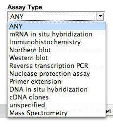
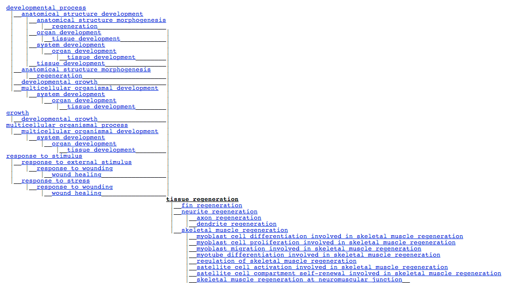
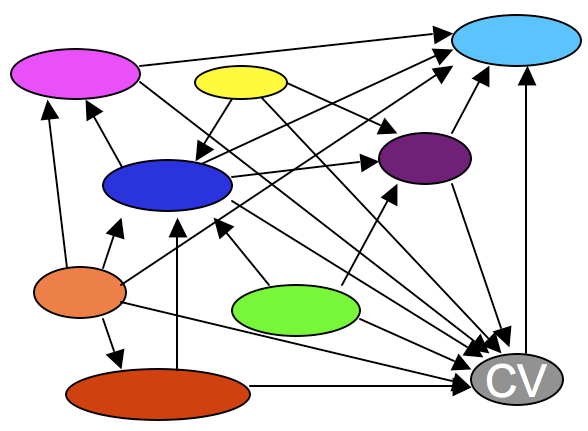
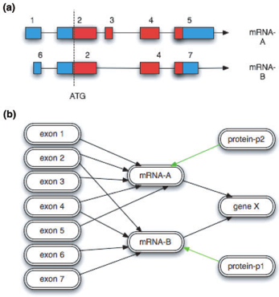
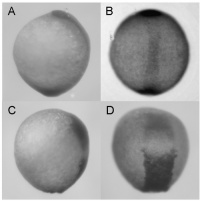

<div id="mw-page-base" class="noprint">

</div>

<div id="mw-head-base" class="noprint">

</div>

<div id="content" class="mw-body" role="main">

<span id="top"></span>

<div id="mw-js-message" style="display:none;">

</div>


# <span dir="auto">Chado Tutorial 2013</span>

<div id="bodyContent">

<div id="siteSub">

From GMOD

</div>

<div id="contentSub">

(Redirected from [Chado
Tutorial](http://gmod.org/mediawiki/index.php?title=Chado_Tutorial&redirect=no "Chado Tutorial"))

</div>

<div id="jump-to-nav" class="mw-jump">

Jump to: [navigation](#mw-navigation), [search](#p-search)

</div>

<div id="mw-content-text" class="mw-content-ltr" lang="en" dir="ltr">

This <a href="Chado" class="mw-redirect" title="Chado">Chado</a>
tutorial was presented by [Scott Cain](User:Scott "User:Scott") as part
of the [2013 GMOD Summer
School](2013_GMOD_Summer_School "2013 GMOD Summer School").

Chado is the database schema of the GMOD project. This session
introduces database concepts, and then provides an overview of Chado's
design and architecture, and then goes into detail about how to use a
Chado database.

  

<div id="toc" class="toc">

<div id="toctitle">

## Contents

</div>

- [<span class="tocnumber">1</span>
  <span class="toctext">Theory</span>](#Theory)
  - [<span class="tocnumber">1.1</span>
    <span class="toctext">Introduction</span>](#Introduction)
    - [<span class="tocnumber">1.1.1</span>
      <span class="toctext">Database
      Terminology</span>](#Database_Terminology)
      - [<span class="tocnumber">1.1.1.1</span>
        <span class="toctext">What's a
        database?</span>](#What.27s_a_database.3F)
      - [<span class="tocnumber">1.1.1.2</span>
        <span class="toctext">SQL</span>](#SQL)
  - [<span class="tocnumber">1.2</span> <span class="toctext">Why
    Chado?</span>](#Why_Chado.3F)
  - [<span class="tocnumber">1.3</span> <span class="toctext">Chado
    Architecture: Modules</span>](#Chado_Architecture:_Modules)
    - [<span class="tocnumber">1.3.1</span>
      <span class="toctext">Extensible</span>](#Extensible)
    - [<span class="tocnumber">1.3.2</span>
      <span class="toctext">Plus</span>](#Plus)
    - [<span class="tocnumber">1.3.3</span> <span class="toctext">Module
      Caveats</span>](#Module_Caveats)
  - [<span class="tocnumber">1.4</span> <span class="toctext">Exploring
    the schema</span>](#Exploring_the_schema)
    - [<span class="tocnumber">1.4.1</span>
      <span class="toctext">Sequence Module</span>](#Sequence_Module)
      - [<span class="tocnumber">1.4.1.1</span>
        <span class="toctext">Features</span>](#Features)
    - [<span class="tocnumber">1.4.2</span> <span class="toctext">CV
      (Controlled Vocabularies)
      Module</span>](#CV_.28Controlled_Vocabularies.29_Module)
      - [<span class="tocnumber">1.4.2.1</span>
        <span class="toctext">Controlled
        Vocabularies</span>](#Controlled_Vocabularies)
      - [<span class="tocnumber">1.4.2.2</span>
        <span class="toctext">Ontologies</span>](#Ontologies)
      - [<span class="tocnumber">1.4.2.3</span>
        <span class="toctext">CVs and Ontologies in
        Chado</span>](#CVs_and_Ontologies_in_Chado)
        - [<span class="tocnumber">1.4.2.3.1</span>
          <span class="toctext">Data Integrity</span>](#Data_Integrity)
        - [<span class="tocnumber">1.4.2.3.2</span>
          <span class="toctext">Data Portability and
          Standardization</span>](#Data_Portability_and_Standardization)
        - [<span class="tocnumber">1.4.2.3.3</span>
          <span class="toctext">Complexity</span>](#Complexity)
    - [<span class="tocnumber">1.4.3</span>
      <span class="toctext">Opening our sample
      database</span>](#Opening_our_sample_database)
    - [<span class="tocnumber">1.4.4</span> <span class="toctext">Our
      first example query</span>](#Our_first_example_query)
    - [<span class="tocnumber">1.4.5</span>
      <span class="toctext">General Module</span>](#General_Module)
      - [<span class="tocnumber">1.4.5.1</span>
        <span class="toctext">IDs</span>](#IDs)
        - [<span class="tocnumber">1.4.5.1.1</span>
          <span class="toctext">Public IDs</span>](#Public_IDs)
        - [<span class="tocnumber">1.4.5.1.2</span>
          <span class="toctext">Private IDs</span>](#Private_IDs)
      - [<span class="tocnumber">1.4.5.2</span>
        <span class="toctext">IDs in Chado</span>](#IDs_in_Chado)
    - [<span class="tocnumber">1.4.6</span>
      <span class="toctext">Properties</span>](#Properties)
      - [<span class="tocnumber">1.4.6.1</span>
        <span class="toctext">Relationships</span>](#Relationships)
      - [<span class="tocnumber">1.4.6.2</span>
        <span class="toctext">Locations</span>](#Locations)
        - [<span class="tocnumber">1.4.6.2.1</span>
          <span class="toctext">Interbase
          Coordinates</span>](#Interbase_Coordinates)
        - [<span class="tocnumber">1.4.6.2.2</span>
          <span class="toctext">Location
          Chains</span>](#Location_Chains)
        - [<span class="tocnumber">1.4.6.2.3</span>
          <span class="toctext">featureloc
          Table</span>](#featureloc_Table)
      - [<span class="tocnumber">1.4.6.3</span>
        <span class="toctext">Example: Gene</span>](#Example:_Gene)
      - [<span class="tocnumber">1.4.6.4</span>
        <span class="toctext">Example: Computational
        Analysis</span>](#Example:_Computational_Analysis)
      - [<span class="tocnumber">1.4.6.5</span>
        <span class="toctext">Other Feature
        Annotations</span>](#Other_Feature_Annotations)
      - [<span class="tocnumber">1.4.6.6</span>
        <span class="toctext">Extending Chado: Properties tables and new
        modules</span>](#Extending_Chado:_Properties_tables_and_new_modules)
- [<span class="tocnumber">2</span>
  <span class="toctext">Practice</span>](#Practice)
  - [<span class="tocnumber">2.1</span>
    <span class="toctext">Prerequisites</span>](#Prerequisites)
    - [<span class="tocnumber">2.1.1</span>
      <span class="toctext">PostgreSQL</span>](#PostgreSQL)
      - [<span class="tocnumber">2.1.1.1</span>
        <span class="toctext">Edit config
        files</span>](#Edit_config_files)
      - [<span class="tocnumber">2.1.1.2</span>
        <span class="toctext">Create a gmod
        user</span>](#Create_a_gmod_user)
    - [<span class="tocnumber">2.1.2</span>
      <span class="toctext">BioPerl</span>](#BioPerl)
    - [<span class="tocnumber">2.1.3</span> <span class="toctext">Let's
      Go!</span>](#Let.27s_Go.21)
    - [<span class="tocnumber">2.1.4</span>
      <span class="toctext">Environment
      Variables</span>](#Environment_Variables)
  - [<span class="tocnumber">2.2</span> <span class="toctext">Installing
    Chado</span>](#Installing_Chado)
    - [<span class="tocnumber">2.2.1</span> <span class="toctext">Saving
      your progress to this
      point</span>](#Saving_your_progress_to_this_point)
    - [<span class="tocnumber">2.2.2</span> <span class="toctext">A Note
      about Redos</span>](#A_Note_about_Redos)
  - [<span class="tocnumber">2.3</span> <span class="toctext">Preparing
    GFF data for loading</span>](#Preparing_GFF_data_for_loading)
    - [<span class="tocnumber">2.3.1</span>
      <span class="toctext">Working with Large GFF
      files</span>](#Working_with_Large_GFF_files)
    - [<span class="tocnumber">2.3.2</span>
      <span class="toctext">Loading GFF3</span>](#Loading_GFF3)
    - [<span class="tocnumber">2.3.3</span>
      <span class="toctext">Capturing the output to check for
      problems</span>](#Capturing_the_output_to_check_for_problems)
    - [<span class="tocnumber">2.3.4</span> <span class="toctext">Really
      loading data</span>](#Really_loading_data)
      - [<span class="tocnumber">2.3.4.1</span>
        <span class="toctext">Try again</span>](#Try_again)
  - [<span class="tocnumber">2.4</span> <span class="toctext">Loading
    other data</span>](#Loading_other_data)
- [<span class="tocnumber">3</span> <span class="toctext">Chado for
  Expression, Genotype, Phenotype, and Natural
  Diversity</span>](#Chado_for_Expression.2C_Genotype.2C_Phenotype.2C_and_Natural_Diversity)
  - [<span class="tocnumber">3.1</span>
    <span class="toctext">Expression</span>](#Expression)
    - [<span class="tocnumber">3.1.1</span> <span class="toctext">What
      defines an expression
      pattern?</span>](#What_defines_an_expression_pattern.3F)
    - [<span class="tocnumber">3.1.2</span> <span class="toctext">How
      does Chado deal with this
      variety?</span>](#How_does_Chado_deal_with_this_variety.3F)
    - [<span class="tocnumber">3.1.3</span>
      <span class="toctext">FlyBase Example</span>](#FlyBase_Example)
    - [<span class="tocnumber">3.1.4</span> <span class="toctext">Chado
      Allows</span>](#Chado_Allows)
    - [<span class="tocnumber">3.1.5</span> <span class="toctext">Table:
      expression</span>](#Table:_expression)
    - [<span class="tocnumber">3.1.6</span> <span class="toctext">Table:
      expression_cvterm</span>](#Table:_expression_cvterm)
  - [<span class="tocnumber">3.2</span>
    <span class="toctext">Genotype</span>](#Genotype)
    - [<span class="tocnumber">3.2.1</span> <span class="toctext">Table:
      genotype</span>](#Table:_genotype)
    - [<span class="tocnumber">3.2.2</span> <span class="toctext">Table:
      feature_genotype</span>](#Table:_feature_genotype)
  - [<span class="tocnumber">3.3</span>
    <span class="toctext">Environment</span>](#Environment)
    - [<span class="tocnumber">3.3.1</span> <span class="toctext">Table:
      environment</span>](#Table:_environment)
    - [<span class="tocnumber">3.3.2</span> <span class="toctext">Table:
      environment_cvterm</span>](#Table:_environment_cvterm)
  - [<span class="tocnumber">3.4</span> <span class="toctext">Phenotype,
    Natural Diversity and Atlas
    Support</span>](#Phenotype.2C_Natural_Diversity_and_Atlas_Support)

</div>

## <span id="Theory" class="mw-headline">Theory</span>

### <span id="Introduction" class="mw-headline">Introduction</span>

#### <span id="Database_Terminology" class="mw-headline">Database Terminology</span>

Or six years of school in 15 minutes or less.

- [A Brief Guide to
  Databases](A_Brief_Guide_to_Databases "A Brief Guide to Databases")
- [Chado Tables](Chado_Tables "Chado Tables")

##### <span id="What.27s_a_database.3F" class="mw-headline">What's a [database](Databases_and_GMOD "Databases and GMOD")?</span>

- Chado is a [schema](Glossary#Schema "Glossary"), a database design - a
  blueprint for a database containing genomic data
- Distinct from
  - [Database Management System
    (DBMS)](Glossary#Database_Management_System "Glossary")
    - Software system for storing databases
    - *e.g.,* Oracle, [PostgreSQL](PostgreSQL "PostgreSQL"),
      [MySQL](MySQL "MySQL")
  - Database, a very loose term
    - Any set of organized data that is readable by a computer
    - A web site with database driven content, e.g., FlyBase
    - Schema + DBMS + Data

##### <span id="SQL" class="mw-headline">SQL</span>

SQL is a standardized query language for defining and manipulating
databases. Chado uses it. SQL is supported by all major DBMSs.

[FlyBase Field Mapping
Tables](FlyBase_Field_Mapping_Tables "FlyBase Field Mapping Tables")
shows some example SQL that queries the FlyBase Chado database. (Caveat:
FlyBase sometimes uses Chado in ways that no other organizations do.)

  
**Will SQL be on the test?**

No, we aren't going to teach in-depth SQL in this course but we will use
it in examples and show how to write queries in Chado.

You *can* do basics with Chado without knowing SQL. Many common tasks
already have scripts written for them. However, as you get more into
using Chado, you will find that a working knowledge of SQL is necessary.

### <span id="Why_Chado.3F" class="mw-headline">Why Chado?</span>

- **Integration**
  - Supports many types of data, integrates with many tools
- **Modular**
  - Use only what you need, ignore the rest
- **Extensible**
  - Write your own modules and properties
- **Widely used**
  - [FlyBase](Category:FlyBase "Category:FlyBase") - Chado started here,
    large diverse dataset and organization
  - <a href="http://xenbase.org" class="external text"
    rel="nofollow">Xenbase</a> - Smaller, but with several IT staff
  - [ParameciumDB](ParameciumDB "ParameciumDB") - Smaller still,
    complete GMOD shop, including Chado
  - <a href="http://www.igs.umaryland.edu" class="external text"
    rel="nofollow">IGS</a> - Large-scale annotation/comparative data in
    Chado, more than a dozen active developers
  - Plus AphidBase, BeeBase, BeetleBase, BovineBase, ...
- **Great Community of Support**
  - [Mailing List](GMOD_Mailing_Lists "GMOD Mailing Lists")

### <span id="Chado_Architecture:_Modules" class="mw-headline">Chado Architecture: Modules</span>

The Chado schema is built with a set of *modules*. A Chado module is a
set of database tables and relationships that stores information about a
well-defined area of biology, such as sequence or attribution.

<a href="File:ChadoModules.png" class="image"></a>

(Also available as a
<a href="../mediawiki/images/3/36/ChadoModules.ppt" class="internal"
title="ChadoModules.ppt">PowerPoint animation</a>)

Arrows are dependencies between modules. Dependencies indicate one or
more *foreign keys* linking modules.

- [General](Chado_General_Module "Chado General Module") - Identifying
  things within the DB to the outside world, and identifying things from
  other databases.
- [Controlled Vocabulary (cv)](Chado_CV_Module "Chado CV Module") -
  Controlled vocabularies and ontologies
- [Publication
  (pub)](Chado_Publication_Module "Chado Publication Module") -
  Publications and attribution
- [Organism](Chado_Organism_Module "Chado Organism Module") - Describes
  species; pretty simple. Phylogeny module stores relationships.
- [Sequence](Chado_Sequence_Module "Chado Sequence Module") - Genomic
  features and things that can be tied to or descend from genomic
  features.
- [Map](Chado_Map_Module "Chado Map Module") - Maps without sequence
- [Genetic](Chado_Genetic_Module "Chado Genetic Module") - Genetic data
  and genotypes
- [Companalysis](Chado_Companalysis_Module "Chado Companalysis Module") -
  Storage of Computational sequence analysis. The key concept is that
  the results of a computational analysis can be interpreted or
  described as a sequence feature.

#### <span id="Extensible" class="mw-headline">Extensible</span>

These modules have been contributed to Chado by users who developed
them.

- [Mage](Chado_Mage_Module "Chado Mage Module") - Microarray data
- [Stock](Chado_Stock_Module "Chado Stock Module") - Specimens and
  biological collections
- [Natural
  Diversity](Chado_Natural_Diversity_Module_Working_Group "Chado Natural Diversity Module Working Group") -
  geolocation, phenotype, genotype
- Plus property tables in many modules.

#### <span id="Plus" class="mw-headline">Plus</span>

- [Audit](Chado_Audit_Module "Chado Audit Module") - Database audit
  trail
- [Expression](Chado_Expression_Module "Chado Expression Module") -
  Summaries of RNA and protein expression
- [Library](Chado_Library_Module "Chado Library Module") - Descriptions
  of molecular libraries
- [Phenotype](Chado_Phenotype_Module "Chado Phenotype Module") -
  Phenotypic data
- [Phylogeny](Chado_Phylogeny_Module "Chado Phylogeny Module") -
  Organisms and phylogenetic trees

#### <span id="Module_Caveats" class="mw-headline">Module Caveats</span>

All modules are *blessed*, but some modules are *more blessed* than
others.

The General, CV, Publication, Organism, Sequence and Companalysis
modules are all widely used and cleanly designed. After that modules
become less frequently used (Stock, Expression, Phenotype, Mage). Also
several modules are not as cleanly separated as we would like them to
be. Phenotypic data is spread over several modules. Organism and
Phylogeny overlap. [CMap](CMap.1 "CMap") is all about maps, but it does
not use the Map module.

From Jeff Bowes, at XenBase:

<div class="quotebox">

As for Chado, we are more Chadoish than exactly Chado. We use the core
modules with few changes - feature, cv, general, analysis. Although I
prefer to add columns to tables when it is reasonable and limit the use
of property tables (too many left outer joins). We use a slightly
modified version of the phylogeny module. We have developed completely
different modules for community, literature, anatomy and gene
expression. If there is a PATO compatible Chado Phenotype solution we'd
prefer to go with that. Although, it might cause problems that we have a
separate anatomy module as opposed to using cvterm to store anatomy.

</div>

In other words the ideal is good, but implementation and usage is
uneven. See the <a href="../extras/2008GMODCommunitySurvey.html#Chado"
class="external text" rel="nofollow">2008 GMOD Community survey</a> for
what gets used.

### <span id="Exploring_the_schema" class="mw-headline">Exploring the schema</span>

Rather than simply listing out the modules and what is stored in them,
we'll take a data-centric view and imagine what we want to store in our
database, then learn the Chado way of storing it.

During this course you'll be working with genome annotation data from
[MAKER](MAKER.1 "MAKER"). We'll simplify this and start by considering
that we have annotation on chromosomes that we want to store in our
database. These are the sort of things we want to store:

- chromosomes
- genes
- gene predictions
- tRNAs
- BLAST matches

You may have worked with databases in the past where each type of thing
you want to store is given its own table. That is, we'd have a table for
genes, one for chromosomes, tRNAs, etc. The problem with this sort of
design is that, as you encounter new types of things, you have to create
new tables to store them. Also, many of these 'thing' tables are going
to look very much alike.

Chado is what is a *generic* schema which, in effect, means that data
are abstracted wherever possible to prevent duplication in both the
design and data itself. So, instead of one table for each type of
'thing', we just have one table to hold 'things', regardless of their
types. In the Chado world these are known as 'features'. (This database
design pattern is called the
<a href="https://en.wikipedia.org/wiki/Entity-attribute-value_model"
class="external text" rel="nofollow">Entity-Attribute-Value model</a>.)

This brings us to the Sequence Module, which contains the central
feature table.

#### <span id="Sequence_Module" class="mw-headline">Sequence Module</span>

[Sequence Module](Chado_Sequence_Module "Chado Sequence Module")

The sequence module is used to manage genomic features.

##### <span id="Features" class="mw-headline">Features</span>

Chado defines a *feature* to be a region of a biological polymer
(typically a DNA, RNA, or a polypeptide molecule) or an aggregate of
regions on this polymer. A region can be an entire chromosome, or a
junction between two bases. Features are typed according to the
<a href="http://www.sequenceontology.org/" class="external text"
rel="nofollow">Sequence Ontology (SO)</a>, they can be localized
relative to other features, and they can form part-whole and other
relationships with other features.

Features are stored in the [feature
table](Chado_Sequence_Module#Table:_feature "Chado Sequence Module").

| Table: feature |      |            |         |             |     |
|----------------|------|------------|---------|-------------|-----|
| feature_id     | name | uniquename | type_id | is_analysis | ... |

Within this feature table we can store all types of features and keep
track of their type with the type_id field. It's conceivable to store
the named value of each type in this field, like 'gene', 'tRNA', etc.
but this would be prone to things like spelling errors, not to mention
disagreement of the definition of some of these terms.

So solve this, all features are linked to a specific type in a
controlled vocabulary or ontology. These are stored in the cv module.

#### <span id="CV_.28Controlled_Vocabularies.29_Module" class="mw-headline">CV (Controlled Vocabularies) Module</span>

<a href="http://gmod.org/Chado_CV_Module" class="external text"
rel="nofollow">Controlled Vocabulary Module Tables</a>

The CV module implements *controlled vocabularies* and their more
complex cousins, *ontologies*.

##### <span id="Controlled_Vocabularies" class="mw-headline">Controlled Vocabularies</span>

A *controlled vocabulary* (CV) is a list of terms from which a value
must come. CVs are widely used in all databases, not just biological
ones. Pull down menus are often used to present CVs to users in query or
annotation interfaces.

|  |  |
|----|----|
| <a href="http://zfin.org" class="external text"
rel="nofollow">ZFIN's</a> Assay Type CV | <a href="File:ZfinAssayTypePullDown.png" class="image"
title="ZFIN&#39;s Assay Type CV"></a> |

##### <span id="Ontologies" class="mw-headline">Ontologies</span>

Controlled vocabularies are simple lists of terms. *Ontologies* are
terms plus rules and relationships betwen the terms. The Gene Ontology
(GO) and Sequence Ontology (SO) are the two best known ontologies, but
there are many more available from
<a href="http://www.obofoundry.org/" class="external text"
rel="nofollow">OBO</a>.

Ontologies can be incredibly complex with many relationships between
terms. Representing them and reasoning with them is non-trivial, but the
CV module helps with both.

| <a href="http://flybase.org" class="external text"
rel="nofollow">FlyBase</a> CV Term Viewer showing GO term "tissue regeneration" |
|----|
| <a href="File:FlyBaseCVTermViewer.png" class="image"></a> |

##### <span id="CVs_and_Ontologies_in_Chado" class="mw-headline">CVs and Ontologies in Chado</span>

[Chado CV Module](Chado_CV_Module "Chado CV Module")

<a href="File:ChadoModulesCV.png" class="image"></a>

(See the <a
href="http://gmod.org/wiki/index.php/Chado_CV_Module#Table:_cvterm#Table:_cvterm"
class="external text" rel="nofollow">CVTerm table</a> referencing table
list.)

Every other module depends on on the CV module. CVs and ontologies are
central to Chado's design philosophy. Why?

###### <span id="Data_Integrity" class="mw-headline">Data Integrity</span>

Using CVs (and enforcing their use as Chado does) ensures that your data
stays consistent. For example, in the most simple case it prevents your
database from using several different values all to mean the same thing
(e.g., "unknown", "unspecified", "missing", "other", " ",...), and it
prevents misspellings ("sagital" instead of "sagittal") and typos.

###### <span id="Data_Portability_and_Standardization" class="mw-headline">Data Portability and Standardization</span>

If you are studying developmental processes and you use the Gene
Ontology's *biological process* terms then your data can be easily
shared *and integrated* with data from other researchers. If you create
your set of terms or just enter free text (egads!), then it will require
a lot of human intervention to convert your data to a standard
nomenclature so it can be integrated with others.

Using an established ontology when one exists usually involves some
compromises, but it greatly increases the usability of your data to
others (and to yourself).

###### <span id="Complexity" class="mw-headline">Complexity</span>

Controlled vocabularies are not particularly complex - they are just
lists of terms. Ontologies, however, can be very complex, as shown by
the GO example above. This complexity could be ignored. You could, for
example, convert GO to a controlled vocabulary - a very long list of
terms. You would still have data integrity and portability, and it
wouldn't be as complex.

It also would not be as powerful. Ontologies support reasoning about the
terms in them and this can be very useful. With GO, for example, you can
ask

<div class="quotebox">

Show me all genes involved in *anatomical structure development*

</div>

and get back genes directly tagged with *anatomical structure
development*, plus any genes tagged with any of that term's sub-terms,
from *organ development* to *regulation of skeletal muscle
regeneration*. If you convert GO to just a list of terms, you can no
longer answer that question.

The Chado CV Module supports such complex queries with ontologies by
pre-calculating the *[transitive
closure](Chado_CV_Module#Transitive_Closure "Chado CV Module")* of all
terms in an ontology. There is a great explanation of transitive closure
on the [Chado CV Module
page](Chado_CV_Module#Transitive_Closure "Chado CV Module"). Also see
the description of these 3 tables:

- [cvterm](Chado_CV_Module#Table:_cvterm "Chado CV Module")
- [cvterm_relationship](Chado_CV_Module#Table:_cvterm_relationship "Chado CV Module")
- [cvtermpath](Chado_CV_Module#Table:_cvtermpath "Chado CV Module")

We won't go into any more detail on it here.

#### <span id="Opening_our_sample_database" class="mw-headline">Opening our sample database</span>

    $ psql drupal

#### <span id="Our_first_example_query" class="mw-headline">Our first example query</span>

Up to this point we've seen how to store features using the feature
table as well as rigidly define what types of things they are using the
cv module tables. Here is an SQL example of how to query some very basic
information about all gene features in our database:

<div class="mw-geshi mw-code mw-content-ltr" dir="ltr">

<div class="sql source-sql">

``` de1
 SELECT gene.feature_id, gene.uniquename, gene.name
   FROM feature gene
        JOIN cvterm c ON gene.type_id = c.cvterm_id
  WHERE c.name = 'gene' AND organism_id = 13;
```

</div>

</div>

This should return something like:

     feature_id |                   uniquename                   |                      name
    ------------+------------------------------------------------+------------------------------------------------
            405 | maker-scf1117875582023-snap-gene-0.0           | maker-scf1117875582023-snap-gene-0.0
            409 | maker-scf1117875582023-snap-gene-0.3           | maker-scf1117875582023-snap-gene-0.3
            415 | genemark-scf1117875582023-abinit-gene-0.42     | genemark-scf1117875582023-abinit-gene-0.42
           1011 | maker-scf1117875582023-snap-gene-1.0           | maker-scf1117875582023-snap-gene-1.0
           1018 | maker-scf1117875582023-snap-gene-1.4           | maker-scf1117875582023-snap-gene-1.4
           1022 | maker-scf1117875582023-snap-gene-1.1           | maker-scf1117875582023-snap-gene-1.1
           1027 | maker-scf1117875582023-snap-gene-1.2           | maker-scf1117875582023-snap-gene-1.2
           1032 | maker-scf1117875582023-snap-gene-1.7           | maker-scf1117875582023-snap-gene-1.7
           1038 | maker-scf1117875582023-snap-gene-1.5           | maker-scf1117875582023-snap-gene-1.5
           1698 | snap_masked-scf1117875582023-abinit-gene-2.4   | snap_masked-scf1117875582023-abinit-gene-2.4
    ...

Type `q` to escape the listing.

Lists of things are great, but we're going to need to do a lot more with
our genomic data than keep lists of features. First, we need to be able
to identify them properly. This may seem straightforward, but creating
one column per ID type in feature would be a bad idea, since any given
feature could have dozens of different identifiers from different data
sources. The General Module helps resolve this.

#### <span id="General_Module" class="mw-headline">General Module</span>

The General module is about identifying things within this DB to the
outside world, and identifying things from the outside world (i.e.,
other databases) within this database.

##### <span id="IDs" class="mw-headline">IDs</span>

[General module tables](Chado_General_Module "Chado General Module")

Biological databases have *public* and *private* IDs and they are
usually different things.

###### <span id="Public_IDs" class="mw-headline">Public IDs</span>

These are shown on web pages and in publications. These are also known
as *accession numbers*.

| GO + 0043565 = GO:0043565                 |
|-------------------------------------------|
| InterPro + IPR001356 = InterPro:IPR001356 |
| YourDB + whatever = YourDB:whatever       |

Public IDs tend to be *alternate keys* inside the database: they do
uniquely identify objects in the database.

###### <span id="Private_IDs" class="mw-headline">Private IDs</span>

These are used inside the database and are not meant to be shown or
published. Tend to be long integers. There are many more private IDs
than public IDs.

Private IDs are used for *primary keys* and *foreign keys*.

Most DBMSs have built-in mechanisms for generating private IDs.

##### <span id="IDs_in_Chado" class="mw-headline">IDs in Chado</span>

The [General module](Chado_General_Module "Chado General Module")
defines *public* IDs of

- items defined in this databases, and
- items defined in other databases, that are used or referenced in this
  database.

In fact, those two classes of IDs are defined in exactly the same way,
in the <a
href="http://gmod.org/Chado_General_Module#Table:_dbxref#Table:_dbxref"
class="external text" rel="nofollow">dbxref table</a>.

In Chado every table (in every module) defines its own private IDs.

  

#### <span id="Properties" class="mw-headline">Properties</span>

So far we've only seen very basic information for each feature stored.
Because the feature table was designed to be very generic and store all
feature types, attributes specific to only some types can't be stored
there. It wouldn't make sense, for example, to have a column called
'gene_product_name', since that column would be empty for all the
features, like chromosomes, that aren't gene products.

These feature-specific attributes are known as 'properties' of a feature
in Chado. They are stored in a table called <a
href="http://gmod.org/wiki/index.php/Chado_Sequence_Module#Table:_featureprop#Table:_featureprop"
class="external text" rel="nofollow">featureprop</a>.

| Table: featureprop |            |         |       |      |
|--------------------|------------|---------|-------|------|
| featureprop_id     | feature_id | type_id | value | rank |

You may have noticed that the featureprop table shares a 'type_id'
column with the feature table. Properties of features are typed
according to a controlled vocabulary just as the features themselves
are. This helps to ensure that anyone using the same vocabularies are
encoding their property assertions in the same way.

Using feature properties we can now describe our features as richly as
needed, but our features are still independent of one another. Because
many of the features we're storing have some sort of relationship to one
another (such as genes and their polypeptide end-products), our schema
needs to accommodate this.

##### <span id="Relationships" class="mw-headline">Relationships</span>

Relationships between features are stored in the <a
href="http://gmod.org/wiki/index.php/Chado_Sequence_Module#Table:_feature_relationship#Table:_feature_relationship"
class="external text" rel="nofollow">feature_relationship table</a>.

| Table: feature_relationship |            |           |         |      |     |
|-----------------------------|------------|-----------|---------|------|-----|
| feature_relationship_id     | subject_id | object_id | type_id | rank | ... |

Features can be arranged in graphs, e.g. "exon *part_of* transcript
*part_of* gene"; If type is thought of as a verb, then each arc or edge
makes a statement:

- Subject *verb* Object, or
- Child *verb* Parent, or
- Contained *verb* Container, or
- Subfeature *verb* Feature

Again, notice the use of controlled vocabularies (type_id) to define the
relationship between features.

One might think of a relationship between a gene and chromosome as
'located_on', and store that as a feature_relationship entry between the
two. If you did, pat yourself on the back for Chado-ish thinking, but
there's a better way to handle locatable features, since a relationship
entry alone wouldn't actually say WHERE the feature was located, only
that it was.

##### <span id="Locations" class="mw-headline">Locations</span>

Location describes where a feature is/comes from relative to another
feature. Some features such as chromosomes are not localized in sequence
coordinates, though contigs/assemblies which make up the chromosomes
could be.

Locations are stored in the <a
href="http://gmod.org/wiki/index.php/Chado_Sequence_Module#Table:_featureloc#Table:_featureloc"
class="external text" rel="nofollow">featureloc table</a>, and a feature
can have zero or more featureloc records. Features will have either

- one featureloc record, for localized features for which the location
  is known, or
- zero featureloc records, for unlocalized features such as chromosomes,
  or for features for which the location is not yet known, such as a
  gene discovered using classical genetics techniques.
- Features with multiple featurelocs are explained below.

(For a good explanation of how features are located in Chado see <a
href="http://gmod.org/wiki/index.php/Chado_Sequence_Module#Feature_Locations#Feature_Locations"
class="external text" rel="nofollow">Feature Locations</a>. This
explanation is excerpted from that.)

###### <span id="Interbase_Coordinates" class="mw-headline">Interbase Coordinates</span>

This is covered in more detail on the [GMOD web
site](Introduction_to_Chado#Interbase_Coordinates "Introduction to Chado").

<a href="File:Interbase.png" class="image"></a>

A featureloc record specifies an interval in *interbase sequence
coordinates*, bounded by the fmin and fmax columns, each representing
the lower and upper linear position of the *boundary* between bases or
base pairs (with directionality indicated by the strand column).

Interbase coordinates were chosen over the base-oriented coordinate
system because the math is easier, and it cleanly supports zero-length
features such as splice sites and insertion points.

###### <span id="Location_Chains" class="mw-headline">Location Chains</span>

Chado supports *location chains*. For example, locating an exon relative
to a contig that is itself localized relative to a chromosome. The
majority of Chado instances will not require this flexibility; features
are typically located relative to chromosomes or chromosomes arms.

The ability to store such localization networks or location graphs can
be useful for unfinished genomes or parts of genomes such as
heterochromatin, in which it is desirable to locate features relative to
stable contigs or scaffolds, which are themselves localized in an
unstable assembly to chromosomes or chromosome arms.

Localization chains do not necessarily only span assemblies - protein
domains may be localized relative to polypeptide features, themselves
localized to a transcript (or to the genome, as is more common). Chains
may also span sequence alignments.

###### <span id="featureloc_Table" class="mw-headline">featureloc Table</span>

Feature location information is stored in the <a
href="http://gmod.org/wiki/index.php/Chado_Sequence_Module#Table:_featureloc#Table:_featureloc"
class="external text" rel="nofollow">featureloc table</a>.

| Table: featureloc |            |               |      |      |     |
|-------------------|------------|---------------|------|------|-----|
| featureloc_id     | feature_id | srcfeature_id | fmin | rank | ... |

##### <span id="Example:_Gene" class="mw-headline">Example: Gene</span>

**Note:** This example and some of the figures are extracted from
*<a href="http://gmod.org/wiki/index.php/Image:A_Chado_Case_Study.pdf"
class="external text" rel="nofollow">A Chado case study: an
ontology-based modular schema for representing genome-associated
biological information</a>*, by Christopher J. Mungall, David B. Emmert,
and the FlyBase Consortium (2007)

How is a "central dogma" gene represented in Chado?

  
<a href="File:CentralDogma.png" class="image"></a>

How do we represent these exons, mRNAs, proteins, and there
relationships between them?

<table>
<colgroup>
<col style="width: 50%" />
<col style="width: 50%" />
</colgroup>
<tbody>
<tr class="odd">
<td><table class="wikitable">
<thead>
<tr class="header">
<th colspan="6">Table: feature</th>
</tr>
</thead>
<tbody>
<tr class="odd">
<th>feature _id</th>
<th>name</th>
<th>uniquename</th>
<th>type_id</th>
<th>is_ analysis</th>
<th></th>
</tr>
&#10;<tr class="odd">
<td>10456</td>
<td>exon 1</td>
<td>genex_exon1</td>
<td>(exon)</td>
<td>false</td>
<td></td>
</tr>
<tr class="even">
<td>10457</td>
<td>exon 2</td>
<td>genex_exon2</td>
<td>(exon)</td>
<td>false</td>
<td></td>
</tr>
<tr class="odd">
<td>10458</td>
<td>exon 3</td>
<td>genex_exon3</td>
<td>(exon)</td>
<td>false</td>
<td></td>
</tr>
<tr class="even">
<td>10459</td>
<td>exon 4</td>
<td>genex_exon4</td>
<td>(exon)</td>
<td>false</td>
<td></td>
</tr>
<tr class="odd">
<td>10460</td>
<td>exon 5</td>
<td>genex_exon5</td>
<td>(exon)</td>
<td>false</td>
<td></td>
</tr>
<tr class="even">
<td>10461</td>
<td>exon 6</td>
<td>genex_exon6</td>
<td>(exon)</td>
<td>false</td>
<td></td>
</tr>
<tr class="odd">
<td>10462</td>
<td>exon 7</td>
<td>genex_exon7</td>
<td>(exon)</td>
<td>false</td>
<td></td>
</tr>
<tr class="even">
<td>10463</td>
<td>mRNA-A</td>
<td>genex_mRNA-A</td>
<td>(mRNA)</td>
<td>false</td>
<td></td>
</tr>
<tr class="odd">
<td>10464</td>
<td>mRNA-B</td>
<td>genex_mRNA-B</td>
<td>(mRNA)</td>
<td>false</td>
<td></td>
</tr>
<tr class="even">
<td>10465</td>
<td>protein-p2</td>
<td>genex_protein-p2</td>
<td>(polypeptide)</td>
<td>false</td>
<td></td>
</tr>
<tr class="odd">
<td>10466</td>
<td>protein-p1</td>
<td>genex_protein-p1</td>
<td>(polypeptide)</td>
<td>false</td>
<td></td>
</tr>
<tr class="even">
<td>10467</td>
<td>gene X</td>
<td>genex</td>
<td>(polypeptide)</td>
<td>false</td>
<td></td>
</tr>
</tbody>
</table></td>
<td><table class="wikitable">
<thead>
<tr class="header">
<th colspan="6">Table: feature_relationship</th>
</tr>
</thead>
<tbody>
<tr class="odd">
<th>feature_ relationship _id</th>
<th>subject_id</th>
<th>object_id</th>
<th>type_id</th>
<th>rank</th>
<th></th>
</tr>
&#10;<tr class="odd">
<td>589</td>
<td>(exon 1)</td>
<td>(mRNA-A)</td>
<td>(part_of)</td>
<td>0</td>
<td></td>
</tr>
<tr class="even">
<td>590</td>
<td>(exon 2)</td>
<td>(mRNA-A)</td>
<td>(part_of)</td>
<td>0</td>
<td></td>
</tr>
<tr class="odd">
<td>591</td>
<td>(exon 3)</td>
<td>(mRNA-A)</td>
<td>(part_of)</td>
<td>0</td>
<td></td>
</tr>
<tr class="even">
<td>592</td>
<td>(exon 4)</td>
<td>(mRNA-A)</td>
<td>(part_of)</td>
<td>0</td>
<td></td>
</tr>
<tr class="odd">
<td>593</td>
<td>(exon 5)</td>
<td>(mRNA-A)</td>
<td>(part_of)</td>
<td>0</td>
<td></td>
</tr>
<tr class="even">
<td>594</td>
<td>(exon 2)</td>
<td>(mRNA-B)</td>
<td>(part_of)</td>
<td>0</td>
<td></td>
</tr>
<tr class="odd">
<td>595</td>
<td>(exon 4)</td>
<td>(mRNA-B)</td>
<td>(part_of)</td>
<td>0</td>
<td></td>
</tr>
<tr class="even">
<td>596</td>
<td>(exon 6)</td>
<td>(mRNA-B)</td>
<td>(part_of)</td>
<td>0</td>
<td></td>
</tr>
<tr class="odd">
<td>597</td>
<td>(exon 7)</td>
<td>(mRNA-B)</td>
<td>(part_of)</td>
<td>0</td>
<td></td>
</tr>
<tr class="even">
<td>598</td>
<td>(protein-p2)</td>
<td>(mRNA-A)</td>
<td>(derives_from)</td>
<td>0</td>
<td></td>
</tr>
<tr class="odd">
<td>599</td>
<td>(protein-p1)</td>
<td>(mRNA-B)</td>
<td>(derives_from)</td>
<td>0</td>
<td></td>
</tr>
<tr class="even">
<td>600</td>
<td>(mRNA-A)</td>
<td>(gene X)</td>
<td>(part_of)</td>
<td>0</td>
<td></td>
</tr>
<tr class="odd">
<td>601</td>
<td>(mRNA-B)</td>
<td>(gene X)</td>
<td>(part_of)</td>
<td>0</td>
<td></td>
</tr>
</tbody>
</table></td>
</tr>
</tbody>
</table>

##### <span id="Example:_Computational_Analysis" class="mw-headline">Example: Computational Analysis</span>

**Note:** This is example is based on an example by Scott Cain from an
earlier <a
href="http://gmod.org/wiki/index.php/Image:ChadoWorkshopArthopod2008.pdf"
class="external text" rel="nofollow">Chado workshop</a>.

You can store the results of computational analysis such as BLAST or
BLAT runs in the sequence module. Here's an example of you could store a
BLAST highest scoring pair (HSP) result.

With HSP results there are two reference sequences, which means two
entries in the featureloc table. (The analysis and analysisfeature
tables, in the Companalysis module, are used to store information about
how the analysis was done and what scores resulted.)

<a href="File:CompAnalysisFeature.png" class="image"></a>

Every horizontal line becomes a record in the feature table, and every
vertical line becomes a record in the feature_relationship table.

##### <span id="Other_Feature_Annotations" class="mw-headline">Other Feature Annotations</span>

Link to any feature via <a
href="http://gmod.org/wiki/index.php/Chado_Sequence_Module#Table:_feature#Table:_feature"
class="external text" rel="nofollow">feature_id</a>:

- GO terms in <a
  href="http://gmod.org/wiki/index.php/Chado_Sequence_Module#Table:_feature_cvterm#Table:_feature_cvterm"
  class="external text" rel="nofollow">feature_cvterm</a>
- DB links in <a
  href="http://gmod.org/wiki/index.php/Chado_Sequence_Module#Table:_feature_dbxref#Table:_feature_dbxref"
  class="external text" rel="nofollow">feature_dbxref</a>
- Miscellaneous features in <a
  href="http://gmod.org/wiki/index.php/Chado_Sequence_Module#Table:_featureprop#Table:_featureprop"
  class="external text" rel="nofollow">featureprop</a>
- Attribution in <a
  href="http://gmod.org/wiki/index.php/Chado_Sequence_Module#Table:_feature_pub#Table:_feature_pub"
  class="external text" rel="nofollow">feature_pub</a>

##### <span id="Extending_Chado:_Properties_tables_and_new_modules" class="mw-headline">Extending Chado: Properties tables and new modules</span>

Chado was built to be easily extensible. New functionality can be added
by adding new modules. Both the Mage and the Stock modules were added
after Chado had been out for a while. They both addressed needs that
were either not addressed, or were inadequately addressed in the
original release.

Chado can be tailored to an individual organization's needs by using
*property tables*. Property tables are a means to virtually add new
columns without having to modify the schema. Property tables are
included in many modules.

Property tables are incredibly flexible, and they do make Chado
extremely extensible, but they do so at a cost.

- The SQL to get attributes from property tables is much more complex,
  and
- It is more work to enforce constraints on data in properties tables
  then in regular columns.

## <span id="Practice" class="mw-headline">Practice</span>

### <span id="Prerequisites" class="mw-headline">Prerequisites</span>

Using data from [MAKER](MAKER.1 "MAKER").

#### <span id="PostgreSQL" class="mw-headline">PostgreSQL</span>

Already installed PostgreSQL 9.1 via apt-get.

##### <span id="Edit_config_files" class="mw-headline">Edit config files</span>

``` enter
  sudo su
  cd /etc/postgresql/9.1/main/
  less pg_hba.conf
```

At the bottom of the file, we've already changed `ident sameuser` to
`trust`. This means that anyone who is on the local machine is allowed
to connect to any database. If you want to allow people to connect from
other machines, their IP address or a combo of IP address and netmasks
can be used to allow remote access.

If we'd have edited the pg_hba.conf file, we'd have to (re)start the
database server:

``` enter
  /etc/init.d/postgresql restart
  exit # to get out of su
```

##### <span id="Create_a_gmod_user" class="mw-headline">Create a gmod user</span>

Normally, we'd have to switch to the postgres user to create a new
database user, but the ubuntu user is already a superuser. Create a new
user named "gmod":

      createuser gmod
        Shall the new role be a superuser? (y/n) y

#### <span id="BioPerl" class="mw-headline">[BioPerl](BioPerl "BioPerl")</span>

Version 1.6.901 already installed.

#### <span id="Let.27s_Go.21" class="mw-headline">Let's Go!</span>

#### <span id="Environment_Variables" class="mw-headline">Environment Variables</span>

in `~/.bashrc` add:

``` enter
  GMOD_ROOT='/usr/local/gmod'
  export GMOD_ROOT
```

and source the profile:

``` enter
  source ~/.bashrc
```

### <span id="Installing_Chado" class="mw-headline">Installing Chado</span>

``` enter
  cd ~/sources/chado/chado/
  perl Makefile.PL
```

     Use values in '/home/ubuntu/chado/chado/build.conf'? [Y] n

This allows you to specify Pythium when you are asked for a default
organism.

     > "chado" for database name
     > "ubuntu" for database username
     > "Pythium" for the default organism
     > "public" for the schema Chado will reside in

Just hit enter when it asks for a password for user gmod.

This `Makefile.PL` does quite a bit of stuff to get the installation
ready. Among other things it:

- Sets up a variety of database user parameters
- Prepares the SQL files for installation
- It can rebuild <a href="http://search.cpan.org/perldoc?Class::DBI"
  class="external text" rel="nofollow">Class::DBI</a> api for
  <a href="Chado" class="mw-redirect" title="Chado">Chado</a>, but isn't
  now (they are prebuilt for the default schema)
- All the 'normal' stuff that would happen when running `Makefile.PL`,
  like copying `lib` and `bin` files to be ready for installation

<!-- -->

     make
     sudo make install
     make load_schema
     make prepdb

At this point, the installer checks the database to see if the organism
we put in as our default organism is present in the database. Since it
isn't, it will ask us to add it. It does this by automatically executing
a script that comes with Chado, gmod_add_organism.pl. You can execute
this script any time you want to [add organisms to your
database](Load_GFF_Into_Chado#Add_an_Entry_for_Your_Organism "Load GFF Into Chado"):

     Adding Pythium to the database...

     Both genus and species are required; please provide them below

     Organism's genus?  Pythium
     Organism's species?  ultimum
     Organism's abbreviation? [P.ultimum] 
     Comment (can be empty)?  

Continuing on...

     make ontologies
     Available ontologies:
     [1] Relationship Ontology
     [2] Sequence Ontology
     [3] Gene Ontology
     [4] Chado Feature Properties
     [5] Plant Ontology

     Which ontologies would you like to load (Comma delimited)? [0]  1,2,4

You can pick any ontologies you want, but GO will take over an hour to
install, and it doesn't matter to much what you pick, because we are
going to be blowing this database away soon anyway.

#### <span id="Saving_your_progress_to_this_point" class="mw-headline">Saving your progress to this point</span>

It is generally a good idea to save your progress when you are done
loading ontologies before you've attempted to load any other data. That
way, if something goes wrong, it is very easy to restore to this point.
To make a db dump, do this:

     pg_dump chado | bzip2 -c --best > db_w_ontologies.bz2

The `-c` tells `bzip2` to take input on standard in and spit it out on
`stdout`. To restore from a dump, drop and recreate the database and
then uncompress the dump into it, like this:

``` dont
  dropdb chado
  createdb chado
  bzip2 -dc db_w_ontologies.bz2 | psql chado
```

#### <span id="A_Note_about_Redos" class="mw-headline">A Note about Redos</span>

If at some point you feel like you want to rebuild your database from
scratch, you need to get rid of the temporary directory where ontology
files are stored. You can either do this with `rm -rf ./tmp` **(be very
careful about that `./` in front of `tmp`)** or with a make target that
was designed for this: `make rm_locks`, which only gets rid of the lock
files but leaves the ontology files in place.

### <span id="Preparing_GFF_data_for_loading" class="mw-headline">Preparing [GFF](GFF "GFF") data for loading</span>

Issues:

- splitting 'annotations' from 'computational analysis'
- very large files
- fasta → gff
- utility scripts for various preparation activities

#### <span id="Working_with_Large_GFF_files" class="mw-headline">Working with Large [GFF](GFF "GFF") files</span>

Large files (more than 3-500,000 rows) can cause headaches for the
[GFF3](GFF3 "GFF3") bulk loader, but genome annotation GFF3 files can
frequently be millions of lines. What to do? The script
`gmod_gff3_preprocessor.pl` will help with this, both by splitting the
files in to reasonable size chunks and sorting the output so that it
make sense.

Note that if your files are already sorted (and in this case, that means
that all parent features come before their child features and lines that
share IDs (like CDSes sometimes do) are together), then all you need to
do is split your files. Frequently files are already sorted and avoiding
sorting is good for two reasons:

1.  It takes a long time to do the sort compared to the split (it parses
    every line, loads it into temporary tables and pulls out lines via
    query to rebuild the GFF file)
2.  The sorting process makes it more difficult to read the resulting
    GFF, since the parent feature will no longer be near the child
    features in the GFF file. Chado doesn't care about that but you
    might.

#### <span id="Loading_GFF3" class="mw-headline">Loading [GFF3](GFF3 "GFF3")</span>

Working with the large number of files that come out of the preprocessor
can be a bit of a headache, so I've 'developed' a few tricks. Basically,
I make a bash script that will execute all of the loads at once. The
easy way (for me) to do this is:

``` enter
  ls *.gff3 > load.sh
  vi load.sh
```

and then use vim regex goodness to write the loader commands into every
line of the file:

     :% s/^/gmod_bulk_load_gff3.pl --analysis -g /

which puts the command at the beginning every line. The `--analysis`
tells the loader that it is working with analysis results, so the scores
need to be store in the companalysis module. While the genes file are
not really analysis results, I faked them to look like FgenesH results
so that Apollo would have something to work with. Then I manually edit
the file to add and remove the few modifications I need:

- Add `--noexon` to the genes file (since it contains both CDS and exon
  features, I don't want the loader to create exon features from CDS
  features).

Then I add `#!/bin/bash` at the top of the file (which isn't actually
needed) and run

     bash load.sh

and it loads all of the files sequentially. I have done this with 60-70
files at a time, letting the loader run for a few days(!)

#### <span id="Capturing_the_output_to_check_for_problems" class="mw-headline">Capturing the output to check for problems</span>

If you are going to let a load run a very long time, you probably should
capture the output to check for problems. There are two ways to do this:

- run inside the `screen` command:

<div class="indent">

     screen -S loader

which creates a new 'screen' separate from your login. Then execute the
load command in the screen. To exit the screen but let your load command
continue running in it, type `ctrl-a` followed by a `d` (to detach) and
you get your original terminal back. To reconnect to the loader screen,
type

     screen -R loader

</div>

- capture `stdout` and `stderr` to a file

<div class="indent">

When you run the load command, you can use redirection to collect the
`stdout` and `stderr` to a file:

     bash load.sh >& load.output

</div>

#### <span id="Really_loading_data" class="mw-headline">Really loading data</span>

OK, let's put the data into chado:

``` enter
  gmod_bulk_load_gff3.pl -g /home/ubuntu/sources/pyu_data/scf1117875582023.gff
```

This should not work (yet!)

  

##### <span id="Try_again" class="mw-headline">Try again</span>

Doh! The loader is trying to tell us that this looks like analysis data
(that is, data produced by computer rather than humans).

<div class="dont">

We need to tell the loader that it is in fact analysis results:

     gmod_bulk_load_gff3.pl --analysis -g /home/ubuntu/sources/pyu_data/scf1117875582023.gff

  

<div class="emphasisbox">

<span style="font-size:120%">Kill, *kill*, **kill!** (ctrl-c)</span> the
load as soon as you see this message:

    There are both CDS and exon features in this file, but
    you did not set the --noexon option, which you probably want.
    Please see `perldoc gmod_bulk_load_gff3.pl for more information.

</div>

</div>

Argh! Now the loader is pointing out that this [GFF](GFF "GFF") file has
both exons and CDS features and Chado prefers something a little
different. While the loader will load this data as written, it won't be
"standard." Instead, we'll add the `--noexon` option (which tells the
loader not to create exon features from the CDS features, since we
already have them). One (at least) more time:

     gmod_bulk_load_gff3.pl --noexon --analysis -g /home/ubuntu/sources/pyu_data/scf1117875582023.gff

Success! (Probably.) If this failed, when rerun, we may need the
`--recreate_cache` option, which recreates a "temporary" table that the
loader uses to keep track of IDs.

### <span id="Loading_other_data" class="mw-headline">Loading other data</span>

[Chado XML](Chado_XML "Chado XML") and [XORT](XORT.1 "XORT"), but
really, [Tripal](Tripal.1 "Tripal") bulk file loader.

## <span id="Chado_for_Expression.2C_Genotype.2C_Phenotype.2C_and_Natural_Diversity" class="mw-headline">Chado for Expression, Genotype, Phenotype, and Natural Diversity</span>

This section is about some of the lesser used Chado Modules.

### <span id="Expression" class="mw-headline">Expression</span>

From an organism database point of view, expression is about turning
this:

<table class="wikitable">
<colgroup>
<col style="width: 50%" />
<col style="width: 50%" />
</colgroup>
<tbody>
<tr class="odd">
<td><a href="File:ZfinGSC.jpg" class="image"></a></td>
<td>Fig. S5 Synergistic effect of zdia2 sMO and profilin I tMO. Embryos
were injected with 8 ng zdia2 sMO (A and B) or co-injected with 4 ng
zdia2 sMO and 4 ng profilin I tMO (C and D). Embryos were incubated
until tail bud stage (10 hpf), fixed and stained with ntl and gsc
riboprobe. Photographs were taken for side view (A and C) and dorsal
view (B and D) after WISH.
<p>From <a href="http://dx.doi.org/10.1371/journal.pone.0003439"
class="external text" rel="nofollow">Lai <em>et al.</em>, 2008 -
Diaphanous-related formin 2 and profilin I are required for gastrulation
cell movements. PLoS One 3(10):e3439</a></p></td>
</tr>
</tbody>
</table>

Into this:

| Gene | Fish | Stage | Anatomy | Assay |
|----|----|----|----|----|
| gsc | wild type (unspecified), MO:diaph2,pfn1 | Bud | prechordal plate | ISH |
| gsc | wild type (unspecified), MO:diaph2 | Bud | prechordal plate | ISH |
| ntla | wild type (unspecified), MO:diaph2,pfn1 | Bud | notochord | ISH |
| ntla | wild type (unspecified), MO:diaph2,pfn1 | Bud | tail bud | ISH |
| ntla | wild type (unspecified), MO:diaph2 | Bud | notochord | ISH |
| ntla | wild type (unspecified), MO:diaph2 | Bud | tail bud | ISH |
| From <a
href="http://zfin.org/cgi-bin/webdriver?MIval=aa-fxfigureview.apg&amp;OID=ZDB-FIG-081103-25"
class="external text" rel="nofollow">ZFIN: Figure: <em>Lai et al.</em>,
2008, Fig. S5</a> |  |  |  |  |

#### <span id="What_defines_an_expression_pattern.3F" class="mw-headline">What defines an expression pattern?</span>

Expression could include a lot of different things, and what it includes
depends on the community:

Gene, or Transcript, or Protein, or ...  
What are we measuring?

Stage  
Store single stages, or stage windows?

What do stage windows or adjacent stages mean: throughout window, or we
aren't sure on the stage (high-throughput)

Strain / Genotype  
What geneotype did we see this on.

Anatomy  
Does "expressed in brain" mean expressed in all, most, or somewhere in
brain?

Assay  
ISN, antibody, probe, ...

Source  
Publication, high-throughput screen, lab, project, ...

Genotype

Environment

Pattern  
Do you want to keep track of homogeneous, graded, spotty

Not Expressed  
Do you keep track of absence? If so, what does it mean? (not *detected*)

Image  
Is an image required or optional?

Strength  
What do strengths mean across different experiments?

#### <span id="How_does_Chado_deal_with_this_variety.3F" class="mw-headline">How does Chado deal with this variety?</span>

*Post-composition*, which is a very Chadoish way of doing things.

- Embrace a minimal definition of what an expression pattern is. In
  Chado, all that is required is a *name*, e.g., *SLC21A in GMOD Course
  Participant kidney after 4 days at NESCent*, or just "GMOD0002347".
- You can also provide a description. If your name is "GMOD0002347",
  this may be a good idea
- Details are then hung off that.

#### <span id="FlyBase_Example" class="mw-headline">FlyBase Example</span>

A specific example from FlyBase:

<div class="indent">

Here is an example of a simple case of the sort of data that
<a href="http://flybase.org" class="external text"
rel="nofollow">FlyBase</a> curates.

The *dpp* transcript is expressed in embryonic stage 13-15 in the
cephalic segment as reported in a
<a href="http://flybase.bio.indiana.edu/reports/FBrf0053806.html"
class="external text" rel="nofollow">paper by Blackman <em>et al.</em>
in 1991</a>.

This would be implemented in the expression module by linking the *dpp*
transcript feature to expression via
[feature_expression](Chado_Tables#Table:_feature_expression "Chado Tables").
We would then link the following cvterms to the expression using
[expression_cvterm](#Table:_expression_cvterm):

- *embryonic stage 13* where the cvterm_type would be stage and the
  rank=0
- *embryonic stage 14* where the cvterm_type would be stage and the
  rank=1
- *embryonic stage 15* where the cvterm_type would be stage and the
  rank=1
- *cephalic segment* where the cvterm_type would be anatomy and the
  rank=0
- *in situ hybridization* where the cvterm_type would be assay and the
  rank=0

</div>

Translation  

<div class="indent">

In FlyBase, this would be a single expression record, with 5 Ontology/CV
terms attached to it.

- 1 saying what anatomy the expression is for - *cephalic segment*
- 1 saying that the assay type was *in situ hybridization*
- 1 each for each of the 3 stages - *embryonic stages 13, 14, 15*

And

- 1 record saying this expression pattern is for *dpp*.
- 1 record saying this expression pattern is from
  <a href="http://flybase.bio.indiana.edu/reports/FBrf0053806.html"
  class="external text" rel="nofollow">Blackman <em>et al.</em> in
  1991</a>.

</div>

#### <span id="Chado_Allows" class="mw-headline">Chado Allows</span>

The Expression module table design allows each expression pattern to
have

- 1 name
- 0, 1 or more
  - Publications / Sources
  - Features
  - Images
  - Anatomy terms
  - Stages
  - Assay types
  - Any other CV/Ontology term (e.g., detected, not detected)

Two Key Points  

1.  **Chado can support whatever your community decides your definition
    of an expression pattern is.**
2.  **However, Chado will not enforce that definition for you.**

  
If you require an expression pattern to have

- 1 name
- 1 publication/source
- 1 Feature
- 1 anatomy term
- 1 stage
- 1 assay type
- 1 detected / not detected flag
- 0, 1 or more images

then you will have to write a script to check that.

#### <span id="Table:_expression" class="mw-headline">Table: expression</span>

| F-Key | Name          | Type          | Description       |
|-------|---------------|---------------|-------------------|
|       | expression_id | serial        | *PRIMARY KEY*     |
|       | uniquename    | text          | *UNIQUE NOT NULL* |
|       | md5checksum   | character(32) |                   |
|       | description   | text          |                   |

expression Structure

Tables referencing this one via Foreign Key Constraints:

- [expression_cvterm](#Table:_expression_cvterm),
  [expression_image](Chado_Tables#Table:_expression_image "Chado Tables"),
  [expression_pub](Chado_Tables#Table:_expression_pub "Chado Tables"),
  [expressionprop](Chado_Tables#Table:_expressionprop "Chado Tables"),
  [feature_expression](Chado_Tables#Table:_feature_expression "Chado Tables"),
  [wwwuser_expression](Chado_Tables#Table:_wwwuser_expression "Chado Tables")

#### <span id="Table:_expression_cvterm" class="mw-headline">Table: expression_cvterm</span>

| F-Key | Name | Type | Description |
|----|----|----|----|
|  | expression_cvterm_id | serial | *PRIMARY KEY* |
| [expression](#Table:_expression) | expression_id | integer | *UNIQUE#1 NOT NULL* |
| [cvterm](Chado_Tables#Table:_cvterm "Chado Tables") | cvterm_id | integer | *UNIQUE#1 NOT NULL* |
|  | rank | integer | *NOT NULL* |
| [cvterm](Chado_Tables#Table:_cvterm "Chado Tables") | cvterm_type_id | integer | *UNIQUE#1 NOT NULL* |

expression_cvterm Structure

Tables referencing this one via Foreign Key Constraints:

- [expression_cvtermprop](Chado_Tables#Table:_expression_cvtermprop "Chado Tables")

### <span id="Genotype" class="mw-headline">Genotype</span>

Defined in the [Chado Genetic
Module](Chado_Genetic_Module "Chado Genetic Module").

A *genotype* in Chado is basically a *name*, with a pile of *features*
associated to it.

This used to mean a set of alleles.

Not sure how strains have been handled

In the era of high-throughput sequencing, this may be much more
detailed.

#### <span id="Table:_genotype" class="mw-headline">Table: genotype</span>

Genetic context. A genotype is defined by a collection of features,
mutations, balancers, deficiencies, haplotype blocks, or engineered
constructs.

<table class="wikitable">
<caption>genotype Structure</caption>
<colgroup>
<col style="width: 25%" />
<col style="width: 25%" />
<col style="width: 25%" />
<col style="width: 25%" />
</colgroup>
<thead>
<tr class="header">
<th>F-Key</th>
<th>Name</th>
<th>Type</th>
<th>Description</th>
</tr>
</thead>
<tbody>
<tr class="odd tr0">
<td></td>
<td>genotype_id</td>
<td>serial</td>
<td><em>PRIMARY KEY</em></td>
</tr>
<tr class="even tr1">
<td></td>
<td>name</td>
<td>text</td>
<td><em></em><br />
<br />
Optional alternative name for a genotype, for display purposes.</td>
</tr>
<tr class="odd tr0">
<td></td>
<td>uniquename</td>
<td>text</td>
<td><em>UNIQUE NOT NULL</em><br />
<br />
The unique name for a genotype; typically derived from the features
making up the genotype.</td>
</tr>
<tr class="even tr1">
<td></td>
<td>description</td>
<td>character varying(255)</td>
<td><em></em></td>
</tr>
</tbody>
</table>

genotype Structure

Tables referencing this one via Foreign Key Constraints:

- [feature_genotype](Chado_Tables#Table:_feature_genotype "Chado Tables"),
  [phendesc](Chado_Tables#Table:_phendesc "Chado Tables"),
  [phenotype_comparison](Chado_Tables#Table:_phenotype_comparison "Chado Tables"),
  [phenstatement](Chado_Tables#Table:_phenstatement "Chado Tables"),
  [stock_genotype](Chado_Tables#Table:_stock_genotype "Chado Tables"),
  [wwwuser_genotype](Chado_Tables#Table:_wwwuser_genotype "Chado Tables")

#### <span id="Table:_feature_genotype" class="mw-headline">Table: feature_genotype</span>

<table class="wikitable">
<caption>feature_genotype Structure</caption>
<colgroup>
<col style="width: 25%" />
<col style="width: 25%" />
<col style="width: 25%" />
<col style="width: 25%" />
</colgroup>
<thead>
<tr class="header">
<th>F-Key</th>
<th>Name</th>
<th>Type</th>
<th>Description</th>
</tr>
</thead>
<tbody>
<tr class="odd tr0">
<td></td>
<td>feature_genotype_id</td>
<td>serial</td>
<td><em>PRIMARY KEY</em></td>
</tr>
<tr class="even tr1">
<td><p><a href="Chado_Tables#Table:_feature"
title="Chado Tables">feature</a></p></td>
<td>feature_id</td>
<td>integer</td>
<td><em>UNIQUE#1 NOT NULL</em></td>
</tr>
<tr class="odd tr0">
<td><p><a href="#Table:_genotype">genotype</a></p></td>
<td>genotype_id</td>
<td>integer</td>
<td><em>UNIQUE#1 NOT NULL</em></td>
</tr>
<tr class="even tr1">
<td><p><a href="Chado_Tables#Table:_feature"
title="Chado Tables">feature</a></p></td>
<td>chromosome_id</td>
<td>integer</td>
<td><em>UNIQUE#1</em><br />
<br />
A feature of SO type "chromosome".</td>
</tr>
<tr class="odd tr0">
<td></td>
<td>rank</td>
<td>integer</td>
<td><em>UNIQUE#1 NOT NULL</em><br />
<br />
rank can be used for n-ploid organisms or to preserve order.</td>
</tr>
<tr class="even tr1">
<td></td>
<td>cgroup</td>
<td>integer</td>
<td><em>UNIQUE#1 NOT NULL</em><br />
<br />
Spatially distinguishable group. group can be used for distinguishing
the chromosomal groups, for example (RNAi products and so on can be
treated as different groups, as they do not fall on a particular
chromosome).</td>
</tr>
<tr class="odd tr0">
<td><p><a href="Chado_Tables#Table:_cvterm"
title="Chado Tables">cvterm</a></p></td>
<td>cvterm_id</td>
<td>integer</td>
<td><em>UNIQUE#1 NOT NULL</em></td>
</tr>
</tbody>
</table>

feature_genotype Structure

### <span id="Environment" class="mw-headline">Environment</span>

Also defined in the [Chado Genetic
Module](Chado_Genetic_Module "Chado Genetic Module").

#### <span id="Table:_environment" class="mw-headline">Table: environment</span>

The environmental component of a phenotype description.

| F-Key | Name           | Type   | Description       |
|-------|----------------|--------|-------------------|
|       | environment_id | serial | *PRIMARY KEY*     |
|       | uniquename     | text   | *UNIQUE NOT NULL* |
|       | description    | text   |                   |

environment Structure

Tables referencing this one via Foreign Key Constraints:

- [environment_cvterm](#Table:_environment_cvterm),
  [phendesc](Chado_Tables#Table:_phendesc "Chado Tables"),
  [phenotype_comparison](Chado_Tables#Table:_phenotype_comparison "Chado Tables"),
  [phenstatement](Chado_Tables#Table:_phenstatement "Chado Tables")

#### <span id="Table:_environment_cvterm" class="mw-headline">Table: environment_cvterm</span>

| F-Key | Name | Type | Description |
|----|----|----|----|
|  | environment_cvterm_id | serial | *PRIMARY KEY* |
| [environment](#Table:_environment) | environment_id | integer | *UNIQUE#1 NOT NULL* |
| [cvterm](Chado_Tables#Table:_cvterm "Chado Tables") | cvterm_id | integer | *UNIQUE#1 NOT NULL* |

environment_cvterm Structure

### <span id="Phenotype.2C_Natural_Diversity_and_Atlas_Support" class="mw-headline">Phenotype, Natural Diversity and Atlas Support</span>

Phenotypes, natural diversity, and atlas support are all areas of future
work in Chado. Chado does have a phenotype module, but it has not aged
as well as other modules. Its support for natural diversity is limited
to what is implemented in the genotype, environment, and phenotype
modules. This is not robust enough to deal with studie that are
frequently done in the plant community, and are increasingly done in
animal communities as well.

To address this there are several efforts currently underway. The
<a href="http://aniseed-ibdm.univ-mrs.fr/" class="external text"
rel="nofollow">Aniseed project</a> includes 4 dimensional anatomy,
expression, and cell fate graphical atlases. Aniseed is currently in the
process of reimplementing itself to use Chado. This work is likely to
lead to contributions back to GMOD (both in Chado and a web interface)
to better support these types of atlases.

Better natural diversity support will be added in the coming year.
<a href="http://nescent.org" class="external text"
rel="nofollow">NESCent</a> has developed a prototype natural diversity
Chado module based on the
<a href="http://www.maizegenetics.net/gdpdm/" class="external text"
rel="nofollow">GDPDM</a>, that will added robust support for natural
diversity data.

</div>

<div class="printfooter">

Retrieved from
"<http://gmod.org/mediawiki/index.php?title=Chado_Tutorial_2013&oldid=25894>"

</div>

<div id="catlinks" class="catlinks">

<div id="mw-normal-catlinks" class="mw-normal-catlinks">

[Categories](Special:Categories "Special:Categories"):

- [Tutorials](Category:Tutorials "Category:Tutorials")
- [Chado](Category:Chado "Category:Chado")

</div>

</div>

<div id="mw-data-after-content">

<div class="smwfact">

<span class="smwfactboxhead">Facts about
"<span class="swmfactboxheadbrowse">[Chado Tutorial
2013](Special:Browse/Chado-20Tutorial-202013 "Special:Browse/Chado-20Tutorial-202013")</span>"</span><span class="smwrdflink"><span class="rdflink">[RDF
feed](http://gmod.org/wiki/Special:ExportRDF/Chado_Tutorial_2013 "Special:ExportRDF/Chado Tutorial 2013")</span></span>

|  |  |
|----|----|
| [Has topic](Property:Has_topic "Property:Has topic") | <a href="Chado" class="mw-redirect" title="Chado">Chado</a> <span class="smwsearch">[+](Special:SearchByProperty/Has-20topic/Chado "Special:SearchByProperty/Has-20topic/Chado")</span> |

</div>

</div>

<div class="visualClear">

</div>

</div>

</div>

<div id="mw-navigation">

## Navigation menu

<div id="mw-head">


<div id="left-navigation">

<div id="p-namespaces" class="vectorTabs" role="navigation"
aria-labelledby="p-namespaces-label">

### Namespaces

- <span id="ca-nstab-main"><a href="Chado_Tutorial_2013" accesskey="c"
  title="View the content page [c]">Page</a></span>
- <span id="ca-talk"><a
  href="http://gmod.org/mediawiki/index.php?title=Talk:Chado_Tutorial_2013&amp;action=edit&amp;redlink=1"
  accesskey="t"
  title="Discussion about the content page [t]">Discussion</a></span>

</div>

<div id="p-variants" class="vectorMenu emptyPortlet" role="navigation"
aria-labelledby="p-variants-label">

### 

### Variants[](#)

<div class="menu">

</div>

</div>

</div>

<div id="right-navigation">


<div id="p-cactions" class="vectorMenu emptyPortlet" role="navigation"
aria-labelledby="p-cactions-label">

### Actions[](#)

<div class="menu">

</div>

</div>

<div id="p-search" role="search">

### Search

<div id="simpleSearch">

</div>

</div>

</div>

</div>

<div id="mw-panel">

<div id="p-logo" role="banner">

<a href="Main_Page"
style="background-image: url(../images/GMOD-cogs.png);"
title="Visit the main page"></a>

</div>

<div id="p-Navigation" class="portal" role="navigation"
aria-labelledby="p-Navigation-label">

### Navigation

<div class="body">

- <span id="n-GMOD-Home">[GMOD Home](Main_Page)</span>
- <span id="n-Software">[Software](GMOD_Components)</span>
- <span id="n-Categories-.2F-Tags">[Categories /
  Tags](Categories)</span>
- <span id="n-View-all-pages">[View all pages](Special:AllPages)</span>

</div>

</div>

<div id="p-Documentation" class="portal" role="navigation"
aria-labelledby="p-Documentation-label">

### Documentation

<div class="body">

- <span id="n-Overview">[Overview](Overview)</span>
- <span id="n-FAQs">[FAQs](Category:FAQ)</span>
- <span id="n-HOWTOs">[HOWTOs](Category:HOWTO)</span>
- <span id="n-Glossary">[Glossary](Glossary)</span>

</div>

</div>

<div id="p-Community" class="portal" role="navigation"
aria-labelledby="p-Community-label">

### Community

<div class="body">

- <span id="n-GMOD-News">[GMOD News](GMOD_News)</span>
- <span id="n-Training-.2F-Outreach">[Training /
  Outreach](Training_and_Outreach)</span>
- <span id="n-Support">[Support](Support)</span>
- <span id="n-GMOD-Promotion">[GMOD Promotion](GMOD_Promotion)</span>
- <span id="n-Meetings">[Meetings](Meetings)</span>
- <span id="n-Calendar">[Calendar](Calendar)</span>

</div>

</div>

<div id="p-tb" class="portal" role="navigation"
aria-labelledby="p-tb-label">

### Tools

<div class="body">

- <span id="t-whatlinkshere"><a href="Special:WhatLinksHere/Chado_Tutorial_2013" accesskey="j"
  title="A list of all wiki pages that link here [j]">What links here</a></span>
- <span id="t-recentchangeslinked"><a href="Special:RecentChangesLinked/Chado_Tutorial_2013" accesskey="k"
  title="Recent changes in pages linked from this page [k]">Related
  changes</a></span>
- <span id="t-specialpages"><a href="Special:SpecialPages" accesskey="q"
  title="A list of all special pages [q]">Special pages</a></span>
- <span id="t-print"><a
  href="http://gmod.org/mediawiki/index.php?title=Chado_Tutorial_2013&amp;printable=yes"
  rel="alternate" accesskey="p"
  title="Printable version of this page [p]">Printable version</a></span>
- <span id="t-permalink">[Permanent
  link](http://gmod.org/mediawiki/index.php?title=Chado_Tutorial_2013&oldid=25894 "Permanent link to this revision of the page")</span>
- <span id="t-info">[Page
  information](http://gmod.org/mediawiki/index.php?title=Chado_Tutorial_2013&action=info)</span>
- <span id="t-smwbrowselink"><a href="Special:Browse/Chado_Tutorial_2013" rel="smw-browse">Browse
  properties</a></span>
- <span id="t-pdf">[Print as
  PDF](http://gmod.org/mediawiki/index.php?title=Special:PdfPrint&page=Chado_Tutorial_2013)</span>

</div>

</div>

</div>

</div>

<div id="footer" role="contentinfo">

- <span id="footer-info-lastmod">Last updated at 12:36 on 20 May
  2014.</span>
- <span id="footer-info-viewcount">217,597 page views.</span>
- <span id="footer-info-copyright">Content is available under
  <a href="http://www.gnu.org/licenses/fdl-1.3.html" class="external"
  rel="nofollow">a GNU Free Documentation License</a> unless otherwise
  noted.</span>

<!-- -->

- <span id="footer-places-about">[About
  GMOD](GMOD:About "GMOD:About")</span>

<!-- -->

- <span id="footer-copyrightico">[](http://www.gnu.org/licenses/fdl-1.3.html)</span>
- <span id="footer-poweredbyico">[](http://www.mediawiki.org/)
  [](https://www.semantic-mediawiki.org/wiki/Semantic_MediaWiki)</span>

<div style="clear:both">

</div>

</div>
