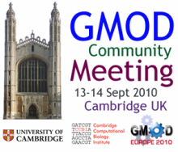
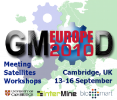

# Community Annotation - September 2010 Satellite

From GMOD

Jump to: [navigation](#mw-navigation), [search](#p-search)

<table style="vertical-align: middle; border: 2px solid #A6A6BC;"
data-cellpadding="10">
<colgroup>
<col style="width: 50%" />
<col style="width: 50%" />
</colgroup>
<tbody>
<tr class="odd">
<td>

<strong>Community Annotation <a
href="Satellite_Meetings_-_GMOD_Europe_2010"
title="Satellite Meetings - GMOD Europe 2010">Satellite
Meeting</a></strong> 
 
&#10;

<a href="September_2010_GMOD_Meeting"
title="September 2010 GMOD Meeting">September 2010 GMOD
Meeting</a> 
15 September 2010 
Cambridge, UK

</td>
<td style="text-align: center;">

<a href="GMOD_Europe_2010" title="GMOD Europe 2010">Part of GMOD Europe
2010</a>

</td>
</tr>
</tbody>
</table>

  

## Contents

- [1
  Participants](#Participants)
- [2 Some
  Experiences](#Some_Experiences)
  - [2.1
    PomBase](#PomBase)
  - [2.2
    UniProt](#UniProt)
  - [2.3
    ZFIN](#ZFIN)
  - [2.4 MGI and
    EMAGE](#MGI_and_EMAGE)
  - [2.5 Genome
    Annotation](#Genome_Annotation)
  - [2.6 Teaching
    Annotation](#Teaching_Annotation)
  - [2.7
    EcoliWiki](#EcoliWiki)
- [3
  Discussion](#Discussion)
  - [3.1 Access and
    Logins](#Access_and_Logins)
  - [3.2
    Attribution and
    Credit](#Attribution_and_Credit)
  - [3.3 Level of
    Detail](#Level_of_Detail)
  - [3.4 Data
    Quality and Consistency](#Data_Quality_and_Consistency)
  - [3.5
    Journals](#Journals)
  - [3.6
    Communities Without a
    MOD](#Communities_Without_a_MOD)
- [4
  Analysis](#Analysis)
  - [4.1
    Lessons](#Lessons)
- [5 See
  Also](#See_Also)

This [satellite
meeting](Satellite_Meetings_-_GMOD_Europe_2010 "Satellite Meetings - GMOD Europe 2010")
was held Wednesday, 15 September, in Cambridge, UK as part of [GMOD
Europe 2010](GMOD_Europe_2010 "GMOD Europe 2010") and the [September
2010 GMOD
Meeting](September_2010_GMOD_Meeting "September 2010 GMOD Meeting").
This session dealt with *Community Annotation.* The other satellite was
on [Post Reference Genome
Tools](Post_Reference_Genome_Tools "Post Reference Genome Tools") and
had many of the same participants. The topic of community annotation was
proposed by Kim Rutherford.

## Participants

- Ellen Adlem, Cambridge University Cambridge Institue of Medical
  Research, <a href="http://www.t1dbase.org" class="external text"
  rel="nofollow">T1DBase</a>
- Gerd Anders, Max-Delbrueck-Centrum Berlin (MDC)
- Jerven Bolleman, UniProt Swiss-Prot
- [Scott Cain](User:Scott "User:Scott"), GMOD Project Coordinator,
  <a href="http://www.oicr.on.ca" class="external text"
  rel="nofollow">OICR</a>
- [Dave Clements](User:Clements "User:Clements"), [GMOD Help
  Desk](GMOD_Help_Desk "GMOD Help Desk"),
  <a href="http://nescent.org" class="external text"
  rel="nofollow">NESCent</a>
- Oskana Riba Grognuz, Swiss Institute of Bioinformatics (SIB)
  Department of Ecology and Evolution, University of Lausanne
- [Chris Hemmerich](User:Chemmeri "User:Chemmeri"),
  <a href="http://cgb.indiana.edu" class="external text"
  rel="nofollow">CGB, Indiana University</a>
- Joan Pontius, National Cancer Institute, SAIC
- Kim Rutherford, Cambridge Systems Biology Centre,
  <a href="http://www.pombase.org" class="external text"
  rel="nofollow">PomBase</a>

## Some Experiences

### PomBase

Val Wood at <a href="http://www.pombase.org/" class="external text"
rel="nofollow">PomBase</a> sent out a GO curation request in a Microsoft
Word document to 80-90 authors of recent *S. pombe* papers. Val is well
known in the community and asked the authors to provide GO annotation
for their papers. PomBase got an 80% response rate. The annotations were
reviewed by PomBase personnel and most annotations were either spot on,
or very close in the GO hierarchy. Val's view is if PomBase can get the
community to do 90% of the annotation work, then PomBase can do 10 times
as much annotation.

### UniProt

UniProt added a "Contribute" section at the top of their protein pages.
It includes 2 links, "Send feedback" and "Read comments or add your
own." In the year it has been up, UniProt has received 9 comments.
That's less than one comment a month for a resource that averages almost
4 million page views per month. The "Send feedback" link gets used more
often, but not often enough to be a serious time commitment for UniProt
staff.

Curators at UniProt also contact authors of a paper when the paper is
added to UniProt. This often results in the author's coming back to
UniProt more often.

### ZFIN

<a href="http://zfin.org" class="external text" rel="nofollow">ZFIN</a>,
the zebrafish model organism database (MOD), was launched in the mid
1990s with the stated goal of enabling community annotation. The
development team had a user interface background and went to great
lengths to support this. ZFIN's annotation concept was for individuals
to *own* certain gene and fish pages. This ownership gave them editing
privileges for those pages. This effort was largely unsuccessful and
today the vast majority of ZFIN users only have update access to their
lab and personal records at ZFIN.

ZFIN has a 'Your Input Welcome' button on every data page. An average of
6 comments are received per month. These comments include questions,
corrections, additional data, and requests to back curate data from
older publications. ZFIN has had success with teams of community experts
assisting in the development of the zebrafish anatomical ontology. In
recent years, ZFIN, like many MODs, has added a
<a href="https://wiki.zfin.org/" class="external text"
rel="nofollow">community wiki</a>. They are specifically encouraging
community members to add
<a href="https://wiki.zfin.org/display/prot/ZFIN+Protocol+Wiki"
class="external text" rel="nofollow">protocols</a> and
<a href="https://wiki.zfin.org/display/AB/ZFIN+Antibody+Wiki"
class="external text" rel="nofollow">antibody</a> information. However,
despite being more convenient and more familiar to users than ZFIN's
original efforts, there has been viewing traffic, but no user updates so
far.

ZFIN encourages labs to submit gene expression and phenotype data using
the [Phenote](Phenote "Phenote") software tool. Phenote allows
researchers to annotate their images using terms from the ontologies
used by ZFIN curators. There have been inquiries but there have not been
any submissions with this tool to date.

### MGI and EMAGE

Both <a href="http://www.informatics.jax.org/" class="external text"
rel="nofollow">MGI</a>, the mouse MOD, and
<a href="http://www.emouseatlas.org/emage/home.php"
class="external text" rel="nofollow">EMAGE</a>, the Edinburgh Mouse
Atlas of Gene Expression launched tools aimed at helping mouse
researchers keep track of their gene expression data. These two projects
took very different approaches, but ended up with similar, disappointing
results. MGI created the
<a href="http://www.informatics.jax.org/mgihome/GXD/GEN/"
class="external text" rel="nofollow">Gene Expression Notebook (GEN)</a>,
based on Excel, that bench scientists could use to track gene expression
experiments and record annotation. This tool addressed a common need
(tracking gene expression data and metadata) with a technology
(Microsoft Excel) that almost every biologist is already familiar with.
Researchers could use GEN for their own work, and then *optionally*
submit their annotations back to MGI if they wanted to.

EMAGE launched a desktop Java application for doing image based gene
expression annotation. The goal was similar to MGI's but the tool
allowed researchers to do annotation at much finer detail. However, it
also required them to learn the ins and outs of an entirely new
interface.

### Genome Annotation

Several resources, including [ParameciumDB](ParameciumDB "ParameciumDB")
and the Pea Aphid database, have offered training in genome annotation
using [Apollo](Apollo.1 "Apollo"). Apollo is a sophisticated tool that
allows users to add evidence and refine gene predictions and other
annotations. However, some efforts have hit bumps along the way with
users who don't use the tools often enough to remember the user
interface between annotation sessions.

### Teaching Annotation

The <a href="http://ecoliwiki.net/colipedia/index.php/cacao"
class="external text" rel="nofollow">CACAO project at Texas A&amp;M</a>
teaches GO annotation to undergraduates and then adds the resulting
annotations to <a href="http://ecoliwiki.net" class="external text"
rel="nofollow">EcoliWiki</a>. This program has produced a relatively
large volume of quality annotation by using several techniques to
specifically encourage this. Students are divided into teams that
compete with each other for points based on the quantity and quality of
annotation. Quantity is promoted through offering points for number of
annotations and quality by offering points for successfully challenging
other teams' faulty annotations. Winning teams are rewarded with pizza
and soft drinks. This has been much more successful than expected, and
is a win for both the students and the resources the annotations go
into. This approach has been a stunning success with an order of
magnitude more annotations coming in than organizers expected.

[ParameciumDB](ParameciumDB "ParameciumDB") also harnesses the power of
undergraduates to do genomic annotation. They have partnered with two
undergraduate institutions that teach term-long classes on annotation.
Students annotate the *paramecium* genome, and then submit their work to
ParameciumDB at the end of the term. This work is then reviewed and
loaded into ParameciumDB.

The Science Education Alliance (SEA) at HHMI takes a similar approach on
a broader scale, starting with gathering and sequencing samples through
submission to GenBank.

### EcoliWiki

<a href="http://ecoliwiki.org" class="external text"
rel="nofollow">EcoliWiki</a> is a recent effort that aggressively
encourages community annotation. EcoliWiki is built on the widely used
MediaWiki package (MediaWiki powers Wikipedia.org) and exposes all it's
annotation to being updated and expanded by anyone with a login.

CACAO and EcoliWiki make extensive use of wiki technology to make the
technology aspects of entering annotation easy for researchers and
students. EcoliWiki's update interface makes extensive use of the the
locally developed, but publicly available,
[TableEdit](TableEdit.1 "TableEdit") MediaWiki extension. This presents
editors with a GUI interface to tabular data and protects them from
MediaWiki markup.

Wikis offer significant hope for making it easier for biologists to fix
or add something than it is to be irritated by an error or the absence
of it.

## Discussion

### Access and Logins

What model should be used for enabling and managing community
annotation. Who do you give access to to, what types of access do they
have, and what review mechanisms are in place?

Wikipedia model - Last edit wins.  
Anyone can edit, with or without a login. Logins are available to anyone
who requests it. Spam is automatically removed, but differences of
opinion are resolved by *last edit wins* in most cases, and by
increasing levels of control when that doesn't work.

<!-- -->

GMOD.org - All edits welcome, but you'll be watched.  
Must have a login to edit, but anyone can create a login. Edits are
loosely watched by GMOD staff.

<!-- -->

<a href="http://ecoliwiki.net" class="external text"
rel="nofollow">EcoliWiki</a> - Vampire!  
Logins given to trusted community members. Anyone with an existing login
can create a login for someone else. Editors have full update access.

<!-- -->

[SGN](Category:SGN "Category:SGN") - Locus boss!  
SGN locus pages list the set of community members who can update
information about that locus. Every locus page includes "Request editor
privileges" link. This model allows specific people to control and "own"
particular loci data. Locus owners tend to be experts on that locus, and
giving control to them (and listing their names) benefits both SGN and
the locus editor.

<!-- -->

PomBase (so far) - Reviewed before posting.  
Submissions are reviewed by staff at the online resource before being
posted to the public resource.

<!-- -->

[ParameciumDB](ParameciumDB "ParameciumDB") - Vetting, followed by complete trust  
ParameciumDB only give access to people who know how to annotate. These
annotations are not reviewed before incorporation. They are incorporated
automatically once a month if they are tagged as finished by the
community curator.

We also discussed problems with requiring researchers to create yet
another online login.

EcoliWiki automatically creates logins for authors of newly enterred
papers. The login is then sent to authors when they are first contacted.
Another option could be to send them a custom URL that allows them to
update the resource without having to login. If they access that URL,
they are who they say they are.

(Q: Is anyone out there investigating unified logins in life sciences?
This could be done as a front end to OpenID?)

### Attribution and Credit

Want all statements in your resource to be attributed. This means you
need field level (not just page level) attribution. Who said this, where
it was said. With community annotation, you want to record that
information, plus who put that information in the database. ZFIN tracks
all curator changes at the column/attribute level. Users can view this
history for any web page.

The lack of "professional" credit for doing community annotation has
been an enormous issue in the past. People are becoming aware that
online resources help other researchers find their work. There has been
*talk* of shifting funding and tenure models to consider contributions
to online resources. (If you know of any concrete examples of where this
has been done, please post them here.)

One participant pointed out that students could be encouraged to do
community annotation. This would enable them to cite resources online
that they had helped create. This sort of meta-publication is not
original research but it would demonstrate that a student is able to
read and understand academic papers.

### Level of Detail

Resources need to be careful not to overwhelm their community members.
Dedicated curators can learn sophisticated tools and doing highly
detailed annotation. Community members who may want to submit or update
information only 3 or 4 times year, are not inclined to learn (or
remember) complex tools or ontologies with thousands of terms. Community
annotation tools, unlike dedicated curator tools must be easy and
intuitive to use.

One approach is to complex, large ontologies is to use reduced
vocabularies such as GO slim. Have tools default to GOSlim, and then
only once they have selected a GO-Slim term, prompt them for a narrower
term from the full ontology, if they want to provide one.

PomBase is going to create a lightweight GO annotation tool that
autocompletes as much as possible. This will create a GAF, but won't
require users to manually populate every column. The same applies to
anatomy - how much does your average researcher care about 600 terms in
a mouse kidney? Unless they are a kidney researcher that level of detail
may overwhelm users.

Despite the complexity issues that come with ontologies, everyone
present agree that abandoning ontologies in favor or free text
annotation would be a huge mistake.

### Data Quality and Consistency

Problems of consistent annotation happen even when resources have a
dedicated staff of in-house curators. Early in the
<a href="http://gudmap.org" class="external text" rel="nofollow">GUDMAP
project</a>, two highly qualified curators did independent parallel
annotations of the same *in situ* hybridisation image dataset.
Initially, well over half of the annotation agreed completely. The two
curators then met and identified the sources of disagreement. Several
areas were clarified and the datasets reannotated, at which point two
reached 96% agreement. However, despite being experts in this field, the
two still disagreed on what 4% of the image were showing.

This problem becomes more pronounced with community annotation.
Community members won't create annotation full time or even with a
significant fraction of their time. Most resources won't be able to
teach community members best practices. Resources will need to decide on
a model for what annotation they will encourage and accept.

However, community annotation can also help *increase* data quality. One
resource represented in the discussion believes that on average, 3% of
their data is incorrect. Databases can use their communities to help
identify incorrect data by making it trivial to report problems and easy
to fixt hem. You can also use your community to resolve *conflicting*
annotations.

### Journals

Can we get journals to require supplemental annotation data with
publications? This very topic was discussed at a GMOD meeting 6 or 7
years ago. Everyone agreed that it was a good idea then too.

### Communities Without a MOD

What can be done for communities that don't have a central resource for
the gathering and itegration of data? GONUTS is a resource for GO
annotation for any organism. Other data-type specific resources are
available for such communities. However, does anything exist for these
communities that is unified?

## Analysis

Why were some of these efforts more successful than others?

The PomBase example above was wildly successful compared to most
community annotation efforts. It has some beneficial features that can
be controlled by MODs, and some that cannot: PomBase contacted the
author's of *recent* papers only. Authors are much more likely to care
about research that has been published this year, then they are about
previous work. The *S. Pombe* community is also a small and relatively
well connected community. Community annotation efforts tend to work
better in smaller communities where researchers are likely to know and
work with the people who will benefit from the annotation. Adding
annotation to one's work is also likely to significantly increase the
visibility of that work in smaller communities. Increased visibility is
likely to lead to increased citations. In large communities, such as
mouse or yeast, adding annotation is likely to only lead to an
incremental increase in visibility and citations.

[ParameciumDB](ParameciumDB "ParameciumDB") has also had some success in
encouraging community annotation. The *paramecium* community, like the
*pombe* community, is also small and collaborative. UniProt, a
pan-biology resource if ever there was one, had 46 million page views
lead to only 9 comments being submitted. ZFIN likely suffered from being
both a large community *and* from being an early adopter.

Neither of the mouse gene expression tools led to significant amounts of
data being submitted back to the organizations that created them. The
suspicion is that, for MGI's GEN, every lab does things slightly
differently, and has already developed processes for doing this. The
payoff for embracing a tool that enables data sharing is not perceived
as being high enough to change processes. For EMAGE, it may be that the
perceived benefits of doing detailed, high-quality, image-based
annotation were perceived to be not worth the effort to learn a
non-trivial tool. This problem will occur anytime a tool does a complex
task and thus has a complex interface. This problem will, however,
lessen over time, as tools move from custom desktop applications to web
based one, using the same user interface conventions as other
sophisticated interfaces. [Apollo](Apollo.1 "Apollo"), for example, is
currently being migrated from a stand-alone Java application to web
application that shares a common platform with
[JBrowse](JBrowse.1 "JBrowse"). This common platform will ease
adaptation of Apollo by any user that is already familiar with JBrowse.

[ParameciumDB](ParameciumDB "ParameciumDB") and EcoliWiki's
<a href="http://ecoliwiki.net/colipedia/index.php/cacao"
class="external text" rel="nofollow">CACAO project</a>, while not being
community annotation efforts *per se*, are successful at generating
significant amounts of curation by people who are not paid curators.
These are both win-win situations as the students learn about curation
and the resources get much needed annotation.

CACAO is also be taking advantage of a culture shift. The students are
already used to creating online content that others will see. This was
exceptional when ZFIN launched in the mid 1990s. Now it is commonplace.

### Lessons

Some possible lessons from the above experience and analysis.

Community size matters

Community annotation efforts tend to work better in smaller communities,
such as PomBase and ParameciumDB. In larger communities such as mouse or
zebrafish development, community members feel that there are
organizations with full time curators such as MGI and ZFIN that exist to
do this annotation for them. In both large and small communities there
is pressure to publish, but in smaller communities the perceived
benefits of doing community annotation are greater. Large pan-biology
resources such as UniProt have the greatest challenge in encouraging
community contributions.

Contact researchers and authors when their research first comes out.

They are interested and are keen to help increase the visibility of
their work.

Contact authors when papers and research are new, or immediately after
or just before adding their work to a website. Authors are much more
likely to respond when the research is fresh and added annotation has
the potential to significantly raise the visibility of their work. This
contact also increases the likelihood that the authors will use the
resource.

Complexity and interface familiarity matters

There is often a tradeoff between rich functionality and ease of use.
This will likely get better over time as web interfaces become both more
sophisticated and more standardised.

## See Also

- There is a
  <a href="http://blog.openhelix.eu/?p=5551" class="external text"
  rel="nofollow">blog post on this meeting</a> by Mary Mangan on the
  <a href="http://blog.openhelix.eu/" class="external text"
  rel="nofollow">OpenHelix blog</a>.
- <a href="http://www.biology-direct.com/content/5/1/12"
  class="external text" rel="nofollow">Community Annotation in Biology</a>,
  Mazumder R, Natale DA, Julio JA, Yeh LS, Wu CH. *Biol Direct.* 2010
  Feb 18;5:12. The discussion under "Reviewers' comments" is also
  interesting.

Retrieved from
"<http://gmod.org/mediawiki/index.php?title=Community_Annotation_-_September_2010_Satellite&oldid=21965>"

[Categories](Special:Categories "Special:Categories"):

- [Education and
  Outreach](Category:Education_and_Outreach "Category:Education and Outreach")
- [Community
  Annotation](Category:Community_Annotation "Category:Community Annotation")
- [Annotation](Category:Annotation "Category:Annotation")
- [Meetings](Category:Meetings "Category:Meetings")

## Navigation menu

### Namespaces

- <a href="Community_Annotation_-_September_2010_Satellite" accesskey="c"
  title="View the content page [c]">Page</a>
- <a href="Talk:Community_Annotation_-_September_2010_Satellite"
  accesskey="t"
  title="Discussion about the content page [t]">Discussion</a>

### 

### Variants

### Views

- [Read](Community_Annotation_-_September_2010_Satellite)
- <a
  href="http://gmod.org/mediawiki/index.php?title=Community_Annotation_-_September_2010_Satellite&amp;action=edit"
  accesskey="e" title="This page is protected.
  You can view its source [e]">View source</a>
- <a
  href="http://gmod.org/mediawiki/index.php?title=Community_Annotation_-_September_2010_Satellite&amp;action=history"
  accesskey="h" title="Past revisions of this page [h]">View history</a>

### Actions

### Search

### Navigation

- [GMOD Home](Main_Page)
- [Software](GMOD_Components)
- [Categories /
  Tags](Categories)
- [View all pages](Special:AllPages)

### Documentation

- [Overview](Overview)
- [FAQs](Category:FAQ)
- [HOWTOs](Category:HOWTO)
- [Glossary](Glossary)

### Community

- [GMOD News](GMOD_News)
- [Training /
  Outreach](Training_and_Outreach)
- [Support](Support)
- [GMOD Promotion](GMOD_Promotion)
- [Meetings](Meetings)
- [Calendar](Calendar)

### Tools

- <a
  href="Special:WhatLinksHere/Community_Annotation_-_September_2010_Satellite"
  accesskey="j" title="A list of all wiki pages that link here [j]">What
  links here</a>
- <a
  href="Special:RecentChangesLinked/Community_Annotation_-_September_2010_Satellite"
  accesskey="k"
  title="Recent changes in pages linked from this page [k]">Related
  changes</a>
- <a href="Special:SpecialPages" accesskey="q"
  title="A list of all special pages [q]">Special pages</a>
- <a
  href="http://gmod.org/mediawiki/index.php?title=Community_Annotation_-_September_2010_Satellite&amp;printable=yes"
  rel="alternate" accesskey="p"
  title="Printable version of this page [p]">Printable version</a>
- [Permanent
  link](http://gmod.org/mediawiki/index.php?title=Community_Annotation_-_September_2010_Satellite&oldid=21965 "Permanent link to this revision of the page")
- [Page
  information](http://gmod.org/mediawiki/index.php?title=Community_Annotation_-_September_2010_Satellite&action=info)
- <a
  href="Special:Browse/Community_Annotation_-2D_September_2010_Satellite"
  rel="smw-browse">Browse properties</a>
- [Print as
  PDF](http://gmod.org/mediawiki/index.php?title=Special:PdfPrint&page=Community_Annotation_-_September_2010_Satellite)

- Last updated at 18:52 on 8 October
  2012.
- 38,426 page views.
- Content is available under
  <a href="http://www.gnu.org/licenses/fdl-1.3.html" class="external"
  rel="nofollow">a GNU Free Documentation License</a> unless otherwise
  noted.

<!-- -->

- [About
  GMOD](GMOD:About "GMOD:About")

<!-- -->

- 
- 
  

