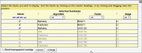
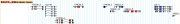
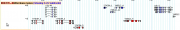
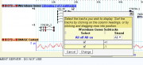
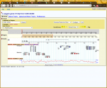
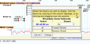
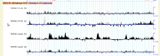
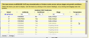

# Creating and Managing Subtracks with GBrowse2

From GMOD

Jump to: [navigation](#mw-navigation), [search](#p-search)

*For the main GBrowse 2.0 HOWTO article, see: [GBrowse 2.0
HOWTO](GBrowse_2.0_HOWTO "GBrowse 2.0 HOWTO").*

As of GBrowse version 2.09, you can create an unlimited number of
subtracks within a single major track in order to group a series of
datasets that are logically linked, such as a timecourse. You can choose
which subtracks to show by default and the order in which they will
appear. When the user clicks a designated area in the titlebar, a dialog
box appears that allows the user to select which subtracks to make
visible. The user can also drag subtrack labels up and down to adjust
the order in which they are displayed.

There are two mechanisms for defining subtracks. The "Metadata"
mechanism (new in version 2.48) is used when you have one feature per
subtrack such as a whole genome quantitative ("wiggle") feature and each
feature is enumerable by its display name. You provide a file that lists
each feature subtrack explicitly.

The second mechanism is more flexible and is used when there are too
many features to list explicitly and/or there are more than one feature
per subtrack. In this scheme, each subtrack is defined by a set of
feature filters. The filters are applied to each filter in turn, sorting
them into the appropriate subtrack.

## Contents

- [1 Using
  Metadata](#Using_Metadata)
  - [1.1 Full
    Example](#Full_Example)
- [2 Using Subtrack
  Select](#Using_Subtrack_Select)
  - [2.1 A Basic
    Example](#A_Basic_Example)
  - [2.2
    Multidimensional
    Subtracks](#Multidimensional_Subtracks)
  - [2.3 Adding
    subtrack IDs to the Table](#Adding_subtrack_IDs_to_the_Table)
  - [2.4 Labeling
    Subtracks](#Labeling_Subtracks)
  - [2.5 Hiding
    Subtracks with no Data](#Hiding_Subtracks_with_no_Data)

## Using Metadata

If you have just a few features and there is a one-to-one correspondence
between feature and subtrack, then the easiest way to define subtracks
is by use of an external metadata file. A typical file looks like this:

    [feature_name_1]
    :dbid        = f101
    :selected    = 1
    display_name = My First Feature
    type         = some_type1
    method       = my_method1
    source       = my_source1
    some_attribute    = value1
    another_attribute = value2

    [feature_name_2]
    :dbid        = f102
    :selected    = 1
    display_name = My Second Feature
    type         = some_type2
    method       = my_method2
    source       = my_source2
    some_attribute    = value3
    another_attribute = value4

    [feature_name_3]
    :dbid        = f103
    type         = some_type2
    method       = my_method2
    source       = my_source2
    some_attribute    = value5
    another_attribute = value6

Each \[stanza\] begins with the name of a feature as it is represented
in the underlying database. Below each \[stanza\] heading are a series
of tag=value pairs. The following tag names have special meaning:

    :dbid          Optional unique identifier for the subtrack; If provided, it can be used in the GBrowse
                   URL to select the subtrack.
    :selected      If true, this subtrack is selected by default when the containing track is turned on.
    display_name   Display name for the feature. If not present, will
                   default to the feature's native display name (i.e. the one in the [stanza]).
    type           What is returned by calling the feature's type() method.
    method         What is returned by calling the feature's method() method.
    source         What is returned by calling the feature's source() method.
    score          What is returned by calling the feature's score() method.

Any other tags become sortable attributes which are displayed by the
GBrowse subtrack selection dialog box. For this to work properly, each
tag must be present in each stanza. Tags that are present in some
stanzas and not others are ignored.

Save this file anywhere convenient and then associate it with the
desired track using the **metadata** option. This option takes the full
path name to the metadata file. For example:

    [ChIP-Seq]
    database = Peaks
    feature  = signal
    glyph    = vista_ploat
    metadata = /var/www/gbrowse2/databases/chip-seq/metadata.txt

### Full Example

Here is a full working example of a metadata-based subtrack definition
that shows a number of ChIP-seq experiments with the attributes
"factor", "stage" and "algorithm". The subtrack selection dialog that
this generates is shown on the right.

ChIP-seq subtracks using metadata file

The database stanza:

     [Chip:database]
     db_adaptor    = Bio::DB::SeqFeature::Store
     db_args       = -adaptor memory
            -dsn /var/www/gbrowse2/databases/elegans_peakcallcomparison
     search options = none

The features in this database are named "BLMP1-L1 Berkeley", "BLMP1-L1
IDR", etc. An excerpt from one of the GFF3 files that comprises this
database can be found at [Using the vista_plot
Glyph](Using_the_vista_plot_Glyph "Using the vista plot Glyph").

The track stanza:

    [ChIP-Seq]
    database = Chip
    feature  = signal
    glyph    = vista_ploat
    metadata = /var/www/gbrowse2/databases/chip-seq/metadata.txt

  
Metadata file in /var/www/gbrowse2/databases/chip-seq/metadata.txt.

     [BLMP1-L1 Berkeley]
     :dbid=101
     :selected=1
     factor = BMLP1
     stage  = L1
     algorithm = Berkeley

     [BLMP1-L1 IDR]
     :dbid=102
     :selected=1
     factor = BMLP1
     stage  = L1
     algorithm = IDR

     [BLMP1-L1 Published]
     :dbid=103
     factor = BMLP1
     stage  = L1
     algorithm = Published

     [UNC130-L1 Berkeley]
     factor = UNC130
     stage  = L1
     :dbid=104
     algorithm = Berkeley

     [UNC130-L1 IDR]
     factor = UNC130
     stage  = L1
     :dbid=105
     algorithm = IDR

     [UNC130-L1 Published]
     factor = UNC130
     stage  = L1
     :dbid=106
     algorithm = Published

Save this file as /var/www/

## Using Subtrack Select

This section describes how to use the **subtrack select** and **subtrack
table** options to create subtracks based on filters.

### A Basic Example

Here is a simple example to show how the system works. We start out with
a gene track that has no subtracks:

    [Genes]
    feature      = gene
    glyph        = gene
    database     = sqlite-genes
    category     = Genes:Coding
    label        = 1
    key          = Wormbase Genes

Genes track with no subtracks

The behavior of this track is to show both forward and reverse strand
genes packed together for maximum efficiency, as shown in the figure on
the right. Let's say we would prefer for forward and reverse stranded
genes to be sorted into separate subtracks so that they do not
intermingle. This can be done by adding **subtrack select** and
**subtrack table** options to the configuration:

    [Genes]
    feature      = gene
    glyph        = gene
    database     = sqlite-genes
    category     = Genes:Coding
    label        = 1
    subtrack select = Strand strand
    subtrack table  =  +1 ;
                       -1
    key          = Wormbase Genes

The "subtrack select" option defines a partitioning scheme for the data
in the track. It consists of one or more lines defining the dimensions
on which to partition the data. In this case, we are partitioning on
only one dimension, the strandedness of the feature. The definition of
this dimension is \<Dimension Label\> \<method\> (whitespace delimited,
as usual), where the dimension label is a human-readable column label on
the selection dialog and the method is any of the methods recognized by
<a
href="http://doc.bioperl.org/releases/bioperl-1.4/Bio/SeqFeature/Generic.html"
class="external text" rel="nofollow">Bio::SeqFeatureI objects</a>
("display_name", "primary_tag", "source_tag", "score", "has_tag",
"tag_value", "start", "length", etc). In the example above, we are going
to partition on the strand() method, and to label this dimension
"Strand" on the popup menu presented to the user.

First iteration of strand-specific subtracks

Subtrack selection dialog box

  
The "subtrack table" option defines the values on which to partition the
data. In this case, we are going to partition the data into two
subtracks: one for positive strand features (strand() returns +1) and
one for negative strand features (strand() returns -1). This option has
two or more lines, each one separated by a semicolon. Each line
corresponds to a subtrack, which will be filtered by matching against
the value(s) specified on the line. We simply list +1 and -1 as our two
subtrack filter values.

Reloading the browser now gives the track shown on the upper right. When
the user clicks on the titlebar where it says "Showing 2 of 2 tracks",
he can control the display of the subtracks using the dialog on the
lower right.

Second iteration of strand-specific subtracks

Second iteration of the subtrack selection dialog box

This is good, but has two aesthetic issues. First, the labels on the
subtracks appear as "+1" and "-1" which is not intuitive. Similarly, the
strand values in the selection dialog also appear as +1 and -1. We can
considerably improve this by attaching human-readable labels to the
dimension values and subtracks. Here is an improved configuration file:

    [Genes]
    feature      = gene
    glyph        = gene
    database     = sqlite-genes
    category     = Genes:Coding
    label        = 1
    subtrack select = Strand strand
    subtrack table  = :Forward +1 ;
                      :Reverse -1
    subtrack select labels = +1 "Forward Strand" ;
                          -1 "Reverse Strand"
    key          = Wormbase Genes

  
We've done two things here. First, we've modified the "subtrack table"
option so that each line is preceded with :*Name* where *Name* is what
we want to appear to the left of the subtrack in the display. The ":"
symbol is required in front of the name but will not appear in the
display. It can appear anywhere relative to the match items in the
option.

Second, we added a "subtrack select labels" option to the stanza. This
relabels the selectable dimension values with the desired human-readable
labels within the dialog box itself. Notice that subtracks can have
different names than their selection labels. In this example, we choose
"Forward Strand" for +1 features in the dialog box, but "Forward" for
the subtrack name.

The effect of these modifications are shown in the two figures to the
right.

  

ChIP-seq subtracks

modENCODE ChIP-seq subtrack selector

### Multidimensional Subtracks

The previous example partitioned subtracks on a single dimension. This
example will show how to create individually-selectable subtracks based
on multiple selection dimensions. As an example, we use a track based on
the <a href="http://www.modencode.org" class="external text"
rel="nofollow">modENCODE</a> ChIP-seq tracks. These have four different
dimensions, corresponding to the antibody used to bring down
chromatin-bound transcription factors, the organism's developmental
stage, the temperature at which the organism was grown, and whether the
data set has been validated.

The images below and to the right show a development version of the
histone modification ChIP-seq track from the modENCODE project and the
dialog box used to select among the subtracks. This track was created
with the following configuration:

    [ChIP-seq]
    subtrack select = Antibody    tag_value antibody    ;
                      Stage       tag_value stage       ;
                      Temperature tag_value temp        ;
                      Confirmed   has_tag   confirmed   ;
    subtrack table = H3K4Me3  E0-4h 23  1 * ;
                     H3K4Me3  E4-8h 23  0   ;
                     H3K4Me3  pupae 23  0   ;
                     H3K4Me3  pupae 26  0   ;
                     H3K9Me2  E0-4h 23  0 * ;
                     H3K9Me2  E4-8h 23  1   ;
                     H3K9Me2  pupae 23  0   ;
                     H3K9Me2  pupae 26  1   ;
                     H3K27Me3 E0-4h 23  1 * ;
    subtrack select labels = E0-4h "Early embryo" ;
                             E4-8h "Late embryo"  ;
                             pupae "Pupating larvae" ;
    brief comment = This track shows modENCODE ChIP-seq characterization of
                    histone marks across various stages and growth conditions.

In this case, the **subtrack select** option has four lines, each one
separated by a semicolon (the semicolon on the final line is optional).
Each line defines a subtrack dimension and has the format described
above, consisting of a column label and a Bio::SeqFeature method call.
However, in this case all the dimensions are contained in the features'
tags (also known as feature "attributes"), which are accessed using the
tag_value() and has_tag() methods. To specify which tags we are
interested in, there is a third space-delimited argument that contains
the tag name. So the Antibody dimension is determined by calling
\$feature-\>tag_value('antibody') and the Confirmed dimension is
determined by calling \$feature-\>has_tag('confirmed').

The **subtrack table** option lists each of the possible subtracks. The
first four columns correspond to the four dimensions specified by
**subtrack select**, e.g. antibody followed by developmental stage,
followed by temperature and confirmation status. In this case we do not
specify subtrack labels for reasons discussed later. However, since
there are a lot of subtracks, we do not want them all to be displayed by
default. The optional asterisk symbol (\*) falling anywhere inside a
subtrack table line indicates that this subtrack is to be turned on by
default. If no asterisks are present, all subtracks are turned on.

The **brief comment** option serves to define a short description of the
subtracks that will be printed in the subtrack selection dialog box.

### Adding subtrack IDs to the Table

If you wish to embed GBrowse in another application, you will probably
want to assign IDs to the subtracks so that they can be turned on and
off via the GBrowse URL in the same way that whole tracks are turned on
and off. To do this, append "=*identifier*" to each line of the subtrack
table like this:

    subtrack table = H3K4Me3  E0-4h 23  1 * =100 ;
                     H3K4Me3  E4-8h 23  0   =101 ;
                     H3K4Me3  pupae 23  0   =102 ;
                     H3K4Me3  pupae 26  0   =103 ;
                     H3K9Me2  E0-4h 23  0 * =104 ;
                     H3K9Me2  E4-8h 23  1   =105 ;
                     H3K9Me2  pupae 23  0   =106 ;
                     H3K9Me2  pupae 26  1   =107 ;
                     H3K27Me3 E0-4h 23  1 * =108 ;

The identifier can be any combination of letters and numbers. Its exact
position on the line doesn't matter.

The identifiers can then be used to select subtrack in the GBrowse URL:

      http://your.site/cgi-bin/gb2/gbrowse/elegans/?q=I:1000..2000;l=ChIP-seq/100+102+103

This will select the region between positions 1000 and 2000 on
chromosome I, and turn on the ChIP-seq track, subtracks 100, 102 and
103.

### Labeling Subtracks

Subtracks are labeled on the left side of the panel. If you are using
"label_position=left" in your stanza, or the genes glyph with
"label_transcripts" set to true, then it is possible for the labels of
individual features to collide with the subtrack labels. There are two
ways around this problem. One is to turn off subtrack labeling entirely
and to let each individual feature's label identify subtracks. This
works well with chromosome-wide features such as wiggle tracks when
there is only one feature per subtrack (this is illustrated in the
modENCODE data set above). The other is to relocate the position of the
subtrack label to the top of the subtrack, where it won't clash with the
feature labels. GBrowse will attempt to detect potential clash cases,
and to configure them for you automatically, but there may be cases
where you to have intervene manually.

To implement the first scheme, set the option "group_label" to a false
value:

     group_label = 0

Be sure that the label assigned to each feature is sufficiently
informative that they can substitute for the subtrack label.

To implement the second scheme, set "group_label_position" to "top":

     group_label_position = top

For compatibility with earlier behavior, GBrowse will automatically set
group_label to 0 if the track consists of quantitative data (uses one of
the wiggle, xyplot, density or whisker glyphs). Please set group_label
to a true value in order to activate subtrack labeling.

### Hiding Subtracks with no Data

By default, if a subtrack has no data in the currently displayed region,
its label will still be printed to show that the subtrack exists. If you
prefer, you can set **hide empty subtracks** to a true value, in which
case the display of empty subtracks will be suppressed.

Retrieved from
"<http://gmod.org/mediawiki/index.php?title=Creating_and_Managing_Subtracks_with_GBrowse2&oldid=20297>"

[Categories](Special:Categories "Special:Categories"):

- [GBrowse](Category:GBrowse "Category:GBrowse")
- [HOWTO](Category:HOWTO "Category:HOWTO")
- [Configuration](Category:Configuration "Category:Configuration")

## Navigation menu

### Namespaces

- <a
  href="http://gmod.org/mediawiki/index.php?title=Talk:Creating_and_Managing_Subtracks_with_GBrowse2&amp;action=edit&amp;redlink=1"
  accesskey="t"
  title="Discussion about the content page [t]">Discussion</a>

### 

### Variants

### Navigation

- [GMOD Home](Main_Page)
- [Software](GMOD_Components)
- [Categories /
  Tags](Categories)
- [View all pages](Special:AllPages)

### Documentation

- [Overview](Overview)
- [FAQs](Category:FAQ)
- [HOWTOs](Category:HOWTO)
- [Glossary](Glossary)

### Community

- [GMOD News](GMOD_News)
- [Training /
  Outreach](Training_and_Outreach)
- [Support](Support)
- [GMOD Promotion](GMOD_Promotion)
- [Meetings](Meetings)
- [Calendar](Calendar)

### Tools

- <a href="Special:Browse/Creating_and_Managing_Subtracks_with_GBrowse2"
  rel="smw-browse">Browse properties</a>

- Last updated at 19:42 on 17 April
  2012.
<!-- - 152,090 page views. -->
- Content is available under
  <a href="http://www.gnu.org/licenses/fdl-1.3.html" class="external"
  rel="nofollow">a GNU Free Documentation License</a> unless otherwise
  noted.

<!-- -->

- [About
  GMOD](GMOD:About "GMOD:About")

<!-- -->

