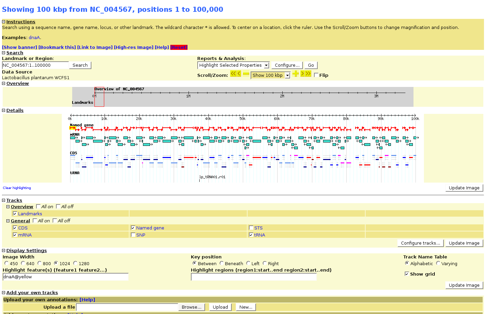

# Debian Stable Installation Notes

From GMOD

Jump to: [navigation](#mw-navigation), [search](#p-search)

## Contents

- [1 Debian Stable
  (Etch 4.0) installation
  notes](#Debian_Stable_.28Etch_4.0.29_installation_notes)
  - [1.1
    Apache](#Apache)
  - [1.2 location
    for GMOD](#location_for_GMOD)
  - [1.3
    download](#download)
    - [1.3.1 CPAN
      packages](#CPAN_packages)
  - [1.4
    BioPerl](#BioPerl)
  - [1.5
    Environment
    Variables](#Environment_Variables)
  - [1.6 Data
    loading](#Data_loading)
    - [1.6.1 what
      doesn't work](#what_doesn.27t_work)
    - [1.6.2 What
      works](#What_works)
  - [1.7 Gbrowse
    configuration](#Gbrowse_configuration)

## Debian Stable (Etch 4.0) installation notes

Installing Chado/GMOD old office machine with a fresh Debian stable
installation. Goal: test the Chado scheme for annotation of bacterial
genomes

- AMD Athlon(tm) XP 3200+
- 1 GB memory
- 500 GB SATA disk

I borrowed a lot of stuff from the
[Installing_Chado_on_Ubuntu_HOWTO](Installing_Chado_on_Ubuntu_HOWTO "Installing Chado on Ubuntu HOWTO")
page as Debian and Ubuntu are much alike.

### Apache

Apache 2.2 is installed by default during the installation of Debian
stable (web package).

### location for GMOD

    mkdir /usr/local/gmod

note: this is NOT the home of my gmod user.

### download

got the source from <a
href="http://sourceforge.net/project/showfiles.php?group_id=27707&amp;package_id=19511"
class="external text" rel="nofollow">sourceforge</a> and unpacked in
/usr/local/gmod (maybe I should use the cvs version??)

    === postgresql setup ===

Note: Debian stable has postgresql 7.4 as default package, but i'm going
for 8.1.11 as this is also the version that runs on our RedHat
Enterprise 5 server (more on that later)

apt-get install the following packages, Synaptic is your friend

- postgresql-8.1
- postgresql-8.1-client-common
- postgresql-client-8.1
- postgresql-contrib-8.1
- postgresql-plperl-8.1

Not necessary, but I also installed phpPgAdmin from source, not the
Debian package.

Following the guidelines from INSTALL.Chado to add a database user and
optimize some settings. Don't forget to create a database user root as
well for the CPAN installations below, otherwise some tests fail. I
added user 'chado' for the chado database installation.

The configuration files are located in a different location as opposed
to our Redhat installation:

    /etc/postgresql/8.1/main

  
I opted to install the CPAN modules instead of the Debian packages as
some of the Debian packages have older versions of the modules. The
modules are installed in

    /usr/local/share/perl/5.8.8/

So not overwriting any installed Debian packages.

Note: when installing DBIx::DBStag, the install tests require a postgres
account to run the 'make tests'. Because CPAN installs are typically run
under root, you may create an account for root with:

su postgres createuser root

    Superuser[Y]

The DBIx::DBStag package should now be able to install without using the
'force' option under CPAN. For security, don't forget to drop the user
after the install is finished:

su postgres dropuser root

#### CPAN packages

    CGI
    GD
    DBI
    DBD::Pg
    SQL::Translator
    Digest::MD5
    Text::Shellwords
    Graph
    Data::Stag
    XML::Parser::PerlSAX
    Module::Build
    Class::DBI
    Class::DBI::Pg
    Class::DBI::Pager
    DBIx::DBStag (Force install needed if tests fail)
    XML::Simple
    LWP
    Template
    Log::Log4perl
    GO::Parser

### BioPerl

I installed <a href="http://www.bioperl.org/wiki/Using_Subversion"
class="external text" rel="nofollow">BioPerl-live</a> using subversion
into /usr/local/bioperl/bioperl-live (as root)

    svn co svn://code.open-bio.org/bioperl/bioperl-live/trunk bioperl-live

    cd /usrlocal/bioperl/bioperl-live
    perl Build.PL
    ./Build
    ./Build test   #some tests fail as usual
    sudo ./Build install

  

### Environment Variables

Added this to my .bashrc so that when I login as user gmod all vars are
set

    # GMOD additions
    export GMOD_ROOT=/usr/local/gmod
    export GO_ROOT=/usr/local/share/perl/5.8.8/GO/
    export PERL5LIB=$PERL5LIB:/usr/local/bioperl/bioperl-live
    export CHADO_DB_NAME=dev_chado_01
    export CHADO_DB_USERNAME=chado
    export CHADO_DB_PASSWORD=******
    #CHADO_DB_HOST=localhost
    #CHADO_DB_PORT=5432

  
=== installing Chado scheme and tools

    in /usr/local/gmod
    perl Makefile.PL

    make
    sudo make install
    make load_schema
    make prepdb

a quick look at the database user phpPgAdmin: the database looks fine.

    make ontologies
     ./Build ontologies
     Available ontologies:
     [1] Relationship Ontology
     [2] Sequence Ontology
     [3] Gene Ontology
     [4] Chado Feature Properties
     [5] Cell Ontology
     [6] Plant Ontology

     Which ontologies would you like to load (Comma delimited)? [0] 1,2,3,4

This take a while. i'm getting the notorious duplicate key violates
unique constraint "cvterm_c1" error as well.

### Data loading

We have a local mirror of
<a href="ftp://ftp.ncbi.nlm.nih.gov/genomes/Bacteria"
class="external autonumber" rel="nofollow">[1]</a> mounted at
/data/genomes As described in the Chado manual I inserted an organism in
the database, our pet organism of course:

    INSERT INTO organism (abbreviation, genus, species, common_name)
                   VALUES ('L.plantarum', 'Lactobacillus', 'plantarum', 'Lactobacillus plantarum WCFS1');

**question:** other pages seem to specify the taxonomy id as organism
id. In our case that would be 220668. Should we use this ID or just let
postgresql add an ID for us?

#### what doesn't work

**NCBI gff3 files (does not work!)**

    > gmod_gff3_preprocessor.pl -gfffile /data/genomes/Lactobacillus_plantarum/NC_004567.gff -outfile NC_004567.gff

fails with

    "my" variable %seen masks earlier declaration in same scope at /usr/local/share/perl/5.8.8/Bio/GMOD/DB/Adapter.pm line 4199.
    "my" variable %seen masks earlier declaration in same scope at /usr/local/share/perl/5.8.8/Bio/GMOD/DB/Adapter.pm line 4223.
    NOTICE:  CREATE TABLE will create implicit sequence "gff_sort_tmp_row_id_seq" for serial column "gff_sort_tmp.row_id"
    NOTICE:  CREATE TABLE / PRIMARY KEY will create implicit index "gff_sort_tmp_pkey" for table "gff_sort_tmp"
    couldn't open /data/genomes/Lactobacillus_plantarum/NC_004567.gff.sorted.fasta for writing: Read-only file system

although running from a writable directory, gmod_gff3_preprocessor.pl
tries to write to the location where the input file is.

    > cp /data/genomes/Lactobacillus_plantarum/NC_004567.gff NC_004567.gff
    > gmod_gff3_preprocessor.pl --gfffile NC_004567.gff --outfile NC_004567.gff.sorted

    "my" variable %seen masks earlier declaration in same scope at /usr/local/share/perl/5.8.8/Bio/GMOD/DB/Adapter.pm line 4199.
    "my" variable %seen masks earlier declaration in same scope at /usr/local/share/perl/5.8.8/Bio/GMOD/DB/Adapter.pm line 4223.
    Sorting the contents of NC_004567.gff ...
    Writing sorted contents to NC_004567.gff.sorted

    >gmod_bulk_load_gff3.pl -organism 'Lactobacillus plantarum WCFS1' --gfffile NC_004567.gff.sorted

This results in lots of errors

    (Re)creating the uniquename cache in the database...
    Creating table...
    Populating table...
    Creating indexes...Done.
    Preparing data for inserting into the dev_chado_01 database
    (This may take a while ...)
    There is a CDS feature with no parent (ID:)  I think that is wrong!
    This GFF file has CDS and/or UTR features that do not belong to a
    'central dogma' gene (ie, gene/transcript/CDS).  The features of
    this type are being stored in the database as is.
    Unable to find srcfeature NC_004567.1 in the database.
    Perhaps you need to rerun your data load with the '--recreate_cache' option. at /usr/local/share/perl/5.8.8/Bio/GMOD/DB/Adapter.pm line 4026
    Bio::GMOD::DB::Adapter::src_second_chance('Bio::GMOD::DB::Adapter=HASH(0x8bba494)', 'Bio::SeqFeature::Annotated=HASH(0x8c4be6c)') called
    at /usr/local/bin/gmod_bulk_load_gff3.pl line 758
    Issuing rollback() for database handle being DESTROY'd without explicit disconnect().

**Loading NCBI gff files directly is not going to work.**

**NCBI genbank RefSeq files (does work, with adaptations)** Please note
that the page at
[Load_RefSeq_Into_Chado](Load_RefSeq_Into_Chado "Load RefSeq Into Chado")
is now including an organism_id, confusing.

taken from RefSeq howto --\> does not load in the database

     bp_genbank2gff3.pl --summary --typesource chromosome -noCDS --filter exon -o . NC_004567.gbk

  

#### What works

taken from GenBank howto --\> does load in the database

    bp_genbank2gff3.pl -noCDS -s -o . NC_004567.gbk

Gives some output

    # Input: NC_004567.gbk
    # working on region:NC_004567, Lactobacillus plantarum WCFS1, 03-DEC-2007, Lactobacillus plantarum WCFS1, complete genome.
    # GFF3 saved to ./NC_004567.gbk.gff
    # Summary:
    # Feature       Count
    # -------       -----
    # mRNA  3007
    # gene  3093
    # region  1
    # pseudogene  42
    # CDS  3007
    # RESIDUES(tr)  910927
    # RESIDUES  3308274
    # rRNA  16
    # pseudogenic_region  42
    # exon  3093
    # tRNA  70

Load into the database with:

    gmod_bulk_load_gff3.pl --organism 'Lactobacillus plantarum WCFS1'  --dbxref GeneID --gfffile NC_004567.gbk.gff --recreate_cache

**load the file into the database--\>ok**

Note: one could use the following options for the bp_genbank2gff3.pl
script: --typesource chromosome --typesource plasmid etc, as long as it
is a valid SO type.

  

### Gbrowse configuration

completely standard as described in the manual. Configuration file goes
in /etc/apache2/

Retrieved from
"<http://gmod.org/mediawiki/index.php?title=Debian_Stable_Installation_Notes&oldid=9630>"

[Category](Special:Categories "Special:Categories"):

- [Linux](Category:Linux "Category:Linux")

## Navigation menu

### Namespaces

- <a href="Debian_Stable_Installation_Notes" accesskey="c"
  title="View the content page [c]">Page</a>
- <a href="Talk:Debian_Stable_Installation_Notes" accesskey="t"
  title="Discussion about the content page [t]">Discussion</a>

### 

### Variants

### Navigation

- [GMOD Home](Main_Page)
- [Software](GMOD_Components)
- [Categories /
  Tags](Categories)
- [View all pages](Special:AllPages)

### Documentation

- [Overview](Overview)
- [FAQs](Category:FAQ)
- [HOWTOs](Category:HOWTO)
- [Glossary](Glossary)

### Community

- [GMOD News](GMOD_News)
- [Training /
  Outreach](Training_and_Outreach)
- [Support](Support)
- [GMOD Promotion](GMOD_Promotion)
- [Meetings](Meetings)
- [Calendar](Calendar)

### Tools

- <a href="Special:Browse/Debian_Stable_Installation_Notes"
  rel="smw-browse">Browse properties</a>

- Last updated at 06:14 on 25 September
  2009.
<!-- - 17,485 page views. -->
- Content is available under
  <a href="http://www.gnu.org/licenses/fdl-1.3.html" class="external"
  rel="nofollow">a GNU Free Documentation License</a> unless otherwise
  noted.

<!-- -->

- [About
  GMOD](GMOD:About "GMOD:About")

<!-- -->

- 

