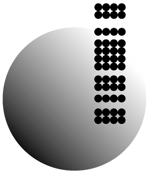

# File:Cgb logo.png

From GMOD

Jump to: [navigation](#mw-navigation), [search](#p-search)

- [File](#file)
- [File history](#filehistory)
- [File usage](#filelinks)

No higher resolution available.

<a href="../mediawiki/images/4/41/Cgb_logo.png" class="internal"
title="Cgb logo.png">Cgb_logo.png</a> ‎(164 × 83
pixels, file size: 4 KB, MIME type: image/png)

Logo for<a href="http://www.iub.edu/" class="external text"
rel="nofollow">Indiana University's</a>
<a href="http://cgb.indiana.edu/" class="external text"
rel="nofollow">Center for Genomics and Bioinformatics (CGB)</a>, a
contributor to GMOD. [ISGA](ISGA "ISGA") and
[WebGBrowse](WebGBrowse.1 "WebGBrowse") both come out of the CGB.

This logo is available in a these formats:

|  |  |
|----|----|
|  | Smaller with text, white background |
|  | Bigger, no text, transparent |

## File history

Click on a date/time to view the file as it appeared at that time.

|  |  |  |  |  |  |
|----|----|----|----|----|----|
|  | Date/Time | Thumbnail | Dimensions | User | Comment |
| current | [20:12, 21 April 2009](../mediawiki/images/4/41/Cgb_logo.png) |  | 164 × 83 (4 KB) | <a href="User:Clements" class="mw-userlink"
title="User:Clements">Clements</a>  (<a
href="http://gmod.org/mediawiki/index.php?title=User_talk:Clements&amp;action=edit&amp;redlink=1"
class="new" title="User talk:Clements (page does not exist)">Talk</a> \| [contribs](Special:Contributions/Clements "Special:Contributions/Clements")) |  |

- You cannot overwrite this
  file.

## File usage

The following 6 pages link to this file:

- [News/WebGBrowse 2.0](News/WebGBrowse_2.0 "News/WebGBrowse 2.0")
- [News/WebGBrowse Has
  Arrived](News/WebGBrowse_Has_Arrived "News/WebGBrowse Has Arrived")
- [WebGBrowse](WebGBrowse.1 "WebGBrowse")
- [WebGBrowse/tool data](WebGBrowse/tool_data "WebGBrowse/tool data")
- <File:Cgb-logo-transparent.png>
- [File:Cgb logo.png](File:Cgb_logo.png "File:Cgb logo.png")

Retrieved from
"<http://gmod.org/mediawiki/index.php?title=File:Cgb_logo.png&oldid=16100>"

[Category](Special:Categories "Special:Categories"):

- [Member Logos](Category:Member_Logos "Category:Member Logos")

## Navigation menu

### Namespaces

- <a href="File:Cgb_logo.png" accesskey="c"
  title="View the file page [c]">File</a>
- <a
  href="http://gmod.org/mediawiki/index.php?title=File_talk:Cgb_logo.png&amp;action=edit&amp;redlink=1"
  accesskey="t"
  title="Discussion about the content page [t]">Discussion</a>

### 

### Variants

### Navigation

- [GMOD Home](Main_Page)
- [Software](GMOD_Components)
- [Categories /
  Tags](Categories)
- [View all pages](Special:AllPages)

### Documentation

- [Overview](Overview)
- [FAQs](Category:FAQ)
- [HOWTOs](Category:HOWTO)
- [Glossary](Glossary)

### Community

- [GMOD News](GMOD_News)
- [Training /
  Outreach](Training_and_Outreach)
- [Support](Support)
- [GMOD Promotion](GMOD_Promotion)
- [Meetings](Meetings)
- [Calendar](Calendar)

### Tools

- <a href="Special:Browse/File:Cgb_logo.png" rel="smw-browse">Browse
  properties</a>

- Last updated at 16:36 on 14 December
  2010.
<!-- - 2,468 page views. -->
- Content is available under
  <a href="http://www.gnu.org/licenses/fdl-1.3.html" class="external"
  rel="nofollow">a GNU Free Documentation License</a> unless otherwise
  noted.

<!-- -->

- [About
  GMOD](GMOD:About "GMOD:About")

<!-- -->

