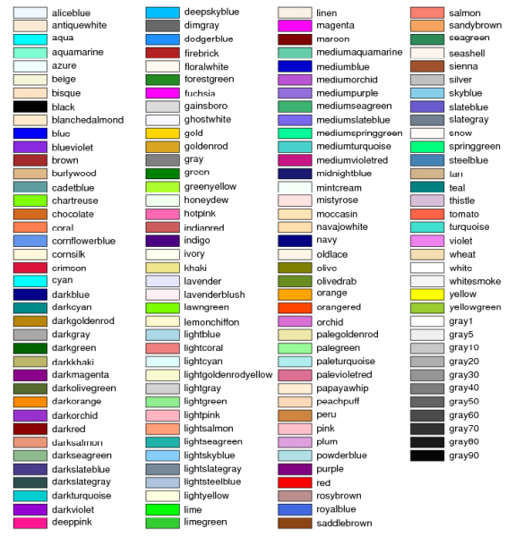
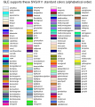

# File:Figure3.png

From GMOD

Jump to: [navigation](#mw-navigation), [search](#p-search)

- [File](#file)
- [File history](#filehistory)
- [File usage](#filelinks)

Size of this preview:
<a href="../mediawiki/images/thumb/e/ec/Figure3.png/576px-Figure3.png"
class="mw-thumbnail-link">576 × 600 pixels</a>.
Other resolution:
<a href="../mediawiki/images/e/ec/Figure3.png"
class="mw-thumbnail-link">729 × 759 pixels</a>.

<a href="../mediawiki/images/e/ec/Figure3.png" class="internal"
title="Figure3.png">Original file</a> ‎(729 × 759
pixels, file size: 72 KB, MIME type: image/png)

## File history

Click on a date/time to view the file as it appeared at that time.

|  |  |  |  |  |  |
|----|----|----|----|----|----|
|  | Date/Time | Thumbnail | Dimensions | User | Comment |
| current | [14:50, 31 January 2009](../mediawiki/images/e/ec/Figure3.png) |  | 729 × 759 (72 KB) | <a href="User:Lstein" class="mw-userlink" title="User:Lstein">Lstein</a>  (<a
href="http://gmod.org/mediawiki/index.php?title=User_talk:Lstein&amp;action=edit&amp;redlink=1"
class="new" title="User talk:Lstein (page does not exist)">Talk</a> \| [contribs](Special:Contributions/Lstein "Special:Contributions/Lstein")) |  |
|  | [14:47, 31 January 2009](../mediawiki/images/archive/e/ec/20090131145002!Figure3.png) |  | 741 × 830 (78 KB) | <a href="User:Lstein" class="mw-userlink" title="User:Lstein">Lstein</a>  (<a
href="http://gmod.org/mediawiki/index.php?title=User_talk:Lstein&amp;action=edit&amp;redlink=1"
class="new" title="User talk:Lstein (page does not exist)">Talk</a> \| [contribs](Special:Contributions/Lstein "Special:Contributions/Lstein")) |  |

- You cannot overwrite this
  file.

## File usage

The following page links to this file:

- [Glyphs and Glyph
  Options](Glyphs_and_Glyph_Options "Glyphs and Glyph Options")

Retrieved from
"<http://gmod.org/mediawiki/index.php?title=File:Figure3.png&oldid=7438>"

## Navigation menu

### Namespaces

- <a href="File:Figure3.png" accesskey="c"
  title="View the file page [c]">File</a>
- <a
  href="http://gmod.org/mediawiki/index.php?title=File_talk:Figure3.png&amp;action=edit&amp;redlink=1"
  accesskey="t"
  title="Discussion about the content page [t]">Discussion</a>

### 

### Variants

### Navigation

- [GMOD Home](Main_Page)
- [Software](GMOD_Components)
- [Categories /
  Tags](Categories)
- [View all pages](Special:AllPages)

### Documentation

- [Overview](Overview)
- [FAQs](Category:FAQ)
- [HOWTOs](Category:HOWTO)
- [Glossary](Glossary)

### Community

- [GMOD News](GMOD_News)
- [Training /
  Outreach](Training_and_Outreach)
- [Support](Support)
- [GMOD Promotion](GMOD_Promotion)
- [Meetings](Meetings)
- [Calendar](Calendar)

### Tools

- <a href="Special:WhatLinksHere/File:Figure3.png" accesskey="j"
  title="A list of all wiki pages that link here [j]">What links here</a>
- <a href="Special:RecentChangesLinked/File:Figure3.png" accesskey="k"
  title="Recent changes in pages linked from this page [k]">Related
  changes</a>
- <a href="Special:SpecialPages" accesskey="q"
  title="A list of all special pages [q]">Special pages</a>
- <a
  href="http://gmod.org/mediawiki/index.php?title=File:Figure3.png&amp;printable=yes"
  rel="alternate" accesskey="p"
  title="Printable version of this page [p]">Printable version</a>
- [Permanent
  link](http://gmod.org/mediawiki/index.php?title=File:Figure3.png&oldid=7438 "Permanent link to this revision of the page")
- [Page
  information](http://gmod.org/mediawiki/index.php?title=File:Figure3.png&action=info)
- <a href="Special:Browse/File:Figure3.png" rel="smw-browse">Browse
  properties</a>

- Last updated at 14:50 on 31 January
  2009.
- 8,993 page views.
- Content is available under
  <a href="http://www.gnu.org/licenses/fdl-1.3.html" class="external"
  rel="nofollow">a GNU Free Documentation License</a> unless otherwise
  noted.

<!-- -->

- [About
  GMOD](GMOD:About "GMOD:About")

<!-- -->

- 
- 
  

