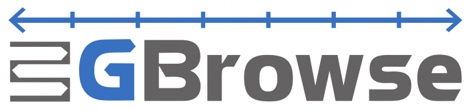

# File:GBrowseLogo.png

From GMOD

Jump to: [navigation](#mw-navigation), [search](#p-search)

- [File](#file)
- [File history](#filehistory)
- [File usage](#filelinks)
- [Metadata](#metadata)

Size of this preview: <a
href="../mediawiki/images/thumb/0/04/GBrowseLogo.png/800px-GBrowseLogo.png"
class="mw-thumbnail-link">800 × 188 pixels</a>.
Other resolution:
<a href="../mediawiki/images/0/04/GBrowseLogo.png"
class="mw-thumbnail-link">1,660 × 390 pixels</a>.

<a href="../mediawiki/images/0/04/GBrowseLogo.png" class="internal"
title="GBrowseLogo.png">Original file</a> ‎(1,660
× 390 pixels, file size: 56 KB, MIME type: image/png)

Logo for the [GBrowse](GBrowse.1 "GBrowse") genome browser.

This logo was created by
<a href="mailto:alexisnb1@yahoo.com" class="external text"
rel="nofollow">Alex Read</a> as part of the [Spring 2010 Logo
Program](Spring_2010_Logo_Program "Spring 2010 Logo Program"), while a
<a href="http://www.linnbenton.edu/go/graphic-arts"
class="external text" rel="nofollow">graphic design</a> student at
<a href="http://www.linnbenton.edu/" class="external text"
rel="nofollow">Linn-Benton Community College (LBCC)</a>.

|  |  |
|----|----|
|  | Force a 350 pixel wide version into existence so we can link to it from the PAG web site. |

## File history

Click on a date/time to view the file as it appeared at that time.

|  |  |  |  |  |  |
|----|----|----|----|----|----|
|  | Date/Time | Thumbnail | Dimensions | User | Comment |
| current | [23:14, 23 May 2013](../mediawiki/images/0/04/GBrowseLogo.png) |  | 1,660 × 390 (56 KB) | <a href="User:Girlwithglasses" class="mw-userlink"
title="User:Girlwithglasses">Girlwithglasses</a>  ([Talk](User_talk:Girlwithglasses "User talk:Girlwithglasses") \| [contribs](Special:Contributions/Girlwithglasses "Special:Contributions/Girlwithglasses")) | Transparent BG |
|  | [22:59, 22 October 2012](../mediawiki/images/archive/0/04/20130523231456!GBrowseLogo.png) |  | 1,666 × 396 (40 KB) | <a href="User:Girlwithglasses" class="mw-userlink"
title="User:Girlwithglasses">Girlwithglasses</a>  ([Talk](User_talk:Girlwithglasses "User talk:Girlwithglasses") \| [contribs](Special:Contributions/Girlwithglasses "Special:Contributions/Girlwithglasses")) | Reverted to version as of 22:15, 2 July 2010 |
|  | [22:15, 2 July 2010](../mediawiki/images/archive/0/04/20121022225905!GBrowseLogo.png) |  | 1,666 × 396 (40 KB) | <a href="User:Clements" class="mw-userlink"
title="User:Clements">Clements</a>  (<a
href="http://gmod.org/mediawiki/index.php?title=User_talk:Clements&amp;action=edit&amp;redlink=1"
class="new" title="User talk:Clements (page does not exist)">Talk</a> \| [contribs](Special:Contributions/Clements "Special:Contributions/Clements")) |  |

- You cannot overwrite this
  file.

## File usage

The following 13 pages link to this file:

- [Cloud](Cloud.1 "Cloud")
- [GBrowse](GBrowse.1 "GBrowse")
- [GBrowse NGS Tutorial](GBrowse_NGS_Tutorial "GBrowse NGS Tutorial")
- [GMOD Online Training
  2014](GMOD_Online_Training_2014.1 "GMOD Online Training 2014")
- [GMOD in a Box](GMOD_in_a_Box.1 "GMOD in a Box")
- [Main Page](Main_Page "Main Page")
- [News/GBrowse 2.13
  Release](News/GBrowse_2.13_Release "News/GBrowse 2.13 Release")
- [September 2010 GMOD
  Meeting](September_2010_GMOD_Meeting "September 2010 GMOD Meeting")
- [Spring 2010 Logo
  Program](Spring_2010_Logo_Program "Spring 2010 Logo Program")
- [User:JimHu/Gbrowse](User:JimHu/Gbrowse "User:JimHu/Gbrowse")
- <File:GBrowseLogo.png>
- [Template:GMODComponentPics](Template:GMODComponentPics "Template:GMODComponentPics")
- [Template:GMOD VM](Template:GMOD_VM "Template:GMOD VM")

## Metadata

This file contains additional information, probably added from the
digital camera or scanner used to create or digitize it. If the file has
been modified from its original state, some details may not fully
reflect the modified file.

|                       |            |
|-----------------------|------------|
| Horizontal resolution | 118.11 dpc |
| Vertical resolution   | 118.11 dpc |

Retrieved from
"<http://gmod.org/mediawiki/index.php?title=File:GBrowseLogo.png&oldid=23625>"

[Categories](Special:Categories "Special:Categories"):

- [Logos and Icons](Category:Logos_and_Icons "Category:Logos and Icons")
- [GBrowse](Category:GBrowse "Category:GBrowse")

## Navigation menu

### Namespaces

- <a href="File:GBrowseLogo.png" accesskey="c"
  title="View the file page [c]">File</a>
- <a
  href="http://gmod.org/mediawiki/index.php?title=File_talk:GBrowseLogo.png&amp;action=edit&amp;redlink=1"
  accesskey="t"
  title="Discussion about the content page [t]">Discussion</a>

### 

### Variants

### Navigation

- [GMOD Home](Main_Page)
- [Software](GMOD_Components)
- [Categories /
  Tags](Categories)
- [View all pages](Special:AllPages)

### Documentation

- [Overview](Overview)
- [FAQs](Category:FAQ)
- [HOWTOs](Category:HOWTO)
- [Glossary](Glossary)

### Community

- [GMOD News](GMOD_News)
- [Training /
  Outreach](Training_and_Outreach)
- [Support](Support)
- [GMOD Promotion](GMOD_Promotion)
- [Meetings](Meetings)
- [Calendar](Calendar)

### Tools

- <a href="Special:Browse/File:GBrowseLogo.png" rel="smw-browse">Browse
  properties</a>

- Last updated at 23:14 on 23 May
  2013.
<!-- - 24,604 page views. -->
- Content is available under
  <a href="http://www.gnu.org/licenses/fdl-1.3.html" class="external"
  rel="nofollow">a GNU Free Documentation License</a> unless otherwise
  noted.

<!-- -->

- [About
  GMOD](GMOD:About "GMOD:About")

<!-- -->

