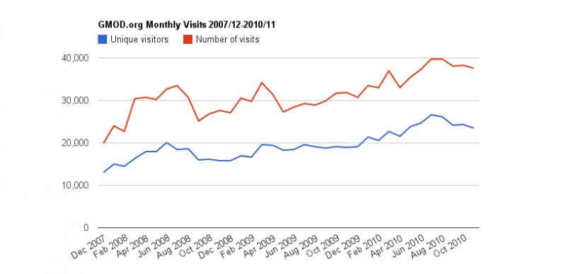
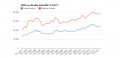
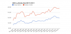

# File:GMOD.orgMonthlyVisitorsChart.png

From GMOD

Jump to: [navigation](#mw-navigation), [search](#p-search)

- [File](#file)
- [File history](#filehistory)
- [File usage](#filelinks)

Size of this preview: <a
href="../mediawiki/images/thumb/d/dc/GMOD.orgMonthlyVisitorsChart.png/800px-GMOD.orgMonthlyVisitorsChart.png"
class="mw-thumbnail-link">800 × 387 pixels</a>.
Other resolution:
<a href="../mediawiki/images/d/dc/GMOD.orgMonthlyVisitorsChart.png"
class="mw-thumbnail-link">815 × 394 pixels</a>.

<a href="../mediawiki/images/d/dc/GMOD.orgMonthlyVisitorsChart.png"
class="internal" title="GMOD.orgMonthlyVisitorsChart.png">Original
file</a> ‎(815 × 394 pixels, file size: 18 KB,
MIME type: image/png)

Monthly visits and visitors to the GMOD.org website. Generated by
pasting AWStats monthly numbers into Google Docs and then generating the
image.

## File history

Click on a date/time to view the file as it appeared at that time.

|  |  |  |  |  |  |
|----|----|----|----|----|----|
|  | Date/Time | Thumbnail | Dimensions | User | Comment |
| current | [19:16, 15 December 2010](../mediawiki/images/d/dc/GMOD.orgMonthlyVisitorsChart.png) |  | 815 × 394 (18 KB) | <a href="User:Clements" class="mw-userlink"
title="User:Clements">Clements</a>  (<a
href="http://gmod.org/mediawiki/index.php?title=User_talk:Clements&amp;action=edit&amp;redlink=1"
class="new" title="User talk:Clements (page does not exist)">Talk</a> \| [contribs](Special:Contributions/Clements "Special:Contributions/Clements")) |  |
|  | [18:49, 15 December 2010](../mediawiki/images/archive/d/dc/20101215191636!GMOD.orgMonthlyVisitorsChart.png) |  | 815 × 394 (21 KB) | <a href="User:Clements" class="mw-userlink"
title="User:Clements">Clements</a>  (<a
href="http://gmod.org/mediawiki/index.php?title=User_talk:Clements&amp;action=edit&amp;redlink=1"
class="new" title="User talk:Clements (page does not exist)">Talk</a> \| [contribs](Special:Contributions/Clements "Special:Contributions/Clements")) |  |

- You cannot overwrite this
  file.

## File usage

The following page links to this file:

- [News/GMOD Project Statistics
  Page](News/GMOD_Project_Statistics_Page "News/GMOD Project Statistics Page")

Retrieved from
"<http://gmod.org/mediawiki/index.php?title=File:GMOD.orgMonthlyVisitorsChart.png&oldid=16120>"

[Category](Special:Categories "Special:Categories"):

- [GMOD Project](Category:GMOD_Project "Category:GMOD Project")

## Navigation menu

### Personal tools

- <a
  href="http://gmod.org/mediawiki/index.php?title=Special:UserLogin&amp;returnto=File%3AGMOD.orgMonthlyVisitorsChart.png"
  accesskey="o"
  title="You are encouraged to log in; however, it is not mandatory [o]">Log
  in / create account</a>

### Namespaces

- <a href="File:GMOD.orgMonthlyVisitorsChart.png" accesskey="c"
  title="View the file page [c]">File</a>
- <a
  href="http://gmod.org/mediawiki/index.php?title=File_talk:GMOD.orgMonthlyVisitorsChart.png&amp;action=edit&amp;redlink=1"
  accesskey="t"
  title="Discussion about the content page [t]">Discussion</a>

### 

### Variants

### Views

- [Read](File:GMOD.orgMonthlyVisitorsChart.png)
- <a
  href="http://gmod.org/mediawiki/index.php?title=File:GMOD.orgMonthlyVisitorsChart.png&amp;action=edit"
  accesskey="e" title="This page is protected.
  You can view its source [e]">View source</a>
- <a
  href="http://gmod.org/mediawiki/index.php?title=File:GMOD.orgMonthlyVisitorsChart.png&amp;action=history"
  accesskey="h" title="Past revisions of this page [h]">View history</a>

### Actions

### Search

### Navigation

- [GMOD Home](Main_Page)
- [Software](GMOD_Components)
- [Categories /
  Tags](Categories)
- [View all pages](Special:AllPages)

### Documentation

- [Overview](Overview)
- [FAQs](Category:FAQ)
- [HOWTOs](Category:HOWTO)
- [Glossary](Glossary)

### Community

- [GMOD News](GMOD_News)
- [Training /
  Outreach](Training_and_Outreach)
- [Support](Support)
- [GMOD Promotion](GMOD_Promotion)
- [Meetings](Meetings)
- [Calendar](Calendar)

### Tools

- <a href="Special:WhatLinksHere/File:GMOD.orgMonthlyVisitorsChart.png"
  accesskey="j" title="A list of all wiki pages that link here [j]">What
  links here</a>
- <a
  href="Special:RecentChangesLinked/File:GMOD.orgMonthlyVisitorsChart.png"
  accesskey="k"
  title="Recent changes in pages linked from this page [k]">Related
  changes</a>
- <a href="Special:SpecialPages" accesskey="q"
  title="A list of all special pages [q]">Special pages</a>
- <a
  href="http://gmod.org/mediawiki/index.php?title=File:GMOD.orgMonthlyVisitorsChart.png&amp;printable=yes"
  rel="alternate" accesskey="p"
  title="Printable version of this page [p]">Printable version</a>
- [Permanent
  link](http://gmod.org/mediawiki/index.php?title=File:GMOD.orgMonthlyVisitorsChart.png&oldid=16120 "Permanent link to this revision of the page")
- [Page
  information](http://gmod.org/mediawiki/index.php?title=File:GMOD.orgMonthlyVisitorsChart.png&action=info)
- <a href="Special:Browse/File:GMOD.orgMonthlyVisitorsChart.png"
  rel="smw-browse">Browse properties</a>

- Last updated at 19:16 on 15 December
  2010.
- 2,288 page views.
- Content is available under
  <a href="http://www.gnu.org/licenses/fdl-1.3.html" class="external"
  rel="nofollow">a GNU Free Documentation License</a> unless otherwise
  noted.

<!-- -->

- [About
  GMOD](GMOD:About "GMOD:About")

<!-- -->

- 
- 
  

