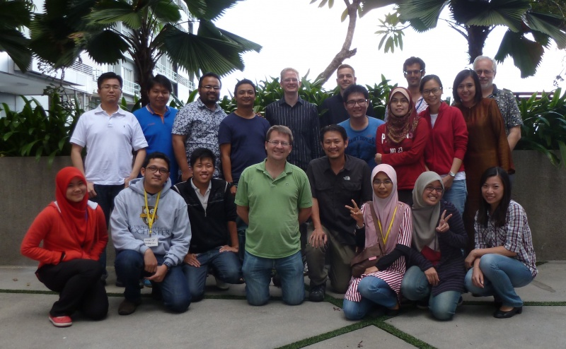
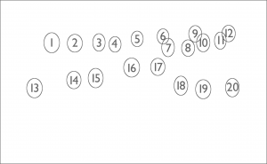
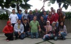

# File:GMODMalaysia2014GroupPhoto.jpg

From GMOD

Jump to: [navigation](#mw-navigation), [search](#p-search)

- [File](#file)
- [File history](#filehistory)
- [File usage](#filelinks)
- [Metadata](#metadata)

Size of this preview: <a
href="../mediawiki/images/thumb/7/74/GMODMalaysia2014GroupPhoto.jpg/800px-GMODMalaysia2014GroupPhoto.jpg"
class="mw-thumbnail-link">800 × 494 pixels</a>.
Other resolution:
<a href="../mediawiki/images/7/74/GMODMalaysia2014GroupPhoto.jpg"
class="mw-thumbnail-link">3,282 × 2,025 pixels</a>.

<a href="../mediawiki/images/7/74/GMODMalaysia2014GroupPhoto.jpg"
class="internal" title="GMODMalaysia2014GroupPhoto.jpg">Original
file</a> ‎(3,282 × 2,025 pixels, file size: 1.22
MB, MIME type: image/jpeg)

Group photo for [GMOD Malaysia
2014](GMOD_Malaysia_2014.1 "GMOD Malaysia 2014")

The participants were:

1.  Louis Eng Pew Lok
2.  Zac Mohd Zacaery Khalik
3.  Faisal Anwarali Khan
4.  Jayaraj Vijaya Kumaran
5.  [Mike Campbell](User:Michael_Campbell "User:Michael Campbell")
6.  Felix Bemm
7.  KK Loke Kok
8.  Ruby Rabiatul Zainal
9.  [Alex Kalderimis](User:Alexkalderimis "User:Alexkalderimis")
10. Janice Khor
11. Syakima Ab Mutalib
12. [Dave Clements](User:Clements "User:Clements")
13. Hadia Abd Raman
14. Farhan Sjuagi
15. Wei Hien Cheong
16. [Scott Cain](User:Scott "User:Scott")
17. Soon Joo Yap
18. Sri Noraima Othman
19. Syuhaidah Abu Bakar
20. Mun Hua Tan

Not pictured

- Han Ming Gan
- Ranjeev Hari
- Husyairi Harunarashid
- Wei Lun Ng
- [Amelia Ireland](User:Girlwithglasses "User:Girlwithglasses")

## File history

Click on a date/time to view the file as it appeared at that time.

|  |  |  |  |  |  |
|----|----|----|----|----|----|
|  | Date/Time | Thumbnail | Dimensions | User | Comment |
| current | [10:51, 3 March 2014](../mediawiki/images/7/74/GMODMalaysia2014GroupPhoto.jpg) |  | 3,282 × 2,025 (1.22 MB) | <a href="User:Clements" class="mw-userlink"
title="User:Clements">Clements</a>  (<a
href="http://gmod.org/mediawiki/index.php?title=User_talk:Clements&amp;action=edit&amp;redlink=1"
class="new" title="User talk:Clements (page does not exist)">Talk</a> \| [contribs](Special:Contributions/Clements "Special:Contributions/Clements")) |  |

- You cannot overwrite this
  file.

## File usage

The following page links to this file:

- [GMOD Malaysia 2014](GMOD_Malaysia_2014.1 "GMOD Malaysia 2014")

## Metadata

This file contains additional information, probably added from the
digital camera or scanner used to create or digitize it. If the file has
been modified from its original state, some details may not fully
reflect the modified file.

<table id="mw_metadata" class="mw_metadata">
<colgroup>
<col style="width: 50%" />
<col style="width: 50%" />
</colgroup>
<tbody>
<tr class="odd exif-make">
<th>Camera manufacturer</th>
<td>Panasonic</td>
</tr>
<tr class="even exif-model">
<th>Camera model</th>
<td>DMC-ZS8</td>
</tr>
<tr class="odd exif-exposuretime">
<th>Exposure time</th>
<td>1/80 sec (0.0125)</td>
</tr>
<tr class="even exif-fnumber">
<th>F Number</th>
<td>f/3.3</td>
</tr>
<tr class="odd exif-isospeedratings">
<th>ISO speed rating</th>
<td>100</td>
</tr>
<tr class="even exif-datetimeoriginal">
<th>Date and time of data generation</th>
<td>01:42, 28 February 2014</td>
</tr>
<tr class="odd exif-focallength">
<th>Lens focal length</th>
<td>4.3 mm</td>
</tr>
<tr class="even exif-orientation collapsable">
<th>Orientation</th>
<td>Normal</td>
</tr>
<tr class="odd exif-xresolution collapsable">
<th>Horizontal resolution</th>
<td>180 dpi</td>
</tr>
<tr class="even exif-yresolution collapsable">
<th>Vertical resolution</th>
<td>180 dpi</td>
</tr>
<tr class="odd exif-software collapsable">
<th>Software used</th>
<td>iPhoto 9.5.1</td>
</tr>
<tr class="even exif-datetime collapsable">
<th>File change date and time</th>
<td>01:42, 28 February 2014</td>
</tr>
<tr class="odd exif-exposureprogram collapsable">
<th>Exposure Program</th>
<td>Normal program</td>
</tr>
<tr class="even exif-exifversion collapsable">
<th>Exif version</th>
<td>2.3</td>
</tr>
<tr class="odd exif-datetimedigitized collapsable">
<th>Date and time of digitizing</th>
<td>01:42, 28 February 2014</td>
</tr>
<tr class="even exif-componentsconfiguration collapsable">
<th>Meaning of each component</th>
<td><ol>
<li>Y</li>
<li>Cb</li>
<li>Cr</li>
<li>does not exist</li>
</ol></td>
</tr>
<tr class="odd exif-compressedbitsperpixel collapsable">
<th>Image compression mode</th>
<td>4</td>
</tr>
<tr class="even exif-exposurebiasvalue collapsable">
<th>APEX exposure bias</th>
<td>0</td>
</tr>
<tr class="odd exif-maxaperturevalue collapsable">
<th>Maximum land aperture</th>
<td>3.4453125 APEX (f/3.3)</td>
</tr>
<tr class="even exif-meteringmode collapsable">
<th>Metering mode</th>
<td>Pattern</td>
</tr>
<tr class="odd exif-lightsource collapsable">
<th>Light source</th>
<td>Unknown</td>
</tr>
<tr class="even exif-flash collapsable">
<th>Flash</th>
<td>Flash did not fire, auto mode</td>
</tr>
<tr class="odd exif-flashpixversion collapsable">
<th>Supported Flashpix version</th>
<td>0,100</td>
</tr>
<tr class="even exif-colorspace collapsable">
<th>Color space</th>
<td>sRGB</td>
</tr>
<tr class="odd exif-sensingmethod collapsable">
<th>Sensing method</th>
<td>One-chip color area sensor</td>
</tr>
<tr class="even exif-filesource collapsable">
<th>File source</th>
<td>Digital still camera</td>
</tr>
<tr class="odd exif-customrendered collapsable">
<th>Custom image processing</th>
<td>Normal process</td>
</tr>
<tr class="even exif-exposuremode collapsable">
<th>Exposure mode</th>
<td>Auto exposure</td>
</tr>
<tr class="odd exif-whitebalance collapsable">
<th>White balance</th>
<td>Auto white balance</td>
</tr>
<tr class="even exif-digitalzoomratio collapsable">
<th>Digital zoom ratio</th>
<td>0</td>
</tr>
<tr class="odd exif-focallengthin35mmfilm collapsable">
<th>Focal length in 35 mm film</th>
<td>24 mm</td>
</tr>
<tr class="even exif-scenecapturetype collapsable">
<th>Scene capture type</th>
<td>Standard</td>
</tr>
<tr class="odd exif-gaincontrol collapsable">
<th>Scene control</th>
<td>None</td>
</tr>
<tr class="even exif-contrast collapsable">
<th>Contrast</th>
<td>Normal</td>
</tr>
<tr class="odd exif-saturation collapsable">
<th>Saturation</th>
<td>Normal</td>
</tr>
<tr class="even exif-sharpness collapsable">
<th>Sharpness</th>
<td>Normal</td>
</tr>
<tr class="odd exif-serialnumber collapsable">
<th>Serial number of camera</th>
<td>F641109220521</td>
</tr>
<tr class="even exif-specialinstructions collapsable">
<th>Special instructions</th>
<td>JcyFtT+uSjWGS+TJt0MKng</td>
</tr>
<tr class="odd exif-iimversion collapsable">
<th>IIM version</th>
<td>2</td>
</tr>
</tbody>
</table>

Retrieved from
"<http://gmod.org/mediawiki/index.php?title=File:GMODMalaysia2014GroupPhoto.jpg&oldid=25600>"

## Navigation menu

### Namespaces

- <a href="File:GMODMalaysia2014GroupPhoto.jpg" accesskey="c"
  title="View the file page [c]">File</a>
- <a
  href="http://gmod.org/mediawiki/index.php?title=File_talk:GMODMalaysia2014GroupPhoto.jpg&amp;action=edit&amp;redlink=1"
  accesskey="t"
  title="Discussion about the content page [t]">Discussion</a>

### 

### Variants

### Actions

### Search

### Navigation

- [GMOD Home](Main_Page)
- [Software](GMOD_Components)
- [Categories /
  Tags](Categories)
- [View all pages](Special:AllPages)

### Documentation

- [Overview](Overview)
- [FAQs](Category:FAQ)
- [HOWTOs](Category:HOWTO)
- [Glossary](Glossary)

### Community

- [GMOD News](GMOD_News)
- [Training /
  Outreach](Training_and_Outreach)
- [Support](Support)
- [GMOD Promotion](GMOD_Promotion)
- [Meetings](Meetings)
- [Calendar](Calendar)

### Tools

- <a href="Special:WhatLinksHere/File:GMODMalaysia2014GroupPhoto.jpg"
  accesskey="j" title="A list of all wiki pages that link here [j]">What
  links here</a>
- <a
  href="Special:RecentChangesLinked/File:GMODMalaysia2014GroupPhoto.jpg"
  accesskey="k"
  title="Recent changes in pages linked from this page [k]">Related
  changes</a>
- <a href="Special:SpecialPages" accesskey="q"
  title="A list of all special pages [q]">Special pages</a>
- <a
  href="http://gmod.org/mediawiki/index.php?title=File:GMODMalaysia2014GroupPhoto.jpg&amp;printable=yes"
  rel="alternate" accesskey="p"
  title="Printable version of this page [p]">Printable version</a>
- [Permanent
  link](http://gmod.org/mediawiki/index.php?title=File:GMODMalaysia2014GroupPhoto.jpg&oldid=25600 "Permanent link to this revision of the page")
- [Page
  information](http://gmod.org/mediawiki/index.php?title=File:GMODMalaysia2014GroupPhoto.jpg&action=info)
- <a href="Special:Browse/File:GMODMalaysia2014GroupPhoto.jpg"
  rel="smw-browse">Browse properties</a>

- Last updated at 10:58 on 3 March
  2014.
- 4,820 page views.
- Content is available under
  <a href="http://www.gnu.org/licenses/fdl-1.3.html" class="external"
  rel="nofollow">a GNU Free Documentation License</a> unless otherwise
  noted.

<!-- -->

- [About
  GMOD](GMOD:About "GMOD:About")

<!-- -->

- 
- 
  

