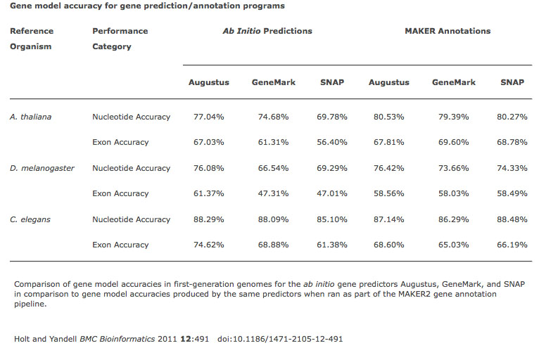
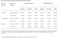

# File:MAKER2 Table1.jpg

From GMOD

Jump to: [navigation](#mw-navigation), [search](#p-search)

- [File](#file)
- [File history](#filehistory)
- [File usage](#filelinks)
- [Metadata](#metadata)

No higher resolution available.

<a href="../mediawiki/images/c/c8/MAKER2_Table1.jpg" class="internal"
title="MAKER2 Table1.jpg">MAKER2_Table1.jpg</a>
‎(776 × 495 pixels, file size: 97 KB, MIME type:
image/jpeg)

## File history

Click on a date/time to view the file as it appeared at that time.

|  |  |  |  |  |  |
|----|----|----|----|----|----|
|  | Date/Time | Thumbnail | Dimensions | User | Comment |
| current | [16:55, 5 September 2012](../mediawiki/images/c/c8/MAKER2_Table1.jpg) |  | 776 × 495 (97 KB) | <a href="User:Girlwithglasses" class="mw-userlink"
title="User:Girlwithglasses">Girlwithglasses</a>  ([Talk](User_talk:Girlwithglasses "User talk:Girlwithglasses") \| [contribs](Special:Contributions/Girlwithglasses "Special:Contributions/Girlwithglasses")) |  |

- You cannot overwrite this
  file.

## File usage

The following 4 pages link to this file:

- [GMOD Malaysia 2014/MAKER
  Tutorial](GMOD_Malaysia_2014/MAKER_Tutorial "GMOD Malaysia 2014/MAKER Tutorial")
- [GMOD Online Training 2014/MAKER
  Tutorial](GMOD_Online_Training_2014/MAKER_Tutorial "GMOD Online Training 2014/MAKER Tutorial")
- [MAKER Tutorial 2012](MAKER_Tutorial_2012 "MAKER Tutorial 2012")
- [MAKER Tutorial 2013](MAKER_Tutorial_2013 "MAKER Tutorial 2013")

## Metadata

This file contains additional information, probably added from the
digital camera or scanner used to create or digitize it. If the file has
been modified from its original state, some details may not fully
reflect the modified file.

|                           |                               |
|---------------------------|-------------------------------|
| Width                     | 776 px                        |
| Height                    | 495 px                        |
| Compression scheme        | LZW                           |
| Pixel composition         | RGB                           |
| Orientation               | Normal                        |
| Number of components      | 4                             |
| Horizontal resolution     | 72 dpi                        |
| Vertical resolution       | 72 dpi                        |
| Data arrangement          | chunky format                 |
| Software used             | Adobe Photoshop CS4 Macintosh |
| File change date and time | 11:42, 24 August 2012         |
| Color space               | Uncalibrated                  |

Retrieved from
"<http://gmod.org/mediawiki/index.php?title=File:MAKER2_Table1.jpg&oldid=21517>"

## Navigation menu

### Namespaces

- <a href="File:MAKER2_Table1.jpg" accesskey="c"
  title="View the file page [c]">File</a>
- <a
  href="http://gmod.org/mediawiki/index.php?title=File_talk:MAKER2_Table1.jpg&amp;action=edit&amp;redlink=1"
  accesskey="t"
  title="Discussion about the content page [t]">Discussion</a>

### 

### Variants

### Navigation

- [GMOD Home](Main_Page)
- [Software](GMOD_Components)
- [Categories /
  Tags](Categories)
- [View all pages](Special:AllPages)

### Documentation

- [Overview](Overview)
- [FAQs](Category:FAQ)
- [HOWTOs](Category:HOWTO)
- [Glossary](Glossary)

### Community

- [GMOD News](GMOD_News)
- [Training /
  Outreach](Training_and_Outreach)
- [Support](Support)
- [GMOD Promotion](GMOD_Promotion)
- [Meetings](Meetings)
- [Calendar](Calendar)

### Tools

- <a href="Special:Browse/File:MAKER2_Table1.jpg" rel="smw-browse">Browse
  properties</a>

- Last updated at 16:55 on 5 September
  2012.
- 3,441 page views.
- Content is available under
  <a href="http://www.gnu.org/licenses/fdl-1.3.html" class="external"
  rel="nofollow">a GNU Free Documentation License</a> unless otherwise
  noted.

<!-- -->

- [About
  GMOD](GMOD:About "GMOD:About")

<!-- -->

- 
- 
  

