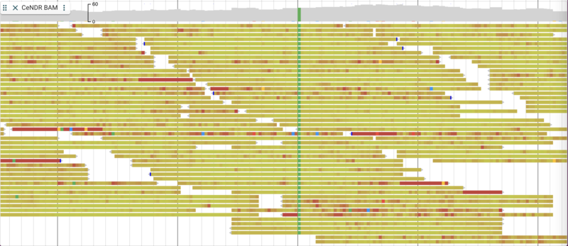
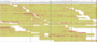

# File:Per base qual coloring.png

From GMOD

Jump to: [navigation](#mw-navigation), [search](#p-search)

- [File](#file)
- [File history](#filehistory)
- [File usage](#filelinks)
- [Metadata](#metadata)

Size of this preview: <a
href="../mediawiki/images/thumb/0/02/Per_base_qual_coloring.png/800px-Per_base_qual_coloring.png"
class="mw-thumbnail-link">800 × 347 pixels</a>.
Other resolution:
<a href="../mediawiki/images/0/02/Per_base_qual_coloring.png"
class="mw-thumbnail-link">2,270 × 984 pixels</a>.

<a href="../mediawiki/images/0/02/Per_base_qual_coloring.png"
class="internal" title="Per base qual coloring.png">Original file</a>
‎(2,270 × 984 pixels, file size: 243 KB, MIME
type: image/png)

## File history

Click on a date/time to view the file as it appeared at that time.

|  |  |  |  |  |  |
|----|----|----|----|----|----|
|  | Date/Time | Thumbnail | Dimensions | User | Comment |
| current | [18:04, 26 December 2022](../mediawiki/images/0/02/Per_base_qual_coloring.png) |  | 2,270 × 984 (243 KB) | <a href="User:Scott" class="mw-userlink" title="User:Scott">Scott</a>  ([Talk](User_talk:Scott "User talk:Scott") \| [contribs](Special:Contributions/Scott "Special:Contributions/Scott")) |  |

- You cannot overwrite this
  file.

## File usage

The following 2 pages link to this file:

- [JBrowse2 Tutorial PAG
  2023](JBrowse2_Tutorial_PAG_2023 "JBrowse2 Tutorial PAG 2023")
- [JBrowse2 Tutorial PAG
  2024](JBrowse2_Tutorial_PAG_2024 "JBrowse2 Tutorial PAG 2024")

## Metadata

This file contains additional information, probably added from the
digital camera or scanner used to create or digitize it. If the file has
been modified from its original state, some details may not fully
reflect the modified file.

|                       |           |
|-----------------------|-----------|
| Horizontal resolution | 56.69 dpc |
| Vertical resolution   | 56.69 dpc |

Retrieved from
"<http://gmod.org/mediawiki/index.php?title=File:Per_base_qual_coloring.png&oldid=28374>"

## Navigation menu

### Namespaces

- <a href="File:Per_base_qual_coloring.png" accesskey="c"
  title="View the file page [c]">File</a>
- <a
  href="http://gmod.org/mediawiki/index.php?title=File_talk:Per_base_qual_coloring.png&amp;action=edit&amp;redlink=1"
  accesskey="t"
  title="Discussion about the content page [t]">Discussion</a>

### 

### Variants

### Navigation

- [GMOD Home](Main_Page)
- [Software](GMOD_Components)
- [Categories /
  Tags](Categories)

### Documentation

- [Overview](Overview)
- [FAQs](Category:FAQ)
- [HOWTOs](Category:HOWTO)
- [Glossary](Glossary)

### Community

- [GMOD News](GMOD_News)
- [Training /
  Outreach](Training_and_Outreach)
- [Support](Support)
- [GMOD Promotion](GMOD_Promotion)
- [Meetings](Meetings)
- [Calendar](Calendar)

### Tools

- <a href="Special:Browse/File:Per_base_qual_coloring.png"
  rel="smw-browse">Browse properties</a>

- Last updated at 18:04 on 26 December
  2022.
<!-- - 106 page views. -->
- Content is available under
  <a href="http://www.gnu.org/licenses/fdl-1.3.html" class="external"
  rel="nofollow">a GNU Free Documentation License</a> unless otherwise
  noted.

<!-- -->

- [About
  GMOD](GMOD:About "GMOD:About")

<!-- -->

