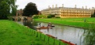

# File:Punting on the Cam.jpg

From GMOD

Jump to: [navigation](#mw-navigation), [search](#p-search)

- [File](#file)
- [File history](#filehistory)
- [File usage](#filelinks)
- [Metadata](#metadata)

Size of this preview: <a
href="../mediawiki/images/thumb/a/ac/Punting_on_the_Cam.jpg/800px-Punting_on_the_Cam.jpg"
class="mw-thumbnail-link">800 × 377 pixels</a>.
Other resolution:
<a href="../mediawiki/images/a/ac/Punting_on_the_Cam.jpg"
class="mw-thumbnail-link">1,064 × 501 pixels</a>.

<a href="../mediawiki/images/a/ac/Punting_on_the_Cam.jpg"
class="internal" title="Punting on the Cam.jpg">Original file</a>
‎(1,064 × 501 pixels, file size: 358 KB, MIME
type: image/jpeg)

People "punting" on the Cam River. Taken at the GMOD meeting in
Cambridge, 2010.

## File history

Click on a date/time to view the file as it appeared at that time.

|  |  |  |  |  |  |
|----|----|----|----|----|----|
|  | Date/Time | Thumbnail | Dimensions | User | Comment |
| current | [20:24, 6 September 2011](../mediawiki/images/a/ac/Punting_on_the_Cam.jpg) |  | 1,064 × 501 (358 KB) | <a href="User:DanielRenfro" class="mw-userlink"
title="User:DanielRenfro">DanielRenfro</a>  (<a
href="http://gmod.org/mediawiki/index.php?title=User_talk:DanielRenfro&amp;action=edit&amp;redlink=1"
class="new"
title="User talk:DanielRenfro (page does not exist)">Talk</a> \| [contribs](Special:Contributions/DanielRenfro "Special:Contributions/DanielRenfro")) | People "punting" on the Cam River. Taken at the GMOD meeting in Cambridge, 2010. |

- You cannot overwrite this
  file.

## File usage

The following page links to this file:

- [User:DanielRenfro](User:DanielRenfro "User:DanielRenfro")

## Metadata

This file contains additional information, probably added from the
digital camera or scanner used to create or digitize it. If the file has
been modified from its original state, some details may not fully
reflect the modified file.

|  |  |
|----|----|
| Camera manufacturer | Canon |
| Camera model | Canon PowerShot A85 |
| Exposure time | 1/500 sec (0.002) |
| F Number | f/4 |
| Date and time of data generation | 08:28, 14 September 2010 |
| Lens focal length | 5.40625 mm |
| Orientation | Normal |
| Horizontal resolution | 180 dpi |
| Vertical resolution | 180 dpi |
| Software used | Adobe Photoshop CS3 Macintosh |
| File change date and time | 10:05, 1 March 2011 |
| Y and C positioning | Centered |
| Exif version | 2.2 |
| Date and time of digitizing | 08:28, 14 September 2010 |
| Image compression mode | 3 |
| APEX shutter speed | 8.96875 |
| APEX aperture | 4 |
| APEX exposure bias | 0 |
| Maximum land aperture | 2.96875 APEX (f/2.8) |
| Metering mode | Pattern |
| Flash | Flash did not fire, compulsory flash suppression |
| Color space | sRGB |
| Focal plane X resolution | 10,819.047619048 |
| Focal plane Y resolution | 10,784.810126582 |
| Focal plane resolution unit | inches |
| Sensing method | One-chip color area sensor |
| Custom image processing | Normal process |
| Exposure mode | Auto exposure |
| White balance | Auto white balance |
| Digital zoom ratio | 1 |
| Scene capture type | Standard |

Retrieved from
"<http://gmod.org/mediawiki/index.php?title=File:Punting_on_the_Cam.jpg&oldid=18881>"

## Navigation menu

### Namespaces

- <a href="File:Punting_on_the_Cam.jpg" accesskey="c"
  title="View the file page [c]">File</a>
- <a
  href="http://gmod.org/mediawiki/index.php?title=File_talk:Punting_on_the_Cam.jpg&amp;action=edit&amp;redlink=1"
  accesskey="t"
  title="Discussion about the content page [t]">Discussion</a>

### 

### Variants

### Actions

### Search

### Navigation

- [GMOD Home](Main_Page)
- [Software](GMOD_Components)
- [Categories /
  Tags](Categories)
- [View all pages](Special:AllPages)

### Documentation

- [Overview](Overview)
- [FAQs](Category:FAQ)
- [HOWTOs](Category:HOWTO)
- [Glossary](Glossary)

### Community

- [GMOD News](GMOD_News)
- [Training /
  Outreach](Training_and_Outreach)
- [Support](Support)
- [GMOD Promotion](GMOD_Promotion)
- [Meetings](Meetings)
- [Calendar](Calendar)

### Tools

- <a href="Special:WhatLinksHere/File:Punting_on_the_Cam.jpg"
  accesskey="j" title="A list of all wiki pages that link here [j]">What
  links here</a>
- <a href="Special:RecentChangesLinked/File:Punting_on_the_Cam.jpg"
  accesskey="k"
  title="Recent changes in pages linked from this page [k]">Related
  changes</a>
- <a href="Special:SpecialPages" accesskey="q"
  title="A list of all special pages [q]">Special pages</a>
- <a
  href="http://gmod.org/mediawiki/index.php?title=File:Punting_on_the_Cam.jpg&amp;printable=yes"
  rel="alternate" accesskey="p"
  title="Printable version of this page [p]">Printable version</a>
- [Permanent
  link](http://gmod.org/mediawiki/index.php?title=File:Punting_on_the_Cam.jpg&oldid=18881 "Permanent link to this revision of the page")
- [Page
  information](http://gmod.org/mediawiki/index.php?title=File:Punting_on_the_Cam.jpg&action=info)
- <a href="Special:Browse/File:Punting_on_the_Cam.jpg"
  rel="smw-browse">Browse properties</a>

- Last updated at 20:24 on 6 September
  2011.
- 2,036 page views.
- Content is available under
  <a href="http://www.gnu.org/licenses/fdl-1.3.html" class="external"
  rel="nofollow">a GNU Free Documentation License</a> unless otherwise
  noted.

<!-- -->

- [About
  GMOD](GMOD:About "GMOD:About")

<!-- -->

- 
- 
  

