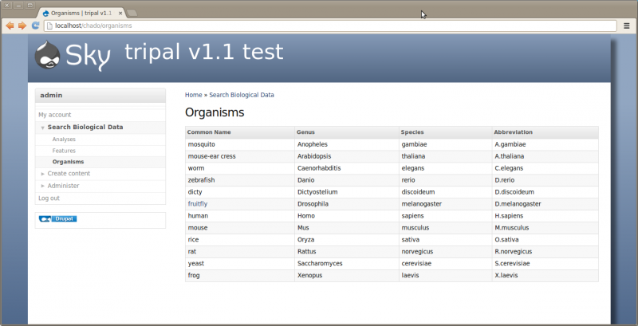
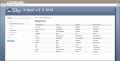

# File:TripalOrganismList.png

From GMOD

Jump to: [navigation](#mw-navigation), [search](#p-search)

- [File](#file)
- [File history](#filehistory)
- [File usage](#filelinks)
- [Metadata](#metadata)

Size of this preview: <a
href="../mediawiki/images/thumb/b/bf/TripalOrganismList.png/800px-TripalOrganismList.png"
class="mw-thumbnail-link">800 × 409 pixels</a>.
Other resolution:
<a href="../mediawiki/images/b/bf/TripalOrganismList.png"
class="mw-thumbnail-link">1,445 × 739 pixels</a>.

<a href="../mediawiki/images/b/bf/TripalOrganismList.png"
class="internal" title="TripalOrganismList.png">Original file</a>
‎(1,445 × 739 pixels, file size: 86 KB, MIME type:
image/png)

## File history

Click on a date/time to view the file as it appeared at that time.

|  |  |  |  |  |  |
|----|----|----|----|----|----|
|  | Date/Time | Thumbnail | Dimensions | User | Comment |
| current | [14:59, 21 June 2013](../mediawiki/images/b/bf/TripalOrganismList.png) |  | 1,445 × 739 (86 KB) | <a href="User:Sficklin" class="mw-userlink"
title="User:Sficklin">Sficklin</a>  (<a
href="http://gmod.org/mediawiki/index.php?title=User_talk:Sficklin&amp;action=edit&amp;redlink=1"
class="new" title="User talk:Sficklin (page does not exist)">Talk</a> \| [contribs](Special:Contributions/Sficklin "Special:Contributions/Sficklin")) |  |
|  | [03:21, 25 August 2012](../mediawiki/images/archive/b/bf/20130621145938!TripalOrganismList.png) |  | 1,462 × 501 (81 KB) | <a href="User:Sficklin" class="mw-userlink"
title="User:Sficklin">Sficklin</a>  (<a
href="http://gmod.org/mediawiki/index.php?title=User_talk:Sficklin&amp;action=edit&amp;redlink=1"
class="new" title="User talk:Sficklin (page does not exist)">Talk</a> \| [contribs](Special:Contributions/Sficklin "Special:Contributions/Sficklin")) |  |

- You cannot overwrite this
  file.

## File usage

The following 3 pages link to this file:

- [GMOD Malaysia 2014/Tripal
  Tutorial](GMOD_Malaysia_2014/Tripal_Tutorial "GMOD Malaysia 2014/Tripal Tutorial")
- [Tripal Tutorial
  (v1.0)](Tripal_Tutorial_(v1.0) "Tripal Tutorial (v1.0)")
- [Tripal Tutorial v1.1](Tripal_Tutorial_v1.1 "Tripal Tutorial v1.1")

## Metadata

This file contains additional information, probably added from the
digital camera or scanner used to create or digitize it. If the file has
been modified from its original state, some details may not fully
reflect the modified file.

<table id="mw_metadata" class="mw_metadata">
<colgroup>
<col style="width: 50%" />
<col style="width: 50%" />
</colgroup>
<tbody>
<tr class="odd exif-software collapsable">
<th>Software used</th>
<td><ul>
<li>gnome-screenshot</li>
</ul></td>
</tr>
</tbody>
</table>

Retrieved from
"<http://gmod.org/mediawiki/index.php?title=File:TripalOrganismList.png&oldid=23707>"

## Navigation menu

### Namespaces

- <a href="File:TripalOrganismList.png" accesskey="c"
  title="View the file page [c]">File</a>
- <a
  href="http://gmod.org/mediawiki/index.php?title=File_talk:TripalOrganismList.png&amp;action=edit&amp;redlink=1"
  accesskey="t"
  title="Discussion about the content page [t]">Discussion</a>

### 

### Variants

### Navigation

- [GMOD Home](Main_Page)
- [Software](GMOD_Components)
- [Categories /
  Tags](Categories)
- [View all pages](Special:AllPages)

### Documentation

- [Overview](Overview)
- [FAQs](Category:FAQ)
- [HOWTOs](Category:HOWTO)
- [Glossary](Glossary)

### Community

- [GMOD News](GMOD_News)
- [Training /
  Outreach](Training_and_Outreach)
- [Support](Support)
- [GMOD Promotion](GMOD_Promotion)
- [Meetings](Meetings)
- [Calendar](Calendar)

### Tools

- <a href="Special:Browse/File:TripalOrganismList.png"
  rel="smw-browse">Browse properties</a>

- Last updated at 14:59 on 21 June
  2013.
<!-- - 2,512 page views. -->
- Content is available under
  <a href="http://www.gnu.org/licenses/fdl-1.3.html" class="external"
  rel="nofollow">a GNU Free Documentation License</a> unless otherwise
  noted.

<!-- -->

- [About
  GMOD](GMOD:About "GMOD:About")

<!-- -->

- 

