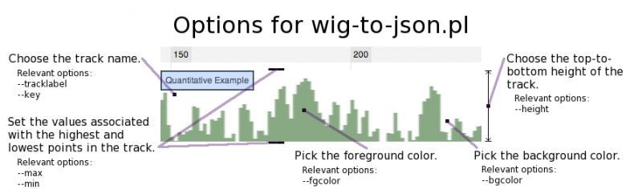

# File:Wiggle-options.png

From GMOD

Jump to: [navigation](#mw-navigation), [search](#p-search)

- [File](#file)
- [File history](#filehistory)
- [File usage](#filelinks)

Size of this preview: <a
href="../mediawiki/images/thumb/2/26/Wiggle-options.png/800px-Wiggle-options.png"
class="mw-thumbnail-link">800 × 236 pixels</a>.
Other resolution:
<a href="../mediawiki/images/2/26/Wiggle-options.png"
class="mw-thumbnail-link">892 × 263 pixels</a>.

<a href="../mediawiki/images/2/26/Wiggle-options.png" class="internal"
title="Wiggle-options.png">Original file</a> ‎(892
× 263 pixels, file size: 37 KB, MIME type: image/png)

A visual representation of wig-to-json.pl options.

## File history

Click on a date/time to view the file as it appeared at that time.

|  |  |  |  |  |  |
|----|----|----|----|----|----|
|  | Date/Time | Thumbnail | Dimensions | User | Comment |
| current | [01:03, 21 June 2011](../mediawiki/images/2/26/Wiggle-options.png) |  | 892 × 263 (37 KB) | <a href="User:RSCummings" class="mw-userlink"
title="User:RSCummings">RSCummings</a>  ([Talk](User_talk:RSCummings "User talk:RSCummings") \| [contribs](Special:Contributions/RSCummings "Special:Contributions/RSCummings")) | A visual representation of wig-to-json.pl options. |

- You cannot overwrite this
  file.

## File usage

The following page links to this file:

- [JBrowse Configuration
  Guide](JBrowse_Configuration_Guide "JBrowse Configuration Guide")

Retrieved from
"<http://gmod.org/mediawiki/index.php?title=File:Wiggle-options.png&oldid=18376>"

[Category](Special:Categories "Special:Categories"):

- [JBrowse](Category:JBrowse "Category:JBrowse")

## Navigation menu

### Namespaces

- <a href="File:Wiggle-options.png" accesskey="c"
  title="View the file page [c]">File</a>
- <a
  href="http://gmod.org/mediawiki/index.php?title=File_talk:Wiggle-options.png&amp;action=edit&amp;redlink=1"
  accesskey="t"
  title="Discussion about the content page [t]">Discussion</a>

### 

### Variants

### Navigation

- [GMOD Home](Main_Page)
- [Software](GMOD_Components)
- [Categories /
  Tags](Categories)
- [View all pages](Special:AllPages)

### Documentation

- [Overview](Overview)
- [FAQs](Category:FAQ)
- [HOWTOs](Category:HOWTO)
- [Glossary](Glossary)

### Community

- [GMOD News](GMOD_News)
- [Training /
  Outreach](Training_and_Outreach)
- [Support](Support)
- [GMOD Promotion](GMOD_Promotion)
- [Meetings](Meetings)
- [Calendar](Calendar)

### Tools

- <a href="Special:Browse/File:Wiggle-2Doptions.png"
  rel="smw-browse">Browse properties</a>

- Last updated at 18:16 on 29 July
  2011.
<!-- - 3,555 page views. -->
- Content is available under
  <a href="http://www.gnu.org/licenses/fdl-1.3.html" class="external"
  rel="nofollow">a GNU Free Documentation License</a> unless otherwise
  noted.

<!-- -->

- [About
  GMOD](GMOD:About "GMOD:About")

<!-- -->

- 

