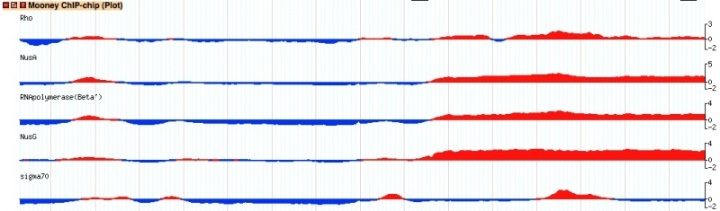
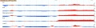

# File:Wiggle xyplot.jpg

From GMOD

Jump to: [navigation](#mw-navigation), [search](#p-search)

- [File](#file)
- [File history](#filehistory)
- [File usage](#filelinks)
- [Metadata](#metadata)

Size of this preview: <a
href="../mediawiki/images/thumb/5/56/Wiggle_xyplot.jpg/800px-Wiggle_xyplot.jpg"
class="mw-thumbnail-link">800 × 235 pixels</a>.
Other resolution:
<a href="../mediawiki/images/5/56/Wiggle_xyplot.jpg"
class="mw-thumbnail-link">1,052 × 309 pixels</a>.

<a href="../mediawiki/images/5/56/Wiggle_xyplot.jpg" class="internal"
title="Wiggle xyplot.jpg">Original file</a>
‎(1,052 × 309 pixels, file size: 108 KB, MIME
type: image/jpeg)

Sample picture for the wiggle_xyplot glypho

## File history

Click on a date/time to view the file as it appeared at that time.

|  |  |  |  |  |  |
|----|----|----|----|----|----|
|  | Date/Time | Thumbnail | Dimensions | User | Comment |
| current | [19:50, 11 February 2010](../mediawiki/images/5/56/Wiggle_xyplot.jpg) |  | 1,052 × 309 (108 KB) | <a href="User:DanielRenfro" class="mw-userlink"
title="User:DanielRenfro">DanielRenfro</a>  (<a
href="http://gmod.org/mediawiki/index.php?title=User_talk:DanielRenfro&amp;action=edit&amp;redlink=1"
class="new"
title="User talk:DanielRenfro (page does not exist)">Talk</a> \| [contribs](Special:Contributions/DanielRenfro "Special:Contributions/DanielRenfro")) | Sample picture for the wiggle_xyplot glypho |

- You cannot overwrite this
  file.

## File usage

The following page links to this file:

- [Glyphs and Glyph
  Options](Glyphs_and_Glyph_Options "Glyphs and Glyph Options")

## Metadata

This file contains additional information, probably added from the
digital camera or scanner used to create or digitize it. If the file has
been modified from its original state, some details may not fully
reflect the modified file.

|                       |        |
|-----------------------|--------|
| Pixel composition     | RGB    |
| Orientation           | Normal |
| Horizontal resolution | 72 dpi |
| Vertical resolution   | 72 dpi |

Retrieved from
"<http://gmod.org/mediawiki/index.php?title=File:Wiggle_xyplot.jpg&oldid=11944>"

## Navigation menu

### Namespaces

- <a href="File:Wiggle_xyplot.jpg" accesskey="c"
  title="View the file page [c]">File</a>
- <a
  href="http://gmod.org/mediawiki/index.php?title=File_talk:Wiggle_xyplot.jpg&amp;action=edit&amp;redlink=1"
  accesskey="t"
  title="Discussion about the content page [t]">Discussion</a>

### 

### Variants

### Navigation

- [GMOD Home](Main_Page)
- [Software](GMOD_Components)
- [Categories /
  Tags](Categories)
- [View all pages](Special:AllPages)

### Documentation

- [Overview](Overview)
- [FAQs](Category:FAQ)
- [HOWTOs](Category:HOWTO)
- [Glossary](Glossary)

### Community

- [GMOD News](GMOD_News)
- [Training /
  Outreach](Training_and_Outreach)
- [Support](Support)
- [GMOD Promotion](GMOD_Promotion)
- [Meetings](Meetings)
- [Calendar](Calendar)

### Tools

- <a href="Special:Browse/File:Wiggle_xyplot.jpg" rel="smw-browse">Browse
  properties</a>

- Last updated at 19:50 on 11 February
  2010.
<!-- - 3,406 page views. -->
- Content is available under
  <a href="http://www.gnu.org/licenses/fdl-1.3.html" class="external"
  rel="nofollow">a GNU Free Documentation License</a> unless otherwise
  noted.

<!-- -->

- [About
  GMOD](GMOD:About "GMOD:About")

<!-- -->

