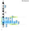
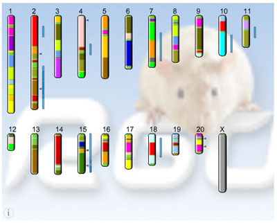
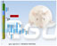
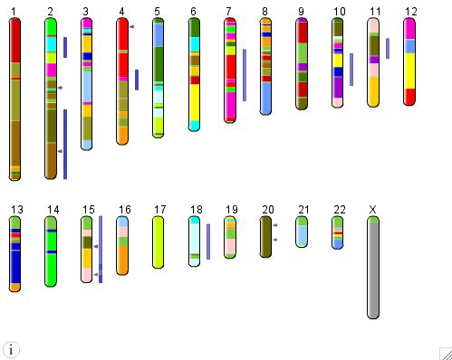
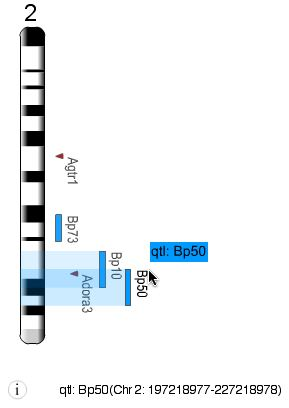
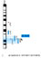
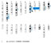
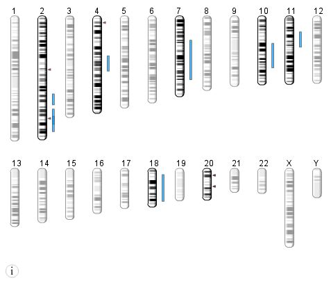
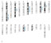

# Flash GViewer

From GMOD

Jump to: [navigation](#mw-navigation), [search](#p-search)

  
Flash GViewer is a **customizable Flash movie** that can be easily
inserted into a web page to display each chromosome in a genome along
with the locations of individual features on the chromosomes. It is
**intended to provide an overview of the genomic locations of a specific
set of features** - eg. genes and QTLs associated with a specific
[phenotype](Category%3APhenotypes "Category%3APhenotypes"), etc. rather than
as a way to view all features on the genome. The features can hyperlink
out to a detail page to enable to GViewer to be used as a navigation
tool. In addition the bands on the chromosomes can link to defineable
URL and new region selection sliders can be used to select a specific
chromosome region and then link out to a genome browser for higher
resolution information.

## Contents

- [1 Demo &
  Screenshots](#Demo_.26_Screenshots)
- [2
  Requirements](#Requirements)
- [3
  Documentation](#Documentation)
- [4
  Contact](#Contact)
- [5
  Downloads](#Downloads)

## Demo & Screenshots

Check out the
<a href="http://blog.gmod.org/nondrupal/FlashGViewer_forWeb/index.html"
class="external text" rel="nofollow">live version of the Flash
GViewer</a>!

Screenshots of the tool are provided below.

## Requirements

- Macromedia Flash Plugin version 7, it can be downloaded from
  Macromedia <a
  href="http://www.macromedia.com/shockwave/download/download.cgi?P1_Prod_Version=ShockwaveFlash&amp;promoid=BIOW"
  class="external text" rel="nofollow">here</a>. To edit the source code
  (the `.fla` file in
  <a href="SVN" class="mw-redirect" title="SVN">SVN</a>) and publish
  modified versions of the `.swf` requires Macromedia Flash Professional
  v7.

## Documentation

Installation instructions, explanations of the Flash HTML tags, the XML
file formats for the base map and the annotations are discussed in the
[Flash GViewer
documentation](Flash_GViewer_Documentation "Flash GViewer Documentation").

## Contact

<a href="mailto:simont@mcw.edu" class="external text"
rel="nofollow">Simon Twigger</a>

## Downloads

<a
href="http://sourceforge.net/project/showfiles.php?group_id=27707&amp;package_id=161280"
class="external text" rel="nofollow">Via the web from sourceforge</a>

Retrieved from
"<http://gmod.org/mediawiki/index.php?title=Flash_GViewer&oldid=25554>"

[Categories](Special%3ACategories "Special%3ACategories"):

- [GMOD Components](Category%3AGMOD_Components "Category%3AGMOD Components")
- [RGD](Category%3ARGD "Category%3ARGD")

## Navigation menu

### Namespaces

- <a
  href="http://gmod.org/mediawiki/index.php?title=Talk:Flash_GViewer&amp;action=edit&amp;redlink=1"
  accesskey="t"
  title="Discussion about the content page [t]">Discussion</a>

### 

### Variants

### Navigation

- [GMOD Home](Main_Page)
- [Software](GMOD_Components)
- [Categories /
  Tags](Categories)

### Documentation

- [Overview](Overview)
- [FAQs](Category%3AFAQ)
- [HOWTOs](Category%3AHOWTO)
- [Glossary](Glossary)

### Community

- [GMOD News](GMOD_News)
- [Training /
  Outreach](Training_and_Outreach)
- [Support](Support)
- [GMOD Promotion](GMOD_Promotion)
- [Meetings](Meetings)
- [Calendar](Calendar)

### Tools

- <a href="Special%3ABrowse/Flash_GViewer" rel="smw-browse">Browse
  properties</a>

- Last updated at 19:41 on 26 February
  2014.
<!-- - 118,862 page views. -->
- Content is available under
  <a href="http://www.gnu.org/licenses/fdl-1.3.html" class="external"
  rel="nofollow">a GNU Free Documentation License</a> unless otherwise
  noted.

<!-- -->

- [About
  GMOD](GMOD:About "GMOD:About")

<!-- -->

