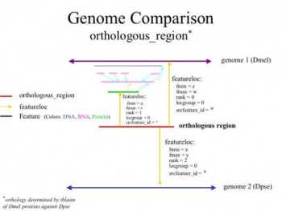
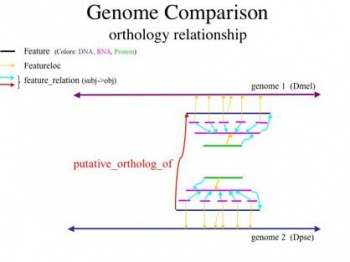
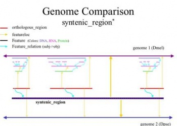

# FlyBase Comparative Genomics Data

From GMOD

Jump to: [navigation](#mw-navigation), [search](#p-search)

## Contents

- [1 Comparative
  Genomics Data Implementation in
  Chado](#Comparative_Genomics_Data_Implementation_in_Chado)
  - [1.1
    Background](#Background)
  - [1.2
    Orthology](#Orthology)
    - [1.2.1 a)
      orthologous regions](#a.29_orthologous_regions)
    - [1.2.2 b)
      orthologous genes](#b.29_orthologous_genes)
  - [1.3
    Synteny](#Synteny)

# Comparative Genomics Data Implementation in Chado

by Peili Zhang, David Emmert, Pinglei Zhou, William Gelbart, and the
FlyBase Consortium

## Background

The data implementation standard of comparative genomics in Chado is
described in this document. The stated data implementation has been
formulated by the developers at FlyBase
(<a href="http://www.flybase.org" class="external free"
rel="nofollow">http://www.flybase.org</a>) and adopted by FlyBase for
production. For the purpose of clarity, pairwise comparative genomics
results are being employed in this document as examples to illustrate
the points. Yet the same implementation can be readily generalized and
applied to multiple-genome comparative results. To store the comparative
results between two genomes in Chado, the sequence and annotation data
of each of the relevant genomes need to be implemented independently in
the same Chado database instance. The Chado standards of genomic
sequences and annotation are detailed in separate documents, which
should be followed before attempting the comparative data implementation
described here. Comparative genomics data of interest are grouped into
the following two categories: orthology and synteny, for which the Chado
standards are illustrated separately below.

## Orthology

### a) orthologous regions

Figure 1:implementation of orthologous region features in Chado. Two
Drosophila genomes are used as examples. Dmel: Drosophila melanogaster;
Dpse: Drosophila pseudoobscura.

Orthologous regions are implemented similarly to alignment match
features, the only difference being that the orthologous regions are
features of type 'orthologous_region' whereas alignment match features
are of type 'match'. Basically, the orthologous regions are stored as
analysis features of type 'orthologous_region', belonging to the fake
organism of genus 'Computational' and species 'result'. They are linked
to the appropriate analysis that derived them through analysisfeature
links. Each orthologous region derived from TBLASTN analysis, as an
example, has three featureloc records of ranks 0 to 2, with rank = 0 for
the localization on genome 1, rank = 1 on the protein feature of genome
1, and rank = 2 on genome 2, for a pairwise comparative genome analysis
between organism 1 and 2. The implementation of orthologous regions is
illustrated in Figure 1 below.

  

### b) orthologous genes

Figure 2: Chado representation of orthology relationship between a gene
pair.

The orthology relationship between a gene pair is represented in Chado
through feature_relationship, with the two genes being object and
subject (arbitrarily set and consistent across the database) and the
feature_relationship type being 'putative_ortholog_of'. The detailed
data storage is depicted in Figure 2.

## Synteny

Syntenic regions between genomes are stored as features of type
'syntenic_region', belonging to the made-up organism of genus
'Computational' and species 'result'. The genomic spans of these
syntenic regions on each of the genomes are stored as featureloc
records, with featureloc.rank assigned differently for the different
genomes. For example, genomic span 10000..50000 of genome 1 chromosome 1
is syntenic to the span 12345..56789 of genome 2 chromosome 2, a feature
of uniquename 'syntenic_block:1', type 'syntenic_region' and organism
-'Computational result' is created. The feature 'syntenic_block:1' has
two featureloc records: 1. rank = 0, fmin = 9999, fmax = 50000 (note:
the interbase coordinates are utilized), strand = NULL, and
srcfeature_id pointing to genome 1 chromosome 1; 2. rank = 1, fmin =
12344, fmax = 56789, strand = NULL, and srcfeature_id pointing to genome
2 chromosome 2.

In addition, the component orthologous regions of a syntenic region are
recorded through feature_relationship records between the syntenic
region feature and the relevant orthologous region features which are
implemented as described in Section I. a), with a feature_relationship
type of 'partof' and feature_relationship.rank left as the default value
of 0. Bear in mind that the orthologous region features are, in essence,
'match' features, each of which represents a pair of orthologous genomic
spans from the two genomes. The reason the feature_relationship.rank
field is left as default 0 is that the relative ordering of the
orthologous regions on each genome is implied by their genomic
locations. Furthermore, one pair of orthologous regions may be in
slightly different relative ordering on the two genomes, for example,
orthologous regions 1, 2, 3, 4 form one syntenic block. Their genomic
spans on genome 1 are in the order of 1, 2, 3 and 4, while their spans
on genome 2 are in the order of 1, 3, 2, and 4 where the relative
ordering between the 2nd and 3rd orthologous regions is reversed as
compared to genome 1. Therefore, it is not always possible to assign one
set of ranks for the orthologous regions in a syntenic block to
truthfully reflect the ordering of these regions in each individual
genomes.

The implementation of the syntenic relationship between genomes is
schematically shown in Figure 3.

Figure 3: Chado representation of syntenic relationship between a pair
of genomes, based on orthologous_regions shown in Figure 1. Dmel:
Drosophila melanogaster; Dpse: Drosophila pseudoobscura.

Retrieved from
"<http://gmod.org/mediawiki/index.php?title=FlyBase_Comparative_Genomics_Data&oldid=5211>"

[Categories](Special:Categories "Special:Categories"):

- [Comparative
  Genomics](Category:Comparative_Genomics "Category:Comparative Genomics")
- [FlyBase](Category:FlyBase "Category:FlyBase")

## Navigation menu

### Namespaces

- <a
  href="http://gmod.org/mediawiki/index.php?title=Talk:FlyBase_Comparative_Genomics_Data&amp;action=edit&amp;redlink=1"
  accesskey="t"
  title="Discussion about the content page [t]">Discussion</a>

### 

### Variants

### Navigation

- [GMOD Home](Main_Page)
- [Software](GMOD_Components)
- [Categories /
  Tags](Categories)
- [View all pages](Special:AllPages)

### Documentation

- [Overview](Overview)
- [FAQs](Category:FAQ)
- [HOWTOs](Category:HOWTO)
- [Glossary](Glossary)

### Community

- [GMOD News](GMOD_News)
- [Training /
  Outreach](Training_and_Outreach)
- [Support](Support)
- [GMOD Promotion](GMOD_Promotion)
- [Meetings](Meetings)
- [Calendar](Calendar)

### Tools

- <a href="Special:Browse/FlyBase_Comparative_Genomics_Data"
  rel="smw-browse">Browse properties</a>

- Last updated at 20:01 on 12 April
  2008.
<!-- - 18,774 page views. -->
- Content is available under
  <a href="http://www.gnu.org/licenses/fdl-1.3.html" class="external"
  rel="nofollow">a GNU Free Documentation License</a> unless otherwise
  noted.

<!-- -->

- [About
  GMOD](GMOD:About "GMOD:About")

<!-- -->

