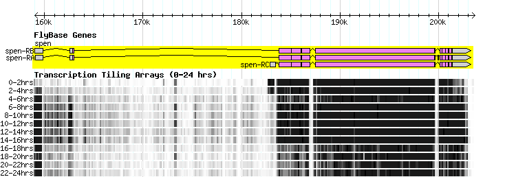
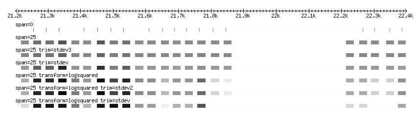
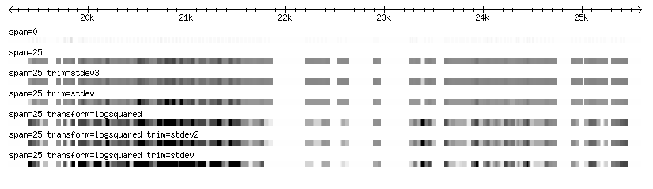
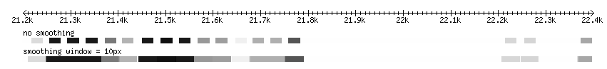
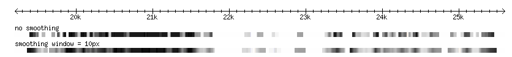
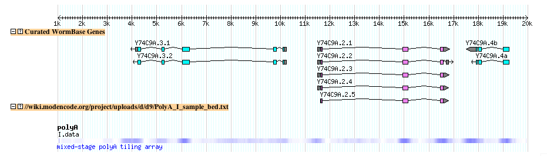
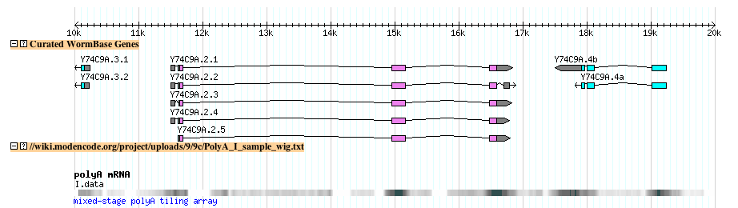

# GBrowse/Uploading Wiggle Tracks

From GMOD

Jump to: [navigation](#mw-navigation), [search](#p-search)

## Contents

- [1 Dense Feature
  and Quantitative Data](#Dense_Feature_and_Quantitative_Data)
- [2 Wiggle
  tracks](#Wiggle_tracks)
  - [2.1 Format
    Descriptions](#Format_Descriptions)
    - [2.1.1 Wiggle
      (BED)](#Wiggle_.28BED.29)
    - [2.1.2 Wiggle
      (variable step)](#Wiggle_.28variable_step.29)
    - [2.1.3 Wiggle
      (fixed step)](#Wiggle_.28fixed_step.29)
  - [2.2
    Configuring Data Processing and
    Display](#Configuring_Data_Processing_and_Display)
    - [2.2.1 Wiggle
      Track Options Supported by
      GBrowse](#Wiggle_Track_Options_Supported_by_GBrowse)
    - [2.2.2
      Formatting
      Examples](#Formatting_Examples)
      - [2.2.2.1
        Smoothing](#Smoothing)
  - [2.3
    Quantitative Data Examples: *C. elegans*
    Tiling
    Arrays](#Quantitative_Data_Examples:_C._elegans_Tiling_Arrays)
    - [2.3.1 *C.
      elegans* BED](#C._elegans_BED)
    - [2.3.2 *C.
      elegans* Wiggle](#C._elegans_Wiggle)
- [3 Uploading the
  tracks](#Uploading_the_tracks)
- [4 Making a
  Wiggle Track Permanent](#Making_a_Wiggle_Track_Permanent)
  - [4.1 Specifying
    the Order of Glyphs within a Displayed
    Track](#Specifying_the_Order_of_Glyphs_within_a_Displayed_Track)
    - [4.1.1
      Illustrative
      Script](#Illustrative_Script)
- [5 Email
  Threads](#Email_Threads)

## Dense Feature and Quantitative Data

This track shows an estimate of RNA abundance (transcription) during the
first 24 hours of *D. melanogaster* development, measured by a tiling
array as described in  <a
href="http://www.ncbi.nlm.nih.gov/entrez/query.fcgi?db=pubmed&amp;cmd=Retrieve&amp;dopt=AbstractPlus&amp;list_uids=16951679&amp;query_hl=1&amp;itool=pubmed_docsum"
class="external text" rel="nofollow">Manak JR, et al. Nature Genet. 2006
Oct;38(10):1151-8.</a> 

  

## Wiggle tracks

- Dense feature data includes tiling arrays and other classes of
  microarray experiments, pre-computed density calculations, or any kind
  of data that comes in numerous small parts spaced along the full
  length of the chromosome.
- This wiggle track, originally developed by Jim Kent as part of the
  wiggle track upload process at the UCSC Genome Browser and has
  recently been <a
  href="http://www.modencode.org/gbrowse/tutorial/tutorial.html#wiggle#wiggle"
  class="external text" rel="nofollow">added to Gbrowse</a>.
- Detailed information on the wiggle format can be obtained at the
  <a href="http://genome.ucsc.edu/goldenPath/help/wiggle.html"
  class="external text" rel="nofollow">UCSC web site</a>

Note: For the GBrowse wiggle loader to work correctly, you must have the
following modules installed:

- Statistics::Descriptive

### Format Descriptions

WIG files are plain text files. They always begin with a "track" header,
which, at a minimum, looks like this:

       track type=wiggle_0 name="ArrayExpt1" description="20 degrees, 2 hr"

The "type" attribute is required, and must have a value of "wiggle_0".
"name" and "description" are optional, but suggested, and indicate the
name and description of the data series -- these will become the "Name"
and "Note" fields of the generated GFF3 feature. Following the track
line comes the data for one or more chromosomal regions. As described in
the UCSC documentation, there are three ways of formatting the data:
(1)"Bed Format", (2) "variableStep", and (3) "fixedStep" format. The BED
format is essentially the same as GFF3 and does not give you any
performance advantages over using straight GFF3. However, you are
dealing with features of variable width and variable steps, BED will
allow you to express this. variableStep format describes intervals of
the genome that have a fixed width, but begin at arbitrary locations,
while fixedStep format describes features of the genome that are evenly
spaced and have a fixed width (e.g. tiling array features).

#### Wiggle (BED)

For **BED**, the format is:

     I       455     480     0
     I       495     520     59
     I       522     547     0
     I       546     571     110
     I       576     601     159
     I       691     716     189
     I       808     833     168
     I       834     859     40
     I       860     885     0
     I       910     935     0
     I       932     957     74
     I       961     986     0
     I       1036    1061    0
     I       1067    1092    0
     I       1095    1120    88

- There are four required fields: ref_sequence,start,end and score.
- **Note that this format differs from the stand-alone BED
  specification**: there are only four fields and the fourth field will
  only accept numeric data (signed integers, floats, etc)
- Scores can be any sort of numeric data, including integers, negative
  numbers and floating point.
- Note that the BED coordinates are "zero-indexed", half open, which
  means the start coordinate is zero-indexed and the end coordinate is
  1-indexed. For display or conversion to variableStep wiggle (below),
  the start coordinate should in incremented up by 1.
- For the intial upload to the website, there is more of a performance
  hit associated with BED formatted data. After loading, access and
  rendered performace is equal for all three formats.

An example of a type of data that would best be represented with BED
would be a microarray with varying probe lengths at varying intervals
along the chromosome coordinates.

------------------------------------------------------------------------

#### Wiggle (variable step)

For **variableStep** data, the format is:

        variableStep chrom=chr19 span=150
        59304701 10.0
        59304901 12.5
        59305401 15.0
        59305601 17.5
        59305901 20.0
        59306081 17.5
        59306301 15.0
        59306691 12.5
        59307871 10.0

The data is introduced by a line beginning with the keyword
"variableStep", and the arguments "chrom" and "span", which indicate the
chromosome on which the features are located, and the width of each
feature, in base pairs. This is followed by a series of two-element
lines indicating the start position of each feature, and its
quantitative value. Values can be any sort of numeric data, including
integers, negative numbers and floating point.

- Using this format instead of BED will boost performance for data
  upload.

An example of data that can best be represented in variable step wiggle
format is an oligonucleotide microarray with fixed probe lengths, whose
positions are not at fixed intervals.

------------------------------------------------------------------------

#### Wiggle (fixed step)

For **fixedStep** data, the format is:

       fixedStep chrom=chr19 start=59307401 step=300 span=200
       1000
        900
        800
        700
        600
        500
        400
        300
        200
        100

The data is introduced by a line beginning with the keyword "fixedStep",
and the arguments "chrom", "span", "start" and "step". The first two
arguments are the same as before, while "start" and "step" indicate the
starting position of the first feature, and the spacing between each
feature. This is followed by a numeric value for each step. In this
case, we have described 10 features beginning at position 59307401. Each
feature begins 300 bp from the next and is 200 bp wide. In practice,
this means that the first 200 bp of each interval is filled with known
data, while information on the last 100 bp is "missing."

- This is the most constrained format, in terms of coordinates, but it
  the most efficient for initial upload and processing.

An example of a type of data that could use fixed step wiggle format is
computed bins of fixed width.

### Configuring Data Processing and Display

- Some aspects of the data display can be controlled in the wiggle file

#### Wiggle Track Options Supported by GBrowse

Parameters for wiggle track definition lines All options are placed in a
single line separated by spaces:

     track type=wiggle_0 name=track_label description=center_label \
           visibility=display_mode color=r,g,b altColor=r,g,b \
           maxHeightPixels=max:default:min viewLimits=lower:upper \
           windowingFunction=max|mean|min|median smoothingWindow=2-16

The track type with version is REQUIRED, and it currently must be
wiggle_0:

     type wiggle_0

The remaining values are OPTIONAL:

**Supported UCSC-style options**

     name
     description
     visibility        full|pack            # default is full; full = xy plot, pack = density plot
     color             RRR,GGG,BBB          # default is 0,0,0 (black)
     altColor          RRR,GGG,BBB          # default is 0,0,0 (black)
     maxHeightPixels   max:default:min      # default none; Gbrowse uses default, ignores min and max
     viewLimits        lower:upper          # default is range found in data
     windowingFunction maximum|mean|minimum # default is none
     smoothingWindow   2-16                 # default is none; values are in pixels

**GBrowse extended data processing options**

- Depending on the score distribution and variance, some care must be
  taken to avoid a loss in display resolution.
- This applies in particular to score distributions with extreme
  outliers. The reason for this is that the low and high outliers are
  taken into account when the data are scaled for compression, so small
  differences (relative the the score range) between scores can become
  flattened.
- To remedy loss of display resolution, two options are provided.

<!-- -->

     transform         logsquared|logtransform      # default is none
     trim              stdev|stdev2|stdevn          # default is none

  
**transform:** Specify a transform to be performed on all numeric data
within this track prior to loading into the binary wig file. This will
bring the scores into a normal distribution and improve data scaling and
display resolution. Currently, the following two declarations are
recognized:

                transform=logsquared    y’ = log(y**2) for y != 0
                                        y’ = 0         for y == 0

                transform=logtransform  y' = log(y)    for y >= 0
                                        y' = -log(-y)  for y <  0

                transform=none          y’ = y   (no transform - the default)

**trim:** Specify a trimming function to be performed on the data prior
to scaling. Trimming will remove outlier scores, which can have the
effect of emphasizing differences between mid-range scores. Currently,
the following trim functions are recognized:

                trim=stdev1           trim to plus/minus 1 standard deviation of the mean
                trim=stdev2           trim to plus/minus 2 standard deviations of the mean
                ...
                trim=stdevN           trim to plus/minus N standard deviations of the mean; N is an integer

                trim=none             no trimming (the default)

#### Formatting Examples

The two images below represent various diplay and loading configurations
at high and low magnification for the same set of
<a href="../../mediawiki/images/1/19/Fly_sample.txt" class="internal"
title="Fly sample.txt">sample data</a> (Affymetrix tiling data for fly).

**Note:** The example data used here have an extremely wide range in
scores, resulting in a loss of contrast in the majority of the data,
which is in the mid-range. Using log transformation and min and max
trimming, it is possible to bring out the contrast that is otherwise
lost in the middle range.

**Zoomed in**

- The punctate pattern of the track with no span set is due to each
  array element being represented as 1bp in width

  
**Zoomed out**

- Note that the track with no span set is almost entirely lost at this
  resolution

##### Smoothing

The quantitative data may have a blockish appearance at low
magnification. This effect can be minimized by smoothing the data, by
blending the transitions between scores within a set number of pixels.
The examples below demonstrate smoothing at a resolution of 10px:

  

### Quantitative Data Examples: *C. elegans* Tiling Arrays

#### *C. elegans* BED

- This is an example of *C. elegans* tiling array data in BED format
  
  <a href="../../mediawiki/images/d/d9/PolyA_I_sample_bed.txt"
  class="internal" title="PolyA I sample bed.txt">(Click here to view the
  file)</a>.
- The first few lines of the example file

<!-- -->

    track type=wiggle_0 name="polyA" description="mixed-stage polyA tiling array" \
    visibility=pack altColor=0,0,255 windowingFunction=mean smoothingWindow=16
    I   456 480 0
    I   496 520 59
    I   523 547 0
    I   547 571 110
    I   577 601 159
    I   692 716 189
    I   809 833 168
    I   835 859 40
    I   861 885 0
    I   911 935 0

- The file looks lihe this when uploaded to the modENCODE genome browser

- **Try it yourself:** <a
  href="http://modencode.oicr.on.ca/cgi-bin/gbrowse/worm/?name=I%3A1000..20000;eurl=http://modencode.oicr.on.ca/project/uploads/d/d9/PolyA_I_sample_bed.txt;type=CG%20ETILE"
  class="external text" rel="nofollow">Follow this link</a> to
  upload the above example file to the modENCODE *C. elegans* genome
  browser

#### *C. elegans* Wiggle

- This is an example of *C. elegans* tiling array data in variable step
  wiggle format
  <a href="../../mediawiki/images/9/9c/PolyA_I_sample_wig.txt"
  class="internal" title="PolyA I sample wig.txt">(Click here to view the
  file)</a>.
- The first few lines of the example file:

<!-- -->

    # Note: comments beginning with '#' are ignored
    track type=wiggle_0 name="polyA mRNA" description="mixed-stage polyA tiling array"\
    color=255,255,255 altColor=0,0,0 windowingFunction=mean smoothingWindow=16
    variableStep chrom=I span=25
    480 0
    520 59
    547 0
    571 110
    601 159
    716 189
    833 168
    859 40
    885 0

- This is what the track looks like after uploading to the modENCODE
  genome browser

## Uploading the tracks

Uploading wiggle tracks to GBrowse is accomplished the same way as with
other classes of remote data.  
In the image below, there are three ways to upload your data:

1.  Upload a file from your computer via the "Browse..." and "Upload
    Buttons"
2.  Paste in your data via the "New..." button
3.  Put your file up on a web or ftp server and then put the URL
    (complete with the 'http://' or 'ftp://' protocol directive) in the
    entry form.

  

## Making a Wiggle Track Permanent

The upload mechanism creates a temporary private track. If you are a
GBrowse administrator and wish to create a permanent wiggle track, the
process is simple.

1.  Format and save a wiggle file to disk in the manner described
    earlier.
2.  Run the script *wiggle2gff3.pl* on this file to create the binary
    wig file. Use the --path option to specify the directory in which
    you want the binary wig file to be stored (default is the temporary
    directory), and the --method option to set the feature type (the
    default is "example"). This will create a binary .wig file in the
    indicated directory and send a GFF3 file to standard output. You
    should capture this output using the "\>" redirect.
3.  Load the GFF3 file into your gbrowse database using
    bp_seqfeature_load.pl or bp_load_gff.pl.
4.  Configure a stanza for the data using the "wiggle_density" or
    "wiggle_xyplot" glyphs:

<!-- -->

    [TEST WIG]
    feature = example
    glyph   = wiggle_density
    key     = my first wiggle file

If you later need to move the wig file somewhere else, simply edit the
GFF3 file to change the path specified in the wigfile attribute. One
neat trick is to use a relative path for the wigfile attribute, as in:

    wigfile=track003.chr19.1199828298.wig

You can then use the **basedir** track option to tell the glyph which
directory contains the wigfile:

  

    [TEST WIG]
    feature = example
    glyph   = wiggle_density
    basedir = /var/data/wigfiles/
    key     = my first wiggle file

### Specifying the Order of Glyphs within a Displayed Track

In the figure at the top of this page, there is a single GBrowse track
composed of several horizontal charts, one for each time period. One way
to ensure that these charts are displayed in the appropriate order is to
use the "source" field in the GFF3 file, in conjunction with the **sort
order** attribute in the stanza for the track.

For example, if the time periods are t=0, t=1, ..., t=9, and the primary
source is "Quelle", then the source for the data at t=0 could be called
Quelle_0, and similarly for the other time periods, and one would add
the following line to the relevant stanza:

    sort order = name

#### Illustrative Script

Assuming there is a .BED file named study_TT.BED for each time period
TT, where TT is 00, 01, 02, ...., then the following script illustrates
how to generate the .gff3 files for subsequent uploading:

    #!/bin/sh
    SOURCE=Quelle  # a string representing the primary source
    STUDY=study    # ${STUDY}_$t.BED
    METHOD=example # the "feature"
    for t in 00 01 02 03 04 05 06 07 08 09 10
    do
      wiggle2gff3.pl --method $METHOD --source ${SOURCE}_$t ${STUDY}_$t.BED \
        > ${STUDY}_$t.gff3
    done

  

## Email Threads

- <a
  href="http://gmod.827538.n3.nabble.com/wiggle-xyplot-smoothing-td839973.html"
  class="external text" rel="nofollow">wiggle_xyplot smoothing</a>,
  2010/06

Retrieved from
"<http://gmod.org/mediawiki/index.php?title=GBrowse/Uploading_Wiggle_Tracks&oldid=23519>"

[Categories](../Special:Categories "Special:Categories"):

- [GBrowse](../Category:GBrowse "Category:GBrowse")
- [HOWTO](../Category:HOWTO "Category:HOWTO")

## Navigation menu

### Namespaces

- <a href="Uploading_Wiggle_Tracks" accesskey="c"
  title="View the content page [c]">Page</a>
- <a
  href="http://gmod.org/mediawiki/index.php?title=Talk:GBrowse/Uploading_Wiggle_Tracks&amp;action=edit&amp;redlink=1"
  accesskey="t"
  title="Discussion about the content page [t]">Discussion</a>

### 

### Variants

### Navigation

- [GMOD Home](../Main_Page)
- [Software](../GMOD_Components)
- [Categories /
  Tags](../Categories)
- [View all
  pages](../Special:AllPages)

### Documentation

- [Overview](../Overview)
- [FAQs](../Category:FAQ)
- [HOWTOs](../Category:HOWTO)
- [Glossary](../Glossary)

### Community

- [GMOD News](../GMOD_News)
- [Training /
  Outreach](../Training_and_Outreach)
- [Support](../Support)
- [GMOD Promotion](../GMOD_Promotion)
- [Meetings](../Meetings)
- [Calendar](../Calendar)

### Tools

- <a href="../Special:Browse/GBrowse-2FUploading_Wiggle_Tracks"
  rel="smw-browse">Browse properties</a>
- [Print as
  PDF](http://gmod.org/mediawiki/index.php?title=Special:PdfPrint&page=GBrowse/Uploading_Wiggle_Tracks)

- Last updated at 21:22 on 25 April
  2013.
- 123,320 page views.
- Content is available under
  <a href="http://www.gnu.org/licenses/fdl-1.3.html" class="external"
  rel="nofollow">a GNU Free Documentation License</a> unless otherwise
  noted.

<!-- -->

- [About
  GMOD](../GMOD:About "GMOD:About")

<!-- -->

- 
- 
  

