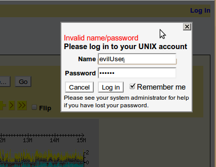

# Gbrowse/authentication plugins/PamAuthenticate

From GMOD

Jump to: [navigation](#mw-navigation), [search](#p-search)

The PamAuthenticate plugin is one of a very small number of [GBrowse
Plugins](../../GBrowse_Plugins "GBrowse Plugins") that can be used to
gather user credentials and authenticate them. This associates a user
with a stable username and can be used to:

1.  Remember a user's preferences, uploads and other settings across
    multiple computers.
2.  Allow users to share tracks with each other and to make uploaded
    tracks public.
3.  [Authorize](../../GBrowse_Configuration/Authentication "GBrowse Configuration/Authentication")
    certain users to access tracks and/or datasources.

## Contents

- [1
  Introduction](#Introduction)
- [2 Setting Up
  Username/Password
  Authentication](#Setting_Up_Username.2FPassword_Authentication)
- [3 Setting up
  Group Definitions](#Setting_up_Group_Definitions)
- [4 Customizing
  the Plugin](#Customizing_the_Plugin)
- [5 Further
  Information](#Further_Information)

# Introduction

The PamAuthenticate plugin is installed by default in
/etc/gbrowse2/plugins, but is not activated. When activated, it uses the
<a href="http://www.kernel.org/pub/linux/libs/pam/"
class="external text" rel="nofollow">Pluggable Authentication Module
(PAM)</a> to authenticate users, and /etc/nsswitch.conf to associate
users with groups. This allows considerable flexibility in connecting
GBrowse to enterprise authentication/authorization backends, and allows
you to use systems ranging in complexity from simple UNIX shadow files
to complex Kerberos authentication systems.

# Setting Up Username/Password Authentication

To set up the PamAuthenticate system, you need to configure a PAM
service called "gbrowse" by creating the file /etc/pam.d/gbrowse. A
simple /etc/pam.d/gbrowse file that uses local UNIX password/shadow
databases would look like this:

    auth     requisite   pam_unix.so

an LDAP-based authentication would refer to *pam_ldap.so* instead.

Note that if you are going to use the UNIX shadow password system for
authentication, the web user must belong to the "shadow" group on many
systems. You can arrange this as follows:

    usermod -G shadow -a www-data

Change "shadow" and "www-data" to the group that can read the
/etc/shadow file and the Apache user respectively. Note that you will
typically **not** want to give server login privileges to all
individuals who have genome browser accounts. You can use PAM to forbid
actual logins to members of certain groups (see the pam_group.so module
for more information).

# Setting up Group Definitions

The PAM authentication plugin uses **/etc/nsswitch.conf** system
configuration file to map users onto groups for group-based
authentication. nsswitch.conf, in turn, provides connections to the
traditional **/etc/group** file, the NIS database, or LDAP databases,
depending on how it is configured. For example, to fetch user and group
information from the local filesystem first, and then to look in LDAP,
nsswitch.conf should have lines that looks like this:

    passwd: compat ldap
    group:  compat ldap

Once these steps are taken, you'll configure GBrowse to use the PAM
authentication plugin. Edit **/etc/gbrowse2/GBrowse.conf** and add or
uncomment the following line in the \[GENERAL\] section:

    authentication plugin = PamAuthenticate

When you reload GBrowse, you will see a simple "Login" link in the upper
right hand corner of the screen. Clicking on this link will bring up a
dialog that prompts you for your login username and password. If all is
configured correctly, then you'll be able to log in using your Unix
username and password.

  

# Customizing the Plugin

You can customize the messages that appear at the top and bottom of the
login dialog box by setting configuration options in the
\[PamAuthenticate:plugin\] stanza located in GBrowse.conf:

    [PamAuthenticate:plugin]
    login hint = your UNIX account
    login help = Please see your system administrator for help
    if you have lost your  password.
    pam service name = gbrowse

login hint  
This is the message that appears at the top of the dialog box, and is
intended to be used to tell the user what credentials he is to supply.
For example, you can change it to read "your Acme username and
Cryptocard password".

login help  
This is the message that appears at the bottom of the dialog box and is
intended to provide contact information for the user if he cannot
remember his password. It can contain HTML links if desired.

pam service name  
This is the name of the pam.d service for gbrowse. You can place any
defined service name in this option. For example, to use the PAM
configuration for the login service, simply change the value to "login"
and the same restrictions that are used for local logins (e.g. time of
day) will be applied to GBrowse.

# Further Information

For further information on how this plugin works, and some hints on how
to create your own customized authentication plugin, please see
[Creating GBrowse
Plugins](../../Creating_GBrowse_Plugins "Creating GBrowse Plugins").

Retrieved from
"<http://gmod.org/mediawiki/index.php?title=Gbrowse/authentication_plugins/PamAuthenticate&oldid=17656>"

[Category](../../Special:Categories "Special:Categories"):

- [GBrowse
  Plugins](../../Category:GBrowse_Plugins "Category:GBrowse Plugins")

## Navigation menu

### Namespaces

- <a href="PamAuthenticate" accesskey="c"
  title="View the content page [c]">Page</a>
- <a
  href="http://gmod.org/mediawiki/index.php?title=Talk:Gbrowse/authentication_plugins/PamAuthenticate&amp;action=edit&amp;redlink=1"
  accesskey="t"
  title="Discussion about the content page [t]">Discussion</a>

### 

### Variants

### Navigation

- [GMOD Home](../../Main_Page)
- [Software](../../GMOD_Components)
- [Categories /
  Tags](../../Categories)
- [View all
  pages](../../Special:AllPages)

### Documentation

- [Overview](../../Overview)
- [FAQs](../../Category:FAQ)
- [HOWTOs](../../Category:HOWTO)
- [Glossary](../../Glossary)

### Community

- [GMOD News](../../GMOD_News)
- [Training /
  Outreach](../../Training_and_Outreach)
- [Support](../../Support)
- [GMOD
  Promotion](../../GMOD_Promotion)
- [Meetings](../../Meetings)
- [Calendar](../../Calendar)

### Tools

- <a
  href="../../Special:Browse/Gbrowse-2Fauthentication_plugins-2FPamAuthenticate"
  rel="smw-browse">Browse properties</a>

- Last updated at 14:18 on 4 May
  2011.
<!-- - 15,371 page views. -->
- Content is available under
  <a href="http://www.gnu.org/licenses/fdl-1.3.html" class="external"
  rel="nofollow">a GNU Free Documentation License</a> unless otherwise
  noted.

<!-- -->

- [About
  GMOD](../../GMOD:About "GMOD:About")

<!-- -->

