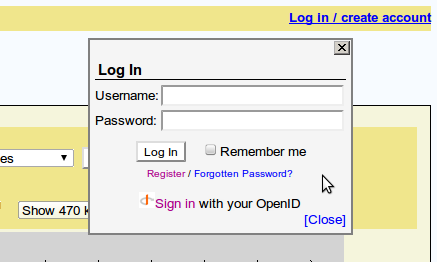

<div id="mw-page-base" class="noprint">

</div>

<div id="mw-head-base" class="noprint">

</div>

<div id="content" class="mw-body" role="main">

<span id="top"></span>

<div id="mw-js-message" style="display:none;">

</div>


# <span dir="auto">GBrowse Configuration/Authentication</span>

<div id="bodyContent">

<div id="siteSub">

From GMOD

</div>

<div id="contentSub">

</div>

<div id="jump-to-nav" class="mw-jump">

Jump to: [navigation](#mw-navigation), [search](#p-search)

</div>

<div id="mw-content-text" class="mw-content-ltr" lang="en" dir="ltr">

This article describes **user authentication** and how to configure it
to work with GBrowse.

*For the main GBrowse2 configuration article, see [GBrowse 2.0
HOWTO](../GBrowse_2.0_HOWTO "GBrowse 2.0 HOWTO").*

<div id="toc" class="toc">

<div id="toctitle">

## Contents

</div>

- [<span class="tocnumber">1</span> <span class="toctext">Authentication
  & Authorization,
  Introduction</span>](#Authentication_.26_Authorization.2C_Introduction)
  - [<span class="tocnumber">1.1</span>
    <span class="toctext">Authentication
    Systems</span>](#Authentication_Systems)
  - [<span class="tocnumber">1.2</span> <span class="toctext">GBrowse
    Authentication via Apache's Built-in Authentication
    Modules</span>](#GBrowse_Authentication_via_Apache.27s_Built-in_Authentication_Modules)
  - [<span class="tocnumber">1.3</span> <span class="toctext">GBrowse
    Authentication via its Built-in User Account
    Database</span>](#GBrowse_Authentication_via_its_Built-in_User_Account_Database)
    - [<span class="tocnumber">1.3.1</span>
      <span class="toctext">Configuration</span>](#Configuration)
      - [<span class="tocnumber">1.3.1.1</span>
        <span class="toctext">Adding User
        Accounts</span>](#Adding_User_Accounts)
      - [<span class="tocnumber">1.3.1.2</span>
        <span class="toctext">Restricting Access to Datasources with
        GBrowse Account
        Database</span>](#Restricting_Access_to_Datasources_with_GBrowse_Account_Database)
  - [<span class="tocnumber">1.4</span> <span class="toctext">GBrowse
    Authentication via Authentication
    Plugins</span>](#GBrowse_Authentication_via_Authentication_Plugins)
    - [<span class="tocnumber">1.4.1</span>
      <span class="toctext">Group-based
      Authorization</span>](#Group-based_Authorization)

</div>

## <span id="Authentication_.26_Authorization.2C_Introduction" class="mw-headline">Authentication & Authorization, Introduction</span>

You can restrict who has access to gbrowse by IP address, host name,
domain, username and password, by OpenID, or, via the authentication
plugin mechanism, by site-specific restrictions such as possession of a
crypto card. Restriction can apply to the database as a whole, or to
particular annotation tracks. You can also make a datasource visible
only to authorized users.

### <span id="Authentication_Systems" class="mw-headline">Authentication Systems</span>

As of version 2.20, GBrowse has three distinct authentication
mechanisms:

1.  Authentication via Apache's built-in authentication modules (present
    in all versions of GBrowse).
2.  Authentication via a built-in user accounts database (GBrowse
    versions 2.16 and higher).
3.  Authentication via a plugin architecture (GBrowse 2.20 and higher).

The first mechanism uses
<a href="http://httpd.apache.org/docs/2.0/howto/auth.html"
class="external text" rel="nofollow">Apache's standard authentication
and authorization modules</a>. This provides you with a large number of
authentication backends, but users will not be able to examine and
change their credentials unless you install a third-party application
for managing Apache authentication.

The second mechanism provides an "accounts database" that is accessible
to the server that is running GBrowse. The database is either a local
SQLite database, or a local/remote MySQL database. This mechanism
provides a way for users to register themselves (if registration is
enabled), and allows users to associate OpenIDs with their accounts for
one-click login. Users can change their passwords and other information
such as their full name and email address.

The third mechanism uses authentication plugins that are similar in
spirit to other [GBrowse Plugins](../GBrowse_Plugins "GBrowse Plugins").
Plugins can be written to implement a variety of authentication
mechanisms, and are intended to be used by organizations to allow users
to use the same authentication mechanism for GBrowse as they use for
other organizational assets. This mechanism does not allow users to
inspect or change their credentials, but one can easily add a link to
the login dialogue that directs them to the organization's web site to
help them with this. Authentication plugins do, however, provide the
ability to restrict access to role-based groups, something that neither
of the other two mechanisms allows. Currently there is are two GBrowse
authentication plugins defined, the [PamAuthenticate
plugin](../GBrowse_Plugins/PamAuthenticate "GBrowse Plugins/PamAuthenticate"),
which authenticates users via the
<a href="http://www.kernel.org/pub/linux/libs/pam/"
class="external text" rel="nofollow">Pluggable Authentication Module
(PAM)</a> system, and fetches groups from whatever group database is
defined in /etc/nsswitch.conf, and the LDAP authentication plugin,
[LDAPAuthenticate.pm](../LDAPAuthenticate.pm "LDAPAuthenticate.pm"). The
PAM module is the most flexible, so we describe it in detail later in
this article.

### <span id="GBrowse_Authentication_via_Apache.27s_Built-in_Authentication_Modules" class="mw-headline">GBrowse Authentication via Apache's Built-in Authentication Modules</span>

To use Apache's standard authentication and authorization system, we
take advantage of the fact that GBrowse uses a URL of this form to
select which data source is active:

         http://your.host/cgi-bin/gb2/gbrowse/your_datasource

where "your_datasource" is the name of the currently selected
datasource. For example, the yeast datasource is
<a href="http://your.host/cgi-bin/gbrowse/yeast" class="external free"
rel="nofollow">http://your.host/cgi-bin/gbrowse/yeast</a>.

Apache's access control mechanism is based on URLs. To control access to
an entire datasource, create a \<Location\> section in httpd.conf. The
\<Location\> section should look like this:

<div class="mw-geshi mw-code mw-content-ltr" dir="ltr">

<div class="apache source-apache">

``` de1
 
 <Location /cgi-bin/gb2/gbrowse/your_datasource>
        Order deny,allow
        deny from all
        allow from localhost .oicr.on.ca .cshl.edu .ebi.ac.uk
  </Location>
```

</div>

</div>

This denies access to everybody except for "localhost" and browsers from
the domains .oirc.on.ca, .cshl.edu and .ebi.ac.uk. You can also limit by
IP address, by username and password or by combinations of these
techniques. See <a href="http://httpd.apache.org/docs/howto/auth.html"
class="external text" rel="nofollow">Apache Authentication</a> for the
full details. Note that the datasource will still be visible in the
pop-up menu of datasources in the GBrowse navigation panel, unless you
specify "hide=1" in the GBrowse.conf stanza that defines the datasource.

You can limit individual tracks to certain individuals or organizations.
Unless the stated requirements are met, the track will not appear on the
main screen or any of the configuration screens. To set this up, add a
"restrict" option to the track you wish to make off-limits:

<div class="mw-geshi mw-code mw-content-ltr" dir="ltr">

<div class="apache source-apache">

``` de1
 
       [PROPRIETARY]
        feature = etc
        glyph   = etc
        restrict = Order deny,allow
                   deny from all
                   allow from localhost .oicr.on.ca .cshl.edu .ebi.ac.uk
```

</div>

</div>

The value of the restrict option is identical to the Apache
authorization directives and can include any of the directives "Order,"
"Satisfy," "deny from," "allow from," "require valid-user" or "require
user." The only difference is that the "require group" directive is not
supported, since the location of Apache's group file is not passed to
CGI scripts.

As with other gbrowse options, restrict can be a code subroutine. The
subroutine will be called with three arguments consisting of the host,
ip address and authenticated user. It should return a true value to
allow access to the track, or a false value to forbid it. This can be
used to implement group-based authorization or more complex schemes.

Here is an example that uses the Text::GenderFromName to allow access if
the user's name sounds female and forbids access if the name sounds
male. (It might be useful for an X-chromosome annotation site.)

<div class="mw-geshi mw-code mw-content-ltr" dir="ltr">

<div class="perl source-perl">

``` de1
    restrict = sub {
        my ($host,$ip,$user) = @_;
        return unless defined $user;
        use Text::GenderFromName qw(gender);
        return gender($user) eq 'f';
    }
```

</div>

</div>

You should be aware that the username will only be defined if username
authentication is turned on and the user has successfully authenticated
himself against Apache's user database using the correct password. In
addition, the hostname will only be defined if HostnameLookups have been
turned on in httpd.conf. In the latter case, you can convert the IP
address into a hostname using this piece of code:

<div class="mw-geshi mw-code mw-content-ltr" dir="ltr">

<div class="perl source-perl">

``` de1
    use Socket;
    $host = gethostbyaddr(inet_aton($addr),AF_INET);
```

</div>

</div>

Note that this may slow down the response time of gbrowse noticeably if
you have a slow DNS name server.

Another thing to be aware of when restricting access to an entire
database is that that even though the database itself will not be
accessible to unauthorized users, the name of the database will still be
available from the popup "Data Source" menu. There are two ways to
suppress this display:

1.  Place "hide=1" in the GBrowse.conf stanza that defines the
    datasource. This will hide the source from all users, even those who
    are allowed to access it.
2.  Place a "restrict" option in the GBrowse.conf stanza that defines
    the datasource. In this way, only users who meet the requirements
    will be able to see and select the datasource. For example:

<div class="mw-geshi mw-code mw-content-ltr" dir="ltr">

<div class="apache source-apache">

``` de1
 
 [yeast]
 description = Yeast Chromosomes 1+2
 path        = yeast_simple.conf
 restrict    = require valid-user
```

</div>

</div>

Finally, you may place a "restrict" option in the \[GENERAL\] section of
an individual datasource conf file, in which case the restrictions are
applied on top of those defined by Apache. This might be useful if you
prefer to modify the GBrowse conf file rather than Apache's conf file.
For example, if Apache's config file contains this section:

<div class="mw-geshi mw-code mw-content-ltr" dir="ltr">

<div class="apache source-apache">

``` de1
 
    <Location /cgi-bin/gb2/gbrowse/yeast>
        Order deny,allow
        deny from all
        Satisfy all
        allow from .oicr.on.ca
        require valid-user
    </Location>
```

</div>

</div>

then any valid user (who can provide a recognized username and password)
who accesses the site from a workstation in the .oicr.on.ca domain will
be able to get in. You can further restrict access by adding the
following to the \[GENERAL\] section of yeast_simple.conf:

<div class="mw-geshi mw-code mw-content-ltr" dir="ltr">

<div class="apache source-apache">

``` de1
 
  [GENERAL]
   # .... other stuff ...
   restrict  = require user fred joseph andrew vivian
```

</div>

</div>

This will return an unauthorized message for anyone except the four
named users.

### <span id="GBrowse_Authentication_via_its_Built-in_User_Account_Database" class="mw-headline">GBrowse Authentication via its Built-in User Account Database</span>

The GBrowse user account system provides users with a link in the upper
right corner of the screen that lets them login, register, and manage
their account settings.

<div class="thumb tright">

<div class="thumbinner" style="width:439px;">

<a href="../File:Gbrowse_login.png" class="image"></a>

<div class="thumbcaption">

</div>

</div>

</div>

#### <span id="Configuration" class="mw-headline">Configuration</span>

The GBrowse user account system is activated when the following
requirements are met:

1.  The Perl
    <a href="http://search.cpan.org/perldoc?DBI" class="external text"
    rel="nofollow">DBI</a> module is installed, and one or both of
    <a href="http://search.cpan.org/perldoc?DBD::mysql"
    class="external text" rel="nofollow">DBD::mysql</a> and
    <a href="http://search.cpan.org/perldoc?DBD::SQLite"
    class="external text" rel="nofollow">DBD::SQLite</a>.
2.  The "user accounts" option is set to a "1" (or any other true value)
    in GBrowse.conf's \[GENERAL\] section.
3.  No "authentication plugin" option is defined in GBrowse.conf's
    \[GENERAL\] section.

User accounts can be created and managed with the utilities
**gbrowse_create_account.pl** and **gbrowse_change_passwd.pl**. Users
can register themselves and manage their own account settings if:

1.  The Perl {\[CPAN\|Net::SMTP}} module is installed (required to
    validate users via email).
2.  The "user accounts registration" option is set to a true value in
    GBrowse.conf.
3.  The "user_account_db" option is set to a valid MySQL or SQLite path.
4.  The "smtp_gateway" is set to a working mail gateway that can forward
    mail to end users.

To enable users to log in using OpenIDs, these requirements must be met:

1.  The Perl
    <a href="http://search.cpan.org/perldoc?Net::OpenID::Consumer"
    class="external text" rel="nofollow">Net::OpenID::Consumer</a>
    module must be installed.
2.  The "user_accounts_openid" option in the \[GENERAL\] section of
    GBrowse.conf should be set to a true value.

The following is a GBrowse.conf configuration file with all the bells
and whistles turned on:

<div class="mw-geshi mw-code mw-content-ltr" dir="ltr">

<div class="apache source-apache">

``` de1
 
 [GENERAL]
 # ...lots of stuff...
 
 # Login Settings
 user_accounts               = 1
 user_accounts_registration  = 1
 user_accounts_openid        = 1
 user_account_db             = DBI:SQLite:/var/www/gbrowse2/databases/users.sqlite
 smtp_gateway                = localhost
 application_name            = GBrowse
 application_name_long       = The Generic Genome Browser
 email_address               = noreply@gbrowse.com
```

</div>

</div>

This configuration should work on most servers provided that there is a
properly-configured mail exchanger running on the server itself. You
will need to replace this with an appropriate mail exchanger if this is
not the case. The format of this option is described in more detail
below. In the case of new installations of GBrowse2 (versions 2.20 and
higher), the installer will detect if the prerequisites are present, and
establish reasonable starting values.

Here is more information on these options:

user_account_db

<div class="indent">

This is a
<a href="http://dbi.perl.org/" class="external text" rel="nofollow">Perl
DBI</a>-style description of the database that will hold user accounts.
Only SQLite and MySQL databases are usable at the current time. For
MySQL databases, the full form of the option is:

<div class="mw-geshi mw-code mw-content-ltr" dir="ltr">

<div class="apache source-apache">

``` de1
 
  DBI:mysql:database=gbrowse_login;host=mysql.oicr.on.ca;user=gbrowse;password=gbrowse
```

</div>

</div>

This indicates that the account database is running on a MySQL server
named "mysql.oicr.on.ca" and that the database is named "gbrowse_login".
The GBrowse application will use the username "gbrowse" and the password
"gbrowse" to access the database.

For SQLite databases, the format is:

<div class="mw-geshi mw-code mw-content-ltr" dir="ltr">

<div class="apache source-apache">

``` de1
 
  DBI:SQLite:/var/www/gbrowse2/databases/users.sqlite
```

</div>

</div>

The latter part of the description is a path to the database file.

</div>

user_accounts, user_accounts_registration, user_accounts_openid  
These options turn on and off user accounts, new users' ability to
register themselves and OpenID support, respectively. Pass a true value
(usually "1" to turn the feature on). Pass a false value ("0" or just
comment out the option) to turn the feature off.

smtp_gateway

<div class="indent">

This option sets the mail gateway that GBrowse uses to register new
users and to communicate track sharing information one user to another.
The full format is:

<div class="mw-geshi mw-code mw-content-ltr" dir="ltr">

<div class="apache source-apache">

``` de1
 
 <smtp.server.com>:<port>:<encryption>:<username>:<password>
```

</div>

</div>

There are up to five fields, each separated by colons. The first field,
which is required, is the hostname or IP address of a mail server
running the SMTP protocol (Simple Mail Transport Protocol, the standard
email exchange language). The second field is the port on which SMTP is
running. You can leave this empty to accept the defaults. The third
field specifies the encryption system, if any. The two options are
"plain", for no encryption, and "ssl", for encryption. The last two
fields specify the username and password, if these are needed to
establish a connection with the server.

An example of a server that requires encryption, username and password
is Gmail. Here, for example, is how to route mail through a user account
at GMail:

<div class="mw-geshi mw-code mw-content-ltr" dir="ltr">

<div class="apache source-apache">

``` de1
 
  smtp_gateway           = smtp.gmail.com:465:ssl:john.doe:open_sesame
```

</div>

</div>

Replace "john.doe" and "open_sesame" with the appropriate username and
password for the service.

</div>

application_name, application_name_long, email_address  
These options control the "From" address that users will see when they
receive their account registration confirmations. The defaults should
work fine, but you may want to customize them for your site (e.g.
replace "The Generic Genome Browser" default with "The BeetleBase Genome
Browser".) **email_address** controls the Reply-to field, and by default
is set to a non-working email address. Note that when using some mail
relayers, such as GMail, the gateway will force the Reply-to field to be
the same as the user's email account, to avoid spam relaying.

Before you run an account-enabled GBrowse for the very first time, you
should run the **gbrowse_metadb_config.pl** script, which is installed
along with GBrowse. Ordinarily this script is run automatically for you
during "./Build install" (or during automatic CPAN shell installation),
but you will need to run this script again if you change the
"user_account_db" setting in order to change the type or location of the
accounts database. **gbrowse_metadb_config.pl** also does routine
maintenance on the database, such as removing orphaned uploads, and so
it is worth running it occasionally to see if any inconsistencies are
corrected.

*NOTE: Permissions:* For GBrowse2 to be able to accept new user
registrations and to allow users to change their account information,
the web user (e.g. "www-data") must have write privileges on the user
account database. In the case of a SQLite database, this means that the
database file and the directory that contains it must be writable by the
web user. For MySQL databases, the MySQL user ("gbrowse" in the example
above) must have SELECT, INSERT, DELETE and UPDATE privileges. The
gbrowse_metadb_config.pl script will check and fix the permissions for
you.

##### <span id="Adding_User_Accounts" class="mw-headline">Adding User Accounts</span>

You can create a new user account using **gbrowse_create_account.pl**,
which is installed with GBrowse. If user self-registration is turned
off, then this is the only way to create and manage user accounts.

The command's syntax is:

     gbrowse_create_account.pl [-pass <password> -fullname <name> -email <email>] <username>

The username is required. All other fields will be prompted for if not
provided on the command line. If you call gbrowse_create_account.pl with
the name of an existing user, you can change the user's password and
other information.

The **gbrowse_change_passwd.pl** command can be used for setting or
resetting an existing user's password:

    gbrowse_change_passwd.pl <username> [<password>]

If no password is provided on the command line, then a random password
will be generated and printed out for your use.

Both of these scripts need to run as the web user (e.g. "www-data") in
order to access and update the accounts database. If they are not run as
this user, then the script will relaunch itself under
<a href="http://en.wikipedia.org/wiki/Sudo" class="external text"
rel="nofollow">sudo</a>. Sudo may prompt you for your login password; do
not get your password confused with the new user's password!

##### <span id="Restricting_Access_to_Datasources_with_GBrowse_Account_Database" class="mw-headline">Restricting Access to Datasources with GBrowse Account Database</span>

You can restrict access to datasources and individual tracks using
exactly the same **restrict** syntax described in the previous section.
For example in yeast_simple.conf, you could have:

<div class="mw-geshi mw-code mw-content-ltr" dir="ltr">

<div class="apache source-apache">

``` de1
 [GENERAL]
 # lots of other stuff...
 restrict = require valid-user
 ...
 
 [5_prime_RACE]
 glyph    = generic
 feature  = RACE:5_prime
 restrict = require user fred joseph andrea marta
```

</div>

</div>

The effect will be to require everyone to log in successfully in order
to view the datasource at all. In addition, only the users logged in
under one of the names "fred", "joseph", "andrea" and "marta" will have
access to the "5_prime_RACE" track.

As in Apache-based authorization, you can shield the name of the
datasource from view in the popup datasources menu by placing a
"restrict" in the GBrowse.conf stanza that describes the datasource.

### <span id="GBrowse_Authentication_via_Authentication_Plugins" class="mw-headline">GBrowse Authentication via Authentication Plugins</span>

GBrowse (versions 2.20 and higher) offers user authentication via a
plug-in mechanism that lets organizations integrate the software with
such enterprise authentication systems as LDAP, Kerberos, NIS, and UNIX
password files. The [Authentication
Plugins](../Gbrowse/authentication_plugins "Gbrowse/authentication plugins")
are easy to write, but GBrowse comes with a very flexible default one
that makes use of the PAM (Pluggable Authentication Modules) system that
is installed on most if not all modern Linux distributions. Basically,
you need only to define a PAM definition file for the GBrowse service,
or reuse an existing one, and then activate the PAM plugin. The plugin
will use whatever authentication mechanism is defined in the PAM
definition file to authenticate users. In addition, the plugin will use
the standard **/etc/nsswitch.conf** settings to map users onto groups
for the purpose of group-based access control.

To get started using the PAM authentication module, create a PAM service
definition file in /etc/pam.d named "gbrowse". It's usually easiest to
start by copying an existing definition file such as *login*. (This will
have the effect of using the same authentication database for GBrowse
users as for regular logins on the GBrowse host machine.) A simple
/etc/pam.d/gbrowse file that uses local UNIX password/shadow databases
would look like this:

    auth     requisite   pam_unix.so

an LDAP-based authentication would refer to *pam_ldap.so* instead.

Note that if you are going to use the UNIX shadow password system for
authentication, the web user must belong to the "shadow" group on many
systems. You can arrange this as follows:

    usermod -G shadow -a www-data

Change "shadow" and "www-data" to the group that can read the
/etc/shadow file and the Apache user respectively. Note that you will
typically **not** want to give server login privileges to all
individuals who have genome browser accounts. You can use PAM to forbid
actual logins to members of certain groups (see the pam_group.so module
for more information).

The PAM authentication plugin uses **/etc/nsswitch.conf** system
configuration file to map users onto groups for group-based
authentication. nsswitch.conf, in turn, provides connections to the
traditional **/etc/group** file, the NIS database, or LDAP databases,
depending on how it is configured. For example, to fetch user and group
information from the local filesystem first, and then to look in LDAP,
nsswitch.conf should have lines that looks like this:

    passwd: compat ldap
    group:  compat ldap

Once these steps are taken, you'll configure GBrowse to use the PAM
authentication plugin. Edit **/etc/gbrowse2/GBrowse.conf** and add or
uncomment the following line in the \[GENERAL\] section:

    authentication plugin = PamAuthenticate

When you reload GBrowse, you will see a simple "Login" link in the upper
right hand corner of the screen. Clicking on this link will bring up a
dialog that prompts you for your login username and password. If all is
configured correctly, then you'll be able to log in using your Unix
username and password. See
[PamAuthenticate](../Gbrowse/authentication_plugins/PamAuthenticate "Gbrowse/authentication plugins/PamAuthenticate")
for more information on customizing the plugin, including how to add
site-specific messages to the login dialog.

#### <span id="Group-based_Authorization" class="mw-headline">Group-based Authorization</span>

The PamAuthenticate plugin allows you to authorize users via their group
membership. The syntax is similar to the "require user" directive
described earlier:

    [MySecretTrack]
    restrict = require group Principal_Investigators Postdocs

The track "MySecretTrack" will now only be visible to users who are
members of either the "Principal_Investigators" or "Postdocs" groups.
"require group" lines can be mixed with "require user", and host-based
"allow" and "deny" directives. As before, the "restrict" statement can
be placed in a datasource configuration file's track stanza, in its
\[GENERAL\] section, or in the stanza in GBrowse.conf that refers to the
datasource.

</div>

<div class="printfooter">

Retrieved from
"<http://gmod.org/mediawiki/index.php?title=GBrowse_Configuration/Authentication&oldid=22567>"

</div>

<div id="catlinks" class="catlinks">

<div id="mw-normal-catlinks" class="mw-normal-catlinks">

[Categories](../Special%3ACategories "Special%3ACategories"):

- [GBrowse](../Category%3AGBrowse "Category%3AGBrowse")
- [HOWTO](../Category%3AHOWTO "Category%3AHOWTO")
- [Configuration](../Category%3AConfiguration "Category%3AConfiguration")

</div>

</div>

<div class="visualClear">

</div>

</div>

</div>

<div id="mw-navigation">

## Navigation menu

<div id="mw-head">


<div id="left-navigation">

<div id="p-namespaces" class="vectorTabs" role="navigation"
aria-labelledby="p-namespaces-label">

### Namespaces


- <span id="ca-talk"><a
  href="http://gmod.org/mediawiki/index.php?title=Talk:GBrowse_Configuration/Authentication&amp;action=edit&amp;redlink=1"
  accesskey="t"
  title="Discussion about the content page [t]">Discussion</a></span>

</div>

<div id="p-variants" class="vectorMenu emptyPortlet" role="navigation"
aria-labelledby="p-variants-label">

### 

### Variants[](#)

<div class="menu">

</div>

</div>

</div>


</div>

</div>

</div>

<div id="mw-panel">

<div id="p-logo" role="banner">

<a href="../Main_Page"
style="background-image: url(../../images/GMOD-cogs.png);"
title="Visit the main page"></a>

</div>

<div id="p-Navigation" class="portal" role="navigation"
aria-labelledby="p-Navigation-label">

### Navigation

<div class="body">

- <span id="n-GMOD-Home">[GMOD Home](../Main_Page)</span>
- <span id="n-Software">[Software](../GMOD_Components)</span>
- <span id="n-Categories-.2F-Tags">[Categories /
  Tags](../Categories)</span>
- <span id="n-View-all-pages">[View all
  pages](../Special:AllPages)</span>

</div>

</div>

<div id="p-Documentation" class="portal" role="navigation"
aria-labelledby="p-Documentation-label">

### Documentation

<div class="body">

- <span id="n-Overview">[Overview](../Overview)</span>
- <span id="n-FAQs">[FAQs](../Category%3AFAQ)</span>
- <span id="n-HOWTOs">[HOWTOs](../Category%3AHOWTO)</span>
- <span id="n-Glossary">[Glossary](../Glossary)</span>

</div>

</div>

<div id="p-Community" class="portal" role="navigation"
aria-labelledby="p-Community-label">

### Community

<div class="body">

- <span id="n-GMOD-News">[GMOD News](../GMOD_News)</span>
- <span id="n-Training-.2F-Outreach">[Training /
  Outreach](../Training_and_Outreach)</span>
- <span id="n-Support">[Support](../Support)</span>
- <span id="n-GMOD-Promotion">[GMOD Promotion](../GMOD_Promotion)</span>
- <span id="n-Meetings">[Meetings](../Meetings)</span>
- <span id="n-Calendar">[Calendar](../Calendar)</span>

</div>

</div>

<div id="p-tb" class="portal" role="navigation"
aria-labelledby="p-tb-label">

### Tools

<div class="body">


- <span id="t-smwbrowselink"><a href="../Special%3ABrowse/GBrowse_Configuration-2FAuthentication"
  rel="smw-browse">Browse properties</a></span>


</div>

</div>

</div>

</div>

<div id="footer" role="contentinfo">

- <span id="footer-info-lastmod">Last updated at 17:08 on 4 December
  2012.</span>
<!-- - <span id="footer-info-viewcount">131,924 page views.</span> -->
- <span id="footer-info-copyright">Content is available under
  <a href="http://www.gnu.org/licenses/fdl-1.3.html" class="external"
  rel="nofollow">a GNU Free Documentation License</a> unless otherwise
  noted.</span>

<!-- -->

- <span id="footer-places-about">[About
  GMOD](../GMOD:About "GMOD:About")</span>

<!-- -->


</div>
