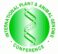

# GBrowse PAG 2009 Workshop

From GMOD

Jump to: [navigation](#mw-navigation), [search](#p-search)

<table
style="font-size: 140%; vertical-align: middle; border: 2px solid #A6A6BC; line-height: 120%"
data-cellpadding="10">
<colgroup>
<col style="width: 50%" />
<col style="width: 50%" />
</colgroup>
<tbody>
<tr class="odd">
<td></td>
<td data-valign="middle"><strong><a
href="http://www.intl-pag.org/17/17-gbrowse.html" class="external text"
rel="nofollow">The Generic Genome Browser: A Hands on Workshop for
Installing, Configuring and Using Your Own GBrowse</a></strong> 
 
January 11, 2009 
<a href="http://www.intl-pag.org/" class="external text"
rel="nofollow">Plant and Animal Genome Conference</a> 
San Diego, California, USA</td>
</tr>
</tbody>
</table>

  

This page provides additional information about the
<a href="http://www.intl-pag.org/17/17-gbrowse.html"
class="external text" rel="nofollow">GBrowse workshop</a> at the
<a href="http://www.intl-pag.org/" class="external text"
rel="nofollow">Plant and Animal Genome XVII Conference</a> ([PAG
2009](PAG_2009 "PAG 2009")) held in San Diego on January 10-14, 2009.
This workshop was attended by over 60 people.

## Contents

- [1 Note on
  Installation](#Note_on_Installation)
- [2
  Overview](#Overview)
- [3 Tutorial
  Level](#Tutorial_Level)
- [4 Intended
  Audience](#Intended_Audience)
- [5
  Outline](#Outline)
- [6 Workshop
  Instructor](#Workshop_Instructor)
- [7
  Datasets](#Datasets)
- [8 Other GMOD
  Presentations and
  Meetings](#Other_GMOD_Presentations_and_Meetings)

## Note on Installation

An installer package for Microsoft Windows can be downloaded
<a href="http://mckay.cshl.edu/a.zip" class="external text"
rel="nofollow">here</a>.

- download the zip file and double-click to unpack
- enter the directory 'a' and double-click the executable file
  'install_gbrowse'
- This will install Perl, Apache Web server, and other requirements to
  run GBrowse on your system

Also, see the [Windows
installation](GBrowse_Windows_HOWTO "GBrowse Windows HOWTO") guide and
<a href="Gbrowse.1#Installation" class="mw-redirect"
title="Gbrowse">guides for other operating systems</a>.

## Overview

This was be a hands-on tutorial on how to install and use the
[GBrowse](GBrowse.1 "GBrowse") genome browser.

## Tutorial Level

Beginner to Intermediate. Students should be comfortable performing
simple system administration tasks like stopping and starting services.

Students who wish to use their own computer should preinstall the
prerequisites described in the [GBrowse installation
notes](GBrowse.1#Installation "GBrowse"), including Perl, Apache, MySQL
and (for Unix) BioPerl.

## Intended Audience

GBrowse is sufficiently easy to install that a biologist can easily set
up and configure a GBrowse server after the initial hurdles of learning
about configuration options and file formats are overcome. This class is
intended to help them over those hurdles.

## Outline

- The Basics
- The Data File
- Defining Tracks
- Searching for Named Features
- Adding Descriptions to a Feature
- Showing multi-segmented features
- Using Aggregators
- Showing Protein Coding Genes
- Showing the Reading Frame
- Creating Custom Aggregators
- Showing Quantitative Data
- Displaying DNA and 3-frame translations
- Features added in latest release, including draggable and collapsible
  tracks, and [popup
  balloons](GBrowse_Popup_Balloons "GBrowse Popup Balloons")

## Workshop Instructor

- [Scott Cain](User:Scott "User:Scott"), GMOD Project Coordinator,
  <a href="http://www.oicr.on.ca/" class="external text"
  rel="nofollow">Ontario Institute for Cancer Research</a>

## Datasets

Example datasets will be posted prior to the conference.

## Other GMOD Presentations and Meetings

GMOD will have a [strong presence](PAG_2009 "PAG 2009") at PAG 2009,
including a
[workshop](GBrowse_syn_PAG_2009_Workshop "GBrowse syn PAG 2009 Workshop")
on [GBrowse_syn](GBrowse_syn.1 "GBrowse syn"), a synteny viewer built on
GBrowse. See the [list of GMOD related PAG 2009
presentations](PAG_2009 "PAG 2009") for more. The [January 2009 GMOD
Meeting](January_2009_GMOD_Meeting "January 2009 GMOD Meeting") was held
in San Diego, immediately after PAG 2009.

Retrieved from
"<http://gmod.org/mediawiki/index.php?title=GBrowse_PAG_2009_Workshop&oldid=21872>"

[Category](Special:Categories "Special:Categories"):

- [Education and
  Outreach](Category:Education_and_Outreach "Category:Education and Outreach")

## Navigation menu

### Namespaces

- <a
  href="http://gmod.org/mediawiki/index.php?title=Talk:GBrowse_PAG_2009_Workshop&amp;action=edit&amp;redlink=1"
  accesskey="t"
  title="Discussion about the content page [t]">Discussion</a>

### 

### Variants

### Navigation

- [GMOD Home](Main_Page)
- [Software](GMOD_Components)
- [Categories /
  Tags](Categories)

### Documentation

- [Overview](Overview)
- [FAQs](Category:FAQ)
- [HOWTOs](Category:HOWTO)
- [Glossary](Glossary)

### Community

- [GMOD News](GMOD_News)
- [Training /
  Outreach](Training_and_Outreach)
- [Support](Support)
- [GMOD Promotion](GMOD_Promotion)
- [Meetings](Meetings)
- [Calendar](Calendar)

### Tools

- <a href="Special:Browse/GBrowse_PAG_2009_Workshop"
  rel="smw-browse">Browse properties</a>

- Last updated at 19:34 on 3 October
  2012.
<!-- - 55,394 page views. -->
- Content is available under
  <a href="http://www.gnu.org/licenses/fdl-1.3.html" class="external"
  rel="nofollow">a GNU Free Documentation License</a> unless otherwise
  noted.

<!-- -->

- [About
  GMOD](GMOD:About "GMOD:About")

<!-- -->

