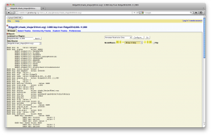

<div id="mw-page-base" class="noprint">

</div>

<div id="mw-head-base" class="noprint">

</div>

<div id="content" class="mw-body" role="main">

<span id="top"></span>

<div id="mw-js-message" style="display:none;">

</div>


# <span dir="auto">GBrowse Persistent Variables</span>

<div id="bodyContent">

<div id="siteSub">

From GMOD

</div>

<div id="contentSub">

</div>

<div id="jump-to-nav" class="mw-jump">

Jump to: [navigation](#mw-navigation), [search](#p-search)

</div>

<div id="mw-content-text" class="mw-content-ltr" lang="en" dir="ltr">

[GBrowse](GBrowse.1 "GBrowse") uses a few persistent variables to store
data for a user. The following is an explanation of the structure of the
commonly-used ones:

<div id="toc" class="toc">

<div id="toctitle">

## Contents

</div>

- [<span class="tocnumber">1</span>
  <span class="toctext">Session</span>](#Session)
- [<span class="tocnumber">2</span>
  <span class="toctext">State</span>](#State)
- [<span class="tocnumber">3</span> <span class="toctext">Querying the
  State Variable</span>](#Querying_the_State_Variable)
- [<span class="tocnumber">4</span>
  <span class="toctext">Globals</span>](#Globals)

</div>

# <span id="Session" class="mw-headline">Session</span>

**\$session** is a blessed Browser2::Session object containing
information regarding the current user's session. It contains the
following key-\>value pairs:

- - **pid** *\[number\]* - The process ID number of the session.
  - **lockdir** *\[string\]* - The directory path holding the lock
    information.
  - **locktype** *\[string\]* - The type of lock used.
  - **lockobj** *\[hash\]* - The blessed <a
    href="http://search.cpan.org/~bbb/File-NFSLock-1.20/lib/File/NFSLock.pm"
    class="external text" rel="nofollow">File::NFSLock</a> object,
    containing details of the session.
  - **session** *\[hash\]* - A blessed
    <a href="http://search.cpan.org/~sherzodr/CGI-Session-3.95/Session.pm"
    class="external text" rel="nofollow">CGI::Session</a> object
    containing the session. The only data we need to worry about is in:
    - **\_DATA** *\[hash\]* - Holds all the stored session data, with
      the data source name as the key.
      -  *\[hash\]* -
        - **plugins** *\[hash\]* - A collection of data stored by
          individual plugins, collected with the plugin name as a key.
        - **page_settings** *\[hash\]* - The page settings, as stored in
          \$state

# <span id="State" class="mw-headline">State</span>

**\$state** is a large hash containing information regarding the current
configured state of the browser (hence the name). It contains the
following key-\>value pairs:

- - **width** *\[string\]* - The width of the final image, in pixels, as
    set on the preferences tab.
  - **source** *\[string\]* - The current data source name.
  - **ks** *\[string\]* - ?
  - **tracks** *\[array\]* - An array of the labels of all the tracks
    for the
  - **userid** *\[string\]* - The currently-logged-in user's ID,
    corresponding to the main GBrowse user database.
  - **uploadid** *\[string\]* - The currently-logged-in user's uploads
    ID, corresponding to the folder containing their uploaded files.
  - **seg_max** *\[number\]* - The upper bound of the region currently
    being viewed; the right side of the image, unless flipped.
  - **seg_min** *\[number\]* - The lower bound of the region currently
    being viewed; the left side of the image, unless flipped.
  - **flip** *\[boolean\]* - True if the genome view has been flipped
    horizontally from the default left-to-right method.
  - **show_tooltips** *\[boolean\]* - Whether or not to show the helper
    tooltips in the main browser.
  - **valid_region** *\[boolean\]* - Whether the region requested is
    valid, or not. If not, the karotype is shown.
  - **uploads** *\[hash\]* - Contains all uploaded (not imported) files
    as keys, the values are arrays containing: \["uploaded file's name",
    "?"\]
  - **track_collapsed** *\[hash\]* - ? "between"
  - **region_size** *\[number\]* - The size (in base pairs) of the
    region being viewed.
  - **max segment** *\[number\]* - ? 5000000
  - **head** *\[boolean\]* - ? 1
  - **grid** *\[boolean\]* - Whether or not to display the grid behind
    the rendered images
  - **features** *\[hash\]* - All the features available; the feature
    name is the key and the value is another hash containing 3 flags:
    - **visible** *\[boolean\]* - Whether or not the feature is visible
      in the browser display.
    - **options** *\[boolean\]* - ? 0
    - **limit** *\[boolean\]* - ? 0
  - **version** *\[number\]* - ? 100
  - **stop** *\[number\]* - ? 203999
  - **ref** *\[string\]* - The named region being displayed (?)
  - **name** *\[string\]* - The displayed name of the region (as seen in
    the "Landmark or Region" input field), "chrI:98000..203999" for
    example.
  - **v** *\[number\]* - ? 2
  - **subtracks** *\[hash\]* - ? {}
  - **ins** *\[boolean\]* - ? 1
  - **stp** *\[boolean\]* - ? 1
  - **sk** *\[string\]* - ? "sorted"
  - **section_visible** *\[hash\]* - A hash containing each section as a
    key and a boolean flag indicating whether a section is visible
    (true) or not (false).
  - **cache** *\[boolean\]* - Whether or not to cache the rendered
    images.
  - **start** *\[number\]* - 98000'

# <span id="Querying_the_State_Variable" class="mw-headline">Querying the State Variable</span>

To query the value of your state variables, copy and paste the [Named
Subroutines](GBrowse_2.0_HOWTO#Named_Subroutine_References "GBrowse 2.0 HOWTO")
below to a file called init_code.conf.

<div class="mw-geshi mw-code mw-content-ltr" dir="ltr">

<div class="perl source-perl">

``` de1
init_code=
    my $t = -1;
    my $toString;
    sub queryVariables {
        my @arg  = @_;
        $t++;
        for(my $i=0; $i<@arg; $i++) {
            if( ref($arg[$i]) eq "HASH" ) {
                my %hash = %{$arg[$i]};
                foreach my $key ( keys %hash ) {
                    if( ref(\$hash{$key}) eq "SCALAR" ) {
                        $toString .= "\t"x$t."HASH key: $key\tvalue: $hash{$key}\n";
                    } else {
                        $toString .= "\t"x$t."HASH key: $key\tvalue: ".ref($hash{$key})."\n";
                        queryVariables( $hash{$key} );
                        $t--;
                    }
                }
            } elsif( ref($arg[$i]) eq "ARRAY" ) {
                my @array = @{$arg[$i]};
                for(my $j=0; $j<@array; $j++){
                    if( ref(\$array[$j]) eq "SCALAR" ) {
                        $toString .= "\t"x$t."ARRAY element[$j]: $array[$j]\n";
                    } else {
                        $toString .= "\t"x$t."ARRAY element[$j]: ".ref($array[$j])."\n";
                        queryVariables( @array );
                        $t--;
                    }
                }
            }
        }
        return $toString;
    }
    sub queryStateVariables {
        my $stateVariables = queryVariables( @_ );
        $stateVariables = "<pre>\n".$stateVariables."</pre>n";
        return $stateVariables;
    }
```

</div>

</div>

  
In your GBrowse.conf file, use the include directive to import the named
subroutines, by including the init_code.conf file in the \[GENERAL\]
section of the configuration file. Add a reference to the named
subroutine queryStateVariables, assigning the return value to one of the
html variables.

<div class="thumb tright">

<div class="thumbinner" style="width:302px;">

<a href="File:StateVariables.png" class="image"></a>

<div class="thumbcaption">

<div class="magnify">

<a href="File:StateVariables.png" class="internal" title="Enlarge"></a>

</div>

Displaying the values of the \$state variable

</div>

</div>

</div>

    #include "path/to/init_code.conf"

    # Various places where you can insert your own HTML -- see configuration docs
    html1 =
    html2 =
    html3 = \&queryStateVariables
    html4 =
    html5 =
    html6 =

After refreshing GBrowse, you should see the values of the state hash
and the values of any other hashes or arrays that have been referenced.

Querying the state variable should be helpful in creating other
subroutines to do more specific things. After you are finished querying
the contents of the state variable, you can remove the reference to the
subroutine so that the main GBrowse page appears normally.

# <span id="Globals" class="mw-headline">Globals</span>

**\$globals** is essentially an object containing the
<a href="GBrowse_Configuration_HOWTO" class="mw-redirect"
title="GBrowse Configuration HOWTO">GBrowse.conf</a> file.

</div>

<div class="printfooter">

Retrieved from
"<http://gmod.org/mediawiki/index.php?title=GBrowse_Persistent_Variables&oldid=22102>"

</div>

<div id="catlinks" class="catlinks">

<div id="mw-normal-catlinks" class="mw-normal-catlinks">

[Category](Special:Categories "Special:Categories"):

- [GBrowse
  Developer](Category:GBrowse_Developer "Category:GBrowse Developer")

</div>

</div>

<div class="visualClear">

</div>

</div>

</div>

<div id="mw-navigation">

## Navigation menu

<div id="mw-head">


<div id="left-navigation">

<div id="p-namespaces" class="vectorTabs" role="navigation"
aria-labelledby="p-namespaces-label">

### Namespaces

- <span id="ca-nstab-main"><a href="GBrowse_Persistent_Variables" accesskey="c"
  title="View the content page [c]">Page</a></span>
- <span id="ca-talk"><a href="Talk:GBrowse_Persistent_Variables" accesskey="t"
  title="Discussion about the content page [t]">Discussion</a></span>

</div>

<div id="p-variants" class="vectorMenu emptyPortlet" role="navigation"
aria-labelledby="p-variants-label">

### 

### Variants[](#)

<div class="menu">

</div>

</div>

</div>

<div id="right-navigation">


</div>

<div id="p-search" role="search">

### Search

<div id="simpleSearch">

</div>

</div>

</div>

</div>

<div id="mw-panel">

<div id="p-logo" role="banner">

<a href="Main_Page"
style="background-image: url(../images/GMOD-cogs.png);"
title="Visit the main page"></a>

</div>

<div id="p-Navigation" class="portal" role="navigation"
aria-labelledby="p-Navigation-label">

### Navigation

<div class="body">

- <span id="n-GMOD-Home">[GMOD Home](Main_Page)</span>
- <span id="n-Software">[Software](GMOD_Components)</span>
- <span id="n-Categories-.2F-Tags">[Categories /
  Tags](Categories)</span>
- <span id="n-View-all-pages">[View all pages](Special:AllPages)</span>

</div>

</div>

<div id="p-Documentation" class="portal" role="navigation"
aria-labelledby="p-Documentation-label">

### Documentation

<div class="body">

- <span id="n-Overview">[Overview](Overview)</span>
- <span id="n-FAQs">[FAQs](Category:FAQ)</span>
- <span id="n-HOWTOs">[HOWTOs](Category:HOWTO)</span>
- <span id="n-Glossary">[Glossary](Glossary)</span>

</div>

</div>

<div id="p-Community" class="portal" role="navigation"
aria-labelledby="p-Community-label">

### Community

<div class="body">

- <span id="n-GMOD-News">[GMOD News](GMOD_News)</span>
- <span id="n-Training-.2F-Outreach">[Training /
  Outreach](Training_and_Outreach)</span>
- <span id="n-Support">[Support](Support)</span>
- <span id="n-GMOD-Promotion">[GMOD Promotion](GMOD_Promotion)</span>
- <span id="n-Meetings">[Meetings](Meetings)</span>
- <span id="n-Calendar">[Calendar](Calendar)</span>

</div>

</div>

<div id="p-tb" class="portal" role="navigation"
aria-labelledby="p-tb-label">

### Tools

<div class="body">

- <span id="t-whatlinkshere"><a href="Special:WhatLinksHere/GBrowse_Persistent_Variables"
  accesskey="j" title="A list of all wiki pages that link here [j]">What
  links here</a></span>
- <span id="t-recentchangeslinked"><a href="Special:RecentChangesLinked/GBrowse_Persistent_Variables"
  accesskey="k"
  title="Recent changes in pages linked from this page [k]">Related
  changes</a></span>
- <span id="t-specialpages"><a href="Special:SpecialPages" accesskey="q"
  title="A list of all special pages [q]">Special pages</a></span>
- <span id="t-print"><a
  href="http://gmod.org/mediawiki/index.php?title=GBrowse_Persistent_Variables&amp;printable=yes"
  rel="alternate" accesskey="p"
  title="Printable version of this page [p]">Printable version</a></span>
- <span id="t-permalink">[Permanent
  link](http://gmod.org/mediawiki/index.php?title=GBrowse_Persistent_Variables&oldid=22102 "Permanent link to this revision of the page")</span>
- <span id="t-info">[Page
  information](http://gmod.org/mediawiki/index.php?title=GBrowse_Persistent_Variables&action=info)</span>
- <span id="t-smwbrowselink"><a href="Special:Browse/GBrowse_Persistent_Variables"
  rel="smw-browse">Browse properties</a></span>
- <span id="t-pdf">[Print as
  PDF](http://gmod.org/mediawiki/index.php?title=Special:PdfPrint&page=GBrowse_Persistent_Variables)</span>

</div>

</div>

</div>

</div>

<div id="footer" role="contentinfo">

- <span id="footer-info-lastmod">Last updated at 20:06 on 8 October
  2012.</span>
- <span id="footer-info-viewcount">91,176 page views.</span>
- <span id="footer-info-copyright">Content is available under
  <a href="http://www.gnu.org/licenses/fdl-1.3.html" class="external"
  rel="nofollow">a GNU Free Documentation License</a> unless otherwise
  noted.</span>

<!-- -->

- <span id="footer-places-about">[About
  GMOD](GMOD:About "GMOD:About")</span>

<!-- -->

- <span id="footer-copyrightico">[](http://www.gnu.org/licenses/fdl-1.3.html)</span>
- <span id="footer-poweredbyico">[](http://www.mediawiki.org/)
  [](https://www.semantic-mediawiki.org/wiki/Semantic_MediaWiki)</span>

<div style="clear:both">

</div>

</div>
