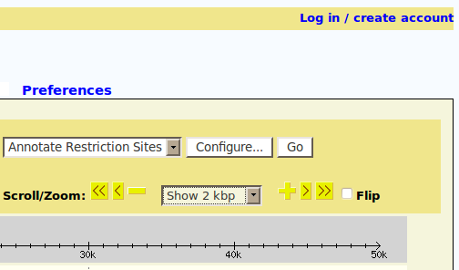

# GBrowse User Database

From GMOD

Jump to: [navigation](#mw-navigation), [search](#p-search)

[GBrowse](GBrowse.1 "GBrowse") has the option to use a database to
manage users, so that a user may save their session for use on multiple
computers and associate files with one specific user. Users can sign up
using a username, password and e-mail, or they can also associate their
<a href="http://openid.net/" class="external text"
rel="nofollow">OpenID</a> with a username. Currently, GBrowse supports
<a href="http://www.sqlite.org/" class="external text"
rel="nofollow">SQLite</a>, <a
href="http://www.oracle.com/technology/products/berkeley-db/index.html"
class="external text" rel="nofollow">Berkeley DB</a> and
<a href="http://www.mysql.com/" class="external text"
rel="nofollow">MySQL</a> as backends.

## Contents

- [1
  Setup](#Setup)
  - [1.1 To use
    SQLite](#To_use_SQLite)
  - [1.2 To use
    MySQL](#To_use_MySQL)
  - [1.3 User
    Accounts Flag](#User_Accounts_Flag)
- [2 Database
  Schema](#Database_Schema)
  - [2.1
    Users](#Users)
    - [2.1.1 OpenID
      Users](#OpenID_Users)
    - [2.1.2
      Sessions](#Sessions)
    - [2.1.3
      DBInfo](#DBInfo)
- [3
  Errors](#Errors)
  - [3.1 Access
    Denied](#Access_Denied)
  - [3.2 Unable to
    Find Table](#Unable_to_Find_Table)
- [4
  Confirmation](#Confirmation)

## Setup

To use the user database, you will need to install the
<a href="http://search.cpan.org/~gbarr/libnet-1.22/Net/SMTP.pm"
class="external text" rel="nofollow">Net::SMTP</a> and
<a href="http://search.cpan.org/~nanis/Crypt-SSLeay-0.58/lib/Net/SSL.pm"
class="external text" rel="nofollow">Net::SSL</a> modules from
<a href="http://search.cpan.org/" class="external text"
rel="nofollow">CPAN</a>. OpenID login will also need the <a
href="http://search.cpan.org/~mart/Net-OpenID-Consumer-1.03/lib/Net/OpenID/Consumer.pm"
class="external text" rel="nofollow">Net::OpenID::Consumer</a> module -
OpenID is optional in GBrowse 2.20 or later.

### To use SQLite

SQLite doesn't require much setup, you just need to decide on a location
to store the database file.

To configure your GBrowse.conf file to use a SQLite database, uncomment
(remove the preceding \#) the line that starts with "user_account_db"
(without quotes), or add this section if it is not there. Specify the
location of the .sqlite file to be used. Remember to grant permissions
for GBrowse to read and write to this file. As well, due to the design
of SQLite, you will have to grant permissions for GBrowse to write to
the folder *holding* the .sqlite file, as SQLite creates a temporary
file in that folder before any writes are made, and needs the
permissions to do so.

    # Path to the database -- you will need to create this database and grant all
    # privileges on it to the indicated user.
    # user_account_db        = DBI:SQLite:/path/to/your/database.sqlite

### To use MySQL

For MySQL, ensure that the MySQL server is up and running, and that you
have the administrator username and password handy. You'll also need the
name of the user you want to connect with; the default value is
"gbrowse" for both username and password, but you can specify your own
if you wish.

To configure your GBrowse.conf file to use a MySQL database, uncomment
(remove the preceding \#), or add if it's not there, this line (for
"user_account_db") and specify the connection details as indicated.
Change the user and/or password fields as needed.

    # user_account_db        = DBI:mysql:gbrowse_login;user=gbrowse;password=gbrowse

### User Accounts Flag

Once the configuration option has been set, the "user accounts" switch
to enable the user database must be turned on (set from 0 to 1).

    ####### User Account Registration Database ######
    # If "user accounts" is true, then we will try to use
    # a user registration database
    user accounts          = 0

## Database Schema

The database is named "gbrowse_login" and is made up of three tables,
**users**, **openid_users** and **sessions**. The first three are used
to store information about users, registered, OpenID, or otherwise. An
additional **dbinfo** table holds information regarding the version of
the schema we are currently using. Additional tables are included in the
database, and are part of the user uploads system.

### Users

This table holds all the users, regardless of whether they signed up
using their OpenID or a username. It stores the following information:

| Field | Type | Description |
|----|----|----|
| userid | integer not null PRIMARY KEY auto_increment | A unique user ID. |
| email | varchar(64) not null UNIQUE | An e-mail for confirmation & notification. |
| pass | varchar(32) not null | An encrypted password (not stored as plain text). |
| remember | boolean not null | Whether to remember the user at this location or not. |
| openid_only | boolean not null | Was registered with an OpenID or no? |
| confirmed | boolean not null | Has been confirmed? |
| cnfm_code | varchar(32) not null | Confirmation code. |
| last_login | timestamp not null | Date & time of last login. |
| created | datetime not null | Date & time created. |

#### OpenID Users

This table holds all openIDs associated with users.

| Field      | Type                              | Description            |
|------------|-----------------------------------|------------------------|
| userid     | integer not null                  | A unique user ID.      |
| openid_url | varchar(128) not null PRIMARY key | The URL of the openID. |

#### Sessions

This table holds all registered sessions. In order for a user to add
public files, have files shared with them, or upload files, they need to
be assigned a user ID and a record in this table.

| Field | Type | Description |
|----|----|----|
| userid | integer not null PRIMARY KEY auto increment | A unique user ID. |
| username | varchar(32) | A username, assigned on registration so the user can login. Anonymous users have "an anonymous user" as their username. |
| sessionid | char(32) not null UNIQUE | The 32-bit hexadecimal ID corresponding to their session. |
| uploadsid | char(32) not null UNIQUE | The 32-bit hexadecimal ID corresponding to their uploads folder. |

#### DBInfo

This table holds the version number of the current database schema. It's
used in upgrading from older schemas, without losing information.

| Field | Type | Description |
|----|----|----|
| schema_version | int(10) not null UNIQUE | The version number of the current schema. |

## Errors

### Access Denied

If you receive an "Access denied for user 'www-data'@'localhost' (using
password: NO)" error, then the "www-data" user (or whatever user has
been given by the error) has not been granted access to the database by
the administrator. It could also be that the database connection program
is not using the credentials as specified in GBrowse.conf. A fix for
this error is to grant permissions for the user on your database, by
having the database administrator run the following SQL command:

    GRANT ALL PRIVILEGES
    ON gbrowse_login.*
    TO 'www-data'@'localhost' identified by "";

If you wish to use another user, simply replace "www-data" with the user
of your choice. If you wish to use a password, enter it between the
quotes after 'identified by ""'.

### Unable to Find Table

If you receive an error saying that the database cannot find the table
specified, your schema is probably incorrect (or hasn't been created at
all). The gbrowse_metadb_config.pl script should correct any schema
errors regarding the database (assuming the credentials are correct in
your Gbrowse.conf file), simply run it as root (**sudo perl
gbrowse_metadb_config.pl**) and that should fix any errors.

## Confirmation

If everything has been set up properly, you will see a "Log in / create
account" link on the top-right corner of the screen:

\[\[Category:\]\]

Retrieved from
"<http://gmod.org/mediawiki/index.php?title=GBrowse_User_Database&oldid=16352>"

[Categories](Special:Categories "Special:Categories"):

- [GBrowse](Category:GBrowse "Category:GBrowse")
- [Documentation](Category:Documentation "Category:Documentation")
- [HOWTO](Category:HOWTO "Category:HOWTO")
- [GBrowse
  Developer](Category:GBrowse_Developer "Category:GBrowse Developer")

## Navigation menu

### Namespaces

- <a
  href="http://gmod.org/mediawiki/index.php?title=Talk:GBrowse_User_Database&amp;action=edit&amp;redlink=1"
  accesskey="t"
  title="Discussion about the content page [t]">Discussion</a>

### 

### Variants

### Navigation

- [GMOD Home](Main_Page)
- [Software](GMOD_Components)
- [Categories /
  Tags](Categories)

### Documentation

- [Overview](Overview)
- [FAQs](Category:FAQ)
- [HOWTOs](Category:HOWTO)
- [Glossary](Glossary)

### Community

- [GMOD News](GMOD_News)
- [Training /
  Outreach](Training_and_Outreach)
- [Support](Support)
- [GMOD Promotion](GMOD_Promotion)
- [Meetings](Meetings)
- [Calendar](Calendar)

### Tools

- <a href="Special%3ABrowse/GBrowse_User_Database" rel="smw-browse">Browse
  properties</a>

- Last updated at 22:41 on 29 December
  2010.
<!-- - 161,028 page views. -->
- Content is available under
  <a href="http://www.gnu.org/licenses/fdl-1.3.html" class="external"
  rel="nofollow">a GNU Free Documentation License</a> unless otherwise
  noted.

<!-- -->

- [About
  GMOD](GMOD:About "GMOD:About")

<!-- -->

