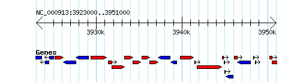
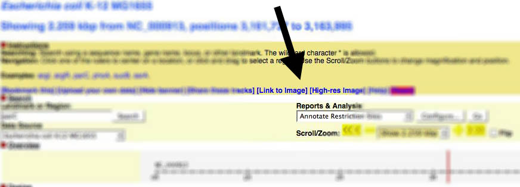
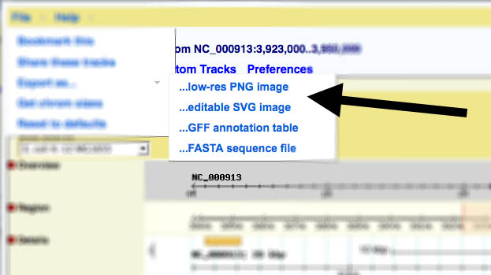

# GBrowse img

From GMOD

Jump to: [navigation](#mw-navigation), [search](#p-search)

**gbrowse_img** - CGI script to generate genome images via the
<a href="Gbrowse.1" class="mw-redirect" title="Gbrowse">Generic Genome
Browser</a>

## Contents

- [1
  Description](#Description)
- [2
  Examples](#Examples)
  - [2.1 Simple
    Example](#Simple_Example)
  - [2.2 More
    complex](#More_complex)
  - [2.3 Listing
    Sources](#Listing_Sources)
  - [2.4 Listing
    Types](#Listing_Types)
- [3 CGI
  arguments](#CGI_arguments)
  - [3.1
    Image-maps](#Image-maps)
- [4 Generating
  from inside Gbrowse](#Generating_from_inside_Gbrowse)
  - [4.1 Gbrowse
    v1.x](#Gbrowse_v1.x)
  - [4.2 Gbrowse
    v2.x](#Gbrowse_v2.x)
- [5 Known
  Bugs](#Known_Bugs)
- [6
  Author](#Author)
- [7 Mediawiki
  Extension](#Mediawiki_Extension)
- [8 See
  Also](#See_Also)

## Description

This CGI script is an interface to the Generic Genome Browser for the
purpose of retrieving dynamic images of a region of the genome. It can
be used as the destination of an \ tag like this:

    

The script can also be used to superimpose one or more external features
onto the display, for example for the purpose of displaying BLAST hits,
an STS or a knockout in the context of the genome. It is designed to use
a URL-based API to draw or embed [GBrowse](GBrowse.1 "GBrowse") images
without loading the full genome browser interface. gbrowse_img can be
used to embed Gbrowse images in other webpages or to create
high-resolution images appropriate for publications.

## Examples

Gbrowse 2.26 with the *Escherichia coli* K-12 MG1655 genome (from bp
3923000 to 3950999) has been used to generate the following figures.
Also note that the URLs have been
<a href="http://en.wikipedia.org/wiki/Percent-encoding"
class="external text" rel="nofollow">encoded</a>. Please be aware that
your version of Gbrowse may operate slightly different based on its
version.

### Simple Example

<a
href="http://heptamer.tamu.edu/cgi-bin/gb2/gbrowse_img/MG1655/?name=NC_000913:3923000..3951000;l=Genes%1Elandmarks:overview%1EGenes:region%1Elandmarks:region;width=400;format=GD"
class="external free"
rel="nofollow">http://heptamer.tamu.edu/cgi-bin/gb2/gbrowse_img/MG1655/?name=NC_000913:3923000..3951000;l=Genes%1Elandmarks:overview%1EGenes:region%1Elandmarks:region;width=400;format=GD</a>;

### More complex

<a
href="http://heptamer.tamu.edu/cgi-bin/gb2/gbrowse_img/MG1655/?name=NC_000913:3923000..3951000;l=Genes%1EDNA%1ERegulonDBtu%1ESigma70%1Elandmarks:overview%1EGenes:region%1Elandmarks:region;width=800;id=20736090abb824610d9d3bc89c8b4256;format=GD;keystyle=between;grid=1"
class="external free"
rel="nofollow">http://heptamer.tamu.edu/cgi-bin/gb2/gbrowse_img/MG1655/?name=NC_000913:3923000..3951000;l=Genes%1EDNA%1ERegulonDBtu%1ESigma70%1Elandmarks:overview%1EGenes:region%1Elandmarks:region;width=800;id=20736090abb824610d9d3bc89c8b4256;format=GD;keystyle=between;grid=1</a>

  

### Listing Sources

You can get a list of sources (genomes, chromosomes, *etc.*), by setting
the **list** parameter to *sources* like so:

    http://heptamer.tamu.edu/cgi-bin/gb2/gbrowse_img/MG1655/?list=sources

    ## Sources
    ATCC_8739
    BL21
    BL21_DE3
    BL21_Gold_DE3
    BW2952
    DH10B
    MG1655
    etc.

### Listing Types

To get a list of available tracks (the **type** parameter), set the
**list** parameter to *types* like so:

    http://heptamer.tamu.edu/cgi-bin/gb2/gbrowse_img/MG1655/?list=types

    ## Feature types for source MG1655
    Genes   Genes   default
    TranslationF    3-frame translation (forward)
    TranslationR    3-frame translation (reverse)
    DNA DNA/GC Content
    Protein
    rRNA_Operons
    RegulonDBtu RegulonDB txn units default
    Cryptic_Prophage    cryptic prophage    default
    etc.

## CGI arguments

The script recognizes the following CGI arguments, which can be passed
either as GET or POST argument=value pairs. Argument pairs must be
separated by semicolons (preferred) or by ampersands. Many of the
options have one-letter aliases that can be used to reduce URL lengths.

| Argument | Alias | Description |
|----|----|----|
| name | q | genomic landmark or range |
| dbid |   | database ID for disambiguating names |
| type | t | tracks to include in image |
| width | w | desired width of image |
| options | o | list of track options (compact, labeled, etc) |
| abs | b | display position in absolute coordinates |
| add | a | added feature(s) to superimpose on the image |
| style | s | stylesheet for additional features |
| keystyle | k | where to place the image key |
| overview |   | force an overview-style display |
| flip | f | flip image left to right |
| grid |   | turn grid on (1) or off (0) |
| embed |   | generate full HTML for image and imagemap for use in an embedded frame |
| format |   | format for the image (use "SVG" for scaleable vector graphics) |
| list |   | get certain types of configuration information |
| source |   | database name |

The arguments are explained in more detail here:

name / q  
This argument specifies the region of the genome to be displayed.
Several forms are recognized:

- *name=Landmark*
  Display the landmark named "Landmark". Valid landmark names include
  chromosomes, contigs, clones, STSs, predicted genes, and any other
  landmark that the administrator has designated. Be careful when
  fetching large landmarks such as whole chromosomes!
- *name=Landmark:start..end*
  Display the region between *start* and *end* relative to "Landmark".
- *name=Class:Landmark*
  Display "Landmark", restricting to a particular class, such as
  "PCR_Product". The list of classes is under the control of the
  database administrator and is not yet available through this
  interface.
- *name=Class:Landmark:start..end*
  As above, but restricted to the designated range.

If you use multiple **name** options, then this script will generate an
overview image showing the position of each landmark. The alias "q" can
be used to shorten the length of the URL.

<!-- -->

dbid  
If the data source contains multiple defined databases, this argument is
required to uniquely identify landmarks that may appear in multiple
databases under different names. If not present, the standard search
algorithm is used. Use the symbolic database name indicated in the
source configuration file. For example if the database stanza is
"\[scaffolds:database\]" then pass "dbid=scaffolds".

<!-- -->

type /t  
This argument lists the feature types to display. The value of this
argument is a list of track names separated by spaces ("+" characters
when L-escaped). For example:

    http://www.wormbase.org/db/seq/gbrowse_img/elegans?name=mec-3&type=tRNA+NG+WABA+CG+ESTB

Multiple *type=* arguments will be combined to form a single
space-delimited list. The alias "t" can be used to shorten the length of
the URL.

If the track name has a space in it, put quotes around the name:

    type="microbe tRNA"+NG+WABA+CG+ESTB

<!-- -->

width / w  
Width of the desired image, in pixels.

<!-- -->

options / o  
A space-delimited list ("+" characters when URL-escaped) of
mnemonic/option pairs describing how features should be formatted.
Options are integers from 0 to 3, where 0=auto, 1=compact, 2=expanded,
3=expanded and labeled. For example, to specify that the tRNA and NG
tracks should always be expanded and labeled, but that the WABA track
should be compact, use:

    options=tRNA+3+NG+3+WABA+1

The alias "o" can be used to shorten the length of the URL.

<!-- -->

add / a  
Superimpose one or more additional features on top of the view. Features
are specified as space ("+") delimited lists in the following format:

    add=Landmark+Type+Name+start..end,start..end,start..end

"Landmark" is the landmark name, "Type" is a descriptive type that will
be printed in the image caption, "Name" is a name for the feature to be
printed above it, and start..end is a comma-delimited list of ranges for
discontinuous feature. Names that contain white space must be quoted,
for example "BLAST hit". Note that this all has to be URL-escaped, so an
additional feature named "Your sequence", type "Blast Hit", that is
located on chromosome III in a gapped range between 20000 and 22000,
will be formatted as:

    add=III+%22Blast%20Hit%22+%22Your%20Sequence%22+20000..21000,21550..22000

One or both of the type and name can be omitted. If omitted, type will
default to "Your Features" and the name will default to "Feature XX"
where XX is an integer. This allows for a very simple feature line:

    add=III+20000..21000,21550..22000

Multiple *add=* arguments are allowed. The alias "a" can be used to
shorten the length of the URL.

<!-- -->

style  
The style argument can be used to control the rendering of additional
features added with "add". It is a flattened version of the style
configuration sections described in
<a href="http://www.wormbase.org/db/seq/gbrowse?help=annotation"
class="external text" rel="nofollow">this document</a>. For example, if
you have added a "Blast Hit" annotation, then you can tell the renderer
to use a red arrow for this glyph in this way:

    style=%22Blast%20Hit%22+glyph=arrow+fgcolor=red

<!-- -->

keystyle / k  
Controls the positioning of the track key. One of "right", "left",
"between" (default) or "bottom"

<!-- -->

overview  
Ordinarily the image will show the detail panel if the query region
corresponds to a single region, and the overview panel if multiple
regions match (or if a region that is too large to show matches).
Setting overview=1 will force the overview to be shown in all cases.

<!-- -->

flip / f  
Flip the image left to right. Arguments are 0=don't flip (default), and
1=flip.

<!-- -->

embed  
Generate image and a corresponding HTML imagemap in a form suitable for
embedding into a frame.

  

format  
Specify the format for the image file. Either "GD" (the default) or
"GD::SVG" for scaleable vector graphics.

<!-- -->

list  
If this argument is present, it will cause the script to dump out
various types of information in plain text form. Currently the two
values for this argument are *sources*, to dump out the list of data
sources, and *types*, to dump out the list of connfigured types. For
*list=sources*, the script will return a simple text list of the data
source names. For *list=types*, the script will return a three-column
tab-delimited list giving the track names and feature types
corresponding to the currently-selected data source. The format is as
follows:

    Mnemonic <tab> Full description of feature <tab> [default]

The third column contains the word "default" if the track will be shown
by default when no *type* argument is provided.

<!-- -->

source  
This argument specifies the data source for the images. The list of
sources can be found using *list=sources*. See also the
[GBrowse_2.0_HOWTO#Configured_Data_Source_Sections configured data
source
sections](GBrowse_2.0_HOWTO#Configured_Data_Source_Sections_configured_data_source_sections "GBrowse 2.0 HOWTO")
in the GBrowse 2 guide.

<!-- -->

h_feat  
The name of a feature to highlight in the format
*feature_name*@*color_name*

Example:

    h_feat=SKT5@blue

You may omit "@color", in which case the highlight will default to
yellow. You can specify multiple h_feat arguments in order to highlight
several features with distinct colors.

<!-- -->

h_region  
The name of a region to highlight in a solid background color, in the
format *sequence_name*:*start*..*end*@*color_name*

Example:

    h_region=Chr3:200000..250000@wheat

You may omit "@color", in which case the highlighted region will default
to lightgrey. You can specify multiple h_region arguments in order to
highlight several regions with distinct colors.

#### Image-maps

If you wish to associate the image with an imagemap so that clicking on
a feature takes the user to the destination configured in the gbrowse
config file, you may do so by placing the URL in an \<iframe\> section
and using the *embed=1* flag:

    <iframe src="http://localhost/cgi-bin/gbrowse_img/elegans?name=B0001;embed=1" width="100%" height="250">
       
    </iframe>

Placing an \ tag inside the \<iframe\> tag arranges for older
browsers that don't know about iframes to display the static image
instead. You may need to adjust the width and height attributes in order
to avoid browsers placing scrollbars around the frame.

## Generating from inside Gbrowse

### Gbrowse v1.x

You can find a link to generate images from within Gbrowse near the top
of the page:

  

### Gbrowse v2.x

In version 2, the link to generate images has been moved to the file
menu:

  

## Known Bugs

The cookie that stores the configuration options for plugins does not
transfer from gbrowse to gbrowse_img, so tracks generated by annotation
plugins, such as the Restriction site annotator, will not display
correctly when the image URL is generated on one machine and then viewed
on another. Uploaded files will transfer correctly, however.

## Author

\[mailto: lstein@cshl.org Lincoln Stein\] Copyright (c) 2002-2004 Cold
Spring Harbor Laboratory

This library is free software; you can redistribute it and/or modify it
under the same terms as Perl itself.

## Mediawiki Extension

The <a href="http://www.mediawiki.org/wiki/GBrowseImage"
class="external text">GbrowseImage extension</a> for Mediawiki will
display an image (rendered by gbrowse_img) in a wiki-page.

## See Also

- <a href="Gbrowse.1" class="mw-redirect" title="Gbrowse">Gbrowse</a>

Retrieved from
"<http://gmod.org/mediawiki/index.php?title=GBrowse_img&oldid=22634>"

[Categories](Special:Categories "Special:Categories"):

- [Documentation](Category:Documentation "Category:Documentation")
- [GBrowse](Category:GBrowse "Category:GBrowse")
- [GMOD Components](Category:GMOD_Components "Category:GMOD Components")

## Navigation menu

### Namespaces

- <a href="GBrowse_img" accesskey="c"
  title="View the content page [c]">Page</a>
- <a
  href="http://gmod.org/mediawiki/index.php?title=Talk:GBrowse_img&amp;action=edit&amp;redlink=1"
  accesskey="t"
  title="Discussion about the content page [t]">Discussion</a>

### 

### Variants

### Navigation

- [GMOD Home](Main_Page)
- [Software](GMOD_Components)
- [Categories /
  Tags](Categories)
- [View all pages](Special:AllPages)

### Documentation

- [Overview](Overview)
- [FAQs](Category:FAQ)
- [HOWTOs](Category:HOWTO)
- [Glossary](Glossary)

### Community

- [GMOD News](GMOD_News)
- [Training /
  Outreach](Training_and_Outreach)
- [Support](Support)
- [GMOD Promotion](GMOD_Promotion)
- [Meetings](Meetings)
- [Calendar](Calendar)

### Tools

- <a href="Special:WhatLinksHere/GBrowse_img" accesskey="j"
  title="A list of all wiki pages that link here [j]">What links here</a>
- <a href="Special:RecentChangesLinked/GBrowse_img" accesskey="k"
  title="Recent changes in pages linked from this page [k]">Related
  changes</a>
- <a href="Special:SpecialPages" accesskey="q"
  title="A list of all special pages [q]">Special pages</a>
- <a
  href="http://gmod.org/mediawiki/index.php?title=GBrowse_img&amp;printable=yes"
  rel="alternate" accesskey="p"
  title="Printable version of this page [p]">Printable version</a>
- [Permanent
  link](http://gmod.org/mediawiki/index.php?title=GBrowse_img&oldid=22634 "Permanent link to this revision of the page")
- [Page
  information](http://gmod.org/mediawiki/index.php?title=GBrowse_img&action=info)
- <a href="Special:Browse/GBrowse_img" rel="smw-browse">Browse
  properties</a>
- [Print as
  PDF](http://gmod.org/mediawiki/index.php?title=Special:PdfPrint&page=GBrowse_img)

- Last updated at 22:02 on 12 December
  2012.
- 109,784 page views.
- Content is available under
  <a href="http://www.gnu.org/licenses/fdl-1.3.html" class="external"
  rel="nofollow">a GNU Free Documentation License</a> unless otherwise
  noted.

<!-- -->

- [About
  GMOD](GMOD:About "GMOD:About")

<!-- -->

- 
- 
  

